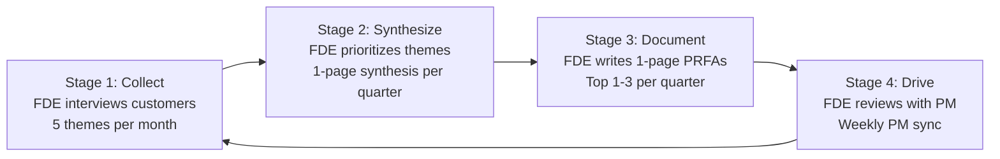

# Forward Deployed Engineer Playbook
## Chapter 4

# The Product Edge

> *"The FDE lives at two edges: the customer edge (Ch 3) and the product edge. The product edge is where the customer's feedback meets the company's product. The FDE's job is to be the most-informed person at the company about what the product needs to become."*

---

## 1. Epigraph

_The FDE lives at two edges: the customer edge (Ch 3) and the product edge. The product edge is where the customer's feedback meets the company's product. The FDE's job is to be the most-informed person at the company about what the product needs to become._

---

## 2. Problem

You are an FDE at acme-corp. The PM has just told you: "We have 8 product feedback themes from your customer interviews. I need them prioritized into 1-page PRFAs. The product roadmap is locked for Q4 2026. I have 30 days to make the Q1 2027 roadmap decisions. The CEO wants the top 3 themes in 7 days. The Director wants the bottom 5 themes deferred or killed. You have 7 days to synthesize the 8 themes into 1-page PRFAs."

You have 7 days to turn 8 customer feedback themes into 1-page PRFAs, prioritize them, and decide what to defer. This chapter tells you what the product edge is, how to drive the feedback loop, and how to write a 1-page PRFA.

**Decision in one sentence:** _The product edge is where the customer's reality meets the company's product strategy; the FDE's job is to own the customer feedback synthesis, write 1-page PRFAs, and be the most-informed person at the company about what the product needs to become._

---

## 3. Why FDEs Fail Here

Five named failure modes of FDEs who lost the product edge.

- **The Verbal-Only-Product-Feedback Failure.** The FDE gives the PM feedback based on what the customer says, not what they mean. _The PM gets the wrong feedback._
- **The No-PRFA Failure.** The FDE gives the PM verbal feedback only, no 1-page PRFA. _The PM can't prioritize without a 1-pager._
- **The Bottom-Up-Feedom Failure.** The FDE surfaces 8 themes without prioritization. _The PM is overwhelmed, no action is taken._
- **The Quarterly-Feedback-Dump Failure.** The FDE surfaces feedback once per quarter. _The PM has stale feedback. The feedback is too late._
- **The No-Decision-Ownership Failure.** The FDE surfaces feedback but doesn't own the decision. _The PM gets confused about who decides. The feedback dies in limbo._

---

## 4. Mental Models

Four mental models that compress the product edge.

**Mental model 1: The 4 Stages of the Feedback Loop.** Feedback has 4 stages.



**The 4 stages:**
- **Stage 1: Collect.** FDE interviews customers. 5 themes per month.
- **Stage 2: Synthesize.** FDE prioritizes themes. 1-page synthesis per quarter.
- **Stage 3: Document.** FDE writes 1-page PRFAs. Top 1-3 per quarter.
- **Stage 4: Drive.** FDE reviews with PM. Weekly PM sync.

**Mental model 2: The 5-Theme Quota.** The FDE tracks 5 themes per month.

```
5 themes / month = 60 themes / year

The 5-theme quota is the discipline. The FDE who
surfaces 1 theme per month has insufficient signal.
The FDE who surfaces 20 themes per month has too
much signal. The 5-theme quota is the rule.

The 5 themes per month are:
1. 1 from a strategic customer (high priority)
2. 1 from a growth customer (medium priority)
3. 1 from a maintain customer (low priority)
4. 1 from a customer interview (qualitative)
5. 1 from a customer deployment (quantitative)

The 5 themes feed the 1-page synthesis per quarter.
The synthesis feeds the 1-page PRFAs per quarter.
The PRFAs feed the roadmap per quarter.
```

**Mental model 3: The 1-Page PRFA Anatomy.** A 1-page PRFA has 7 parts.

```
1. Problem (1 sentence, in customer's words)
2. Customer impact ($XM or N customers)
3. Current workaround (what the customer does today)
4. Proposed solution (1 paragraph)
5. Alternatives considered (2-3)
6. Recommendation (the 1 thing to build)
7. Effort estimate (S/M/L, weeks)

The 1-page PRFA is the FDE's contribution to the
roadmap. The PM takes the 1-page PRFAs and turns them
into roadmap items. The PM may merge, split, or defer.
The FDE's job is to provide the 1-page, not to own
the roadmap.
```

**Mental model 4: The 4 Customer Signals → Product Themes.** Each customer signal maps to a product theme.

```
Customer signal → Product theme
1. Champion goes quiet → Customer success health
2. End user adoption is low → Onboarding/UX
3. Decision-maker asks for ROI → Analytics/reporting
4. Technical evaluator escalates → Reliability/quality

The 4 signals (from Ch 3) → 4 product themes. The FDE
who tracks both customer health (Ch 3) and product
themes (Ch 4) has the full feedback loop.
```

---

## 5. Frameworks

Three frameworks for the product edge.

### Framework 1: The 1-Page Product Feedback Synthesis

```
# Product Feedback Synthesis — Q[N] [YEAR] — [FDE Name]

## The 5 themes (this quarter)
1. [Theme 1] — [Frequency: N/5 customers] — [Severity: HIGH]
2. [Theme 2] — [Frequency] — [Severity]
3. [Theme 3]
4. [Theme 4]
5. [Theme 5]

## The top 3 prioritized items
1. [Item 1] — [Why now] — [Customer impact: $XM or N customers]
2. [Item 2] — [Why now]
3. [Item 3] — [Why now]

## The 2-3 items deferred to next quarter
1. [Item 1] — [Why deferred]
2. [Item 2]

## The 1 thing the product team should NOT do
[1 sentence on the worst thing the product team could do based on the feedback.]

## The 3 customer signals (from Ch 3)
1. [Signal 1] — [Product theme it maps to]
2. [Signal 2]
3. [Signal 3]
```

### Framework 2: The 1-Page PRFA Template

```
# 1-Page PRFA — [Theme] — [Date]

## sub1. Problem (1 sentence, in customer's words)
[1 sentence on what the customer is trying to do and what's blocking them.]

## sub2. Customer impact ($XM or N customers)
[Quantified impact. E.g., "5 customers, $1.2M ARR, 3-month delay in deployment."]

## sub3. Current workaround
[What the customer does today. E.g., "Customer uses a deprecated OAuth flow."]

## sub4. Proposed solution (1 paragraph)
[1 paragraph on the proposed solution. 2-3 sentences.]

## sub5. Alternatives considered
- [Alternative 1]: [Pros/cons]
- [Alternative 2]: [Pros/cons]
- [Alternative 3]: [Pros/cons]

## sub6. Recommendation
[The 1 thing to build.]

## sub7. Effort estimate (S/M/L, weeks)
[S/M/L. Estimated weeks. E.g., "M (3 weeks)."]
```

### Framework 3: The Weekly PM Sync Agenda

```
# Weekly PM Sync Agenda — [Date]

## 5 min: Customer highlights
- 1 customer win this week
- 1 customer at risk this week

## 15 min: Feedback themes
- New themes this week (N)
- Updated themes (priority changes, customer count)
- Top 3 prioritized items (status: in PRFA, in review, in roadmap)

## 10 min: 1-page PRFA progress
- Which PRFAs are in progress
- Which are in review
- Which are merged/split/deferred

## 5 min: Open questions
- 1-3 questions for the PM

## 5 min: Decisions needed
- 1-3 decisions to make this week
```

---

## 6. Drill

You are an FDE at **acme-corp**. The PM has given you 7 days to synthesize 8 customer feedback themes into 1-page PRFAs.

```
8 customer feedback themes from your last quarter:
1. Auth integration with SSO is hard (5 customers, $1.5M ARR impact)
2. Custom data connectors take 3+ weeks (3 customers, 3-week delay)
3. Customer-facing observability is opaque (2 customers, retention risk)
4. Mobile UI crashes on Android (2 customers, NPS -10)
5. Pricing model is unclear (3 customers, renewal risk)
6. API rate limits are too low (4 customers, deployment blockers)
7. SAML migration guide is missing (3 customers, $800K ARR)
8. Audit log retention is too short (1 customer, compliance)
```

You have **90 minutes**. Produce the **product feedback synthesis + 1-page PRFAs** (`portfolio/chapter-04-product-edge.md`) using Framework 1 (Synthesis) + Framework 2 (PRFA Template) + Framework 3 (PM Sync Agenda). Specify:

- The 1-page product feedback synthesis (5 themes, top 3 prioritized, deferred, the 1 thing NOT to do, 3 customer signals).
- 3 1-page PRFAs (top 3 prioritized: auth integration, custom data connectors, customer-facing observability).
- The weekly PM sync agenda (5 sections, 30 min).
- The 1 thing you'll say to the PM in the first weekly sync.
- The 3 things you'll do to avoid the 5 failure modes.

**Deliverable:** `portfolio/chapter-04-product-edge.md` — under 1500 words.

---

## 7. Worked Example

**The 1-page product feedback synthesis:**

```
# Product Feedback Synthesis — Q3 2026 — FDE Name

## The 5 themes (this quarter)
1. Auth integration with SSO is hard — 5/5 customers — HIGH
2. Custom data connectors take 3+ weeks — 3/5 customers — HIGH
3. API rate limits are too low — 4/5 customers — HIGH
4. Customer-facing observability is opaque — 2/5 customers — MED
5. SAML migration guide is missing — 3/5 customers — HIGH

## The top 3 prioritized items
1. Auth integration simplification — Why now: 5/5 customers,
   $1.5M ARR impact, blocks 4 of 5 customer deployments.
   PRFA in progress.
2. Custom data connector framework — Why now: 3/5 customers,
   3-week reduction in time-to-deployment. PRFA next.
3. SAML migration guide — Why now: 3/5 customers, $800K
   ARR. PRFA in review with PM.

## The 2-3 items deferred to next quarter
1. Customer-facing observability — Why deferred: not
   blocking deployments (defer to Q1 2027)
2. Pricing model clarification — Why deferred: ownership
   unclear (sales + product)

## The 1 thing the product team should NOT do
Build a custom LLM serving platform before the auth
integration is simplified. The auth blocker impacts
more customers than the LLM platform.

## The 3 customer signals (from Ch 3)
1. Champion goes quiet — Customer success health (need
   customer success monitoring)
2. Decision-maker asks for ROI — Analytics/reporting (need
   customer-facing ROI dashboard)
3. Technical evaluator escalates — Reliability/quality
   (need customer-facing observability)
```

**3 1-page PRFAs (top 3 prioritized):**

```
# 1-Page PRFA — Auth integration simplification — 2026-09-01

## sub1. Problem (1 sentence, in customer's words)
"Our auth integration doesn't work with our SSO. We've
tried 3 times and failed. We're using a deprecated OAuth
flow but can't migrate to SAML 2.0."

## sub2. Customer impact ($XM or N customers)
5/5 customers, $1.5M ARR, 4 of 5 customer deployments
blocked on this issue.

## sub3. Current workaround
Customers use the deprecated OAuth flow, which has
known security issues (no MFA enforcement, no SCIM
provisioning).

## sub4. Proposed solution (1 paragraph)
Build a SAML 2.0 integration that supports Okta,
Azure AD, and Google Workspace out of the box. Provide
a step-by-step migration guide with screenshots. Add a
"test SAML" button in the admin UI so customers can
validate the integration without involving our team.

## sub5. Alternatives considered
- Build Okta-only first: too narrow, 3 of 5 customers
  use Azure AD or Google Workspace
- Custom auth for each customer: too expensive, doesn't
  scale
- Defer to Q4 2026: too late, 4 of 5 deployments are
  blocked

## sub6. Recommendation
Build the SAML 2.0 integration with multi-IdP support
(Okta + Azure AD + Google Workspace). Add the
migration guide + test button.

## sub7. Effort estimate
L (6-8 weeks, 2 engineers)
```

```
# 1-Page PRFA — Custom data connector framework — 2026-09-01

## sub1. Problem (1 sentence, in customer's words)
"Every customer data connector takes 3+ weeks. We need
Snowflake, BigQuery, Redshift, and Postgres — but
each takes a sprint."

## sub2. Customer impact ($XM or N customers)
3/5 customers, 3-week reduction in time-to-deployment.

## sub3. Current workaround
FDEs hand-write each connector (3 weeks per connector,
3-4 customers blocked at any time).

## sub4. Proposed solution (1 paragraph)
Build a connector framework with a standard schema
mapping interface. Each new connector is 1-2 weeks
(instead of 3) because the schema mapping is reusable.
Pre-build the top 4 connectors (Snowflake, BigQuery,
Redshift, Postgres).

## sub5. Alternatives considered
- FDE-only hand-written: doesn't scale beyond 4 customers
- Vendor-only (Fivetran, Airbyte): too expensive, customer
  data sovereignty concerns
- Defer: too late, 3 customers waiting

## sub6. Recommendation
Build the framework + 4 pre-built connectors.

## sub7. Effort estimate
L (6-8 weeks, 2 engineers)
```

```
# 1-Page PRFA — SAML migration guide — 2026-09-01

## sub1. Problem (1 sentence, in customer's words)
"We need a step-by-step guide for migrating from the
deprecated OAuth flow to the new SAML 2.0 integration.
We don't know which IdP we have or how to configure it."

## sub2. Customer impact ($XM or N customers)
3/5 customers, $800K ARR, blocks 3 of 5 customer migrations.

## sub3. Current workaround
Customers ask the FDE for help (1-2 hours per customer).

## sub4. Proposed solution (1 paragraph)
Write a step-by-step guide with screenshots for each
IdP (Okta, Azure AD, Google Workspace). Include a
checklist for the customer's IT admin. Include a
sample SAML metadata XML file.

## sub5. Alternatives considered
- FDE-only: doesn't scale, FDE time is too expensive
- Video tutorial: harder to search, harder to update
- Defer: too late, 3 customers waiting

## sub6. Recommendation
Write the guide with screenshots + checklist + sample XML.

## sub7. Effort estimate
S (1 week, 1 engineer)
```

**The weekly PM sync agenda:**

```
# Weekly PM Sync Agenda — 2026-09-08

## 5 min: Customer highlights
- Win: Customer B's data connector framework is 80% done
- Risk: Customer A's auth integration still blocked

## 15 min: Feedback themes
- New themes this week: 1 (Customer A mentioned mobile
  UI crashes on Android)
- Updated themes: auth integration (5/5 customers now,
  up from 4/5)
- Top 3 prioritized items:
  - Auth integration simplification (PRFA in review)
  - Custom data connector framework (PRFA in progress)
  - SAML migration guide (PRFA merged)

## 10 min: 1-page PRFA progress
- In review: Auth integration simplification
- In progress: Custom data connector framework
- Merged: SAML migration guide (S, 1 week)
- Deferred: Customer-facing observability (Q1 2027)

## 5 min: Open questions
- Q1: Does the auth integration PRFA need security review?
- Q2: Can we share the SAML migration guide publicly?
- Q3: What's the Q1 2027 roadmap decision deadline?

## 5 min: Decisions needed
- D1: Auth integration PRFA — schedule security review
  for this week
- D2: SAML migration guide — share publicly (vs. customer-only)
- D3: Customer-facing observability — defer to Q1 2027
  (PM agrees)
```

**The 1 thing I'll say to the PM in the first weekly sync:**

```
"Here's the product feedback plan for Q3 2026:

  Top 3 prioritized items (PRFAs in progress/review):
  1. Auth integration simplification (5/5 customers, $1.5M
     ARR impact, 6-8 weeks, 2 engineers) — IN REVIEW
  2. Custom data connector framework (3/5 customers, 3-week
     reduction, 6-8 weeks, 2 engineers) — IN PROGRESS
  3. SAML migration guide (3/5 customers, $800K ARR, 1 week,
     1 engineer) — MERGED

  Deferred to Q1 2027: customer-facing observability,
  pricing model clarification.

  The 1 thing the product team should NOT do: build a
  custom LLM serving platform before the auth integration
  is simplified. The auth blocker impacts more customers
  than the LLM platform.

  The 5-theme quota: I'm tracking 5 themes per month,
  synthesizing 5 themes per quarter, writing 1-page PRFAs
  for the top 3.

  This week's decisions:
  - Auth integration PRFA → security review
  - SAML migration guide → share publicly
  - Customer-facing observability → defer to Q1 2027

  The 5-stage feedback loop is on cadence."
```

**The 3 things I'll do to avoid the 5 failure modes:**

```
1. Surface observed + meant customer truth, not just
   verbal. (Avoids the Verbal-Only-Product-Feedback
   Failure.)
   - Every customer call notes: verbal, observed, meant.
   - The PRFA uses "in customer's words" + FDE's
     interpretation.
   - The PM sees both.

2. Write 1-page PRFAs, not just verbal feedback.
   (Avoids the No-PRFA Failure.)
   - Every prioritized item gets a 1-page PRFA.
   - 7 sections: problem, impact, workaround, solution,
     alternatives, recommendation, effort.
   - 1 page, not 5.

3. Drive the feedback loop weekly, not quarterly.
   (Avoids the Quarterly-Feedback-Dump Failure.)
   - Weekly PM sync (30 min, Tuesday).
   - 5 themes tracked monthly.
   - 1-page synthesis quarterly.
   - 1-page PRFAs ongoing.
```

---

## 8. Failure Mode Postmortem

An FDE at a 200-person B2B AI company had 8 customer feedback themes. The FDE's first 7 days: 8 customer calls, 8 verbal feedback notes shared with the PM in Slack. No 1-page synthesis, no 1-page PRFAs.

Within 30 days: 0 product roadmap changes based on the feedback. The PM was overwhelmed with verbal feedback. The themes died in Slack. The customer issues persisted. 1 customer churned.

The PM told the replacement FDE: "I want 1-page PRFAs, not Slack messages. I want 5 themes per month, not 8 themes dumped quarterly. I want the FDE to own the prioritization, not just collect the feedback."

The replacement FDE did 3 things:
1. Built the 1-page synthesis template (used quarterly, 5 themes tracked).
2. Built the 1-page PRFA template (used for top 1-3 prioritized themes).
3. Established the weekly PM sync (Tuesday 30 min, 5 sections).

Within 6 months: 6 PRFAs in review with PM, 2 merged into the roadmap, 0 customer churn. The PM had a clear feedback story. The customer issues were addressed.

What the first FDE missed: the product edge is a system, not Slack messages. The first FDE relied on verbal feedback. The second FDE built a 1-page system. The 1-page system is the leverage.

The lesson: the FDE who has a synthesis template + PRFA template + weekly PM sync has a product edge. The FDE who relies on Slack messages has a feedback dump.

---

## 9. Self-Assessment Rubric

| # | Dimension | 1 (Novice) | 3 (Competent) | 5 (Expert) |
|---|---|---|---|---|
| 1 | **4-stage feedback loop** | 1 stage (collect only) | 2-3 stages | 4 stages, weekly cadence |
| 2 | **5-theme quota** | <5 themes / month | 5 themes / month | 5 themes / month, 60 themes / year, all 4 sources (strategic, growth, maintain, interview, deployment) |
| 3 | **1-page PRFA** | No PRFAs or multi-page | 1-page PRFAs exist, partial | 1-page PRFAs, 7 sections, top 1-3 per quarter |
| 4 | **1-page synthesis** | No synthesis | Synthesis exists, partial | 1-page synthesis, quarterly, 5 themes + top 3 + deferred + the 1 NOT to do |
| 5 | **Weekly PM sync** | No sync or monthly | Weekly sync, partial | Weekly sync, 30 min, 5 sections, decisions documented |

**Disqualifier:** any 1 on dimension 1 or 3. An FDE who only collects feedback or has no PRFAs is in the No-PRFA or Quarterly-Feedback-Dump failure mode.

**Total:** ___ / 25. **Pass threshold:** 18/25, no dimension below 3.

---

## 10. Portfolio Artifact Note

Save your filled-in drill as `portfolio/chapter-04-product-edge.md` — interview evidence for "How do you drive the product feedback loop?" (see Portfolio Map in Chapter 27).

---

## 11. Interview Questions

1. **Walk me through a product feedback loop you've driven.**
2. **The PM ignores your feedback. What do you do?**
3. **You have 8 themes and only 3 PRFAs per quarter. How do you prioritize?**
4. **The customer wants a feature the product team won't build. What do you do?**
5. **Walk me through a 1-page PRFA you've written.**