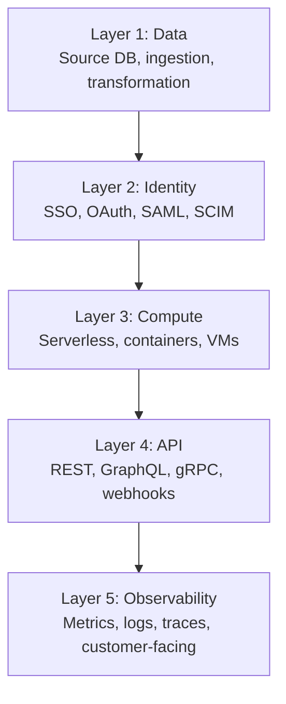

# Forward Deployed Engineer Playbook
## Chapter 5

# The FDE Deployment Stack

> *"The FDE ships in 6-12 weeks. To ship that fast, the FDE needs a deployment stack — the 5 layers from customer data to production deployment that the FDE owns end-to-end."*

---

## 1. Epigraph

_The FDE ships in 6-12 weeks. To ship that fast, the FDE needs a deployment stack — the 5 layers from customer data to production deployment that the FDE owns end-to-end._

---

## 2. Problem

You are an FDE at acme-corp. The Director has just told you: "Customer A wants their data in our platform by Q4 2026. Their data is in Snowflake, 50M rows, 200 columns. They have SSO via Okta with custom SAML. Their infra is AWS us-east-1. They need an API integration with their internal services. We have 8 weeks. We have no existing deployment to this customer. What's the deployment plan?"

You have 8 weeks to design and ship the deployment stack. This chapter tells you what the 5 layers are, how to choose the deployment architecture, and how to ship in 8 weeks.

**Decision in one sentence:** _The FDE deployment stack is a 5-layer system (data, identity, compute, API, observability) chosen per-customer, deployed in 6-12 weeks, owned end-to-end by the FDE; the FDE's job is to design the stack for the customer's specific constraints, ship the stack in 8 weeks, and own the production system until hand-off._

---

## 3. Why FDEs Fail Here

Five named failure modes of FDEs whose deployment stack produced zero results.

- **The 1-Size-Fits-All Failure.** The FDE uses the same stack for every customer. _Customer constraints differ — the stack must be per-customer._
- **The Over-Engineered-Stack Failure.** The FDE builds a custom Kubernetes cluster for a customer with 10 end users. _The stack should match the customer's scale, not the FDE's CV._
- **The No-Ownership Failure.** The FDE builds the stack but doesn't own the production system. _The customer is blocked at 2am when the FDE is on vacation._
- **The No-Migration-Path Failure.** The FDE builds the stack with no path to the customer's existing systems. _The customer's data stays in their warehouse. The integration is fake._
- **The 6-Month-Stack Failure.** The FDE spends 6 months building the stack. _The customer churns before the stack is shipped._

---

## 4. Mental Models

Four mental models that compress the FDE deployment stack.

**Mental model 1: The 5-Layer Deployment Stack.** Every FDE deployment has 5 layers.



**The 5 layers:**
- **Layer 1: Data.** Source DB (Snowflake, BigQuery, Redshift, Postgres). Ingestion. Transformation.
- **Layer 2: Identity.** SSO (Okta, Azure AD, Google Workspace). OAuth. SAML. SCIM provisioning.
- **Layer 3: Compute.** Serverless (Lambda, Cloud Functions). Containers (ECS, GKE, AKS). VMs (EC2).
- **Layer 4: API.** REST. GraphQL. gRPC. Webhooks.
- **Layer 5: Observability.** Metrics. Logs. Traces. Customer-facing dashboards.

**Mental model 2: The 4 Deployment Architecture Patterns.** 4 patterns for the deployment.

```mermaid
%% Figure 5.2 — The 4 deployment patterns
flowchart LR
    P1[Pattern 1: SaaS-only<br/>Customer connects to our SaaS<br/>Fastest (2-4 weeks), lowest cost]
    P2[Pattern 2: Single-tenant SaaS<br/>Customer has their own tenant<br/>4-8 weeks, medium cost]
    P3[Pattern 3: BYOC<br/>Customer's cloud, our code<br/>8-12 weeks, medium cost]
    P4[Pattern 4: On-prem<br/>Customer's data center, our code<br/>12-16 weeks, highest cost]
    P1 --> P2
    P2 --> P3
    P3 --> P4
```

**The 4 patterns:**
- **Pattern 1: SaaS-only.** Customer connects to our SaaS. Fastest (2-4 weeks), lowest cost.
- **Pattern 2: Single-tenant SaaS.** Customer has their own tenant. 4-8 weeks, medium cost.
- **Pattern 3: BYOC (Bring Your Own Cloud).** Customer's cloud, our code. 8-12 weeks, medium cost.
- **Pattern 4: On-prem.** Customer's data center, our code. 12-16 weeks, highest cost.

**Mental model 3: The 3 Customer Constraint Axes.** 3 axes drive the deployment choice.

```
Axis 1: Data sovereignty (must data stay in customer's cloud?)
- Low: SaaS-only is fine
- Medium: BYOC required
- High: On-prem required

Axis 2: Compliance (HIPAA, SOC 2, FedRAMP)
- Low: SaaS-only is fine
- Medium: Single-tenant SaaS required
- High: BYOC or on-prem required

Axis 3: Time-to-deployment (customer urgency)
- Low urgency (>12 weeks): on-prem is fine
- Medium urgency (8-12 weeks): BYOC
- High urgency (<8 weeks): SaaS-only or single-tenant

The 3 axes intersect to define the deployment pattern.
```

**Mental model 4: The 6-12 Week Deployment Timeline.** Ship in 6-12 weeks.

```
Week 1-2: Architecture decision
- Customer constraints gathered (data, identity, compute)
- Architecture decision (4 patterns)
- Customer sign-off on the architecture

Week 3-4: Identity + Data setup
- SSO integration (Okta, Azure AD, Google Workspace)
- Data connector (Snowflake, BigQuery, etc.)
- Test data ingestion

Week 5-6: Compute + API
- Compute setup (serverless, containers, VMs)
- API endpoints (REST, GraphQL, gRPC)
- Integration tests

Week 7-8: Observability + Hand-off
- Observability dashboards (customer-facing)
- Runbook + on-call rotation
- Hand-off to customer's ops team
```

---

## 5. Frameworks

Three frameworks for the FDE deployment stack.

### Framework 1: The 1-Page Deployment Architecture

```
# Deployment Architecture — [Customer] — [Date]

## Customer constraints
- Data sovereignty: [Low / Medium / High]
- Compliance: [SOC 2 / HIPAA / FedRAMP / None]
- Time-to-deployment: [High urgency / Medium / Low]
- Cloud: [AWS / GCP / Azure / On-prem]
- Scale: [N end users, M requests/day]

## Architecture decision
[Pattern 1 / 2 / 3 / 4 — SaaS-only / Single-tenant SaaS / BYOC / On-prem]

## The 5 layers
- Layer 1 (Data): [Snowflake / BigQuery / Redshift / Postgres]
- Layer 2 (Identity): [Okta / Azure AD / Google Workspace]
- Layer 3 (Compute): [Serverless / Containers / VMs]
- Layer 4 (API): [REST / GraphQL / gRPC]
- Layer 5 (Observability): [Datadog / Grafana / Honeycomb]

## Timeline
- Week 1-2: Architecture decision
- Week 3-4: Identity + Data setup
- Week 5-6: Compute + API
- Week 7-8: Observability + Hand-off

## The 1 thing the FDE will push back on
[1 sentence on what the FDE will NOT do.]
```

### Framework 2: The Customer Constraint Matrix

```
# Customer Constraint Matrix — [Customer] — [Date]

## The 3 axes
| Axis | Score (Low/Med/High) | Why |
|------|----------------------|-----|
| Data sovereignty | [Score] | [Why] |
| Compliance | [Score] | [Why] |
| Time-to-deployment | [Score] | [Why] |

## Architecture recommendation
- Low + Low + High urgency: Pattern 1 (SaaS-only)
- Medium + Medium + Medium urgency: Pattern 2 or 3
- High + High + Low urgency: Pattern 4 (On-prem)
- Other combinations: Pattern 2 or 3 (default)

## The trade-offs
- Pattern 1 (SaaS-only): fastest, cheapest, but customer data leaves the customer's cloud
- Pattern 2 (Single-tenant SaaS): medium, customer has own tenant
- Pattern 3 (BYOC): medium, customer has own cloud
- Pattern 4 (On-prem): slowest, most expensive, full data sovereignty

## The 1 thing the FDE will recommend
[Recommendation + 1 sentence on why.]
```

### Framework 3: The 6-12 Week Deployment Plan

```
# Deployment Plan — [Customer] — [Date]

## Week 1-2: Architecture decision
- [ ] Customer constraints gathered
- [ ] Architecture decision (4 patterns)
- [ ] Customer sign-off

## Week 3-4: Identity + Data setup
- [ ] SSO integration (Okta / Azure AD / Google Workspace)
- [ ] Data connector (Snowflake / BigQuery / etc.)
- [ ] Test data ingestion

## Week 5-6: Compute + API
- [ ] Compute setup
- [ ] API endpoints
- [ ] Integration tests

## Week 7-8: Observability + Hand-off
- [ ] Observability dashboards
- [ ] Runbook + on-call rotation
- [ ] Hand-off to customer's ops team

## The 1 thing the FDE will do this week
[1 sentence on the focus this week.]
```

---

## 6. Drill

You are an FDE at **acme-corp**. The Director has given you 8 weeks to ship Customer A's deployment.

```
Customer A constraints:
- Data: Snowflake, 50M rows, 200 columns, in us-east-1
- Identity: Okta with custom SAML, 50 engineers
- Compliance: SOC 2 Type II required
- Scale: 50 end users initially, 500 in 12 months
- Time: 8 weeks (high urgency)
- Cloud: AWS
```

You have **90 minutes**. Produce the **deployment plan** (`portfolio/chapter-05-deployment-stack.md`) using Framework 1 (Deployment Architecture) + Framework 2 (Constraint Matrix) + Framework 3 (6-12 Week Plan). Specify:

- The 1-page deployment architecture (5 layers, architecture decision, timeline, the 1 pushback).
- The customer constraint matrix (3 axes, recommendation, trade-offs, the 1 recommendation).
- The 6-12 week deployment plan (week-by-week checklist, the 1 thing this week).
- The 1 thing you'll say to the Director in the first architecture review.
- The 3 things you'll do to avoid the 5 failure modes.

**Deliverable:** `portfolio/chapter-05-deployment-stack.md` — under 1500 words.

---

## 7. Worked Example

**The 1-page deployment architecture:**

```
# Deployment Architecture — Customer A — 2026-09-01

## Customer constraints
- Data sovereignty: Medium (data in customer's AWS, not on-prem)
- Compliance: SOC 2 Type II required
- Time-to-deployment: High urgency (8 weeks)
- Cloud: AWS us-east-1
- Scale: 50 end users initially, 500 in 12 months

## Architecture decision
Pattern 2 (Single-tenant SaaS) — customer's data stays in
their AWS, our SaaS code runs in a customer-dedicated tenant.

## The 5 layers
- Layer 1 (Data): Snowflake connector (managed ingestion)
- Layer 2 (Identity): Okta SSO + custom SAML
- Layer 3 (Compute): ECS Fargate (serverless containers)
- Layer 4 (API): REST + webhooks
- Layer 5 (Observability): Datadog (customer-facing dashboards)

## Timeline
- Week 1-2: Architecture decision + customer sign-off
- Week 3-4: Identity (Okta) + Data (Snowflake) setup
- Week 5-6: Compute (ECS) + API (REST + webhooks)
- Week 7-8: Observability (Datadog) + Hand-off

## The 1 thing the FDE will push back on
Pattern 3 (BYOC). The customer's data is in AWS but not
on-prem. BYOC adds 4 weeks. Pattern 2 (single-tenant SaaS)
meets the SOC 2 requirement without the BYOC overhead.
```

**The customer constraint matrix:**

```
# Customer Constraint Matrix — Customer A — 2026-09-01

## The 3 axes
| Axis | Score | Why |
|------|-------|-----|
| Data sovereignty | Medium | Data in customer's AWS, not on-prem |
| Compliance | Medium | SOC 2 required (handled by Pattern 2) |
| Time-to-deployment | High urgency | 8 weeks |

## Architecture recommendation
Pattern 2 (Single-tenant SaaS)

## The trade-offs
- Pattern 1 (SaaS-only): fastest but data leaves customer's AWS — REJECTED
- Pattern 2 (Single-tenant SaaS): medium, customer's tenant in our SaaS — RECOMMENDED
- Pattern 3 (BYOC): customer's cloud but +4 weeks — DEFERRED
- Pattern 4 (On-prem): slowest — REJECTED

## The 1 thing the FDE will recommend
Pattern 2 (Single-tenant SaaS). Customer's data stays in
their AWS (via VPC peering), our SaaS code runs in a
customer-dedicated tenant, SOC 2 Type II compliant.
```

**The 6-12 week deployment plan:**

```
# Deployment Plan — Customer A — 2026-09-01

## Week 1-2: Architecture decision
- [x] Customer constraints gathered (Snowflake, Okta, AWS)
- [x] Architecture decision (Pattern 2, single-tenant SaaS)
- [x] Customer sign-off

## Week 3-4: Identity + Data setup
- [ ] SSO integration (Okta SAML 2.0 + custom attributes)
- [ ] Data connector (Snowflake, 50M rows, 200 columns)
- [ ] Test data ingestion (1M sample rows)

## Week 5-6: Compute + API
- [ ] Compute setup (ECS Fargate, 2 tasks)
- [ ] API endpoints (REST: /v1/data, /v1/auth, /v1/webhooks)
- [ ] Integration tests (10 end-to-end scenarios)

## Week 7-8: Observability + Hand-off
- [ ] Observability dashboards (Datadog, customer-facing)
- [ ] Runbook + on-call rotation
- [ ] Hand-off to customer's ops team

## The 1 thing the FDE will do this week
Set up the Okta SAML 2.0 integration with custom
attributes. This is the highest-risk item in the
deployment plan.
```

**The 1 thing I'll say to the Director in the first architecture review:**

```
"Here's the deployment plan for Customer A:

  Architecture: Pattern 2 (single-tenant SaaS)
  Reason: SOC 2 compliant, customer's data stays in AWS,
  ships in 8 weeks (not 12+ weeks for BYOC or on-prem)

  The 5 layers:
  - Layer 1: Snowflake connector (managed ingestion)
  - Layer 2: Okta SSO + custom SAML
  - Layer 3: ECS Fargate (serverless containers)
  - Layer 4: REST + webhooks
  - Layer 5: Datadog (customer-facing dashboards)

  Timeline: 8 weeks
  - W1-2: Architecture (DONE)
  - W3-4: Identity + Data
  - W5-6: Compute + API
  - W7-8: Observability + Hand-off

  Top 3 risks:
  1. Snowflake connector hasn't been tested at 50M rows
     — mitigation: load test in W4
  2. Okta custom SAML is non-standard — mitigation:
     use our standard SAML 2.0 + extension layer
  3. Customer's VPC peering may take 2 weeks — mitigation:
     start VPC peering request this week

  The 1 thing I'll push back on: BYOC. The customer's
  data is in AWS but not on-prem. BYOC adds 4 weeks.
  Pattern 2 meets the SOC 2 requirement without the
  overhead."
```

**The 3 things I'll do to avoid the 5 failure modes:**

```
1. Use Pattern 2 (not 1-Size-Fits-All SaaS-only).
   (Avoids the 1-Size-Fits-All Failure.)
   - Match the customer's constraints (SOC 2 + AWS)
   - Don't default to Pattern 1 just because it's faster
   - Trade-off: 4 extra weeks for SOC 2 + data sovereignty

2. Match the stack to the customer's scale, not the
   FDE's CV. (Avoids the Over-Engineered-Stack Failure.)
   - 50 end users initially → ECS Fargate (not Kubernetes)
   - 500 end users in 12 months → still Fargate
   - Kubernetes is overkill until 5,000+ users

3. Own the production system until hand-off.
   (Avoids the No-Ownership Failure.)
   - FDE is on-call for W7-8 (rotation with customer)
   - Runbook + customer-facing dashboards in W8
   - Hand-off to customer's ops team at W8, not W12
```

---

## 8. Failure Mode Postmortem

An FDE at a 200-person B2B AI company designed a deployment stack for a strategic customer. The FDE used Pattern 1 (SaaS-only) without checking the customer's data sovereignty constraint. The customer's data sovereignty was High (financial services). The deployment failed compliance review. The customer churned.

The replacement FDE did 3 things:
1. Used the customer constraint matrix (3 axes) before choosing the architecture.
2. Matched the stack to the customer's scale (50 users → Fargate, not Kubernetes).
3. Owned the production system until hand-off (FDE on-call for W7-8).

Within 6 months: 4 customer deployments shipped, 0 customer churn. The deployment architecture was chosen per-customer, not 1-size-fits-all.

What the first FDE missed: the deployment architecture is per-customer. The first FDE used a default. The second FDE used a matrix. The matrix is the leverage.

The lesson: the FDE who uses the constraint matrix has the right architecture. The FDE who uses a default has the wrong architecture.

---

## 9. Self-Assessment Rubric

| # | Dimension | 1 (Novice) | 3 (Competent) | 5 (Expert) |
|---|---|---|---|---|
| 1 | **5-layer stack** | 0-2 layers named | 3-4 layers | 5 layers, chosen per-customer |
| 2 | **4 architecture patterns** | 1 pattern only | 2-3 patterns | 4 patterns, chooses per-customer |
| 3 | **3 customer constraint axes** | 0-1 axes checked | 2 axes | 3 axes, scored, mapped to architecture |
| 4 | **6-12 week timeline** | No timeline or >12 weeks | 8-12 weeks | 6-12 weeks, week-by-week checklist |
| 5 | **Architecture decision** | No architecture decision | Decision exists, partial | 1-page architecture doc, customer sign-off, the 1 pushback |

**Disqualifier:** any 1 on dimension 2 or 3. An FDE who knows only 1 pattern or checks 0-1 axes is in the 1-Size-Fits-All or 6-Month-Stack failure mode.

**Total:** ___ / 25. **Pass threshold:** 18/25, no dimension below 3.

---

## 10. Portfolio Artifact Note

Save your filled-in drill as `portfolio/chapter-05-deployment-stack.md` — interview evidence for "How do you design a deployment stack for a customer?" (see Portfolio Map in Chapter 27).

---

## 11. Interview Questions

1. **Walk me through a deployment architecture you've designed.**
2. **The customer wants SaaS-only but data sovereignty is High. What do you do?**
3. **The customer wants 4 weeks but the deployment is Pattern 4. What do you do?**
4. **The customer's data connector doesn't work at scale. What do you do?**
5. **Walk me through a deployment you've shipped in 6-12 weeks.**