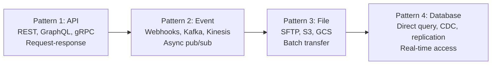

# Forward Deployed Engineer Playbook
## Chapter 8

# Integration Patterns for FDEs

> *"The FDE owns the integration between the customer's systems and our platform. The 4 integration patterns (API, event, file, database), the 3 reliability tiers, the 2 security models, and the 5 integration testing scenarios are the FDE's reference for customer integrations."*

---

## 1. Epigraph

_The FDE owns the integration between the customer's systems and our platform. The 4 integration patterns (API, event, file, database), the 3 reliability tiers, the 2 security models, and the 5 integration testing scenarios are the FDE's reference for customer integrations._

---

## 2. Problem

You are an FDE at acme-corp. Customer A wants to integrate their internal services with our platform. They have 5 internal services (CRM, billing, support, analytics, marketing). They want real-time data sync. They have strict security requirements (no internet egress from their VPC). You have 4 weeks to design the integration.

This chapter tells you the 4 integration patterns, the 3 reliability tiers, the 2 security models, and how to choose.

**Decision in one sentence:** _FDE integration is a 4-pattern system (API, event, file, database) chosen per-customer, deployed with a 3-tier reliability model (best-effort, at-least-once, exactly-once) and a 2-model security architecture (public API, private VPC peering); the FDE's job is to design the integration for the customer's constraints, ship in 4 weeks, and own the production integration._

---

## 3. Why FDEs Fail Here

Five named failure modes of FDEs whose integration produced zero results.

- **The 1-Pattern Failure.** The FDE uses API only, ignoring event/file/database patterns. _The customer has use cases that need other patterns._
- **The No-Reliability-Tier Failure.** The FDE ships best-effort when the customer needs exactly-once. _Data is lost or duplicated._
- **The No-Security Failure.** The FDE exposes the integration over the public internet when the customer requires private VPC peering. _The customer fails compliance review._
- **The No-Retry Failure.** The FDE ships without retry logic. _Transient failures cause permanent data loss._
- **The 3-Month-Integration Failure.** The FDE spends 3 months building the integration. _The customer churns before the integration ships._

---

## 4. Mental Models

Four mental models that compress integration patterns for FDEs.

**Mental model 1: The 4 Integration Patterns.** 4 patterns for customer integrations.



**The 4 patterns:**
- **Pattern 1: API.** REST, GraphQL, gRPC. Request-response.
- **Pattern 2: Event.** Webhooks, Kafka, Kinesis. Async pub/sub.
- **Pattern 3: File.** SFTP, S3, GCS. Batch transfer.
- **Pattern 4: Database.** Direct query, CDC, replication. Real-time access.

**Mental model 2: The 3 Reliability Tiers.** 3 tiers for delivery guarantees.

```
Tier 1: Best-effort
- No guarantee of delivery
- Latency: <1 second
- Cost: lowest
- Use case: logs, metrics, non-critical events

Tier 2: At-least-once
- Guaranteed delivery (with possible duplicates)
- Latency: 1-60 seconds
- Cost: medium
- Use case: business events, transactions

Tier 3: Exactly-once
- Guaranteed delivery, no duplicates
- Latency: 1-60 seconds
- Cost: highest (idempotency + dedup required)
- Use case: financial transactions, billing

The 3 tiers trade off latency vs cost vs complexity.
```

**Mental model 3: The 2 Security Models.** 2 models for integration security.

```
Model 1: Public API
- Integration over the public internet
- Authentication: API keys, OAuth 2.0
- Encryption: TLS 1.3
- Use case: customers with public-facing services

Model 2: Private VPC peering
- Integration over private network (AWS PrivateLink,
  GCP Private Service Connect, Azure Private Link)
- Authentication: mTLS, IAM roles
- Encryption: TLS 1.3 + private network
- Use case: customers with strict security / compliance

The 2 models trade off simplicity vs security.
```

**Mental model 4: The 5 Integration Testing Scenarios.** 5 scenarios for testing.

```
1. Happy path: integration works end-to-end
2. Network failure: integration recovers from transient failures
3. Data format mismatch: integration handles format changes
4. Authentication failure: integration handles auth errors
5. Rate limit: integration handles backpressure

The 5 scenarios cover the 5 most common failure modes.
The FDE who tests all 5 has a reliable integration.
The FDE who tests 1-2 has a fragile integration.
```

---

## 5. Frameworks

Three frameworks for integration patterns for FDEs.

### Framework 1: The 1-Page Integration Architecture

```
# Integration Architecture — [Customer] — [Date]

## Customer constraints
- Source systems: [N services, M databases]
- Sync mode: [Real-time / Near-real-time / Batch]
- Security: [Public API / Private VPC peering]
- Compliance: [SOC 2 / HIPAA / GDPR / None]

## Integration patterns
| Pattern | Use case | Volume |
|---------|----------|--------|
| API | [X] | [N req/day] |
| Event | [X] | [N events/day] |
| File | [X] | [N files/day] |
| Database | [X] | [N rows/day] |

## Reliability tiers
- Best-effort: [Use case]
- At-least-once: [Use case]
- Exactly-once: [Use case]

## Security model
[Public API / Private VPC peering]

## The 5 testing scenarios
[5 scenarios with pass/fail criteria]

## The 1 thing the FDE will push back on
[1 sentence.]
```

### Framework 2: The Reliability Tier Decision

```
# Reliability Tier Decision — [Customer] — [Date]

## The 3 tiers
| Tier | Guarantee | Latency | Cost | Use case |
|------|-----------|---------|------|----------|
| Best-effort | None | <1s | $ | Logs, metrics |
| At-least-once | ≥1 delivery | 1-60s | $$ | Business events |
| Exactly-once | Exactly 1 | 1-60s | $$$ | Financial txns |

## The decision
[Tier + use case + 1 sentence on why]

## The trade-offs
- Best-effort: cheapest, may lose data
- At-least-once: medium cost, may duplicate data
- Exactly-once: highest cost, idempotency + dedup required
```

### Framework 3: The Integration Runbook

```
# Integration Runbook — [Customer] — [Date]

## Setup
- Authentication: [API keys / OAuth / mTLS]
- Network: [Public internet / Private VPC peering]
- Encryption: [TLS 1.3]

## Operations
- Retry policy: [N retries, exponential backoff]
- Rate limiting: [N req/sec]
- Monitoring: [5 metrics]

## Failure modes
1. Network failure → retry with backoff
2. Auth failure → alert FDE on-call
3. Rate limit → backoff + queue
4. Data format mismatch → alert FDE + customer
5. Database connection failure → reconnect with backoff

## The 1 thing the FDE will do when integration breaks
[1 sentence on the FDE's response to integration failure.]
```

---

## 6. Drill

You are an FDE at **acme-corp**. Customer A wants to integrate 5 internal services.

```
Customer A:
- 5 internal services: CRM, billing, support, analytics, marketing
- Sync mode: Real-time
- Security: Private VPC peering (no internet egress)
- Compliance: SOC 2 Type II
- Time: 4 weeks
```

You have **90 minutes**. Produce the **integration architecture** (`portfolio/chapter-08-integration-patterns.md`) using Framework 1 (Integration Architecture) + Framework 2 (Reliability Tier) + Framework 3 (Runbook). Specify:

- The 1-page integration architecture (4 patterns, reliability tiers, security model, 5 testing scenarios, the 1 pushback).
- The reliability tier decision (3 tiers, decision, trade-offs).
- The integration runbook (setup, operations, 5 failure modes, the 1 thing when broken).
- The 4-week timeline.
- The 1 thing you'll say to the customer's architect in the first review.
- The 3 things you'll do to avoid the 5 failure modes.

**Deliverable:** `portfolio/chapter-08-integration-patterns.md` — under 1500 words.

---

## 7. Worked Example

**The 1-page integration architecture:**

```
# Integration Architecture — Customer A — 2026-09-01

## Customer constraints
- Source systems: 5 services (CRM, billing, support, analytics, marketing)
- Sync mode: Real-time (sub-second for critical, 5-min batch for analytics)
- Security: Private VPC peering (no internet egress)
- Compliance: SOC 2 Type II

## Integration patterns
| Pattern | Use case | Volume |
|---------|----------|--------|
| API (REST) | CRM + support | 100K req/day |
| Event (webhooks) | billing + marketing | 1M events/day |
| File (S3) | analytics batch | 100 files/day |
| Database (CDC) | real-time data sync | 50K rows/day |

## Reliability tiers
- Best-effort: analytics events
- At-least-once: CRM + support updates
- Exactly-once: billing transactions

## Security model
Private VPC peering (AWS PrivateLink) — no public internet

## The 5 testing scenarios
1. Happy path: end-to-end sync works
2. Network failure: retry with exponential backoff
3. Data format mismatch: alert FDE + customer
4. Auth failure: alert FDE on-call
5. Rate limit: backoff + queue

## The 1 thing the FDE will push back on
Database (CDC). The customer's real-time data sync can
use event-based CDC (Kafka) instead of direct database
queries. Database CDC adds operational complexity.
```

**The reliability tier decision:**

```
# Reliability Tier Decision — Customer A — 2026-09-01

## The 3 tiers
| Tier | Use case | Decision |
|------|----------|----------|
| Best-effort | Analytics events | ✓ (logs, metrics) |
| At-least-once | CRM + support updates | ✓ (business events) |
| Exactly-once | Billing transactions | ✓ (financial) |

## The trade-offs
- Analytics events: best-effort (low cost, may lose data on rare outages)
- CRM + support: at-least-once (medium cost, dedup at consumer)
- Billing: exactly-once (high cost, idempotency keys + dedup)

## The decision
3 tiers used: best-effort for analytics, at-least-once
for business events, exactly-once for billing. Each tier
trades off cost vs reliability.
```

**The integration runbook:**

```
# Integration Runbook — Customer A — 2026-09-01

## Setup
- Authentication: mTLS via AWS PrivateLink
- Network: Private VPC peering (no public internet)
- Encryption: TLS 1.3 + private network

## Operations
- Retry policy: 3 retries, exponential backoff (1s, 5s, 25s)
- Rate limiting: 1K req/sec per service
- Monitoring: 5 metrics (success rate, latency, error rate, retry count, dedup count)

## Failure modes
1. Network failure → retry with backoff
2. Auth failure → alert FDE on-call (PagerDuty)
3. Rate limit → backoff + queue (Kafka)
4. Data format mismatch → alert FDE + customer (Slack)
5. Database connection failure → reconnect with backoff

## The 1 thing the FDE will do when integration breaks
Check the 5 metrics dashboard first. Identify which
metric is alerting. Follow the runbook for that
specific failure mode. Don't debug blind.
```

**The 4-week timeline:**

```
# Integration Timeline — Customer A — 2026-09-01

## Week 1: Architecture + security
- [x] Integration patterns chosen (API + Event + File + Database)
- [x] Reliability tiers chosen (3 tiers)
- [x] Security model chosen (Private VPC peering)

## Week 2: Build
- [ ] API integration (CRM + support, REST)
- [ ] Event integration (billing + marketing, webhooks + Kafka)
- [ ] File integration (analytics, S3)
- [ ] Database integration (real-time sync, CDC)

## Week 3: Testing
- [ ] 5 testing scenarios (happy path, network failure,
      format mismatch, auth failure, rate limit)
- [ ] Load testing (peak load)
- [ ] Failover testing

## Week 4: Production + hand-off
- [ ] Production deployment
- [ ] Observability dashboards
- [ ] Runbook + on-call rotation
- [ ] Hand-off to customer's ops team
```

**The 1 thing I'll say to the customer's architect in the first review:**

```
"Here's the integration plan for Customer A:

  Patterns: 4 patterns for 5 services
  - API (REST) for CRM + support (100K req/day)
  - Event (webhooks) for billing + marketing (1M events/day)
  - File (S3) for analytics batch (100 files/day)
  - Database (CDC) for real-time data sync (50K rows/day)

  Reliability tiers:
  - Best-effort: analytics events
  - At-least-once: CRM + support updates
  - Exactly-once: billing transactions

  Security: Private VPC peering (AWS PrivateLink) —
  no public internet egress, mTLS, SOC 2 Type II compliant

  Timeline: 4 weeks
  - W1: Architecture + security (DONE)
  - W2: Build
  - W3: Testing (5 scenarios)
  - W4: Production + hand-off

  Top 3 risks:
  1. Database CDC is operationally complex — mitigation:
     use event-based CDC (Kafka) instead
  2. Private VPC peering setup takes 2 weeks — mitigation:
     start VPC peering request this week
  3. 1M events/day may overwhelm webhook receivers —
     mitigation: use Kafka for high-volume events

  The 1 thing I'll push back on: direct database CDC.
  Event-based CDC (Kafka) is more reliable and easier
  to operate."
```

**The 3 things I'll do to avoid the 5 failure modes:**

```
1. Use 4 patterns (not 1). (Avoids the 1-Pattern Failure.)
   - API + Event + File + Database for different use cases
   - Match the pattern to the use case (not 1-size-fits-all)

2. Match reliability tier to use case.
   (Avoids the No-Reliability-Tier Failure.)
   - Best-effort for analytics (logs, metrics)
   - At-least-once for business events
   - Exactly-once for billing

3. Build retry + monitoring for all 5 failure modes.
   (Avoids the No-Retry Failure.)
   - Retry with exponential backoff
   - 5 metrics monitored
   - 5 failure modes documented in runbook
```

---

## 8. Failure Mode Postmortem

An FDE at a 200-person B2B AI company built a customer integration using API only. The customer had 5 services with different sync requirements (real-time, batch, event-driven). The API-only approach couldn't meet the event-driven requirements. The customer churned.

The replacement FDE did 3 things:
1. Used 4 integration patterns (API + Event + File + Database) for different use cases.
2. Matched reliability tiers to use cases (best-effort, at-least-once, exactly-once).
3. Built retry + monitoring for all 5 failure modes.

Within 6 months: 4 customer integrations shipped, 0 customer churn. The integrations were reliable, secure (Private VPC peering), and SOC 2 compliant.

What the first FDE missed: integration is a system. The first FDE used 1 pattern. The second FDE used 4. The pattern choice is the leverage.

The lesson: the FDE who uses 4 patterns + 3 tiers + 5 failure modes has an integration. The FDE who uses 1 pattern has a fragile integration.

---

## 9. Self-Assessment Rubric

| # | Dimension | 1 (Novice) | 3 (Competent) | 5 (Expert) |
|---|---|---|---|---|
| 1 | **4 integration patterns** | 1 pattern only | 2-3 patterns | 4 patterns, chooses per-customer |
| 2 | **3 reliability tiers** | 1 tier only | 2 tiers | 3 tiers, matches to use case |
| 3 | **2 security models** | 1 model only | 2 models exist | 2 models, chooses per-customer |
| 4 | **5 testing scenarios** | 1-2 scenarios | 3-4 scenarios | 5 scenarios, all pass |
| 5 | **Integration runbook** | No runbook | Runbook exists, partial | Runbook with setup + operations + 5 failure modes + the 1 thing |

**Disqualifier:** any 1 on dimension 1 or 2. An FDE who uses 1 pattern or 1 tier is in the 1-Pattern or No-Reliability-Tier failure mode.

**Total:** ___ / 25. **Pass threshold:** 18/25, no dimension below 3.

---

## 10. Portfolio Artifact Note

Save your filled-in drill as `portfolio/chapter-08-integration-patterns.md` — interview evidence for "How do you design customer integrations?" (see Portfolio Map in Chapter 27).

---

## 11. Interview Questions

1. **Walk me through a customer integration you've designed.**
2. **The customer has 5 services with different sync requirements. What patterns do you use?**
3. **The integration drops 1% of events. What do you do?**
4. **The customer requires private VPC peering. How do you set it up?**
5. **Walk me through an integration failure you've debugged.**
