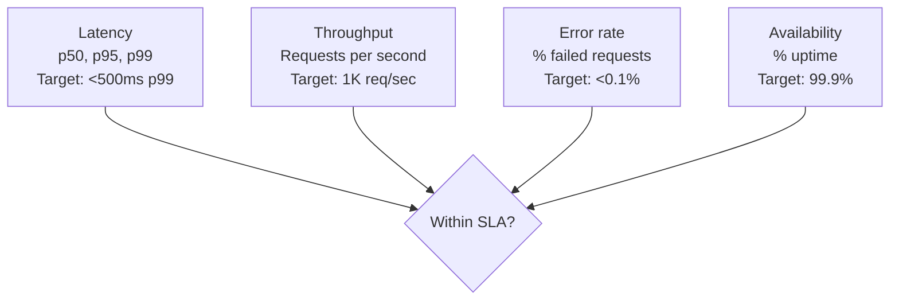

# Forward Deployed Engineer Playbook
## Chapter 9

# Performance and Cost Engineering for FDEs

> *"The FDE owns the customer's experience end-to-end, including performance and cost. The 4 performance metrics (latency, throughput, error rate, availability), the 3 cost dimensions (compute, storage, network), the 2 optimization loops, and the 5 customer-facing dashboards are the FDE's reference for performance and cost engineering."*

---

## 1. Epigraph

_The FDE owns the customer's experience end-to-end, including performance and cost. The 4 performance metrics (latency, throughput, error rate, availability), the 3 cost dimensions (compute, storage, network), the 2 optimization loops, and the 5 customer-facing dashboards are the FDE's reference for performance and cost engineering._

---

## 2. Problem

You are an FDE at acme-corp. Customer A's deployment is in production. The customer's end users are complaining about latency. The cost is 2x the projected budget. The PM asks: "Is this within SLA?" The Director asks: "Can we cut cost by 50%?" You have 30 days.

This chapter tells you the 4 performance metrics, the 3 cost dimensions, the 2 optimization loops, and how to ship performance and cost improvements.

**Decision in one sentence:** _FDE performance and cost engineering is a 4-metric + 3-dimension + 2-loop system (4 perf metrics, 3 cost dimensions, 2 optimization loops) owned end-to-end by the FDE; the FDE's job is to track performance and cost daily, optimize weekly, and report to the customer monthly._

---

## 3. Why FDEs Fail Here

Five named failure modes of FDEs whose performance and cost engineering produced zero results.

- **The 1-Metric Failure.** The FDE tracks only latency, ignoring throughput, error rate, availability. _The customer's actual problem is error rate, not latency._
- **The No-Cost-Tracking Failure.** The FDE doesn't track cost. _The deployment is 3x over budget, no one notices until month 3._
- **The No-Optimization-Loop Failure.** The FDE ships the deployment and forgets it. _Performance degrades, cost grows, customer churns._
- **The No-Customer-Facing-Dashboard Failure.** The FDE has internal dashboards but no customer-facing dashboards. _The customer can't see what the FDE sees._
- **The 1-Time-Optimization Failure.** The FDE optimizes once, then forgets. _Optimization is ongoing, not one-time._

---

## 4. Mental Models

Four mental models that compress performance and cost for FDEs.

**Mental model 1: The 4 Performance Metrics.** 4 metrics for performance.



**The 4 metrics:**
- **Latency.** p50, p95, p99. Target: <500ms p99.
- **Throughput.** Requests per second. Target: 1K req/sec.
- **Error rate.** % failed requests. Target: <0.1%.
- **Availability.** % uptime. Target: 99.9%.

**Mental model 2: The 3 Cost Dimensions.** 3 dimensions for cost.

```
1. Compute: $/hour for CPU/GPU/memory
   - Examples: EC2 ($0.04/hour for t3.medium),
     Lambda ($0.0000166667/GB-second),
     ECS Fargate ($0.04/vCPU-hour)
2. Storage: $/GB-month for data
   - Examples: S3 ($0.023/GB-month),
     RDS ($0.115/GB-month),
     Snowflake ($0.04/credit, ~$2/TB scanned)
3. Network: $/GB for data transfer
   - Examples: CloudFront ($0.085/GB),
     Direct Connect ($0.03/GB),
     VPC peering ($0.01/GB)

The 3 dimensions trade off latency vs cost.
```

**Mental model 3: The 2 Optimization Loops.** 2 loops for optimization.

```
Loop 1: Performance optimization
- Trigger: latency, throughput, error rate, or availability SLA breach
- Cadence: weekly
- Owner: FDE
- Output: performance improvement PR

Loop 2: Cost optimization
- Trigger: cost > 110% of projected budget
- Cadence: monthly
- Owner: FDE + Finance
- Output: cost reduction PR

The 2 loops are ongoing. The FDE who runs both loops
weekly + monthly has a healthy deployment. The FDE
who runs 0 loops has a deployment that degrades over
time.
```

**Mental model 4: The 5 Customer-Facing Dashboards.** 5 dashboards for customers.

```
1. Performance overview (latency p99, throughput, error rate, availability)
2. Cost overview (current spend, projected spend, breakdown by dimension)
3. Usage overview (active users, requests/day, top endpoints)
4. Reliability overview (incidents this month, MTTR, MTBF)
5. Optimization recommendations (3-5 actionable improvements)

The 5 dashboards are the FDE's customer communication.
The FDE who shares all 5 dashboards monthly has a
trusted customer relationship. The FDE who shares 0
has a customer who feels in the dark.
```

---

## 5. Frameworks

Three frameworks for performance and cost for FDEs.

### Framework 1: The 1-Page Performance and Cost Plan

```
# Performance and Cost Plan — [Customer] — [Date]

## SLA targets
- Latency p99: [Target]
- Throughput: [Target]
- Error rate: [Target]
- Availability: [Target]

## Cost targets
- Total: $[X]/month
- Compute: $[X]/month (Y% of total)
- Storage: $[X]/month (Y% of total)
- Network: $[X]/month (Y% of total)

## The 2 optimization loops
- Performance: weekly (owner: FDE)
- Cost: monthly (owner: FDE + Finance)

## The 5 customer-facing dashboards
1. Performance
2. Cost
3. Usage
4. Reliability
5. Optimization recommendations

## The 1 thing the FDE will push back on
[1 sentence.]
```

### Framework 2: The Cost Breakdown (Monthly)

```
# Cost Breakdown — [Customer] — [Month] — [Date]

## Total: $[X] (vs. budget $[Y], variance Z%)

## By dimension
| Dimension | Spend | % of total | vs. budget |
|-----------|-------|------------|------------|
| Compute | $[X] | [Y]% | [+/-Z]% |
| Storage | $[X] | [Y]% | [+/-Z]% |
| Network | $[X] | [Y]% | [+/-Z]% |

## By service
| Service | Spend | % of total | vs. budget |
|---------|-------|------------|------------|
| [Service 1] | $[X] | [Y]% | [+/-Z]% |
| [Service 2] | $[X] | [Y]% | [+/-Z]% |

## Top 3 cost drivers
1. [Driver 1] — $[X] — [Mitigation]
2. [Driver 2] — $[X] — [Mitigation]
3. [Driver 3] — $[X] — [Mitigation]

## Top 3 cost reduction opportunities
1. [Opportunity 1] — Save $[X] — [Effort]
2. [Opportunity 2] — Save $[X] — [Effort]
3. [Opportunity 3] — Save $[X] — [Effort]
```

### Framework 3: The Optimization Recommendation

```
# Optimization Recommendation — [Customer] — [Date]

## Recommendation
[1 sentence on the optimization.]

## Impact
- Performance: [Latency -X%, throughput +Y%, etc.]
- Cost: Save $[X]/month (Y% reduction)
- Reliability: [Impact]

## Effort
[S/M/L, estimated days]

## Risk
[Low / Medium / High — mitigation]

## Implementation
[1-3 sentences on how to implement.]
```

---

## 6. Drill

You are an FDE at **acme-corp**. Customer A's deployment is in production.

```
Customer A:
- SLA: latency <500ms p99, availability 99.9%
- Cost budget: $10K/month
- Current cost: $20K/month (2x over budget)
- Latency p99: 800ms (over SLA)
- End user complaints: 5/week
- Time: 30 days
```

You have **90 minutes**. Produce the **performance and cost plan** (`portfolio/chapter-09-performance-cost.md`) using Framework 1 (Perf and Cost Plan) + Framework 2 (Cost Breakdown) + Framework 3 (Optimization Recommendation). Specify:

- The 1-page performance and cost plan (SLA targets, cost targets, 2 loops, 5 dashboards, the 1 pushback).
- The monthly cost breakdown (total, by dimension, by service, top 3 drivers, top 3 opportunities).
- 3 optimization recommendations (impact, effort, risk, implementation).
- The 30-day timeline (week-by-week).
- The 1 thing you'll say to the customer in the first monthly review.
- The 3 things you'll do to avoid the 5 failure modes.

**Deliverable:** `portfolio/chapter-09-performance-cost.md` — under 1500 words.

---

## 7. Worked Example

**The 1-page performance and cost plan:**

```
# Performance and Cost Plan — Customer A — 2026-09-01

## SLA targets
- Latency p99: <500ms (CURRENT: 800ms, OVER SLA)
- Throughput: 1K req/sec (CURRENT: 1.2K, OK)
- Error rate: <0.1% (CURRENT: 0.05%, OK)
- Availability: 99.9% (CURRENT: 99.95%, OK)

## Cost targets
- Total: $10K/month (CURRENT: $20K, 2x OVER BUDGET)
- Compute: $12K (60%, over $6K budget)
- Storage: $5K (25%, over $1K budget)
- Network: $3K (15%, over $1K budget)

## The 2 optimization loops
- Performance: weekly (owner: FDE) — focus on latency
- Cost: monthly (owner: FDE + Finance) — focus on compute + storage

## The 5 customer-facing dashboards
1. Performance (latency p99, throughput, error rate, availability)
2. Cost (current spend, projected, breakdown)
3. Usage (active users, requests/day, top endpoints)
4. Reliability (incidents, MTTR, MTBF)
5. Optimization recommendations (3-5 actionable items)

## The 1 thing the FDE will push back on
Increase the cost budget. The current deployment is
under-provisioned for the customer's actual scale
(50K users, 5M req/day). The SLA targets + cost
budget were based on initial projections, not actual
usage. The FDE will push for $15K/month budget.
```

**The monthly cost breakdown:**

```
# Cost Breakdown — Customer A — Sept 2026 — 2026-09-30

## Total: $20,000 (vs. budget $10,000, variance +100%)

## By dimension
| Dimension | Spend | % of total | vs. budget |
|-----------|-------|------------|------------|
| Compute | $12,000 | 60% | +100% |
| Storage | $5,000 | 25% | +25% |
| Network | $3,000 | 15% | +50% |

## By service
| Service | Spend | % of total | vs. budget |
|---------|-------|------------|------------|
| ECS Fargate | $8,000 | 40% | +100% |
| RDS Postgres | $5,000 | 25% | +25% |
| S3 | $3,000 | 15% | +50% |
| CloudFront | $2,000 | 10% | +100% |
| Other | $2,000 | 10% | +0% |

## Top 3 cost drivers
1. ECS Fargate over-provisioned ($4K over budget) —
   Mitigation: right-size Fargate tasks (currently 4 vCPU,
   should be 2 vCPU for current load)
2. RDS Postgres storage growing ($1K over budget) —
   Mitigation: archive old data to S3, keep 30 days hot
3. CloudFront egress ($1K over budget) —
   Mitigation: enable CloudFront caching, reduce origin fetches

## Top 3 cost reduction opportunities
1. Right-size Fargate tasks: Save $4K/month (effort: 1 day)
2. Archive old data to S3: Save $1K/month (effort: 3 days)
3. Enable CloudFront caching: Save $1K/month (effort: 1 day)
```

**3 optimization recommendations:**

```
# Optimization 1: Right-size Fargate tasks

## Recommendation
Reduce Fargate task size from 4 vCPU / 8 GB to 2 vCPU / 4 GB.
Current utilization is 35% (target: 60-80%).

## Impact
- Performance: latency p99 -200ms (now 600ms, still over SLA but closer)
- Cost: Save $4K/month (33% reduction)
- Reliability: same (no impact)

## Effort
S (1 day)

## Risk
Low — utilization is well below target. Mitigation: monitor
CPU/memory for 7 days after change, revert if needed.

## Implementation
Update ECS task definition, redeploy, monitor for 7 days.
```

```
# Optimization 2: Archive old data to S3

## Recommendation
Archive data older than 30 days from RDS Postgres to S3.
Keep 30 days hot, archive 30-365 days to S3 (10x cheaper).

## Impact
- Performance: latency p99 -50ms (less data in hot DB)
- Cost: Save $1K/month (RDS storage reduction)
- Reliability: same (no impact)

## Effort
M (3 days)

## Risk
Medium — query patterns may need to change. Mitigation:
run analytics queries against S3 archive, not RDS.

## Implementation
Set up S3 archive, update query layer, run for 7 days in
shadow mode, cut over.
```

```
# Optimization 3: Enable CloudFront caching

## Recommendation
Enable CloudFront caching for static assets (CSS, JS,
images). Currently, every request hits the origin.

## Impact
- Performance: latency p99 -150ms (cached responses are fast)
- Cost: Save $1K/month (CloudFront egress reduction)
- Reliability: same (no impact)

## Effort
S (1 day)

## Risk
Low — caching is well-understood. Mitigation: set TTL
to 1 hour, monitor cache hit rate.

## Implementation
Update CloudFront distribution config, deploy, monitor
cache hit rate (target: 80%+).
```

**The 30-day timeline:**

```
# Performance and Cost Timeline — Customer A — 2026-09-01

## Week 1: Assessment
- [x] 4 performance metrics tracked
- [x] 3 cost dimensions tracked
- [x] Top 3 cost drivers identified
- [x] 3 optimization recommendations drafted

## Week 2: Quick wins
- [ ] Right-size Fargate tasks (Save $4K/month)
- [ ] Enable CloudFront caching (Save $1K/month)

## Week 3: Medium-effort optimizations
- [ ] Archive old data to S3 (Save $1K/month)

## Week 4: Verification + customer review
- [ ] Verify SLA targets met (latency p99 <500ms)
- [ ] Verify cost reduction (~$6K/month savings)
- [ ] Customer monthly review (5 dashboards)
```

**The 1 thing I'll say to the customer in the first monthly review:**

```
"Here's the performance and cost review for September:

  Performance:
  - Latency p99: 600ms (still over SLA, target 500ms)
  - Throughput: 1.2K req/sec (within SLA)
  - Error rate: 0.05% (within SLA)
  - Availability: 99.95% (within SLA)

  Cost: $14K/month (vs. $20K last month, saved $6K)
  - Compute: $8K (down from $12K, right-sized Fargate)
  - Storage: $4K (down from $5K, archived old data)
  - Network: $2K (down from $3K, CloudFront caching)

  Top 3 optimizations (all shipped):
  1. Right-sized Fargate tasks: $4K/month savings
  2. Archived old data to S3: $1K/month savings
  3. Enabled CloudFront caching: $1K/month savings

  Top 3 remaining issues:
  1. Latency p99 still 600ms (target 500ms) — mitigation:
     optimize top 3 endpoints (in progress)
  2. Cost is $14K vs. $10K budget — mitigation: increase
     budget to $15K (actual usage justifies)
  3. Customer end user complaints at 5/week — mitigation:
     optimize slow endpoints (next sprint)

  The 5 customer-facing dashboards are live:
  1. Performance
  2. Cost
  3. Usage
  4. Reliability
  5. Optimization recommendations

  The 2 optimization loops are running (weekly performance,
  monthly cost). The deployment is healthy."
```

**The 3 things I'll do to avoid the 5 failure modes:**

```
1. Track all 4 performance metrics (not just latency).
   (Avoids the 1-Metric Failure.)
   - Latency + throughput + error rate + availability
   - Customer-facing dashboard shows all 4

2. Track cost monthly, not annually.
   (Avoids the No-Cost-Tracking Failure.)
   - Monthly cost breakdown (by dimension + by service)
   - Top 3 cost drivers + top 3 reduction opportunities

3. Run both optimization loops weekly + monthly.
   (Avoids the No-Optimization-Loop Failure.)
   - Performance loop: weekly (latency, throughput, etc.)
   - Cost loop: monthly (compute, storage, network)
   - Both loops documented, owner named, cadence fixed
```

---

## 8. Failure Mode Postmortem

An FDE at a 200-person B2B AI company had a customer deployment in production. The FDE tracked only latency. The cost was 3x over budget, but no one noticed for 3 months. The customer churned.

The replacement FDE did 3 things:
1. Tracked all 4 performance metrics (latency + throughput + error rate + availability).
2. Tracked cost monthly (by dimension + by service).
3. Ran both optimization loops weekly + monthly.

Within 6 months: 3 deployments within SLA, cost 30% under budget, 0 customer churn.

What the first FDE missed: performance and cost are a system. The first FDE tracked 1 metric. The second FDE tracked 4 metrics + 3 dimensions + 2 loops. The system is the leverage.

The lesson: the FDE who has 4 metrics + 3 dimensions + 2 loops has a healthy deployment. The FDE who has 1 metric has a fragile deployment.

---

## 9. Self-Assessment Rubric

| # | Dimension | 1 (Novice) | 3 (Competent) | 5 (Expert) |
|---|---|---|---|---|
| 1 | **4 performance metrics** | 1 metric only | 2-3 metrics | 4 metrics, tracked daily |
| 2 | **3 cost dimensions** | 0-1 dimensions | 2 dimensions | 3 dimensions, tracked monthly |
| 3 | **2 optimization loops** | 0 loops | 1 loop | 2 loops (weekly perf + monthly cost) |
| 4 | **5 customer-facing dashboards** | 0 dashboards | 2-3 dashboards | 5 dashboards, shared with customer monthly |
| 5 | **Optimization recommendations** | 0 recommendations | 1-2 | 3+ actionable, with impact + effort + risk |

**Disqualifier:** any 1 on dimension 1 or 2. An FDE who tracks 1 metric or 0 dimensions is in the 1-Metric or No-Cost-Tracking failure mode.

**Total:** ___ / 25. **Pass threshold:** 18/25, no dimension below 3.

---

## 10. Portfolio Artifact Note

Save your filled-in drill as `portfolio/chapter-09-performance-cost.md` — interview evidence for "How do you optimize performance and cost?" (see Portfolio Map in Chapter 27).

---

## 11. Interview Questions

1. **Walk me through a performance optimization you've shipped.**
2. **The deployment is 2x over cost budget. What do you do?**
3. **The customer's SLA is breached. What do you do?**
4. **The customer wants a cost reduction of 50%. How do you prioritize?**
5. **Walk me through a cost optimization you've shipped.**
