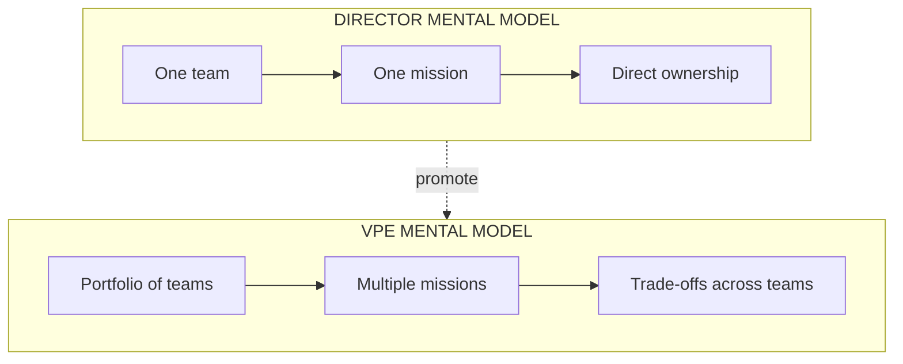
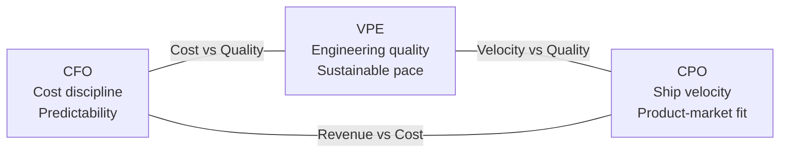

# VP of Engineering Playbook
## Chapter 1

# What a VP of Engineering Actually Does

> *"The job is not to make the engineering org work. The job is to make the engineering org work better than it would have without you — across every team, every quarter, every year."*

---

## 1. Epigraph

The job is not to make the engineering org work. The job is to make the engineering org work better than it would have without you — across every team, every quarter, every year.

---

## 2. Problem

You are 30 days into the VPE seat at a 1,200-person B2B SaaS company. The CEO has just told you: "Engineering is the bottleneck on every roadmap commitment. Fix it." You have 5 Directors reporting in, 200 engineers in your portfolio, a $40M annual budget, and a board that has been hearing about engineering velocity for 24 months without seeing it. The first decision you make will set the tone for the next 24. This is the chapter that tells you what to optimize for in those first 30 days — and what to avoid.

**Decision in one sentence:** A VP of Engineering is the single accountable owner of how the company invests in, organizes, develops, and deploys its engineering capability — across the entire engineering org, not within a single product or function.

---

## 3. Why VPEs Fail Here

Five named failure modes of VPEs who have held the seat for 6+ months and failed to deliver the 24-month change the CEO was asking for.

- **The Director-With-More-Reports Trap.** The VPE acts like a Director managing more engineers, missing the portfolio-and-strategy cognitive shift. The VPE who still does deep code review on every PR is a VPE who has not delegated. The transition is from "make the team great" to "make the engineering org great." A Director with 50 reports is not a VPE. A VPE owns a portfolio of teams, a budget, a strategy, and a relationship with the C-suite.
- **The Lone-Wolf Architect.** The VPE spends most of their time on technical decisions, deprioritizing people and organizational work. Technical excellence is necessary but not sufficient. A VPE who is the smartest person in the room on architecture is a VPE who has abdicated their people leadership and strategy work. The org is more important than any one decision.
- **The Ivory-Tower Strategist.** The VPE produces beautiful strategy memos that don't connect to what the org can actually execute. Strategy without execution buy-in is decoration. A VPE who writes strategy memos that the Directors don't understand (or don't believe) has produced no strategy at all. The strategy is what the org will do, not what's in the memo.
- **The Consensus-Seeker.** The VPE makes no decision that isn't unanimous, treating leadership as consensus-building. Some decisions are consensus decisions. Most VPE decisions are not. A VPE who waits for consensus on every architectural call, every hire, every strategy element will not deliver. Leadership is making the call and accepting disagreement.
- **The Avoidance of Hard Calls.** The VPE keeps underperformers on the team, avoids letting go of failing projects, refuses to take the political heat for necessary restructuring. The hardest part of a VPE role is the hard calls. The VPE who avoids the hard calls accumulates organizational debt that compounds. The VPE who takes the hard calls (and the political heat) builds an org that can deliver.

---

## 4. Mental Models

Four mental models that compress VPE decision-making into something you can defend.

**Mental model 1: The VPE is a portfolio, not a function.** A Director of Engineering owns a function (e.g., "the platform team" or "the product team"). A VPE owns a portfolio of teams. The difference: a function is one thing; a portfolio is a set of things that have to be balanced against each other. A VPE's job is to make trade-offs across teams (where does the next headcount go? which team's request is more important? which project gets cut?). The VPE who treats their role as "I own engineering" is doing the Director's job, not the VPE's job.



**Mental model 2: The C-Suite Triangle.** A VPE sits at one of three points on the C-suite triangle. The other two points are the CFO and the CPO (or CTO, depending on structure). Each point has different pressures, and the VPE's job is to negotiate the trade-offs between them.



The VPE's failure mode is being captured by one of the other two points. A VPE who is captured by the CFO becomes a cost-cutting tool. A VPE captured by the CPO becomes a delivery tool. The VPE's job is to hold the engineering point and negotiate.

**Mental model 3: The Three Horizons.** Engineering work at the VPE level happens in three time horizons. The VPE owns all three.

```
Horizon 1 (Now — 6 months):   Ship the current roadmap. Keep the lights on.
                                Make the existing org work.

Horizon 2 (6-18 months):      The strategic investments that compound:
                                platform, hiring, productivity, quality.

Horizon 3 (18-36 months):     The bets that change the company:
                                new product surface, new tech stack,
                                new org shape.
```

A VPE who only does Horizon 1 is a delivery tool. A VPE who only does Horizon 2+3 is an ivory-tower strategist. The VPE's job is to balance all three — typically 50% on Horizon 1, 30% on Horizon 2, 20% on Horizon 3.

**Mental model 4: The Org-Multiplier.** A VPE's output is not their own output. It's the org's output, multiplied by a factor determined by the VPE's decisions.

```
Org output = (per-engineer output) × (number of engineers) × (org multiplier)

Per-engineer output: How good is each engineer at their job?
                     Affected by hiring quality, training, tools, comp.

Number of engineers: How many engineers are you funding?
                     Affected by budget allocation, hiring rate, retention.

Org multiplier:     How much of each engineer's output is
                    captured by the company (vs. lost to friction)?
                    Affected by: org design, process, architecture,
                    culture, leadership.

The VPE's leverage is the org multiplier. A 1.2x multiplier on 200
engineers = 240 engineers' worth of output. A 0.8x multiplier on 200
engineers = 160 engineers' worth of output — even if the engineers
are individually great.
```

A VPE who only invests in hiring (per-engineer output) but ignores org design (org multiplier) is a VPE who will not see productivity gains even with the best engineers in the world.

---

## 5. Frameworks

Three frameworks for the conversations you will have.

### Framework 1: The 30/60/90 at the VPE Level

```
Days 1-30: Listen + Diagnose
  - 1:1 with every Director (5-15 of them)
  - 1:1 with CEO, CFO, CPO (or CTO)
  - 1:1 with skip-level 2 (1-2 senior EMs or staff engineers)
  - Audit: headcount, budget, org chart, top 3 problems
  - Read every RFC, postmortem, strategy doc from last 12 months
  - NO major changes in this window

Days 31-60: Plan + Align
  - 1-page diagnosis memo (what's actually broken)
  - 1-page strategy memo (what we're going to do about it)
  - 1-page 12-month roadmap (what we'll ship)
  - Sign-off from CEO + at least one Director
  - First 1-2 changes (e.g., org reshuffle, new process)
  - NO major execution in this window

Days 61-90: Execute + Demonstrate
  - First visible win (e.g., shipped feature, hire, process improvement)
  - First 30-60-90 reviews with each Director
  - First board update (if applicable)
  - First offsite or all-hands (if applicable)
  - Cadence: 1:1s, weekly leadership meeting, monthly board update
```

### Framework 2: The VPE Decision Stack

When a VPE is asked to make a decision, the decision passes through 4 layers. Most decisions should be made at the lowest layer.

```
Layer 4 (VPE only):   Org-level decisions that affect >50% of engineers
                       Examples: tech stack change, org reshuffle,
                       process change across the portfolio, exec hires.

Layer 3 (VPE + Directors):
                       Decisions that affect 1-3 teams
                       Examples: cross-team architecture, shared services,
                       hiring plans, Director-level perf calls.

Layer 2 (Director):   Decisions within a single team
                       Examples: team structure, individual perf,
                       in-team architecture.

Layer 1 (IC/EM):      Decisions within a single project
                       Examples: implementation, library choice,
                       code review.

A VPE who makes Layer 1-2 decisions is a VPE who has not delegated.
A VPE who never makes Layer 4 decisions is a VPE who has no impact.
```

### Framework 3: The Engineering Health Dashboard

A VPE's primary measurement system. 5 metrics, no more.

```
1. Throughput:    Features shipped per quarter (per team, per product)
2. Quality:       Defect rate, incident rate, MTTR (mean time to recover)
3. Velocity:      Cycle time (commit to deploy), deployment frequency
4. Health:        Attrition, eNPS, hiring funnel conversion
5. Cost:          $ per engineer per quarter, infra $ per quarter

Each metric is owned by a specific Director or VPE.
The dashboard is reviewed at the weekly leadership meeting.
The VPE is accountable for the portfolio-level trend across all 5.
```

---

## 6. Drill

You are the VPE at **acme-corp**. The CEO has called you in for a 1:1. The conversation is: "Engineering is the bottleneck. Fix it. You have 24 months. What's the plan?"

You have **90 minutes**. Produce a **24-month VPE plan** (`portfolio/chapter-01-24-month-vpe-plan.md`) using Framework 1 (30/60/90) + Framework 2 (Decision Stack) + Framework 3 (Health Dashboard). Specify:

- The 1-page diagnosis (what's actually broken — pick 3 problems).
- The 24-month strategy (3 horizons, 3 priorities per horizon).
- The 30/60/90 first 90 days.
- The 5-metric dashboard you'll use to measure progress.
- The 3 things you will NOT do in the first 24 months.

**Deliverable:** `portfolio/chapter-01-24-month-vpe-plan.md` — under 1200 words.

---

## 7. Worked Example

**The 1-page diagnosis:**

```
1. Org-shape mismatch: 5 Directors, 200 engineers, but Director:IC ratio
   is 1:18. Industry standard at this scale is 1:8-12. Result: Directors
   are doing IC work + manager work, not Director work.

2. No platform team: 8 product teams each maintain their own CI/CD,
   observability, auth, deploy. Duplicated work, inconsistent quality,
   30% of each team's capacity is "platform work" not product work.

3. Hiring lag: 30 open reqs, 18 months to fill, 25% attrition in last
   12 months. Result: 30% of capacity is constantly ramping.
```

**The 24-month strategy (3 horizons):**

```
Horizon 1 (Now - 6 months): Stabilize + Diagnose
  - Hire 3 senior Directors (backfill 2, new 1)
  - Stand up a 4-person Platform team
  - Stop the hiring lag (faster funnel, better comp, retention plan)

Horizon 2 (6-18 months): Build the multiplier
  - 80% of teams on shared platform (CI/CD, observability, auth)
  - Director:IC ratio to 1:10
  - Attrition to <12%
  - Cycle time halved

Horizon 3 (18-36 months): Change the company
  - AI Engineering Director hire (see AI-eng-dir playbook)
  - New product surface (e.g., AI features)
  - Org shape: 350 engineers, 7 Directors, 1 CTO above VPE
```

**The 30/60/90:**

```
Days 1-30: Meet every Director, 3 board members, 5 senior EMs.
          Read every strategy doc, postmortem, RFC from last 12 months.
          NO changes.

Days 31-60: Diagnosis memo (1 page) to CEO.
           24-month plan (1 page) to CEO + board.
           Sign-off on Platform team charter.
           First Director hire (backfill #1).

Days 61-90: Platform team stands up (4 people from existing teams).
           First shared CI/CD adoption (2 teams).
           Hiring funnel redesigned.
           First board update.
```

**The 5-metric dashboard:**

```
1. Throughput:    Features per quarter per team (target: +30% in 6 months)
2. Quality:       Incidents per quarter (target: -40% in 6 months)
3. Velocity:      Cycle time (target: -50% in 12 months)
4. Health:        Attrition rate (target: -25% in 12 months)
5. Cost:          $ per engineer per quarter (target: -10% in 18 months)
```

**The 3 things I will NOT do:**

```
1. I will not ship a complete org reshuffle in the first 90 days.
   (Org changes take 6-12 months to settle; doing them fast
   destroys trust.)

2. I will not make major architecture decisions before the
   architecture review board is staffed.
   (Most VPE architecture decisions should go through the ARB
   once it exists.)

3. I will not hire my friends or people from my last company.
   (The first 5 hires define the VPE's reputation. They should
   be the best in their discipline, not the most familiar.)
```

---

## 8. Failure Mode Postmortem

A VPE at a 1,400-person B2B SaaS company had the same CEO conversation: "Engineering is the bottleneck. Fix it." The VPE came back in 2 weeks with a 30-page strategy memo and a $5M reorg proposal. The CEO approved. The Directors did not.

Within 6 months, 3 of 5 Directors had quit. The new Directors were the VPE's picks from her previous company. Within 12 months, the VPE had lost the trust of the original Directors, the engineering culture was fractured, and the engineering org was less productive than when she started. She was asked to leave 14 months in.

What she missed: the 30/60/90. She did 60 months of work in 60 days. The Directors felt bypassed. The "diagnosis" was never shared with the people doing the work. The strategy was the VPE's strategy, not the org's strategy.

The lesson: the diagnosis is the strategy. A VPE who skips the diagnosis produces a strategy that nobody else understands. The 30/60/90 is not a delay — it's the work. Skipping it is the failure.

---

## 9. Self-Assessment Rubric

| # | Dimension | 1 (Novice) | 3 (Competent) | 5 (Expert) |
|---|---|---|---|---|
| 1 | **Portfolio vs Function** | Treats the role as "I own engineering" (function) | Distinguishes Director (function) from VPE (portfolio) | Operates the portfolio lens in every conversation; trade-offs across teams are explicit |
| 2 | **C-Suite Triangle** | Captured by one of the other two points | Holds the engineering point but negotiates the trade-offs | Anchors every C-suite conversation on the C-Suite Triangle; CFO/CPO know what the VPE stands for |
| 3 | **Three Horizons** | Spends 90% of time on Horizon 1 | Balanced 50/30/20 across horizons | Horizon 2 investments compound visibly; Horizon 3 bets land on time |
| 4 | **Org Multiplier** | Optimizes per-engineer output (hiring only) | Tracks per-engineer and multiplier | Moves the multiplier 1.2x+ in 24 months; explains the multiplier in every plan |
| 5 | **Decision Stack** | Makes Layer 1-2 decisions (over-delegates) | Makes Layer 3-4 decisions | Layer 4 decisions are made decisively; Directors are accountable for Layers 2-3 |

**Disqualifier:** any 1 on dimension 1 or 4. A VPE who thinks they own a function (instead of a portfolio) or who only optimizes per-engineer output (instead of the multiplier) is in the Director-With-More-Reports Trap.

**Total:** ___ / 25. **Pass threshold:** 18/25, no dimension below 3.

---

## 10. Portfolio Artifact Note

Save your filled-in drill as `portfolio/chapter-01-24-month-vpe-plan.md` — interview evidence for "Walk me through your first 24 months as VPE." (see Portfolio Map in Chapter 27).

---

## 11. Interview Questions

1. **Walk me through the first 30 days in the VPE seat.**
2. **The CEO says "engineering is the bottleneck." What's your first move?**
3. **What's the difference between a Director and a VPE?**
4. **A Director wants to leave. Walk me through the conversation.**
5. **The CFO wants to cut engineering budget 20%. What do you say?**