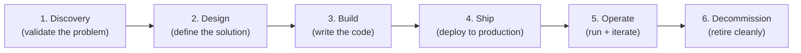

# VP of Engineering Playbook
## Chapter 10

# Engineering Lifecycle (Discovery → Decommission)

> *"Every product, every service, every platform has a lifecycle. The VPE's job is to own the lifecycle, not just the birth of new things."*

---

## 1. Epigraph

Every product, every service, every platform has a lifecycle. The VPE's job is to own the lifecycle, not just the birth of new things.

---

## 2. Problem

You are the VPE at a 1,200-person company. Your engineering org has 18 services in production, 5 in active development, 3 in "we'll get to it someday" mode, and 4 in "we should decommission these but no one has time." 30% of your engineering capacity is going to 4 dead services. 2 critical security vulnerabilities are in unmaintained services that nobody is assigned to. The CFO has just told you: "We have 18 services but 11 of them have <5% of traffic. Why are we paying to maintain them?" The CEO has said: "We have 5 services in development. When will any of them ship?" You have 30 days to design a lifecycle that the Directors and ICs will adopt.

**Decision in one sentence:** The engineering lifecycle at scale is a 6-stage process (Discovery → Design → Build → Ship → Operate → Decommission) with named owners at each stage, gates between stages, and a portfolio view across the entire org; the VPE's job is to make Decommission as celebrated as Build, and to maintain the portfolio view across all 6 stages.

---

## 3. Why VPEs Fail Here

Five named failure modes of VPEs whose lifecycle produced zero results.

- **The Ship-Only Lifecycle.** The VPE has a lifecycle that covers Discovery → Design → Build → Ship. There's no Operate stage. There's no Decommission stage. The org ships features but never retires them. The portfolio grows. The cost of carry compounds.
- **The Decommission-Taboo.** The VPE's culture treats decommission as a failure. The Directors never propose decommission. The services accumulate. The VPE has not made decommission a normal, celebrated act.
- **The Stage-Hopping.** A feature is in Discovery, then 6 months later it's in Build, then 12 months later it's still in Build, then 18 months later it's "shipped but only to 5% of customers." The org moves between stages without completing any. The VPE has not built the gate discipline.
- **The Ownerless-Service Failure.** A service is in production but no Director owns it. The service has no SLO, no on-call rotation, no maintenance plan. The service becomes a liability. The VPE has not enforced the owner-at-each-stage rule.
- **The Discovery-Theater.** The VPE has an elaborate Discovery process. ICs spend 8 weeks on Discovery before they can write code. The Directors grumble. The ICs grumble. The output of Discovery is a 30-page document that nobody reads. The VPE has built process theater.

---

## 4. Mental Models

Four mental models that compress the engineering lifecycle at scale.

**Mental model 1: The 6-Stage Lifecycle.** Every product, service, and platform goes through 6 stages. The VPE owns the lifecycle across all stages.



**Per-stage owner, gate, and duration:**

```
Stage          Owner              Gate to next stage              Duration
Discovery      Product Eng Dir    Problem validated, customer     2-4 weeks
                                  signal documented
Design         Tech Lead          Solution design approved, ARB    2-6 weeks
                                  review (if Tier 1)
Build          Eng Manager        Code complete, tests pass,       4-12 weeks
                                  code review approved
Ship           Eng Manager + SRE  Deployed to production, SLOs     1-2 weeks
                                  defined, observability in place
Operate        Director           Service is monitored, on-call    Indefinite
                                  rotation in place, SLO met
Decommission   Director           Service retired, data migrated,  2-8 weeks
                                  dependencies removed
```

**Mental model 2: The Portfolio View.** The VPE maintains a portfolio view across all 6 stages.

```mermaid
%% Figure 10.2 — Portfolio view across the lifecycle
flowchart TB
    Disc["Discovery: 3 services"]
    Desg["Design: 2 services"]
    Bld["Build: 5 services"]
    Shp["Ship: 2 services"]
    Ops["Operate: 18 services"]
    Dec["Decommission: 4 services"]
    Disc --> Desg --> Bld --> Shp --> Ops --> Dec
    VPE[VP of Engineering<br/>(portfolio owner)]
    VPE -.-> Disc
    VPE -.-> Desg
    VPE -.-> Bld
    VPE -.-> Shp
    VPE -.-> Ops
    VPE -.-> Dec
```

The portfolio view tells the VPE:
- Are we shipping enough? (Operate > Build + Ship + Discovery)
- Are we retiring enough? (Decommission > 0)
- Are we discovering enough? (Discovery > 0)
- Are we stuck? (Items in Discovery > 6 months or Build > 12 months)

**Mental model 3: The Gate Discipline.** Every stage has a gate. The gate is a check that the previous stage is complete before moving to the next.

```
Gate 1 (Discovery → Design):
  - Problem validated with customer signal (3+ data points)
  - Owner identified (Eng Manager + Product Manager)
  - Effort estimate (<= 12 weeks for first build)
  - Decision: Proceed, Pivot, or Kill

Gate 2 (Design → Build):
  - Solution design approved (Tech Lead + ARB review if Tier 1)
  - Architecture decision recorded (1-page memo)
  - Test strategy defined
  - Decision: Proceed, Refine, or Kill

Gate 3 (Build → Ship):
  - Code complete + tests pass
  - Code review approved
  - Observability in place
  - SLOs defined (latency, availability, error rate)
  - Runbook written
  - Decision: Ship, Iterate, or Kill

Gate 4 (Ship → Operate):
  - Deployed to production (10% canary, 100% rollout)
  - On-call rotation in place
  - SLOs being met (1 week of data)
  - Customer feedback positive (or no negative)
  - Decision: Promote to full Operate, or Rollback

Gate 5 (Operate → Decommission):
  - Service is below 5% of traffic for 6 months
  - Service has no committed owner
  - Service has unpatched critical security vulns
  - Migration plan for active users (if any)
  - Decision: Decommission, or Keep
```

**Mental model 4: The Decommission-as-Celebration.** Decommission is a feature, not a failure. The VPE's job is to make it celebrated.

```
Decommission is celebrated when:
1. The Director who decommissioned a service is publicly thanked
   in the all-hands.
2. The capacity freed (engineer-quarters) is reallocated visibly
   (e.g., to a new bet from the strategy memo).
3. The postmortem on the decommission is shared ("what we
   learned about when to NOT build").
4. The "decommission count" is in the engineering health
   dashboard, alongside the "ship count."

The VPE who treats decommission as failure accumulates services.
The VPE who treats it as celebration has a portfolio that
stays healthy.
```

---

## 5. Frameworks

Three frameworks for the engineering lifecycle at scale.

### Framework 1: The Lifecycle Portfolio Dashboard

```
# Engineering Lifecycle Portfolio — Q[N] [YEAR]

## Stage counts (per-service)
| Stage | Count | Trend (3 quarters) | Notes |
|-------|-------|---------------------|-------|
| Discovery | 3 | +2 / +1 / +3 | 2 new from customer interviews |
| Design | 2 | 0 / +1 / +2 | 1 awaiting ARB review |
| Build | 5 | +3 / +4 / +5 | 2 over 12 weeks (red flag) |
| Ship | 2 | +1 / +1 / +2 | On track |
| Operate | 18 | +18 / +18 / +18 | 4 below 5% traffic (candidates for decommission) |
| Decommission | 4 | 0 / 0 / +4 | Q3: 4 services decommissioned |

## Services in Build >12 weeks (RED)
1. [Service name, owner, weeks in build, action]
2. ...

## Services in Operate with <5% traffic (candidates for decommission)
1. [Service name, owner, traffic, last commit, action]
2. ...

## Quarterly targets
- Decommission: 2-4 services/quarter
- Discovery: 3-5 new services/quarter
- Operate: <20 services (kill the rest)
```

### Framework 2: The Gate Decision Template

Every gate decision is captured in a 1-page memo.

```
# Gate [N] Decision — [Service name] — [Date]

## Current stage
[Which stage is the service in?]

## Gate criteria
[List the gate criteria for moving to the next stage.]

## Status
[Each gate criterion: pass / fail / partial. Evidence.]

## Decision
[Proceed / Refine / Iterate / Pivot / Rollback / Kill / Decommission]

## Rationale
[1-2 sentences on why this decision.]

## Owner
[Who owns the next stage.]

## Next gate
[Date of next gate review.]
```

### Framework 3: The Quarterly Lifecycle Review (60 min)

Every quarter, the VPE runs a 60-minute lifecycle review with the Directors.

```
Agenda (60 min):
0-5 min:   VPE opening (the 3 numbers)
5-20 min:  Stage count + trend
           - Discovery, Design, Build counts
           - Build >12 weeks (red flag list)
20-30 min: Operate count + candidates for decommission
           - <5% traffic services (candidates)
           - Last commit >6 months (candidates)
           - Unpatched security vulns (candidates)
30-40 min: Decommission review
           - Last quarter's decommissions
           - Next quarter's planned decommissions
           - Capacity freed (engineer-quarters)
40-50 min: New bets (from strategy memo)
           - Which bets are moving to Discovery?
           - Owner per bet
50-60 min: VPE summary (next quarter's lifecycle priorities)
```

---

## 6. Drill

You are the VPE at **acme-corp**. The engineering org has:
- 18 services in Operate (4 below 5% traffic, 2 with unpatched security vulns)
- 5 in Build (2 over 12 weeks, red flag)
- 2 in Ship
- 2 in Design
- 3 in Discovery
- 0 in Decommission (decommission-taboo culture)

The CFO says: "11 of 18 services have <5% of traffic. Why are we paying for them?" The CEO says: "When will any of the 5 in-build services ship?" The Directors are split: 2 want a formal Decommission process, 3 want to keep the status quo.

You have **90 minutes**. Produce a **lifecycle plan** (`portfolio/chapter-10-lifecycle-plan.md`) using Framework 1 (Portfolio Dashboard) + Framework 2 (Gate Decision Template) + Framework 3 (Quarterly Lifecycle Review). Specify:

- The current portfolio dashboard.
- The 4 services to decommission in the first 90 days (with rationale).
- The 2 Build-stage services to triage (proceed / kill / pivot).
- The gate decision template for the first 3 gates.
- The 1 thing you'll do to make Decommission celebrated.
- The first quarterly lifecycle review agenda.

**Deliverable:** `portfolio/chapter-10-lifecycle-plan.md` — under 1500 words.

---

## 7. Worked Example

**The current portfolio dashboard:**

```
# Engineering Lifecycle Portfolio — Q3 2026

## Stage counts
| Stage | Count | Trend | Notes |
|-------|-------|-------|-------|
| Discovery | 3 | +1 / +2 / +3 | 1 new from customer interviews |
| Design | 2 | +1 / +1 / +2 | 1 awaiting ARB review |
| Build | 5 | +3 / +4 / +5 | 2 over 12 weeks (red) |
| Ship | 2 | +1 / +1 / +2 | On track |
| Operate | 18 | +18 / +18 / +18 | 4 below 5% traffic |
| Decommission | 0 | 0 / 0 / 0 | ZERO — taboo culture |

## Build >12 weeks (RED)
1. legacy-import: 18 weeks, 1 IC, no clear path to ship.
   Action: KILL (no customer pull, no strategic value).
2. search-v2: 14 weeks, 3 ICs, 60% complete.
   Action: PROCEED with 8-week hard deadline.

## Operate <5% traffic (candidates for decommission)
1. notifications-v1: 1.2% of traffic, last commit 11 months ago.
2. reports-legacy: 0.8% of traffic, last commit 14 months ago.
3. exports-csv: 2.5% of traffic, last commit 9 months ago.
4. legacy-mobile-sync: 3.1% of traffic, last commit 8 months ago.

## Unpatched security vulns (high priority)
- 2 critical vulns in 2 different services (both <5% traffic)
```

**The 4 services to decommission in the first 90 days:**

```
1. notifications-v1 (1.2% traffic, 11 months stale)
   - Migrate 23 active users to notifications-v2 (built 2024)
   - Cost of carry: 0.4 eq/quarter
   - Decommission date: Day 60
   - Owner: Director, Product Eng

2. reports-legacy (0.8% traffic, 14 months stale)
   - 8 active users on legacy report. Migrate them to the new
     reports service.
   - Cost of carry: 0.6 eq/quarter
   - Decommission date: Day 90
   - Owner: Director, Product Eng

3. exports-csv (2.5% traffic, 9 months stale)
   - 47 active users. Migrate to the new export service.
   - Cost of carry: 0.3 eq/quarter
   - Decommission date: Day 75
   - Owner: Director, Product Eng

4. legacy-mobile-sync (3.1% traffic, 8 months stale)
   - 12 active users. Migrate to the new mobile sync service.
   - Cost of carry: 0.5 eq/quarter (and 2 security vulns)
   - Decommission date: Day 45 (priority: security vulns)
   - Owner: Director, Mobile

Capacity freed: 1.8 eq/quarter (about 2 FTE).
Reallocated: to the search-v2 bet (Ch 5).
```

**The 2 Build-stage services to triage:**

```
1. legacy-import (18 weeks, 1 IC, no customer pull)
   - Decision: KILL
   - Rationale: no customer pull, no strategic value, 1 IC
     trapped. Killing frees the IC for search-v2.
   - Action: Day 30. Document the kill decision (1-page memo).
     Reassign the IC to search-v2.

2. search-v2 (14 weeks, 3 ICs, 60% complete)
   - Decision: PROCEED with 8-week hard deadline
   - Rationale: 60% complete, 3 ICs invested, customers
     waiting. Hard deadline prevents another build-bloated
     service.
   - Action: 8-week ship deadline. If not shipped in 8 weeks,
     pivot to a simpler version (search-v2-lite).
```

**The gate decision template (first 3 gates):**

```
Gate 1 (Discovery → Design) — 1 service will pass through:
  Gate criteria: customer signal validated (3+ data points),
  owner identified, effort <= 12 weeks
  Decision template: 1-page memo
  Action: New service "ai-summary" (Ch 5 bet) passes Gate 1
          on Day 30.

Gate 2 (Design → Build) — 2 services pending:
  Service 1: "ai-summary" design approved
             ARB review: Tier 1 (AI infra) → ARB approval
                         required
  Service 2: "search-v2" design approved (already in Build,
             pending Gate 3)
  Action: ai-summary design review at next ARB (Day 35).

Gate 3 (Build → Ship) — 2 services:
  Service 1: search-v2 (8-week hard deadline from Day 0)
             Criteria: tests pass, observability in place,
                       SLOs defined, runbook written
  Service 2: ai-summary (estimated 6-8 weeks from Gate 2)
             Same criteria
  Action: First Gate 3 review for search-v2 on Day 56
          (8 weeks from now).
```

**The 1 thing I'll do to make Decommission celebrated:**

```
The all-hands.

"Last quarter we decommissioned 4 services that were <5% of
traffic. That's 2 FTE of engineering capacity we no longer
maintain.

The Directors who led these decommissions are [names]. The
capacity we freed went to search-v2, which is on track to
ship next quarter.

Decommission is a feature, not a failure. Every service we
retire is a service that no longer has security risk, no
longer consumes engineering capacity, and no longer
clutters the portfolio.

This quarter, our goal is 4 more decommissions: [list]."

The all-hands is the celebration. The Directors who led
are publicly thanked. The capacity freed is publicly
reallocated. The next quarter's decommission goal is
publicly stated.

Result: 6 months in, decommission is a normal, celebrated
act. 12 months in, the org's portfolio is healthy.
```

**The first quarterly lifecycle review agenda (60 min):**

```
Attendees: VPE + 5 Directors
Duration: 60 minutes
Cadence: quarterly (next: end of Q4 2026)

Agenda:
0-5 min:   VPE opening
           - 3 numbers: discovery count, decommission count,
             Build >12 weeks count
5-20 min:  Stage counts + trend
           - Discovery: 3 (target: 3-5, OK)
           - Build: 5 (2 over 12 weeks, RED)
           - Operate: 14 (after Q3 decommissions, down from 18)
20-30 min: Operate count + decommission candidates
           - Operate count target: <16
           - Current candidates: 2 services <2% traffic
30-40 min: Q3 decommissions review
           - 4 decommissions shipped on time
           - 2 FTE capacity freed, reallocated to search-v2
           - 2 unpatched security vulns resolved
40-50 min: Q4 decommission plan
           - Target: 3-4 decommissions in Q4
           - Candidates: 2 services + 1 monolith decomposition
50-60 min: VPE summary (next 90 days)
```

---

## 8. Failure Mode Postmortem

A VPE at a 2,000-person fintech inherited an engineering org with 80 services in production. The VPE was a strong believer in "ship more, ship faster." The lifecycle covered Discovery → Design → Build → Ship. There was no Decommission stage. There was no Operate review.

Within 18 months, the org had 110 services. 30% of the services had <5% of traffic. 12 had unpatched security vulnerabilities. 4 had no on-call rotation. The cost of carry was 25% of engineering capacity.

The VPE was asked to leave. The replacement VPE introduced a 6-stage lifecycle with Decommission as a celebrated stage. Within 12 months, the service count was reduced from 110 to 65. The cost of carry dropped from 25% to 12%. The unpatched security vulns dropped from 12 to 0.

What the first VPE missed: the lifecycle includes Decommission. The org that only ships will eventually drown in the services it shipped. The VPE who owns the lifecycle, not just the birth, has a healthy portfolio.

The lesson: Decommission is a feature, not a failure. The VPE's job is to make it celebrated.

---

## 9. Self-Assessment Rubric

| # | Dimension | 1 (Novice) | 3 (Competent) | 5 (Expert) |
|---|---|---|---|---|
| 1 | **6-stage lifecycle** | 4-stage (no Operate, no Decommission) | 6-stage, but Decommission is rare | 6-stage, Decommission celebrated |
| 2 | **Portfolio view** | No portfolio view | Stage counts tracked | Dashboard, trends, red flags visible |
| 3 | **Gate discipline** | No gates or stage-hopping | Gates exist, mostly followed | Gates enforced, decision template used |
| 4 | **Owner at each stage** | Ownerless services common | Owner per stage, mostly | Owner per stage, audited quarterly |
| 5 | **Decommission culture** | Taboo (0 decommissions) | Quarterly decommissions | Quarterly decommissions, celebrated publicly |

**Disqualifier:** any 1 on dimension 1 or 5. A VPE with a 4-stage lifecycle or who treats decommission as taboo is in the Ship-Only Lifecycle or Decommission-Taboo trap.

**Total:** ___ / 25. **Pass threshold:** 18/25, no dimension below 3.

---

## 10. Portfolio Artifact Note

Save your filled-in drill as `portfolio/chapter-10-lifecycle-plan.md` — interview evidence for "How do you manage the engineering lifecycle at scale?" (see Portfolio Map in Chapter 27).

---

## 11. Interview Questions

1. **Walk me through your engineering lifecycle.**
2. **How many services are in Decommission in your org?**
3. **A service has 1% traffic, 12 months since last commit, and a security vuln. What do you do?**
4. **The CEO says "ship more, ship faster." The portfolio is bloated. What do you say?**
5. **Walk me through a service you've decommissioned.**