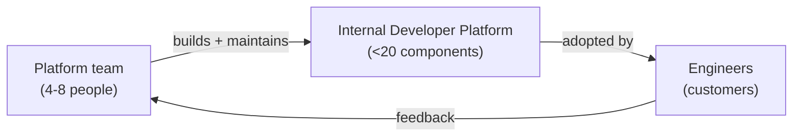
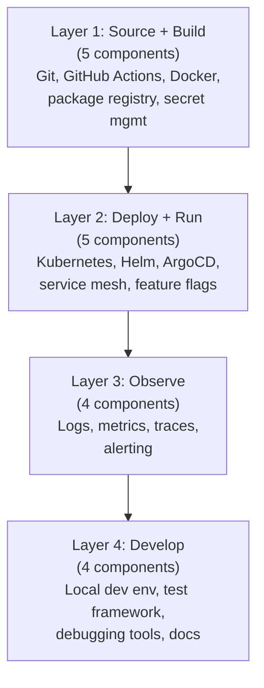
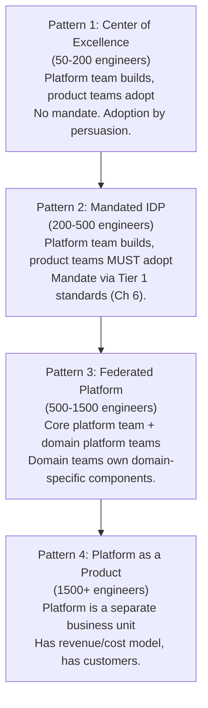
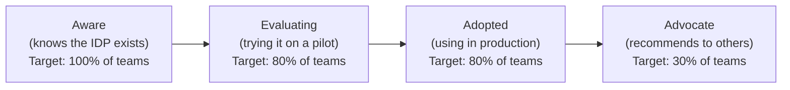

# VP of Engineering Playbook
## Chapter 11

# Platform Engineering (Internal Developer Platform)

> *"Platform engineering is the discipline of building the system that makes everyone else more productive. The IDP is the product. The engineers are the customers."*

---

## 1. Epigraph

Platform engineering is the discipline of building the system that makes everyone else more productive. The IDP is the product. The engineers are the customers.

---

## 2. Problem

You are the VPE at a 1,200-person company. The engineering org has 250 engineers across 8 product teams. Each team maintains its own CI/CD pipeline, its own observability stack, its own auth implementation, its own service framework. 30% of each team's capacity is "platform work" — duplicated 8 times. New engineers take 3 months to be productive because they have to learn 8 of everything. The CFO has just told you: "We have 250 engineers but the org's productivity is 30% below industry benchmark. Why?" The CEO has said: "We're 6 months behind on enterprise tier. Our platform is the bottleneck."

You have 30 days to design an Internal Developer Platform (IDP) that 80% of teams will adopt within 12 months. This chapter tells you what that platform looks like.

**Decision in one sentence:** Platform engineering at scale is the discipline of building an Internal Developer Platform (IDP) that 80% of teams adopt within 12 months, with a 4-5 person Platform team owning the IDP as a product (engineers as customers), a 90-day onboarding for new teams, and an adoption metric in the weekly dashboard; the VPE's job is to keep the IDP under 20 components, fund the Platform team at 8-12% of total eng, and hold the line on "adoption over features."

---

## 3. Why VPEs Fail Here

Five named failure modes of VPEs whose IDP produced zero adoption.

- **The Build-It-And-They-Will-Come Failure.** The VPE funds a 12-person Platform team. They build a beautiful IDP. 18 months later, 12% of teams have adopted. The Platform team is disbanded. The VPE built a product nobody wanted.
- **The No-Adoption-Metric Failure.** The VPE funds a Platform team but doesn't track adoption. The team builds 50 components. 5 are used. 45 are shelf-ware. The VPE has built a museum, not a platform.
- **The No-Customer-Research Failure.** The Platform team builds what they think engineers want. The engineers want something different. The team doesn't talk to customers. Adoption is low. The VPE has not built a product discipline.
- **The Build-vs-Reuse Failure.** The Platform team builds a custom CI/CD when GitHub Actions is good enough. They build a custom auth when Auth0 is good enough. The team is proud of the custom stack. The IDP is over-engineered.
- **The Platform-Team-Without-Authority Failure.** The Platform team builds the IDP but cannot mandate adoption. The product teams have autonomy. They stay on their existing stack. The VPE has funded a team without giving it authority.

---

## 4. Mental Models

Four mental models that compress platform engineering at scale.

**Mental model 1: The IDP-as-Product.** The IDP is a product. The Platform team is the product team. The engineers are the customers.



**The product discipline applied to the IDP:**
- The Platform team has a PM (or PM-like role) who talks to engineers weekly.
- The IDP has a roadmap, published quarterly.
- The IDP has an adoption metric, tracked weekly.
- The IDP has customer interviews (engineers from other teams) every 2 weeks.
- The IDP has a "kill criteria" — components that don't meet adoption targets get retired.

**Mental model 2: The IDP Component List.** The IDP has 4-5 layers, each with 1-5 components. Total <20 components.



**The 4-5-5-4 split:** 5 components in source/build, 5 in deploy/run, 4 in observe, 4 in develop. Total 18 components, under the 20-component limit.

**Mental model 3: The 4 IDP Org Patterns.** There are 4 ways to organize a Platform team. The VPE picks one based on org maturity.



**Selection rules:**
- 50-200 engineers → Pattern 1 (CoE, persuasion)
- 200-500 → Pattern 2 (Mandated, via Tier 1 standards)
- 500-1500 → Pattern 3 (Federated)
- 1500+ → Pattern 4 (Platform as a product)

Most VPEs work at Pattern 2 or 3.

**Mental model 4: The Adoption-Funnel.** The IDP adoption is a funnel. The VPE tracks the funnel weekly.



The funnel tells the VPE:
- **Awareness low?** → IDP isn't communicated. Fix: monthly demo, docs.
- **Evaluation low?** → Onboarding is hard. Fix: 90-day onboarding program.
- **Adoption low?** → IDP doesn't solve the customer's problem. Fix: customer research, kill unused components.
- **Advocacy low?** → IDP is OK but not great. Fix: PM engagement, user research.

---

## 5. Frameworks

Three frameworks for platform engineering at scale.

### Framework 1: The IDP Adoption Tracker

```
# IDP Adoption Tracker — Q[N] [YEAR]

## Funnel
| Stage | Q-2 | Q-1 | Q[N] | Target Q+1 |
|-------|-----|-----|------|------------|
| Aware | 100% | 100% | 100% | 100% |
| Evaluating | 60% | 70% | 75% | 80% |
| Adopted | 50% | 60% | 70% | 80% |
| Advocate | 10% | 15% | 22% | 30% |

## Per-component adoption
| Component | Q-2 | Q-1 | Q[N] | Target | Status |
|-----------|-----|-----|------|--------|--------|
| CI/CD (GitHub Actions) | 80% | 90% | 95% | 100% | On track |
| Observability (Loki) | 30% | 50% | 65% | 80% | On track |
| Auth (company-OIDC) | 20% | 40% | 60% | 80% | On track |
| Local dev env | 10% | 15% | 20% | 30% | Slow (red flag) |

## Component kill criteria (any of these triggers a kill review)
- <10% adoption after 12 months in GA
- <30% adoption after 6 months in GA + active promotion
- Negative ROI (cost to maintain > value delivered)
```

### Framework 2: The 90-Day Team Onboarding

Every new team that adopts the IDP gets a 90-day onboarding.

```
Days 1-30: Pilot setup
  - Platform team pairs with the adopting team
  - 1 service migrated to IDP (CI/CD + observability + auth)
  - 1 weekly sync (Platform team + adopting team)

Days 31-60: Expand
  - 2-3 more services migrated
  - Local dev env set up for the team
  - Adopting team has a designated "platform champion" (1 IC, 10% time)

Days 61-90: Production
  - All team services on IDP
  - Platform team transitions to "office hours" (1h/week, drop-in)
  - Adopting team provides feedback (NPS, top 3 pain points)
  - Success metric: team velocity +30% (or satisfaction +20 NPS points)
```

### Framework 3: The Quarterly Platform Review (60 min)

Every quarter, the VPE runs a 60-minute platform review with the Platform team + Directors.

```
Agenda (60 min):
0-5 min:   VPE opening (the 3 numbers)
           - Adoption rate (org-level)
           - Component count
           - NPS (engineer satisfaction with the IDP)
5-20 min:  Adoption funnel review
           - Aware → Evaluating → Adopted → Advocate
           - Identify bottleneck stage
20-30 min: Per-component review
           - Adoption rate per component
           - Components below adoption target (red flag)
           - Components above target (advocates)
30-40 min: New components proposal
           - 2-3 proposed for next quarter
           - Decision: build / defer / kill
40-50 min: 90-day onboarding review
           - Onboarded teams this quarter
           - Velocity gain per team
           - NPS gain per team
50-60 min: VPE summary (next 90 days)
```

---

## 6. Drill

You are the VPE at **acme-corp**. The engineering org has 250 engineers, 8 product teams. Each team has its own CI/CD, observability, auth. 30% of each team's capacity is platform work. New engineers take 3 months to be productive. The CFO says: "30% below industry benchmark." The CEO says: "Platform is the bottleneck."

You have **90 minutes**. Produce a **Platform Engineering plan** (`portfolio/chapter-11-platform-engineering-plan.md`) using Framework 1 (Adoption Tracker) + Framework 2 (90-Day Onboarding) + Framework 3 (Quarterly Review). Specify:

- The 4-5-5-4 IDP component list (with vendor vs build decisions).
- The Platform team charter (4-8 people, mandate, Tier 1 standards enforcement).
- The 90-day onboarding program (first 3 teams to adopt).
- The Q1 adoption targets (per-component, per-funnel-stage).
- The 1 thing you'll push back on (e.g., "don't build custom auth when Auth0 is good enough").
- The first quarterly platform review agenda.

**Deliverable:** `portfolio/chapter-11-platform-engineering-plan.md` — under 1500 words.

---

## 7. Worked Example

**The 4-5-5-4 IDP component list (with vendor vs build decisions):**

```
Layer 1: Source + Build (5 components)
  1. Git + GitHub (vendor: GitHub)
  2. CI/CD (vendor: GitHub Actions)
  3. Container registry (vendor: GitHub Packages)
  4. Secret management (vendor: HashiCorp Vault)
  5. Package registry (vendor: GitHub Packages + PyPI + npm)

Layer 2: Deploy + Run (5 components)
  1. Container orchestration (vendor: Kubernetes on AWS EKS)
  2. Deployment (vendor: ArgoCD, GitOps)
  3. Service mesh (vendor: Istio)
  4. Feature flags (vendor: LaunchDarkly)
  5. Service discovery (built-in: K8s + Istio)

Layer 3: Observe (4 components)
  1. Logs (vendor: Loki via Grafana Cloud)
  2. Metrics (vendor: Prometheus + Grafana)
  3. Traces (vendor: OpenTelemetry + Jaeger)
  4. Alerting (vendor: PagerDuty + Grafana)

Layer 4: Develop (4 components)
  1. Local dev env (BUILD: devcontainer + docker-compose)
  2. Test framework (Tier 2: pytest, jest, etc.)
  3. Debugging tools (vendor: Rookout)
  4. Docs (BUILD: internal docs platform)

Total: 18 components (under the 20-component limit).
Build vs reuse: 3 built (local dev env, docs, ARB tooling),
  15 vendor.
```

**The Platform team charter (Pattern 2: Mandated IDP):**

```
Team: Platform (4 people to start, 8 at full size)
Director: Director, Platform

Mandate:
- Own the 18 IDP components
- 90-day onboarding for adopting teams
- 80% adoption target by Q4 2027
- Tier 1 standards enforcement (Ch 6: Auth, CI/CD, observability)
  - Product teams MUST adopt the IDP's Tier 1 components
  - Exceptions require ARB approval

Budget:
- Y1: $4M (3 engineers + 1 PM + vendor costs)
- Y2: $6M (5 engineers + 1 PM + 2 SREs + vendor costs)
- Vendor costs: $300K/year (GitHub, Loki, Prometheus, etc.)

Customer discipline:
- Weekly 1:1 with adopting team leads
- Bi-weekly customer interviews
- Quarterly NPS survey
- Monthly demo to the engineering org
- Published roadmap (quarterly)
- Adopted components retire, deprecated components sunset
```

**The 90-day onboarding program (first 3 teams to adopt):**

```
Team 1: Product Team A (the laggard, 1% IDP adoption)
  Why first: if we can convert the laggard, the rest will follow
  Days 1-30:  Pilot 1 service (CI/CD + observability)
              Platform team embedded 1 day/week
  Days 31-60: 3 more services migrated
              Team A's "platform champion" identified (1 IC, 10% time)
  Days 61-90: All Team A services on IDP
              Velocity measurement: before vs after

Team 2: Product Team B (the early adopter, 30% IDP adoption)
  Why second: has bought in, just needs the rollout
  Days 1-30:  Pilot local dev env + auth
  Days 31-60: All services on auth
  Days 61-90: Local dev env adopted team-wide

Team 3: Product Team C (the reluctant, 0% IDP adoption)
  Why third: needs more support
  Days 1-30:  Pilot 1 service
  Days 31-60: Platform team embedded 2 days/week
              Director of Team C champions the rollout
  Days 61-90: 2 services on IDP
              (Team C will take 6 months, not 3)
```

**The Q1 adoption targets (per-component, per-funnel-stage):**

```
# IDP Adoption Targets — Q1 2027

## Funnel
| Stage | Current | Target Q1 | Target Q4 |
|-------|---------|-----------|-----------|
| Aware | 100% | 100% | 100% |
| Evaluating | 30% | 60% | 80% |
| Adopted | 20% | 50% | 80% |
| Advocate | 5% | 15% | 30% |

## Per-component adoption
| Component | Current | Target Q1 | Target Q4 |
|-----------|---------|-----------|-----------|
| CI/CD (GitHub Actions) | 80% | 100% | 100% |
| Observability (Loki) | 30% | 70% | 90% |
| Auth (company-OIDC) | 20% | 60% | 90% |
| Local dev env | 10% | 30% | 60% |
```

**The 1 thing I'll push back on:**

```
The Director, Product Engineering wants to build a custom
service mesh because "Istio is too complex for our team."

My pushback: "Istio is the Tier 1 standard (Ch 6). Building
custom means we have 9 service meshes (8 product teams + 1
custom) and the platform consolidation goal is dead.

Counter-proposal: I'll fund 2 weeks of Platform team embedded
with your team to learn Istio. If after 2 weeks it's still
too complex, we'll have an ARB review of alternatives
(Linkerd, Consul). We won't go custom."

This is the VPE's job: hold the Tier 1 line while being
responsive to legitimate concerns. The custom-build path
is the No-Adoption-Metric Failure in disguise.
```

**The first quarterly platform review agenda (60 min):**

```
Attendees: VPE + Director, Platform + 5 Directors + Platform PM
Duration: 60 minutes
Cadence: quarterly (next: end of Q1 2027)

Agenda:
0-5 min:   VPE opening
           - 3 numbers: org adoption (20%), component count (18),
             NPS (32)
5-20 min:  Adoption funnel review
           - Aware 100%, Evaluating 30% (target 60%), Adopted
             20% (target 50%)
           - Bottleneck: evaluating → adopted
           - Fix: 90-day onboarding for 2 more teams
20-30 min: Per-component review
           - CI/CD: 80% (on track)
           - Observability: 30% (slow, 1 team resisting)
           - Auth: 20% (slow, the laggard Team 1)
           - Local dev env: 10% (slow, hard to use)
30-40 min: New components proposal
           - 1 proposed: Cost dashboard (cloud cost per service)
           - Decision: build (high leverage, low cost)
40-50 min: 90-day onboarding review
           - Team A: 60% on CI/CD, 0% on auth (need more time)
           - Team B: 100% on auth, 50% on local dev env
           - Team C: 25% on CI/CD (slow, on track for 6 months)
50-60 min: VPE summary
           - Q1 targets: 50% adopted, 70% on observability
           - Hire 2 more Platform engineers (Y2 budget)
           - Retire local dev env v1, rebuild as v2
```

---

## 8. Failure Mode Postmortem

A VPE at a 2,500-person company funded a 25-person Platform team to "build the world's best IDP." The team built 80 components over 18 months. 18 months in, 22% of product teams had adopted. The Platform team was disbanded. The IDP components became shelf-ware.

What the VPE missed: 3 things.
1. **No adoption metric.** The Platform team was measured on features shipped, not adoption. They built 80 components, 78 unused.
2. **No customer research.** The Platform team was staffed by senior engineers who knew what they would want. They didn't ask the customers.
3. **Mandate without authority.** The Platform team couldn't mandate adoption. The product teams had autonomy. They kept their existing stacks.

The replacement VPE did 3 things differently.
1. **Adoption as the primary metric.** Each component had a kill criterion (10% adoption after 12 months → kill).
2. **Customer research as a discipline.** Platform team ran weekly customer interviews, monthly demos.
3. **Mandate via Tier 1 standards.** Auth, CI/CD, observability became Tier 1 (per Ch 6). Product teams MUST adopt.

Within 12 months, IDP adoption was 80%. The Platform team grew to 8 people. The IDP had 18 components, all adopted.

The lesson: IDP is a product, not a project. The Platform team is a product team. The metrics are adoption, not features. The VPE who treats IDP as a project will fail.

---

## 9. Self-Assessment Rubric

| # | Dimension | 1 (Novice) | 3 (Competent) | 5 (Expert) |
|---|---|---|---|---|
| 1 | **IDP-as-product** | IDP as project (build → forget) | IDP as product (PM, roadmap) | IDP as product, adoption is the metric |
| 2 | **Component discipline** | 50+ components, no kill criteria | <20 components, kill criteria exist | <20 components, kill criteria enforced |
| 3 | **Adoption funnel** | No adoption tracking | Adoption tracked | Funnel tracked weekly, bottleneck identified |
| 4 | **Org pattern** | No Platform team, or Platform team with no authority | Platform team with Tier 1 mandate | Platform team + Tier 1 + customer research + NPS |
| 5 | **Build vs reuse** | Custom-built everything | Mixed (some build, some vendor) | 80%+ vendor, only build when necessary |

**Disqualifier:** any 1 on dimension 1 or 4. A VPE who treats IDP as a project or who has a Platform team without authority is in the Build-It-And-They-Will-Come or Platform-Team-Without-Authority trap.

**Total:** ___ / 25. **Pass threshold:** 18/25, no dimension below 3.

---

## 10. Portfolio Artifact Note

Save your filled-in drill as `portfolio/chapter-11-platform-engineering-plan.md` — interview evidence for "How do you build an Internal Developer Platform?" (see Portfolio Map in Chapter 27).

---

## 11. Interview Questions

1. **Walk me through your IDP strategy.**
2. **How many IDP components do you have? What's the adoption rate?**
3. **A team refuses to adopt the IDP. What do you do?**
4. **How do you decide build vs vendor for an IDP component?**
5. **The CFO asks "is the Platform team paying for itself?" How do you answer?**