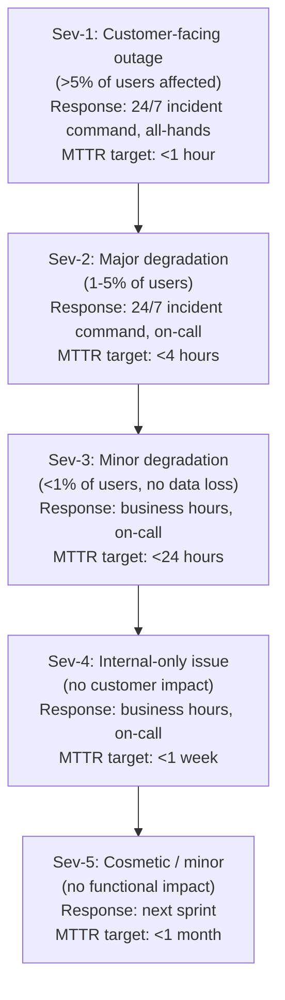
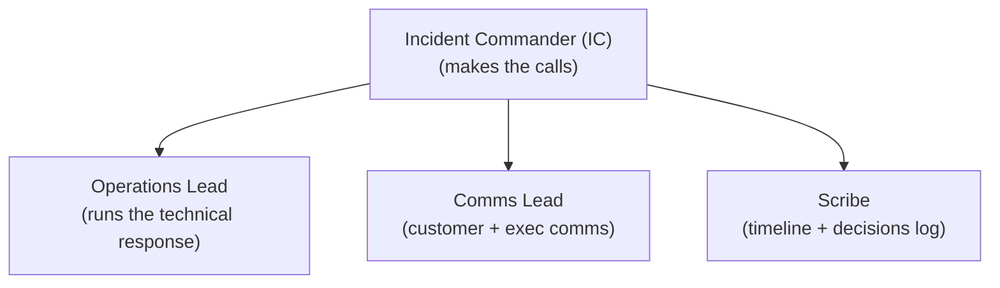
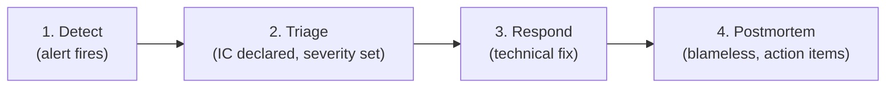
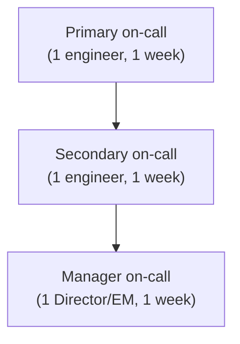

# VP of Engineering Playbook
## Chapter 12

# Reliability, SLOs, and Incident Response at Scale

> *"At scale, reliability is not a feature. Reliability is the system property that lets every other feature succeed."*

---

## 1. Epigraph

At scale, reliability is not a feature. Reliability is the system property that lets every other feature succeed.

---

## 2. Problem

You are the VPE at a 1,200-person company. The engineering org has 250 engineers, 8 product teams, 18 services in production. Last quarter: 23 production incidents, MTTR was 4 hours, customer-reported bugs are up 30%, the on-call rotation has burned out 2 senior engineers (both gave notice), and the CEO has just told you: "Our customers are asking about reliability. We're 6 months behind on enterprise tier. The platform is the bottleneck."

You have 30 days to design a reliability + incident response system that scales to 18 services, 8 teams, and 24/7 customer-facing operations. This chapter tells you what that system looks like.

**Decision in one sentence:** Reliability at scale is a 3-tier system — Tier 1 (cross-team reliability SLOs owned by SRE + VPE, with cross-team incident command), Tier 2 (per-team SLOs and on-call rotations owned by Directors), Tier 3 (service-level observability and runbooks owned by the team) — backed by a 5-level severity ladder, a 4-step incident command structure, and a blameless postmortem culture; the VPE's job is to keep Tier 1 under 5 SLOs, hold the line on blameless, and own the customer-facing reliability narrative.

---

## 3. Why VPEs Fail Here

Five named failure modes of VPEs whose reliability system produced zero results.

- **The Hero-Engineer Failure.** The org has 1-2 senior engineers who know how the production system works. They get paged constantly. They burn out. They leave. The org has no institutional knowledge. The VPE has not built a shared on-call rotation.
- **The Cross-Team-Blame Failure.** A sev-1 incident crosses 3 teams. Each team blames the others. No one owns the cross-team fix. The incident recurs. The VPE has not stood up cross-team incident command.
- **The SLO-Theater Failure.** The org has 50 SLOs. The Directors don't know which ones matter. The SLOs are aspirational. The incidents continue. The VPE has not built the tier system.
- **The On-Call-Burnout Failure.** The on-call rotation is the same 4 engineers. They get paged 5+ times per week. They burn out. They leave. The VPE has not built the rotation discipline.
- **The Postmortem-Blame Failure.** When an incident happens, the VPE finds the engineer who wrote the bug and "holds them accountable." The engineers hide bugs. The incidents compound. The VPE has not built a blameless culture.

---

## 4. Mental Models

Four mental models that compress reliability at scale.

**Mental model 1: The 5-Level Severity Ladder.** Every incident has a severity. The VPE defines the 5 levels and the response for each.



**The severity ladder rules:**
- Severity is declared by the on-call or the IC. VPE has final say.
- Sev-1 requires the VPE to be informed within 15 minutes.
- Sev-2 requires the VPE to be informed within 1 hour.
- Sev-3+ does not require VPE involvement.

**Mental model 2: The Incident Command Structure.** Sev-1 and Sev-2 incidents need a command structure. The VPE defines the 4 roles.



**The 4 roles:**
- **Incident Commander (IC)**: The decision-maker. Decides severity, declares incident over, escalates. NOT necessarily the most technical person. Often a Director or senior EM.
- **Operations Lead**: The technical lead. Runs the response. Updates the IC every 15 minutes.
- **Comms Lead**: Owns customer + executive comms. Updates status page, posts to #incidents, notifies CEO.
- **Scribe**: Records the timeline + decisions. Owns the postmortem.

**Mental model 3: The 4-Step Incident Response.** Every sev-1 + sev-2 incident follows 4 steps.



**Step 1: Detect (target: <5 min from incident start)**
- Alert fires from monitoring (Loki/Prometheus)
- On-call paged via PagerDuty
- On-call acknowledges within 5 minutes

**Step 2: Triage (target: <10 min)**
- On-call declares incident, sets severity
- IC assigned (on-call or escalated)
- Comms Lead assigned
- Scribe assigned
- Status page updated within 15 minutes

**Step 3: Respond (target: MTTR per severity)**
- Operations Lead runs the technical response
- IC makes the calls (rollback, scale, fix forward, etc.)
- Comms Lead updates status page every 30 minutes
- CEO notified for sev-1 (within 30 minutes)

**Step 4: Postmortem (target: within 5 business days)**
- Scribe writes the postmortem (1-page template from Ch 9)
- IC reviews + adds action items
- Blameless review with the team that owned the service
- Public to the engineering org within 7 days
- Action items have owners + dates

**Mental model 4: The On-Call Rotation.** A well-designed on-call rotation is sustainable + fair + skilled.



**The 3-tier on-call rotation:**
- **Primary**: First responder. Pages go to them. Must acknowledge within 5 min.
- **Secondary**: Backup. Paged if primary doesn't ack within 10 min.
- **Manager**: Escalation. Paged if secondary doesn't ack within 15 min, OR for any sev-1.

**Rotation rules:**
- 1-week rotations (Monday 9am → Monday 9am)
- 1 follow-up day off after a sev-1 (per the engineer's preference)
- Page budget: <2 pages/week per primary on-call
- If page budget exceeded, the on-call gets a comp day
- 6-month rotation: every engineer in the team is on primary at least once

---

## 5. Frameworks

Three frameworks for reliability + incident response at scale.

### Framework 1: The Reliability SLO Dashboard

```
# Reliability SLO Dashboard — Q[N] [YEAR]

## Tier 1 SLOs (cross-team, VPE-owned)
| SLO | Target | Current | Error budget | Status |
|-----|--------|---------|-------------|--------|
| Availability (top 10 services) | 99.9% | 99.85% | 1.5x monthly | 🟡 |
| Latency (p99, top 10 endpoints) | <200ms | 195ms | OK | 🟢 |
| Durability (data) | 99.999% | 100% | 0 | 🟢 |
| Recovery (MTTR, sev-1) | <1 hour | 2.5h | 4/quarter | 🔴 |

## Tier 2 SLOs (per-team, Director-owned)
[Per-team SLOs. 1-2 per service. E.g., per-team availability,
 per-team latency.]

## Tier 3 (service-level, team-owned)
[Per-service SLOs. 1 per service. E.g., 99.5% availability.]

## Error budget consumption (top 5 services)
1. [Service] - 80% of monthly budget used - on track
2. [Service] - 100% of monthly budget used - feature freeze
3. ...
```

### Framework 2: The Incident Response Runbook

Every sev-1 + sev-2 incident has a runbook. The runbook is 1-2 pages.

```
# Incident Runbook — [Service name]

## Severity
[What makes this a sev-1, sev-2, sev-3.]

## Detection
[What alert fires, what it looks like.]

## Triage (first 5 min)
1. Acknowledge the page.
2. Open #incidents in Slack.
3. Declare severity.
4. Assign IC, Ops Lead, Comms Lead, Scribe.

## Response (first 30 min)
1. Check [dashboard URL].
2. Check [log URL].
3. Check [dependency status page].
4. If X, do Y.
5. If Z, escalate to Manager on-call.

## Communication (every 30 min)
1. Update status page.
2. Update #incidents.
3. For sev-1, notify CEO.

## Postmortem (within 5 business days)
1. Scribe writes the postmortem using Ch 9 template.
2. IC reviews + adds action items.
3. Public within 7 days.
```

### Framework 3: The Quarterly Reliability Review (60 min)

Every quarter, the VPE runs a 60-minute reliability review with the SRE Lead + Directors.

```
Agenda (60 min):
0-5 min:   VPE opening
           - 3 numbers: MTTR, incident count, error budget
             consumption
5-20 min:  Tier 1 SLO review
           - 4 SLOs: status, error budget consumption
           - If any SLO is red, action plan
20-30 min: Top 3 incidents (last quarter)
           - Postmortem review
           - Action items status
           - Pattern detection
30-40 min: On-call health
           - Page count per primary on-call
           - Burnout signals
           - Compensation given
40-50 min: Reliability investment
           - $XM allocated to reliability
           - 2-3 active initiatives
50-60 min: VPE summary (next quarter's reliability priorities)
```

---

## 6. Drill

You are the VPE at **acme-corp**. Last quarter: 23 production incidents, MTTR 4 hours, 2 senior engineers burned out from on-call, customers asking about reliability, 6 months behind on enterprise tier.

You have **90 minutes**. Produce a **reliability + incident response plan** (`portfolio/chapter-12-reliability-plan.md`) using Framework 1 (SLO Dashboard) + Framework 2 (Incident Runbook) + Framework 3 (Quarterly Reliability Review). Specify:

- The 4 Tier 1 reliability SLOs (with error budget rules).
- The 5-level severity ladder (with response for each).
- The 4-step incident response (with MTTR targets).
- The 3-tier on-call rotation (with page budget rules).
- The 3 things you'll do to fix the on-call burnout.
- The 1 thing you'll say to the CEO about customer-facing reliability.
- The first quarterly reliability review agenda.

**Deliverable:** `portfolio/chapter-12-reliability-plan.md` — under 1500 words.

---

## 7. Worked Example

**The 4 Tier 1 reliability SLOs (with error budget rules):**

```
# Tier 1 SLOs — Q4 2026

## SLO 1: Availability
- Target: 99.9% uptime for top 10 customer-facing services
- Error budget: 43.2 minutes/month
- If exceeded for 2 consecutive months: freeze non-critical
  feature work in the offending service
- Owner: SRE Lead (with VPE oversight)

## SLO 2: Latency
- Target: p99 < 200ms for top 10 customer-facing endpoints
- Error budget: 1% of requests can exceed 200ms
- If exceeded: investigate root cause within 7 days
- Owner: SRE Lead

## SLO 3: Durability
- Target: 99.999% data durability (no customer data loss)
- Error budget: 0 (zero tolerance)
- If exceeded: sev-1 incident, full IRB review
- Owner: Director, Data

## SLO 4: Recovery
- Target: MTTR < 1 hour for sev-1 incidents
- Error budget: 4 sev-1 incidents/quarter with MTTR > 1 hour
- If exceeded: incident review, systemic fix
- Owner: SRE Lead
```

**The 5-level severity ladder:**

```
Sev-1: Customer-facing outage (>5% of users affected)
  Response: 24/7 incident command, all-hands
  MTTR target: <1 hour
  VPE informed: <15 minutes

Sev-2: Major degradation (1-5% of users)
  Response: 24/7 incident command, on-call
  MTTR target: <4 hours
  VPE informed: <1 hour

Sev-3: Minor degradation (<1% of users, no data loss)
  Response: business hours, on-call
  MTTR target: <24 hours
  VPE informed: not required

Sev-4: Internal-only issue (no customer impact)
  Response: business hours, on-call
  MTTR target: <1 week
  VPE informed: not required

Sev-5: Cosmetic / minor (no functional impact)
  Response: next sprint
  MTTR target: <1 month
  VPE informed: not required
```

**The 4-step incident response (with MTTR targets):**

```
Step 1: Detect (target: <5 min from incident start)
  - Alert fires from monitoring
  - On-call paged via PagerDuty
  - On-call acknowledges within 5 min

Step 2: Triage (target: <10 min)
  - On-call declares incident
  - Severity set
  - IC, Ops Lead, Comms Lead, Scribe assigned
  - Status page updated within 15 min

Step 3: Respond (target: MTTR per severity)
  - Ops Lead runs the technical response
  - IC makes the calls
  - Comms Lead updates status page every 30 min
  - CEO notified for sev-1 within 30 min

Step 4: Postmortem (target: <5 business days)
  - Scribe writes postmortem
  - IC reviews
  - Blameless review with the team
  - Public within 7 days
```

**The 3-tier on-call rotation (with page budget rules):**

```
Primary on-call: 1 engineer, 1 week
  - First responder
  - Pages go to them
  - Must ack within 5 min

Secondary on-call: 1 engineer, 1 week
  - Backup for primary
  - Paged if primary doesn't ack within 10 min

Manager on-call: 1 Director/EM, 1 week
  - Escalation
  - Paged if secondary doesn't ack within 15 min
  - Auto-paged for any sev-1

Page budget rules:
  - Target: <2 pages/week per primary on-call
  - If exceeded: comp day next week
  - If sev-1 incident: comp day after the incident
  - 6-month rotation: every engineer in the team is on primary
    at least once
```

**The 3 things I'll do to fix the on-call burnout:**

```
1. Comp days enforced.
   Currently: 2 senior engineers got paged 5+ times/week and
   burned out. No comp days given.
   Fix: enforce the comp day rule. Every sev-1 → comp day
   the next day. Page budget >2/week → comp day next week.

2. Page budget enforced.
   Currently: alerts fire on anything. Pages are noisy.
   Fix: review every alert. Kill alerts that don't lead to
   action. Target: <2 pages/week per primary.

3. Runbooks for every service.
   Currently: on-call has to know the system. 2 senior
   engineers knew it. They left.
   Fix: every sev-1 + sev-2 service has a 1-page runbook
   (per Framework 2). Onboarding for new on-calls includes
   runbook walkthrough.
```

**The 1 thing I'll say to the CEO about customer-facing reliability:**

```
The truth:

"Last quarter we had 23 incidents, MTTR was 4 hours, and
2 senior engineers burned out. We are not at the reliability
level enterprise tier requires.

The fix is a 12-month reliability investment plan: $2M in
reliability tooling + $1M in on-call rotation + $1.5M in
SLO adoption. After 12 months, we will hit elite SLOs
(99.99% availability, <1 hour MTTR) and be ready for
enterprise tier.

Until then, I recommend we tell enterprise prospects that
we are Tier 2 reliability today and Tier 1 in 12 months.
The customers will respect the honesty.

The alternative — shipping enterprise tier on this foundation
— will produce a 10x worse outcome: customer churn, brand
damage, and a much longer fix later."

This is the VPE's job: own the customer-facing reliability
narrative, recommend the investment, and not pretend the
foundation is ready when it isn't.
```

**The first quarterly reliability review agenda (60 min):**

```
Attendees: VPE + SRE Lead + 5 Directors + Sec Eng
Duration: 60 minutes
Cadence: quarterly (next: end of Q4 2026)

Agenda:
0-5 min:   VPE opening
           - 3 numbers: MTTR (4h), incident count (23),
             on-call page budget (avg 5/week)
5-20 min:  Tier 1 SLO review
           - Availability: 99.85% (under target, action plan)
           - Latency: 99.2% (above target, OK)
           - Durability: 100% (no incidents, OK)
           - Recovery: MTTR 2.5h (over target, action plan)
20-30 min: Top 3 incidents
           - Sev-1: customer data exposure (postmortem review)
           - Sev-1: DB failover failed (postmortem review)
           - Sev-2: auth service degraded (postmortem review)
30-40 min: On-call health
           - 2 engineers burned out (comp days pending)
           - Page budget: avg 5/week (over target)
           - Action: kill noisy alerts, enforce comp days
40-50 min: Reliability investment
           - $2M allocated to reliability in 2026
           - 3 active initiatives: observability, SLO tooling,
             on-call rotation
50-60 min: VPE summary
           - Q4 priorities: hit SLO 1, fix MTTR, fix on-call
```

---

## 8. Failure Mode Postmortem

A VPE at a 1,500-person company inherited an engineering org with 1 senior engineer who knew the production system. The senior engineer was on-call 24/7. Within 18 months, the senior engineer burned out and gave notice. Within 30 days, the org had a sev-1 incident that nobody could fix. The system was down for 8 hours. The CEO asked: "Why didn't anyone know how to fix this?"

What the VPE missed: 3 things.
1. **No shared on-call rotation.** 1 engineer knew the system. When they left, the institutional knowledge left.
2. **No runbooks.** When the engineer left, the documentation left with them.
3. **No Tier 1 SLOs.** The org didn't have explicit reliability targets. The CEO didn't know the system was on the shoulders of 1 engineer.

The replacement VPE did 4 things:
1. Stood up a 3-tier on-call rotation across 8 engineers.
2. Required a 1-page runbook for every sev-1 + sev-2 service.
3. Set 4 Tier 1 SLOs with error budget rules.
4. Made the comp-day rule enforced (every sev-1 → comp day).

Within 12 months, MTTR was down 50%. On-call burnout was eliminated. The system had 4 people who knew it, not 1.

The lesson: reliability is a system property. The VPE who builds the system owns the reliability. The VPE who depends on hero engineers owns the burnout.

---

## 9. Self-Assessment Rubric

| # | Dimension | 1 (Novice) | 3 (Competent) | 5 (Expert) |
|---|---|---|---|---|
| 1 | **5-level severity** | No severity ladder | 3 levels (sev-1, sev-2, other) | 5 levels with response + MTTR per level |
| 2 | **Incident command** | No command structure | IC + Ops Lead | 4 roles (IC, Ops, Comms, Scribe) |
| 3 | **4-step response** | No defined process | 4 steps, mostly followed | 4 steps, MTTR targets, blameless postmortems |
| 4 | **On-call rotation** | Hero engineers | Rotation exists | 3-tier rotation, page budget, comp days |
| 5 | **SLO discipline** | No SLOs | Tier 1 SLOs exist | Tier 1 <5 SLOs, error budget rules, monthly review |

**Disqualifier:** any 1 on dimension 1 or 4. A VPE with no severity ladder or who depends on hero engineers is in the Hero-Engineer Failure or No-Severity-Ladder trap.

**Total:** ___ / 25. **Pass threshold:** 18/25, no dimension below 3.

---

## 10. Portfolio Artifact Note

Save your filled-in drill as `portfolio/chapter-12-reliability-plan.md` — interview evidence for "How do you build a reliability system at scale?" (see Portfolio Map in Chapter 27).

---

## 11. Interview Questions

1. **Walk me through your incident response system.**
2. **A sev-1 incident is in progress. Walk me through the first 30 minutes.**
3. **Two senior engineers are burned out from on-call. What do you do?**
4. **How do you decide what makes a sev-1 vs sev-2?**
5. **The CEO asks "are we ready for enterprise tier on reliability?" What do you say?**