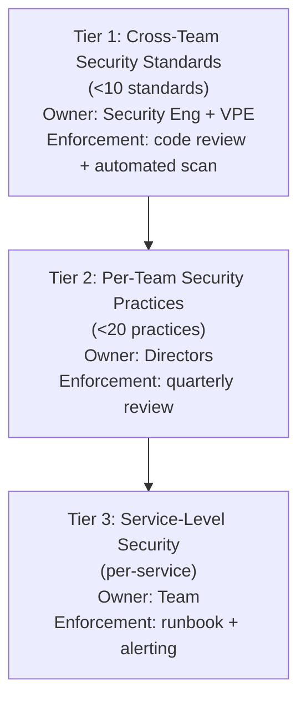
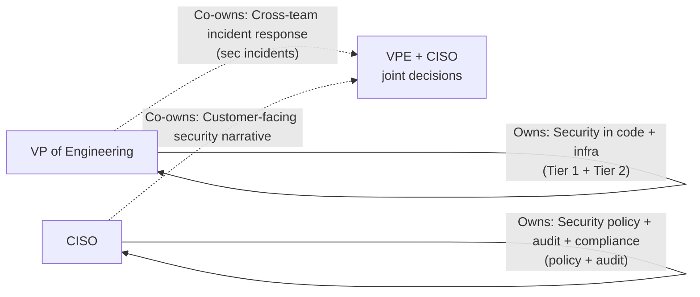
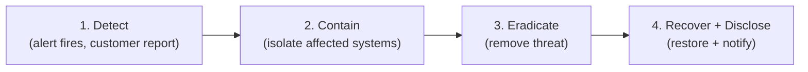
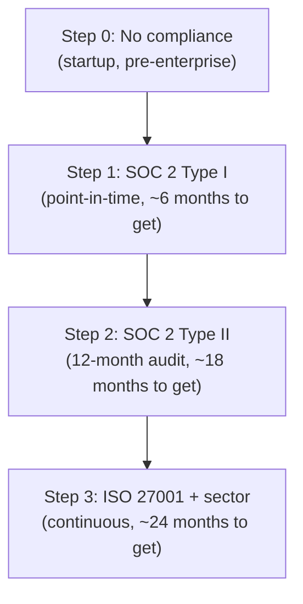

# VP of Engineering Playbook
## Chapter 13

# Security, Privacy, Compliance at Scale

> *"Security is not a feature you add at the end. It is the foundation that lets every feature exist. The VPE's job is to own the foundation, not delegate it to the CISO alone."*

---

## 1. Epigraph

Security is not a feature you add at the end. It is the foundation that lets every feature exist. The VPE's job is to own the foundation, not delegate it to the CISO alone.

---

## 2. Problem

You are the VPE at a 1,200-person company. Last quarter: a sev-1 security incident exposed 12K customer records via a third-party vendor, the security team flagged 4 unpatched critical vulnerabilities in production services, the CFO is asking about SOC 2 Type II for enterprise tier, the CISO has just told you: "We're not ready for enterprise tier security audit. We'll fail." The CEO says: "We can't ship enterprise tier without SOC 2. What's the plan?"

You have 30 days to design a security, privacy, and compliance system that scales to 18 services, 8 teams, and an enterprise tier that requires SOC 2. This chapter tells you what that system looks like.

**Decision in one sentence:** Security at scale is a 3-tier system — Tier 1 (cross-team security standards owned by Security Engineer + VPE, with mandatory enforcement), Tier 2 (per-team security practices owned by Directors, with quarterly review), Tier 3 (service-level security owned by the team) — backed by a 4-step incident response, a 4-step compliance posture, and a VPE-CISO partnership that the VPE owns; the VPE's job is to keep Tier 1 under 10 standards, run the security incident response, and own the customer-facing security narrative.

---

## 3. Why VPEs Fail Here

Five named failure modes of VPEs whose security system produced zero results.

- **The CISO-Only Failure.** The VPE delegates all security to the CISO. The CISO has authority but no engineering capacity. The engineering org ignores security. The VPE has abdicated the VPE's security responsibility.
- **The Standards-List Failure.** The VPE publishes a 30-page security standards document. The ICs don't read it. The Directors don't enforce it. The standards are decoration.
- **The After-The-Breach Failure.** The VPE only invests in security after a breach. The investment is reactive. The next breach happens anyway. The VPE has not built the proactive discipline.
- **The No-Compliance-Posture Failure.** The VPE doesn't know the company's compliance posture (SOC 2, ISO 27001, HIPAA, GDPR). The CEO asks about SOC 2 and the VPE has no answer. The VPE has not built the compliance discipline.
- **The Vendor-Blind Failure.** The VPE's security model assumes the company's code is the only attack surface. A third-party vendor is the source of a customer data breach. The VPE has not built a vendor security review process.

---

## 4. Mental Models

Four mental models that compress security + privacy + compliance at scale.

**Mental model 1: The 3-Tier Security System.** Security at scale is a 3-tier system. Each tier has a different owner and a different enforcement mechanism.



The VPE's job is to keep Tier 1 under 10 standards. More than 10 and the Security Eng is over-loaded, the standards are ignored, and the org is in the Standards-List Failure trap.

**Mental model 2: The VPE-CISO Partnership.** Security is a partnership between the VPE and the CISO. The partnership has 4 boundaries.



**The 4 boundaries:**
- **VPE owns**: Security in code + infrastructure. Tier 1 standards. Security incident response (the engineering side).
- **CISO owns**: Security policy, audit, compliance, customer-facing security posture.
- **Co-owned**: Cross-team incident response, customer-facing security narrative, security architecture decisions (ARB).

**Mental model 3: The 4-Step Security Incident Response.** Security incidents have their own response structure, separate from reliability incidents (Ch 12).



**Step 1: Detect (target: <1 hour from breach start)**
- Alert fires (anomalous access, data exfiltration, vendor breach report)
- Customer report (e.g., "I think my data is exposed")
- Bug bounty report (e.g., from HackerOne)
- Internal report (e.g., from a Director)

**Step 2: Contain (target: <2 hours)**
- Isolate affected systems (revoke credentials, block IP, take service offline)
- Preserve evidence (logs, snapshots)
- Notify CEO + CISO + VPE within 30 minutes

**Step 3: Eradicate (target: <24 hours)**
- Remove the threat (patch vuln, remove malware, terminate vendor)
- Validate that the threat is gone (re-scan, re-audit)
- Legal team engaged (regulatory disclosure obligations)

**Step 4: Recover + Disclose (target: <72 hours)**
- Restore service from clean backup
- Disclose to affected customers (per regulatory requirements)
- Disclose to regulators (per GDPR, CCPA, etc.)
- Postmortem (within 7 days, blameless, public to engineering org)

**Mental model 4: The 4-Step Compliance Posture.** Compliance at scale is a 4-step ladder: None → SOC 2 Type I → SOC 2 Type II → ISO 27001 + sector-specific.



**The 4-step compliance ladder:**
- **Step 0: No compliance.** Startup. No customer asks for compliance. Security ad-hoc.
- **Step 1: SOC 2 Type I.** Point-in-time audit. ~6 months to get. Required for first enterprise customers.
- **Step 2: SOC 2 Type II.** 12-month audit. ~18 months to get. Required for most enterprise customers.
- **Step 3: ISO 27001 + sector.** Continuous audit. ~24 months to get. Required for regulated industries (healthcare, finance, government).

The VPE's job: know which step the company is on, what's required for the next step, and own the engineering work to get there.

---

## 5. Frameworks

Three frameworks for security + privacy + compliance at scale.

### Framework 1: The Tier 1 Security Standards

A VPE's Tier 1 security standards list should be under 10 items. The list is reviewed annually.

```
# Tier 1 Security Standards — [Date]

## Standards
1.  All customer data encrypted at rest (AES-256)
2.  All customer data encrypted in transit (TLS 1.3)
3.  All access to customer data logged (audit trail)
4.  All secrets stored in HashiCorp Vault (no env vars, no config files)
5.  All code dependencies scanned for known vulns (Snyk, Dependabot)
6.  All code scanned for secrets (TruffleHog, GitLeaks)
7.  All production access requires MFA + SSO
8.  All customer data access requires break-glass request + VPE/CISO approval
9.  All vendors processing customer data reviewed by Security Eng (annual)
10. (1 slot reserved for future use)

NOT Tier 1 (Tier 2 or 3):
- Internal security training (Tier 2)
- Per-team security practices (Tier 2)
- Service-level security configurations (Tier 3)
- Runbook for sec incidents (Tier 3)
```

### Framework 2: The Vendor Security Review

Every third-party vendor that processes customer data gets a security review.

```
# Vendor Security Review — [Vendor name] — [Date]

## Vendor
- Name: ___
- Service: ___
- Customer data accessed: ___
- Volume of customer data: ___

## Security questionnaire (24 questions)
[Standard SIG or CAIQ questionnaire. Sections: access control,
 data protection, encryption, logging, incident response,
 compliance, business continuity, etc.]

## Security audit
- SOC 2 Type II: yes / no / in progress
- ISO 27001: yes / no
- Pen test in last 12 months: yes / no
- Bug bounty program: yes / no

## Decision
[Approve / Approve with conditions / Reject]

## Conditions (if any)
[List conditions. E.g., "Must complete SOC 2 Type II within 12 months."]

## Review date
[Annual.]
```

### Framework 3: The Quarterly Security Review (60 min)

Every quarter, the VPE runs a 60-minute security review with the Security Eng + Directors + CISO.

```
Agenda (60 min):
0-5 min:   VPE opening
           - 3 numbers: open critical vulns, sec incidents
             last quarter, vendor reviews outstanding
5-20 min:  Tier 1 standards review
           - 10 standards: status, exceptions
           - If any standard is below 80% adoption, action plan
20-30 min: Top 3 security incidents (last quarter)
           - Postmortem review (1-page template from Ch 9)
           - Action items status
30-40 min: Vendor security
           - Vendor reviews outstanding
           - New vendors this quarter (review status)
           - Vendor with conditions (progress check)
40-50 min: Compliance posture
           - Current step on the 4-step ladder
           - What's required for the next step
           - 2-3 active initiatives
50-60 min: VPE summary (next quarter's security priorities)
```

---

## 6. Drill

You are the VPE at **acme-corp**. Last quarter: 1 sev-1 security incident (12K customer records exposed via third-party vendor), 4 unpatched critical vulns, no SOC 2 audit, CISO says "we're not ready for enterprise tier." CEO says: "We can't ship enterprise tier without SOC 2."

You have **90 minutes**. Produce a **security + compliance plan** (`portfolio/chapter-13-security-compliance-plan.md`) using Framework 1 (Tier 1 Standards) + Framework 2 (Vendor Security Review) + Framework 3 (Quarterly Security Review). Specify:

- The 10-item Tier 1 security standards list.
- The 4-step security incident response (with timing for each step).
- The vendor security review for the third-party vendor that caused the breach.
- The compliance posture (current step, next step, what's required).
- The 1 thing you'll say to the CEO about enterprise tier security readiness.
- The 3 things you'll do to fix the 4 unpatched critical vulns.
- The first quarterly security review agenda.

**Deliverable:** `portfolio/chapter-13-security-compliance-plan.md` — under 1500 words.

---

## 7. Worked Example

**The 10-item Tier 1 security standards list:**

```
# Tier 1 Security Standards — Q4 2026

1.  All customer data encrypted at rest (AES-256)
2.  All customer data encrypted in transit (TLS 1.3)
3.  All access to customer data logged (audit trail)
4.  All secrets stored in HashiCorp Vault
5.  All code deps scanned for vulns (Snyk)
6.  All code scanned for secrets (TruffleHog)
7.  All prod access requires MFA + SSO
8.  All customer data access requires break-glass + VPE/CISO approval
9.  All vendors processing customer data reviewed (annual)
10. (reserved for future use)
```

**The 4-step security incident response (with timing):**

```
Step 1: Detect (target: <1 hour)
  - Alert from monitoring
  - Customer report
  - Bug bounty report
  - Internal report

Step 2: Contain (target: <2 hours)
  - Isolate affected systems
  - Preserve evidence
  - Notify CEO + CISO + VPE within 30 min

Step 3: Eradicate (target: <24 hours)
  - Remove the threat
  - Validate gone
  - Legal team engaged

Step 4: Recover + Disclose (target: <72 hours)
  - Restore service
  - Disclose to customers
  - Disclose to regulators
  - Postmortem within 7 days
```

**The vendor security review (third-party vendor that caused the breach):**

```
# Vendor Security Review — AcmeVendor X — Q3 2026

## Vendor
- Name: AcmeVendor X
- Service: data analytics
- Customer data accessed: 12K customer records (name, email, last login)
- Volume: 12K records

## What happened
- Vendor had a misconfigured S3 bucket
- Records exposed for 6 hours
- Vendor detected and notified us within 24 hours

## Security audit
- SOC 2 Type II: yes
- ISO 27001: no
- Pen test in last 12 months: yes (but missed the S3 misconfig)
- Bug bounty program: no

## Decision
- Approve with conditions:
  1. Migrate off AcmeVendor X within 90 days (replace with in-house analytics)
  2. Until migration: weekly audit of AcmeVendor X's access logs
  3. AcmeVendor X must start a bug bounty program within 6 months
  4. Notify all 12K affected customers within 72 hours (per CCPA)

## Cost
- Migration: 3 engineers × 3 months = 9 eq-qtr = $700K
- Customer notification: $50K
- Legal fees: $200K
- Total: $950K
```

**The compliance posture:**

```
# Compliance Posture — Q3 2026

## Current step
Step 0 (no compliance). No SOC 2, no ISO 27001.

## Next step
Step 1: SOC 2 Type I. Required for first enterprise customers.

## What's required for SOC 2 Type I (~6 months)
- Tier 1 security standards adopted (>80% of org)
- Vendor security reviews for all customer-data vendors
- Security incident response (Ch 12 + this chapter)
- Access controls (MFA, SSO, audit trail)
- Encryption (at rest + in transit)
- Quarterly security review
- Annual pen test
- 6 months of operating evidence (the "Type I" point-in-time)

## Active initiatives (Q4 2026 - Q2 2027)
- Hire Security Eng (Q4)
- Adopt 10 Tier 1 standards (Q4 - Q1)
- Vendor reviews for 8 customer-data vendors (Q4 - Q1)
- Pen test (Q1)
- SOC 2 Type I audit (Q2)
```

**The 1 thing I'll say to the CEO about enterprise tier security readiness:**

```
The truth:

"Last quarter we had a sev-1 security incident (12K customer
records exposed via a third-party vendor). 4 critical vulns
are unpatched. We have no SOC 2 audit. We are not ready for
enterprise tier security.

The fix is a 12-month security investment plan: $1.5M in
Security Eng hire + tooling + SOC 2 Type I/II audits. After
12 months, we will have SOC 2 Type I and be ready for first
enterprise customers.

Until then, I recommend we tell enterprise prospects that
we have SOC 2 Type I pending (Q2 2027). The customers will
respect the honesty.

The alternative — shipping enterprise tier on this foundation
— will produce a 10x worse outcome: customer breach, regulatory
fine, brand damage, and a much longer fix later."

This is the VPE's job: own the customer-facing security
narrative, recommend the investment, and not pretend the
foundation is ready when it isn't.
```

**The 3 things I'll do to fix the 4 unpatched critical vulns:**

```
1. Patch the 2 customer-data-accessible vulns in 7 days.
   Why first: these are the highest risk. Customer data
   exposure. Patch within 7 days. Owner: Security Eng +
   affected team leads.

2. Patch the 2 internal-only vulns in 30 days.
   Why second: lower risk (no customer data), but still
   critical. Patch within 30 days. Owner: Security Eng +
   affected team leads.

3. Stand up automated vuln scanning in CI.
   Why third: prevent the next round. Snyk + Dependabot +
   TruffleHog in CI on every PR. New vulns caught at PR time.
   Owner: Security Eng + Platform team.
```

**The first quarterly security review agenda (60 min):**

```
Attendees: VPE + CISO + Security Eng + 5 Directors
Duration: 60 minutes
Cadence: quarterly (next: end of Q4 2026)

Agenda:
0-5 min:   VPE opening
           - 3 numbers: open critical vulns (4), sec incidents
             (1 last quarter), vendor reviews outstanding (3)
5-20 min:  Tier 1 standards review
           - 10 standards: status, exceptions
           - Action: 2 standards below 80% adoption (secrets in
                     Vault, code scanning in CI)
20-30 min: Top 3 security incidents
           - Sev-1: customer data exposure (postmortem review)
           - Sev-2: 2 internal-only vulns (postmortem)
30-40 min: Vendor security
           - 3 vendor reviews outstanding
           - 1 vendor (AcmeVendor X) on track to migrate
40-50 min: Compliance posture
           - Current: Step 0 (no compliance)
           - Target: Step 1 (SOC 2 Type I) by Q2 2027
           - Active initiatives: 5
50-60 min: VPE summary
           - Q4 priorities: patch 4 vulns, complete 3 vendor
             reviews, hire Security Eng
```

---

## 8. Failure Mode Postmortem

A VPE at a 1,500-person company delegated all security to the CISO. The CISO was a strong policy person but had no engineering capacity. The VPE assumed the CISO owned security. The engineering org assumed security was the CISO's job.

A sev-1 security incident exposed 50K customer records. The cause: an unpatched critical vulnerability in a service owned by a Director who didn't know it was his responsibility. The breach cost the company $5M in customer notification, legal fees, and lost contracts.

The CEO asked: "Why didn't the engineering org catch this?" The VPE said: "Security is the CISO's job." The CEO said: "Security in the code is the VPE's job. The CISO owns policy. You own the code."

What the VPE missed: the VPE-CISO partnership. The CISO owns policy + audit + compliance. The VPE owns security in code + infrastructure. The two are co-owners of cross-team incident response and customer-facing narrative.

The lesson: the VPE does not delegate security. The VPE owns the foundation. The CISO is a partner, not a substitute.

---

## 9. Self-Assessment Rubric

| # | Dimension | 1 (Novice) | 3 (Competent) | 5 (Expert) |
|---|---|---|---|---|
| 1 | **3-tier system** | No tiers, 30+ standards | 3 tiers, but Tier 1 has 15+ standards | 3 tiers, Tier 1 <10 standards |
| 2 | **VPE-CISO partnership** | CISO-only (VPE abdicates) | Clear boundaries | Strong partnership, quarterly review |
| 3 | **4-step incident response** | No defined process | 4 steps, mostly followed | 4 steps with timing, blameless postmortems |
| 4 | **Vendor security** | No vendor review | Annual review | Quarterly review, with conditions enforced |
| 5 | **Compliance posture** | Unknown posture | Known step, no plan to advance | Known step, active plan to advance, 12-month target |

**Disqualifier:** any 1 on dimension 1 or 2. A VPE with no security tiers or who abdicates to the CISO is in the Standards-List Failure or CISO-Only Failure.

**Total:** ___ / 25. **Pass threshold:** 18/25, no dimension below 3.

---

## 10. Portfolio Artifact Note

Save your filled-in drill as `portfolio/chapter-13-security-compliance-plan.md` — interview evidence for "How do you build a security system at scale?" (see Portfolio Map in Chapter 27).

---

## 11. Interview Questions

1. **Walk me through your security + compliance system.**
2. **A sev-1 security incident happens. Walk me through the first 24 hours.**
3. **The CEO asks "are we SOC 2 ready?" What do you say?**
4. **A third-party vendor exposes customer data. What do you do?**
5. **What's the VPE's role vs the CISO's role in security?**