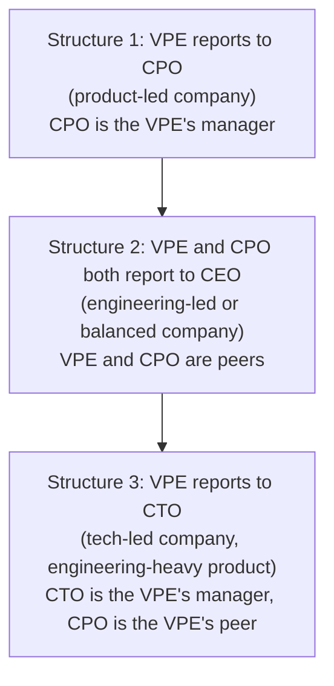
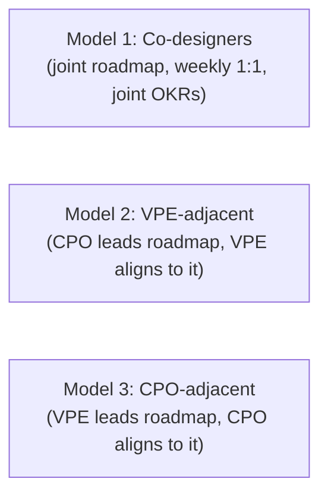
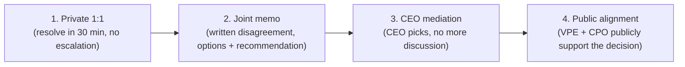

# VP of Engineering Playbook
## Chapter 14

# Engineering and Product Partnership

> *"The VPE-CPO relationship is the most leveraged relationship in the company. When it works, the company ships. When it breaks, the company stalls."*

---

## 1. Epigraph

The VPE-CPO relationship is the most leveraged relationship in the company. When it works, the company ships. When it breaks, the company stalls.

---

## 2. Problem

You are the VPE at a 1,200-person company. The CPO has been there for 2 years. The product roadmap is set for the year. The engineering org is in the middle of an enterprise tier build. The CPO has just told you: "Engineering is shipping 30% below roadmap commitments. We're going to miss our Q3 enterprise tier launch. Customers are asking when we'll deliver." The CEO has just told you: "I need VPE and CPO aligned. Your conflict is becoming visible to the board." You have 30 days to design a VPE-CPO partnership that produces on-time delivery and a shared roadmap.

**Decision in one sentence:** The VPE-CPO partnership at scale is one of 3 models (co-equal, VPE-adjacent, or CPO-adjacent) — chosen by company structure — backed by a weekly 1:1 between VPE + CPO, a shared quarterly OKR process, a joint roadmap review, and an explicit conflict-resolution protocol; the VPE's job is to design the partnership before conflict emerges, not after.

---

## 3. Why VPEs Fail Here

Five named failure modes of VPEs whose VPE-CPO partnership produced zero results.

- **The Co-Equal-Failure.** The VPE believes they are co-equal with the CPO. They are not. The CPO owns the product. The VPE owns the engineering. When the VPE and CPO disagree, the CEO breaks the tie. The VPE who thinks they are co-equal is the VPE who has not understood the org structure.
- **The VPE-Adjacent-Trap.** The VPE reports to the CPO. The CPO controls the VPE's budget, the VPE's roadmap, the VPE's Director-level hires. The VPE has no autonomy. The VPE who reports to the CPO is the VPE who is a Director with a bigger title.
- **The CPO-Adjacent-Trap.** The VPE reports to the CEO. The CPO reports to the CEO. The CPO is the VPE's peer. The VPE has full autonomy but no alignment. The CPO and VPE are in conflict. The CEO has to mediate. The VPE has not designed the partnership.
- **The Roadmap-Blame-Game.** The VPE and CPO have separate roadmaps. The VPE says the CPO's roadmap is unrealistic. The CPO says the VPE's engineering can't deliver. The CEO has to mediate. The VPE has not built a shared roadmap process.
- **The Public-Conflict Failure.** The VPE and CPO disagree publicly (in all-hands, in board meetings, in customer meetings). The org picks sides. The conflict becomes a culture problem. The VPE has not built the private conflict-resolution protocol.

---

## 4. Mental Models

Four mental models that compress the VPE-CPO partnership at scale.

**Mental model 1: The 3 VPE-CPO Org Structures.** There are 3 ways the VPE and CPO are organized. Each has different partnership dynamics.



**The 3 structures:**

- **Structure 1: VPE reports to CPO.** Common in product-led companies (e.g., consumer apps, SaaS). The CPO owns the product AND the engineering. The VPE is a Director-equivalent. Risk: VPE has no engineering autonomy, often a CPO-Director rather than a VPE.
- **Structure 2: VPE and CPO both report to CEO.** Common in engineering-led or balanced companies (e.g., infrastructure, B2B SaaS). The VPE and CPO are peers. The CEO is the tie-breaker. The VPE has full autonomy. Risk: VPE-CPO conflict requires CEO mediation.
- **Structure 3: VPE reports to CTO.** Common in tech-led companies (e.g., infrastructure, AI companies). The CTO is the VPE's manager. The CPO is the VPE's peer. The CTO owns tech strategy. Risk: VPE may have less business context if CTO is technical-only.

**Mental model 2: The 3 Partnership Models.** Within each structure, there are 3 partnership models. The VPE picks one and designs around it.



**The 3 models:**

- **Model 1: Co-designers.** VPE and CPO jointly own the roadmap. Weekly 1:1. Joint quarterly OKRs. Joint roadmap review. Best for Structure 2 (VPE-CPO peers). Risk: requires strong personal relationship.
- **Model 2: VPE-adjacent.** CPO leads the roadmap. VPE aligns to it. Best for Structure 1 (VPE reports to CPO). The VPE's job is delivery, not roadmap design.
- **Model 3: CPO-adjacent.** VPE leads the roadmap. CPO aligns to it. Best for Structure 3 (VPE reports to CTO). The VPE's job is technical strategy + roadmap, not just delivery.

**Mental model 3: The 4-Step Conflict Resolution.** When VPE and CPO disagree, the disagreement follows 4 steps.



**The 4 steps:**
- **Step 1: Private 1:1.** VPE and CPO meet privately. Try to resolve in 30 min. 80% of disagreements resolve here.
- **Step 2: Joint memo.** If Step 1 fails, write a 1-page memo: the disagreement, the 2-3 options, the recommendation. Share with the CEO.
- **Step 3: CEO mediation.** The CEO makes the call. The decision is final.
- **Step 4: Public alignment.** VPE and CPO publicly support the decision. No public disagreement after the call.

**Mental model 4: The Shared Roadmap Review.** The VPE and CPO run a shared roadmap review every quarter. The review answers 4 questions.

```
1. What shipped this quarter? (vs. the last roadmap commitment)
2. What slipped this quarter? (and why?)
3. What's the commitment for next quarter?
4. What changed in the market / customer / company that
   should change the roadmap?

The roadmap review is the single source of truth for
delivery. Both VPE and CPO own it. Both VPE and CPO
present it to the CEO + board.
```

---

## 5. Frameworks

Three frameworks for the VPE-CPO partnership at scale.

### Framework 1: The VPE-CPO Charter

A 1-page charter that defines the partnership.

```
# VPE-CPO Partnership Charter — [Date]

## Org structure
[Structure 1 / 2 / 3 — pick one.]

## Partnership model
[Model 1 / 2 / 3 — pick one.]

## Decision rights
- Roadmap: ___
- Engineering budget: ___
- Engineering headcount: ___
- Engineering architecture: ___
- Product feature prioritization: ___

## Cadence
- Weekly 1:1 (VPE + CPO): ___
- Quarterly roadmap review (VPE + CPO + CEO): ___
- Annual strategy offsite: ___

## Conflict resolution
[Use the 4-step protocol from Mental Model 3.]

## Joint OKRs (quarterly)
1. [VPE + CPO co-owned OKR 1]
2. [VPE + CPO co-owned OKR 2]
3. [VPE + CPO co-owned OKR 3]
```

### Framework 2: The Quarterly Roadmap Review Template

```
# Quarterly Roadmap Review — Q[N] [YEAR]

## What shipped this quarter
1. [Feature] — [on time / late / early]
2. [Feature] — [on time / late / early]
3. ...

## What slipped this quarter
1. [Feature] — [why: dependency / scope / quality issue / etc.]
2. ...

## Commitment for next quarter
1. [Feature] — [target date] — [owner: VPE or CPO]
2. ...

## What changed (market / customer / company)
1. [Change] — [impact on roadmap]
2. ...

## Decision needed from CEO
1. [Decision]
2. ...
```

### Framework 3: The VPE-CPO 1:1 Agenda (Weekly, 30 min)

```
# VPE-CPO 1:1 — [Date]

## Last week's wins (5 min)
- [Win 1]
- [Win 2]

## This week's blockers (10 min)
- [Blocker 1] — owner: ___
- [Blocker 2] — owner: ___

## Roadmap status (10 min)
- [What shipped this week]
- [What's at risk]

## Joint decisions needed (5 min)
- [Decision 1]
- [Decision 2]
```

---

## 6. Drill

You are the VPE at **acme-corp**. The CPO has been there for 2 years. The product roadmap is set for the year. The engineering org is in the middle of an enterprise tier build. The CPO says: "Engineering is shipping 30% below roadmap. We'll miss Q3 enterprise tier." The CEO says: "I need VPE and CPO aligned. Your conflict is becoming visible to the board."

You have **90 minutes**. Produce a **VPE-CPO partnership plan** (`portfolio/chapter-14-vpe-cpo-partnership.md`) using Framework 1 (Charter) + Framework 2 (Roadmap Review) + Framework 3 (Weekly 1:1 Agenda). Specify:

- The org structure (1, 2, or 3) and partnership model (1, 2, or 3) at acme-corp.
- The 1-page VPE-CPO charter.
- The 4-step conflict resolution protocol (concrete, named actions).
- The Q3 quarterly roadmap review (what shipped, what slipped, what's next).
- The first weekly 1:1 agenda.
- The 1 thing you'll say to the CEO about the VPE-CPO conflict.
- The 3 things you'll do to fix the on-time delivery gap.

**Deliverable:** `portfolio/chapter-14-vpe-cpo-partnership.md` — under 1500 words.

---

## 7. Worked Example

**The org structure + partnership model at acme-corp:**

```
Structure 2: VPE and CPO both report to CEO.
  (We're a B2B SaaS company. CEO is engineering-aware.
   VPE and CPO are peers.)

Model 1: Co-designers.
  (We're peers. We jointly own the roadmap. Weekly 1:1.
   Joint quarterly OKRs.)
```

**The 1-page VPE-CPO charter:**

```
# VPE-CPO Partnership Charter — Q3 2026

## Org structure
Structure 2: VPE and CPO both report to CEO. VPE and CPO
are peers.

## Partnership model
Model 1: Co-designers. VPE and CPO jointly own the roadmap.

## Decision rights
- Roadmap: VPE + CPO co-own. CEO breaks ties.
- Engineering budget: VPE owns.
- Engineering headcount: VPE owns (with CPO input on skills).
- Engineering architecture: VPE owns (with CPO input on
  product requirements).
- Product feature prioritization: CPO owns (with VPE input
  on engineering capacity).

## Cadence
- Weekly 1:1 (VPE + CPO): Tuesdays 10am, 30 min
- Quarterly roadmap review (VPE + CPO + CEO): Last Friday of
  each quarter, 90 min
- Annual strategy offsite: Q1 planning, 2 days

## Conflict resolution
[Use the 4-step protocol from Mental Model 3.]

## Joint OKRs (Q3 2026)
1. Ship enterprise tier (SSO, audit log, custom roles) on time
   by Q3 end — VPE: delivery, CPO: scope
2. Maintain 95% on-time delivery rate for next quarter
   commitments — VPE: capacity, CPO: prioritization
3. Launch 1 new AI feature in beta by Q4 — VPE: platform,
   CPO: GTM
```

**The 4-step conflict resolution protocol (concrete, named actions):**

```
Step 1: Private 1:1 (resolve in 30 min, no escalation)
  Action: VPE or CPO sends a Slack message within 24h of
          disagreement. The other responds within 4h with
          a 1:1 time. The 1:1 is in private (no Slack, no
          email). 30 min hard stop.
  Output: verbal agreement, or escalation to Step 2.

Step 2: Joint memo (written disagreement, options + recommendation)
  Action: VPE or CPO writes a 1-page memo within 48h of
          the failed 1:1. Sections: the disagreement (1
          sentence), the 2-3 options (with pros/cons), the
          recommendation (1 sentence). The other reviews
          within 24h. Memo shared with CEO.
  Output: 1-page memo + CEO's calendar invite for Step 3.

Step 3: CEO mediation (CEO picks, no more discussion)
  Action: 30-min meeting with VPE + CPO + CEO. CEO makes
          the call. Decision is final. No more discussion.
  Output: CEO decision documented, shared with VPE + CPO
          + board.

Step 4: Public alignment (VPE + CPO publicly support the decision)
  Action: Within 24h of CEO decision, VPE and CPO send
          a joint message to the leadership team. "We
          disagree on this. The CEO has decided [X]. We're
          aligned on [X] going forward." No further public
          discussion.
  Output: joint message, leadership alignment.
```

**The Q3 quarterly roadmap review (what shipped, what slipped, what's next):**

```
# Quarterly Roadmap Review — Q3 2026

## What shipped this quarter
1. SSO (single sign-on) — on time (Q3 5)
2. Audit log v1 — on time (Q3 5)
3. Custom roles v1 — 2 weeks late (Q3 7)
4. Data export improvements — on time
5. Mobile app v2 — 3 weeks late

On-time: 3/5 (60%)

## What slipped this quarter
1. Custom roles v1 — why: scope creep (added 2 features mid-build)
2. Mobile app v2 — why: under-estimated complexity of new
   auth flow
3. SSO (delivered on time, but with 2 critical bugs that
   took 1 week to fix) — why: insufficient pre-release QA

## Commitment for next quarter (Q4 2026)
1. Custom roles v2 (bug fixes) — Q4 2
2. Audit log v2 (compliance certifications) — Q4 4
3. AI feature v1 (beta) — Q4 8
4. Mobile app v2.1 (bug fixes) — Q4 6
5. Platform consolidation (CI/CD adoption to 80%) — Q4 12

## What changed (market / customer / company)
1. Enterprise tier interest is 3x forecast — commit to
   shipping full enterprise tier by Q1 2027
2. AI features are now the #1 customer request — commit to
   AI feature v1 in beta by Q4
3. Platform consolidation is taking longer than expected —
   deprioritize to Q1 2027

## Decision needed from CEO
1. Approve Q4 budget for AI feature v1 ($1.5M additional)
2. Approve slip of platform consolidation to Q1 2027
3. Approve commitment to full enterprise tier by Q1 2027
```

**The first weekly 1:1 agenda:**

```
# VPE-CPO 1:1 — Tuesday 10am, 30 min

## Last week's wins (5 min)
- Custom roles v2 design complete
- AI feature v1 prototype demonstrated to enterprise prospects
- 3 senior Director-level candidates in pipeline

## This week's blockers (10 min)
- Custom roles v2: needs design review (CPO owner) — by Friday
- AI feature v1: needs auth team capacity (VPE owner) — by Wed
- Mobile app v2.1: needs decision on scope (joint) — by Tue

## Roadmap status (10 min)
- On track: SSO, audit log v2
- At risk: AI feature v1 (auth team capacity)
- On track: custom roles v2

## Joint decisions needed (5 min)
- Scope of mobile app v2.1 (joint)
- Hiring for AI feature v1 (VPE + CPO joint approval)
```

**The 1 thing I'll say to the CEO about the VPE-CPO conflict:**

```
The truth:

"You've seen VPE-CPO tension. We've been working on it.
Here's the state of the partnership:

- 60% on-time delivery this quarter (3/5 features). The
  Q2 baseline was 70%. The slip is real.
- The VPE-CPO 1:1 has not been weekly (it should be). It
  has been ad-hoc. We re-established it last week.
- The conflict is not personal. It's structural: the
  roadmap review process was missing. We've now designed
  one (per the Charter).

The fix: 90 days. By EOY 2026, the on-time delivery rate
should be back to 80%+. The Charter is signed. The
weekly 1:1 is on the calendar. The quarterly review is
scheduled.

If at 90 days the on-time delivery rate is still <80%,
the Charter isn't working and we should discuss org
structure changes."
```

**The 3 things I'll do to fix the on-time delivery gap:**

```
1. Quarterly roadmap review process (Framework 2).
   - Currently: ad-hoc
   - Fix: scheduled, last Friday of each quarter, 90 min
   - Output: shared roadmap commitment, joint sign-off
   - Owner: VPE + CPO (joint)

2. Scope-creep guardrail.
   - Currently: mid-build scope changes (custom roles v1
     was the example)
   - Fix: no mid-build scope changes without joint
     VPE+CPO approval. If a scope change is needed,
     it requires 1-page memo + VPE+CPO sign-off.
   - Owner: VPE + CPO (joint)

3. Capacity-vs-commitment review.
   - Currently: CPO commits to a roadmap without checking
     VPE capacity
   - Fix: every roadmap commitment includes a VPE capacity
     review (1-page memo: who builds it, when, what
     trade-offs)
   - Owner: VPE
```

---

## 8. Failure Mode Postmortem

A VPE at a 2,000-person company had a public conflict with the CPO. The disagreement was about enterprise tier timeline: the VPE said Q3 2026, the CPO said Q2 2026. The CEO was in the middle. The conflict became visible in all-hands, in board meetings, and in customer escalations.

Within 6 months, 30% of the engineering org had become "CPO-aligned" or "VPE-aligned" — the org had picked sides. The Directors were split. The CEO had to mediate every roadmap decision. The board was asking about the "leadership dysfunction."

The VPE was asked to leave after 12 months. The replacement VPE did 3 things:
1. Signed a VPE-CPO Charter with the new CPO (within 30 days).
2. Established a weekly 1:1 with the CPO (every Tuesday 10am).
3. Stood up the quarterly roadmap review process (last Friday of each quarter).

Within 6 months, the on-time delivery rate was back to 85%. The org was aligned. The board was happy.

What the first VPE missed: the VPE-CPO partnership is a designed system, not a personal relationship. The Charter, the 1:1, the roadmap review are the system. The VPE who designs the system has a partnership. The VPE who relies on personal chemistry has a public conflict.

The lesson: design the partnership before conflict emerges.

---

## 9. Self-Assessment Rubric

| # | Dimension | 1 (Novice) | 3 (Competent) | 5 (Expert) |
|---|---|---|---|---|
| 1 | **Org structure awareness** | Doesn't know the structure | Knows the structure, doesn't design for it | Knows the structure, designs the partnership around it |
| 2 | **Partnership model** | Ad-hoc, no model | Model exists but not designed | Model designed, charter signed, joint OKRs |
| 3 | **Conflict resolution** | Conflict goes directly to CEO | 4-step protocol exists, mostly followed | 4-step protocol enforced, no public conflict |
| 4 | **Roadmap review** | No shared review | Quarterly review exists | Quarterly review signed off, joint accountability |
| 5 | **On-time delivery** | <70% | 70-80% | 80%+ with 3-quarter trend |

**Disqualifier:** any 1 on dimension 2 or 5. A VPE without a partnership model or with <70% on-time delivery is in the Co-Equal-Failure or Roadmap-Blame-Game trap.

**Total:** ___ / 25. **Pass threshold:** 18/25, no dimension below 3.

---

## 10. Portfolio Artifact Note

Save your filled-in drill as `portfolio/chapter-14-vpe-cpo-partnership.md` — interview evidence for "How do you partner with the CPO?" (see Portfolio Map in Chapter 27).

---

## 11. Interview Questions

1. **Walk me through your VPE-CPO partnership.**
2. **You and the CPO disagree on enterprise tier timeline. What do you do?**
3. **The on-time delivery rate is 60%. What do you do?**
4. **The CPO wants to commit to a roadmap without checking engineering capacity. What do you say?**
5. **Walk me through a VPE-CPO conflict you've resolved.**