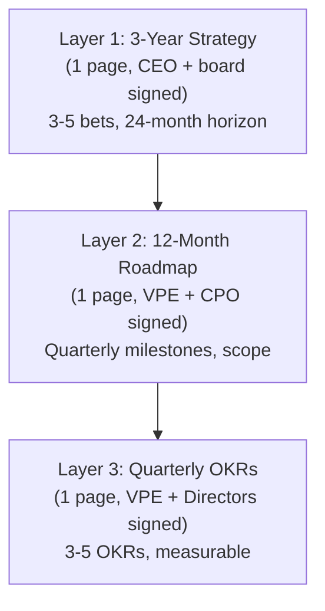
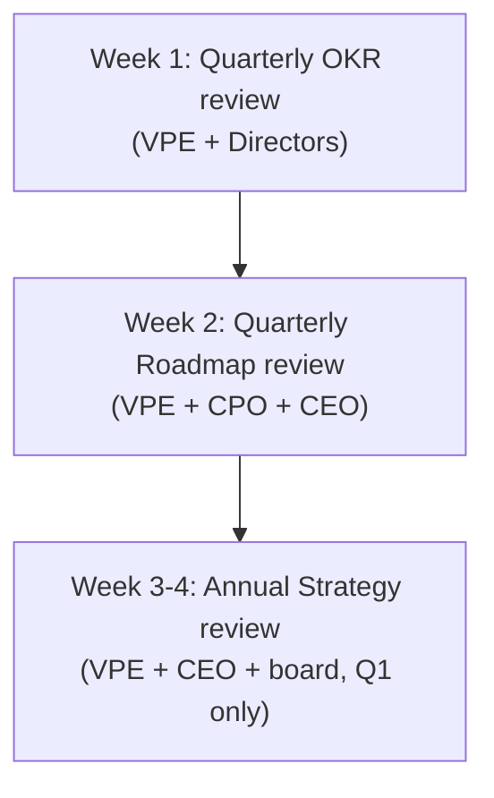

# VP of Engineering Playbook
## Chapter 15

# Engineering Strategy and Roadmaps at Company Scale

> *"A strategy is the smallest set of decisions that, if made and held, would unblock the next 24 months. A roadmap is the 12-month execution of the strategy. The VPE who confuses them produces neither."*

---

## 1. Epigraph

A strategy is the smallest set of decisions that, if made and held, would unblock the next 24 months. A roadmap is the 12-month execution of the strategy. The VPE who confuses them produces neither.

---

## 2. Problem

You are the VPE at a 1,200-person company. The CEO has just told you: "We have 8 product teams, 4 infra teams, 2 data teams, and 1 platform team. We have 24 months of feature requests in our backlog. We have 5 vendors we'd like to consolidate. We have 1,200 customers asking for AI features. We have 1 board meeting in 60 days. We have 5 quarterly OKRs to set. What's the engineering strategy? What's the 12-month roadmap? What's the next quarter's commitment?"

You have 30 days to produce a 1-page strategy memo, a 12-month roadmap, and the next quarter's commitment. This chapter tells you what each looks like — and how they ladder up.

**Decision in one sentence:** Engineering strategy + roadmaps at scale are a 3-layer system — Layer 1 (3-year strategy, 1-page memo, signed by CEO + board), Layer 2 (12-month roadmap, 1-page per quarter, signed by VPE + CPO), Layer 3 (quarterly OKRs, 1-page, signed by VPE + Directors) — backed by a quarterly review cadence that ladders each layer up; the VPE's job is to keep each layer under 1 page and to ladder them up.

---

## 3. Why VPEs Fail Here

Five named failure modes of VPEs whose strategy + roadmaps produced zero results.

- **The Strategy-Roadmap-Confusion Failure.** The VPE produces a 30-page "strategy" that is actually a roadmap. Or a 1-page "roadmap" that is actually a strategy. The CEO and board don't know which to use. The VPE has confused the two.
- **The Annual-Plan Failure.** The VPE produces a 12-month roadmap, signs off in Q1, and never updates it. By Q3, the roadmap is irrelevant. The market has changed, the customers have changed, the company has changed. The VPE has not built the quarterly review cadence.
- **The OKR-Theater Failure.** The VPE has OKRs but they don't ladder up. The Directors' OKRs don't ladder to the VPE's OKRs. The VPE's OKRs don't ladder to the company's OKRs. The OKRs are decoration.
- **The Board-Detail-Trap.** The VPE brings a 30-page strategy to the board. The board reads 3 pages. The board approves the wrong 3 pages. The VPE has not built the 1-page board-friendly format.
- **The Strategy-Without-Trade-Offs.** The VPE's strategy says yes to everything. The roadmap has 50 features. The Directors can't deliver. The strategy is unmoored from reality. The VPE has not done the trade-off discipline.

---

## 4. Mental Models

Four mental models that compress strategy + roadmaps at company scale.

**Mental model 1: The 3-Layer Strategy-Roadmap-OKR System.** Strategy, roadmap, and OKRs are 3 different artifacts at 3 different time horizons.



**The 3 layers:**

- **Layer 1: 3-Year Strategy.** Time horizon: 24-36 months. Format: 1 page. Owner: VPE + CEO. Sign-off: CEO + board. Output: 3-5 bets, 24-month horizon, decline list.
- **Layer 2: 12-Month Roadmap.** Time horizon: 12 months. Format: 1 page. Owner: VPE + CPO. Sign-off: VPE + CPO + CEO. Output: quarterly milestones, scope per quarter, decline list.
- **Layer 3: Quarterly OKRs.** Time horizon: 3 months. Format: 1 page. Owner: VPE + Directors. Sign-off: VPE + Directors. Output: 3-5 OKRs, measurable.

**Mental model 2: The Quarterly Review Cadence.** Each layer has a quarterly review. The 3 reviews ladder up.



**The cadence:**

- **Week 1: OKR review.** VPE + Directors review last quarter's OKRs, set next quarter's OKRs. Output: 1-page OKR document, signed by VPE + Directors.
- **Week 2: Roadmap review.** VPE + CPO + CEO review last quarter's roadmap, set next quarter's roadmap. Output: 1-page roadmap, signed by VPE + CPO + CEO.
- **Week 3-4: Strategy review (Q1 only).** VPE + CEO + board review 3-year strategy. Output: 1-page strategy memo, signed by CEO + board. (Q1 only; quarterly check-in in other quarters.)

**Mental model 3: The Ladder-Up Rule.** Every OKR at Layer 3 must ladder up to a roadmap item at Layer 2. Every roadmap item at Layer 2 must ladder up to a strategy bet at Layer 1.

```
Ladder-up example:

Layer 1 (Strategy): Bet 2 = "Enterprise Auth (SSO + audit log)"
Layer 2 (Roadmap Q2): "SSO in production" + "Audit log v1"
Layer 3 (OKR Q2): "SSO shipped to 100% of enterprise customers
                  by Q2 end" + "Audit log v1 certified SOC 2
                  compliant by Q2 end"

Each OKR ladders up to a roadmap item. Each roadmap item
ladders up to a strategy bet. The org can answer: "Why are
we doing this Q2 OKR?" — "Because it's in the Q2 roadmap."
— "Why is it in the Q2 roadmap?" — "Because it's Strategy
Bet 2."
```

**Mental model 4: The Decline-List Discipline.** Every layer has a decline list. The discipline is to make the trade-offs visible.

```
Layer 1 (Strategy) decline list: 3-5 things we will NOT do
  in the next 24 months.

Layer 2 (Roadmap) decline list: 5-10 feature requests that
  are NOT in the next 12 months.

Layer 3 (OKR) decline list: 3-5 OKRs that are NOT in this
  quarter.

The VPE who doesn't have a decline list is the VPE who
has not done the trade-off discipline. The decline list
is the most important section of each layer.
```

---

## 5. Frameworks

Three frameworks for strategy + roadmaps at scale.

### Framework 1: The 1-Page Strategy Memo (Layer 1)

```
# Engineering Strategy — [Date]

## What this strategy enables
[1 sentence on the company strategy this ladders up to.]

## The 3-5 bets (24-month horizon)

### Bet 1: [Name]
  Investment: $__M over __ months
  Owner: [Director]
  Expected outcome: [measurable]
  Kill criterion: [what would make us stop]

### Bet 2: [Name]
  ...

## The 3-5 things we will NOT do (decline list)

1. [Thing] — [reason] — [trigger to revisit] — [cost]
2. ...

## The 3-5 measurable outcomes (12-month)

1. [Metric] — [target] — [owner]
2. ...

## The 12-month plan
[Quarter-by-quarter milestones for the 3-5 bets.]
```

### Framework 2: The 1-Page Quarterly Roadmap (Layer 2)

```
# Quarterly Roadmap — Q[N] [YEAR]

## What's in scope for Q[N]
| Feature | Owner | Tier 1 dep? | Target date | Risk |
|---------|-------|-------------|-------------|------|
| [Feature] | [VPE/CPO] | [Yes/No] | [date] | [Low/Med/High] |
| ... |

## What's in scope for Q[N+1] (preview)
[Top 3 features, target dates, owners.]

## What's in scope for Q[N+2] (preview)
[Top 3 features, target dates, owners.]

## What we will NOT do this quarter (decline list)
1. [Feature] — [reason]
2. ...

## Risks
1. [Risk] — [mitigation]
2. ...
```

### Framework 3: The 1-Page Quarterly OKRs (Layer 3)

```
# Quarterly OKRs — Q[N] [YEAR]

## VPE OKRs (3-5)
1. [Objective] — [Key Result 1] — [Key Result 2] — [Key Result 3]
2. ...

## Director-level OKRs (3-5 per Director)
### Director, [Domain]
1. [Objective] — [Key Results]
2. ...

### Director, [Domain]
...

## OKRs that did NOT make it (decline list)
1. [OKR] — [reason]
2. ...
```

---

## 6. Drill

You are the VPE at **acme-corp**. The CEO has given you 30 days to produce the 3-layer strategy + roadmap + OKR system. The inputs:

```
- Company strategy: reach $200M ARR by EOY 2027, expand into
  enterprise, lead on AI features.
- Product strategy: ship 3 enterprise features (SSO, audit
  log, custom roles) by Q3. Ship AI feature v1 by Q4.
- Top 3 engineering bottlenecks:
  1. AI features unblocked (no platform)
  2. Enterprise features blocked by auth team
  3. Data infrastructure fragile
- Top 3 opportunities not pursued:
  1. IDP (no platform team)
  2. AI Engineering (1 person)
  3. Quality system (no SLOs)
```

You have **90 minutes**. Produce the **3-layer plan** (`portfolio/chapter-15-3-layer-strategy-roadmap-okr.md`) using Framework 1 (Strategy Memo) + Framework 2 (Quarterly Roadmap) + Framework 3 (Quarterly OKRs). Specify:

- The 1-page strategy memo (3-5 bets, decline list, 12-month outcomes).
- The 1-page Q3 2026 quarterly roadmap (top 5 features, decline list, risks).
- The 1-page Q3 2026 quarterly OKRs (3-5 VPE OKRs, 3-5 per Director).
- The ladder-up: which OKR ladders to which roadmap item, which roadmap item ladders to which strategy bet.
- The first quarterly review agenda (Week 1 OKR review + Week 2 Roadmap review).
- The 1 thing you'll say to the CEO about the 3-layer system.

**Deliverable:** `portfolio/chapter-15-3-layer-strategy-roadmap-okr.md` — under 1500 words.

---

## 7. Worked Example

**The 1-page strategy memo (Layer 1):**

```
# Engineering Strategy — Q3 2026

## What this strategy enables
Company strategy: reach $200M ARR by EOY 2027, expand
into enterprise, lead on AI features.

## The 3-5 bets (24-month horizon)

### Bet 1: AI Platform (the surface for AI features)
  Investment: $5M over 18 months
  Owner: Director, AI Engineering (new hire)
  Expected outcome: 80% of teams on shared AI platform;
    5 AI features shipped to GA in 24 months
  Kill criterion: 12 months in, <3 teams adopted OR <1 AI
    feature in production

### Bet 2: Enterprise Auth (the unlock for enterprise tier)
  Investment: $2M over 12 months
  Owner: Director, Platform
  Expected outcome: SSO, audit log, custom roles all in
    production by Q3 2027; enterprise pipeline unblocked
  Kill criterion: 9 months in, no enterprise auth feature
    in production

### Bet 3: Data Reliability (the foundation for AI + enterprise)
  Investment: $3M over 12 months
  Owner: Director, Data
  Expected outcome: 99.9% data pipeline SLO; <2 incidents
    per quarter; data observability adopted by 100%
  Kill criterion: 9 months in, SLO not on track

### Bet 4: Internal Developer Platform (the multiplier)
  Investment: $4M over 18 months
  Owner: Director, Platform
  Expected outcome: 80% of teams on shared CI/CD, observability,
    auth; cycle time halved; Director:IC ratio to 1:10
  Kill criterion: 12 months in, <50% adoption

### Bet 5: Hiring System (the constraint that unlocks all bets)
  Investment: $3M over 12 months
  Owner: Director, EngOps (new role)
  Expected outcome: 12 reqs filled in <90 days; attrition
    to <12%
  Kill criterion: 9 months in, time-to-fill not improved

## The decline list (things we will NOT do)
1. Microservices migration — Reason: 3 services over budget,
   complexity > benefit. Trigger: >1M DAU or team >500.
2. Outsource engineering capacity — Reason: previous outsource
   caused quality issues. Trigger: capacity gap >6 months.
3. "10x engineer" hiring spree — Reason: previous spree had
   40% attrition. Trigger: define a repeatable hiring system.
4. Build our own observability platform — Reason: vendor
   (Datadog) is good enough. Trigger: observability cost >10%
   of engineering budget.
5. AI feature for end users without a platform — Reason: AI
   without platform = tech debt + risk. Trigger: AI Platform
   GA (Q1 2027).

## The 3-5 measurable outcomes (12-month)
1. AI Platform GA — Q1 2027 — Director, AI Engineering
2. Enterprise auth in production — Q3 2027 — Director, Platform
3. Data pipeline SLO 99.9% — Q2 2027 — Director, Data
4. IDP adoption 80% — Q3 2027 — Director, Platform
5. Engineering attrition <12% — Q2 2027 — Director, EngOps
```

**The 1-page Q3 2026 quarterly roadmap (Layer 2):**

```
# Quarterly Roadmap — Q3 2026

## What's in scope for Q3
| Feature | Owner | Tier 1 dep? | Target date | Risk |
|---------|-------|-------------|-------------|------|
| Hire Director, AI Engineering | VPE | No | Q3 4 | Med |
| Hire Director, EngOps | VPE | No | Q3 8 | Med |
| AI Platform team kickoff (5 people) | Director, AI | Yes | Q3 8 | Med |
| SSO design review | Director, Platform | Yes | Q3 10 | Med |
| Data Reliability lead hire | Director, Data | No | Q3 8 | Low |
| Communicate decline list to org | VPE | No | Q3 1 | Low |

## What's in scope for Q4 (preview)
1. AI feature v1 alpha (auth team capacity required)
2. Enterprise auth (SSO) in production
3. Data Reliability MVP
4. IDP CI/CD adoption (50%)

## What's in scope for Q1 2027 (preview)
1. AI Platform GA
2. Enterprise auth (audit log) in production
3. IDP CI/CD adoption (80%)

## Decline list (Q3)
1. AI feature for end users (Q4 trigger: AI Platform GA)
2. Microservices migration (per Strategy decline list)
3. Outsource engineering capacity (per Strategy decline list)
4. Custom observability platform (per Strategy decline list)
5. "10x engineer" hiring spree (per Strategy decline list)

## Risks
1. AI Engineering Director hire delayed (Q4 start instead of Q3)
   — Mitigation: start search immediately, use external recruiter
2. Auth team capacity for SSO design review — Mitigation:
   freeze non-critical auth work in Q3
3. Data Reliability lead hire (sparse market) — Mitigation:
   start search in Q2, broaden net
```

**The 1-page Q3 2026 quarterly OKRs (Layer 3):**

```
# Quarterly OKRs — Q3 2026

## VPE OKRs (5)
1. **Hire AI Engineering Director and EngOps Director**
   KR1: AI Eng Director signed by Q3 4
   KR2: EngOps Director signed by Q3 8
   KR3: Both onboarded by Q3 12
2. **Stand up AI Platform team**
   KR1: 5 people assigned by Q3 8
   KR2: First architecture review board meeting by Q3 10
   KR3: First AI feature on platform (alpha) by Q3 12
3. **Sign off on Q3-Q4 roadmap with CPO**
   KR1: VPE-CPO Charter signed (Ch 14) by Q3 1
   KR2: Q3 OKRs signed by VPE + CPO by Q3 2
   KR3: Q4 OKRs previewed by VPE + CPO by Q3 10
4. **Hit reliability SLOs (Ch 12)**
   KR1: Availability 99.85% → 99.9% (3 consecutive months)
   KR2: MTTR 4h → 2h
   KR3: On-call burnout: 0 burnouts
5. **Drive 80% adoption of IDP CI/CD (Ch 11)**
   KR1: 50% of teams on IDP CI/CD by Q3 8
   KR2: 80% of teams on IDP CI/CD by Q3 12
   KR3: NPS for IDP >30

## Director-level OKRs (sample, Director, Platform)
1. **Stand up IDP**
   KR1: 80% CI/CD adoption
   KR2: Auth adoption 50%
   KR3: Local dev env adoption 30%
2. **Lead SSO design review**
   KR1: Design approved by ARB
   KR2: Implementation plan in Q4 OKRs

## OKRs that did NOT make it (decline list)
1. Custom observability platform (per Strategy decline list)
2. Mobile app v2.1 (deferred to Q4)
3. Audit log v1 GA (deferred to Q4 to make room for SSO)
```

**The ladder-up (concrete example):**

```
OKR Q3 (VPE): "Stand up AI Platform team" — KR3: "First AI
  feature on platform (alpha) by Q3 12"
  ↓ ladders up to
Roadmap Q3: "AI Platform team kickoff (5 people)" — Q3 8
  ↓ ladders up to
Strategy Bet 1: "AI Platform (the surface for AI features)"
  — $5M over 18 months

The org can answer:
- "Why are we standing up the AI Platform team?"
  → "It's OKR Q3 #2."
- "Why is that an OKR?"
  → "It's in the Q3 roadmap."
- "Why is it in the roadmap?"
  → "It's Strategy Bet 1."
- "Why is it a Strategy Bet?"
  → "Company strategy: lead on AI features."
```

**The first quarterly review agenda (Week 1 OKR + Week 2 Roadmap):**

```
# Week 1: Quarterly OKR Review (60 min)
Attendees: VPE + 5 Directors
Duration: 60 min
When: Day 1-3 of Q4 (Oct 1-3)

Agenda:
0-5 min:   VPE opening (Q3 OKR scorecard)
5-20 min:  VPE OKRs review (5 OKRs, each: 0-1.0 score)
20-40 min: Director OKRs review (each Director, 5 min)
40-50 min: Q4 OKR proposals (each Director proposes 3-5 OKRs)
50-60 min: VPE summary (Q4 OKR direction)

# Week 2: Quarterly Roadmap Review (90 min)
Attendees: VPE + CPO + CEO
Duration: 90 min
When: Day 5-7 of Q4 (Oct 5-7)

Agenda:
0-10 min:  VPE + CPO opening (Q3 roadmap scorecard)
10-30 min: Q3 roadmap review (what shipped, what slipped)
30-50 min: Q4 roadmap proposal (top 5 features, decline list)
50-70 min: Q1-Q2 2027 preview (top 3 features per quarter)
70-80 min: Decision: Q4 budget allocation
80-90 min: CEO summary (Q4 sign-off)
```

**The 1 thing I'll say to the CEO about the 3-layer system:**

```
"We have a 3-layer system now: strategy (3-year, 1 page),
roadmap (12-month, 1 page per quarter), OKRs (quarterly,
1 page). The 3 layers ladder up. The org can answer
'why are we doing this Q3 OKR?' all the way back to
the strategy bet.

The decline list is in every layer. The quarterly review
is scheduled. The sign-off is documented.

In 12 months we'll be able to point to: X strategy bets
delivered, Y roadmap items shipped on time, Z OKRs hit.
The system is the proof. The strategy memo is the
narrative."
```

---

## 8. Failure Mode Postmortem

A VPE at a 2,000-person company inherited a 30-page "engineering strategy" that was actually a roadmap. The strategy had 50 features listed. The CEO and board had signed off on the strategy 12 months earlier. The roadmap had never been updated. The OKRs were not aligned to the strategy.

Within 12 months, 18 features had slipped, 8 had been cancelled, and the org had no idea what was actually a priority. The CEO said: "The strategy was great. Why didn't we execute?" The VPE said: "We executed on a different strategy than what was signed off."

The replacement VPE did 3 things differently:
1. Replaced the 30-page strategy with a 1-page strategy memo (3-5 bets, decline list, measurable outcomes).
2. Replaced the 50-feature roadmap with a 1-page quarterly roadmap (5 features per quarter, decline list, risks).
3. Replaced the OKR-theater with a 1-page quarterly OKR doc (3-5 VPE OKRs, 3-5 per Director, ladder-up to roadmap).

Within 6 months, on-time delivery was up to 80%. Within 12 months, the strategy was being executed, the roadmap was being updated, and the OKRs were being hit.

What the first VPE missed: strategy, roadmap, and OKRs are 3 different artifacts. The VPE who conflates them produces 30 pages that nobody reads.

The lesson: keep each layer under 1 page. The 1-page constraint is the discipline.

---

## 9. Self-Assessment Rubric

| # | Dimension | 1 (Novice) | 3 (Competent) | 5 (Expert) |
|---|---|---|---|---|
| 1 | **3-layer system** | 1 layer (strategy only) or 30-page strategy | 3 layers exist, mixed sizes | 3 layers, each 1 page, laddered up |
| 2 | **Quarterly review cadence** | No reviews or annual | Quarterly review exists | Quarterly review is signed, on-time, with action items |
| 3 | **Ladder-up** | OKRs don't ladder to strategy | OKRs ladder to roadmap | OKRs → roadmap → strategy, org can answer "why?" |
| 4 | **Decline list discipline** | No decline list | Decline list exists | Decline list is concrete, with triggers + costs |
| 5 | **1-page constraint** | 30-page strategy | 5-page strategy | 1-page strategy, board-readable in 5 minutes |

**Disqualifier:** any 1 on dimension 1 or 5. A VPE with no 3-layer system or with 30-page memos is in the Strategy-Roadmap-Confusion or Board-Detail-Trap failure mode.

**Total:** ___ / 25. **Pass threshold:** 18/25, no dimension below 3.

---

## 10. Portfolio Artifact Note

Save your filled-in drill as `portfolio/chapter-15-3-layer-strategy-roadmap-okr.md` — interview evidence for "How do you ladder strategy, roadmap, and OKRs?" (see Portfolio Map in Chapter 27).

---

## 11. Interview Questions

1. **Walk me through your strategy + roadmap + OKR system.**
2. **The CEO asks "what's the engineering strategy?" How do you answer in 5 minutes?**
3. **A Director wants to add a 6th OKR. What do you do?**
4. **The OKRs are not aligned to the strategy. What do you do?**
5. **Walk me through the quarterly review cadence.**