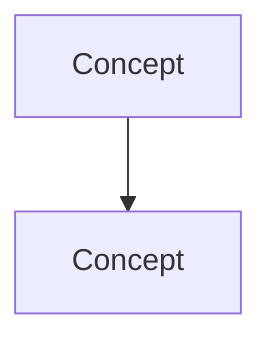

# VP of Engineering Playbook
## Chapter 15

# Engineering Strategy and Roadmaps at Company Scale

> *"Epigraph placeholder — set the tone. One line. To be written by the chapter author."*

---

## 1. Epigraph

_Epigraph to be added by the chapter author. Sets the tone and previews the core tension._

---

## 2. Problem

You are 30 days into the VPE seat at a 1,200-person company. The CEO has called a leadership offsite in 60 days. You have 5 Directors reporting in, 200 engineers in your portfolio, a $40M annual budget, and a board that has been hearing about engineering velocity for 2 years without seeing it. The first decision you make will set the tone for the next 24 months. This is the chapter that tells you what to optimize for in those 30 days — and what to avoid.

**Decision in one sentence:** _to be filled in by the chapter author._

---

## 3. Why VPEs Fail Here

- **The Lone-Decision Maker.** VPE makes the call without surfacing the tradeoffs, the alternatives, or the dissent. The org can't repeat the decision when the VPE moves on.

- **The Process-Without-Outcomes.** VPE builds elaborate processes (architecture review boards, hiring rubrics, perf cycles) that don't produce better outcomes.

- **The Avoidance of Hard Calls.** VPE keeps underperformers on the team, avoids letting go of failing projects, refuses to take the political heat for necessary restructuring.

---

## 4. Mental Models

2–4 reusable lenses. Each gets a one-paragraph definition + one Mermaid diagram.

**Mental model 1: _Name._** _One-paragraph definition that the reader can use for problems the chapter didn't cover._


**Mental model 2: _Name._** _One-paragraph definition._



---

## 5. Frameworks

The actual decision-making tools. Templates the reader can fill in.

### Framework 1: _Name_

A template the reader fills in:

```
[Field 1]: _______________
[Field 2]: _______________
[Field 3]: _______________
```

### Framework 2: _Name_

```
[Field A]: _______________
[Field B]: _______________
```

### Framework 3: _Name_

```
[Step 1]: _______________
[Step 2]: _______________
[Step 3]: _______________
```

---

## 6. Drill

You are the VP of Engineering at **acme-corp**. _Concrete scenario, specific constraints, named stakeholders._

You have **90 minutes**. Deliver _single artifact_ as `portfolio/chapter-15-engineering-strategy-and-roadm.md`.

**Deliverable:** `portfolio/chapter-15-engineering-strategy-and-roadm.md` — _one sentence description of what the reader produces._

---

## 7. Worked Example

A fully completed drill. Plausible, not aspirational.

**Decision:** _One sentence._

**Constraints:** _Budget, time, regulatory, org._

**Options considered:** _2-3 alternatives with pros/cons._

**Decision:** _What they chose and why._

---

## 8. Failure Mode Postmortem

A real (anonymized) or realistic case where a VPE got this wrong.

What they missed. What they should have done. What they learned.

---

## 9. Self-Assessment Rubric

| # | Dimension | 1 (Novice) | 3 (Competent) | 5 (Expert) |
|---|---|---|---|---|
| 1 | _Dimension 1_ | _What 1/5 looks like_ | _What 3/5 looks like_ | _What 5/5 looks like_ |
| 2 | _Dimension 2_ | _..._ | _..._ | _..._ |
| 3 | _Dimension 3_ | _..._ | _..._ | _..._ |
| 4 | _Dimension 4_ | _..._ | _..._ |
| 5 | _Dimension 5_ | _..._ | _..._ | _..._ |

**Disqualifier:** any 1 on any dimension.

**Total:** ___ / 25. **Pass threshold:** 18/25, no dimension below 3.

---

## 10. Portfolio Artifact Note

Save your filled-in drill as `portfolio/chapter-15-engineering-strategy-and-roadm.md` — this is interview evidence for _[specific question type]_ (see Portfolio Map in Chapter 27).

---

## 11. Interview Questions

1. _Question that probes this material, with grading notes._
2. _Question._
3. _Question._
4. _Question._
5. _Question._
