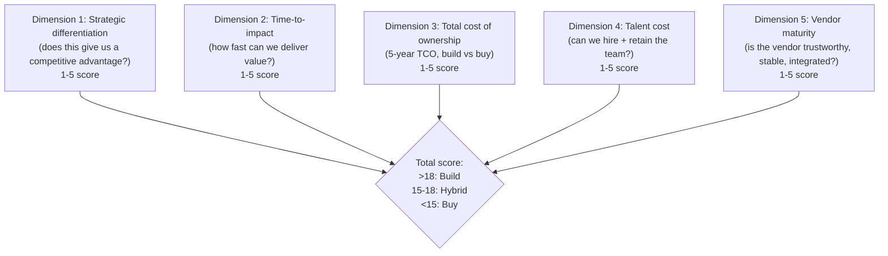
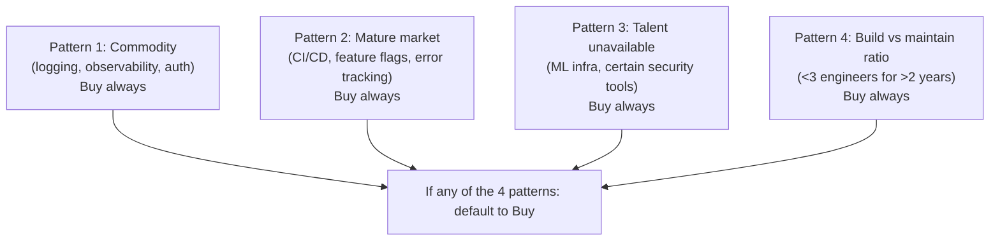

# VP of Engineering Playbook
## Chapter 16

# Build vs Buy at the Engineering Layer

> *"Build vs Buy is not a technology decision. It is a strategic decision that determines what the company can do next."*

---

## 1. Epigraph

Build vs Buy is not a technology decision. It is a strategic decision that determines what the company can do next.

---

## 2. Problem

You are the VPE at a 1,200-person company. The Directors are split. The Director of AI wants to build a custom LLM serving platform ($3M, 18 months, 4 engineers). The Director of Platform wants to buy from a vendor ($400K/year). The Director of Data wants to build a custom data observability tool ($1.5M, 12 months, 3 engineers). The Director of Product wants to buy from another vendor ($200K/year). The CEO has just told you: "We have 3 build-vs-buy decisions in the next 30 days. Each is $1M+. I need a framework."

You have 30 days to design a build-vs-buy framework that the Directors, the CEO, and the board can use. This chapter tells you what that framework looks like.

**Decision in one sentence:** Build vs Buy at the engineering layer is a 5-dimension matrix (strategic differentiation, time-to-impact, total cost of ownership, talent cost, vendor maturity) applied to every build-vs-buy decision >$500K/year; the VPE's job is to make the framework consistent across all decisions, to require a 1-page memo per decision, and to hold the line on "build only when strategic."

---

## 3. Why VPEs Fail Here

Five named failure modes of VPEs whose build-vs-buy framework produced zero results.

- **The Not-Invented-Here Failure.** The VPE's culture treats buying as a sign of weakness. Every Director wants to build. The VPE approves 3 custom builds. The org spends $5M/year on duplicated platform work. The VPE has not built the "build only when strategic" discipline.
- **The Build-Default Failure.** The VPE approves 3 custom builds because the Directors' business cases were strong. The custom builds take 2x longer than estimated. The total cost of ownership is 3x the original estimate. The VPE has not done the total-cost analysis.
- **The Buy-Default Failure.** The VPE approves 3 vendor purchases because they're "faster and cheaper." The vendors don't integrate. The engineering team resents the vendor lock-in. The vendors raise prices after year 2. The VPE has not done the vendor maturity analysis.
- **The No-Framework Failure.** The VPE makes each build-vs-buy decision ad-hoc. Each decision uses different criteria. The Directors learn which criteria to invoke to get the answer they want. The VPE has not built the framework.
- **The 1-Page-Memo Failure.** The VPE requires a 1-page memo for build-vs-buy decisions. The Directors write 30-page memos. The VPE reads the first page. The Directors get the answer they want. The VPE has not enforced the 1-page constraint.

---

## 4. Mental Models

Four mental models that compress build-vs-buy at scale.

**Mental model 1: The 5-Dimension Matrix.** Every build-vs-buy decision is evaluated on 5 dimensions. Each gets a 1-5 score. The total score determines the recommendation.



**The 5 dimensions:**

- **Dimension 1: Strategic differentiation.** Does this give us a competitive advantage that we can't buy? 5 = core differentiator (e.g., recommendation engine for our product). 1 = commodity (e.g., logging, observability).
- **Dimension 2: Time-to-impact.** How fast can we deliver value? 5 = buy = 1 quarter. 1 = build = 4+ quarters.
- **Dimension 3: Total cost of ownership (5-year TCO).** 5 = build is cheaper over 5 years. 1 = buy is cheaper over 5 years.
- **Dimension 4: Talent cost.** Can we hire + retain the team? 5 = we can. 1 = we can't (talent is too rare or too expensive).
- **Dimension 5: Vendor maturity.** Is the vendor trustworthy, stable, integrated? 5 = great vendor, no concerns. 1 = bad vendor, multiple concerns.

**The decision rule:**
- Total ≥ 18: Build
- Total 15-18: Hybrid (buy + customize)
- Total < 15: Buy

**Mental model 2: The 4-Skip-Build Patterns.** There are 4 patterns where the VPE should always say "buy," regardless of the score.



**The 4 patterns:**
- **Commodity.** If the capability is a commodity (logging, observability, auth, basic CRUD), buy. Custom-building a commodity is the Not-Invented-Here Failure.
- **Mature market.** If the market has 3+ mature vendors (CI/CD, feature flags, error tracking, A/B testing), buy. Custom-building against a mature market is the Build-Default Failure.
- **Talent unavailable.** If the talent is too rare or too expensive to hire + retain (ML infra, certain security tools), buy. Custom-building without talent is a death sentence.
- **Build vs maintain ratio.** If the build would require <3 engineers for >2 years, the maintenance cost is too high. Buy.

**Mental model 3: The 1-Page Memo.** Every build-vs-buy decision >$500K/year requires a 1-page memo. The memo is signed by the requesting Director + VPE + CEO.

```
# Build vs Buy Memo — [Decision] — [Date]

## The decision
[1 sentence: what we're deciding. E.g., "Build a custom LLM
serving platform or buy from Vendor X."]

## Strategic context
[1-2 sentences: why this decision matters now.]

## The 5-dimension matrix
| Dimension | Score (1-5) | Notes |
|-----------|--------------|-------|
| Strategic differentiation | ___ | ___ |
| Time-to-impact | ___ | ___ |
| Total cost of ownership | ___ | ___ |
| Talent cost | ___ | ___ |
| Vendor maturity | ___ | ___ |
| **Total** | **___** | **___** |

Total ≥ 18: Build
Total 15-18: Hybrid
Total < 15: Buy

## Skip-build check
- Commodity? Y / N
- Mature market? Y / N
- Talent unavailable? Y / N
- Build vs maintain ratio ok? Y / N
If any "Y": default to Buy (override requires CEO + VPE sign-off)

## 5-year TCO comparison
- Build: $__M (4 engineers × 2 years @ $350K = $2.8M, plus
          infra, plus ongoing maintenance)
- Buy: $__M ($400K/year × 5 = $2M)
- Difference: $__M over 5 years

## Recommendation
[Build / Buy / Hybrid. 1-2 sentences on why.]

## Approvals
- Director: ___
- VPE: ___
- CEO: ___
```

**Mental model 4: The Build-Buy Review Cadence.** Every build-vs-buy decision >$500K/year is reviewed quarterly. The review checks the original assumption.

```
Q1: review the decision
  - Original assumption still valid?
  - If we built: is it on track? on budget?
  - If we bought: is the vendor delivering? do we still need it?
  - Decision: continue / pivot / kill

Q2: review the decision
  - Same as Q1
  - If on track: keep going
  - If off track: pivot or kill

Q4: review the decision (12-month retrospective)
  - Did we make the right call?
  - What did we learn for the next decision?
  - Document the lesson in the Build-Buy playbook
```

---

## 5. Frameworks

Three frameworks for build-vs-buy at scale.

### Framework 1: The Build-Buy Decision Tree

```
Q1: Is the capability a commodity? (logging, observability, auth, basic CRUD)
  - Yes → BUY
  - No → Q2

Q2: Is the market mature (3+ vendors)? (CI/CD, feature flags, error tracking)
  - Yes → BUY
  - No → Q3

Q3: Is the talent available + retainable? (ML infra, certain security tools)
  - No → BUY
  - Yes → Q4

Q4: Would the build require <3 engineers for >2 years?
  - Yes → BUY
  - No → Q5

Q5: 5-dimension matrix
  - Total ≥ 18 → BUILD
  - Total 15-18 → HYBRID (buy + customize)
  - Total < 15 → BUY
```

### Framework 2: The 5-Year TCO Template

```
# 5-Year TCO Comparison — [Decision]

## Build TCO
- Engineering cost: __ engineers × __ years × $__/year = $__
- Infrastructure cost: $__/year × 5 = $__
- Ongoing maintenance: 0.5 engineer × 5 years = $__
- Migration cost (if we change later): $__
- Total Build TCO: $__

## Buy TCO
- License cost: $__/year × 5 = $__
- Implementation cost: $__ (one-time)
- Integration cost: __ engineers × __ months = $__
- Vendor risk premium: +__% (e.g., 20% for vendor concentration)
- Migration cost (if we change later): $__
- Total Buy TCO: $__

## Difference
Build TCO - Buy TCO = $__

## Recommendation
[If Build TCO < Buy TCO AND score ≥ 18: Build. Otherwise: Buy.]
```

### Framework 3: The Build-Buy Playbook

A running document of all build-vs-buy decisions, updated quarterly.

```
# Build-Buy Playbook — [Date]

## Decisions made this quarter
1. [Decision] — [Date] — [Build/Buy/Hybrid] — [Outcome so far]
2. ...

## Decisions pending
1. [Decision] — [Expected decision date] — [Status]
2. ...

## Lessons learned
1. [Lesson from a past decision]
2. ...

## Vendor watchlist
1. [Vendor] — [Status] — [Concerns]
2. ...
```

---

## 6. Drill

You are the VPE at **acme-corp**. 3 build-vs-buy decisions in the next 30 days:

1. **AI Platform: Build (4 engineers, $3M, 18 months) or Buy (Vendor X, $400K/year)?**
2. **Data Observability: Build (3 engineers, $1.5M, 12 months) or Buy (Vendor Y, $200K/year)?**
3. **Auth: Build (2 engineers, $800K, 9 months) or Buy (Auth0, $300K/year)?**

You have **90 minutes**. Produce a **build-vs-buy decision package** (`portfolio/chapter-16-build-vs-buy-decisions.md`) using Framework 1 (Decision Tree) + Framework 2 (5-Year TCO) + Framework 3 (Build-Buy Playbook). For each of the 3 decisions:

- The 5-dimension matrix score.
- The skip-build check.
- The 5-year TCO comparison.
- The recommendation (Build / Buy / Hybrid).
- The 1-page memo for the decision.

Plus:

- The Build-Buy Playbook entry (3 decisions + lessons learned).
- The 1 thing you'll say to the CEO about the build-vs-buy framework.

**Deliverable:** `portfolio/chapter-16-build-vs-buy-decisions.md` — under 1500 words.

---

## 7. Worked Example

**Decision 1: AI Platform — Build or Buy?**

```
Skip-build check:
- Commodity? No (AI Platform is differentiation)
- Mature market? No (only 1-2 mature vendors, neither is perfect)
- Talent unavailable? Yes (ML infra talent is rare)
- Build vs maintain ratio? OK (>3 engineers for >2 years)

5-dimension matrix:
| Dimension | Score | Notes |
|-----------|-------|-------|
| Strategic differentiation | 5 | AI features are core to product |
| Time-to-impact | 2 | Build = 18 months, Buy = 1 quarter |
| Total cost of ownership | 4 | Build = $7M over 5 years, Buy = $2M + customization $3M |
| Talent cost | 2 | ML infra talent is hard to hire + retain |
| Vendor maturity | 2 | Top vendor has 80% of what we need, 20% requires build anyway |
| **Total** | **15** | **Hybrid** |

5-year TCO:
- Build: 4 engineers × 1.5 years × $350K = $2.1M build, + $350K/year maintenance × 5 = $3.85M, + infra $200K × 5 = $1M. Total: $5.95M
- Buy: $400K/year × 5 = $2M, + customization 2 engineers × 1 year = $700K. Total: $2.7M
- Difference: Build is $3.25M more expensive

Recommendation: HYBRID.
- Buy the core LLM serving platform from Vendor X ($400K/year)
- Customize the 20% that's strategic differentiation (4 engineers × 6 months = $700K)
- Total cost: $3.4M over 5 years (vs $5.95M for full build)
- Time-to-impact: 6 months (vs 18 months for full build)
```

**Decision 2: Data Observability — Build or Buy?**

```
Skip-build check:
- Commodity? Yes-ish (data observability is increasingly commodity)
- Mature market? Yes (3+ vendors, including Monte Carlo, Bigeye, Soda)
- Talent unavailable? No
- Build vs maintain ratio? No

Default: BUY.

5-dimension matrix (for the record):
| Dimension | Score | Notes |
|-----------|-------|-------|
| Strategic differentiation | 1 | Not a differentiator |
| Time-to-impact | 5 | Buy = 1 quarter |
| Total cost of ownership | 1 | Build = $3M+ over 5 years, Buy = $1M |
| Talent cost | 3 | Possible but expensive |
| Vendor maturity | 4 | Multiple good vendors |
| **Total** | **14** | **Buy** |

Recommendation: BUY. Vendor Y (Monte Carlo) at $200K/year.
```

**Decision 3: Auth — Build or Buy?**

```
Skip-build check:
- Commodity? Yes (auth is commodity)
- Mature market? Yes (Auth0, Okta, Clerk, Stytch)
- Talent unavailable? No
- Build vs maintain ratio? No

Default: BUY.

Recommendation: BUY. Auth0 at $300K/year. (We use Auth0 already for
SSO. Buy more, not build more.)
```

**The Build-Buy Playbook entry:**

```
# Build-Buy Playbook — Q3 2026

## Decisions made this quarter
1. AI Platform — Q3 2026 — HYBRID (buy + customize) — In progress
2. Data Observability — Q3 2026 — BUY (Vendor Y) — In progress
3. Auth — Q3 2026 — BUY (Auth0) — In progress

## Lessons learned
1. The skip-build check (commodity, mature market, talent,
   build ratio) is faster than the 5-dimension matrix. Run
   skip-build first. If it triggers, the answer is Buy.
2. The 5-dimension matrix is useful for the "hybrid" cases
   where skip-build doesn't trigger.
3. The 5-year TCO is the tie-breaker. If Build and Buy are
   within 20% on TCO, the score decides.
```

**The 1 thing I'll say to the CEO about the build-vs-buy framework:**

```
"We have 3 build-vs-buy decisions in the next 30 days. Each
is >$500K/year. Each goes through the same framework:
skip-build check first, then 5-dimension matrix, then 5-year
TCO.

Decision 1 (AI Platform): Hybrid. Buy core, customize
strategic 20%. $3.4M over 5 years vs $5.95M for full build.

Decisions 2 + 3: Buy. Both are commodity. We save $3M over
5 years.

Net: $3.55M saved over 5 years. The framework is the discipline.
3 decisions, 1 framework, $3.55M saved."
```

---

## 8. Failure Mode Postmortem

A VPE at a 1,800-person company approved 3 custom builds in 18 months: custom LLM serving, custom data observability, custom auth. The VPE believed in the "build" default. The Directors' business cases were strong.

Within 24 months: $8M spent on the 3 builds. The LLM serving platform was 12 months late and used by 1 team. The data observability tool was 8 months late and used by 2 teams. The auth implementation was 18 months late and replaced by Auth0 anyway. Total cost: $8M spent, $0 value delivered.

The replacement VPE did 3 things differently:
1. Required a 1-page memo for every build-vs-buy decision >$500K/year.
2. Required a 5-dimension matrix + skip-build check.
3. Required a 5-year TCO comparison.

Within 6 months, the next 5 build-vs-buy decisions were: 4 buy, 1 hybrid. Net: $4M saved over 5 years vs the previous trajectory.

What the first VPE missed: the framework. The first VPE approved every business case. The second VPE required the framework. The framework is the discipline.

The lesson: build-vs-buy is not a technology decision. It is a framework decision. The VPE who has a framework saves the company millions. The VPE who doesn't has a $8M shelf-ware problem.

---

## 9. Self-Assessment Rubric

| # | Dimension | 1 (Novice) | 3 (Competent) | 5 (Expert) |
|---|---|---|---|---|
| 1 | **5-dimension matrix** | No matrix, ad-hoc decisions | Matrix exists but inconsistently applied | Matrix consistently applied to every >$500K decision |
| 2 | **Skip-build check** | No skip-build check | Skip-build check exists | Skip-build check enforced, defaults to Buy |
| 3 | **1-page memo** | 30-page memos | 5-page memos | 1-page memos, signed by Director + VPE + CEO |
| 4 | **5-year TCO** | No TCO analysis | TCO exists for some decisions | TCO for every decision, the tie-breaker |
| 5 | **Build-Buy Playbook** | No playbook | Playbook exists | Playbook is the org's reference, updated quarterly |

**Disqualifier:** any 1 on dimension 1 or 5. A VPE with no matrix or no playbook is in the No-Framework Failure or the Build-Default Failure.

**Total:** ___ / 25. **Pass threshold:** 18/25, no dimension below 3.

---

## 10. Portfolio Artifact Note

Save your filled-in drill as `portfolio/chapter-16-build-vs-buy-decisions.md` — interview evidence for "How do you make build-vs-buy decisions?" (see Portfolio Map in Chapter 27).

---

## 11. Interview Questions

1. **Walk me through your build-vs-buy framework.**
2. **A Director wants to build a custom LLM serving platform. What do you do?**
3. **The 5-year TCO says buy is $500K cheaper than build, but the team wants to build. What do you do?**
4. **A vendor raises prices 50% after year 2. What do you do?**
5. **Walk me through a build-vs-buy decision you've made.**