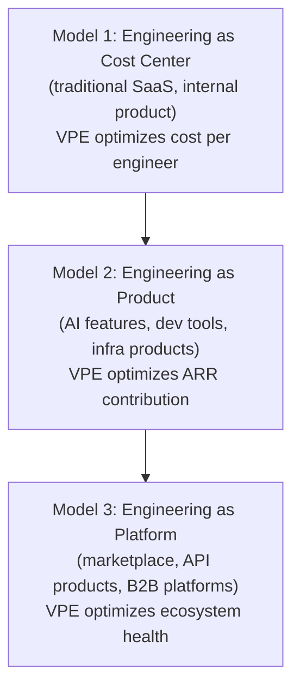
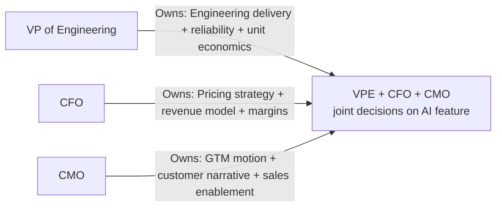
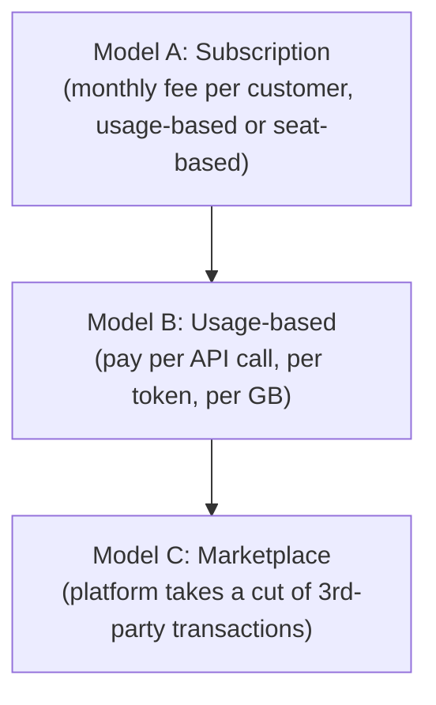

# VP of Engineering Playbook
## Chapter 17

# Engineering Pricing, GTM, and Engineering-as-Revenue

> *"When engineering is the product, the VPE is the product leader. When engineering is a cost center, the VPE is a cost manager. The VPE's job is to know which one the company is, and to act accordingly."*

---

## 1. Epigraph

When engineering is the product, the VPE is the product leader. When engineering is a cost center, the VPE is a cost manager. The VPE's job is to know which one the company is, and to act accordingly.

---

## 2. Problem

You are the VPE at a 1,200-person company. The company is shifting from "engineering builds a product" (engineering is a cost center) to "engineering IS the product" (engineering is a revenue center) — the company is launching an AI feature that customers will pay $50/month for, on top of the existing $200/month SaaS subscription. The CFO has just told you: "Engineering is now a revenue center. You own $XM in ARR contribution. You need to own the pricing, the GTM, and the customer narrative for the AI feature." The CPO has said: "If engineering is the product, what's my role?" The CEO has said: "You two figure it out. I need the AI feature to be a $10M ARR business in 12 months."

You have 30 days to design the engineering-as-revenue model. This chapter tells you what that looks like.

**Decision in one sentence:** Engineering-as-revenue is one of 3 models (engineering-as-cost-center, engineering-as-product, engineering-as-platform) — chosen by company strategy — backed by a pricing framework, a GTM motion, and a customer narrative that the VPE co-owns with the CFO + CMO; the VPE's job is to know which model the company is in, to design the engineering org to support that model, and to own the engineering side of the pricing + GTM.

---

## 3. Why VPEs Fail Here

Five named failure modes of VPEs whose engineering-as-revenue model produced zero results.

- **The Cost-Center-Stuck Failure.** The VPE's mental model is "engineering is a cost center." The company is shifting to "engineering is a product." The VPE is still optimizing for cost, not revenue. The company misses the shift. The VPE has not adapted.
- **The Build-It-And-They-Won't-Buy Failure.** The engineering team builds a great AI feature. The GTM team can't sell it. The customers don't buy. The VPE blames the GTM team. The VPE has not co-owned the GTM.
- **The Pricing-Blame-Game.** The VPE builds the AI feature. The pricing team prices it. The customers don't buy. The VPE blames the pricing team. The VPE has not co-owned the pricing.
- **The Revenue-Without-Margin Failure.** The AI feature sells well. The cost of running the AI feature (LLM API, infrastructure) is more than the revenue. The feature loses money. The CFO is furious. The VPE has not modeled the unit economics.
- **The No-Customer-Conversation Failure.** The VPE never talks to customers. The VPE never demos the AI feature. The VPE never hears customer feedback. The product misses the market. The VPE has not built the customer relationship.

---

## 4. Mental Models

Four mental models that compress engineering-as-revenue at scale.

**Mental model 1: The 3 Engineering-as-Revenue Models.** Engineering is one of 3 things in a company: a cost center, a product, or a platform.



**The 3 models:**

- **Model 1: Engineering as Cost Center.** Engineering builds the product that the GTM team sells. VPE optimizes cost per engineer, on-time delivery, reliability. Examples: traditional SaaS, internal product.
- **Model 2: Engineering as Product.** Engineering IS the product. VPE optimizes ARR contribution, customer satisfaction, unit economics. Examples: AI features, dev tools, infrastructure products.
- **Model 3: Engineering as Platform.** Engineering builds a platform that 3rd parties build on. VPE optimizes ecosystem health, developer adoption, partner ARR. Examples: marketplaces, API products, B2B platforms.

**Mental model 2: The VPE-CFO-CMO Triangle.** When engineering is a product, the VPE co-owns pricing, GTM, and the customer narrative with the CFO and CMO.



**The 3-way partnership:**
- **VPE owns:** Engineering delivery, reliability, unit economics (cost per customer, cost per query).
- **CFO owns:** Pricing strategy, revenue model, margins.
- **CMO owns:** GTM motion, customer narrative, sales enablement.
- **Co-owned:** Pricing, GTM, customer narrative for the AI feature.

**Mental model 3: The 3 Engineering-Revenue Models.** There are 3 ways engineering generates revenue.



**The 3 revenue models:**

- **Model A: Subscription.** Monthly fee per customer. Most common for AI features. E.g., $50/month per customer for AI add-on.
- **Model B: Usage-based.** Pay per API call, per token, per GB. Common for AI APIs. E.g., $0.01 per 1K tokens.
- **Model C: Marketplace.** Platform takes a cut of 3rd-party transactions. Common for marketplaces. E.g., 10% take rate on $XM GMV.

**Mental model 4: The Unit Economics Framework.** Every engineering-as-product feature has unit economics. The VPE owns the unit economics.

```
Unit economics for an AI feature:

  Revenue per customer per month: $__
  Cost per customer per month: $__
    - LLM API cost: $__
    - Infrastructure cost: $__
    - Customer support cost: $__
    - Engineering maintenance cost (allocated): $__
  Gross margin per customer per month: $__
  Gross margin %: ___%

  Target gross margin: 70%+
  Below 70%: pricing review OR cost reduction

  Cost per query (for usage-based): $__
  Price per query: $__
  Margin per query: $__
  Target margin per query: 60%+
```

---

## 5. Frameworks

Three frameworks for engineering-as-revenue at scale.

### Framework 1: The Engineering-Revenue Scorecard

```
# Engineering-Revenue Scorecard — Q[N] [YEAR]

## Top-line
| Metric | Q-2 | Q-1 | Q[N] | Target Q+1 |
|--------|-----|-----|------|------------|
| AI feature ARR | ___ | ___ | ___ | ___ |
| AI feature customers | ___ | ___ | ___ | ___ |
| AI feature ARPU | ___ | ___ | ___ | ___ |
| Net new ARR | ___ | ___ | ___ | ___ |

## Unit economics
| Metric | Target | Current | Status |
|--------|--------|---------|--------|
| Revenue per customer per month | — | $__ | — |
| Cost per customer per month | — | $__ | — |
| Gross margin per customer | 70%+ | ___% | 🟢/🟡/🔴 |
| Cost per query (usage-based) | — | $__ | — |
| Price per query | — | $__ | — |
| Margin per query | 60%+ | ___% | 🟢/🟡/🔴 |

## Adoption
| Metric | Q-2 | Q-1 | Q[N] | Target Q+1 |
|--------|-----|-----|------|------------|
| AI feature adoption (% of customers) | ___ | ___ | ___ | ___ |
| AI feature usage (queries per customer per month) | ___ | ___ | ___ | ___ |
| AI feature NPS | ___ | ___ | ___ | ___ |

## Cost drivers
- LLM API cost (largest cost, monitor weekly)
- Infrastructure cost (cloud + storage)
- Engineering maintenance cost (allocated)
```

### Framework 2: The Pricing-Recommendation Memo

```
# Pricing Recommendation — [Feature] — [Date]

## The feature
[1 sentence: what the feature is, who buys it.]

## Pricing options
| Option | Price | Expected customers | Expected ARR | Gross margin |
|--------|-------|--------------------|--------------|--------------|
| $20/mo | $20 | 5,000 | $1.2M | 80% |
| $50/mo | $50 | 2,000 | $1.2M | 75% |
| $100/mo | $100 | 1,000 | $1.2M | 70% |
| $0.01/query | usage | 3,000 | $1.5M | 60% |

## Recommendation
[1 option, with rationale. 1-2 sentences on why.]

## Unit economics (for recommended option)
- Revenue per customer: $__
- Cost per customer: $__
- Gross margin: ___%
- Payback period: ___ months

## Approvals
- VPE: ___
- CFO: ___
- CMO: ___
- CEO: ___
```

### Framework 3: The Quarterly Engineering-Revenue Review (60 min)

Every quarter, the VPE runs a 60-minute engineering-revenue review with the CFO + CMO.

```
Agenda (60 min):
0-5 min:   VPE opening
           - 3 numbers: AI feature ARR, customer count,
             gross margin
5-20 min:  Top-line review
           - ARR trend (last 4 quarters)
           - Customer count trend
           - ARPU trend
           - Net new ARR per quarter
20-30 min: Unit economics review
           - Revenue per customer
           - Cost per customer
           - Gross margin (target: 70%+)
           - Cost drivers
30-40 min: Adoption review
           - Adoption rate (% of customers)
           - Usage per customer
           - NPS
           - Top 3 customer pain points
40-50 min: GTM review
           - Win rate
           - Sales cycle
           - Top 3 GTM blockers
50-60 min: VPE + CFO + CMO summary (next quarter's targets)
```

---

## 6. Drill

You are the VPE at **acme-corp**. The company is shifting from "engineering is a cost center" to "engineering is a product." The AI feature is launching in Q4 2026. The CFO has set a target: $10M ARR in 12 months, 70% gross margin. The CMO has set a target: 5,000 customers by Q4 2027, 60% win rate. The CEO has said: "You two figure it out. I need the AI feature to be a $10M ARR business."

You have **90 minutes**. Produce a **GTM-and-pricing plan** (`portfolio/chapter-17-engineering-revenue-plan.md`) using Framework 1 (Scorecard) + Framework 2 (Pricing Memo) + Framework 3 (Quarterly Review). Specify:

- The engineering-revenue model (cost center, product, or platform) at acme-corp.
- The VPE-CFO-CMO triangle (decision rights, cadence, joint OKRs).
- The 3 pricing options for the AI feature (with unit economics).
- The 1 pricing recommendation (with rationale).
- The Q1-Q4 2027 quarterly targets (ARR, customers, gross margin, adoption).
- The 1 thing you'll say to the CEO about the engineering-as-revenue shift.
- The 3 things you'll do to ensure 70% gross margin.
- The first quarterly engineering-revenue review agenda.

**Deliverable:** `portfolio/chapter-17-engineering-revenue-plan.md` — under 1500 words.

---

## 7. Worked Example

**The engineering-revenue model at acme-corp:**

```
Model 2: Engineering as Product.
  Our AI feature is the product. The GTM team sells it.
  The engineering team builds it. The CFO owns the
  pricing model. The CMO owns the GTM motion. The VPE
  owns the unit economics.
```

**The VPE-CFO-CMO triangle:**

```
# VPE-CFO-CMO Triangle — AI Feature

## Decision rights
- AI feature delivery: VPE
- AI feature reliability: VPE
- AI feature unit economics: VPE (cost) + CFO (revenue)
- AI feature pricing: CFO (with VPE + CMO input)
- AI feature GTM: CMO (with VPE input on customer technical fit)
- AI feature customer narrative: CMO (with VPE + CFO input)

## Cadence
- Weekly 1:1 (VPE + CMO): Mondays, 30 min
- Weekly 1:1 (VPE + CFO): Tuesdays, 30 min
- Monthly VPE-CFO-CMO sync: First Wednesday, 60 min
- Quarterly review: Last Friday of each quarter, 90 min

## Joint OKRs (Q4 2026 - Q4 2027)
1. AI feature ARR $10M by Q4 2027 — CFO: pricing
2. AI feature gross margin 70%+ by Q2 2027 — VPE: cost
3. AI feature 5,000 customers by Q4 2027 — CMO: GTM
```

**The 3 pricing options (with unit economics):**

```
| Option | Price | Expected customers | Expected ARR | Gross margin |
|--------|-------|--------------------|--------------|--------------|
| $20/mo subscription | $20 | 8,000 | $1.9M | 80% |
| $50/mo subscription | $50 | 3,000 | $1.8M | 75% |
| $100/mo subscription | $100 | 1,200 | $1.4M | 70% |
| $0.01/query usage | usage | 5,000 | $2.0M | 60% |

Hybrid option: $50/mo subscription + $0.005/query over 10K
  Expected customers: 2,500
  Expected ARR: $1.5M (subscription) + $0.5M (usage) = $2.0M
  Gross margin: 72%
```

**The 1 pricing recommendation:**

```
Recommendation: Hybrid ($50/mo + usage over 10K).

Why:
1. Subscription base ($50/mo) covers 75% of cost. Predictable.
2. Usage over 10K captures upside from power users.
3. Gross margin 72% (above 70% target).
4. Aligns incentives: customers pay for what they use.
5. Easier to forecast: 80% of revenue is subscription.

Risk: customers may game the usage threshold. Mitigation:
monitor usage weekly, adjust threshold if needed.
```

**The Q1-Q4 2027 quarterly targets:**

```
# Quarterly AI Feature Targets — 2027

## Q1 2027
- ARR: $0.5M (alpha launch, 250 customers)
- Customers: 250
- Gross margin: 60% (early, optimizing cost)
- Adoption: 5% of existing customers

## Q2 2027
- ARR: $2M
- Customers: 1,000
- Gross margin: 70% (target hit)
- Adoption: 15% of existing customers

## Q3 2027
- ARR: $5M
- Customers: 2,500
- Gross margin: 72%
- Adoption: 25% of existing customers

## Q4 2027
- ARR: $10M (target)
- Customers: 5,000
- Gross margin: 72%
- Adoption: 40% of existing customers
```

**The 1 thing I'll say to the CEO about the engineering-as-revenue shift:**

```
"We're shifting from engineering as cost center to
engineering as product. The AI feature is the first
revenue-generating engineering output.

The VPE-CFO-CMO triangle is in place. Decision rights are
defined. Joint OKRs are set. The pricing is recommended
($50/mo + usage hybrid). The 12-month target is $10M ARR
at 70% gross margin.

The risk: gross margin. LLM API costs are volatile. We
have a plan to hit 70% by Q2 2027 (model right-sizing,
caching, prompt optimization). If LLM costs spike 30%,
we have a 60-day plan to recover margin (limit usage,
introduce price increase).

Net: 12-month commitment is $10M ARR. The 3 of us own it.
The quarterly review is the discipline."
```

**The 3 things I'll do to ensure 70% gross margin:**

```
1. Model right-sizing.
   Currently: using GPT-4 for all queries.
   Fix: use GPT-4-mini for 70% of queries, GPT-4 for 30%
   (the hard ones).
   Savings: 60% of LLM cost.
   Owner: Director, AI Engineering.

2. Caching.
   Currently: every query hits the LLM.
   Fix: cache top 100 queries (covers 40% of traffic) for
   24 hours.
   Savings: 40% of LLM cost on cached queries.
   Owner: Director, AI Engineering + Platform.

3. Prompt optimization.
   Currently: 2K-token prompts for 80% of queries.
   Fix: optimize prompts to <500 tokens for 80% of queries.
   Savings: 30% of LLM cost.
   Owner: Director, AI Engineering.

Combined savings: ~50% of LLM cost. From 60% gross margin
to ~75% gross margin.
```

**The first quarterly engineering-revenue review agenda (90 min):**

```
Attendees: VPE + CFO + CMO + Director, AI Engineering
Duration: 90 minutes
Cadence: quarterly (next: end of Q4 2026)

Agenda:
0-10 min:  VPE + CFO + CMO opening
           - 3 numbers: AI feature ARR, customers, gross margin
10-25 min: Top-line review
           - Q4 ARR (alpha launch)
           - Q4 customer count
           - Q4 ARPU
25-45 min: Unit economics review
           - Revenue per customer (current: $0, alpha)
           - Cost per customer (current: $40, alpha)
           - Gross margin (current: N/A, pre-revenue)
           - Cost drivers: LLM API, infra, engineering
45-60 min: Adoption review
           - Alpha customers: 50 (target: 100)
           - Usage per customer: 200 queries/day
           - NPS: 35 (good)
60-75 min: GTM review
           - Win rate (alpha): 70%
           - Sales cycle: 14 days
           - Top 3 GTM blockers: pricing clarity, demo flow,
             customer education
75-85 min: Q1 2027 targets
           - ARR: $0.5M
           - Customers: 250
           - Gross margin: 60%
85-90 min: VPE + CFO + CMO summary
```

---

## 8. Failure Mode Postmortem

A VPE at a 1,500-person company had a great engineering team. The team built an AI feature that customers loved. The VPE was a strong "engineering is a cost center" leader. The company decided to launch the AI feature as a paid add-on.

The VPE built the feature, handed it to the GTM team, and went back to optimizing cost per engineer. The GTM team couldn't sell the feature. The pricing was wrong. The customer narrative was unclear. The unit economics weren't modeled. Within 6 months, the AI feature had 200 customers, $0.5M ARR, and 30% gross margin. The CFO pulled the feature.

The replacement VPE did 3 things differently:
1. Joined the VPE-CFO-CMO triangle (co-owned pricing, GTM, customer narrative).
2. Owned the unit economics (modeled cost per customer, gross margin).
3. Talked to customers directly (joined 5 customer calls per month).

Within 6 months, the AI feature had 1,500 customers, $2M ARR, 70% gross margin. Within 12 months, $10M ARR was on track.

What the first VPE missed: when engineering is a product, the VPE is a product leader. The VPE who stays in "cost center" mode misses the shift. The VPE who adapts to "product" mode has a $10M ARR business.

The lesson: know which model the company is in. If it's shifting, adapt. If it's not, optimize the current model.

---

## 9. Self-Assessment Rubric

| # | Dimension | 1 (Novice) | 3 (Competent) | 5 (Expert) |
|---|---|---|---|---|
| 1 | **Engineering-revenue model** | Doesn't know which model | Knows the model, doesn't design for it | Knows the model, designs the org for it |
| 2 | **VPE-CFO-CMO triangle** | No partnership with CFO/CMO | Ad-hoc partnership | Triangle designed, decision rights, cadence, joint OKRs |
| 3 | **Unit economics** | No unit economics | Unit economics exist | Unit economics in scorecard, weekly tracked |
| 4 | **Pricing discipline** | No pricing input | Pricing input exists | Pricing recommendation memo, signed by VPE + CFO + CMO |
| 5 | **Customer relationship** | Never talks to customers | Quarterly customer calls | Monthly customer calls, customer NPS in scorecard |

**Disqualifier:** any 1 on dimension 1 or 2. A VPE who doesn't know the model or who has no CFO/CMO partnership is in the Cost-Center-Stuck Failure.

**Total:** ___ / 25. **Pass threshold:** 18/25, no dimension below 3.

---

## 10. Portfolio Artifact Note

Save your filled-in drill as `portfolio/chapter-17-engineering-revenue-plan.md` — interview evidence for "How do you build an engineering-as-product business?" (see Portfolio Map in Chapter 27).

---

## 11. Interview Questions

1. **Walk me through your engineering-as-revenue model.**
2. **Your company is shifting from cost center to product. What changes?**
3. **The AI feature has 50% gross margin. What do you do?**
4. **A Director wants to use a more expensive LLM for better quality. How do you decide?**
5. **The CFO says "your feature loses money." Walk me through the conversation.**