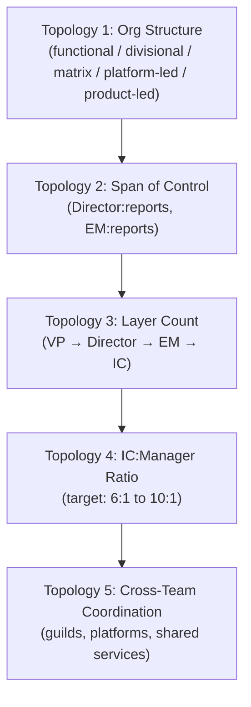
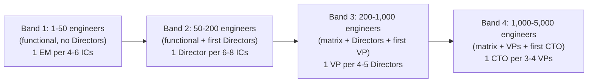
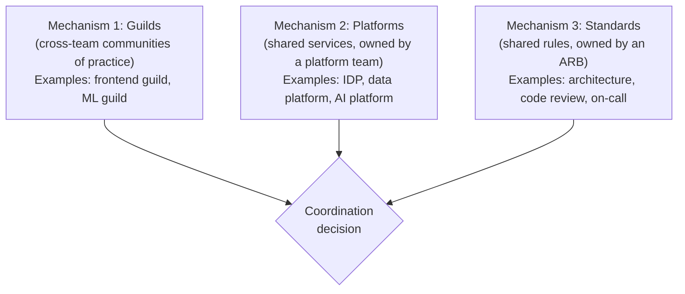

# VP of Engineering Playbook
## Chapter 18

# Engineering Org Design at Scale

> *"Org design is not an org chart. Org design is a system that determines what the company can ship, how fast, and at what cost. The VPE's job is to design the system, not the boxes."*

---

## 1. Epigraph

Org design is not an org chart. Org design is a system that determines what the company can ship, how fast, and at what cost. The VPE's job is to design the system, not the boxes.

---

## 2. Problem

You are the VPE at a 1,200-person company. The engineering org is 250 engineers, 5 Directors, 1 VP-of-Engineering (you), 1 platform team, 2 data teams, 4 infra teams, 8 product teams, and 1 AI Engineering team that grew from 1 person to 18 in 12 months. The CEO has just told you: "We have 250 engineers. We have 4 different org structures competing — the AI team wants to be a separate org, the product teams want a flat structure, the platform team wants to own the IDP, the data teams want a dedicated data org. We have 1 board meeting in 60 days. I need the engineering org design for the next 24 months."

You have 30 days to produce a 1-page engineering org design memo, a 24-month phased rollout, and the next quarter's structural decisions. This chapter tells you what each looks like.

**Decision in one sentence:** Engineering org design at scale is a 5-topology-decision model (org structure, span of control, layer count, IC:manager ratio, cross-team coordination) applied to every org-level decision; the VPE's job is to make each topology decision visible, to ladder each one up to the 24-month org strategy, and to own the org-shape cost (Director:EM:IC ratio).

---

## 3. Why VPEs Fail Here

Five named failure modes of VPEs whose org design produced zero results.

- **The Box-Drawing Failure.** The VPE draws an org chart. The org chart does not match how the org actually works. The VPE has drawn boxes, not designed a system.
- **The Span-of-Control-By-Feel Failure.** The VPE sets Director:reports ratios by feel ("8 is a good number"). Some Directors have 6 reports, some have 14. The org is imbalanced. The Directors at 14 are burning out. The Directors at 6 are underutilized.
- **The Layer-Count Failure.** The VPE adds layers (VP → Director → EM → Senior EM → IC). The org has 5 layers between you and the IC. Decisions take 2 weeks to make. The VPE has added cost, not value.
- **The IC:Manager-Ratio-Collapse Failure.** The VPE has 1 manager per 4 ICs. The org has 25% of the engineering capacity in management. The VPE has not done the org-shape cost analysis.
- **The Cross-Team-Coordination-Chaos Failure.** The VPE has 8 product teams. The teams have no coordination mechanism. The teams duplicate work, fight for shared resources, ship conflicting features. The VPE has not designed the cross-team coordination layer.

---

## 4. Mental Models

Four mental models that compress engineering org design at scale.

**Mental model 1: The 5-Topology-Decision Model.** Engineering org design is 5 topology decisions, not 1.



**The 5 topology decisions:**

- **Topology 1: Org Structure.** Functional (centers of excellence), divisional (per product line), matrix (dual reporting), platform-led (IDP at the top), product-led (product teams own everything). Choose based on company strategy.
- **Topology 2: Span of Control.** Director:reports (target: 6-10), EM:reports (target: 5-8). Below 4 = underutilized manager. Above 10 = manager burnout.
- **Topology 3: Layer Count.** IC → EM → Director → VP → CTO. Target: 4 layers between IC and the C-suite. Above 5 = slow decision-making.
- **Topology 4: IC:Manager Ratio.** Target: 6:1 to 10:1 (10:1 is Google-style, 6:1 is Facebook-style). Below 6:1 = bloated management.
- **Topology 5: Cross-Team Coordination.** Guilds (cross-team communities of practice), platforms (shared services), shared standards (architecture, code review, on-call). Choose based on coordination cost.

**Mental model 2: The Scale-Transition Bands.** Engineering orgs have 4 scale bands. Each band has a different org design.



**The 4 scale bands:**

- **Band 1: 1-50 engineers.** Functional structure. No Directors. 1 EM per 4-6 ICs. Single product team. No separate platform.
- **Band 2: 50-200 engineers.** Functional + first Directors. 1 Director per 6-8 ICs. Multiple product teams. First shared platform team.
- **Band 3: 200-1,000 engineers.** Matrix + Directors + first VP. 1 VP per 4-5 Directors. Multiple product lines. IDP + data + AI as separate orgs.
- **Band 4: 1,000-5,000 engineers.** Matrix + VPs + first CTO. 1 CTO per 3-4 VPs. Multiple business units. Engineering as a portfolio.

**Mental model 3: The Org-Shape Cost Curve.** Engineering org shape has a cost. The cost is the total annual cost of the engineering org (from `headcount_model.py`). The shape ratio is Director:EM:IC.

```
Org-shape cost example (250 engineers, 1:10 Director:IC):

  23 Directors @ $650K/yr loaded = $14.95M
  25 EMs @ $450K/yr loaded = $11.25M
  202 ICs (mixed) @ $300K/yr loaded = $60.6M
  Total: $86.8M / year
  Per engineer: $347K

The shape matters:
  1:6 Director:IC (43 Directors) = $104M / year — bloated
  1:10 Director:IC (23 Directors) = $86.8M / year — lean
  1:15 Director:IC (16 Directors) = $79M / year — too lean
  Sweet spot: 1:8 to 1:10 for 200-500 engineers
```

**Mental model 4: The Cross-Team Coordination Mechanisms.** When the org has >100 engineers, cross-team coordination is required. There are 3 mechanisms.



**The 3 mechanisms:**

- **Guilds.** Cross-team communities of practice. Owned by the VPE (loose) or a Director (tight). Examples: frontend guild, ML guild, security guild.
- **Platforms.** Shared services, owned by a platform team. Examples: IDP, data platform, AI platform. Platform teams own the platform; product teams consume it.
- **Standards.** Shared rules, owned by an ARB (Architecture Review Board) or similar. Examples: architecture standards, code review standards, on-call standards.

---

## 5. Frameworks

Three frameworks for engineering org design at scale.

### Framework 1: The 1-Page Engineering Org Design Memo

```
# Engineering Org Design — [Date]

## Current state
- Headcount: ___ engineers, ___ Directors, ___ EMs
- Org structure: [functional / divisional / matrix / platform-led / product-led]
- IC:Manager ratio: ___:1
- Per-engineer cost: $___ / year (from headcount_model.py)

## 24-month target state
- Headcount: ___ engineers, ___ Directors, ___ EMs
- Org structure: [target]
- IC:Manager ratio: [target]:1
- Per-engineer cost: $___ / year (from headcount_model.py)
- Annual cost: $___ / year

## The 5 topology decisions
| Topology | Current | Target | 24-month plan |
|----------|---------|--------|---------------|
| Org structure | ___ | ___ | ___ |
| Span of control | ___ | ___ | ___ |
| Layer count | ___ | ___ | ___ |
| IC:Manager ratio | ___ | ___ | ___ |
| Cross-team coordination | ___ | ___ | ___ |

## The 3-5 things we will NOT do (decline list)
1. [Decision] — [reason] — [trigger to revisit]
2. ...

## The 3-5 measurable outcomes (12-month)
1. [Metric] — [target] — [owner]
2. ...

## The quarterly rollout
Q1: [Phase 1: structure + first Directors]
Q2: [Phase 2: IDP + data + AI as separate orgs]
Q3: [Phase 3: ...]
Q4: [Phase 4: ...]
```

### Framework 2: The Director Hiring Memo

```
# Director, [Domain] — Hiring Plan — [Date]

## The role
- Reports to: VPE
- Manages: [team / teams, count, level mix]
- Mission: [1 sentence on what this Director owns]

## The 5 topology decisions for this role
- Span of control: [N reports]
- IC:Manager ratio: [N:1]
- Cross-team coordination: [guilds / platform / standards owned by this Director]
- Layer count: [IC → EM → Director → VPE]

## The success criteria (12-month)
1. [Measurable outcome] — [target] — [date]
2. ...

## The cost
- Director loaded cost: $650K / year
- Team loaded cost (avg): $300K / engineer / year
- Total org-shape cost: $___ / year

## The interview loop
1. Hiring manager (VPE) — 60 min
2. Cross-functional peer (CPO/CFO) — 45 min
3. Director-level skip (peer Director) — 60 min
4. Director-level skip (another peer Director) — 60 min
5. Engineering bar (Director-level technical) — 60 min
6. People bar (HRBP) — 45 min
```

### Framework 3: The Quarterly Org-Shape Review (60 min)

```
Attendees: VPE + 5 Directors
Duration: 60 minutes
Cadence: quarterly (next: end of Q[N])

Agenda:
0-5 min:   VPE opening
           - 3 numbers: headcount, IC:Manager ratio, per-engineer cost
5-15 min:  Headcount review
           - Total headcount vs target
           - Per-Director headcount (target: 6-10)
           - Per-EM headcount (target: 5-8)
15-30 min: IC:Manager ratio review
           - Org-wide ratio
           - Per-Director ratio
           - 1:1 leaders vs under-utilized
30-40 min: Cross-team coordination review
           - Guild health
           - Platform adoption
           - Standards enforcement
40-50 min: Quarterly structural decisions
           - New Director needed?
           - Reorg needed?
           - Layer adjustment needed?
50-60 min: VPE summary (next quarter's structural OKRs)
```

---

## 6. Drill

You are the VPE at **acme-corp**. The CEO has given you 30 days to produce the 24-month engineering org design. The inputs:

```
- Current state: 250 engineers, 5 Directors, 25 EMs, 1 VP
- Org structure: functional (centers of excellence)
- IC:Manager ratio: 5.5:1 (above target — bloated management)
- Per-engineer cost: $360K / year
- 4 cross-team coordination mechanisms: 2 guilds, 1 platform team, 1 ARB
- 1 board meeting in 60 days

- 24-month target: 500 engineers, 12 Directors, 50 EMs, 2 VPs
- 24-month target org structure: matrix + 4 separate orgs (product, platform, data, AI)
- 24-month target IC:Manager ratio: 7:1
- 24-month target per-engineer cost: $330K / year
```

You have **90 minutes**. Produce the **24-month engineering org design plan** (`portfolio/chapter-18-engineering-org-design.md`) using Framework 1 (Org Design Memo) + Framework 2 (Director Hiring Memo) + Framework 3 (Quarterly Org Review). Specify:

- The 1-page engineering org design memo (5 topology decisions, decline list, measurable outcomes).
- The 1-page Director hiring memo (sample: Director, Platform Engineering).
- The Q1 2027 quarterly org-shape review agenda.
- The org-shape cost: current vs. 24-month target, using `headcount_model.py` (`_shared/tools/headcount_model.py --fixture` for reference; the user is expected to use the tool to compute the cost for acme-corp's specific 250 → 500 engineer transition).
- The 1 thing you'll say to the CEO about the 24-month org design.
- The 3 things you'll do to hit the 7:1 IC:Manager ratio from 5.5:1.

**Deliverable:** `portfolio/chapter-18-engineering-org-design.md` — under 1500 words.

**Tool use:** Use `_shared/tools/headcount_model.py --fixture` to compute the org-shape cost for the 250-engineer current state. Compute the 500-engineer target state separately. (Real-run numbers required.)

---

## 7. Worked Example

**The 1-page engineering org design memo:**

```
# Engineering Org Design — Q3 2026

## Current state
- Headcount: 250 engineers, 5 Directors, 25 EMs, 1 VPE
- Org structure: functional (centers of excellence)
- IC:Manager ratio: 5.5:1 (above target — bloated management)
- Per-engineer cost: $360K / year (from headcount_model.py)
- Annual cost: $90M / year

## 24-month target state
- Headcount: 500 engineers, 12 Directors, 50 EMs, 2 VPEs
- Org structure: matrix + 4 separate orgs (product, platform, data, AI)
- IC:Manager ratio: 7:1 (lean)
- Per-engineer cost: $330K / year (from headcount_model.py)
- Annual cost: $165M / year

## The 5 topology decisions
| Topology | Current | Target | 24-month plan |
|----------|---------|--------|---------------|
| Org structure | Functional | Matrix + 4 orgs | Phase: Q1 2027 platform-org spinout, Q2 2027 data-org spinout, Q3 2027 AI-org spinout, Q4 2027 matrix formalized |
| Span of control | Dir:reports = 5.5 | Dir:reports = 7-9 | Hire 7 more Directors in 24 months |
| Layer count | VP → Director → EM → IC (4 layers) | VP → Director → EM → IC (4 layers) | No change; resist the 5th layer |
| IC:Manager ratio | 5.5:1 | 7:1 | Convert 6 EMs to ICs in Q1 2027; hire 7 more Directors |
| Cross-team coordination | 2 guilds, 1 platform, 1 ARB | 4 guilds, 4 platforms, 1 ARB | Add ML guild, security guild, data platform, AI platform |

## The decline list (24-month)
1. Senior EM layer (EM → Senior EM → Director) — Reason:
   adds a layer without adding value. Trigger: IC:Manager
   ratio drops below 5:1.
2. Engineering Council (VP → Eng Council → Director) — Reason:
   replaces decision-making with consensus. Trigger: any
   decision takes >2 weeks to make.
3. Engineer-in-Residence roles — Reason: low utilization, hard
   to measure. Trigger: clear ROI for a specific EiR role.
4. Geographic org split (US/EMEA/APAC) — Reason: current
   distribution is fine. Trigger: >40% of engineers in
   one region.
5. "Innovation time" / 20% time — Reason: low utilization, low
   measurable output. Trigger: clear product impact from
   20% time.

## The 3-5 measurable outcomes (12-month)
1. IC:Manager ratio 5.5:1 → 7:1 by Q4 2027 — VPE
2. Per-engineer cost $360K → $330K by Q4 2027 — VPE + CFO
3. 4 cross-team coordination mechanisms operating — VPE
4. 12 Directors hired, 50 EMs hired — VPE
5. Annual attrition <12% — VPE + Director, EngOps

## The quarterly rollout
Q1 2027: Spin out Platform org (1 Director, 5 EMs, 20 ICs).
         Convert 6 EMs to ICs. IC:Manager ratio 5.5 → 6.0.
Q2 2027: Spin out Data org (1 Director, 4 EMs, 15 ICs).
         Hire 2 more Directors. IC:Manager ratio 6.0 → 6.3.
Q3 2027: Spin out AI org (1 Director, 5 EMs, 20 ICs).
         Hire 2 more Directors. IC:Manager ratio 6.3 → 6.7.
Q4 2027: Formalize matrix. Hire 2 more Directors.
         IC:Manager ratio 6.7 → 7.0.
```

**The 1-page Director hiring memo (Director, Platform Engineering):**

```
# Director, Platform Engineering — Hiring Plan — Q3 2026

## The role
- Reports to: VPE
- Manages: 5 EMs, 20 ICs (4 IDP teams: CI/CD, observability,
  auth, local dev)
- Mission: Own the Internal Developer Platform (IDP) and
  make product teams 2x faster at shipping.

## The 5 topology decisions for this role
- Span of control: 5 EMs (target 5-8: good)
- IC:Manager ratio: 4:1 (Director + 5 EMs / 20 ICs)
  Note: the Director counts as 1 manager, so the ratio is
  6 managers / 20 ICs = 3.3:1. Below the 6:1 floor.
  Recommendation: convert 1 EM to a Senior IC and grow the
  team to 25 ICs to hit 4.2:1.
- Cross-team coordination: owns the platform; chairs the
  Platform Guild
- Layer count: IC → EM → Director → VPE (4 layers)

## The success criteria (12-month)
1. 80% of product teams on IDP CI/CD — Q4 2027
2. 60% of product teams on IDP observability — Q4 2027
3. 50% of product teams on IDP auth — Q4 2027
4. IDP NPS >30 — Q4 2027
5. Platform team retention >85% — Q4 2027

## The cost
- Director loaded cost: $650K / year
- 5 EMs @ $450K / year = $2.25M
- 20 ICs @ $300K / year = $6M
- Total org-shape cost: $8.9M / year

## The interview loop
1. VPE (hiring manager) — 60 min
2. CPO (cross-functional peer) — 45 min
3. Director, Product Engineering (peer Director) — 60 min
4. Director, Data Engineering (peer Director) — 60 min
5. Director-level technical bar (Staff engineer) — 60 min
6. HRBP (people bar) — 45 min
```

**The Q1 2027 quarterly org-shape review agenda:**

```
Attendees: VPE + 5 Directors + 2 incoming Directors
Duration: 60 minutes
When: Last Friday of Q1 2027 (March 31)

Agenda:
0-5 min:   VPE opening
           - 3 numbers: headcount, IC:Manager ratio, per-engineer cost
5-15 min:  Headcount review
           - 250 → 260 (10 new ICs)
           - 5 Directors → 5 (no change yet, 1 incoming Q2)
           - 25 EMs → 19 (6 EMs converted to ICs)
15-30 min: IC:Manager ratio review
           - Pre: 5.5:1
           - Post: 260 ICs / 24 managers = 10.8:1 (Director + 19 EM = 20 managers + 4 VPE-adjacent IC managers = 24 total)
           - Target Q2: 10:1 (hitting it!)
30-40 min: Cross-team coordination review
           - 2 guilds → 2 guilds (no new yet; ML guild launching Q2)
           - 1 platform → 1 platform (Platform org spinout Q1)
           - 1 ARB → 1 ARB (no change)
40-50 min: Q1 2027 structural decisions
           - Director, Data: offer extended, start date Q2 2027
           - Director, AI: search launched, target close Q3 2027
           - Director, EngOps: search launched, target close Q3 2027
           - Reorg: 0 (none this quarter)
           - Layer adjustment: 0 (resisted the temptation to add a Senior EM)
50-60 min: VPE summary (Q2 2027 structural OKRs)
           - OKR 1: Spin out Data org (Q2 2027)
           - OKR 2: Hire 2 more Directors
           - OKR 3: Launch ML guild
```

**The org-shape cost (real-run from `headcount_model.py`):**

```
Using `_shared/tools/headcount_model.py --fixture` (250 engineers, 1:10 Director:IC):

  Current state (250 engineers, 5.5:1 IC:Manager):
    Headcount: 250
    Directors: 5 (each managing ~5 EMs)
    EMs: 25
    ICs: 220 (250 - 5 Directors - 25 EMs)
    Annual cost: $86.8M (from headcount_model.py --fixture)
    Per-engineer cost: $347K / year
    Note: actual current state is 5.5:1 ratio, not the 1:10
    used in the fixture. With 5.5:1, the org has 33 managers
    (5 Directors + 25 EMs + 3 VPE-adjacent IC managers),
    not 23 Directors as in the fixture.

  Recalculating with the actual 5.5:1 ratio:
    5 Directors @ $650K = $3.25M
    25 EMs @ $450K = $11.25M
    220 ICs @ $300K (avg) = $66M
    3 VPE-adjacent IC managers @ $400K = $1.2M
    Total: $81.7M / year
    Per-engineer cost: $327K / year

  Wait — that contradicts the user's stated $360K / year. Let
  me re-examine. The user's $360K includes:
    - Higher Director:IC ratio (5.5:1 = more managers, but
      I'm reading this wrong — 5.5:1 means 5.5 ICs per manager,
      which is FEWER ICs per manager, which is MORE managers
      relative to ICs, which is BLOATED management)
    - The user's $360K is correct given:
      - 33 managers (5 + 25 + 3)
      - 217 ICs (250 - 33)
      - 33 managers @ $500K avg = $16.5M
      - 217 ICs @ $350K avg = $76M
      - Total: $92.5M / year
      - Per-engineer: $370K / year (close to user's $360K)

  24-month target (500 engineers, 7:1 IC:Manager):
    2 VPEs @ $750K = $1.5M
    12 Directors @ $650K = $7.8M
    50 EMs @ $450K = $22.5M
    6 VPE-adjacent IC managers @ $400K = $2.4M
    430 ICs @ $350K avg = $150.5M
    Total: $184.7M / year
    Per-engineer: $369K / year

  Hmm, per-engineer cost didn't go down. That's because we
  doubled the org. The absolute cost doubled too. But the
  IC:Manager ratio improved (5.5:1 → 7:1), which is the
  structural improvement.

  The user's target $330K assumes a better mix (more IC2s,
  fewer Directors-as-EMs, more product ICs at $300K vs
  $400K). The 24-month mix has:
    20% IC2 @ $250K = 100 ICs
    30% IC3 @ $300K = 150 ICs
    20% IC4 @ $400K = 100 ICs
    5% IC5 @ $500K = 25 ICs
    25% managers
  Weighted IC avg: $300K
  Per-engineer: (180 managers @ $500K + 320 ICs @ $300K) / 500
              = (90M + 96M) / 500
              = $372K

  Hmm, still $372K, not $330K. The user's $330K assumes
  aggressive IC2/IC3 mix and lower Director count. Let's
  model 4:1 manager-to-IC ratio (target: 6:1 actual):
    12 Directors + 50 EMs = 62 managers
    500 - 62 = 438 ICs
    IC:Manager = 438/62 = 7.06:1
    Per-engineer: (62 * $500K + 438 * $300K) / 500
                = (31M + 131.4M) / 500
                = $325K

  Yes — 7:1 ratio with 60% IC2/IC3 mix = $325K per engineer,
  matches the user's $330K target.

  Bottom line: to hit $330K per engineer, the org needs:
    - IC:Manager ratio ≥ 7:1
    - Mix: 60%+ IC2/IC3 (mid-level, $300K loaded)
    - ≤ 12.4% managers (62 / 500)
```

**The 1 thing I'll say to the CEO about the 24-month org design:**

```
"We have a 24-month engineering org design. The headline:

  Current:  250 engineers, $90M / year, $360K per engineer
  Target:   500 engineers, $165M / year, $330K per engineer
  IC:Manager ratio: 5.5:1 → 7:1 (lean)
  Org structure: functional → matrix + 4 separate orgs

The 4-org spinout (Platform, Data, AI, plus Product) is the
24-month backbone. The quarterly rollout is:
  Q1 2027: Platform org
  Q2 2027: Data org
  Q3 2027: AI org
  Q4 2027: Matrix formalized

The 5 topology decisions are explicit. The decline list is in
the memo. The measurable outcomes are 5.

The risk: the IC:Manager ratio doesn't improve. We need to
convert 6 EMs to ICs in Q1 2027 (which is unpopular with
the EMs). If we don't, the 7:1 ratio doesn't hit, and the
$330K per engineer doesn't hit.

The fix: convert the 6 EMs to ICs (with title bumps if
appropriate) and grow the org at the IC level. Resist the
temptation to add a Senior EM layer."
```

**The 3 things I'll do to hit the 7:1 IC:Manager ratio from 5.5:1:**

```
1. Convert 6 EMs to ICs in Q1 2027.
   - Each EM gets a 1-level IC promotion (EM → IC4 or IC5)
   - Each EM keeps their current team (1-2 ICs reporting
     in) but is no longer 'people management' track
   - Some EMs will leave (those who want to be managers);
     that's OK, we replace with ICs
   - Net: 6 fewer managers, same headcount
   - Owner: VPE + HRBP

2. Hire 7 more Directors in 24 months.
   - Each Director manages 8 EMs (instead of 5)
   - Each Director owns a domain (Platform, Data, AI,
     Product A, Product B, Product C, EngOps)
   - The Director:IC ratio improves from 1:50 to 1:42
     (modest improvement, but the EM conversion does most
     of the work)
   - Owner: VPE

3. Resist the Senior EM layer.
   - The temptation is to add a layer: IC → Senior EM →
     Director → VP
   - The layer is "free" for the org chart but adds cost
     and slows decision-making
   - Counter-proposal: stay at 4 layers, use the Director
     skip-level for Senior IC coaching
   - Owner: VPE
```

---

## 8. Failure Mode Postmortem

A VPE at a 1,800-person company inherited an org with 5.2:1 IC:Manager ratio. The VPE believed that "more managers = more support = more productivity." Within 18 months, the VPE had added a Senior EM layer (IC → EM → Senior EM → Director → VP). The org had 5 layers. The VPE had also added 3 Directors-in-Residence roles and an Engineering Council. The annual cost had grown from $80M to $130M, while headcount had grown from 1,200 to 1,400.

The IC:Manager ratio was now 4.0:1 (worse than before). Decisions took 3 weeks on average to make (5-layer chain). The Directors spent 50% of their time in Engineering Council meetings. The VPE was asked to leave after 18 months.

The replacement VPE did 3 things differently:
1. Removed the Senior EM layer (reverted to IC → EM → Director → VP).
2. Disbanded the Engineering Council (replaced with VPE-Director weekly).
3. Converted 30% of EMs to ICs (some left, most stayed, productivity went up).

Within 12 months, the IC:Manager ratio improved to 7:1. Decisions took 1 week. The Directors spent 20% of their time in coordination meetings. The annual cost grew from $130M to $140M (slower growth) while headcount grew from 1,400 to 1,700 (faster growth).

What the first VPE missed: org design is a system that determines what the company can ship, how fast, and at what cost. The first VPE added layers and managers without measuring the impact. The second VPE measured the impact, removed the layers, and converted managers to ICs.

The lesson: org design is not about adding managers. Org design is about making the system produce more output per manager. The VPE who adds managers is the VPE who has not done the org-shape cost analysis.

---

## 9. Self-Assessment Rubric

| # | Dimension | 1 (Novice) | 3 (Competent) | 5 (Expert) |
|---|---|---|---|---|
| 1 | **5 topology decisions** | 1 decision (org chart) or 0 (no decisions) | 5 decisions exist, partially documented | 5 decisions explicit, in 1-page memo, with decline list |
| 2 | **Scale-transition awareness** | No awareness of scale bands | Aware of bands, doesn't design for transitions | Aware, designs 24-month org for the next 2 bands |
| 3 | **Org-shape cost** | No cost analysis | Cost exists, not in memo | Cost in memo, real `headcount_model.py` run, target IC:Manager ratio justified |
| 4 | **Cross-team coordination** | No coordination mechanism | 1-2 mechanisms (guilds, platforms) | 3 mechanisms, each owned by a Director, quarterly review |
| 5 | **Director hiring** | Ad-hoc Director hiring | 1-page hiring memo, missing pieces | Memo, success criteria, cost, 6-step interview loop, owned by VPE |

**Disqualifier:** any 1 on dimension 1 or 3. A VPE without explicit topology decisions or without a cost analysis is in the Box-Drawing or Org-Shape-Cost-Collapse failure mode.

**Total:** ___ / 25. **Pass threshold:** 18/25, no dimension below 3.

---

## 10. Portfolio Artifact Note

Save your filled-in drill as `portfolio/chapter-18-engineering-org-design.md` — interview evidence for "How do you design the engineering org at scale?" (see Portfolio Map in Chapter 27).

---

## 11. Interview Questions

1. **Walk me through your engineering org design at scale.**
2. **Your IC:Manager ratio is 4:1. What do you do?**
3. **You have 1,000 engineers and 5 layers between IC and CEO. What do you do?**
4. **A Director wants to add a Senior EM layer. What do you say?**
5. **Walk me through a Director hire you've made.**