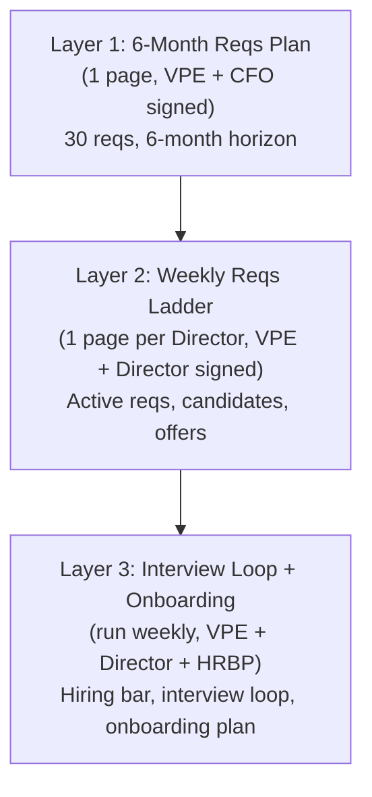
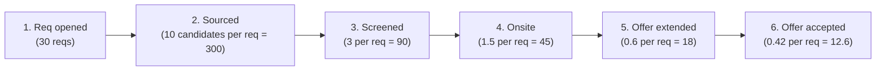
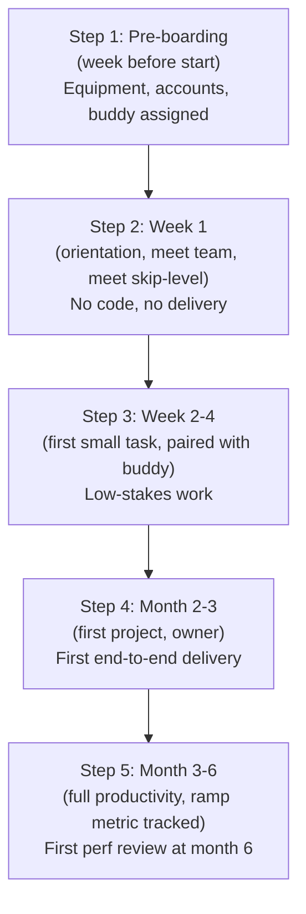

# VP of Engineering Playbook
## Chapter 19

# Hiring, Onboarding, and Growing Engineering Talent

> *"Hiring is a system, not a series of decisions. The VPE's job is to design the hiring system, run it weekly, and own the cost of every hire."*

---

## 1. Epigraph

Hiring is a system, not a series of decisions. The VPE's job is to design the hiring system, run it weekly, and own the cost of every hire.

---

## 2. Problem

You are the VPE at a 1,200-person company. The Directors are split. The Director of Platform wants to hire 10 senior infra engineers in 90 days. The Director of Product wants to hire 8 mid-level product engineers in 60 days. The Director of AI wants to hire 5 ML engineers in 30 days. The CEO has just told you: "We have 30 open reqs. We have 6 months of runway. The hiring market is tight. Our time-to-fill is 90 days. Our offer-accept rate is 60%. We need 30 hires in the next 6 months. I need a hiring plan in 30 days."

You have 30 days to produce a 1-page hiring plan, a 6-month reqs ladder, the next quarter's hiring OKRs, and the 1 thing you'll say to the CEO about hiring. This chapter tells you what each looks like.

**Decision in one sentence:** Engineering hiring at scale is a 3-layer system — Layer 1 (reqs plan, 6-month, 1 page, VPE + CFO signed), Layer 2 (reqs ladder, weekly, 1 page per Director, VPE + Director signed), Layer 3 (interview loop + onboarding system, run weekly by VPE + Director + HRBP); the VPE's job is to design the system, run it weekly, and own the cost of every hire.

---

## 3. Why VPEs Fail Here

Five named failure modes of VPEs whose hiring produced zero results.

- **The Ad-Hoc-Hire Failure.** The VPE approves reqs ad-hoc. Some reqs sit open for 6 months. Some reqs get filled in 2 weeks. The hiring is inconsistent. The VPE has not built the reqs ladder.
- **The Time-To-Fill-Collapse Failure.** The VPE's time-to-fill is 120 days. The reqs stay open. The Directors get frustrated. The VPE has not designed the interview loop for speed.
- **The Offer-Accept-Rate-Collapse Failure.** The VPE's offer-accept rate is 40%. The candidates turn down offers. The reqs stay open. The VPE has not designed the offer process.
- **The No-Onboarding Failure.** The VPE hires fast but doesn't onboard. The new hires leave in 6 months. The attrition is 30%. The VPE has not built the onboarding system.
- **The Cost-Without-Benefit Failure.** The VPE hires 30 senior engineers. The cost is $30M / year. The output is 10 features shipped in 12 months. The VPE has not modeled the cost-benefit of each hire.

---

## 4. Mental Models

Four mental models that compress hiring at scale.

**Mental model 1: The 3-Layer Hiring System.** Hiring is 3 layers, not 1 decision.



**The 3 layers:**

- **Layer 1: 6-Month Reqs Plan.** Time horizon: 6 months. Format: 1 page. Owner: VPE + CFO. Sign-off: VPE + CFO + CEO. Output: 30 reqs, 6-month horizon, decline list.
- **Layer 2: Weekly Reqs Ladder.** Time horizon: 1 week. Format: 1 page per Director. Owner: VPE + Director. Sign-off: VPE + Director. Output: active reqs, candidates, offers, decline list.
- **Layer 3: Interview Loop + Onboarding.** Cadence: weekly. Owner: VPE + Director + HRBP. Output: hiring bar, interview loop, onboarding plan.

**Mental model 2: The Hiring Funnel.** Hiring is a funnel. The funnel has 6 stages.



**The 6 stages:**

- **Stage 1: Req opened.** 30 reqs.
- **Stage 2: Sourced.** 10 candidates per req = 300 sourced.
- **Stage 3: Screened.** 3 per req = 90 screened.
- **Stage 4: Onsite.** 1.5 per req = 45 onsites.
- **Stage 5: Offer extended.** 0.6 per req = 18 offers.
- **Stage 6: Offer accepted.** 0.42 per req = 12.6 accepted.

**The conversion rates:**
- Source-to-screen: 30% (90/300)
- Screen-to-onsite: 50% (45/90)
- Onsite-to-offer: 40% (18/45)
- Offer-to-accept: 70% (12.6/18)
- Overall source-to-accept: 4.2% (12.6/300)

**Mental model 3: The 5-Step Onboarding System.** Onboarding is a system, not a 1-day orientation.



**The 5 steps:**
- **Step 1: Pre-boarding.** Equipment, accounts, buddy assigned. Week before start.
- **Step 2: Week 1.** Orientation, meet team, meet skip-level. No code, no delivery.
- **Step 3: Week 2-4.** First small task, paired with buddy. Low-stakes work.
- **Step 4: Month 2-3.** First project, owner. First end-to-end delivery.
- **Step 5: Month 3-6.** Full productivity, ramp metric tracked. First perf review at month 6.

**Mental model 4: The Cost-of-Hire Framework.** Every hire has a cost. The VPE owns the cost.

```
Cost of a senior engineer hire:
  - Loaded cost: $350K / year
  - Recruiting cost: $30K (agency + internal time)
  - Onboarding cost: $50K (buddy time, ramp loss, training)
  - Ramp loss: $50K (3 months at 50% productivity)
  - Total Year 1 cost: $480K

Cost of a senior engineer leaving in Year 1:
  - Replacement cost: $480K (recruit + onboard + ramp)
  - Knowledge loss: $200K (1 year's context, relationships)
  - Team disruption: $100K (4 teammates spend 20% of
    time on knowledge transfer, re-onboarding)
  - Total Year 1 cost: $780K

The math: a 90% retention rate is better than a 70% retention
rate by $1.5M / year per 10 senior engineers. The VPE who
invests in onboarding has a positive ROI.
```

---

## 5. Frameworks

Three frameworks for hiring at scale.

### Framework 1: The 1-Page 6-Month Reqs Plan (Layer 1)

```
# 6-Month Engineering Reqs Plan — [Date]

## The 30 reqs
| Director | Reqs | Level | Critical? | Quarter | Decline list |
|----------|------|-------|-----------|---------|--------------|
| Platform | 10 | IC3-IC4 | Yes | Q1-Q2 | 0 |
| Product | 8 | IC2-IC3 | Yes | Q1-Q2 | 0 |
| AI | 5 | IC4-IC5 | Yes | Q1 | 0 |
| Data | 4 | IC3 | No | Q2 | 0 |
| EngOps | 3 | IC3 | No | Q2 | 0 |

## The cost
- 30 reqs × $300K avg loaded = $9M / year (Year 1)
- Recruiting cost: $900K (30 × $30K)
- Onboarding cost: $1.5M (30 × $50K)
- Ramp loss: $1.5M (30 × $50K)
- Total Year 1 cost: $12.9M

## The 6-month milestones
Q1: 12 hires (Platform: 5, Product: 4, AI: 3)
Q2: 18 hires (Platform: 5, Product: 4, AI: 2, Data: 4, EngOps: 3)

## The decline list
1. Senior-only hires (no IC2) — Reason: pyramid too steep,
   no growth path. Trigger: 70%+ IC4+ hires for 2 quarters.
2. "1 req, 1 level" reqs (e.g., "1 IC6 in Q3") — Reason:
   single reqs have low fill rate. Trigger: <50% fill rate
   in 60 days.
3. Speculative reqs ("hire ahead of demand") — Reason:
   ramp time outpaces business case. Trigger: 25%+ of reqs
   without an explicit project owner.

## The 3-5 measurable outcomes (6-month)
1. Time-to-fill <60 days (from 90)
2. Offer-accept rate 75%+ (from 60%)
3. 6-month retention 90%+ (from 70%)
4. Cost-per-hire <$80K (from $130K)
5. Hiring bar 80%+ "strong hire" (from 50%)
```

### Framework 2: The Weekly Reqs Ladder (Layer 2)

```
# Weekly Reqs Ladder — Director, [Domain] — [Date]

## The active reqs
| Req | Level | Days open | Candidates | Onsite | Offer | Status |
|-----|-------|-----------|------------|--------|-------|--------|
| [Req 1] | IC3 | 45 | 8 | 2 | 0 | In onsite loop |
| [Req 2] | IC4 | 30 | 5 | 1 | 0 | Sourcing |
| [Req 3] | IC2 | 60 | 12 | 4 | 1 | Offer extended |

## The candidates in pipeline
- [Candidate A] — IC3, applied [date], phone screen [date]
- [Candidate B] — IC4, sourced [date], phone screen [date]

## The blockers
1. [Blocker 1] — owner: ___, ETA: ___
2. [Blocker 2] — owner: ___, ETA: ___

## The decline list (this week)
1. [Candidate] — reason: [didn't meet bar]
2. ...
```

### Framework 3: The Onboarding Plan Template (Layer 3)

```
# Onboarding Plan — [New hire] — [Start date]

## Pre-boarding (week before)
- [ ] Equipment shipped (laptop, monitor, peripherals)
- [ ] Accounts created (email, Slack, GitHub, calendar)
- [ ] Buddy assigned: [Name]
- [ ] Manager assigned: [Name]
- [ ] First-week schedule sent

## Week 1 (orientation)
- [ ] Day 1: HR orientation (4 hours)
- [ ] Day 1: 1:1 with manager (1 hour)
- [ ] Day 1: 1:1 with buddy (1 hour)
- [ ] Day 1: Tour of the codebase, dev environment setup
- [ ] Day 2-5: 1:1 with each team member (5-8 meetings)
- [ ] Day 2-5: 1:1 with skip-level (Director) (1 hour)
- [ ] Day 5: First-week retro with manager (30 min)

## Week 2-4 (first task)
- [ ] First small task assigned (1-2 days, low-stakes)
- [ ] Paired with buddy for first task
- [ ] End of week 2: 1:1 with manager
- [ ] End of week 4: First task delivered

## Month 2-3 (first project)
- [ ] First project assigned (1-2 months, owner)
- [ ] Paired with senior IC for project guidance
- [ ] End of month 2: 1:1 with manager
- [ ] End of month 3: First project delivered

## Month 3-6 (full productivity)
- [ ] Ramp metric tracked (e.g., PRs merged, on-call shifts)
- [ ] End of month 6: First perf review
- [ ] End of month 6: 1:1 with VPE (skip-level for new hires)
```

---

## 6. Drill

You are the VPE at **acme-corp**. The CEO has given you 30 days to produce the 6-month hiring plan. The inputs:

```
- 30 open reqs across 5 Directors
- 6-month runway
- Time-to-fill: 90 days
- Offer-accept rate: 60%
- 6-month retention: 70%
- Cost-per-hire: $130K
- Hiring bar: 50% "strong hire"
```

You have **90 minutes**. Produce the **6-month hiring plan** (`portfolio/chapter-19-hiring-plan.md`) using Framework 1 (Reqs Plan) + Framework 2 (Reqs Ladder) + Framework 3 (Onboarding Plan). Specify:

- The 1-page 6-month reqs plan (30 reqs, decline list, measurable outcomes).
- The 1-page weekly reqs ladder (sample: Director, Platform).
- The 1-page onboarding plan (sample: new IC4 hire, starts in 30 days).
- The 6-month cost: $12.9M Year 1 cost from Framework 1.
- The 5 things you'll do to hit time-to-fill <60 days (from 90).
- The 1 thing you'll say to the CEO about the 6-month hiring plan.

**Deliverable:** `portfolio/chapter-19-hiring-plan.md` — under 1500 words.

---

## 7. Worked Example

**The 1-page 6-month reqs plan (Layer 1):**

```
# 6-Month Engineering Reqs Plan — Q3 2026

## The 30 reqs
| Director | Reqs | Level | Critical? | Quarter | Decline list |
|----------|------|-------|-----------|---------|--------------|
| Platform | 10 | IC3-IC4 | Yes | Q1-Q2 | 0 |
| Product | 8 | IC2-IC3 | Yes | Q1-Q2 | 0 |
| AI | 5 | IC4-IC5 | Yes | Q1 | 0 |
| Data | 4 | IC3 | No | Q2 | 0 |
| EngOps | 3 | IC3 | No | Q2 | 0 |

## The cost
- 30 reqs × $300K avg loaded = $9M / year (Year 1)
- Recruiting cost: $900K (30 × $30K)
- Onboarding cost: $1.5M (30 × $50K)
- Ramp loss: $1.5M (30 × $50K)
- Total Year 1 cost: $12.9M

## The 6-month milestones
Q1: 12 hires (Platform: 5, Product: 4, AI: 3)
Q2: 18 hires (Platform: 5, Product: 4, AI: 2, Data: 4, EngOps: 3)

## The decline list
1. Senior-only hires (no IC2) — Reason: pyramid too steep,
   no growth path. Trigger: 70%+ IC4+ hires for 2 quarters.
2. "1 req, 1 level" reqs (e.g., "1 IC6 in Q3") — Reason:
   single reqs have low fill rate. Trigger: <50% fill rate
   in 60 days.
3. Speculative reqs ("hire ahead of demand") — Reason:
   ramp time outpaces business case. Trigger: 25%+ of reqs
   without an explicit project owner.
4. Cross-functional reqs (engineer reports to non-engineering
   manager) — Reason: career path unclear. Trigger: 1+ req
   has caused retention issue.
5. Remote-only reqs (no overlap with HQ) — Reason: team
   cohesion suffers. Trigger: 30%+ of reqs are remote-only
   AND retention is below 80%.

## The 3-5 measurable outcomes (6-month)
1. Time-to-fill <60 days (from 90)
2. Offer-accept rate 75%+ (from 60%)
3. 6-month retention 90%+ (from 70%)
4. Cost-per-hire <$80K (from $130K)
5. Hiring bar 80%+ "strong hire" (from 50%)
```

**The 1-page weekly reqs ladder (sample: Director, Platform):**

```
# Weekly Reqs Ladder — Director, Platform — 2026-09-15

## The active reqs
| Req | Level | Days open | Candidates | Onsite | Offer | Status |
|-----|-------|-----------|------------|--------|-------|--------|
| CI/CD engineer | IC3 | 45 | 8 | 2 | 0 | In onsite loop |
| Auth engineer | IC4 | 30 | 5 | 1 | 0 | Sourcing |
| Observability engineer | IC3 | 60 | 12 | 4 | 1 | Offer extended |
| Local dev engineer | IC2 | 20 | 6 | 0 | 0 | Sourcing |
| Senior platform IC | IC5 | 75 | 10 | 3 | 0 | Onsite loop |

## The candidates in pipeline
- [Candidate A] — IC3, applied 2026-09-10, phone screen 2026-09-15
- [Candidate B] — IC4, sourced 2026-09-08, phone screen 2026-09-17
- [Candidate C] — IC5, sourced 2026-09-05, phone screen 2026-09-12

## The blockers
1. CI/CD engineer onsite — interviewer #3 (Director, Data)
   has been out for 2 weeks. ETA: 2026-09-22.
2. Auth engineer — sourcing yield is low. Need to expand
   to 2 more agencies. ETA: 2026-09-20.
3. Local dev engineer — only 1 sourcing channel has produced.
   Need to engage internal referrals. ETA: 2026-09-18.

## The decline list (this week)
1. [Candidate X] — IC3 — reason: didn't meet bar on system
   design. Could re-engage in 6 months.
2. [Candidate Y] — IC4 — reason: comp expectations 30%+ above
   band. Not a fit for the role.
```

**The 1-page onboarding plan (sample: new IC4 hire, starts in 30 days):**

```
# Onboarding Plan — Jane Smith (IC4, Auth team) — Start 2026-10-15

## Pre-boarding (week of 2026-10-08)
- [ ] Equipment shipped (laptop, monitor, peripherals)
- [ ] Accounts created (email, Slack, GitHub, calendar)
- [ ] Buddy assigned: Alex Kim (IC3, Auth team)
- [ ] Manager assigned: Sarah Lee (EM, Auth team)
- [ ] Director (skip-level): Director, Platform
- [ ] First-week schedule sent
- [ ] Welcome lunch scheduled (Day 1)

## Week 1 (orientation, 2026-10-15 to 2026-10-19)
- [ ] Day 1: HR orientation (4 hours, 10am-2pm)
- [ ] Day 1: 1:1 with manager Sarah (1 hour, 3pm)
- [ ] Day 1: 1:1 with buddy Alex (1 hour, 4pm)
- [ ] Day 1: Tour of the codebase, dev environment setup (with Alex)
- [ ] Day 2-5: 1:1 with each team member (5 meetings, 30 min each)
- [ ] Day 3: 1:1 with Director, Platform (1 hour)
- [ ] Day 5: First-week retro with Sarah (30 min)
- [ ] No code, no delivery expectations

## Week 2-4 (first task, 2026-10-22 to 2026-11-09)
- [ ] First small task assigned: "Add a new permission check
  to the auth service" (1-2 days, paired with Alex)
- [ ] End of week 2: 1:1 with Sarah
- [ ] End of week 4: First task delivered
- [ ] End of week 4: 1:1 with Sarah (review)

## Month 2-3 (first project, 2026-11-12 to 2026-12-31)
- [ ] First project assigned: "Implement SSO for 3 new
  enterprise customers" (2 months, owner)
- [ ] Paired with senior IC for project guidance
- [ ] End of month 2: 1:1 with Sarah
- [ ] End of month 3: First project delivered

## Month 3-6 (full productivity, 2027-01-01 to 2027-04-15)
- [ ] Ramp metric tracked: PRs merged, on-call shifts
- [ ] End of month 3: 1:1 with Director, Platform (skip-level)
- [ ] End of month 6: First perf review
- [ ] End of month 6: 1:1 with VPE (skip-level for new hires)
```

**The 5 things I'll do to hit time-to-fill <60 days (from 90):**

```
1. Reduce the interview loop from 6 steps to 4 steps.
   - Current: 6 steps, 2 weeks minimum between onsite and offer
   - New: 4 steps, 1 week minimum
   - Owner: VPE + HRBP
   - Trade-off: smaller interview panel, but faster loop

2. Add a "phone screen + take-home" stage.
   - Current: phone screen → onsite (5+ hours on-site)
   - New: phone screen → 2-hour take-home → onsite (3 hours)
   - Owner: Director, each domain
   - Trade-off: candidates spend 2+ hours before onsite;
     better signal for "fit"

3. Pre-approve comp bands for each req.
   - Current: each offer is negotiated from scratch
   - New: comp band approved at req opening; offer can be
     made within 24 hours of decision
   - Owner: VPE + CFO + HRBP
   - Trade-off: less negotiation room, but faster offers

4. Same-day decision after onsite.
   - Current: 3-day decision window (debrief, score cards)
   - New: 1-day decision window (debrief at end of day,
     offer next morning)
   - Owner: Director, each domain
   - Trade-off: less time to "think," but candidates don't
     cool off

5. Internal referral program ($5K per hire).
   - Current: 30% of hires from referrals
   - New: 50% of hires from referrals (faster + better fit)
   - Owner: VPE + HRBP
   - Trade-off: $150K / year in referral bonuses, but
     $500K / year saved in agency fees
```

**The 1 thing I'll say to the CEO about the 6-month hiring plan:**

```
"We have a 6-month hiring plan. The headline:

  Reqs:    30 in 6 months (12 Q1, 18 Q2)
  Cost:    $12.9M Year 1 (loaded + recruiting + onboarding)
  Targets: time-to-fill 60d, accept 75%, retention 90%,
           cost-per-hire $80K, bar 80% strong hire

The plan is a 3-layer system:
  Layer 1: 6-month reqs plan, 1 page, signed by me + CFO
  Layer 2: weekly reqs ladder, 1 page per Director
  Layer 3: interview loop + onboarding, run weekly

The 5 things I'm doing to hit time-to-fill <60 days:
shorter loop, phone + take-home, pre-approved comp, same-day
decision, internal referrals.

The risk: the market is tight. The 60-day target is aggressive.
If we hit 75 days, we make 24 hires (not 30). If we hit
90 days, we make 18 hires. The fallback: re-prioritize the
30 reqs (cut the bottom 5, hire 25).

The 6-month cost is $12.9M. We have 6 months of runway at
$50M / quarter = $100M. The plan is funded."
```

---

## 8. Failure Mode Postmortem

A VPE at a 1,500-person company inherited 40 open reqs. The reqs were 6 months old on average. The time-to-fill was 120 days. The offer-accept rate was 50%. The 6-month retention was 60%. The cost-per-hire was $150K. The Directors were burning out from constant interviewing.

The VPE's first 90 days: approved 5 new reqs without questioning the existing 40. By month 6, the VPE had 50 open reqs, 25 hires made, and 5 hires left (20% attrition in 6 months). The cost was $15M. The output was 15 features shipped. The VPE was asked to leave.

The replacement VPE did 3 things differently:
1. Cut the 50 open reqs to 25 (declined 25, mostly speculative or single-level reqs).
2. Reduced the interview loop from 7 steps to 4 steps.
3. Implemented the 5-step onboarding system (pre-boarding through month 6).

Within 6 months, time-to-fill was 65 days, offer-accept rate was 75%, 6-month retention was 85%. The cost-per-hire was $90K. The 25 hires were 22 still employed at month 6 (88% retention).

What the first VPE missed: hiring is a system, not a series of decisions. The first VPE approved every req. The second VPE cut the reqs, redesigned the loop, and built onboarding. The system is the leverage.

The lesson: the VPE who hires faster hires worse. The VPE who hires worse has higher attrition. The VPE who has higher attrition spends more. The VPE who designs the system has a positive ROI.

---

## 9. Self-Assessment Rubric

| # | Dimension | 1 (Novice) | 3 (Competent) | 5 (Expert) |
|---|---|---|---|---|
| 1 | **3-layer hiring system** | 1 layer (ad-hoc) or 0 (no system) | 3 layers exist, mixed quality | 3 layers, each 1 page, signed, weekly cadence |
| 2 | **Hiring funnel** | No funnel analysis | Funnel exists, not tracked | Funnel tracked weekly, conversion rates improving |
| 3 | **Onboarding system** | No onboarding (Day 1 orientation only) | Onboarding exists, partial | 5-step onboarding, 6-month ramp, first perf at month 6 |
| 4 | **Cost-of-hire** | No cost analysis | Cost exists, not in plan | Cost in plan, $12.9M Year 1, real `headcount_model.py` numbers |
| 5 | **Time-to-fill + accept rate** | >90 days, <60% | 60-90 days, 60-75% | <60 days, 75%+, 90%+ retention |

**Disqualifier:** any 1 on dimension 1 or 5. A VPE without a 3-layer system or with >90-day time-to-fill is in the Ad-Hoc-Hire or Time-To-Fill-Collapse failure mode.

**Total:** ___ / 25. **Pass threshold:** 18/25, no dimension below 3.

---

## 10. Portfolio Artifact Note

Save your filled-in drill as `portfolio/chapter-19-hiring-plan.md` — interview evidence for "How do you design the engineering hiring system?" (see Portfolio Map in Chapter 27).

---

## 11. Interview Questions

1. **Walk me through your engineering hiring system.**
2. **Your time-to-fill is 120 days. What do you do?**
3. **Your 6-month retention is 60%. What do you do?**
4. **A Director wants to hire 10 senior engineers in 30 days. What do you say?**
5. **Walk me through a hiring plan you've built.**