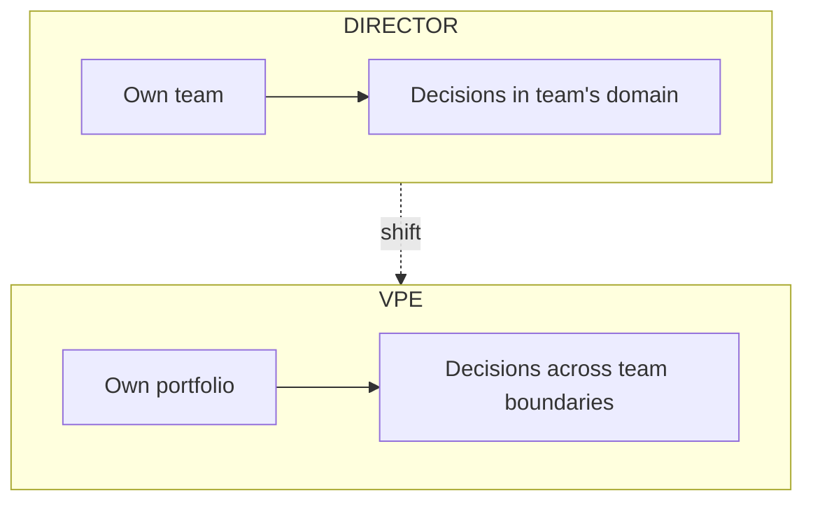
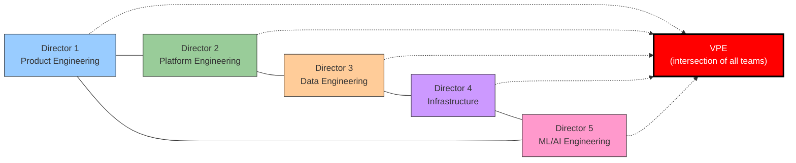

# VP of Engineering Playbook
## Chapter 2

# The Director-to-VP Category Change

> *"A VPE is not a Director with more reports. A VPE is a different person with a different job."*

---

## 1. Epigraph

A VPE is not a Director with more reports. A VPE is a different person with a different job.

---

## 2. Problem

You are a Director of Engineering at a 1,000-person company. You have 5 EMs and 50 engineers. You've been a Director for 4 years. Your VP is leaving. The CEO asks you to step up. You say yes. 30 days later you're in the VPE seat with 5 Directors reporting in, 250 engineers in your portfolio, and a $50M budget. The mental model that made you a great Director is the wrong mental model for the VPE seat. This chapter is about the cognitive shift.

**Decision in one sentence:** The Director-to-VP shift is from "make the team great" (a function-level goal) to "make the engineering org great across all teams, all products, and all time horizons" (a portfolio-level goal) — and the failure mode is staying in the Director mental model.

---

## 3. Why VPEs Fail Here

Five named failure modes of Directors who stepped up to VPE and failed.

- **The 10x IC Mentality.** The new VPE evaluates their own impact by personal technical output, not by the org's output. The VPE who still ships code, still does deep code review, still runs architecture decisions personally is a VPE who has not transitioned. The transition is to org leverage: "What did the org do this quarter that it would not have done without me?"
- **The 1:1 Mentality.** The new VPE continues to run 1:1s with individual ICs, mentor individual engineers, debug individual career paths. The VPE's 1:1s are with Directors. The VPE's mentoring is of Directors. The new VPE who tries to do Director-level 1:1s with ICs is a VPE who has not built a Director team that runs the org.
- **The Project Mentality.** The new VPE still thinks in projects — "ship the next release, hit the next deadline, get to the next milestone." VPEs think in portfolios — "which projects do we deprioritize, which new bets do we take, which long-running investments do we keep funding." The project mentality produces a VPE who keeps saying yes to the loudest stakeholder and never says no to anything.
- **The All-Hands Mentality.** The new VPE is comfortable in 1:1s, code reviews, technical discussions, and small meetings. The VPE role is mostly large meetings, all-hands, board updates, public speaking, and cross-functional negotiation. The new VPE who hides in the technical work is a VPE who avoids the VPE job.
- **The Hands-Off Trap.** The new VPE overcorrects and stops doing the Director work without doing the VPE work. The VPE who stops 1:1s, stops code review, stops technical decisions, and just "manages the managers" without setting strategy, owning the portfolio, or being visible is a VPE who is being managed by their Directors instead of the other way around.

---

## 4. Mental Models

Four mental models that compress the Director-to-VP shift into something you can defend.

**Mental model 1: The Locus of Decision.** A Director's decisions are inside their function. A VPE's decisions are across the org.



A Director who can't make this shift makes team-level decisions when org-level decisions are needed. A VPE who can't make this shift makes org-level decisions when team-level decisions would have been better (over-delegation).

**Mental model 2: The Venn Diagram of Work.** The Director's work is mostly in their team's circle. The VPE's work is in the intersection of all the Directors' circles.



The VPE's job is the intersection. A VPE who has nothing in the intersection — who only "manages the Directors" — has not transitioned. The intersection is where the VPE creates value: shared standards, cross-team architecture, org-wide hiring, portfolio-level trade-offs.

**Mental model 3: The Time Allocation Shift.** A Director's time allocation is roughly:

```
Director time:
  30% — 1:1s with reports (EMs and senior ICs)
  20% — Project work (own projects, code review, design)
  20% — Hiring and onboarding
  10% — Strategy and planning
  10% — Cross-team coordination
  10% — Admin / meetings
```

A VPE's time allocation is roughly:

```
VPE time:
  25% — 1:1s with Directors
  20% — Strategy and planning (incl. board, exec team)
  15% — Cross-team coordination (the intersection)
  10% — Hiring and onboarding (incl. Director-level hires)
  10% — Public presence (all-hands, conferences, press)
  10% — Director-level perf and career management
  10% — Admin / meetings
```

The shift: from project work to strategy work, from individual 1:1s to Director 1:1s, from team-level to portfolio-level. The VPE who keeps the Director time allocation is a VPE who has not transitioned.

**Mental model 4: The "Yes" Spectrum.** A Director's "yes" is to a project. A VPE's "yes" is to a portfolio trade-off.

```
Director's yes:    "Yes, we can ship feature X by Q3."
                   (A team-level commitment.)

VPE's yes:         "Yes, we'll commit 3 of the 5 Director-level
                    headcount additions to AI Engineering and cut
                    2 from Platform."
                   (A portfolio-level trade-off. Saying yes
                   to AI requires saying no to Platform.)
```

The VPE who only says "yes" to project-level requests is a VPE who has not learned the trade-off discipline. The trade-off discipline is the VPE's primary skill.

---

## 5. Frameworks

Three frameworks for the Director-to-VP transition.

### Framework 1: The 90-Day Transition Plan

```
Days 1-30: Diagnosis
  - 1:1 with every Director (5-15)
  - 1:1 with every CEO, CFO, CPO (or CTO)
  - Audit: org chart, budget, hiring funnel, top 3 problems
  - Read: last 12 months of strategy memos, postmortems, board decks
  - Output: 1-page diagnosis memo (not yet shared)
  - NOT in this window: major changes, public statements, hires

Days 31-60: Re-anchor
  - Share diagnosis with Directors (1:1 first, then group)
  - Discuss: what do they see that I don't?
  - Identify: 1-2 Directors who are ready to lead (your future peers)
  - Identify: 1 Director who is not at Director level (the hard call)
  - Output: 1-page "what I'm hearing" memo to Directors
  - NOT in this window: org reshuffles, new initiatives, big hires

Days 61-90: First moves
  - First 1-2 changes (e.g., start the hard-call conversation,
    stand up a new cross-team initiative)
  - First 1:1s with skip-level 2 (1-2 senior EMs or staff engineers)
  - First board update (if applicable)
  - First all-hands (if applicable)
  - Output: 1-page 12-month plan to CEO + board
  - NOT in this window: full org reshuffle, reorg announcement
```

### Framework 2: The 5 Things the New VPE Stops Doing

A new VPE should stop doing these within the first 90 days.

```
1. Stop running 1:1s with individual ICs.
   (Move them to your Directors. The VPE's 1:1s are with Directors.)

2. Stop doing deep code review.
   (Move to your tech leads and staff engineers.
   The VPE's reviews are at architecture-board level.)

3. Stop making individual architecture decisions.
   (Move to the Architecture Review Board, chaired by a Director
   or a senior staff engineer.)

4. Stop saying yes to every project request.
   (Move to portfolio trade-offs. Every "yes" to a new project
   requires a "no" to an existing investment.)

5. Stop being the smart person in the room.
   (Move to being the person who asks the question that surfaces
   the trade-off. The VPE's job is to make the trade-off visible,
   not to make the decision.)
```

### Framework 3: The Hard-Call Tracker

The new VPE will have 5-10 hard calls in the first 12 months. The Hard-Call Tracker is the discipline of not letting them accumulate.

```
Hard Call (per call):
  - Person or project: ___
  - What makes it hard: ___
  - Evidence supporting the call: ___
  - Evidence against: ___
  - The "right" call: ___
  - The call I'm avoiding: ___
  - Cost of delaying 30 days: ___
  - Cost of delaying 90 days: ___
  - Action: ___
  - Date: ___

The hard calls are: underperformer firings, project cancellations,
org reshuffles, Director-level departures (yours or theirs),
executive hires that the team doesn't want, and saying no to the CEO.
```

---

## 6. Drill

You are a new VPE at **acme-corp**. You stepped up from Director 60 days ago. You have 5 Directors reporting in, 250 engineers, $50M budget. You are about to have your first 1:1 with each Director. The Directors have heard you're "the boss" but you have not yet made a single decision.

You have **90 minutes**. Produce a **first-90-days transition plan** (`portfolio/chapter-02-first-90-days-transition.md`) using Framework 1 (90-Day Transition Plan) + Framework 2 (5 Things to Stop Doing) + Framework 3 (Hard-Call Tracker). Specify:

- The 1:1 agenda for the first round of Director 1:1s (Day 1-30).
- The 5 things you will stop doing (and the Director who takes each).
- The 3 hard calls you anticipate (with a Hard-Call Tracker entry each).
- The 1-page "what I'm hearing" memo you will share with Directors in Days 31-60.
- The 1 thing you will do in Days 61-90 to demonstrate the shift.

**Deliverable:** `portfolio/chapter-02-first-90-days-transition.md` — under 1200 words.

---

## 7. Worked Example

**The 1:1 agenda for the first round of Director 1:1s:**

```
60-minute 1:1, 5 Directors, 5 days in a row.

Minutes 0-5:   No agenda. "How are you? How was the last quarter?"
Minutes 5-25:  "What's working in your org? What's broken?"
Minutes 25-45: "What would you do if you were VPE for 90 days?"
Minutes 45-55: "What's the biggest risk I'm not seeing?"
Minutes 55-60: "What do you need from me in the first 30 days?"
```

**The 5 things I will stop doing (and the Director who takes each):**

```
1. 1:1s with ICs.
   → Move to: each Director (they run their own 1:1s).
   When: Day 1.

2. Deep code review on platform changes.
   → Move to: Tech Lead on Platform team.
   When: Day 7.

3. Architecture decisions on individual services.
   → Move to: Architecture Review Board (chair: senior Director).
   When: Day 30 (ARB stood up Day 60).

4. Saying yes to project requests from product VPs.
   → Move to: Quarterly portfolio review (the trade-off discipline).
   When: Day 60.

5. Being the smart person in architecture discussions.
   → Move to: Asking the question that surfaces the trade-off.
   When: Ongoing. This is a habit.
```

**The 3 hard calls I anticipate:**

```
Hard Call 1: Director who's been here 6 years, has a 60-person team,
              but is no longer at Director level.
  Evidence supporting the call: 360 reviews from last 2 years show
    underperformance on cross-team work, conflict with peers.
  Cost of delaying 30 days: 3 senior ICs on the team are signaling
    departure.
  Cost of delaying 90 days: Team-wide attrition risk.
  Action: Schedule the conversation for Day 45. Plan the path forward
    (transition out, demote to IC, or PIP).
  Date: ___

Hard Call 2: The "skunkworks" AI project the previous VPE launched,
              no Director is owning, $400K/year burn, no clear customer.
  Evidence supporting the call: Project has been running 18 months,
    no measurable output, no Director will take ownership.
  Cost of delaying 30 days: Another $33K burn.
  Cost of delaying 90 days: 3 more engineers ramp onto a project that
    will be cancelled.
  Action: Schedule a review with the project lead for Day 60. Decide
    to ship, restructure, or kill.
  Date: ___

Hard Call 3: Director wants to leave for a startup.
  Evidence: She's the best Director. The startup is real.
  Cost of delaying 30 days: She might give notice while on PTO,
    and we lose the chance to do a clean transition.
  Cost of delaying 90 days: She stays, disengages, takes 2 senior
    ICs with her when she finally leaves.
  Action: Have the conversation in Week 4. Get her honest read on
    her intent. If she's leaving, design the transition together
    instead of being surprised by it.
  Date: ___
```

**The 1-page "what I'm hearing" memo (Days 31-60):**

```
To: All Directors
From: [VPE]
Date: Day 35

What I'm hearing (not yet what I'm doing about it):

1. The org is short-staffed. 30 open reqs, 25% attrition, hiring
   funnel is slow. We need a Director-level hiring plan.

2. The platform is fragile. 8 teams maintaining 8 CI/CD pipelines,
   8 observability stacks, 8 auth implementations. No platform team.

3. Quality is slipping. 23 incidents last quarter, MTTR is 4 hours.
   No quality SLOs, no incident review process.

4. The Directors don't have a peer network. We have not had a
   weekly leadership meeting in 6 months.

I am NOT announcing changes today. I am asking for your help to
understand the diagnosis better. Please push back on what you
disagree with, and tell me what I'm missing.

[5 days of 1:1s to follow. Output: 12-month plan by Day 90.]
```

**The 1 thing I will do in Days 61-90 to demonstrate the shift:**

```
I will run our first weekly Director leadership meeting.

Why: 4 of 5 Directors said "we don't have a peer network" is a top-3
problem. The shift I need to make (and they need to see me make) is
from 5 Directors reporting to me to 5 Directors operating as a
leadership team.

Format: 60 minutes, weekly, Directors only (no ICs unless invited).
Standing agenda:
  - 10 min: Director updates (each Director, 2 min)
  - 20 min: 1-2 active problems (deep dive, with the Director who owns)
  - 20 min: Portfolio trade-offs (the VPE's "yes" is to trade-offs)
  - 10 min: My updates (CEO, board, cross-functional)
```

---

## 8. Failure Mode Postmortem

A Director of Engineering at a 1,800-person company was promoted to VPE when the previous VPE left. She kept her Director habits: 1:1s with senior ICs, deep code review, architecture decisions, mentoring individual engineers. She did not delegate. She did not run a weekly leadership meeting. She did not stop doing the Director work.

Within 6 months, 2 of 5 Directors had quit (one explicitly said "she's still doing my job"). The Directors she kept were increasingly passive ("she'll make the call"). The engineering org's productivity dropped 20% in 6 months.

Within 12 months, the CEO asked her to step down. The replacement VPE came in and within 30 days had to rebuild the Director team from scratch.

What she missed: Framework 2 (the 5 things to stop doing). She was a great Director. She was a VPE who never stopped being a Director.

The lesson: the transition is not about gaining skills. It's about **stopping** the Director skills that don't scale. The VPE who keeps the Director habits is the VPE who has not transitioned.

---

## 9. Self-Assessment Rubric

| # | Dimension | 1 (Novice) | 3 (Competent) | 5 (Expert) |
|---|---|---|---|---|
| 1 | **Locus of decision** | Decisions in team's domain | Distinguishes team-level from portfolio-level | Every decision explicitly identified as team-level or portfolio-level |
| 2 | **Venn diagram of work** | Empty intersection (just manages Directors) | Intersection has 1-2 active topics | Intersection has 3-5 active cross-team topics; VPE is the connector |
| 3 | **Time allocation** | Director allocation (30% 1:1s with ICs, 20% project) | Transitioning (mix) | VPE allocation (25% Director 1:1s, 20% strategy, 15% cross-team) |
| 4 | **"Yes" spectrum** | Says yes to projects | Says yes to portfolio trade-offs | Every "yes" includes an explicit "no" (or a "defer") |
| 5 | **Hard-call tracker** | 0 hard calls in tracker | 3-5 hard calls tracked | 5-10 hard calls tracked, each with evidence + cost of delay |

**Disqualifier:** any 1 on dimension 1 or 3. A VPE who makes team-level decisions or who keeps the Director time allocation is in the Director-With-More-Reports Trap.

**Total:** ___ / 25. **Pass threshold:** 18/25, no dimension below 3.

---

## 10. Portfolio Artifact Note

Save your filled-in drill as `portfolio/chapter-02-first-90-days-transition.md` — interview evidence for "Walk me through your Director-to-VP transition." (see Portfolio Map in Chapter 27).

---

## 11. Interview Questions

1. **Walk me through the first 90 days in the VPE seat.**
2. **What's the difference between a Director and a VPE?**
3. **What do you stop doing when you become a VPE?**
4. **A Director on your team wants to leave. What do you do?**
5. **The CEO asks you to take on a project that doesn't fit the strategy. What do you say?**