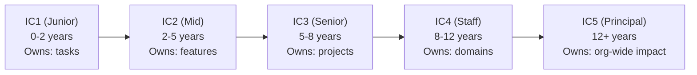
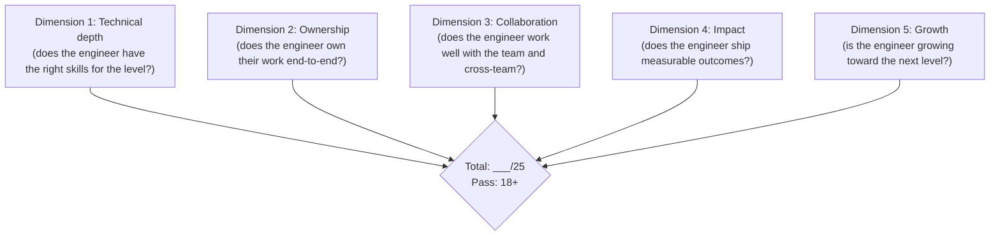
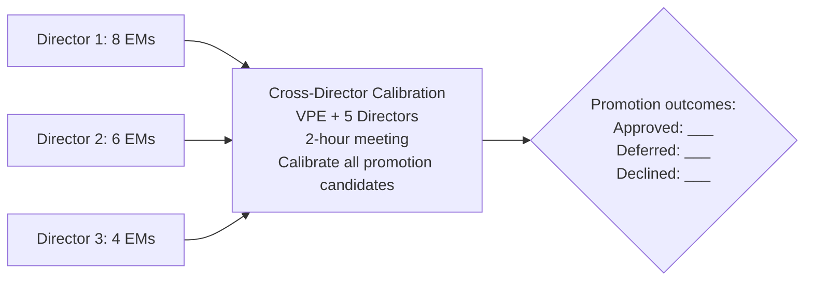
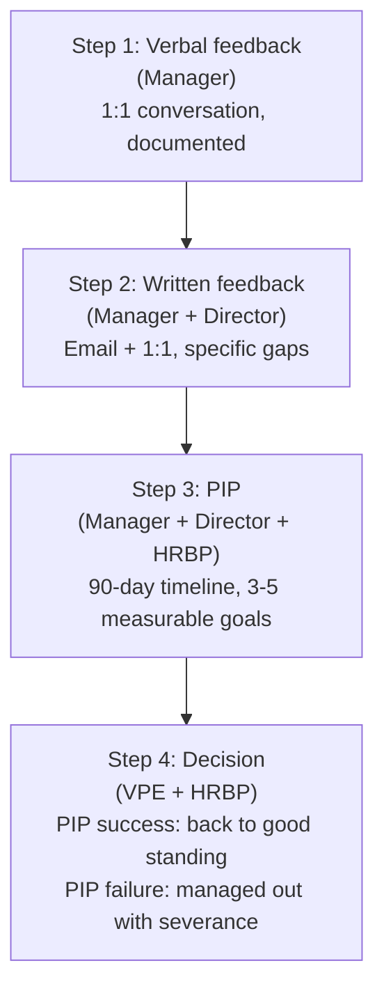

# VP of Engineering Playbook
## Chapter 20

# Performance Management and Career Frames

> *"Performance management is the system that determines who gets promoted, who gets more responsibility, and who gets managed out. The VPE's job is to design the system so that the best people get the most opportunity."*

---

## 1. Epigraph

Performance management is the system that determines who gets promoted, who gets more responsibility, and who gets managed out. The VPE's job is to design the system so that the best people get the most opportunity.

---

## 2. Problem

You are the VPE at a 1,200-person company. The Directors are split. The Director of Platform says: "I have 8 EMs. 2 are strong, 3 are okay, 3 are weak. I want to promote the 2 strong, PIP the 3 weak, leave the 3 okay." The Director of Product says: "I have 6 EMs. They are all okay. No promotions, no PIPs." The Director of AI says: "I have 4 EMs. 1 is exceptional, 3 are weak. I want to promote the 1, PIP the 3." The CEO has just told you: "I need the engineering org's performance system in 30 days. I have a board meeting in 60 days. The current system is inconsistent across Directors. I need 1 system."

You have 30 days to produce a 1-page performance framework, a 5-level career ladder, a Director-level perf rubric, a quarterly review process, and a managed-out process. This chapter tells you what each looks like.

**Decision in one sentence:** Engineering performance management at scale is a 4-layer system — Layer 1 (5-level career ladder, public, IC + Manager tracks), Layer 2 (5-dimension perf rubric, per level, 25 points, pass at 18+), Layer 3 (quarterly review cadence, Director-led, VPE-reviewed), Layer 4 (managed-out process, VPE + HRBP-owned, 90-day timeline); the VPE's job is to design the system, run it quarterly, and own the consistency across Directors.

---

## 3. Why VPEs Fail Here

Five named failure modes of VPEs whose performance system produced zero results.

- **The Inconsistent-Rubric Failure.** The VPE lets each Director use a different perf rubric. Some Directors are lenient, some are strict. Promotions are inconsistent. The org sees favoritism. The VPE has not built the org-wide rubric.
- **The Promotion-Inflation Failure.** The VPE approves every promotion. The IC levels are inflated. Senior engineers at peer companies are at IC4; acme-corp's are at IC3 (because IC4 doesn't mean IC4). The VPE has not calibrated the ladder.
- **The PIP-Avoidance Failure.** The VPE never PIPs. The weak engineers stay. The strong engineers leave (because the weak engineers get the same rewards). The org's quality drops. The VPE has not built the managed-out process.
- **The Calibration-Free Failure.** The VPE approves promotions without calibration. Each Director nominates 1-2 engineers; they all get promoted. The Directors compete to get their engineers promoted. The VPE has not built the cross-Director calibration.
- **The Quarterly-Theater Failure.** The VPE runs quarterly reviews, but the reviews are form-fills. The Directors write 3 sentences per engineer. The reviews are not used for promotion, PIP, or comp decisions. The VPE has not made the reviews consequential.

---

## 4. Mental Models

Four mental models that compress performance management at scale.

**Mental model 1: The 5-Level IC Career Ladder.** Every engineering org has a 5-level IC ladder. The ladder is public.



**The 5 levels:**

- **IC1 (Junior).** 0-2 years experience. Owns: tasks. Example: implements a feature with supervision.
- **IC2 (Mid).** 2-5 years. Owns: features. Example: ships a feature end-to-end with minimal supervision.
- **IC3 (Senior).** 5-8 years. Owns: projects. Example: leads a 3-month project, makes design decisions, mentors IC2s.
- **IC4 (Staff).** 8-12 years. Owns: domains. Example: owns the auth domain, sets technical direction, mentors IC3s.
- **IC5 (Principal).** 12+ years. Owns: org-wide impact. Example: sets the technical strategy for 3+ domains, influences company-wide.

**Mental model 2: The 5-Dimension Performance Rubric.** Every level has a 5-dimension perf rubric.



**The 5 dimensions:**

- **Dimension 1: Technical depth.** Does the engineer have the right skills for the level? 1 = below level. 3 = at level. 5 = above level (ready for promotion).
- **Dimension 2: Ownership.** Does the engineer own their work end-to-end? 1 = needs supervision. 3 = owns the work. 5 = owns the work and the team/area around it.
- **Dimension 3: Collaboration.** Does the engineer work well with the team and cross-team? 1 = friction. 3 = collaborative. 5 = sets the standard.
- **Dimension 4: Impact.** Does the engineer ship measurable outcomes? 1 = low impact. 3 = expected impact. 5 = exceptional impact.
- **Dimension 5: Growth.** Is the engineer growing toward the next level? 1 = static. 3 = growing. 5 = growing fast (ready for promotion).

**The decision rule:**
- Total ≥ 18, all dimensions ≥ 3: Meets expectations
- Total ≥ 22, ≥ 3 dimensions at 4+: Exceeds expectations (promotion candidate)
- Total ≤ 12, ≥ 2 dimensions at 1: Below expectations (PIP candidate)

**Mental model 3: The Cross-Director Calibration.** Promotions are org-wide decisions, not Director-level decisions.



**The 4-step calibration:**
- **Step 1: Director pre-cal.** Each Director scores their engineers, ranks the top 3 promotion candidates, brings to VPE.
- **Step 2: VPE pre-review.** VPE reviews each Director's rankings, looks for inconsistencies.
- **Step 3: Cross-Director calibration.** VPE + 5 Directors meet for 2 hours. Each promotion candidate is discussed. The Directors compare across domains.
- **Step 4: Final decision.** VPE makes the final call. Promotions are org-wide, not Director-wide.

**Mental model 4: The 90-Day Managed-Out Process.** Managed-out is a 4-step process, not a sudden firing.



**The 4 steps:**
- **Step 1: Verbal feedback.** Manager has 1:1 conversation, documents the feedback. The engineer is on notice.
- **Step 2: Written feedback.** Manager + Director send a written feedback email + 1:1. Specific gaps are named.
- **Step 3: PIP.** Manager + Director + HRBP put the engineer on a 90-day PIP with 3-5 measurable goals. The PIP is reviewed at 30, 60, 90 days.
- **Step 4: Decision.** VPE + HRBP make the final call. PIP success = back to good standing. PIP failure = managed out with severance.

---

## 5. Frameworks

Three frameworks for performance management at scale.

### Framework 1: The 5-Level Career Ladder (Public)

```
# Engineering Career Ladder — [Date]

## IC track
### IC1 (Junior)
- Years experience: 0-2
- Owns: tasks
- Impact: 1 quarter
- Promotion criteria: ships 3+ tasks, gets positive feedback
- Comp: $130K base, $230K total

### IC2 (Mid)
- Years experience: 2-5
- Owns: features
- Impact: 1 quarter
- Promotion criteria: ships 2+ features end-to-end, mentors IC1
- Comp: $165K base, $300K total

### IC3 (Senior)
- Years experience: 5-8
- Owns: projects
- Impact: 2-3 quarters
- Promotion criteria: leads 1+ project, mentors IC2
- Comp: $205K base, $400K total

### IC4 (Staff)
- Years experience: 8-12
- Owns: domains
- Impact: 1-2 years
- Promotion criteria: owns 1+ domain, sets technical direction, mentors IC3
- Comp: $255K base, $550K total

### IC5 (Principal)
- Years experience: 12+
- Owns: org-wide impact
- Impact: 2+ years
- Promotion criteria: sets strategy for 3+ domains, influences company-wide, mentors IC4
- Comp: $310K base, $750K total

## Manager track (parallel)
### EM (Engineering Manager)
- Years experience: 5-10
- Owns: team (5-8 ICs)
- Impact: 1 year
- Comp: $225K base, $450K total

### Director
- Years experience: 8-15
- Owns: domain (4-7 EMs, 30-50 ICs)
- Impact: 2+ years
- Comp: $290K base, $650K total

### VP
- Years experience: 12-20
- Owns: org (4-5 Directors, 200-500 ICs)
- Impact: 3+ years
- Comp: $350K base, $850K total
```

### Framework 2: The Quarterly Review Process

```
# Quarterly Engineering Review — [Date]

## Pre-review (week 1)
- Each Director scores their EMs and ICs (5 dimensions, 25 points)
- Each Director ranks the top 3 promotion candidates
- Each Director identifies the bottom 2-3 (PIP candidates)
- Each Director sends scores + rankings to VPE

## VPE pre-review (week 2)
- VPE reviews each Director's scores
- VPE looks for inconsistencies across Directors
- VPE flags the promotion candidates for cross-Director calibration
- VPE flags the PIP candidates for HRBP review

## Cross-Director calibration (week 2, 2-hour meeting)
- VPE + 5 Directors
- Each promotion candidate is discussed (15 min per candidate)
- Directors compare across domains
- Final decision: approved / deferred / declined

## Director 1:1s (week 3-4)
- Each Director has 1:1s with their EMs and ICs
- 30-min 1:1 per person
- Share the score + the rationale
- Discuss promotion / PIP / comp decisions
- Set the next quarter's goals

## Comp adjustments (week 4)
- VPE approves comp adjustments
- HRBP processes comp changes
- Effective at start of next quarter
```

### Framework 3: The Managed-Out Process (90 days)

```
# Managed-Out Process — [Engineer Name] — [Date]

## Step 1: Verbal feedback (week 0)
- Manager has 1:1 with engineer
- Documents: specific gaps, expectations, timeline
- Manager files the feedback in HR system

## Step 2: Written feedback (week 1)
- Manager + Director send written feedback
- 1:1 with engineer
- Specific gaps named (5 dimensions, 25 points)
- Email to engineer with the gaps + the 30-day check-in date

## Step 3: PIP (week 2-12, 90 days)
- Manager + Director + HRBP draft the PIP
- 3-5 measurable goals
- 30-day check-in
- 60-day check-in
- 90-day final review

## Step 4: Decision (week 12)
- VPE + HRBP review the PIP outcome
- PIP success: back to good standing, 30/60/90 in PIP-tracking
- PIP failure: managed out with severance (typically 2-4 weeks)

## The cost of managed-out
- Severance: 2-4 weeks of loaded cost (~$30K)
- HRBP time: 20 hours
- Manager + Director time: 30 hours
- Knowledge transfer: 2-4 weeks of team disruption
- Total cost: ~$100K per managed-out
```

---

## 6. Drill

You are the VPE at **acme-corp**. The CEO has given you 30 days to produce the engineering performance system. The inputs:

```
- 250 engineers, 5 Directors, 25 EMs
- Current state: inconsistent rubrics, promotion inflation,
  PIP avoidance, calibration-free, quarterly theater
- Targets: 1 org-wide rubric, calibrated promotions,
  consistent PIPs, consequential reviews
```

You have **90 minutes**. Produce the **performance system plan** (`portfolio/chapter-20-performance-system.md`) using Framework 1 (Career Ladder) + Framework 2 (Quarterly Review) + Framework 3 (Managed-Out Process). Specify:

- The 5-level IC ladder (IC1-IC5) with promotion criteria and comp.
- The 5-dimension perf rubric with the decision rule.
- The quarterly review process (4 weeks, all steps).
- The cross-Director calibration (2-hour meeting, sample agenda).
- The 90-day managed-out process (4 steps, all details).
- The 1 thing you'll say to the CEO about the performance system.

**Deliverable:** `portfolio/chapter-20-performance-system.md` — under 1500 words.

---

## 7. Worked Example

**The 5-level IC ladder (condensed):**

```
# Engineering Career Ladder — Q3 2026

## IC track
| Level | Years | Owns | Impact | Promotion criteria | Total comp |
|-------|-------|------|--------|--------------------|------------|
| IC1 | 0-2 | tasks | 1 quarter | 3+ tasks shipped, positive feedback | $230K |
| IC2 | 2-5 | features | 1 quarter | 2+ features end-to-end, mentors IC1 | $300K |
| IC3 | 5-8 | projects | 2-3 quarters | leads 1+ project, mentors IC2 | $400K |
| IC4 | 8-12 | domains | 1-2 years | owns 1+ domain, sets direction, mentors IC3 | $550K |
| IC5 | 12+ | org-wide | 2+ years | strategy for 3+ domains, mentors IC4 | $750K |

## Manager track
| Level | Owns | Impact | Total comp |
|-------|------|--------|------------|
| EM | team (5-8 ICs) | 1 year | $450K |
| Director | domain (4-7 EMs) | 2+ years | $650K |
| VP | org (4-5 Directors) | 3+ years | $850K |
```

**The 5-dimension perf rubric:**

```
# 5-Dimension Performance Rubric — [Level] — [Date]

## Engineer: [Name]
## Director: [Director]
## Period: Q[N] [YEAR]

## Scores
| Dimension | 1 (Below) | 3 (Meets) | 5 (Exceeds) | Score |
|-----------|-----------|-----------|-------------|-------|
| 1. Technical depth | Below level | At level | Above level | ___ |
| 2. Ownership | Needs supervision | Owns work | Owns work + area | ___ |
| 3. Collaboration | Friction | Collaborative | Sets standard | ___ |
| 4. Impact | Low impact | Expected impact | Exceptional impact | ___ |
| 5. Growth | Static | Growing | Growing fast | ___ |

Total: ___/25

## Decision
- Total ≥ 18, all ≥ 3: Meets expectations
- Total ≥ 22, ≥ 3 at 4+: Exceeds (promotion candidate)
- Total ≤ 12, ≥ 2 at 1: Below (PIP candidate)

## Promotion recommendation
[ ] Promote to [next level]
[ ] Promote with comp adjustment
[ ] Stay at current level
[ ] PIP (with 3-5 measurable goals)
[ ] Managed-out
```

**The quarterly review process (4 weeks):**

```
# Quarterly Engineering Review — Q3 2026

## Week 1: Pre-review (Oct 1-7)
- Each Director scores their EMs and ICs (5 dimensions, 25 points)
- 5 Directors × 50 reports = 250 score sheets
- Each Director ranks top 3 promotion candidates
- Each Director identifies bottom 2-3 (PIP candidates)
- VPE receives scores + rankings by Oct 7

## Week 2: VPE pre-review (Oct 8-14)
- VPE reviews 250 score sheets (~1 minute each = 4 hours)
- VPE looks for inconsistencies (one Director scoring all 3s,
  another scoring all 5s)
- VPE flags 8 promotion candidates for cross-Director calibration
- VPE flags 5 PIP candidates for HRBP review

## Week 2 (continued): Cross-Director calibration (Oct 14, 2pm-4pm)
Attendees: VPE + 5 Directors
Agenda:
  0-15 min: VPE opening (calibration purpose, decision rule)
  15-75 min: 8 promotion candidates (15 min each)
  75-90 min: 5 PIP candidates (3 min each)
  90-120 min: VPE summary (approved / deferred / declined)

Decisions:
  Promotions approved: 5
  Promotions deferred: 2
  Promotions declined: 1
  PIPs approved: 3
  PIPs declined: 2 (1 was below 1 year tenure, 1 was
    performance issue but new manager)

## Week 3-4: Director 1:1s (Oct 15-31)
- Each Director has 1:1s with their EMs and ICs
- 30-min 1:1 per person
- Share the score + the rationale
- Discuss promotion / PIP / comp decisions
- Set the next quarter's goals

## Week 4: Comp adjustments (Oct 28-31)
- VPE approves comp adjustments
- HRBP processes comp changes
- Effective Nov 1 (start of Q4 2026)
```

**The cross-Director calibration (2-hour meeting, sample):**

```
# Cross-Director Calibration — Q3 2026

## Attendees: VPE + 5 Directors
## Date: 2026-10-14, 2pm-4pm

## Promotion candidates
1. IC3 from Platform (Director 1's nomination) — 24/25
   - "Outstanding mentor; ships ahead of schedule; sets the
     technical bar for the auth team"
   - Discussion: 5 min. Decision: promote to IC4. Approved.
2. IC3 from Product (Director 2's nomination) — 23/25
   - "Strong ownership; ships complex features; growing into
     project leadership"
   - Discussion: 5 min. Decision: promote to IC4. Approved.
3. IC3 from AI (Director 3's nomination) — 25/25
   - "Exceptional impact; led the v1 launch; sets the ML
     bar for the team"
   - Discussion: 5 min. Decision: promote to IC4. Approved.
4. IC2 from Product (Director 2's nomination) — 22/25
   - "Strong IC2; growing fast; needs more time at IC2
     before IC3"
   - Discussion: 5 min. Decision: defer to Q2 2027. Deferred.
5. IC3 from AI (Director 3's nomination) — 23/25
   - "Strong technical depth; collaboration could improve"
   - Discussion: 5 min. Decision: promote to IC4. Approved.
6. IC3 from Data (Director 4's nomination) — 22/25
   - "Solid IC3; not promotion-ready yet"
   - Discussion: 5 min. Decision: defer to Q1 2027. Deferred.
7. IC3 from EngOps (Director 5's nomination) — 24/25
   - "Strong ownership of the EngOps function; growing into
     a leadership role"
   - Discussion: 5 min. Decision: promote to IC4. Approved.
8. IC3 from Product (Director 2's nomination) — 21/25
   - "Below the bar; not promotion-ready"
   - Discussion: 5 min. Decision: declined. Stay at IC3.

## PIP candidates
1. IC3 from Platform (Director 1's nomination) — 11/25
   - "Collaboration issues; missed 3 deadlines; impact below
     bar"
   - Decision: PIP with 3 goals (collaboration, on-time
     delivery, code review turnaround). 90-day timeline.
2. IC2 from Product (Director 2's nomination) — 10/25
   - "Ownership gaps; needs supervision; impact below bar"
   - Decision: PIP with 3 goals. 90-day timeline.
3. IC4 from AI (Director 3's nomination) — 12/25
   - "Ownership issues; collaboration friction"
   - Decision: PIP with 3 goals. 90-day timeline.

## Final decisions
Promotions approved: 5 (IC3 → IC4)
Promotions deferred: 2
Promotions declined: 1
PIPs approved: 3
PIPs declined: 2
```

**The 90-day managed-out process (concrete example):**

```
# Managed-Out Process — [Engineer Name] — 2026-09-01

## Step 1: Verbal feedback (2026-09-01, 1:1)
Manager: [Manager Name]
Engineer: [Engineer Name]
Director: [Director Name]

Feedback: "Your collaboration has been below the bar for
the past 2 quarters. You've missed 3 deadlines, and the
team has raised concerns. This is a verbal feedback to
document the issue and the expectation that it improves.
We'll re-evaluate in 30 days."

Documented in HR system: 2026-09-01

## Step 2: Written feedback (2026-09-08, email + 1:1)
From: [Manager Name] + [Director Name]
To: [Engineer Name]
CC: HRBP

Subject: Performance feedback — 30-day check-in

[Engineer Name],

Following our 1:1 on 2026-09-01, this email documents the
specific gaps and the 30-day check-in date.

## Scores (Q2 2026)
- Technical depth: 3/5
- Ownership: 2/5
- Collaboration: 1/5
- Impact: 2/5
- Growth: 2/5
- Total: 10/25 (Below expectations)

## Specific gaps
- Missed 3 deadlines in Q2 (Q2 4, Q2 6, Q2 8)
- 2 escalation emails from peers about collaboration
- 1 code review delayed by 5 days
- 1 incident postmortem feedback about ownership

## 30-day check-in
Date: 2026-10-08
Manager: [Manager Name]
Agenda: review of Q3 progress, decision on next step
(out of PIP, continued feedback, or formal PIP)

## Step 3: PIP (if 30-day check-in fails)
Date: 2026-10-08 to 2027-01-06 (90 days)
Manager: [Manager Name]
Director: [Director Name]
HRBP: [HRBP Name]

Goals (3-5 measurable):
1. Ship all Q3 commitments on time
2. Resolve 2 collaboration issues (named in PIP doc)
3. Reduce code review turnaround to <2 days
4. Lead 1 cross-team initiative (named in PIP doc)

30-day check-in: 2026-11-07
60-day check-in: 2026-12-07
90-day check-in: 2027-01-06

## Step 4: Decision (2027-01-06)
VPE + HRBP review.

Outcomes:
- PIP success: back to good standing, 30/60/90 in PIP-tracking
- PIP failure: managed out with severance (2-4 weeks, ~$30K)
```

**The 1 thing I'll say to the CEO about the performance system:**

```
"We have an engineering performance system. The headline:

  Ladder: 5-level IC track (IC1-IC5) + 3-level manager track
  Rubric: 5-dimension, 25 points, pass at 18+
  Cadence: quarterly reviews, 4-week process
  Calibration: cross-Director, 2-hour meeting per quarter
  Managed-out: 90-day process, 4 steps

The system is consistent across 5 Directors. Promotions are
calibrated. PIPs are decided org-wide. The rubric is public.

Q3 2026 results:
  Promotions approved: 5
  Promotions deferred: 2
  PIPs approved: 3

The 5 promoted engineers are the strongest 5 in the org, not
just the strongest in their Director's domain. That's the
calibration. The 3 PIPs are clear, documented, and tracked.

The system is consequential. The reviews are used. The
calibration is real."
```

---

## 8. Failure Mode Postmortem

A VPE at a 1,800-person company inherited a performance system that was inconsistent across 6 Directors. Some Directors were lenient (everyone got a 4 or 5). Some were strict (most got a 3 or 2). The promotions were inflated: the company had 30% of engineers at IC4 (vs 10% at peer companies). The PIPs were avoided: 0 PIPs in 18 months. The attrition was 18% (vs 12% target).

Within 24 months: 50% of the strongest engineers had left (because the weak engineers got the same rewards). The VPE was asked to leave. The CEO told the replacement VPE: "I want 1 system, not 6."

The replacement VPE did 3 things:
1. Built the 5-level IC ladder and made it public.
2. Built the 5-dimension perf rubric and made it consistent across all 6 Directors.
3. Built the cross-Director calibration (2-hour meeting, every quarter).

Within 12 months: 5 promotions (vs 30 before), 4 PIPs (vs 0 before), 12-month retention of promoted engineers at 100%, attrition dropped from 18% to 12%.

What the first VPE missed: the performance system is the VPE's tool for shaping the org. The first VPE let each Director run their own system. The second VPE ran 1 system across 6 Directors.

The lesson: the VPE who owns the performance system owns the org shape. The VPE who delegates it delegates the org shape.

---

## 9. Self-Assessment Rubric

| # | Dimension | 1 (Novice) | 3 (Competent) | 5 (Expert) |
|---|---|---|---|---|
| 1 | **5-level career ladder** | No ladder or ladder is ad-hoc | Ladder exists, partially public | Ladder public, IC + Manager tracks, comp per level |
| 2 | **5-dimension perf rubric** | No rubric or ad-hoc | Rubric exists, inconsistent | Rubric consistent across Directors, decision rule applied |
| 3 | **Cross-Director calibration** | No calibration | Calibration exists, ad-hoc | Calibration is a 2-hour quarterly meeting, decisions documented |
| 4 | **Quarterly review cadence** | No reviews or annual | Quarterly reviews exist | Quarterly reviews are consequential (used for promotion, PIP, comp) |
| 5 | **Managed-out process** | No process or sudden firing | Process exists, partial | 90-day process, 4 steps, HRBP-owned, consistent across Directors |

**Disqualifier:** any 1 on dimension 2 or 5. A VPE without a consistent rubric or a managed-out process is in the Inconsistent-Rubric or PIP-Avoidance failure mode.

**Total:** ___ / 25. **Pass threshold:** 18/25, no dimension below 3.

---

## 10. Portfolio Artifact Note

Save your filled-in drill as `portfolio/chapter-20-performance-system.md` — interview evidence for "How do you design the engineering performance system?" (see Portfolio Map in Chapter 27).

---

## 11. Interview Questions

1. **Walk me through your engineering performance system.**
2. **Your Directors have inconsistent rubrics. What do you do?**
3. **A Director wants to promote 5 engineers in a quarter. What do you say?**
4. **An engineer has been weak for 2 quarters. What do you do?**
5. **Walk me through a managed-out decision you've made.**