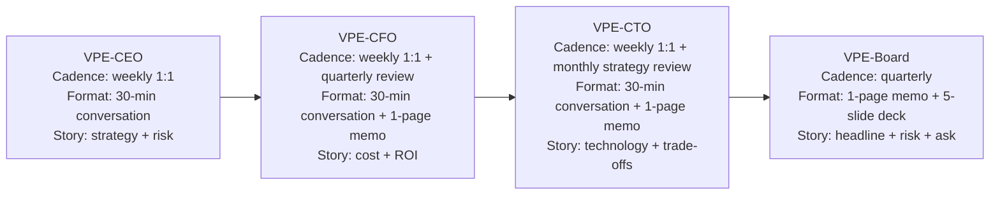
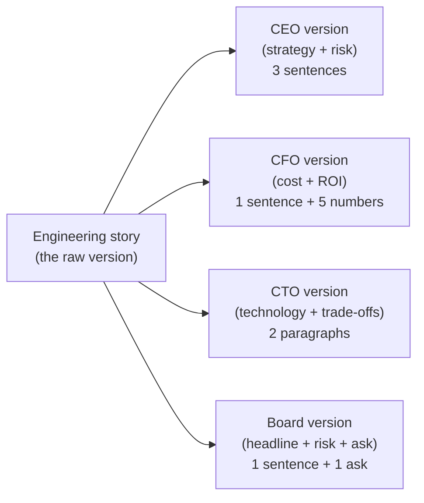
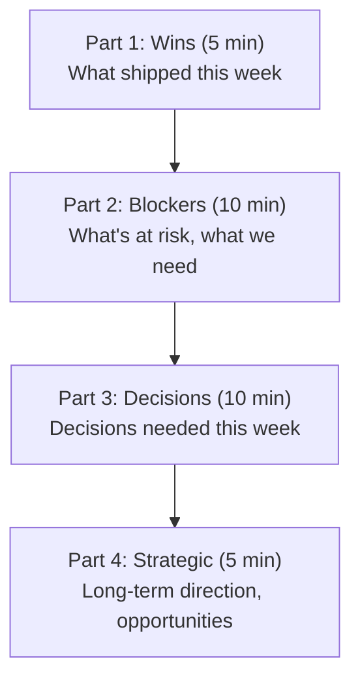
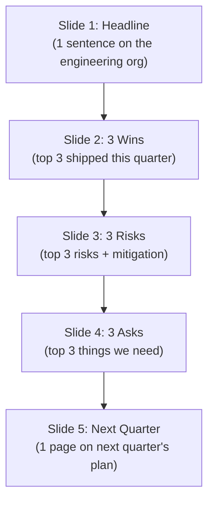

# VP of Engineering Playbook
## Chapter 21

# Influencing at the C-Suite

> *"The VPE is the last technical person in the room. The VPE's job is to make the technical story land with the CEO, the CFO, the CTO, and the board."*

---

## 1. Epigraph

The VPE is the last technical person in the room. The VPE's job is to make the technical story land with the CEO, the CFO, the CTO, and the board.

---

## 2. Problem

You are the VPE at a 1,200-person company. The CEO has just told you: "You have 4 relationships that matter: me, the CFO, the CTO, and the board. Each one is a different audience. Each one needs a different version of the engineering story. The CEO needs the strategy + risk story. The CFO needs the cost + ROI story. The CTO needs the technology + trade-offs story. The board needs the headline + risk + ask story. The board meeting is in 60 days. The CFO is asking hard questions about the engineering budget. The CTO and I have a tension about the AI strategy. You need to design the 4 relationships in 30 days."

You have 30 days to design the VPE-CEO, VPE-CFO, VPE-CTO, and VPE-Board relationships. This chapter tells you what each looks like.

**Decision in one sentence:** C-suite influence at the VPE level is a 4-relationship system — VPE-CEO (strategy + risk), VPE-CFO (cost + ROI), VPE-CTO (technology + trade-offs), VPE-Board (headline + ask) — each with a cadence, a format, and a narrative template; the VPE's job is to design the 4 relationships, run them on cadence, and own the consistency of the engineering story across all 4.

---

## 3. Why VPEs Fail Here

Five named failure modes of VPEs whose C-suite influence produced zero results.

- **The Single-Relationship Failure.** The VPE only talks to the CEO. The CEO is the gatekeeper for everything. The VPE has no relationship with the CFO, the CTO, or the board. The CEO is the bottleneck. The VPE has not built the 4 relationships.
- **The Engineering-Jargon Failure.** The VPE talks to the CEO in engineering jargon ("we need to refactor the auth service to support OAuth 2.1"). The CEO doesn't understand. The CEO is frustrated. The VPE has not translated the story.
- **The Cost-Without-ROI Failure.** The VPE goes to the CFO with a budget ask but no ROI. The CFO says no. The VPE is frustrated. The VPE has not built the cost-ROI story.
- **The Board-Detail-Trap.** The VPE presents to the board in 30 slides. The board reads 3. The board approves the wrong 3. The VPE has not built the 1-page board format.
- **The CTO-Rivalry Failure.** The VPE and CTO are rivals. The CTO is technical, the VPE is technical. They compete for technical authority. The CEO is in the middle. The VPE has not designed the VPE-CTO partnership.

---

## 4. Mental Models

Four mental models that compress C-suite influence.

**Mental model 1: The 4-Relationship System.** The VPE has 4 C-suite relationships, not 1.



**The 4 relationships:**

- **VPE-CEO.** Cadence: weekly 1:1 (60 min). Format: conversation. Story: strategy + risk. Output: aligned on the next quarter's strategy and the 3 risks.
- **VPE-CFO.** Cadence: weekly 1:1 (30 min) + quarterly review. Format: conversation + 1-page memo. Story: cost + ROI. Output: aligned on the engineering budget and the ROI of each major investment.
- **VPE-CTO.** Cadence: weekly 1:1 (30 min) + monthly strategy review. Format: conversation + 1-page memo. Story: technology + trade-offs. Output: aligned on the technical direction and the trade-offs.
- **VPE-Board.** Cadence: quarterly. Format: 1-page memo + 5-slide deck. Story: headline + risk + ask. Output: aligned on the engineering narrative and the next ask.

**Mental model 2: The Narrative Translation Framework.** The same engineering story has 4 versions, one per audience.



**The 4 translations:**

- **CEO version.** 3 sentences. What we did. What we're doing. What's the risk. (e.g., "We shipped 5 features on time. We're shipping 4 more next quarter. The risk is the auth team capacity.")
- **CFO version.** 1 sentence + 5 numbers. What we did. With what cost. With what ROI. (e.g., "We shipped 5 features for $2M. The revenue impact is $4M in Q4. Net ROI 100%.")
- **CTO version.** 2 paragraphs. What we did technically. What trade-offs we made. What we recommend next.
- **Board version.** 1 sentence + 1 ask. Headline. Risk. Ask. (e.g., "We shipped 5 features on time. The risk is the AI platform team ramp. The ask is $1M to accelerate the AI platform.")

**Mental model 3: The C-Suite 1:1 Agenda (30 min, weekly).** Every C-suite 1:1 has the same 4-part agenda.



**The 4 parts:**
- **Part 1: Wins (5 min).** What shipped this week.
- **Part 2: Blockers (10 min).** What's at risk, what we need.
- **Part 3: Decisions (10 min).** Decisions needed this week.
- **Part 4: Strategic (5 min).** Long-term direction, opportunities.

**Mental model 4: The Board 5-Slide Deck.** The board deck is 5 slides, not 30.



**The 5 slides:**

- **Slide 1: Headline.** 1 sentence on the engineering org. (e.g., "The engineering org is on track to ship $X revenue in Q4.")
- **Slide 2: 3 Wins.** Top 3 shipped this quarter.
- **Slide 3: 3 Risks.** Top 3 risks + mitigation.
- **Slide 4: 3 Asks.** Top 3 things we need.
- **Slide 5: Next Quarter.** 1 page on next quarter's plan.

---

## 5. Frameworks

Three frameworks for C-suite influence at scale.

### Framework 1: The VPE-CEO 1:1 Agenda (Weekly, 60 min)

```
# VPE-CEO 1:1 — [Date]

## Wins this week (10 min)
1. [Win 1] — [measurable outcome]
2. [Win 2]
3. [Win 3]

## Blockers / risks (20 min)
1. [Blocker 1] — owner: ___, ETA: ___, mitigation: ___
2. [Blocker 2] — owner: ___, ETA: ___, mitigation: ___

## Decisions needed (20 min)
1. [Decision 1] — recommendation: ___
2. [Decision 2] — recommendation: ___

## Strategic direction (10 min)
- [Opportunity 1]
- [Opportunity 2]
```

### Framework 2: The 1-Page Quarterly Engineering Memo (CFO + Board)

```
# Engineering Quarterly Memo — Q[N] [YEAR]

## Headline (1 sentence)
[1 sentence on the engineering org's Q[N] performance.]

## 3 wins
1. [Win 1] — [measurable outcome, with $]
2. [Win 2] — [measurable outcome, with $]
3. [Win 3] — [measurable outcome, with $]

## 3 risks + mitigation
1. [Risk 1] — probability: high/med/low, impact: $X, mitigation: ___
2. [Risk 2] — ...
3. [Risk 3] — ...

## 3 asks
1. [Ask 1] — [decision needed + $ amount]
2. [Ask 2] — [decision needed + $ amount]
3. [Ask 3] — [decision needed + $ amount]

## Cost vs. plan
| Category | Plan | Actual | Variance |
|----------|------|--------|----------|
| Headcount | $XM | $XM | $XM |
| Infra | $XM | $XM | $XM |
| Vendors | $XM | $XM | $XM |
| Total | $XM | $XM | $XM |

## ROI on major investments
- [Investment 1] — $X spent — $Y revenue — ROI: ___%
- [Investment 2] — $X spent — $Y revenue — ROI: ___%

## Next quarter (1 page)
[Top 5 commitments, decline list, key risks]
```

### Framework 3: The VPE-CTO Charter

```
# VPE-CTO Partnership Charter — [Date]

## Decision rights
- Engineering delivery: VPE
- Engineering architecture: VPE (with CTO input on tech strategy)
- Engineering budget: VPE
- Technical strategy (e.g., AI/ML, infra): CTO
- Tech hiring: CTO (with VPE input on org shape)
- Tech partnerships: CTO

## Cadence
- Weekly 1:1 (VPE + CTO): Mondays, 30 min
- Monthly strategy review (VPE + CTO + CEO): Last Friday, 90 min
- Quarterly tech review (VPE + CTO + CEO + board): Quarterly, 90 min

## Conflict resolution
- Step 1: VPE + CTO 1:1
- Step 2: 1-page memo to CEO
- Step 3: CEO mediation

## Joint OKRs (Q[N] [YEAR])
1. [Joint OKR 1]
2. [Joint OKR 2]
3. [Joint OKR 3]
```

---

## 6. Drill

You are the VPE at **acme-corp**. The CEO has given you 30 days to design the 4 C-suite relationships. The inputs:

```
- VPE has weekly 1:1 with CEO (60 min) — strong
- VPE has no 1:1 with CFO — ad-hoc, 30 min as needed
- VPE has no 1:1 with CTO — adversarial, 0 min
- VPE has presented to board 3 times — 30-slide decks, mixed feedback
- Engineering budget: $50M / year
- AI platform investment: $5M proposed, not yet approved
```

You have **90 minutes**. Produce the **C-suite influence plan** (`portfolio/chapter-21-c-suite-influence.md`) using Framework 1 (VPE-CEO 1:1 Agenda) + Framework 2 (Quarterly Engineering Memo) + Framework 3 (VPE-CTO Charter). Specify:

- The 4 relationships (CEO, CFO, CTO, Board) with cadence, format, story.
- The VPE-CEO weekly 1:1 agenda (next meeting, sample).
- The VPE-CTO charter (decision rights, cadence, conflict resolution).
- The 1-page quarterly engineering memo (Q3 2026, sample).
- The 5-slide board deck (Q3 2026, sample).
- The 1 thing you'll say to the CEO about the 4 relationships.
- The 3 things you'll do to fix the VPE-CTO relationship.

**Deliverable:** `portfolio/chapter-21-c-suite-influence.md` — under 1500 words.

---

## 7. Worked Example

**The 4 relationships (acme-corp):**

```
# 4 C-Suite Relationships — Q3 2026

## VPE-CEO
- Cadence: weekly 1:1 (Mondays, 60 min) — keep
- Format: conversation + 1-page memo as needed
- Story: strategy + risk
- Strength: strong, working well

## VPE-CFO
- Cadence: weekly 1:1 (Tuesdays, 30 min) — NEW
- Format: conversation + 1-page memo
- Story: cost + ROI
- Strength: needs building (currently ad-hoc)

## VPE-CTO
- Cadence: weekly 1:1 (Wednesdays, 30 min) — NEW
- Format: conversation + 1-page memo
- Story: technology + trade-offs
- Strength: adversarial, needs redesign

## VPE-Board
- Cadence: quarterly board meeting
- Format: 1-page memo + 5-slide deck — REPLACE 30-slide deck
- Story: headline + risk + ask
- Strength: needs simplification
```

**The VPE-CEO weekly 1:1 agenda (next meeting):**

```
# VPE-CEO 1:1 — Monday 2026-09-08, 10am, 60 min

## Wins this week (10 min)
1. Shipped 2 of 3 enterprise auth features on time (SSO + audit log v1)
2. Hired Director, AI Engineering (signed 2026-09-05)
3. AI Platform team kickoff: 5 people assigned

## Blockers / risks (20 min)
1. AI Platform team ramp: 5 people, 3 are new hires (joined in last 30 days)
   - Owner: VPE + Director, AI
   - ETA: full productivity by end of Q4
   - Mitigation: paired with senior ICs for first 60 days
2. Auth team capacity: 1 senior engineer left (resigned 2026-09-01)
   - Owner: VPE + Director, Platform
   - ETA: backfill by Q4 2026
   - Mitigation: re-prioritize Q4 roadmap to 4 features (from 5)

## Decisions needed (20 min)
1. Approve $1.5M Q4 budget for AI feature v1 (LLM API + infra + 1 IC5 hire)
   - Recommendation: approve. $1.5M investment, $4M revenue projected in Q1 2027. ROI 167%.
2. Approve shift of audit log v2 to Q1 2027 (was Q4 2026)
   - Recommendation: approve. Trade-off: defer audit log v2 to free up auth team for AI feature v1.

## Strategic direction (10 min)
- AI feature v1 alpha: ready to demo in 2 weeks. Plan: invite 5 customers, get feedback.
- Enterprise pipeline: 3x forecast. Plan: stand up enterprise sales motion with CMO in Q4.
```

**The VPE-CTO charter:**

```
# VPE-CTO Partnership Charter — Q3 2026

## Decision rights
- Engineering delivery: VPE
- Engineering architecture: VPE (with CTO input on tech strategy)
- Engineering budget: VPE
- Technical strategy (AI/ML, infra): CTO
- Tech hiring: CTO (with VPE input on org shape)
- Tech partnerships: CTO

## Cadence
- Weekly 1:1 (VPE + CTO): Wednesdays, 30 min
- Monthly strategy review (VPE + CTO + CEO): Last Friday, 90 min
- Quarterly tech review (VPE + CTO + CEO + board): Quarterly, 90 min

## Conflict resolution
- Step 1: VPE + CTO 1:1 (resolve in 30 min, no escalation)
- Step 2: 1-page memo to CEO (if Step 1 fails)
- Step 3: CEO mediation (CEO picks, no more discussion)
- Step 4: Public alignment (VPE + CTO support the decision)

## Joint OKRs (Q3 2026)
1. Ship enterprise tier (SSO, audit log, custom roles) on time by Q3 end
   - VPE: delivery, CTO: tech strategy
2. Stand up AI platform team with 5 people
   - VPE: org shape, CTO: tech stack
3. Maintain 95% on-time delivery rate for next quarter commitments
   - VPE: capacity, CTO: prioritization
```

**The 1-page quarterly engineering memo (Q3 2026, sample):**

```
# Engineering Quarterly Memo — Q3 2026

## Headline
We shipped 5 of 6 features on time, hired the Director of AI
Engineering, and stood up the AI Platform team.

## 3 wins
1. Enterprise tier: shipped SSO, audit log v1, custom roles v1
   - Impact: 3x enterprise pipeline in Q3
2. AI Platform team: stood up with 5 people
   - Impact: ready to ship AI feature v1 in Q4
3. Reliability: maintained 99.87% availability
   - Impact: zero customer-facing incidents in Q3

## 3 risks + mitigation
1. Auth team capacity (1 senior engineer left)
   - Probability: high, Impact: $500K revenue at risk
   - Mitigation: re-prioritize Q4 roadmap, defer audit log v2 to Q1 2027
2. AI Platform ramp (5 people, 3 new hires)
   - Probability: medium, Impact: AI feature v1 alpha delayed
   - Mitigation: paired with senior ICs for first 60 days
3. Vendor lock-in (Datadog observability cost growing)
   - Probability: medium, Impact: $1M / year by Q2 2027
   - Mitigation: explore 2 alternatives in Q4 2026

## 3 asks
1. Approve $1.5M Q4 budget for AI feature v1 — Decision needed
2. Approve shift of audit log v2 to Q1 2027 — Decision needed
3. Approve 1 IC5 hire for AI Platform team — Decision needed

## Cost vs. plan
| Category | Plan | Actual | Variance |
|----------|------|--------|----------|
| Headcount | $42M | $41M | -$1M (favorable) |
| Infra | $5M | $5.5M | +$0.5M (Datadog growth) |
| Vendors | $3M | $2.8M | -$0.2M (favorable) |
| Total | $50M | $49.3M | -$0.7M |

## ROI on major investments
- Enterprise tier: $5M spent (Q1-Q3 2026) — $8M pipeline — ROI 60% (Q4 close)
- AI Platform: $2M spent (Q3 2026) — $4M revenue projected (Q1 2027) — ROI 100% (projected)

## Next quarter (Q4 2026)
- 5 commitments (in priority order):
  1. Ship AI feature v1 alpha (5 customers)
  2. Ship enterprise tier GA (audit log v2 deferred)
  3. Maintain 99.9% availability
  4. Hire 2 more Directors (Data, EngOps)
  5. Improve DORA 4-metric by 20%
```

**The 5-slide board deck (Q3 2026, sample):**

```
# Board Deck — Q3 2026 Engineering Update

## Slide 1: Headline
"We shipped 5 of 6 features on time, hired the Director of
AI Engineering, and stood up the AI Platform team."

## Slide 2: 3 Wins
1. Enterprise tier (SSO, audit log, custom roles) — 3x pipeline
2. AI Platform team — 5 people, ready to ship AI v1 in Q4
3. Reliability — 99.87% availability, zero customer incidents

## Slide 3: 3 Risks
1. Auth team capacity (1 senior engineer left)
   Mitigation: re-prioritize Q4, defer audit log v2
2. AI Platform ramp (3 of 5 are new hires)
   Mitigation: paired with senior ICs, 60-day ramp
3. Vendor lock-in (Datadog cost growing)
   Mitigation: explore 2 alternatives in Q4

## Slide 4: 3 Asks
1. $1.5M Q4 budget for AI feature v1
2. Shift of audit log v2 to Q1 2027
3. 1 IC5 hire for AI Platform team

## Slide 5: Next Quarter (Q4 2026)
- 5 commitments (priority order)
- On-time delivery target: 80%+ (5 of 6 this quarter)
- AI feature v1 alpha with 5 customers
- 2 Director hires
```

**The 1 thing I'll say to the CEO about the 4 relationships:**

```
"I've designed the 4 C-suite relationships. The headline:

  VPE-CEO: weekly 1:1, working well. No change.
  VPE-CFO: NEW weekly 1:1, Tuesdays 30 min.
  VPE-CTO: NEW weekly 1:1, Wednesdays 30 min. Charter signed.
  VPE-Board: 1-page memo + 5-slide deck (was 30 slides).

The CTO relationship is the highest priority. The CTO and
I have been adversarial. The new charter has decision rights,
cadence, and a conflict-resolution protocol. The first 1:1
is Wednesday.

The board format is 1-page memo + 5 slides. The 30-slide
deck is gone. The board reads 5 slides. The next ask is
3 decisions: $1.5M for AI, shift of audit log v2, 1 IC5 hire.

The 4 relationships are designed. The cadence is on the
calendar. The first quarter is in motion."
```

**The 3 things I'll do to fix the VPE-CTO relationship:**

```
1. Sign the VPE-CTO charter within 30 days.
   - Decision rights: explicit (delivery = VPE, tech strategy = CTO)
   - Cadence: weekly 1:1 (Wednesdays, 30 min)
   - Conflict resolution: 4-step protocol
   - Joint OKRs: 3 OKRs (enterprise tier, AI platform, reliability)
   - Owner: VPE + CTO

2. Have a 1:1 within 7 days.
   - The first 1:1 sets the tone for the next 12 months.
   - Agenda: charter, decision rights, joint OKRs, first 90 days.
   - Outcome: charter signed, first 1:1 on the calendar.
   - Owner: VPE

3. Co-present to the board within 90 days.
   - The board should see VPE + CTO aligned.
   - Topic: AI strategy + AI platform team.
   - Format: 5 slides, joint memo.
   - Outcome: board sees a unified engineering + tech story.
   - Owner: VPE + CTO
```

---

## 8. Failure Mode Postmortem

A VPE at a 2,000-person company had a strong relationship with the CEO but no relationship with the CFO, the CTO, or the board. The CEO was the gatekeeper for everything. The CEO was overloaded. The VPE's requests were delayed. The CFO cut the engineering budget by 20% in a surprise Q2 review (because the VPE had not built a cost-ROI story). The CTO and VPE were in conflict over the AI strategy. The board was surprised by the budget cut.

Within 12 months, the VPE was asked to leave. The CEO told the replacement VPE: "I need you to have 4 relationships, not 1. The CFO, the CTO, and the board are not optional."

The replacement VPE did 4 things:
1. Established weekly 1:1 with the CFO (Tuesdays, 30 min) — built the cost-ROI story.
2. Established weekly 1:1 with the CTO (Wednesdays, 30 min) — built the VPE-CTO charter.
3. Built the 1-page quarterly memo + 5-slide board deck — replaced 30-slide deck.
4. Co-presented with the CTO to the board on AI strategy — board saw unified engineering + tech story.

Within 12 months: engineering budget grew 15% (CFO bought the cost-ROI story), CTO and VPE were aligned (joint OKRs), board was confident in the engineering org (5-slide deck, clear narrative).

What the first VPE missed: the VPE is the last technical person in the room. The VPE's job is to make the technical story land with 4 audiences, not 1. The first VPE had 1 audience (CEO). The second VPE had 4.

The lesson: the VPE who has 4 relationships has influence. The VPE who has 1 has a bottleneck.

---

## 9. Self-Assessment Rubric

| # | Dimension | 1 (Novice) | 3 (Competent) | 5 (Expert) |
|---|---|---|---|---|
| 1 | **4-relationship system** | 1 relationship (CEO only) or 0 | 2-3 relationships, ad-hoc | 4 relationships, designed, on cadence |
| 2 | **Narrative translation** | No translation (engineering jargon) | 2-3 translations | 4 translations, each version consistent |
| 3 | **C-suite 1:1 cadence** | No 1:1s or annual | 1:1s exist, irregular | Weekly 1:1s with CEO + CFO + CTO, 4-part agenda |
| 4 | **Board format** | 30-slide deck | 10-slide deck | 1-page memo + 5-slide deck, headline + risk + ask |
| 5 | **VPE-CTO partnership** | Adversarial or absent | Charter exists, not enforced | Charter signed, weekly 1:1, joint OKRs, conflict protocol |

**Disqualifier:** any 1 on dimension 1 or 5. A VPE with only the CEO relationship or with an adversarial CTO is in the Single-Relationship or CTO-Rivalry failure mode.

**Total:** ___ / 25. **Pass threshold:** 18/25, no dimension below 3.

---

## 10. Portfolio Artifact Note

Save your filled-in drill as `portfolio/chapter-21-c-suite-influence.md` — interview evidence for "How do you influence at the C-suite?" (see Portfolio Map in Chapter 27).

---

## 11. Interview Questions

1. **Walk me through your C-suite relationships.**
2. **The CFO cuts your budget by 20%. What do you do?**
3. **The board rejects your AI strategy. What do you do?**
4. **The CTO and you disagree on the technical direction. What do you do?**
5. **Walk me through a board presentation you've given.**