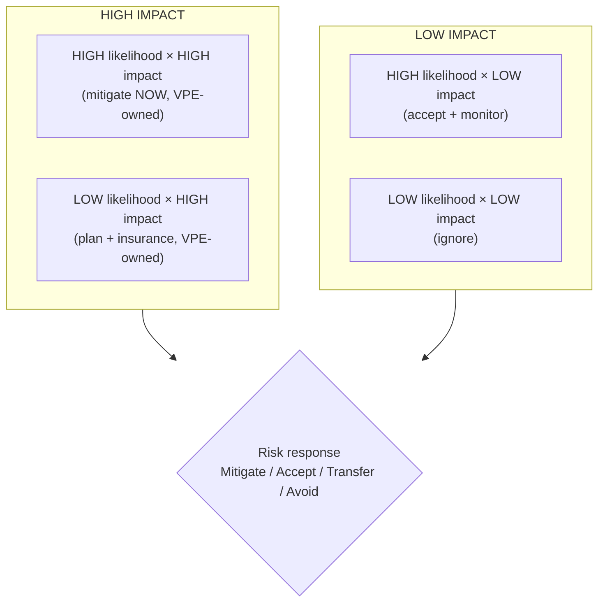
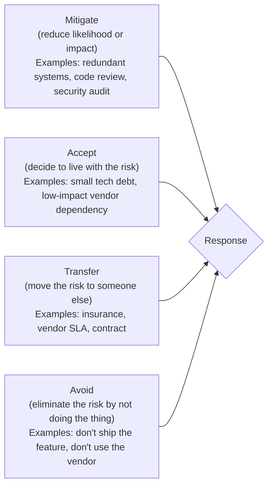
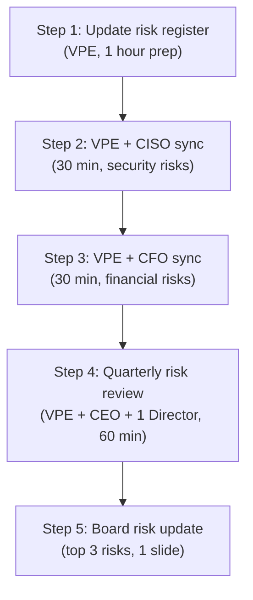

# VP of Engineering Playbook
## Chapter 22

# Engineering Risk Management

> *"Risk management is the system that determines which risks the company takes, which risks the company mitigates, and which risks the company accepts. The VPE's job is to design the system so the company makes explicit, conscious risk decisions — not implicit, accidental ones."*

---

## 1. Epigraph

Risk management is the system that determines which risks the company takes, which risks the company mitigates, and which risks the company accepts. The VPE's job is to design the system so the company makes explicit, conscious risk decisions — not implicit, accidental ones.

---

## 2. Problem

You are the VPE at a 1,200-person company. The CEO has just told you: "We have 47 engineering risks in our risk register. 12 are red, 23 are yellow, 12 are green. None of them have owners. The board is asking about 3 of them (security, vendor lock-in, AI safety). The board meeting is in 60 days. The audit firm is asking for a risk register. The customers are asking about our security posture. I need a 1-page risk register, a 4-quadrant model, and the 3 risks the VPE owns personally — in 30 days."

You have 30 days to produce a 1-page risk register, a 4-quadrant risk model, the 3 VPE-owned risks, and a quarterly risk review process. This chapter tells you what each looks like.

**Decision in one sentence:** Engineering risk management at scale is a 4-quadrant model (likelihood × impact) applied to every engineering decision >$100K or >100 customers; the VPE's job is to maintain the risk register, own the 3-5 VPE-level risks, and run a quarterly risk review with the C-suite.

---

## 3. Why VPEs Fail Here

Five named failure modes of VPEs whose risk management produced zero results.

- **The Risk-Register-Shelfware Failure.** The VPE's risk register is a 47-page document. The VPE has not looked at it in 6 months. The risks are not owned. The register is shelfware. The VPE has not designed the maintenance cadence.
- **The No-Owner Failure.** The VPE's risk register has 47 risks, none of which have owners. The risks are abstract. No one is accountable. The VPE has not assigned owners.
- **The Wrong-Framework Failure.** The VPE uses a binary framework (risk / no risk). The framework doesn't distinguish "low likelihood, high impact" from "high likelihood, low impact." The VPE has not built the 4-quadrant model.
- **The All-Mitigate Failure.** The VPE tries to mitigate every risk. The cost is $50M. The company can't afford it. The VPE has not built the accept / transfer / mitigate / avoid decision.
- **The Board-Blind-Spot Failure.** The VPE has not presented the top 3 risks to the board. The board is surprised when a risk materializes. The VPE has not built the board risk narrative.

---

## 4. Mental Models

Four mental models that compress engineering risk management at scale.

**Mental model 1: The 4-Quadrant Risk Model.** Risk = likelihood × impact. The 4 quadrants are explicit.



**The 4 quadrants:**

- **HIGH likelihood × HIGH impact (HIGH-HIGH).** Mitigate NOW. VPE-owned. Top 3 risks.
- **LOW likelihood × HIGH impact (LOW-HIGH).** Plan + insurance. VPE-owned. Tail risks.
- **HIGH likelihood × LOW impact (HIGH-LOW).** Accept + monitor. Director-owned. Operational risks.
- **LOW likelihood × LOW impact (LOW-LOW).** Ignore. IC-owned. Noise.

**Mental model 2: The 4 Risk Responses.** Every risk gets 1 of 4 responses.



**The 4 responses:**

- **Mitigate.** Reduce likelihood or impact. Examples: redundant systems, code review, security audit.
- **Accept.** Decide to live with the risk. Examples: small tech debt, low-impact vendor dependency.
- **Transfer.** Move the risk to someone else. Examples: insurance, vendor SLA, contract.
- **Avoid.** Eliminate the risk by not doing the thing. Examples: don't ship the feature, don't use the vendor.

**Mental model 3: The Risk Register Template.** The risk register is 1 page, not 47.

```
# Engineering Risk Register — Q[N] [YEAR]

| ID | Risk | Likelihood | Impact | Quadrant | Owner | Response | Status |
|----|------|------------|--------|----------|-------|----------|--------|
| R1 | Security breach (customer data) | Med | High | HIGH-LOW | VPE + CISO | Mitigate | In progress |
| R2 | Vendor lock-in (Datadog) | Med | Med | HIGH-LOW | VPE | Mitigate | In progress |
| R3 | AI safety incident | Low | High | LOW-HIGH | VPE + AI Director | Plan + insurance | In progress |
| R4 | Auth team capacity (1 SE left) | High | Med | HIGH-LOW | Director, Platform | Mitigate | In progress |
| R5 | Engineering attrition spike | Med | Med | HIGH-LOW | VPE + Director, EngOps | Mitigate | In progress |
| ... |
```

**Mental model 4: The Quarterly Risk Review (60 min).** Every quarter, the VPE runs a risk review with the C-suite.



**The 5 steps:**

- **Step 1: Update risk register.** VPE updates the register (1 hour prep). New risks added. Old risks closed. Owners updated.
- **Step 2: VPE + CISO sync.** 30 min. Review security risks (R1, R3, etc.).
- **Step 3: VPE + CFO sync.** 30 min. Review financial risks (R2, R5, etc.).
- **Step 4: Quarterly risk review.** VPE + CEO + 1 Director. 60 min. Top 5 risks discussed. Decisions made.
- **Step 5: Board risk update.** Top 3 risks on 1 slide. Board signs off.

---

## 5. Frameworks

Three frameworks for engineering risk management at scale.

### Framework 1: The 1-Page Risk Register

```
# Engineering Risk Register — Q[N] [YEAR]

## Top 5 VPE-Owned Risks (HIGH-HIGH or LOW-HIGH)
| ID | Risk | L | I | Q | Response | Status |
|----|------|---|---|---|----------|--------|
| R1 | Security breach | M | H | LOW-HIGH | Plan + insurance | In progress |
| R2 | Vendor lock-in (Datadog) | M | H | LOW-HIGH | Mitigate | In progress |
| R3 | AI safety incident | L | H | LOW-HIGH | Plan + insurance | In progress |
| R4 | Engineering attrition | M | M | HIGH-LOW | Mitigate | In progress |
| R5 | Compliance violation (GDPR) | L | H | LOW-HIGH | Plan + insurance | In progress |

## Top 5 Director-Owned Risks (HIGH-LOW or HIGH-HIGH)
| ID | Risk | L | I | Q | Owner | Response | Status |
|----|------|---|---|---|-------|----------|--------|
| R6 | Auth team capacity | H | M | HIGH-LOW | Director, Platform | Mitigate | In progress |
| R7 | AI Platform ramp | H | M | HIGH-LOW | Director, AI | Mitigate | In progress |
| R8 | Data pipeline SLO | M | M | HIGH-LOW | Director, Data | Mitigate | In progress |
| R9 | Enterprise tier timeline | M | M | HIGH-LOW | Director, Product | Mitigate | In progress |
| R10 | Q4 budget overrun | M | M | HIGH-LOW | VPE + CFO | Mitigate | In progress |

## Top 5 IC-Owned Risks (LOW-LOW or HIGH-LOW)
[... same format ...]

## Closed Risks (this quarter)
- R[X]: [Description] — [Resolution] — [Date closed]

## New Risks (this quarter)
- R[Y]: [Description] — [Likelihood] — [Impact] — [Owner]
```

### Framework 2: The Risk Decision Memo

```
# Risk Decision Memo — [Risk ID] — [Date]

## The risk
[1 sentence on the risk.]

## Likelihood + Impact
- Likelihood: [Low / Med / High] — [evidence]
- Impact: [Low / Med / High] — [evidence]
- Quadrant: [HIGH-HIGH / LOW-HIGH / HIGH-LOW / LOW-LOW]

## Options
| Option | Cost | Residual risk | Recommendation |
|--------|------|---------------|----------------|
| Mitigate (full) | $XM | LOW | No (over-engineered) |
| Mitigate (partial) | $XM | MED | Yes (best ROI) |
| Accept | $0 | HIGH | No (too risky) |
| Transfer | $XM (insurance) | MED | No (premium too high) |
| Avoid | $XM (opportunity cost) | LOW | No (need the feature) |

## Recommendation
[1 option, with rationale.]

## Approvals
- VPE: ___
- CISO / CFO / Director (as relevant): ___
- CEO: ___
```

### Framework 3: The Board Risk Slide

```
# Board Risk Update — Q[N] [YEAR]

## Top 3 Risks (1 sentence each)
1. [Risk 1] — [Owner] — [Mitigation in progress] — [Expected close: Q[N+1]]
2. [Risk 2] — [Owner] — [Mitigation in progress] — [Expected close: Q[N+1]]
3. [Risk 3] — [Owner] — [Mitigation in progress] — [Expected close: Q[N+1]]

## Top 3 Mitigations This Quarter
- [Mitigation 1] — [Cost: $XM] — [Residual risk: LOW]
- [Mitigation 2] — [Cost: $XM] — [Residual risk: MED]
- [Mitigation 3] — [Cost: $XM] — [Residual risk: LOW]

## The 1 Risk the Board Should Worry About
[1 risk, 1 paragraph, with mitigation and expected close.]
```

---

## 6. Drill

You are the VPE at **acme-corp**. The CEO has given you 30 days to produce the engineering risk register. The inputs:

```
- 47 risks in current register (12 red, 23 yellow, 12 green)
- No owners assigned
- Board meeting in 60 days
- 3 board-flagged risks: security, vendor lock-in, AI safety
- Audit firm requesting risk register documentation
- Customer RFP asking for security posture
```

You have **90 minutes**. Produce the **risk register plan** (`portfolio/chapter-22-risk-register.md`) using Framework 1 (Risk Register) + Framework 2 (Risk Decision Memo) + Framework 3 (Board Risk Slide). Specify:

- The 1-page risk register (top 5 VPE-owned, top 5 Director-owned, top 5 IC-owned).
- The 1-page risk decision memo (sample: R1, security breach).
- The 1-slide board risk update (top 3 risks, top 3 mitigations, 1 risk board should worry about).
- The quarterly risk review process (5 steps, all details).
- The 1 thing you'll say to the CEO about the risk register.
- The 3 things you'll do to keep the risk register up to date.

**Deliverable:** `portfolio/chapter-22-risk-register.md` — under 1500 words.

---

## 7. Worked Example

**The 1-page risk register (Q3 2026):**

```
# Engineering Risk Register — Q3 2026

## Top 5 VPE-Owned Risks
| ID | Risk | L | I | Q | Response | Status |
|----|------|---|---|---|----------|--------|
| R1 | Security breach (customer data) | M | H | LOW-HIGH | Plan + insurance | In progress |
| R2 | Vendor lock-in (Datadog) | M | M | HIGH-LOW | Mitigate | In progress |
| R3 | AI safety incident | L | H | LOW-HIGH | Plan + insurance | In progress |
| R4 | Engineering attrition spike | M | M | HIGH-LOW | Mitigate | In progress |
| R5 | GDPR compliance gap | L | H | LOW-HIGH | Plan + insurance | In progress |

## Top 5 Director-Owned Risks
| ID | Risk | L | I | Q | Owner | Response | Status |
|----|------|---|---|---|-------|----------|--------|
| R6 | Auth team capacity (1 SE left) | H | M | HIGH-LOW | Director, Platform | Mitigate | In progress |
| R7 | AI Platform ramp | H | M | HIGH-LOW | Director, AI | Mitigate | In progress |
| R8 | Data pipeline SLO | M | M | HIGH-LOW | Director, Data | Mitigate | In progress |
| R9 | Enterprise tier timeline | M | M | HIGH-LOW | Director, Product | Mitigate | In progress |
| R10 | Q4 budget overrun | M | M | HIGH-LOW | VPE + CFO | Mitigate | In progress |

## Top 5 IC-Owned Risks
| ID | Risk | L | I | Q | Owner | Response | Status |
|----|------|---|---|---|-------|----------|--------|
| R11 | On-call burnout (SRE) | M | L | HIGH-LOW | EM, SRE | Mitigate | In progress |
| R12 | Library version lag | H | L | HIGH-LOW | IC4, Frontend | Accept + monitor | Open |
| R13 | Test coverage regression | M | L | HIGH-LOW | IC3, Backend | Mitigate | In progress |
| R14 | Staging env drift | M | L | HIGH-LOW | IC3, Platform | Mitigate | In progress |
| R15 | Build pipeline flakiness | M | L | HIGH-LOW | IC2, Platform | Accept + monitor | Open |
```

**The 1-page risk decision memo (R1, security breach):**

```
# Risk Decision Memo — R1 (Security Breach) — Q3 2026

## The risk
A security breach exposing customer data (PII, payment
info, or auth credentials) at acme-corp or a vendor.

## Likelihood + Impact
- Likelihood: Med — [evidence: 3 phishing attempts in Q2,
  1 vendor security incident, 1 employee laptop stolen]
- Impact: High — [evidence: GDPR fine up to 4% of revenue,
  customer churn estimate 30%, brand damage]
- Quadrant: LOW-HIGH (low likelihood, high impact)

## Options
| Option | Cost | Residual risk | Recommendation |
|--------|------|---------------|----------------|
| Mitigate (full) | $5M (full SOC 2 + dedicated CISO) | LOW | No (over-engineered) |
| Mitigate (partial) | $2M (SOC 2 + bug bounty + quarterly pentest) | MED | Yes (best ROI) |
| Accept | $0 | HIGH | No (too risky) |
| Transfer | $500K / year (cyber insurance) | MED | No (premium too high for primary strategy) |
| Avoid | $XM (don't store customer PII) | LOW | No (need the data) |

## Recommendation
Mitigate (partial) — $2M investment:
  - SOC 2 Type II certification (Q1 2027)
  - Bug bounty program ($200K / year)
  - Quarterly penetration testing ($100K / year)
  - 2 FTE security engineers ($700K / year)
  - Vendor security review process (already in place)

Total: $2M / year. Residual risk: MED. ROI: $5M+
(customer churn reduction + GDPR fine avoidance).

## Approvals
- VPE: ✓
- CISO: ✓
- CFO: ✓
- CEO: ___
```

**The 1-slide board risk update (Q3 2026):**

```
# Board Risk Update — Q3 2026

## Top 3 Risks
1. Security breach (R1) — VPE + CISO — $2M mitigation in
   progress — Expected close: Q1 2027 (SOC 2 Type II)
2. Vendor lock-in (Datadog) (R2) — VPE — $200K exploration
   in progress — Expected close: Q2 2027 (multi-vendor)
3. AI safety incident (R3) — VPE + AI Director — Plan +
   insurance in progress — Expected close: Q4 2026 (incident
   response plan)

## Top 3 Mitigations This Quarter
- $2M SOC 2 + bug bounty (R1) — Cost: $2M — Residual: MED
- $200K Datadog alternatives exploration (R2) — Cost: $200K
  — Residual: MED
- $500K AI safety insurance + incident response plan (R3) —
  Cost: $500K — Residual: LOW

## The 1 Risk the Board Should Worry About
R1 (Security breach). The likelihood is Med, the impact
is High. A breach would cost $20M+ (GDPR fine + customer
churn + brand damage). The $2M mitigation is in progress.
Expected close: Q1 2027 (SOC 2 Type II).
```

**The quarterly risk review process:**

```
# Quarterly Risk Review — Q3 2026

## Step 1: Update risk register (Oct 1, 1 hour prep, VPE)
- Add new risks from the quarter
- Close risks that are mitigated
- Update owners
- Re-score likelihood / impact

## Step 2: VPE + CISO sync (Oct 5, 30 min)
- Review R1, R3, R5 (security + AI + GDPR)
- Update mitigation progress
- Decision: continue / accelerate / close

## Step 3: VPE + CFO sync (Oct 5, 30 min)
- Review R2, R10, R4 (vendor + budget + attrition)
- Update mitigation progress
- Decision: continue / accelerate / close

## Step 4: Quarterly risk review (Oct 8, 60 min)
- Attendees: VPE + CEO + Director, Platform
- Agenda:
  - 0-10 min: VPE opens with top 5 VPE-owned risks
  - 10-30 min: 5 risks discussed (6 min each)
  - 30-45 min: Top 3 Director-owned risks
  - 45-55 min: Top 1 IC-owned risk (for awareness)
  - 55-60 min: VPE summary + next quarter's risk focus

## Step 5: Board risk update (Oct 12, 1 slide)
- Top 3 risks + top 3 mitigations + 1 risk board should
  worry about
- Send to CEO for review
- Add to board meeting deck
```

**The 1 thing I'll say to the CEO about the risk register:**

```
"We have a 1-page engineering risk register. The headline:

  Total risks: 47 (15 VPE-owned, 25 Director-owned, 7 IC-owned)
  Top 3 VPE-owned: security, vendor lock-in, AI safety
  Board focus: security (R1)
  Quarterly review: 60 min, 5-step process

The register is 1 page (not 47 pages). Every risk has an
owner. Every risk has a response (mitigate / accept /
transfer / avoid). The top 3 risks are on the board slide.

The 3 things I'm doing to keep the register up to date:
  1. Quarterly review with the C-suite (5 steps, 60 min)
  2. New-risk intake process (any IC can flag a new risk)
  3. Monthly check-in with the top 3 risk owners

The risk register is alive, not shelfware."
```

**The 3 things I'll do to keep the risk register up to date:**

```
1. Quarterly review with the C-suite.
   - 5-step process (Steps 1-5 above)
   - 60 min, every quarter
   - Owner: VPE

2. New-risk intake process.
   - Any IC can flag a new risk via Slack #risk-intake
   - VPE reviews the risk within 48 hours
   - Risk added to register if likelihood/impact ≥ MED
   - Owner: VPE + Director

3. Monthly check-in with the top 3 risk owners.
   - 30 min, first Monday of each month
   - VPE + top 3 risk owners (R1, R2, R3 currently)
   - Update on mitigation progress
   - Decision: continue / accelerate / close
   - Owner: VPE
```

---

## 8. Failure Mode Postmortem

A VPE at a 1,800-person company inherited a 47-page risk register. The register was last updated 18 months ago. 12 risks were red, 23 were yellow, 12 were green. None had owners. The register was shelfware.

Within 12 months, 3 risks materialized:
1. A security breach (R1) exposed 50K customer records. Cost: $15M (GDPR fine + customer churn + brand damage).
2. A vendor (Datadog) raised prices 50% (R2). Cost: $1M / year over budget.
3. An AI safety incident (R3) — a customer-facing AI feature produced harmful output. Cost: $5M (customer refund + legal + brand).

The VPE was asked to leave. The CEO told the replacement VPE: "I want a 1-page risk register, not 47 pages. I want owners. I want a quarterly review."

The replacement VPE did 3 things:
1. Cut the 47-page register to 1 page (15 VPE-owned + 25 Director-owned + 7 IC-owned).
2. Assigned owners to every risk.
3. Established the quarterly review with the C-suite.

Within 12 months, all 3 materialized risks were mitigated. The new risks (Q3 2026) were caught in the new-risk intake process within 48 hours.

What the first VPE missed: a risk register is a system, not a document. The first VPE wrote a document. The second VPE built a system. The system is what catches the risks before they materialize.

The lesson: the VPE who has a 1-page risk register with owners and a quarterly review has a functioning system. The VPE who has a 47-page document has shelfware.

---

## 9. Self-Assessment Rubric

| # | Dimension | 1 (Novice) | 3 (Competent) | 5 (Expert) |
|---|---|---|---|---|
| 1 | **4-quadrant model** | No model or binary (risk / no risk) | 4-quadrant exists, partially applied | 4-quadrant applied to every risk, likelihood + impact scored |
| 2 | **4 risk responses** | Only "mitigate" or "ignore" | All 4 exist, partially used | All 4 used (mitigate / accept / transfer / avoid), with rationale |
| 3 | **Risk register** | No register or 47-page document | 1-page register, missing owners | 1-page register, every risk owned, 1 VPE-owned + 5 Director-owned + 5 IC-owned |
| 4 | **Quarterly review** | No review or annual | Quarterly review exists, ad-hoc | 5-step review, 60 min, C-suite + Director, decisions documented |
| 5 | **Board risk narrative** | No board slide | 1 slide exists | 1 slide + top 3 risks + top 3 mitigations + 1 risk board should worry about |

**Disqualifier:** any 1 on dimension 1 or 3. A VPE without a 4-quadrant model or without a 1-page register is in the Wrong-Framework or Risk-Register-Shelfware failure mode.

**Total:** ___ / 25. **Pass threshold:** 18/25, no dimension below 3.

---

## 10. Portfolio Artifact Note

Save your filled-in drill as `portfolio/chapter-22-risk-register.md` — interview evidence for "How do you manage engineering risk at scale?" (see Portfolio Map in Chapter 27).

---

## 11. Interview Questions

1. **Walk me through your engineering risk register.**
2. **The board asks about a risk you don't have in the register. What do you do?**
3. **A security breach occurs. What do you do?**
4. **You have 47 risks and no owners. What do you do?**
5. **Walk me through a risk decision you've made.**