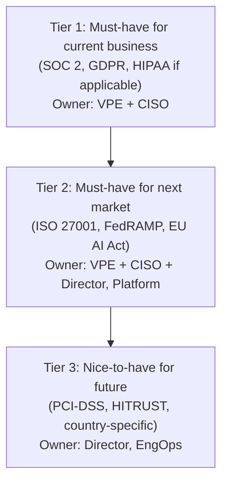
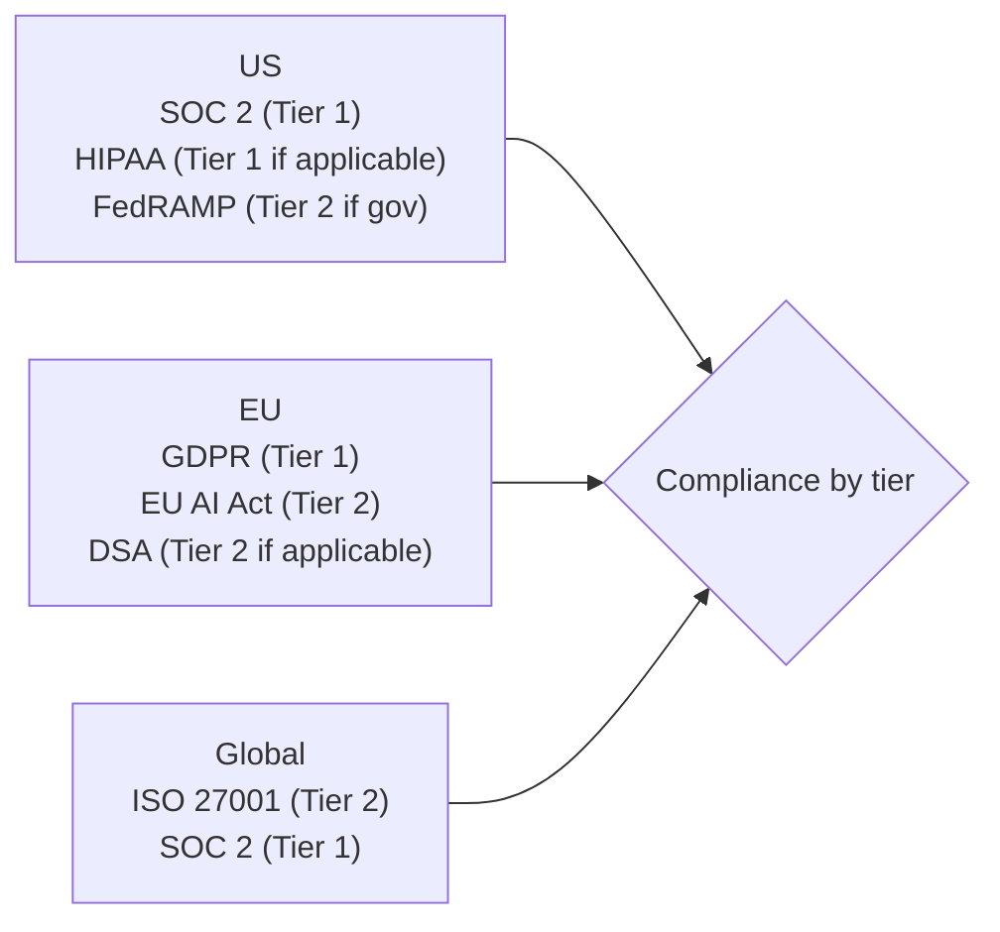
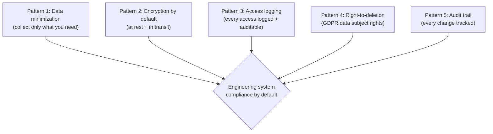
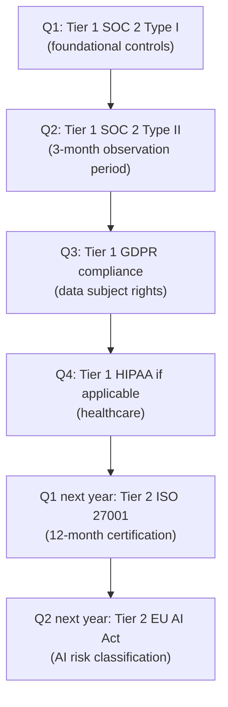

# VP of Engineering Playbook
## Chapter 23

# Regulatory Landscape for Engineering

> *"Regulatory is not a back-office function. Regulatory is the boundary that determines what the company can ship, where, and when. The VPE's job is to know the boundary, design for it, and own the relationships with the regulators."*

---

## 1. Epigraph

Regulatory is not a back-office function. Regulatory is the boundary that determines what the company can ship, where, and when. The VPE's job is to know the boundary, design for it, and own the relationships with the regulators.

---

## 2. Problem

You are the VPE at a 1,200-person company. The CFO has just told you: "We're expanding to the EU in Q1 2027. We have customer data in 27 countries. We're launching an AI feature in Q4 2026. We have a security incident in Q2 2026. The GDPR fine is 4% of revenue. The AI Act is in effect. The board is asking about our regulatory posture. The audit firm is asking for a regulatory map. The customers are asking for SOC 2 + ISO 27001. I need a 1-page regulatory map, a 3-tier compliance model, and a regulatory roadmap in 30 days."

You have 30 days to produce a 1-page regulatory map, a 3-tier compliance model, a regulatory roadmap, and the 1 thing you'll say to the CFO about regulatory. This chapter tells you what each looks like.

**Decision in one sentence:** Engineering regulatory management at scale is a 3-tier compliance model (Tier 1: must-have for current business, Tier 2: must-have for next market, Tier 3: nice-to-have for future) applied to every regulatory question; the VPE's job is to maintain the regulatory map, own the Tier 1 + Tier 2 compliance, and design engineering systems that pass Tier 1 + Tier 2 by default.

---

## 3. Why VPEs Fail Here

Five named failure modes of VPEs whose regulatory management produced zero results.

- **The Back-Office Failure.** The VPE delegates regulatory to legal. Legal doesn't know the engineering systems. The compliance is checked at the end (audit time). The VPE has not designed for compliance.
- **The Compliance-Theater Failure.** The VPE's compliance is "checkbox compliance" — the SOC 2 audit is passed but the security is weak. The customers see through it. The VPE has not built the substance.
- **The Reactive-Only Failure.** The VPE only addresses regulatory when there's a problem (audit, incident, customer RFP). The VPE has not built the proactive compliance system.
- **The One-Region-Only Failure.** The VPE's compliance is US-only. The company expands to EU. The VPE has not built the multi-region compliance.
- **The Engineering-Design-Failure.** The VPE's engineering systems are not designed for compliance. The compliance is bolted on. The VPE has not made compliance a design constraint.

---

## 4. Mental Models

Four mental models that compress regulatory management at scale.

**Mental model 1: The 3-Tier Compliance Model.** Compliance is 3 tiers, not 1.



**The 3 tiers:**

- **Tier 1: Must-have for current business.** SOC 2, GDPR, HIPAA (if applicable). Owner: VPE + CISO. Compliance by Q4 2026.
- **Tier 2: Must-have for next market.** ISO 27001, FedRAMP (if applicable), EU AI Act. Owner: VPE + CISO + Director, Platform. Compliance by Q2 2027.
- **Tier 3: Nice-to-have for future.** PCI-DSS, HITRUST, country-specific. Owner: Director, EngOps. Compliance as needed.

**Mental model 2: The Regulatory Map.** The regulatory map is 1 page, organized by region + sector.



**The 4 regions (with relevant regulations):**

- **US.** SOC 2 (Tier 1), HIPAA (Tier 1 if healthcare), FedRAMP (Tier 2 if gov).
- **EU.** GDPR (Tier 1), EU AI Act (Tier 2), DSA (Tier 2 if applicable).
- **APAC.** Country-specific (Singapore PDPA, Japan APPI, Australia Privacy Act).
- **Global.** ISO 27001 (Tier 2), SOC 2 (Tier 1).

**Mental model 3: The Compliance-by-Default Engineering Pattern.** Compliance is a design constraint, not a bolt-on.



**The 5 patterns:**
- **Data minimization.** Collect only what you need. Easier to delete; easier to comply.
- **Encryption by default.** At rest + in transit. Required for SOC 2, GDPR, ISO 27001.
- **Access logging.** Every access logged + auditable. Required for SOC 2, GDPR, FedRAMP.
- **Right-to-deletion.** GDPR data subject rights. Required for GDPR.
- **Audit trail.** Every change tracked. Required for SOC 2, ISO 27001, FedRAMP.

**Mental model 4: The Regulatory Roadmap.** Regulatory is a 12-18 month roadmap, not a one-time project.



**The 12-18 month roadmap:**
- **Q1 2026:** Tier 1 SOC 2 Type I (foundational controls).
- **Q2 2026:** Tier 1 SOC 2 Type II (3-month observation).
- **Q3 2026:** Tier 1 GDPR compliance (data subject rights).
- **Q4 2026:** Tier 1 HIPAA (if applicable).
- **Q1 2027:** Tier 2 ISO 27001 (12-month certification).
- **Q2 2027:** Tier 2 EU AI Act (AI risk classification).

---

## 5. Frameworks

Three frameworks for regulatory management at scale.

### Framework 1: The 1-Page Regulatory Map

```
# Regulatory Map — [Date]

## Tier 1: Must-have for current business
| Region | Regulation | Owner | Status | Target |
|--------|------------|-------|--------|--------|
| US | SOC 2 Type II | VPE + CISO | In progress | Q2 2026 |
| EU | GDPR | VPE + CISO | In progress | Q3 2026 |
| US | HIPAA (if healthcare) | VPE + CISO | Open | Q4 2026 |

## Tier 2: Must-have for next market
| Region | Regulation | Owner | Status | Target |
|--------|------------|-------|--------|--------|
| Global | ISO 27001 | VPE + CISO + Director, Platform | Open | Q1 2027 |
| EU | EU AI Act | VPE + CISO + Director, AI | Open | Q2 2027 |
| US | FedRAMP (if gov) | VPE + CISO | Open | Q3 2027 |

## Tier 3: Nice-to-have for future
| Region | Regulation | Owner | Status | Target |
|--------|------------|-------|--------|--------|
| US | PCI-DSS (if payments) | Director, EngOps | Open | As needed |
| US | HITRUST (if healthcare) | Director, EngOps | Open | As needed |
```

### Framework 2: The Compliance-by-Default Engineering Checklist

```
# Compliance-by-Default Checklist — [System Name] — [Date]

## Data
- [ ] Data minimization: only collects required fields
- [ ] Data retention: 90 days for logs, 7 years for transactions
- [ ] Data deletion: right-to-deletion supported (GDPR)
- [ ] Data portability: export supported (GDPR)

## Encryption
- [ ] At rest: AES-256
- [ ] In transit: TLS 1.3
- [ ] Key management: AWS KMS / GCP KMS
- [ ] Certificate rotation: every 90 days

## Access
- [ ] Authentication: SSO required (no passwords)
- [ ] Authorization: RBAC + ABAC
- [ ] Access logging: every access logged + auditable
- [ ] Privileged access: MFA + just-in-time

## Audit
- [ ] Audit trail: every change tracked
- [ ] Audit log retention: 7 years
- [ ] Audit log access: read-only for auditors
- [ ] Change management: PR + review + approval

## Incident
- [ ] Incident response plan documented
- [ ] Incident response runbook tested quarterly
- [ ] Breach notification: 72 hours (GDPR)
- [ ] Postmortem: blameless + action items
```

### Framework 3: The Regulatory Decision Memo

```
# Regulatory Decision Memo — [Decision] — [Date]

## The decision
[1 sentence on the regulatory decision.]

## The regulations
| Regulation | Tier | Applies? | Compliance status |
|------------|------|----------|-------------------|
| SOC 2 | 1 | Yes | Type II (Q2 2026) |
| GDPR | 1 | Yes | In progress (Q3 2026) |
| ISO 27001 | 2 | No | Not started |
| EU AI Act | 2 | Yes | In progress (Q2 2027) |

## The decision
[1 option, with rationale. What we will and won't do.]

## The cost
- $XM (one-time + ongoing)

## The timeline
- [Phase 1] — [Date]
- [Phase 2] — [Date]

## Approvals
- VPE: ___
- CISO: ___
- CFO: ___
- CEO: ___
```

---

## 6. Drill

You are the VPE at **acme-corp**. The CFO has given you 30 days to produce the regulatory map. The inputs:

```
- Expanding to EU Q1 2027
- Customer data in 27 countries
- AI feature launching Q4 2026
- Security incident Q2 2026
- GDPR fine = 4% of revenue
- AI Act in effect
- Board asking about regulatory posture
- Audit firm asking for regulatory map
- Customers asking for SOC 2 + ISO 27001
```

You have **90 minutes**. Produce the **regulatory map** (`portfolio/chapter-23-regulatory-map.md`) using Framework 1 (Regulatory Map) + Framework 2 (Compliance-by-Default Checklist) + Framework 3 (Regulatory Decision Memo). Specify:

- The 1-page regulatory map (Tier 1, 2, 3 with owners and status).
- The compliance-by-default checklist (sample: customer data system).
- The 1-page regulatory decision memo (sample: EU AI Act compliance for AI feature v1).
- The 12-18 month regulatory roadmap.
- The 1 thing you'll say to the CFO about regulatory.
- The 3 things you'll do to make compliance a design constraint.

**Deliverable:** `portfolio/chapter-23-regulatory-map.md` — under 1500 words.

---

## 7. Worked Example

**The 1-page regulatory map (Q3 2026):**

```
# Regulatory Map — Q3 2026

## Tier 1: Must-have for current business
| Region | Regulation | Owner | Status | Target |
|--------|------------|-------|--------|--------|
| US | SOC 2 Type II | VPE + CISO | In progress | Q4 2026 |
| EU | GDPR | VPE + CISO | In progress | Q3 2026 |
| US | HIPAA | VPE + CISO | Not applicable | — |

## Tier 2: Must-have for next market
| Region | Regulation | Owner | Status | Target |
|--------|------------|-------|--------|--------|
| Global | ISO 27001 | VPE + CISO + Director, Platform | Open | Q1 2027 |
| EU | EU AI Act | VPE + CISO + Director, AI | In progress | Q2 2027 |

## Tier 3: Nice-to-have for future
| Region | Regulation | Owner | Status | Target |
|--------|------------|-------|--------|--------|
| US | PCI-DSS | Director, EngOps | Open | As needed |
```

**The compliance-by-default checklist (sample: customer data system):**

```
# Compliance-by-Default Checklist — Customer Data System — Q3 2026

## Data
- [x] Data minimization: only collects name, email, company, role
- [x] Data retention: 7 years (transaction records)
- [x] Data deletion: right-to-deletion supported (GDPR Article 17)
- [x] Data portability: export supported (GDPR Article 20)

## Encryption
- [x] At rest: AES-256 (RDS encryption)
- [x] In transit: TLS 1.3
- [x] Key management: AWS KMS (key rotation 90 days)
- [x] Certificate rotation: every 90 days (AWS ACM)

## Access
- [x] Authentication: SSO required (Okta)
- [x] Authorization: RBAC + ABAC
- [x] Access logging: every access logged to CloudTrail
- [x] Privileged access: MFA + AWS SSO just-in-time

## Audit
- [x] Audit trail: every change tracked (Git + Jira)
- [x] Audit log retention: 7 years (S3 Glacier)
- [x] Audit log access: read-only for auditors
- [x] Change management: PR + 2 reviewers + approval

## Incident
- [x] Incident response plan documented
- [x] Incident response runbook tested quarterly
- [x] Breach notification: 72 hours (GDPR)
- [x] Postmortem: blameless + action items
```

**The 1-page regulatory decision memo (EU AI Act):**

```
# Regulatory Decision Memo — EU AI Act for AI Feature v1 — Q3 2026

## The decision
Classify the AI feature v1 under the EU AI Act and design
the engineering system for compliance.

## The regulations
| Regulation | Tier | Applies? | Compliance status |
|------------|------|----------|-------------------|
| EU AI Act | 2 | Yes | In progress (Q2 2027) |

The EU AI Act classifies AI systems by risk:
- Unacceptable risk (banned): social scoring, etc.
- High risk (regulated): HR, education, credit, etc.
- Limited risk (transparency required): chatbots, etc.
- Minimal risk (no obligation): spam filters, etc.

Our AI feature v1 (recommendation engine) is **limited risk**.
Transparency required: users must know they're interacting
with AI.

## The decision
1. Classify AI feature v1 as limited risk.
2. Disclose AI interaction in the UI ("AI-generated
   recommendation").
3. Maintain logs of AI decisions for 6 months.
4. Allow users to opt out of AI recommendations.
5. Quarterly AI safety review (Ch 22 risk R3).

## The cost
- $200K (UI disclosure + logging + opt-out flow + quarterly review)
- 1 FTE for 3 months

## The timeline
- Q3 2026: AI Act classification
- Q4 2026: AI feature v1 launch (with transparency)
- Q1 2027: AI safety review (1st)
- Q2 2027: EU AI Act compliance certification

## Approvals
- VPE: ✓
- CISO: ✓
- AI Director: ✓
- CFO: ✓
- CEO: ___
```

**The 12-18 month regulatory roadmap:**

```
# Regulatory Roadmap — Q3 2026 to Q4 2027

## Q3 2026
- [x] SOC 2 Type I (foundational controls)
- [x] GDPR data subject rights implementation
- [ ] EU AI Act classification for AI feature v1

## Q4 2026
- [ ] SOC 2 Type II (3-month observation)
- [ ] AI feature v1 launch (with AI Act transparency)
- [ ] Tier 2 ISO 27001 gap analysis

## Q1 2027
- [ ] SOC 2 Type II complete
- [ ] ISO 27001 Stage 1 audit
- [ ] EU expansion launch

## Q2 2027
- [ ] ISO 27001 Stage 2 audit
- [ ] EU AI Act compliance certification
- [ ] Tier 1 GDPR recertification

## Q3 2027
- [ ] ISO 27001 certification complete
- [ ] Tier 2 FedRAMP (if gov)
- [ ] Tier 3 PCI-DSS (if payments)
```

**The 1 thing I'll say to the CFO about regulatory:**

```
"We have a 3-tier regulatory map. The headline:

  Tier 1 (must-have for current): SOC 2 Type II, GDPR
    Status: in progress, target Q4 2026 / Q1 2027
  Tier 2 (must-have for next market): ISO 27001, EU AI Act
    Status: open, target Q1-Q2 2027
  Tier 3 (nice-to-have for future): PCI-DSS, HITRUST
    Status: open, as needed

The 12-18 month roadmap is in place. The compliance-by-default
checklist is in the engineering system. The cost is $2M+
over 18 months.

The 3 things I'm doing to make compliance a design constraint:
  1. Compliance-by-default checklist in every new system design
  2. Quarterly regulatory review with the C-suite
  3. Tier 1 + Tier 2 compliance owned by VPE + CISO

The regulatory posture is designed, not back-office."
```

**The 3 things I'll do to make compliance a design constraint:**

```
1. Compliance-by-default checklist in every new system design.
   - Every new system goes through the checklist (data, encryption,
     access, audit, incident)
   - Reviewed by Director, Platform + CISO before launch
   - Owner: VPE + Director, Platform

2. Quarterly regulatory review with the C-suite.
   - 60 min, every quarter
   - Attendees: VPE + CISO + CFO + CEO
   - Agenda: regulatory map update, Tier 1 + Tier 2 status,
     new regulations, decisions needed
   - Owner: VPE

3. Tier 1 + Tier 2 compliance owned by VPE + CISO.
   - VPE owns: regulatory map, regulatory roadmap, board narrative
   - CISO owns: SOC 2 / ISO 27001 audits, security controls
   - Joint OKR: compliance posture (target: Tier 1 + Tier 2
     complete by Q2 2027)
   - Owner: VPE + CISO
```

---

## 8. Failure Mode Postmortem

A VPE at a 1,500-person company delegated regulatory to legal. Legal didn't know the engineering systems. The compliance was checked at the end (audit time). The VPE's engineering systems were not designed for compliance.

Within 18 months, 3 regulatory issues materialized:
1. A SOC 2 audit failed (R1 in the risk register). The access logging was incomplete. The fix took 3 months and $500K.
2. A GDPR data subject access request was mishandled. The 30-day deadline was missed. The fine was $2M.
3. An EU AI Act classification was wrong. The AI feature was misclassified. The fix took 6 months and $1M.

The VPE was asked to leave. The CEO told the replacement VPE: "I want regulatory to be a design constraint, not a back-office function."

The replacement VPE did 3 things:
1. Built the 3-tier compliance model.
2. Built the compliance-by-default checklist for every new system.
3. Owned Tier 1 + Tier 2 compliance personally (VPE + CISO).

Within 12 months: SOC 2 Type II passed (Q2 2027), GDPR data subject rights compliant, EU AI Act classification correct. Zero regulatory issues in the next 18 months.

What the first VPE missed: regulatory is an engineering system property, not a legal function. The first VPE delegated to legal. The second VPE owned it. The ownership is the leverage.

The lesson: the VPE who makes compliance a design constraint has zero regulatory issues. The VPE who delegates to legal has constant regulatory fires.

---

## 9. Self-Assessment Rubric

| # | Dimension | 1 (Novice) | 3 (Competent) | 5 (Expert) |
|---|---|---|---|---|
| 1 | **3-tier compliance model** | No model or single-tier | 3-tier exists, partially applied | 3-tier applied to every regulation, owners assigned |
| 2 | **Regulatory map** | No map or 47-page document | 1-page map, missing owners | 1-page map, every regulation owned, Tier 1+2 by VPE+CISO |
| 3 | **Compliance-by-default** | Not a design constraint | Checklist exists, partial adoption | Checklist in every new system, reviewed before launch |
| 4 | **Regulatory roadmap** | No roadmap | Roadmap exists, ad-hoc | 12-18 month roadmap, signed by VPE + CFO + CEO |
| 5 | **Multi-region + multi-regulation** | Single region | 2 regions | 4+ regions (US, EU, APAC, Global) + multi-tier |

**Disqualifier:** any 1 on dimension 1 or 3. A VPE without a 3-tier model or without compliance-by-default is in the Back-Office or Engineering-Design failure mode.

**Total:** ___ / 25. **Pass threshold:** 18/25, no dimension below 3.

---

## 10. Portfolio Artifact Note

Save your filled-in drill as `portfolio/chapter-23-regulatory-map.md` — interview evidence for "How do you manage engineering regulatory at scale?" (see Portfolio Map in Chapter 27).

---

## 11. Interview Questions

1. **Walk me through your regulatory map.**
2. **You're expanding to EU. What do you do?**
3. **A GDPR data subject request comes in. What do you do?**
4. **The board asks about EU AI Act. What do you say?**
5. **Walk me through a regulatory decision you've made.**