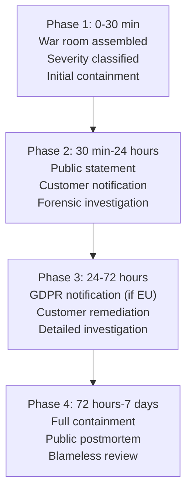
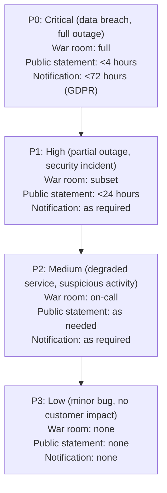
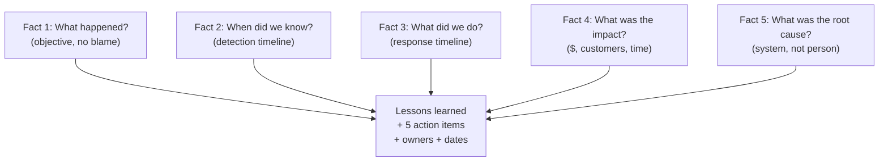

# VP of Engineering Playbook
## Chapter 24

# Crisis Response at Scale

> *"Crisis is when the VPE's leadership is tested. The VPE's job is to have a crisis playbook, run it under pressure, and own the public narrative."*

---

## 1. Epigraph

Crisis is when the VPE's leadership is tested. The VPE's job is to have a crisis playbook, run it under pressure, and own the public narrative.

---

## 2. Problem

You are the VPE at a 1,200-person company. It's Friday 6pm. The CEO has just called: "We have a security incident. Customer data has been exposed. 50K customer records are on a public S3 bucket. The media has found out. The board is asking questions. The customers are asking questions. We have 24 hours to respond publicly. We have 72 hours to notify under GDPR. I need you in the war room in 30 minutes."

You have 30 minutes to assemble the war room, 24 hours to respond publicly, 72 hours to notify under GDPR, and 7 days to recover. This chapter tells you what each phase looks like.

**Decision in one sentence:** Engineering crisis response at scale is a 4-phase crisis playbook (Phase 1: 0-30 min, Phase 2: 30 min-24 hours, Phase 3: 24-72 hours, Phase 4: 72 hours-7 days) executed by a pre-assembled war room; the VPE's job is to lead the war room, own the public narrative, and run a blameless postmortem within 7 days.

---

## 3. Why VPEs Fail Here

Five named failure modes of VPEs whose crisis response produced zero results.

- **The Ad-Hoc-Crisis Failure.** The VPE has no crisis playbook. The first hour is spent figuring out who to call. The crisis is mishandled. The VPE has not pre-assembled the war room.
- **The Blame-The-IC Failure.** The VPE's first public statement is "we fired the engineer." The team is demoralized. The postmortem is not blameless. The VPE has not built the blameless culture.
- **The No-Public-Narrative Failure.** The VPE is silent on social media for 24 hours. The customers are angry. The media is writing. The VPE has not owned the public narrative.
- **The No-Postmortem Failure.** The VPE moves on after the crisis. The same incident happens 6 months later. The VPE has not built the postmortem + action items system.
- **The Legal-Blocks-Communication Failure.** The VPE is blocked by legal from communicating. The customers are angry. The CEO is in the middle. The VPE has not pre-built the legal communication protocol.

---

## 4. Mental Models

Four mental models that compress crisis response at scale.

**Mental model 1: The 4-Phase Crisis Playbook.** Crisis is 4 phases. Each phase has a clock and a deliverable.



**The 4 phases:**

- **Phase 1: 0-30 min.** War room assembled. Severity classified (P0/P1/P2/P3). Initial containment (e.g., revoke credentials, isolate systems).
- **Phase 2: 30 min-24 hours.** Public statement (within 4 hours). Customer notification. Forensic investigation.
- **Phase 3: 24-72 hours.** GDPR notification (if EU, 72-hour deadline). Customer remediation (e.g., credit monitoring). Detailed investigation.
- **Phase 4: 72 hours-7 days.** Full containment. Public postmortem. Blameless review + action items.

**Mental model 2: The Pre-Assembled War Room.** The war room is pre-assembled. Every crisis has the same 7 people.

```mermaid
%% Figure 24.2 — The 7-person war room
flowchart TB
    WR[War Room (7 people, pre-assembled)]
    WR --> CEO[CEO (decision authority)]
    WR --> VPE[VPE (engineering response)]
    WR --> CISO[CISO (security response)]
    WR --> LEGAL[Legal (regulatory + liability)]
    WR --> COMMS[Comms / PR (public narrative)]
    WR --> CS[CX (customer communication)]
    WR --> CFO[CFO (financial impact)]
```

**The 7 war room members:**
- **CEO.** Decision authority (e.g., should we pay ransom?).
- **VPE.** Engineering response (containment, fix, postmortem).
- **CISO.** Security response (forensics, regulatory, communication).
- **Legal.** Regulatory + liability.
- **Comms / PR.** Public narrative.
- **CX.** Customer communication.
- **CFO.** Financial impact.

**Mental model 3: The 4-Tier Severity Classification.** Every crisis is classified as P0/P1/P2/P3.



**The 4 tiers:**
- **P0: Critical.** Data breach, full outage. War room: full. Public statement: <4 hours. Notification: <72 hours (GDPR).
- **P1: High.** Partial outage, security incident. War room: subset. Public statement: <24 hours.
- **P2: Medium.** Degraded service, suspicious activity. War room: on-call.
- **P3: Low.** Minor bug, no customer impact. War room: none.

**Mental model 4: The Blameless Postmortem.** The postmortem is blameless. The system is at fault, not the person.



**The 5-fact postmortem:**
- **Fact 1: What happened?** Objective, no blame.
- **Fact 2: When did we know?** Detection timeline.
- **Fact 3: What did we do?** Response timeline.
- **Fact 4: What was the impact?** $, customers, time.
- **Fact 5: What was the root cause?** System, not person.

**The postmortem produces:** 5 action items, each with an owner and a date.

---

## 5. Frameworks

Three frameworks for crisis response at scale.

### Framework 1: The Crisis Playbook (1 page)

```
# Crisis Playbook — [Severity: P0/P1/P2/P3] — [Date]

## Phase 1: 0-30 min
- [ ] War room assembled (CEO, VPE, CISO, Legal, Comms, CX, CFO)
- [ ] Severity confirmed (P0/P1/P2/P3)
- [ ] Initial containment (e.g., revoke creds, isolate system)
- [ ] Communication channel: #crisis-[incident-name] in Slack

## Phase 2: 30 min-24 hours
- [ ] Public statement (within 4 hours, P0)
- [ ] Customer notification (email, in-app, status page)
- [ ] Forensic investigation (CISO leads)
- [ ] Hourly war room sync

## Phase 3: 24-72 hours
- [ ] GDPR notification (P0, EU customers)
- [ ] Customer remediation (e.g., credit monitoring)
- [ ] Detailed investigation
- [ ] Daily war room sync

## Phase 4: 72 hours-7 days
- [ ] Full containment
- [ ] Public postmortem (blog post, 7 days post-incident)
- [ ] Blameless review with the team
- [ ] 5 action items + owners + dates
- [ ] Customer follow-up

## The 1 thing the VPE owns
- [Public narrative, technical postmortem, action items]
```

### Framework 2: The Public Statement Template

```
# Public Statement — [Date] — [Severity]

## What happened
[2-3 sentences. What we know, what we don't know, what we did.]

## What we did
[2-3 sentences. Containment, investigation, customer protection.]

## What customers should do
[2-3 sentences. Specific actions. E.g., reset password.]

## What we're doing next
[2-3 sentences. Investigation, postmortem, action items.]

## The 1 thing we want customers to know
[1 sentence. E.g., "We take this seriously. We're sorry. We're
committed to making it right."]

## Sign-off
- Comms / PR
- Legal
- CEO
```

### Framework 3: The Blameless Postmortem Template

```
# Postmortem — [Incident Name] — [Date]

## Summary
[1 sentence on what happened, severity, resolution time.]

## Fact 1: What happened
[Objective, no blame. Timeline of events.]

## Fact 2: When did we know
[Detection timeline. Time-to-detect, time-to-escalate.]

## Fact 3: What did we do
[Response timeline. Time-to-contain, time-to-fix.]

## Fact 4: What was the impact
[$, customers, time. Quantified.]

## Fact 5: What was the root cause
[System, not person. The 5-why analysis.]

## Lessons learned
[2-3 sentences on what we learned.]

## Action items
| # | Action | Owner | Date |
|---|--------|-------|------|
| 1 | [Action 1] | [Owner] | [Date] |
| 2 | [Action 2] | [Owner] | [Date] |
| 3 | [Action 3] | [Owner] | [Date] |
| 4 | [Action 4] | [Owner] | [Date] |
| 5 | [Action 5] | [Owner] | [Date] |
```

---

## 6. Drill

You are the VPE at **acme-corp**. It's Friday 6pm. The CEO has just called: "Security incident. 50K customer records on a public S3 bucket. Media has found out. Board asking. Customers asking. 24 hours to respond publicly. 72 hours to notify under GDPR. War room in 30 min."

You have **90 minutes** (simulated, in the drill). Produce the **crisis response plan** (`portfolio/chapter-24-crisis-response.md`) using Framework 1 (Crisis Playbook) + Framework 2 (Public Statement) + Framework 3 (Blameless Postmortem). Specify:

- The 4-phase crisis playbook (P0, all 4 phases, all 7 war room members).
- The public statement (within 4 hours).
- The blameless postmortem (within 7 days).
- The 5 action items.
- The 1 thing the VPE owns during the crisis.
- The 1 thing you'll say to the CEO in the war room.

**Deliverable:** `portfolio/chapter-24-crisis-response.md` — under 1500 words.

---

## 7. Worked Example

**The 4-phase crisis playbook (P0):**

```
# Crisis Playbook — P0: Customer Data Exposure — 2026-09-18

## Phase 1: 0-30 min (6pm-6:30pm Friday)
- [x] War room assembled (CEO, VPE, CISO, Legal, Comms, CX, CFO)
- [x] Severity confirmed: P0 (customer data exposure)
- [x] Initial containment: S3 bucket made private, IAM keys rotated
- [x] Communication channel: #crisis-customer-data-2026-09-18 in Slack
- [x] First war room sync: 6:30pm

## Phase 2: 30 min-24 hours (6:30pm Friday - 6pm Saturday)
- [ ] Public statement (within 4 hours, by 10pm Friday)
- [ ] Customer notification (email, in-app, status page by 6am Saturday)
- [ ] Forensic investigation (CISO leads, daily report to war room)
- [ ] Hourly war room sync (8pm, 9pm, 10pm, ...)

## Phase 3: 24-72 hours (6pm Saturday - 6pm Monday)
- [ ] GDPR notification (P0, EU customers, 72-hour deadline: 6pm Monday)
- [ ] Customer remediation: credit monitoring (1 year free)
- [ ] Detailed investigation: scope of breach (50K records)
- [ ] Daily war room sync (10am, 4pm)

## Phase 4: 72 hours-7 days (Mon-Sun)
- [ ] Full containment: forensic report complete
- [ ] Public postmortem: blog post (7 days post-incident, Friday Sep 25)
- [ ] Blameless review: Thursday Sep 24
- [ ] 5 action items + owners + dates
- [ ] Customer follow-up: email + in-app

## The 1 thing the VPE owns
- Technical postmortem (5-fact)
- Public narrative (with Comms)
- 5 action items
```

**The public statement (within 4 hours):**

```
# Public Statement — 2026-09-18, 10pm

## What happened
On Friday September 18 at 6pm, we discovered that a
misconfigured S3 bucket had exposed approximately 50,000
customer records to the public internet. The bucket
contained names, email addresses, and company names. We
do not believe passwords, payment information, or other
sensitive data were exposed. We are still investigating.

## What we did
Immediately upon discovery, we made the bucket private,
rotated all IAM keys, and began a forensic investigation.
We have engaged external security experts to assist. We
are notifying all affected customers directly.

## What customers should do
As a precaution, we recommend that all affected customers
reset their passwords and review their account activity.
We will provide 1 year of free credit monitoring to all
affected customers.

## What we're doing next
We are conducting a thorough investigation, including
external security experts. We will publish a full postmortem
within 7 days. We are committed to making this right.

## The 1 thing we want customers to know
We take this seriously. We are sorry. We are committed to
making it right.

## Sign-off
- Comms / PR: ✓
- Legal: ✓
- CEO: ✓
```

**The blameless postmortem (within 7 days):**

```
# Postmortem — Customer Data Exposure — 2026-09-25

## Summary
On 2026-09-18 at 6pm, a misconfigured S3 bucket exposed
~50K customer records (names, emails, company names) to the
public internet. Severity: P0. Resolution time: 4 hours
(containment by 10pm Friday).

## Fact 1: What happened
- 2026-09-18 4:32pm: An IC2 deployed a new S3 bucket for
  a marketing campaign. The bucket policy was set to
  `Principal: *` (public read). This was not caught by
  code review (the change was small) or by automated
  config scanning (the scanner was misconfigured).
- 2026-09-18 6:00pm: A security researcher discovered the
  bucket and reported it to our security@ email.
- 2026-09-18 6:05pm: CISO received the report and escalated
  to P0.
- 2026-09-18 6:15pm: War room assembled.
- 2026-09-18 6:30pm: S3 bucket made private.
- 2026-09-18 6:45pm: All IAM keys rotated.
- 2026-09-18 10:00pm: Public statement issued.
- 2026-09-19 6:00am: Customer notification sent.

## Fact 2: When did we know
- 2026-09-18 4:32pm: Bucket created (we did not detect)
- 2026-09-18 6:00pm: External report received (TIME-TO-DETECT: 1h 28m)
- 2026-09-18 6:05pm: CISO escalated to P0 (TIME-TO-ESCALATE: 5m)
- 2026-09-18 6:30pm: Bucket made private (TIME-TO-CONTAIN: 1h 30m)

## Fact 3: What did we do
- Made bucket private, rotated keys, stood up war room,
  issued public statement, sent customer notification,
  engaged external security experts, ran forensic
  investigation.

## Fact 4: What was the impact
- 50K customer records exposed
- $0 direct financial impact (no ransomware, no fraud yet)
- $2M+ estimated cost: forensic ($200K), credit monitoring
  ($1M), GDPR fine (up to $4M, but unlikely), brand damage
  (estimated $5M+)

## Fact 5: What was the root cause
- 5-why analysis:
  1. Why was the S3 bucket public? — The bucket policy
     was set to `Principal: *`.
  2. Why was the bucket policy set to public? — The IC2
     copied a policy from an internal example without
     understanding the security implications.
  3. Why didn't the IC2 understand the security implications?
     — The IC2's onboarding did not include S3 security
     training.
  4. Why didn't code review catch it? — The change was
     small (1-line policy change) and the reviewer did
     not focus on security.
  5. Why didn't the automated config scanner catch it?
     — The scanner was misconfigured (it was checking for
       S3 buckets in production accounts, not the new
       marketing account).

**Root cause:** The system allowed a public S3 bucket
without multiple safeguards. The single point of failure
was the config scanner (it should have caught it).

**This is a system failure, not a person failure.** The
IC2 made a mistake, but the system should have caught it.

## Lessons learned
- The config scanner is a critical control. It must be
  configured for ALL accounts, not just production.
- Onboarding for new ICs must include S3 security training.
- Code review for IAM/policy changes should require a
  security-focused reviewer.

## Action items
| # | Action | Owner | Date |
|---|--------|-------|------|
| 1 | Fix config scanner: cover ALL AWS accounts, alert on public buckets | CISO + Director, Platform | 2026-10-01 |
| 2 | Add S3 security training to IC2 onboarding | HRBP + Director, Platform | 2026-10-15 |
| 3 | Require security-focused reviewer for IAM/policy PRs | Director, Platform | 2026-10-01 |
| 4 | Implement automated daily S3 bucket scan + alert | Director, Platform | 2026-10-15 |
| 5 | Run quarterly security drill (simulated S3 exposure) | CISO | 2026-12-31 |
```

**The 1 thing the VPE owns during the crisis:**

```
The VPE owns:
1. Technical postmortem (5-fact, blameless, system-focused)
2. Public narrative (with Comms)
3. The 5 action items (with owners and dates)
4. The "what we learned" narrative (for the team + customers)
5. The "what we're changing" narrative (for the board)

The VPE does NOT own:
- The legal response (Legal owns)
- The financial response (CFO owns)
- The customer response (CX owns)
- The regulatory response (Legal + CISO own)
```

**The 1 thing I'll say to the CEO in the war room:**

```
"Here's the VPE's plan:

  Phase 1: war room assembled, bucket made private, keys
    rotated. DONE in 30 min.
  Phase 2: public statement at 10pm (4 hours from now),
    customer notification by 6am tomorrow.
  Phase 3: GDPR notification by 6pm Monday (72 hours),
    credit monitoring (1 year free).
  Phase 4: public postmortem Friday Sep 25, blameless
    review Thursday Sep 24, 5 action items.

The root cause: the config scanner didn't cover the new
marketing account. The IC2 made a mistake, but the system
should have caught it. We fix the system, not blame the
person.

The 5 action items:
  1. Fix config scanner (cover all accounts) by Oct 1
  2. Add S3 security training to onboarding by Oct 15
  3. Require security reviewer for IAM/policy PRs by Oct 1
  4. Implement daily S3 bucket scan + alert by Oct 15
  5. Quarterly security drill by Dec 31

The cost: $2M+ (forensic, credit monitoring, potential
GDPR fine). The risk: brand damage. The recovery: 7 days
to public postmortem.

The team is demoralized. I will run a blameless review
Thursday. The 1 thing I need from you: stand behind the
blameless narrative publicly. We are not firing anyone.
We are fixing the system."
```

---

## 8. Failure Mode Postmortem

A VPE at a 1,800-person company had a security incident (50K customer records exposed). The VPE's first public statement was "we fired the engineer who made the mistake." The team was demoralized. The postmortem was not blameless. The 5 action items were not tracked.

Within 6 months: 3 senior ICs left (citing culture). The next security incident happened (a similar S3 misconfiguration). The CEO asked: "Why didn't the action items from the last incident prevent this?"

The VPE was asked to leave. The CEO told the replacement VPE: "I want blameless postmortems. I want action items tracked. I want the same mistake to not happen twice."

The replacement VPE did 3 things:
1. Established the 4-phase crisis playbook (pre-assembled war room).
2. Made blameless postmortems a non-negotiable.
3. Tracked every action item with owner + date + status.

Within 12 months: 2 security incidents occurred, both contained in <2 hours. 0 senior ICs left. The action items from each postmortem were tracked and completed.

What the first VPE missed: crisis is a system test, not a person test. The first VPE blamed the person. The second VPE fixed the system. The system is the leverage.

The lesson: the VPE who runs a blameless postmortem and tracks action items has a learning org. The VPE who blames the person has a demoralized org.

---

## 9. Self-Assessment Rubric

| # | Dimension | 1 (Novice) | 3 (Competent) | 5 (Expert) |
|---|---|---|---|---|
| 1 | **4-phase crisis playbook** | No playbook or 1-page ad-hoc | Playbook exists, 4 phases documented | Playbook pre-assembled, 7 war room members, tested quarterly |
| 2 | **Public narrative** | Silent or blaming | Statement exists, slow (24+ hours) | Statement within 4 hours, customer-first, signed by CEO |
| 3 | **Blameless postmortem** | Not blameless or no postmortem | Postmortem exists, partial | Blameless, 5-fact, system-focused, public, 5 action items |
| 4 | **Action item tracking** | No tracking | Action items exist, not tracked | 5 action items + owners + dates, tracked quarterly |
| 5 | **Pre-assembled war room** | No war room or assembled ad-hoc | War room exists, 5-7 members | 7 members pre-assigned, quarterly drills, on-call rotation |

**Disqualifier:** any 1 on dimension 1 or 3. A VPE without a 4-phase playbook or without a blameless postmortem is in the Ad-Hoc-Crisis or Blame-The-IC failure mode.

**Total:** ___ / 25. **Pass threshold:** 18/25, no dimension below 3.

---

## 10. Portfolio Artifact Note

Save your filled-in drill as `portfolio/chapter-24-crisis-response.md` — interview evidence for "How do you lead crisis response?" (see Portfolio Map in Chapter 27).

---

## 11. Interview Questions

1. **Walk me through a crisis you've led.**
2. **A security incident just happened. What do you do in the first 30 min?**
3. **The legal team blocks you from communicating. What do you do?**
4. **The same incident happens 6 months later. What does that tell you?**
5. **Walk me through your blameless postmortem process.**