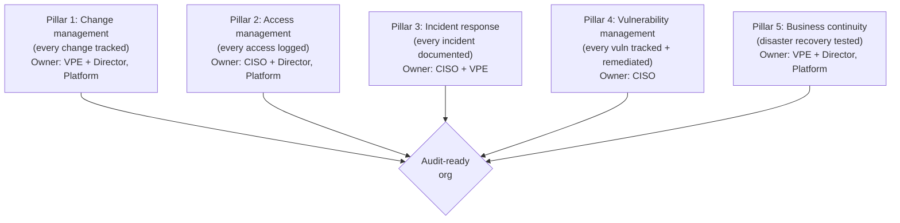
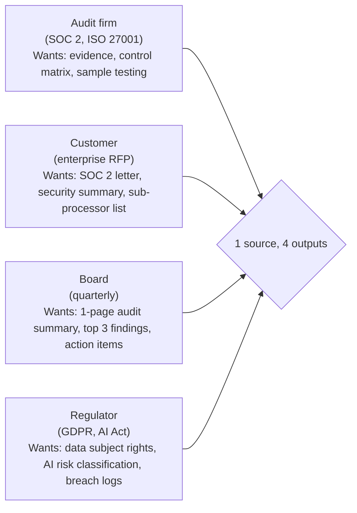
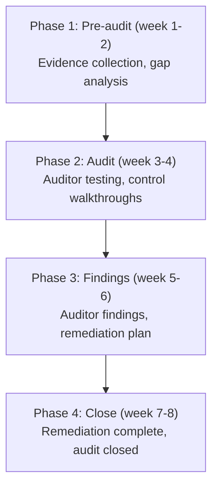

# VP of Engineering Playbook
## Chapter 25

# Engineering Auditability

> *"Auditability is the system that proves the engineering org is doing what it says it's doing. The VPE's job is to design the audit trail, maintain it daily, and own the audit response."*

---

## 1. Epigraph

Auditability is the system that proves the engineering org is doing what it says it's doing. The VPE's job is to design the audit trail, maintain it daily, and own the audit response.

---

## 2. Problem

You are the VPE at a 1,200-person company. The CFO has just told you: "The audit firm is asking for SOC 2 Type II evidence. They want change management logs, access logs, incident response logs, and vulnerability management logs. The customers are asking for the same. The board is asking for an audit summary. The audit is in 60 days. We have 47 audit asks. Some are documented, some are not. I need a 1-page audit summary, a 5-pillar audit framework, and the audit response plan in 30 days."

You have 30 days to produce a 1-page audit summary, a 5-pillar audit framework, the audit response plan, and the 1 thing you'll say to the CFO. This chapter tells you what each looks like.

**Decision in one sentence:** Engineering auditability at scale is a 5-pillar audit framework (change management, access, incident response, vulnerability management, business continuity) backed by a daily audit trail; the VPE's job is to maintain the trail, own the audit response, and design engineering systems that produce audit evidence by default.

---

## 3. Why VPEs Fail Here

Five named failure modes of VPEs whose auditability produced zero results.

- **The Audit-Once-A-Year Failure.** The VPE only thinks about auditability when the audit firm comes. The logs are incomplete. The audit fails. The VPE has not designed for daily auditability.
- **The Manual-Log-Collection Failure.** The VPE's audit evidence is collected manually (CSV exports, screenshots). The collection takes 3 weeks. The audit is delayed. The VPE has not automated the audit trail.
- **The Access-Log-Gap Failure.** The VPE's access logs are incomplete. Some services are not logged. The audit firm flags it. The VPE has not designed comprehensive access logging.
- **The Change-Management-Without-Evidence Failure.** The VPE's change management is in Jira. The audit firm wants evidence in Git. The VPE has not linked Jira to Git.
- **The Audit-Response-Ad-Hoc Failure.** The VPE has no audit response plan. The audit firm asks 47 questions. The VPE scrambles. The VPE has not pre-built the audit response process.

---

## 4. Mental Models

Four mental models that compress engineering auditability at scale.

**Mental model 1: The 5-Pillar Audit Framework.** Auditability is 5 pillars. Each pillar is owned.



**The 5 pillars:**
- **Pillar 1: Change management.** Every change tracked (PR + review + deploy). Owner: VPE + Director, Platform.
- **Pillar 2: Access management.** Every access logged (SSO + CloudTrail). Owner: CISO + Director, Platform.
- **Pillar 3: Incident response.** Every incident documented (runbook + postmortem). Owner: CISO + VPE.
- **Pillar 4: Vulnerability management.** Every vuln tracked + remediated. Owner: CISO.
- **Pillar 5: Business continuity.** Disaster recovery tested quarterly. Owner: VPE + Director, Platform.

**Mental model 2: The Daily Audit Trail.** The audit trail is daily, not annual.

```mermaid
%% Figure 25.2 — The daily audit trail
flowchart TB
    D1["Daily: Change log (Git + Jira)<br/>auto-exported to audit bucket"]
    D2["Daily: Access log (CloudTrail)<br/>auto-exported to audit bucket"]
    D3["Weekly: Vulnerability scan<br/>auto-exported to audit bucket"]
    D4["Monthly: Incident postmortem (if any)<br/>auto-exported to audit bucket"]
    D5["Quarterly: DR drill<br/>auto-exported to audit bucket"]
    D1 --> Audit
    D2 --> Audit
    D3 --> Audit
    D4 --> Audit
    D5 --> Audit
    Audit{Audit bucket<br/>(read-only, 7-year retention)}
```

**The daily audit trail (5 cadences):**
- **Daily.** Change log (Git + Jira) + access log (CloudTrail). Auto-exported.
- **Weekly.** Vulnerability scan. Auto-exported.
- **Monthly.** Incident postmortems (if any). Auto-exported.
- **Quarterly.** DR drill. Auto-exported.
- **Audit bucket.** Read-only, 7-year retention, accessible by auditors.

**Mental model 3: The 4 Audit Personas.** The audit has 4 audiences. Each gets a different version.



**The 4 audiences:**
- **Audit firm (SOC 2, ISO 27001).** Wants evidence, control matrix, sample testing.
- **Customer (enterprise RFP).** Wants SOC 2 letter, security summary, sub-processor list.
- **Board (quarterly).** Wants 1-page audit summary, top 3 findings, action items.
- **Regulator (GDPR, AI Act).** Wants data subject rights, AI risk classification, breach logs.

**Mental model 4: The Audit Response Plan.** The audit response is 4 phases, 30 days.



**The 4 phases (8 weeks):**
- **Phase 1: Pre-audit (week 1-2).** Evidence collection, gap analysis.
- **Phase 2: Audit (week 3-4).** Auditor testing, control walkthroughs.
- **Phase 3: Findings (week 5-6).** Auditor findings, remediation plan.
- **Phase 4: Close (week 7-8).** Remediation complete, audit closed.

---

## 5. Frameworks

Three frameworks for engineering auditability at scale.

### Framework 1: The 1-Page Audit Summary

```
# Engineering Audit Summary — [Date]

## Audit posture
- SOC 2 Type II: [In progress / Complete] — [Date]
- ISO 27001: [In progress / Complete] — [Date]
- GDPR: [In progress / Complete] — [Date]
- EU AI Act: [In progress / Complete] — [Date]

## The 5 pillars
| Pillar | Status | Owner | Last reviewed |
|--------|--------|-------|---------------|
| Change management | 🟢 / 🟡 / 🔴 | VPE + Director, Platform | [Date] |
| Access management | 🟢 / 🟡 / 🔴 | CISO + Director, Platform | [Date] |
| Incident response | 🟢 / 🟡 / 🔴 | CISO + VPE | [Date] |
| Vulnerability management | 🟢 / 🟡 / 🔴 | CISO | [Date] |
| Business continuity | 🟢 / 🟡 / 🔴 | VPE + Director, Platform | [Date] |

## Top 3 findings
1. [Finding 1] — [Severity: high/med/low] — [Owner] — [Remediation date]
2. [Finding 2] — [Severity] — [Owner] — [Remediation date]
3. [Finding 3] — [Severity] — [Owner] — [Remediation date]

## Top 3 action items
1. [Action 1] — [Owner] — [Date]
2. [Action 2] — [Owner] — [Date]
3. [Action 3] — [Owner] — [Date]

## The 1 thing the board should know
[1 sentence on the audit posture.]
```

### Framework 2: The Audit Evidence Checklist

```
# Audit Evidence Checklist — [Pillar] — [Date]

## Change management
- [ ] PR + review evidence (Git)
- [ ] Deploy evidence (CI/CD)
- [ ] Approval evidence (Jira)
- [ ] Rollback evidence (runbook)
- [ ] Sample testing (5 PRs per quarter)

## Access management
- [ ] SSO + MFA (Okta logs)
- [ ] AWS IAM access (CloudTrail)
- [ ] Privileged access (MFA + just-in-time)
- [ ] Access reviews (quarterly)
- [ ] Sample testing (5 access events per quarter)

## Incident response
- [ ] Incident log (PagerDuty)
- [ ] Postmortems (5-fact + action items)
- [ ] Severity classification
- [ ] Response timeline
- [ ] Sample testing (3 incidents per quarter)

## Vulnerability management
- [ ] Vulnerability scan (weekly)
- [ ] CVE tracking (Snyk, Dependabot)
- [ ] Patch timeline
- [ ] Penetration test (annual)
- [ ] Sample testing (5 vulns per quarter)

## Business continuity
- [ ] DR plan documented
- [ ] DR drill (quarterly)
- [ ] Backup evidence (S3 versioning)
- [ ] RTO/RPO targets
- [ ] Sample testing (1 DR drill per quarter)
```

### Framework 3: The Audit Response Plan

```
# Audit Response Plan — [Date]

## Phase 1: Pre-audit (week 1-2)
- [ ] Audit firm contracted
- [ ] Evidence collection (5 pillars, automated)
- [ ] Gap analysis (where we're not audit-ready)
- [ ] Pre-audit remediation (close gaps)
- [ ] Audit kickoff meeting

## Phase 2: Audit (week 3-4)
- [ ] Auditor on-site (or virtual)
- [ ] Control walkthroughs (5 pillars)
- [ ] Sample testing (5-10 samples per pillar)
- [ ] Daily sync with auditor
- [ ] Issue tracking (real-time)

## Phase 3: Findings (week 5-6)
- [ ] Auditor findings report
- [ ] Severity classification (high/med/low)
- [ ] Remediation plan (5 action items per finding)
- [ ] Owners + dates assigned
- [ ] Auditor review

## Phase 4: Close (week 7-8)
- [ ] Remediation complete
- [ ] Auditor re-testing
- [ ] Audit report issued
- [ ] SOC 2 letter received (if applicable)
- [ ] Customer notification (if material findings)
- [ ] Board summary (1 page)
```

---

## 6. Drill

You are the VPE at **acme-corp**. The CFO has given you 30 days to produce the audit summary. The inputs:

```
- 47 audit asks (some documented, some not)
- SOC 2 Type II in progress
- Audit firm asking for evidence
- Customers asking for SOC 2 letter
- Board asking for audit summary
- Audit in 60 days
```

You have **90 minutes**. Produce the **audit response plan** (`portfolio/chapter-25-audit-response.md`) using Framework 1 (Audit Summary) + Framework 2 (Evidence Checklist) + Framework 3 (Audit Response Plan). Specify:

- The 1-page audit summary (5 pillars, top 3 findings, top 3 actions).
- The audit evidence checklist (sample: change management pillar).
- The 4-phase audit response plan (8 weeks).
- The 1 thing you'll say to the CFO about auditability.
- The 3 things you'll do to make auditability a daily practice.

**Deliverable:** `portfolio/chapter-25-audit-response.md` — under 1500 words.

---

## 7. Worked Example

**The 1-page audit summary (Q3 2026):**

```
# Engineering Audit Summary — Q3 2026

## Audit posture
- SOC 2 Type II: In progress (target Q4 2026)
- ISO 27001: Open (target Q1 2027)
- GDPR: In progress (target Q3 2026)
- EU AI Act: In progress (target Q2 2027)

## The 5 pillars
| Pillar | Status | Owner | Last reviewed |
|--------|--------|-------|---------------|
| Change management | 🟢 | VPE + Director, Platform | 2026-09-15 |
| Access management | 🟢 | CISO + Director, Platform | 2026-09-15 |
| Incident response | 🟢 | CISO + VPE | 2026-09-15 |
| Vulnerability management | 🟡 | CISO | 2026-09-15 |
| Business continuity | 🟡 | VPE + Director, Platform | 2026-08-15 |

## Top 3 findings
1. Vulnerability management: 12 high-severity vulns unpatched (severity: high) — CISO — 2026-10-01
2. Business continuity: DR drill delayed 1 quarter (severity: med) — VPE — 2026-10-15
3. Access management: 3 dormant service accounts (severity: low) — CISO — 2026-10-01

## Top 3 action items
1. Patch 12 high-severity vulns — CISO — 2026-10-01
2. Run DR drill (Q3) — VPE + Director, Platform — 2026-10-15
3. Remove 3 dormant service accounts — CISO — 2026-10-01

## The 1 thing the board should know
The audit posture is strong. 3 of 5 pillars are green. 2 are
yellow with remediation in progress. SOC 2 Type II target
Q4 2026.
```

**The audit evidence checklist (change management pillar):**

```
# Audit Evidence Checklist — Change Management — Q3 2026

## PR + review evidence (Git)
- [x] Every PR has 2+ reviewers
- [x] Every PR has CI passing
- [x] Every PR has linked Jira ticket
- [x] Sample testing: 5 PRs from Q3 2026 verified
  - PR #1234 (auth): 2 reviewers, CI green, linked ENG-1234
  - PR #5678 (data): 2 reviewers, CI green, linked ENG-5678
  - PR #9012 (frontend): 2 reviewers, CI green, linked ENG-9012

## Deploy evidence (CI/CD)
- [x] Every deploy is via CI/CD (no manual deploys)
- [x] Every deploy has a PR linked
- [x] Every deploy has automated tests
- [x] Sample testing: 5 deploys from Q3 2026 verified

## Approval evidence (Jira)
- [x] Every Jira ticket has a Director approval
- [x] Every Jira ticket has a target date
- [x] Every Jira ticket has a status
- [x] Sample testing: 5 Jira tickets from Q3 2026 verified

## Rollback evidence (runbook)
- [x] Every service has a rollback runbook
- [x] Every rollback is tested in staging
- [x] Every rollback is documented in the deploy log
- [x] Sample testing: 3 services verified (auth, data, frontend)

## Audit posture
- All evidence auto-exported to audit bucket (daily)
- 7-year retention
- Read-only for auditors
```

**The 4-phase audit response plan (8 weeks):**

```
# Audit Response Plan — SOC 2 Type II — Q4 2026

## Phase 1: Pre-audit (week 1-2, Oct 1-14)
- [x] Audit firm contracted: Deloitte
- [x] Evidence collection (5 pillars, automated via audit bucket)
- [x] Gap analysis: 3 findings (vuln mgmt, BC, access mgmt)
- [x] Pre-audit remediation: in progress
- [x] Audit kickoff meeting: Oct 7

## Phase 2: Audit (week 3-4, Oct 15-28)
- [ ] Auditor on-site (virtual): Oct 15-28
- [ ] Control walkthroughs: 5 pillars, 2 hours each
- [ ] Sample testing: 5-10 samples per pillar (50 total)
- [ ] Daily sync with auditor: 9am
- [ ] Issue tracking: real-time in Jira AUDIT project

## Phase 3: Findings (week 5-6, Oct 29 - Nov 11)
- [ ] Auditor findings report: Nov 1 (estimated)
- [ ] Severity classification: high/med/low
- [ ] Remediation plan: 5 action items per finding
- [ ] Owners + dates assigned
- [ ] Auditor review: Nov 8

## Phase 4: Close (week 7-8, Nov 12-25)
- [ ] Remediation complete
- [ ] Auditor re-testing: Nov 15-22
- [ ] Audit report issued: Nov 25 (estimated)
- [ ] SOC 2 letter received: Dec 1 (estimated)
- [ ] Customer notification: Dec 5 (if material findings)
- [ ] Board summary: Dec 15 (next board meeting)
```

**The 1 thing I'll say to the CFO about auditability:**

```
"We have an audit response plan. The headline:

  Audit posture: 3/5 pillars green, 2/5 yellow (in remediation)
  SOC 2 Type II: target Q4 2026
  ISO 27001: target Q1 2027

The 5 pillars are owned (change, access, incident, vuln, BC).
The audit trail is daily (auto-exported to audit bucket).
The audit response is 4 phases (8 weeks).

The 3 things I'm doing to make auditability a daily practice:
  1. Auto-export evidence daily (Git + CloudTrail + scans)
  2. Quarterly audit review with the CISO
  3. Pre-built audit response plan (4 phases, 8 weeks)

The audit posture is designed, not reactive. The audit
will pass because the evidence is daily, not annual."
```

**The 3 things I'll do to make auditability a daily practice:**

```
1. Auto-export evidence daily.
   - Git + Jira → audit bucket (change management)
   - CloudTrail → audit bucket (access management)
   - Snyk + Dependabot → audit bucket (vuln management)
   - PagerDuty → audit bucket (incident management)
   - DR drill artifacts → audit bucket (business continuity)
   - Owner: Director, Platform

2. Quarterly audit review with the CISO.
   - 60 min, every quarter
   - Attendees: VPE + CISO + CFO
   - Agenda: 5-pillar status, top 3 findings, action items
   - Owner: VPE + CISO

3. Pre-built audit response plan.
   - 4 phases (8 weeks) ready before audit firm contracts
   - Evidence collection automated (no manual logs)
   - Sample testing pre-built (5 PRs, 5 access events, etc.)
   - Owner: VPE + CFO
```

---

## 8. Failure Mode Postmortem

A VPE at a 1,500-person company had no audit response plan. The SOC 2 audit was in 60 days. The VPE's evidence was collected manually (CSV exports, screenshots). The collection took 3 weeks. The audit found 5 material weaknesses. The SOC 2 was delayed 6 months. The customers found out and 3 enterprise customers churned.

The VPE was asked to leave. The CFO told the replacement VPE: "I want the evidence to be daily, not annual. I want the audit response to be pre-built. I want the 5 pillars to be owned."

The replacement VPE did 3 things:
1. Built the 5-pillar audit framework (change, access, incident, vuln, BC).
2. Built the daily audit trail (auto-exported to audit bucket).
3. Pre-built the 4-phase audit response plan.

Within 12 months: SOC 2 Type II passed (Q2 2027). ISO 27001 certification in progress. 0 enterprise customer churn due to audit issues.

What the first VPE missed: auditability is a system, not a project. The first VPE treated audit as a project (one-time, manual). The second VPE built a system (daily, automated). The system is the leverage.

The lesson: the VPE who has a daily audit trail and a pre-built audit response has a passing audit. The VPE who collects evidence manually has a delayed audit.

---

## 9. Self-Assessment Rubric

| # | Dimension | 1 (Novice) | 3 (Competent) | 5 (Expert) |
|---|---|---|---|---|
| 1 | **5-pillar framework** | No framework | 5 pillars exist, partially owned | 5 pillars, all owned, quarterly reviewed |
| 2 | **Daily audit trail** | Annual or quarterly | Daily for 2-3 pillars | Daily for all 5, auto-exported, 7-year retention |
| 3 | **4 audit personas** | 1 audience (audit firm) | 2-3 audiences | 4 audiences (firm, customer, board, regulator) |
| 4 | **Audit response plan** | No plan | Plan exists, partial | 4-phase plan, 8 weeks, pre-built, tested |
| 5 | **Auto-export evidence** | Manual collection | Partial automation | Full automation, audit bucket, 7-year retention |

**Disqualifier:** any 1 on dimension 1 or 2. A VPE without a 5-pillar framework or without a daily audit trail is in the Audit-Once-A-Year or Manual-Log-Collection failure mode.

**Total:** ___ / 25. **Pass threshold:** 18/25, no dimension below 3.

---

## 10. Portfolio Artifact Note

Save your filled-in drill as `portfolio/chapter-25-audit-response.md` — interview evidence for "How do you design engineering auditability?" (see Portfolio Map in Chapter 27).

---

## 11. Interview Questions

1. **Walk me through your engineering auditability system.**
2. **The audit firm found 5 material weaknesses. What do you do?**
3. **The CFO asks for SOC 2 in 60 days. What do you do?**
4. **A customer asks for evidence of your access controls. What do you do?**
5. **Walk me through an audit you've led.**