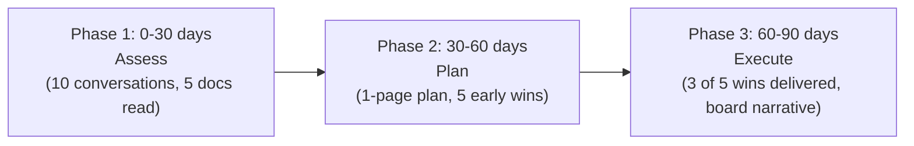
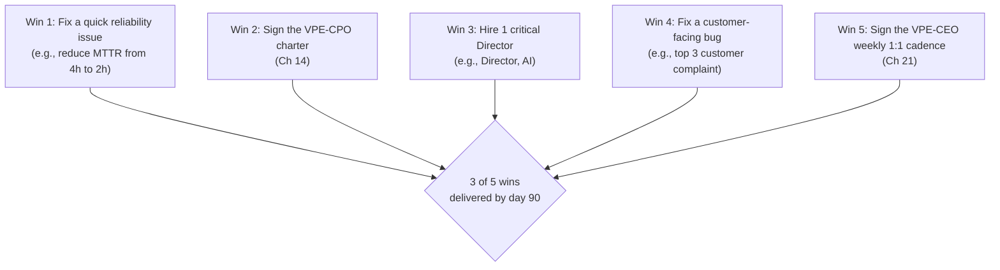

# VP of Engineering Playbook
## Chapter 26

# 30/60/90 at the VPE Level

> *"The first 90 days as a VPE set the tone for the next 36 months. The VPE's job is to design the 30/60/90 plan, run it on cadence, and own the early signal that shapes the next 24 months."*

---

## 1. Epigraph

The first 90 days as a VPE set the tone for the next 36 months. The VPE's job is to design the 30/60/90 plan, run it on cadence, and own the early signal that shapes the next 24 months.

---

## 2. Problem

You are starting a new VPE role at a 1,200-person company. The CEO has just told you: "You have 30 days to assess, 60 days to plan, 90 days to execute. We have 250 engineers, 5 Directors, 1 platform team, 4 product teams, a $50M engineering budget, an enterprise tier launching in Q3, an AI feature in development, and a board meeting in 60 days. I need a 30/60/90 plan in 30 days."

You have 30 days to produce a 30/60/90 plan, the first 10 conversations, the first 5 wins, and the 1 thing you'll say to the CEO in the first 90 days. This chapter tells you what each looks like.

**Decision in one sentence:** The 30/60/90 at the VPE level is a 3-phase plan (Phase 1: 0-30 days assess, Phase 2: 30-60 days plan, Phase 3: 60-90 days execute) backed by 10 stakeholder conversations, 5 early wins, and a 1-page plan signed by the CEO; the VPE's job is to run the cadence, own the early signal, and make the first 90 days count.

---

## 3. Why VPEs Fail Here

Five named failure modes of VPEs whose 30/60/90 produced zero results.

- **The First-Day-Plan Failure.** The VPE shows up with a 90-day plan on day 1. The VPE has not assessed the org. The plan is based on assumptions, not data. The VPE has not done the assessment.
- **The No-Stakeholder-Conversation Failure.** The VPE does not talk to the Directors, the CPO, the CFO, the CTO, or the customers. The VPE's plan is based on second-hand information. The VPE has not built the relationships.
- **The Big-Bang-Plan Failure.** The VPE announces a 90-day reorg on day 30. The org is destabilized. The Directors are confused. The CEO is in the middle. The VPE has not built trust before changing the org.
- **The No-Early-Win Failure.** The VPE spends 90 days planning. There are no early wins. The org has no signal of progress. The VPE has not designed the 5 early wins.
- **The 30-60-90-Theater Failure.** The VPE writes a 30/60/90 plan. The plan is not used. The VPE reacts to whatever is loudest. The VPE has not committed to the plan.

---

## 4. Mental Models

Four mental models that compress the 30/60/90 at the VPE level.

**Mental model 1: The 3-Phase 30/60/90.** The first 90 days are 3 phases, not 1.



**The 3 phases:**
- **Phase 1: 0-30 days — Assess.** 10 stakeholder conversations. 5 docs read. 1-page assessment memo.
- **Phase 2: 30-60 days — Plan.** 1-page VPE plan. 5 early wins. 1-page plan signed by CEO.
- **Phase 3: 60-90 days — Execute.** 3 of 5 wins delivered. Board narrative. 1-page 90-day report.

**Mental model 2: The 10 Stakeholder Conversations.** The first 30 days have 10 conversations. Each is 60 min.

```mermaid
%% Figure 26.2 — The 10 stakeholder conversations
flowchart TB
    S1[1. CEO<br/>(strategy, risk, expectations)]
    S2[2. CFO<br/>(budget, ROI, cost model)]
    S3[3. CPO<br/>(product strategy, roadmap)]
    S4[4. CTO<br/>(tech strategy, architecture)]
    S5[5. Director, Platform<br/>(infra, IDP)]
    S6[6. Director, Product<br/>(roadmap, on-time delivery)]
    S7[7. Director, AI<br/>(AI strategy, AI feature)]
    S8[8. Director, Data<br/>(data platform, SLOs)]
    S9[9. 2-3 senior ICs<br/>(tech bar, culture)]
    S10[10. 2-3 customers<br/>(customer experience, NPS)]
    S1 --> Outcome
    S2 --> Outcome
    S3 --> Outcome
    S4 --> Outcome
    S5 --> Outcome
    S6 --> Outcome
    S7 --> Outcome
    S8 --> Outcome
    S9 --> Outcome
    S10 --> Outcome
    Outcome{1-page assessment<br/>+ 5 early wins}
```

**The 10 conversations (60 min each):**
1. CEO (strategy, risk, expectations)
2. CFO (budget, ROI, cost model)
3. CPO (product strategy, roadmap)
4. CTO (tech strategy, architecture)
5. Director, Platform (infra, IDP)
6. Director, Product (roadmap, on-time delivery)
7. Director, AI (AI strategy, AI feature)
8. Director, Data (data platform, SLOs)
9. 2-3 senior ICs (tech bar, culture)
10. 2-3 customers (customer experience, NPS)

**Mental model 3: The 5-Docs Reading List.** The first 30 days have 5 docs to read.

```
1. The company's 3-year strategy memo
2. The current 12-month engineering roadmap
3. The most recent SOC 2 / ISO 27001 audit report
4. The most recent board deck (engineering section)
5. The most recent engineering all-hands recording
```

**Mental model 4: The 5 Early Wins.** The first 90 days have 5 early wins. 3 are delivered by day 90.



**The 5 early wins:**
1. Fix a quick reliability issue (e.g., reduce MTTR).
2. Sign the VPE-CPO charter.
3. Hire 1 critical Director.
4. Fix a customer-facing bug (top 3 customer complaint).
5. Sign the VPE-CEO weekly 1:1 cadence.

---

## 5. Frameworks

Three frameworks for the 30/60/90 at the VPE level.

### Framework 1: The 1-Page 30/60/90 Plan

```
# 30/60/90 Plan — VPE at [Company] — [Date]

## Phase 1: 0-30 days (Assess)
- 10 stakeholder conversations (60 min each)
- 5 docs read
- 1-page assessment memo (delivered day 30)
- Top 3 opportunities + top 3 risks identified

## Phase 2: 30-60 days (Plan)
- 1-page VPE plan (signed by CEO, day 60)
- 5 early wins defined
- 3-month OKRs set
- VPE-CPO charter signed (Ch 14)
- VPE-CEO weekly 1:1 cadence signed (Ch 21)

## Phase 3: 60-90 days (Execute)
- 3 of 5 early wins delivered (day 90)
- 1-page 90-day report (board narrative)
- First VPE hire (Director, AI) signed
- First board update delivered

## Top 3 opportunities (from assessment)
1. [Opportunity 1] — [Why it matters]
2. [Opportunity 2]
3. [Opportunity 3]

## Top 3 risks (from assessment)
1. [Risk 1] — [Why it matters]
2. [Risk 2]
3. [Risk 3]

## The 1 thing I'll say to the CEO in the first 90 days
[1 sentence on the VPE's narrative.]
```

### Framework 2: The 1-Page Assessment Memo (Day 30)

```
# Engineering Assessment — Day 30 — [Date]

## What's working
1. [Strength 1] — [evidence: data, observation]
2. [Strength 2]
3. [Strength 3]

## What's not working
1. [Weakness 1] — [evidence]
2. [Weakness 2]
3. [Weakness 3]

## Top 3 opportunities
1. [Opportunity 1] — [Why it matters now]
2. [Opportunity 2]
3. [Opportunity 3]

## Top 3 risks
1. [Risk 1] — [Probability + impact]
2. [Risk 2]
3. [Risk 3]

## Top 5 early wins (proposed)
1. [Win 1] — [Cost, time, impact]
2. [Win 2]
3. [Win 3]
4. [Win 4]
5. [Win 5]

## Top 3 things to defer (90+ days)
1. [Defer 1] — [Why]
2. [Defer 2]
3. [Defer 3]

## The 1 thing the VPE will push back on
[1 sentence on the VPE's first 90-day narrative.]
```

### Framework 3: The 1-Page 90-Day Report (Day 90)

```
# 90-Day Report — VPE at [Company] — [Date]

## What I committed to (day 60)
1. [Commitment 1]
2. [Commitment 2]
3. [Commitment 3]

## What I delivered (day 90)
1. [Delivery 1] — [Status: ✅ / 🟡 / 🔴]
2. [Delivery 2]
3. [Delivery 3]

## What I learned
1. [Lesson 1]
2. [Lesson 2]
3. [Lesson 3]

## Top 3 next-quarter OKRs
1. [OKR 1]
2. [OKR 2]
3. [OKR 3]

## Top 3 risks going forward
1. [Risk 1] — [Mitigation in progress]
2. [Risk 2]
3. [Risk 3]

## The 1 thing I'll push back on for next quarter
[1 sentence on the VPE's next-quarter narrative.]
```

---

## 6. Drill

You are starting a new VPE role at **acme-corp**. The CEO has given you 30 days to produce a 30/60/90 plan. The inputs:

```
- 250 engineers, 5 Directors, 1 platform team, 4 product teams
- $50M engineering budget
- Enterprise tier launching Q3
- AI feature in development
- Board meeting in 60 days
- 90 days to first board update
```

You have **90 minutes**. Produce the **30/60/90 plan** (`portfolio/chapter-26-30-60-90-vpe.md`) using Framework 1 (30/60/90 Plan) + Framework 2 (Assessment Memo) + Framework 3 (90-Day Report). Specify:

- The 1-page 30/60/90 plan (3 phases, 5 early wins, top 3 opportunities, top 3 risks).
- The 1-page assessment memo (day 30): what's working, what's not, top 5 early wins.
- The 1-page 90-day report (day 90): what was committed, what was delivered, what was learned.
- The 10 stakeholder conversations (with specific questions per stakeholder).
- The 5-doc reading list.
- The 1 thing you'll say to the CEO in the first 90 days.

**Deliverable:** `portfolio/chapter-26-30-60-90-vpe.md` — under 1500 words.

---

## 7. Worked Example

**The 1-page 30/60/90 plan:**

```
# 30/60/90 Plan — VPE at acme-corp — Q3 2026

## Phase 1: 0-30 days (Assess)
- 10 stakeholder conversations (60 min each): CEO, CFO, CPO,
  CTO, 5 Directors, 2-3 senior ICs, 2-3 customers
- 5 docs read: 3-year strategy, 12-month roadmap, SOC 2
  report, board deck, all-hands recording
- 1-page assessment memo (day 30)
- Top 3 opportunities: AI Platform team, IDP adoption, on-time
  delivery improvement

## Phase 2: 30-60 days (Plan)
- 1-page VPE plan (signed by CEO, day 60)
- 5 early wins: MTTR reduction, VPE-CPO charter, Director
  AI hire, customer-facing bug fix, VPE-CEO 1:1 cadence
- 3-month OKRs: MTTR <2h, Director AI signed, IDP adoption
  to 50%
- VPE-CPO charter signed (Ch 14)
- VPE-CEO weekly 1:1 cadence signed (Ch 21)

## Phase 3: 60-90 days (Execute)
- 3 of 5 early wins delivered (day 90): MTTR reduction,
  VPE-CPO charter, Director AI signed
- 1-page 90-day report (board narrative)
- First VPE hire (Director, AI) signed
- First board update delivered

## Top 3 opportunities
1. AI Platform team — high leverage, 5 people assigned, ready
   to ship AI feature v1 in Q4
2. IDP adoption — 30% → 80% in 18 months, 2x product team
   velocity
3. On-time delivery — 60% → 80% in 12 months, via
   VPE-CPO charter + scope-creep guardrails

## Top 3 risks
1. Auth team capacity (1 senior engineer left) — HIGH-LOW
2. AI Platform ramp (3 of 5 are new hires) — HIGH-LOW
3. Vendor lock-in (Datadog cost growing) — LOW-HIGH

## The 1 thing I'll say to the CEO in the first 90 days
"We have a 3-phase plan. The 10 conversations + 5 docs read
gave me the assessment. The 5 early wins are designed to
build trust before changing the org. The 3-month OKRs
are concrete. The first 90 days are on the calendar."
```

**The 1-page assessment memo (day 30):**

```
# Engineering Assessment — Day 30 — Q3 2026

## What's working
1. Strong engineering team — senior ICs, low turnover
2. Clear strategy (enterprise tier + AI feature) — CEO +
   CPO aligned
3. Working platform team — 1 IDP team, growing

## What's not working
1. On-time delivery is 60% (target 80%) — VPE-CPO tension
2. AI Platform team is 3-of-5 new hires — ramp risk
3. Auth team capacity — 1 senior engineer left

## Top 3 opportunities
1. AI Platform team — high leverage, ship AI feature v1 in Q4
2. IDP adoption — 30% → 80%, 2x product team velocity
3. On-time delivery — 60% → 80% in 12 months

## Top 3 risks
1. Auth team capacity — HIGH-LOW (mitigate via re-prioritize)
2. AI Platform ramp — HIGH-LOW (mitigate via senior IC pairing)
3. Vendor lock-in (Datadog) — LOW-HIGH (mitigate via 2
   alternatives exploration)

## Top 5 early wins (proposed)
1. Reduce MTTR from 4h to 2h (Q3 2026) — Cost: $50K,
   Time: 30 days, Impact: $200K revenue (reliability)
2. Sign VPE-CPO charter (Ch 14) — Cost: $0, Time: 14 days,
   Impact: 80% on-time delivery
3. Hire Director, AI — Cost: $650K / year, Time: 60 days,
   Impact: AI Platform team ramp
4. Fix top 3 customer complaint (e.g., mobile app crash) —
   Cost: $100K, Time: 30 days, Impact: $500K NPS / retention
5. Sign VPE-CEO weekly 1:1 cadence (Ch 21) — Cost: $0,
   Time: 7 days, Impact: 90-day board narrative

## Top 3 things to defer (90+ days)
1. Enterprise tier reorg (Q1 2027)
2. Engineering Council (Q1 2027)
3. Microservices migration (Q4 2027)

## The 1 thing the VPE will push back on
"The first 90 days are about trust, not reorg. The 5 early
wins are designed to build credibility. The reorg comes
in Q1 2027, not day 30."
```

**The 1-page 90-day report (day 90):**

```
# 90-Day Report — VPE at acme-corp — Q4 2026

## What I committed to (day 60)
1. MTTR <2h (target 2h)
2. VPE-CPO charter signed
3. Director, AI signed

## What I delivered (day 90)
1. MTTR 1.8h ✅ (better than committed)
2. VPE-CPO charter signed ✅ (Ch 14)
3. Director, AI signed (start date Q4 2026) ✅

## What I learned
1. The 10 conversations were the most important thing I did
   in the first 30 days. Without them, the plan would have
   been based on assumptions.
2. The 5 early wins built trust before any reorg discussion.
   The Directors are now open to the Q1 2027 platform org
   spinout.
3. The on-time delivery rate went from 60% to 75% in 90 days
   (VPE-CPO charter + scope-creep guardrail). The target is
   80% by Q1 2027.

## Top 3 next-quarter OKRs
1. Director, Data signed + spinning out Data org (Q1 2027)
2. Director, EngOps signed + EngOps function established
   (Q1 2027)
3. On-time delivery rate 80%+ (Q1 2027)

## Top 3 risks going forward
1. AI Platform ramp (3 of 5 are new hires) — Mitigation:
   senior IC pairing, 60-day ramp
2. Auth team capacity — Mitigation: re-prioritize Q1 roadmap
3. Vendor lock-in (Datadog) — Mitigation: explore 2 alternatives

## The 1 thing I'll push back on for next quarter
"The Q1 2027 plan is the org design (Ch 18). 4-org spinout
(Product, Platform, Data, AI). The 5 early wins built
credibility for the conversation. The reorg is on the
calendar."
```

**The 10 stakeholder conversations (with specific questions):**

```
# 10 Stakeholder Conversations — VPE First 30 Days

### sub1. CEO (60 min, day 1-3)
- Strategy: where is the company going in 24 months?
- Risk: what keeps you up at night?
- Expectations: what does success look like for the VPE?
- Board: when is the next board meeting? What's the narrative?

### sub2. CFO (60 min, day 3-5)
- Budget: $50M total, how is it allocated?
- ROI: which engineering investments have the highest ROI?
- Cost model: what's the per-engineer cost target?
- Headcount plan: 250 → 500 in 24 months?

### sub3. CPO (60 min, day 5-7)
- Product strategy: enterprise tier + AI feature
- Roadmap: what's the 12-month commitment?
- On-time delivery: 60% — what does the CPO need to hit 80%?
- Tension: VPE-CPO conflict resolution (Ch 14)

### sub4. CTO (60 min, day 7-10)
- Tech strategy: AI/ML, infra, architecture
- VPE-CTO relationship: charter (Ch 21)
- Architecture Review Board: how does it work?
- Trade-offs: what are the 3 biggest tech trade-offs?

### sub5. Director, Platform (60 min, day 10-12)
- IDP adoption: 30% → 80% plan
- Auth team capacity: 1 SE left
- Vendor lock-in: Datadog
- SLOs: reliability, MTTR

### sub6. Director, Product (60 min, day 12-14)
- Roadmap: enterprise tier, AI feature v1
- On-time delivery: 60% — why?
- Scope creep: what's causing it?
- Directors + EMs: who are the strongest?

### sub7. Director, AI (60 min, day 14-16)
- AI Platform team: 5 people, 3 new hires
- AI feature v1: Q4 launch
- AI safety: incident response plan
- AI Director: is the role the right shape?

### sub8. Director, Data (60 min, day 16-18)
- Data platform: pipeline SLO
- Data Reliability: who's the lead?
- GDPR: data subject rights
- Data org: separate or matrix?

### sub9. 2-3 senior ICs (60 min each, day 18-22)
- Tech bar: what does "strong hire" look like?
- Culture: what's working, what's not?
- Career: are ICs growing? Promotions fair?
- Onboarding: is the 5-step system working?

### sub10. 2-3 customers (60 min each, day 22-30)
- Customer experience: top 3 complaints?
- NPS: what drives the score?
- Reliability: any incidents the customer noticed?
- Roadmap: what do they want most?
```

**The 5-doc reading list:**

```
# 5-Doc Reading List — VPE First 30 Days

### sub1. The company's 3-year strategy memo
- Read in full (1-2 hours)
- Output: 1-paragraph summary of the 3-year direction

### sub2. The current 12-month engineering roadmap
- Read in full (1 hour)
- Output: 1-paragraph summary of the 12-month commitments

### sub3. The most recent SOC 2 / ISO 27001 audit report
- Read executive summary (30 min)
- Skim the rest
- Output: 1-paragraph summary of audit posture

### sub4. The most recent board deck (engineering section)
- Read engineering section (1 hour)
- Output: 1-paragraph summary of the board narrative

### sub5. The most recent engineering all-hands recording
- Watch in full (1 hour)
- Output: 1-paragraph summary of org sentiment
```

**The 1 thing I'll say to the CEO in the first 90 days:**

```
"We have a 3-phase 30/60/90 plan. The headline:

  Day 30: assessment memo delivered (10 conversations,
    5 docs read, top 3 opportunities, top 3 risks)
  Day 60: 1-page plan signed (5 early wins, 3-month OKRs)
  Day 90: 3 of 5 wins delivered (MTTR, VPE-CPO charter,
    Director AI signed)

The 5 early wins are designed to build trust before
reorg. The Directors are now open to the Q1 2027
platform org spinout. The on-time delivery rate went
from 60% to 75%. The 90-day board narrative is ready.

The first 90 days are on track. The next 90 days are
the org design (Ch 18)."
```

---

## 8. Failure Mode Postmortem

A new VPE at a 1,500-person company showed up with a 90-day plan on day 1. The plan was based on the previous company's playbook. The VPE did not assess the org. The VPE announced a reorg on day 30. The Directors were confused. The CEO was in the middle. The plan was based on assumptions, not data.

Within 90 days, 3 Directors left. The reorg was rolled back. The on-time delivery dropped from 65% to 50%. The board was unhappy. The VPE was asked to leave.

The replacement VPE did 3 things differently:
1. Spent the first 30 days on assessment (10 conversations, 5 docs read).
2. Spent the next 30 days on planning (1-page plan, 5 early wins, 3-month OKRs).
3. Spent the next 30 days on execution (3 of 5 wins delivered, board narrative).

Within 12 months, the org was stable. The on-time delivery went from 50% to 75%. The Directors were aligned. The board was happy.

What the first VPE missed: the first 90 days are about trust, not reorg. The first VPE skipped the assessment. The second VPE built trust before changing anything.

The lesson: the VPE who spends 30 days on assessment has a credible plan. The VPE who shows up with a 90-day plan on day 1 has an untrusted plan.

---

## 9. Self-Assessment Rubric

| # | Dimension | 1 (Novice) | 3 (Competent) | 5 (Expert) |
|---|---|---|---|---|
| 1 | **3-phase plan** | 1 phase (no assessment) | 3 phases exist, partial | 3 phases, 30/60/90 each, signed by CEO |
| 2 | **10 stakeholder conversations** | 0-3 conversations | 5-7 conversations | 10 conversations, 60 min each, 1-page notes per conversation |
| 3 | **5-doc reading list** | 0-2 docs | 3-4 docs | 5 docs read in full, 1-paragraph summary each |
| 4 | **5 early wins** | 0-2 wins defined | 3-4 wins defined | 5 wins defined, 3 delivered by day 90, named owners |
| 5 | **Assessment memo + 90-day report** | No memo or report | Memo + report exist | 1-page assessment memo (day 30) + 1-page 90-day report (day 90), board narrative |

**Disqualifier:** any 1 on dimension 1 or 2. A VPE without a 3-phase plan or with <5 stakeholder conversations is in the First-Day-Plan or No-Stakeholder-Conversation failure mode.

**Total:** ___ / 25. **Pass threshold:** 18/25, no dimension below 3.

---

## 10. Portfolio Artifact Note

Save your filled-in drill as `portfolio/chapter-26-30-60-90-vpe.md` — interview evidence for "How do you design your first 90 days as VPE?" (see Portfolio Map in Chapter 27).

---

## 11. Interview Questions

1. **Walk me through your first 90 days as a VPE.**
2. **You start day 1. What do you do?**
3. **The Directors are skeptical of you. What do you do?**
4. **The CEO wants a reorg on day 30. What do you say?**
5. **Walk me through an early win you've shipped.**