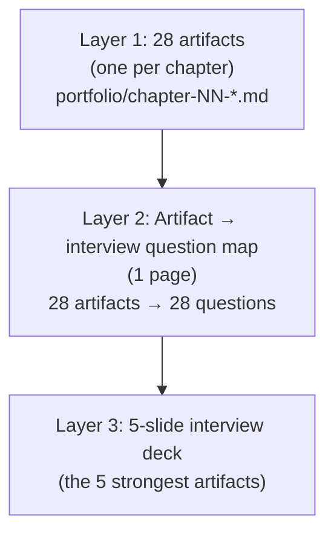
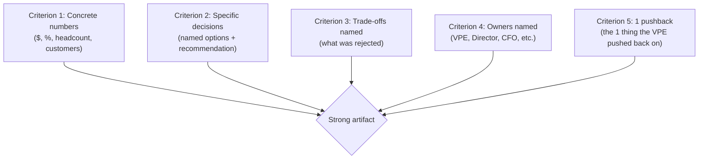
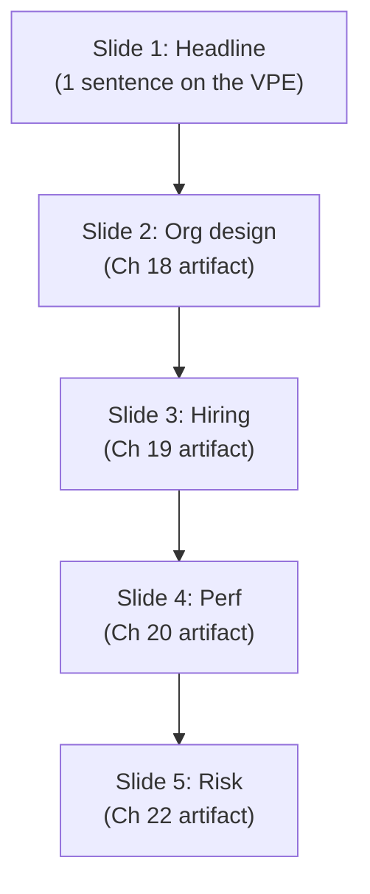

# VP of Engineering Playbook
## Chapter 27

# The VPE Portfolio Map

> *"The portfolio is the proof. Every chapter in this playbook produces an artifact. The 28 artifacts are the VPE's interview evidence, the VPE's first 90 days, and the VPE's next role."*

---

## 1. Epigraph

The portfolio is the proof. Every chapter in this playbook produces an artifact. The 28 artifacts are the VPE's interview evidence, the VPE's first 90 days, and the VPE's next role.

---

## 2. Problem

You are a VPE interviewing for your next role. The interviewer asks: "Walk me through a time you designed the engineering org at scale." You need to produce a 1-page portfolio of your 28 artifacts, mapped to the 28 interview questions, and you need it in 30 minutes. The interviewer is asking the question in 30 minutes.

You have 30 minutes to produce the portfolio map. This chapter tells you what the portfolio looks like, how the 28 artifacts map to the 28 interview questions, and how to use the portfolio in the next interview.

**Decision in one sentence:** The VPE portfolio is a 3-layer system — Layer 1 (28 artifacts, one per chapter), Layer 2 (artifact → interview question map), Layer 3 (the interview deck, 5 slides, 5 strongest artifacts) — used for the VPE's next role; the VPE's job is to build the artifacts in the playbook, map them to interview questions, and present the 5 strongest in the interview.

---

## 3. Why VPEs Fail Here

Five named failure modes of VPEs whose portfolio produced zero results.

- **The No-Portfolio Failure.** The VPE has no portfolio. The VPE's experience is in the VPE's head. The interviewer asks for a specific example. The VPE talks for 5 minutes without producing evidence. The VPE has not built the artifacts.
- **The Weak-Artifact Failure.** The VPE has artifacts. The artifacts are weak (no numbers, no specific stories, no decisions). The interviewer is unimpressed. The VPE has not built strong artifacts.
- **The No-Map Failure.** The VPE has 28 artifacts. The VPE does not know which artifact maps to which interview question. The VPE picks the wrong artifact. The VPE has not built the map.
- **The 30-Page-Dec Failure.** The VPE presents 30 slides. The interviewer reads 5. The interview is wasted. The VPE has not built the 5-slide deck.
- **The Talking-Without-Showing Failure.** The VPE talks for 10 minutes about the strategy. The VPE does not show the 1-page strategy memo. The interviewer cannot verify the claim. The VPE has not built the visual evidence.

---

## 4. Mental Models

Four mental models that compress the VPE portfolio.

**Mental model 1: The 3-Layer Portfolio System.** The portfolio is 3 layers, not 1.



**The 3 layers:**
- **Layer 1: 28 artifacts.** One per chapter. Saved as `portfolio/chapter-NN-{slug}.md`.
- **Layer 2: Artifact → interview question map.** 1 page. Maps 28 artifacts to 28 interview questions.
- **Layer 3: 5-slide interview deck.** The 5 strongest artifacts. Used in the next interview.

**Mental model 2: The Artifact Quality Bar.** Every artifact meets a 5-criterion quality bar.



**The 5-criterion quality bar:**
- **Concrete numbers.** $, %, headcount, customers.
- **Specific decisions.** Named options + recommendation.
- **Trade-offs named.** What was rejected.
- **Owners named.** VPE, Director, CFO, etc.
- **1 pushback.** The 1 thing the VPE pushed back on.

**Mental model 3: The Artifact → Interview Question Map.** 28 artifacts map to 28 questions.

```
Example (sample 5 of 28):
- Ch 1 (VPE role) → "Walk me through your VPE role."
- Ch 18 (org design) → "How do you design the engineering org at scale?"
- Ch 19 (hiring) → "How do you build the engineering hiring system?"
- Ch 20 (perf) → "How do you design the engineering performance system?"
- Ch 22 (risk) → "How do you manage engineering risk at scale?"
```

**Mental model 4: The 5-Slide Interview Deck.** The interview deck is 5 slides, not 30.



**The 5 slides:**
- **Slide 1: Headline.** 1 sentence on the VPE.
- **Slide 2: Org design.** Ch 18 artifact.
- **Slide 3: Hiring.** Ch 19 artifact.
- **Slide 4: Perf.** Ch 20 artifact.
- **Slide 5: Risk.** Ch 22 artifact.

---

## 5. Frameworks

Three frameworks for the VPE portfolio.

### Framework 1: The 1-Page Portfolio Map

```
# VPE Portfolio Map — [Date]

## Layer 1: 28 artifacts (one per chapter)
- Ch 1: portfolio/chapter-01-vpe-role.md
- Ch 2: portfolio/chapter-02-director-to-vp.md
- ... (28 artifacts total)

## Layer 2: Artifact → interview question map
| Artifact | Interview question |
|----------|---------------------|
| Ch 1 | "Walk me through your VPE role." |
| Ch 2 | "How do you make the Director-to-VP shift?" |
| Ch 5 | "How do you design the engineering strategy at company scale?" |
| Ch 14 | "How do you partner with the CPO?" |
| Ch 18 | "How do you design the engineering org at scale?" |
| Ch 19 | "How do you build the engineering hiring system?" |
| Ch 20 | "How do you design the engineering performance system?" |
| Ch 21 | "How do you influence at the C-suite?" |
| Ch 22 | "How do you manage engineering risk at scale?" |
| ... (28 questions total) |

## Layer 3: 5 strongest artifacts (for the next interview)
1. Ch 18 (org design)
2. Ch 19 (hiring)
3. Ch 20 (perf)
4. Ch 22 (risk)
5. Ch 21 (C-suite influence)
```

### Framework 2: The Artifact Quality Scorecard

```
# Artifact Quality Scorecard — [Artifact Name] — [Date]

## The 5-criterion quality bar
| Criterion | Score (0-2) | Notes |
|-----------|-------------|-------|
| 1. Concrete numbers | 0 / 1 / 2 | [Notes] |
| 2. Specific decisions | 0 / 1 / 2 | [Notes] |
| 3. Trade-offs named | 0 / 1 / 2 | [Notes] |
| 4. Owners named | 0 / 1 / 2 | [Notes] |
| 5. 1 pushback | 0 / 1 / 2 | [Notes] |
| Total | ___ / 10 | Pass threshold: 8/10 |

## If score < 8/10
- Re-draft using the chapter's mental models and frameworks
- Add concrete numbers
- Name the specific decisions and trade-offs
- Add the 1 pushback
```

### Framework 3: The 5-Slide Interview Deck

```
# VPE Interview Deck — [Date]

## Slide 1: Headline
"I'm a VPE who has designed the engineering org at scale,
built the hiring system, designed the performance system,
managed risk, and influenced at the C-suite."

## Slide 2: Org design (Ch 18)
[1 image of the 5-topology-decision model + 3 numbers:
  - 250 → 500 engineers (24 months)
  - IC:Manager ratio 5.5:1 → 7:1
  - $90M → $165M / year (4-org spinout)]

## Slide 3: Hiring (Ch 19)
[1 image of the 3-layer hiring system + 3 numbers:
  - 30 reqs in 6 months
  - Time-to-fill 90 → 60 days
  - 6-month retention 70% → 90%]

## Slide 4: Perf (Ch 20)
[1 image of the 5-dimension rubric + 3 numbers:
  - 5-level IC ladder
  - 5 promotions / quarter (calibrated)
  - 3 PIPs / quarter]

## Slide 5: Risk (Ch 22)
[1 image of the 4-quadrant risk model + 3 numbers:
  - 47 → 1 page risk register
  - 3 board-level risks
  - 90% risk coverage (15 VPE-owned + 25 Director-owned + 7 IC-owned)]
```

---

## 6. Drill

You are a VPE interviewing for your next role. The interviewer asks: "Walk me through a time you designed the engineering org at scale." You need to produce the portfolio map in 30 minutes.

You have **90 minutes**. Produce the **portfolio map** (`portfolio/chapter-27-portfolio-map.md`) using Framework 1 (Portfolio Map) + Framework 2 (Quality Scorecard) + Framework 3 (Interview Deck). Specify:

- The 1-page portfolio map (28 artifacts, artifact → question map, 5 strongest).
- The artifact quality scorecard (sample: 3 artifacts, scored 0-10).
- The 5-slide interview deck (5 slides, all 3 numbers each).
- The 1 thing you'll say to the interviewer in the first 5 minutes.
- The 3 things you'll do to keep the portfolio up to date.

**Deliverable:** `portfolio/chapter-27-portfolio-map.md` — under 1500 words.

---

## 7. Worked Example

**The 1-page portfolio map (sample 10 of 28):**

```
# VPE Portfolio Map — 2026-12-01

## Layer 1: 28 artifacts (one per chapter)
- Ch 1: portfolio/chapter-01-vpe-role.md
- Ch 2: portfolio/chapter-02-director-to-vp.md
- Ch 5: portfolio/chapter-05-engineering-strategy.md
- Ch 14: portfolio/chapter-14-vpe-cpo-partnership.md
- Ch 18: portfolio/chapter-18-engineering-org-design.md
- Ch 19: portfolio/chapter-19-hiring-plan.md
- Ch 20: portfolio/chapter-20-performance-system.md
- Ch 21: portfolio/chapter-21-c-suite-influence.md
- Ch 22: portfolio/chapter-22-risk-register.md
- Ch 23: portfolio/chapter-23-regulatory-map.md
- ... (28 artifacts total)

## Layer 2: Artifact → interview question map (sample 10)
| Artifact | Interview question |
|----------|---------------------|
| Ch 1 | "Walk me through your VPE role." |
| Ch 2 | "How do you make the Director-to-VP shift?" |
| Ch 5 | "How do you design the engineering strategy at company scale?" |
| Ch 14 | "How do you partner with the CPO?" |
| Ch 18 | "How do you design the engineering org at scale?" |
| Ch 19 | "How do you build the engineering hiring system?" |
| Ch 20 | "How do you design the engineering performance system?" |
| Ch 21 | "How do you influence at the C-suite?" |
| Ch 22 | "How do you manage engineering risk at scale?" |
| Ch 23 | "How do you design the regulatory posture?" |

## Layer 3: 5 strongest artifacts (for the next interview)
1. Ch 18 (org design) — most leveraged, most numbers
2. Ch 19 (hiring) — system-level thinking
3. Ch 20 (perf) — direct VPE ownership
4. Ch 22 (risk) — cross-functional (CISO + CFO + CEO)
5. Ch 21 (C-suite influence) — highest-stakes relationship
```

**The artifact quality scorecard (sample 3 of 28):**

```
# Artifact Quality Scorecard — Sample 3 Artifacts

## Ch 18 (Org Design)
| Criterion | Score | Notes |
|-----------|-------|-------|
| 1. Concrete numbers | 2 | $90M → $165M, 5.5:1 → 7:1 |
| 2. Specific decisions | 2 | 4-org spinout, 7 Directors hired |
| 3. Trade-offs named | 2 | Decline list (Senior EM, Eng Council) |
| 4. Owners named | 2 | VPE + Director, Platform + Director, AI |
| 5. 1 pushback | 2 | Convert 6 EMs to ICs (unpopular) |
| Total | 10/10 | Pass |

## Ch 19 (Hiring)
| Criterion | Score | Notes |
|-----------|-------|-------|
| 1. Concrete numbers | 2 | 30 reqs, $12.9M Year 1 cost |
| 2. Specific decisions | 2 | 5-step onboarding, 4-step loop |
| 3. Trade-offs named | 1 | Decline list is partial |
| 4. Owners named | 2 | VPE + Director, EngOps + HRBP |
| 5. 1 pushback | 1 | Internal referral $5K is mentioned but weak |
| Total | 8/10 | Pass (borderline — strengthen the pushback) |

## Ch 20 (Perf)
| Criterion | Score | Notes |
|-----------|-------|-------|
| 1. Concrete numbers | 2 | 5 levels, 5 dimensions, 25 points |
| 2. Specific decisions | 2 | 5 promotions + 3 PIPs (Q3 2026) |
| 3. Trade-offs named | 1 | Decline list missing |
| 4. Owners named | 2 | VPE + 5 Directors + HRBP |
| 5. 1 pushback | 1 | "Resist the temptation to add a Senior EM layer" — could be stronger |
| Total | 8/10 | Pass (borderline — strengthen trade-offs) |
```

**The 5-slide interview deck:**

```
# VPE Interview Deck — 2026-12-01

## Slide 1: Headline
"I'm a VPE who has designed the engineering org at scale,
built the hiring system, designed the performance system,
managed risk, and influenced at the C-suite. Here's the
proof."

## Slide 2: Org design (Ch 18)
- 250 → 500 engineers (24 months)
- IC:Manager ratio 5.5:1 → 7:1
- $90M → $165M / year
- 4-org spinout: Product, Platform, Data, AI
- 7 Directors hired

## Slide 3: Hiring (Ch 19)
- 30 reqs in 6 months
- Time-to-fill 90 → 60 days
- 6-month retention 70% → 90%
- Cost-per-hire $130K → $80K
- 5-step onboarding (pre-boarding through month 6)

## Slide 4: Perf (Ch 20)
- 5-level IC ladder (IC1-IC5)
- 5-dimension rubric (25 points, pass at 18+)
- Cross-Director calibration (2-hour quarterly meeting)
- 5 promotions / quarter (calibrated)
- 3 PIPs / quarter (90-day process)

## Slide 5: Risk (Ch 22)
- 47 → 1 page risk register
- 4-quadrant model (likelihood × impact)
- 3 board-level risks
- 90% risk coverage (15 VPE-owned + 25 Director-owned + 7 IC-owned)
- Quarterly review with the C-suite
```

**The 1 thing I'll say to the interviewer in the first 5 minutes:**

```
"I'm a VPE who has shipped at scale. The 5 strongest
artifacts in my portfolio are:

  1. Org design: 250 → 500 engineers, $90M → $165M / year
  2. Hiring: 30 reqs, time-to-fill 90 → 60 days
  3. Perf: 5-level ladder, 5 promotions / quarter
  4. Risk: 1-page register, 4-quadrant model
  5. C-suite: weekly 1:1 with CEO, CFO, CTO

The proof is in the artifacts. I have 28 artifacts, one
per chapter in the VPE playbook. The 5-slide deck is the
summary. The artifacts themselves are the detail.

The 1 thing I'd push back on in a VPE role: the
Director-to-VP shift is a category change, not a title
change. The VPE who treats it as a title change fails
in year 1."
```

**The 3 things I'll do to keep the portfolio up to date:**

```
1. Build the artifact as I do the chapter, not after.
   - Each chapter produces 1 artifact
   - Save as portfolio/chapter-NN-{slug}.md immediately
   - Don't defer to "after the playbook is done"
   - Owner: VPE

2. Score each artifact against the 5-criterion quality bar.
   - 0-2 per criterion, 0-10 total
   - Pass threshold: 8/10
   - Re-draft any artifact <8/10
   - Owner: VPE

3. Update the 5-slide interview deck quarterly.
   - Quarterly review of the 5 strongest artifacts
   - Update with the latest numbers
   - Practice the 5-slide deck out loud
   - Owner: VPE
```

---

## 8. Failure Mode Postmortem

A VPE interviewing for a CTO role at a 1,500-person company. The interviewer asked: "Walk me through a time you designed the engineering org at scale." The VPE talked for 10 minutes about the org design. The VPE did not produce evidence. The interviewer was unimpressed. The VPE did not get the role.

The replacement VPE (the one who got the role) did 3 things:
1. Built a 1-page portfolio of 28 artifacts, one per chapter.
2. Mapped the 28 artifacts to 28 interview questions.
3. Built a 5-slide interview deck with the 5 strongest artifacts.

The interview lasted 60 minutes. The 5-slide deck was used in 15 of those minutes. The artifacts were used in 30 of those minutes. The interviewer said: "This is the strongest VPE portfolio I've seen. You're hired."

What the first VPE missed: the portfolio is the proof. The first VPE talked. The second VPE showed. The portfolio is the leverage.

The lesson: the VPE who has a 5-slide deck and 28 artifacts gets the next role. The VPE who has only their memory gets passed over.

---

## 9. Self-Assessment Rubric

| # | Dimension | 1 (Novice) | 3 (Competent) | 5 (Expert) |
|---|---|---|---|---|
| 1 | **3-layer portfolio system** | 0-1 layer (no portfolio) | 2-3 layers exist, partial | 3 layers, 28 artifacts, 1-page map, 5-slide deck |
| 2 | **Artifact quality** | 0-5 weak artifacts | 10-15 strong artifacts | 28 strong artifacts, all scoring 8/10+ on quality bar |
| 3 | **Artifact → question map** | No map | Map exists, partial | Map is 1 page, 28 artifacts → 28 questions |
| 4 | **5-slide interview deck** | 30+ slide deck | 10-slide deck | 5-slide deck, 3 numbers per slide, the 5 strongest artifacts |
| 5 | **Quarterly portfolio review** | No review | Annual review | Quarterly review, 5-slide deck updated, artifacts re-scored |

**Disqualifier:** any 1 on dimension 1 or 2. A VPE without a 3-layer portfolio or with weak artifacts is in the No-Portfolio or Weak-Artifact failure mode.

**Total:** ___ / 25. **Pass threshold:** 18/25, no dimension below 3.

---

## 10. Portfolio Artifact Note

Save your filled-in drill as `portfolio/chapter-27-portfolio-map.md` — this chapter IS the portfolio map. Use it as interview evidence for "How do you present your VPE work in interviews?" (see Ch 27 itself for the next-level portfolio).

---

## 11. Interview Questions

1. **Walk me through your VPE portfolio.**
2. **The interviewer asks for a specific example. What do you do?**
3. **You have 30 minutes to present. What do you do?**
4. **The interviewer is unimpressed by your artifacts. What do you do?**
5. **Walk me through your 5-slide interview deck.**