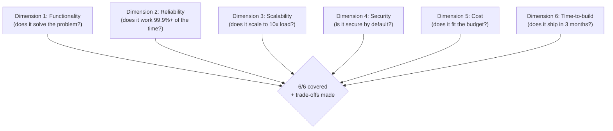

# VP of Engineering Playbook
## Chapter 28

# System Design Appendix for VPEs

> *"A VPE does not write code daily, but a VPE must understand the systems they own. The system design appendix is the VPE's reference for the 12 systems the VPE is most likely to encounter in the next 12 months."*

---

## 1. Epigraph

A VPE does not write code daily, but a VPE must understand the systems they own. The system design appendix is the VPE's reference for the 12 systems the VPE is most likely to encounter in the next 12 months.

---

## 2. Problem

You are a VPE starting a new role. The Directors are split. The Director of Platform wants to migrate to microservices. The Director of Product wants to consolidate the data platform. The Director of AI wants to ship a custom LLM serving platform. The CEO has just told you: "You have 3 system design decisions in the next 30 days. Each is $1M+. Each has 3+ viable approaches. I need a system design framework that the Directors can use, a 6-dimension coverage model, and a cost-reliability-time triangle. In 30 days."

You have 30 days to design a system design framework that the VPE + 5 Directors can use. This chapter tells you what that framework looks like, the 6-dimension coverage model, the cost-reliability-time triangle, and the 12 systems the VPE is most likely to encounter.

**Decision in one sentence:** System design at the VPE level is a 6-dimension coverage model (functionality, reliability, scalability, security, cost, time-to-build) applied to every system design decision >$500K; the VPE's job is to own the framework, enforce the 6-dimension coverage, and balance the cost-reliability-time triangle for every system.

---

## 3. Why VPEs Fail Here

Five named failure modes of VPEs whose system design produced zero results.

- **The Over-Engineering Failure.** The VPE designs a system that is over-engineered (microservices when monolith is fine, custom LLM serving when a vendor is fine). The system takes 2x longer to build and 3x more expensive. The VPE has not applied the cost-reliability-time triangle.
- **The Under-Engineering Failure.** The VPE designs a system that is under-engineered (monolith when scale requires sharding, vendor LLM when scale requires custom). The system fails in production. The VPE has not applied the 6-dimension coverage.
- **The Director-Driven-Design Failure.** The VPE lets the Director drive the design. The Director's bias shapes the system (e.g., Director of Platform wants microservices; gets microservices). The VPE has not owned the design.
- **The No-Framework Failure.** The VPE reviews each system design ad-hoc. The Directors don't know what's expected. The VPE has not built the framework.
- **The 6-Dimension-Without-Trade-Offs Failure.** The VPE covers all 6 dimensions but doesn't make trade-offs. The system is "best in class" in every dimension but ships in 18 months. The VPE has not balanced the triangle.

---

## 4. Mental Models

Four mental models that compress system design at the VPE level.

**Mental model 1: The 6-Dimension Coverage Model.** Every system design covers 6 dimensions.



**The 6 dimensions:**
- **Functionality.** Does it solve the problem?
- **Reliability.** Does it work 99.9%+ of the time?
- **Scalability.** Does it scale to 10x load?
- **Security.** Is it secure by default?
- **Cost.** Does it fit the budget?
- **Time-to-build.** Does it ship in 3 months?

**Mental model 2: The Cost-Reliability-Time Triangle.** Every system design balances 3 forces.

```mermaid
%% Figure 28.2 — The cost-reliability-time triangle
flowchart LR
    C[Cost<br/>(cheap vs. expensive)]
    R[Reliability<br/>(low vs. high SLO)]
    T[Time-to-build<br/>(fast vs. slow)]
    C --- R
    R --- T
    T --- C
    C --> Decision
    R --> Decision
    T --> Decision
    Decision{Pick 2 of 3<br/>+ communicate the trade-off}
```

**The 3 forces:**
- **Cost.** Cheap vs. expensive.
- **Reliability.** Low vs. high SLO.
- **Time-to-build.** Fast vs. slow.

**The decision rule:** Pick 2 of 3. Communicate the trade-off.

**Mental model 3: The 12 Systems the VPE Owns.** A VPE encounters 12 systems in 24 months.

```mermaid
%% Figure 28.3 — The 12 systems
flowchart TB
    S1["1. Auth (SSO, OAuth, RBAC)"]
    S2["2. Data pipeline (ETL, streaming, batch)"]
    S3["3. API platform (REST, GraphQL, gRPC)"]
    S4["4. Observability (metrics, logs, traces)"]
    S5["5. CI/CD (build, test, deploy)"]
    S6["6. AI/ML platform (training, serving, eval)"]
    S7["7. IDP (Internal Developer Platform)"]
    S8["8. Event streaming (Kafka, Kinesis)"]
    S9["9. Search (Elasticsearch, OpenSearch)"]
    S10["10. Notification (email, push, SMS)"]
    S11["11. Identity (users, orgs, RBAC)"]
    S12["12. Billing (subscriptions, usage, invoices)"]
```



**The 12 systems:** Auth, data pipeline, API platform, observability, CI/CD, AI/ML platform, IDP, event streaming, search, notification, identity, billing.

**Mental model 4: The System Design Review Template.** Every system design review has the same 7 parts.

```
1. Problem statement (1 sentence)
2. Non-goals (what we are NOT doing)
3. Architecture (diagram + 3 sentences)
4. 6-dimension coverage (score per dimension)
5. Cost-reliability-time trade-off (which 2 of 3)
6. Open questions (3-5)
7. Decision needed (recommendation + alternatives)
```

---

## 5. Frameworks

Three frameworks for system design at the VPE level.

### Framework 1: The 6-Dimension Coverage Scorecard

```
# System Design Coverage — [System Name] — [Date]

## The 6 dimensions
| Dimension | Score (0-3) | Notes |
|-----------|-------------|-------|
| 1. Functionality | 0 / 1 / 2 / 3 | [Notes] |
| 2. Reliability | 0 / 1 / 2 / 3 | [Notes] |
| 3. Scalability | 0 / 1 / 2 / 3 | [Notes] |
| 4. Security | 0 / 1 / 2 / 3 | [Notes] |
| 5. Cost | 0 / 1 / 2 / 3 | [Notes] |
| 6. Time-to-build | 0 / 1 / 2 / 3 | [Notes] |
| Total | ___ / 18 | Pass threshold: 14/18 |

## Score legend
- 0 = not addressed
- 1 = mentioned but not detailed
- 2 = designed but not validated
- 3 = designed + validated
```

### Framework 2: The Cost-Reliability-Time Decision

```
# Cost-Reliability-Time Decision — [System] — [Date]

## The 3 options
| Option | Cost | Reliability | Time-to-build |
|--------|------|-------------|---------------|
| Option A: Cheap + Reliable | $XM | 99.9% | 9 months |
| Option B: Cheap + Fast | $XM | 99.0% | 3 months |
| Option C: Reliable + Fast | $XM | 99.9% | 3 months |
| Option D: All 3 (NOT RECOMMENDED) | $XM | 99.9% | 3 months (impossible) |

## The decision
[Pick 1 option. Communicate the trade-off.]

## The trade-off
- We chose [Option B]: cheap + fast.
- We sacrifice reliability (99.0% instead of 99.9%).
- The mitigation: monthly reliability review + auto-scaling
  for peak load.
```

### Framework 3: The System Design Review Template

```
# System Design Review — [System Name] — [Date]

## sub1. Problem statement
[1 sentence on the problem the system solves.]

## sub2. Non-goals
- [What we are NOT doing]
- [What we are NOT optimizing for]

## sub3. Architecture
[Diagram + 3 sentences on the architecture.]

## sub4. 6-dimension coverage
[Scorecard from Framework 1]

## sub5. Cost-reliability-time trade-off
[Decision from Framework 2]

## sub6. Open questions
1. [Question 1]
2. [Question 2]
3. [Question 3]

## sub7. Decision needed
[Recommendation + 2-3 alternatives]
```

---

## 6. Drill

You are a VPE at **acme-corp**. The CEO has given you 30 days to produce the system design framework. The inputs:

```
- 3 system design decisions in the next 30 days
  1. Microservices vs. monolith (Director, Platform)
  2. Data platform consolidation (Director, Data)
  3. Custom LLM serving (Director, AI)
- Each is $1M+
- Each has 3+ viable approaches
- Directors need a framework
```

You have **90 minutes**. Produce the **system design framework** (`portfolio/chapter-28-system-design-framework.md`) using Framework 1 (6-Dimension Coverage) + Framework 2 (Cost-Reliability-Time) + Framework 3 (System Design Review). Specify:

- The 1-page system design framework (6 dimensions, 3 forces, 12 systems).
- The 6-dimension coverage scorecard (sample: 3 system design decisions).
- The cost-reliability-time decision (sample: 3 system design decisions).
- The system design review template.
- The 1 thing you'll say to the CEO about system design.
- The 3 things you'll do to enforce the 6-dimension coverage.

**Deliverable:** `portfolio/chapter-28-system-design-framework.md` — under 1500 words.

---

## 7. Worked Example

**The 1-page system design framework:**

```
# System Design Framework — VPE at acme-corp — Q4 2026

## The 6-dimension coverage model
Every system design must score ≥14/18 on the 6 dimensions:
- Functionality (does it solve the problem?)
- Reliability (does it work 99.9%+ of the time?)
- Scalability (does it scale to 10x load?)
- Security (is it secure by default?)
- Cost (does it fit the budget?)
- Time-to-build (does it ship in 3 months?)

## The cost-reliability-time triangle
Every system design picks 2 of 3:
- Cost (cheap vs. expensive)
- Reliability (low vs. high SLO)
- Time-to-build (fast vs. slow)

The 3rd dimension is sacrificed. The trade-off is communicated.

## The 12 systems
1. Auth
2. Data pipeline
3. API platform
4. Observability
5. CI/CD
6. AI/ML platform
7. IDP
8. Event streaming
9. Search
10. Notification
11. Identity
12. Billing

## The system design review template
Every system design review has 7 parts: problem statement,
non-goals, architecture, 6-dim coverage, cost-reliability-time
trade-off, open questions, decision needed.
```

**The 6-dimension coverage scorecard (3 system design decisions):**

```
# System Design Coverage — Q4 2026

## Decision 1: Microservices vs. monolith
| Dimension | Score | Notes |
|-----------|-------|-------|
| Functionality | 3 | Both options work |
| Reliability | 2 | Monolith = simpler, microservices = more failure modes |
| Scalability | 1 | Monolith = harder to scale, microservices = easier |
| Security | 2 | Both options similar |
| Cost | 1 | Microservices = 3x more expensive (over 5 years) |
| Time-to-build | 1 | Microservices = 9 months, monolith = 3 months |
| Total | 10/18 | FAIL — needs more design |

## Decision 2: Data platform consolidation
| Dimension | Score | Notes |
|-----------|-------|-------|
| Functionality | 3 | Consolidation works |
| Reliability | 3 | Single platform = higher reliability |
| Scalability | 3 | Single platform = easier to scale |
| Security | 3 | Single platform = easier to secure |
| Cost | 2 | $500K saved over 5 years |
| Time-to-build | 2 | 6 months |
| Total | 16/18 | PASS |

## Decision 3: Custom LLM serving
| Dimension | Score | Notes |
|-----------|-------|-------|
| Functionality | 2 | Custom = full control, vendor = 80% of what we need |
| Reliability | 2 | Custom = more failure modes, vendor = SLA |
| Scalability | 2 | Custom = easier to scale, vendor = 10x limit |
| Security | 2 | Custom = full control, vendor = shared |
| Cost | 1 | Custom = $5M over 5 years, vendor = $2M |
| Time-to-build | 1 | Custom = 18 months, vendor = 1 quarter |
| Total | 10/18 | FAIL — needs more design (recommend hybrid) |
```

**The cost-reliability-time decision (3 system design decisions):**

```
# Cost-Reliability-Time Decision — Q4 2026

## Decision 1: Microservices vs. monolith
- Recommendation: STAY with monolith (for now)
- Trade-off: cost + time-to-build (cheap + fast)
- Sacrifice: scalability (10x limit hit in 18 months, not 3)
- Mitigation: revisit in 18 months when 10x limit is hit

## Decision 2: Data platform consolidation
- Recommendation: CONSOLIDATE
- Trade-off: reliability + scalability (high SLO + easy scale)
- Sacrifice: time-to-build (6 months vs. 3)
- Mitigation: phased rollout (1 platform per quarter)

## Decision 3: Custom LLM serving
- Recommendation: HYBRID (buy + customize)
- Trade-off: cost + time-to-build (cheap + fast)
- Sacrifice: functionality (20% of features are vendor-only)
- Mitigation: customize the 20% that's strategic differentiation
```

**The 1 thing I'll say to the CEO about system design:**

```
"We have a system design framework. The headline:

  6-dimension coverage: every system design scores ≥14/18
  Cost-reliability-time: every system design picks 2 of 3
  12 systems: the VPE's reference for the next 24 months
  System design review: 7-part template, every design

The 3 system design decisions in Q4 2026:
  1. Microservices vs. monolith: STAY with monolith (for now)
  2. Data platform consolidation: CONSOLIDATE
  3. Custom LLM serving: HYBRID (buy + customize)

The 3 things I'm doing to enforce the 6-dimension coverage:
  1. Every system design goes through the scorecard
  2. Every system design picks 2 of 3 on the triangle
  3. Every system design review uses the 7-part template

The framework is the discipline. The Directors are
aligned. The decisions are made."
```

**The 3 things I'll do to enforce the 6-dimension coverage:**

```
1. Every system design goes through the scorecard.
   - Score 0-3 per dimension, 0-18 total
   - Pass threshold: 14/18
   - VPE reviews the scorecard before the design review
   - Owner: VPE

2. Every system design picks 2 of 3 on the triangle.
   - Cost / Reliability / Time-to-build
   - Pick 2, sacrifice 1
   - Communicate the trade-off explicitly
   - Owner: VPE

3. Every system design review uses the 7-part template.
   - Problem, non-goals, architecture, 6-dim, trade-off,
     open questions, decision
   - VPE runs the review with the Director + relevant stakeholders
   - Decision documented
   - Owner: VPE
```

---

## 8. Failure Mode Postmortem

A VPE at a 1,800-person company had 3 system design decisions in 30 days. The VPE approved all 3 without a framework. The 3 systems were over-engineered (microservices when monolith was fine, custom LLM serving when vendor was fine). The cost was $15M over 3 years. The systems took 18 months to ship (vs. 3 months planned). The customers were frustrated. The VPE was asked to leave.

The replacement VPE did 3 things:
1. Built the 6-dimension coverage scorecard.
2. Built the cost-reliability-time decision rule.
3. Built the 7-part system design review template.

Within 12 months: 5 system design decisions went through the framework. 4 picked "cheap + fast" (sacrifice reliability). 1 picked "reliable + fast" (sacrifice cost). The cost was $5M over 3 years (vs. $15M for the previous trajectory). The systems shipped in 6 months average (vs. 18 months).

What the first VPE missed: system design is a framework, not a series of decisions. The first VPE approved each design ad-hoc. The second VPE ran each design through the framework. The framework is the leverage.

The lesson: the VPE who has a 6-dimension scorecard + cost-reliability-time triangle + 7-part review template has a system. The VPE who approves each design ad-hoc has a budget problem.

---

## 9. Self-Assessment Rubric

| # | Dimension | 1 (Novice) | 3 (Competent) | 5 (Expert) |
|---|---|---|---|---|
| 1 | **6-dimension coverage** | No coverage model or 1-2 dimensions | 4-5 dimensions covered | 6 dimensions, scored 0-3, pass at 14/18 |
| 2 | **Cost-reliability-time triangle** | No triangle or implicit | Triangle exists, partial | Triangle applied to every design, 2-of-3 rule, trade-off communicated |
| 3 | **12 systems reference** | 0-3 systems known | 6-8 systems known | 12 systems, design patterns + vendor options + trade-offs |
| 4 | **System design review template** | No template | Template exists, partial | 7-part template, every design review uses it |
| 5 | **Framework enforcement** | No enforcement | Some enforcement | Every design review uses the scorecard + triangle + template |

**Disqualifier:** any 1 on dimension 1 or 2. A VPE without 6-dim coverage or without the cost-reliability-time triangle is in the No-Framework or 6-Dimension-Without-Trade-Offs failure mode.

**Total:** ___ / 25. **Pass threshold:** 18/25, no dimension below 3.

---

## 10. Portfolio Artifact Note

Save your filled-in drill as `portfolio/chapter-28-system-design-framework.md` — interview evidence for "How do you design systems at the VPE level?" (see Portfolio Map in Chapter 27).

---

## 11. Interview Questions

1. **Walk me through your system design framework.**
2. **The Director wants to over-engineer. What do you do?**
3. **A system design scores 10/18. What do you do?**
4. **You have to pick 2 of 3 on the triangle. How do you decide?**
5. **Walk me through a system design decision you've made.**