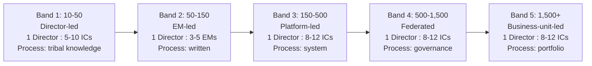

# VP of Engineering Playbook
## Chapter 4

# The Engineering Org at Scale

> *"The org shape that worked at 50 engineers is the org shape that fails at 250. The VPE's job is to see the scale transition before it kills the company."*

---

## 1. Epigraph

The org shape that worked at 50 engineers is the org shape that fails at 250. The VPE's job is to see the scale transition before it kills the company.

---

## 2. Problem

You are the VPE at a 1,200-person company. The engineering org has been growing 30%/year for the last 3 years. You have 250 engineers. The org chart looks like a sprawl: 5 Directors, 18 EMs, 250 ICs, no platform team, 8 product teams each maintaining their own CI/CD, observability, and auth. Velocity is dropping. The CEO has asked: "Why are we slower than we were at 150 engineers?" The honest answer is: the org shape that worked at 150 is the org shape that is failing at 250. This chapter is about the 5 scale transitions every VPE must navigate.

**Decision in one sentence:** An engineering org at scale is a set of predictable transitions (50 → 100 → 250 → 500 → 1,000 engineers) — each transition requires a different org shape, a different leadership structure, and a different set of processes; the VPE's job is to see the transition coming and design the new shape before the old one breaks.

---

## 3. Why VPEs Fail Here

Five named failure modes of VPEs who missed the scale transition.

- **The "More of the Same" Trap.** The VPE hires 50 more engineers into the existing org shape. The org shape that worked at 50 is now drowning at 200. The VPE has more engineers but ships less. The VPE's instinct is "we need more people" when the right answer is "we need a different shape."
- **The Director-Org Failure.** The VPE has 5 Directors, 18 EMs, and 250 ICs. The Director:IC ratio is 1:50. Each Director is a single point of failure for 50 engineers. When a Director is on vacation, sick, or leaves, 50 engineers stall. The VPE has not designed for scale.
- **The Process-Overhead Failure.** The VPE adds process to manage the complexity. The process overhead slows decisions, makes the org slower, and frustrates the ICs. The VPE has added process without removing process. The org is now slow AND bureaucratic.
- **The Platform-Absent Failure.** The VPE has 8 product teams each maintaining their own platform. 30% of each team's capacity is "platform work." The VPE has not invested in a platform team. The product org is paying the cost.
- **The Hiring-Funnel-Failure.** The VPE is hiring 50 engineers/year but the funnel produces 30. The VPE blames the recruiters. The VPE has not designed the org to be hireable — no career ladder, no clear comp, no onboarding, no retention plan. The funnel is the org design's problem, not the recruiters' problem.

---

## 4. Mental Models

Four mental models that compress scale transitions into something you can defend.

**Mental model 1: The 5 Scale Bands.** Engineering orgs evolve through 5 scale bands. Each band has a different shape, a different leadership ratio, and a different set of processes.



**The transition triggers** (the VPE's early-warning signs):
- 50 → 100: The Director can't run 1:1s with everyone. Hire the first EMs.
- 100 → 250: The product teams are duplicating platform work. Stand up the platform team.
- 250 → 500: The Directors are bottlenecked. Federate decisions. Hire senior Directors.
- 500 → 1,500: The Directors are running business units. Establish governance.

**Mental model 2: The Director:IC Ratio.** A well-designed engineering org at scale has a Director:IC ratio of 1:8-12. Above 1:15, the Director is a single point of failure. Below 1:6, the org is over-managed.

```
Director:IC ratio by scale band:

  10-50:    1:5 to 1:10   (Director-led, every IC is known)
  50-150:   1:8 to 1:12  (EM-led, Director:EM:IC = 1:3-5:8-12)
  150-500:  1:8 to 1:12  (Platform-led, same ratio, more layers)
  500-1,500: 1:8 to 1:12 (Federated, same ratio, more Directors)
  1,500+:   1:8 to 1:12  (Business-unit, same ratio, business-unit VP)

The ratio is constant. The number of layers grows.
```

**Mental model 3: The Scale-Symptom Diagnostic.** When the org is at the wrong scale band, the symptoms are predictable. The VPE learns to recognize them.

```
Symptom 1: "We have too many meetings."
  Cause: The Directors are still trying to make every decision.
  Diagnosis: Org is at 250 but Directors are running 1:1s with EMs
            on every project.
  Fix: Federate. Directors own their domain, not every domain.

Symptom 2: "We're shipping less than we did last year."
  Cause: Org is at 250 but team structure is still 50-engineer.
  Diagnosis: Director:IC ratio is 1:50. Each Director is overloaded.
  Fix: Hire 2-3 senior Directors. Move to 1:10 ratio.

Symptom 3: "We have 3 CI/CD pipelines and they don't talk."
  Cause: Org is at 250 but no platform team.
  Diagnosis: Each product team maintains its own platform. 30% of
            each team's capacity is platform work.
  Fix: Stand up a 4-person platform team. Adopt 80% of teams onto
       shared platform in 12 months.

Symptom 4: "Our senior engineers are leaving for the same title."
  Cause: Org is at 250 but career ladder is designed for 50.
  Diagnosis: IC3 (Senior) at 50 engineers is a top-3 role. IC3 at
            250 engineers is a median role. Senior engineers don't
            get more scope.
  Fix: Add IC4 (Staff) and IC5 (Principal) levels. New scope for
       top performers.

Symptom 5: "The new VP is the second to leave in 18 months."
  Cause: The VPE seat is unstable because the org design doesn't
         support the VPE.
  Diagnosis: The VPE seat is treated as a Director with a bigger
            team. The VPE doesn't have a peer group, doesn't have
            a board, doesn't have governance.
  Fix: Stand up the VPE infrastructure (peer group, board, governance).
       See Ch 21.
```

**Mental model 4: The Time-to-Scale-Trap.** Most VPEs see the scale transition 6-12 months too late. The org shape that worked at 150 starts to break at 200; the VPE recognizes it at 250.

```
Time-to-scale-trap:

  0 months:    Org is at 150. VPE inherits the org shape.
  6 months:    Org is at 200. Symptoms begin.
  12 months:   Org is at 250. VPE recognizes the symptoms.
  18 months:   VPE proposes a new org shape.
  24 months:   VPE implements the new org shape.
  30 months:   New org shape is settled.
  36 months:   Org is at 350. New symptoms begin.

The trap: by the time the new shape is settled (30 months), the
org is already 50% bigger than when the symptoms began. The VPE
is always 6-12 months behind.

The fix: design the new shape 6 months BEFORE the symptoms begin.
A VPE who plans the 250 shape at 150 ships a smooth transition.
A VPE who plans the 250 shape at 250 ships a 2-year disruption.
```

---

## 5. Frameworks

Three frameworks for the scale transitions.

### Framework 1: The Scale-Band Diagnostic

For each scale band, the VPE runs a 5-question diagnostic.

```
Scale Band: ___ (10-50, 50-150, 150-500, 500-1,500, 1,500+)

1. Director:IC ratio:  ___ : 1
   (Target: 1:8-12 at all bands above 50.)

2. Platform team size as % of total eng:  ___ %
   (Target: 8-12% at bands 150+.)

3. % of product-team capacity on platform work:  ___ %
   (Target: <10% at bands 150+. If higher, no platform team.)

4. Number of layers between IC and CEO:  ___
   (Target: 4-5 at bands 150+. If more, too many layers.
    If fewer, not enough.)

5. Career ladder has how many IC levels?  ___
   (Target: 4-5 at bands 250+. If 3 or fewer, ladder is too flat.)
```

### Framework 2: The Transition Plan

When the VPE sees the next scale transition coming, the VPE designs the transition 6-12 months before the symptoms hit.

```
Current band: ___
Next band: ___
Trigger to plan transition: 6 months before symptoms begin.
Trigger to execute: when symptoms begin.
Trigger to settle: 12 months after execute.

Example:
  Current: 150 engineers (Band 2)
  Next: 250 engineers (Band 3)
  Plan transition at: 175 engineers (90 days out)
  Execute at: 200 engineers (symptoms begin)
  Settle at: 250 engineers (12 months after execute)

The transition plan includes:
  - 1-page diagnosis of why the current shape will fail
  - 1-page design of the new shape
  - 1-page change-management plan (how to communicate the change)
  - 1-page budget plan (new hires, new roles, new comp)
  - 1-page risk plan (what could go wrong)
```

### Framework 3: The Org-Shape Review (Quarterly)

Every quarter, the VPE runs a 60-minute org-shape review with the Directors. The review answers 5 questions.

```
1. What is the current Director:IC ratio per team?
   (If any team is >1:15, the VPE has a Director bottleneck.)

2. What is the current platform-team capacity?
   (If <8% of total eng, the VPE has a platform bottleneck.)

3. What is the current attrition rate per team?
   (If any team is >20%/year, the VPE has a retention problem.)

4. What is the current hiring funnel conversion?
   (If <30% reqs-to-hire, the VPE has a hiring funnel problem.)

5. What is the current cycle time per team?
   (If any team has cycle time >2x the average, the VPE has a
    process problem.)
```

---

## 6. Drill

You are the VPE at **acme-corp**. The engineering org has 250 engineers. The Director:IC ratio is 1:50 (5 Directors, 250 ICs). There is no platform team. 8 product teams each maintain their own CI/CD, observability, and auth. Velocity has dropped 30% over the last 6 months. The CEO has asked: "Why are we slower than we were at 150?"

You have **90 minutes**. Produce a **scale-transition plan** (`portfolio/chapter-04-scale-transition-plan.md`) using Framework 1 (Scale-Band Diagnostic) + Framework 2 (Transition Plan) + Framework 3 (Org-Shape Review). Specify:

- The 5-question diagnostic (current state).
- The 1-page diagnosis of why the current shape is failing.
- The 1-page design of the new shape (target: 250 engineers, Band 3).
- The 1-page change-management plan.
- The 1-page budget plan (new hires, new comp).
- The 1 quarterly org-shape review (the first 60-min meeting).

**Deliverable:** `portfolio/chapter-04-scale-transition-plan.md` — under 1500 words.

---

## 7. Worked Example

**The 5-question diagnostic (current state at acme-corp):**

```
Scale Band: 150-500 (Band 3), 250 engineers

1. Director:IC ratio:  1:50  (target 1:8-12, FAIL)
2. Platform team:  0 engineers  (target 8-12%, FAIL)
3. % product capacity on platform:  30%  (target <10%, FAIL)
4. Layers IC-to-CEO:  3  (target 4-5, FAIL)
5. Career ladder IC levels:  3  (target 4-5, FAIL)
```

**The 1-page diagnosis (why the current shape is failing):**

```
The org is at 250 engineers but designed for 50. Symptoms:

1. Director bottleneck: 5 Directors, 50 ICs each. Each Director
   runs 50 1:1s, makes 50 architecture decisions, and reviews
   50 hire packets. They are the single point of failure for
   50 engineers.

2. Platform absence: 8 product teams, 8 CI/CD pipelines, 8
   observability stacks, 8 auth implementations. 30% of each
   team's capacity is platform work. At 8 teams, that's 60
   engineer-years of platform work per year — duplicated 8 times.

3. Career ladder flat: IC3 (Senior) is the top of the ladder.
   Senior engineers leave because there's nowhere to grow.
   Attrition at the senior level is 35%.

4. Process overhead: The Directors are running 1:1s on every
   project decision. ICs can't make decisions. The Directors
   are bottlenecks on every decision.

The CEO is right: we are slower than at 150 because the org
shape designed for 50 is now failing at 250.
```

**The 1-page design of the new shape (Band 3):**

```
Target shape at 250 engineers (Band 3):

  VPE (1)
  ├─ Senior Director, Product Engineering (1)
  │   ├─ Director, Product Team A (1) — 25 ICs
  │   ├─ Director, Product Team B (1) — 25 ICs
  │   ├─ Director, Product Team C (1) — 25 ICs
  │   └─ Director, Product Team D (1) — 25 ICs
  ├─ Director, Platform (1) — 30 ICs (incl. SRE, infra, IDP)
  ├─ Director, Data (1) — 25 ICs
  └─ Director, AI (1) — 25 ICs

Total: 1 VPE + 7 Directors = 8 leaders, ratio 1:31.
  (Not ideal — Band 3 target is 1:8-12. The 7th Director (AI)
  should not be created until the team is at 30+ engineers.)

The Platform team (30 ICs) absorbs the duplicated platform work
across the 4 product teams. 30 ICs on platform × 1.0 leverage =
30 product-team engineers freed. Net: 250 → 220 "doing product
work" + 30 "doing platform work" = 250 total, but 4x leverage
on the platform work.

The Data team (25 ICs) is the smallest of the product-oriented
teams. As the company grows, Data will grow to 50+ ICs and
become its own senior Director track.

The AI team (25 ICs) is new. It will grow to 50+ ICs in 18 months
as AI features become a core product surface.

Career ladder: 4 IC levels (IC1 Junior, IC2 Mid, IC3 Senior,
IC4 Staff). Add IC5 Principal at 500 engineers.
```

**The 1-page change-management plan:**

```
Communication:
  - Day 0: VPE shares the diagnosis with the Directors (1:1 first,
           then group). NO changes announced.
  - Day 7: VPE shares the diagnosis with the senior EMs (skip-level).
  - Day 14: VPE shares the diagnosis with the senior ICs (all-hands).
  - Day 30: VPE announces the new shape (org chart, new roles,
            reporting lines, timeline).
  - Day 60: New Directors in seat.
  - Day 90: Platform team stood up. Hiring begins.

Risks:
  - Existing Directors feel bypassed if not consulted early. FIX:
    Consult them Day 0.
  - Senior EMs fear being "demoted" by new Directors above them. FIX:
    The new shape has 4 Director-level roles (vs current 5), but
    the existing Directors move up to Senior Director + Director.
    No demotion.
  - Platform team hire takes 90 days. FIX: Begin hiring Day 30, not
    Day 60.

Success metrics:
  - Director:IC ratio hits 1:10 within 6 months.
  - Platform team stood up within 90 days.
  - Career ladder extended to IC4 within 6 months.
  - Cycle time reduced 30% within 12 months.
  - Senior attrition reduced 50% within 12 months.
```

**The 1-page budget plan:**

```
New hires (over 6 months):
  1 Senior Director, Product Engineering: $400K total comp
  4 Directors (replacement + new AI): $1.6M total comp
  4 senior EMs (for the 4 product teams): $1.2M total comp
  Platform team (4 IC3s, 2 IC2s): $1M total comp
  Total new headcount cost (Y1): $4.2M

Existing headcount (no change):
  250 engineers × $250K avg comp = $62.5M

Total engineering budget (Y1, post-transition): $66.7M (vs current $62.5M)
  Increase: $4.2M (~7%)

Payback: 14 months (platform work consolidation alone saves
$3.6M/year in duplicated effort).
```

**The first quarterly org-shape review (60 min):**

```
Attendees: VPE + 7 Directors
Duration: 60 minutes
Cadence: quarterly

Agenda:
  0-10 min:  Per-Director update on their org-shape (Director:IC,
             attrition, cycle time, hiring funnel)
  10-20 min: 5-question diagnostic per team (Framework 1)
  20-30 min: Top 3 org-shape issues across the portfolio
  30-45 min: 1-2 deep dives on the top issues
  45-55 min: Action items (per-Director commitments)
  55-60 min: VPE summary (next 90 days)

Output: 1-page org-shape scorecard (per-team metrics + portfolio
trends). Distributed to all Directors after the meeting.
```

---

## 8. Failure Mode Postmortem

A VPE at a 2,000-person fintech inherited an engineering org of 800 engineers organized around 8 product teams. The org shape was designed for 200. The VPE hired 200 more engineers over the next 18 months into the same org shape.

By month 18, the engineering org had 1,000 engineers but shipped less than at 800. The 8 Directors were each running 125 ICs. Cycle time was 4x what it was at 200 engineers. Attrition was 40%/year at the senior level.

The VPE proposed a new org shape: 12 Directors, 1 platform team, 4-IC career ladder. The board approved. The transition took 24 months. The VPE was let go 6 months into the transition (the new CEO decided they wanted a fresh start).

What the VPE missed: Time-to-Scale-Trap. The VPE should have seen the 200-engineer org shape failing at 400 engineers and designed the 1,000-engineer shape 6-12 months before it was needed. Instead, the VPE waited until the org was at 1,000 to redesign — and the redesign was 24 months late.

The lesson: the VPE plans the new shape 6 months BEFORE the symptoms begin. The VPE who waits for the symptoms designs the new shape under crisis pressure.

---

## 9. Self-Assessment Rubric

| # | Dimension | 1 (Novice) | 3 (Competent) | 5 (Expert) |
|---|---|---|---|---|
| 1 | **Scale-band awareness** | Knows current band only | Knows current + next band | Knows current + next + the one after |
| 2 | **Director:IC ratio** | Reactive (fixes when ratio hits 1:30) | Proactive (designs at 1:15) | Plans 6 months ahead (designs at 1:12) |
| 3 | **Platform investment** | No platform team at 250+ | Platform team stood up at 250 | Platform team stood up at 150 (before symptoms) |
| 4 | **Career ladder** | 3 levels at 250+ engineers | 4 levels at 250 | 5 levels at 500 |
| 5 | **Time-to-scale discipline** | Reacts to symptoms | Plans 3 months ahead | Plans 6-12 months ahead |

**Disqualifier:** any 1 on dimension 1 or 5. A VPE who doesn't know the next scale band or who waits for symptoms to plan is in the Time-to-Scale-Trap.

**Total:** ___ / 25. **Pass threshold:** 18/25, no dimension below 3.

---

## 10. Portfolio Artifact Note

Save your filled-in drill as `portfolio/chapter-04-scale-transition-plan.md` — interview evidence for "How do you scale an engineering org from 50 to 500?" (see Portfolio Map in Chapter 27).

---

## 11. Interview Questions

1. **Walk me through the 5 scale bands.**
2. **The CEO says "we're slower than we were last year." What do you diagnose?**
3. **A Director has 50 ICs. What do you do?**
4. **When do you stand up a platform team?**
5. **Walk me through a scale transition you've led.**