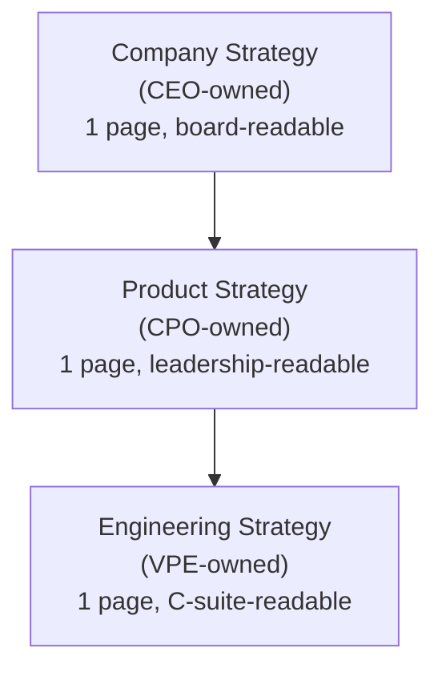
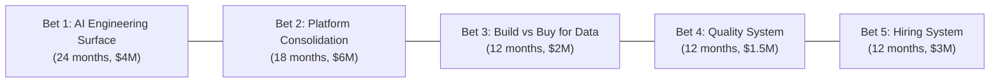

# VP of Engineering Playbook
## Chapter 5

# Engineering Strategy at Company Scale

> *"An engineering strategy is the smallest set of decisions that, if made and held, would unblock the next 24 months of work."*

---

## 1. Epigraph

An engineering strategy is the smallest set of decisions that, if made and held, would unblock the next 24 months of work.

---

## 2. Problem

You are the VPE at a 1,200-person company. The CEO has just told you: "We have 8 product teams, 4 infra teams, 2 data teams, and 1 platform team. We have 24 months of feature requests in our backlog. We have 5 vendors we'd like to consolidate. We have 1,200 customers asking for AI features. What's the engineering strategy?" You have 30 days to produce a 1-page strategy memo the CEO and board can sign off on. This is the chapter that tells you what the memo says — and what it doesn't say.

**Decision in one sentence:** A VPE-level engineering strategy is a 1-page memo that names (1) the 3-5 bets the org will make, (2) the 3-5 things the org will NOT do, (3) the 3-5 measurable outcomes, and (4) the 12-24 month timeline — backed by a 5-question diagnostic that says why this is the right strategy.

---

## 3. Why VPEs Fail Here

Five named failure modes of VPEs whose strategy memos failed at the C-suite.

- **The 30-Page Strategy.** The VPE produces a 30-page strategy memo covering every team, every project, every technology choice. The CEO reads the first page. The board reads the first slide. The strategy is unread. The VPE has produced a document, not a strategy.
- **The Feature-List Strategy.** The VPE's strategy is "ship features A, B, C, D, E, F, G, H, I, J in priority order." That's a roadmap, not a strategy. A strategy is the trade-offs. A roadmap is the execution. The VPE who produces a roadmap is a VPE who has not done the strategy work.
- **The Vendor-Selection Strategy.** The VPE's strategy is "we will move from vendor X to vendor Y for the data platform." That's a procurement decision, not a strategy. The VPE has confused a tactical choice with a strategic one.
- **The Without-Trades Strategy.** The VPE's strategy names what we'll do without naming what we won't do. Every "yes" without a "no" is a strategy that doesn't constrain anything. A strategy that doesn't constrain is decoration.
- **The Engineering-Only Strategy.** The VPE's strategy is purely an engineering strategy. It does not connect to the company strategy (what the CEO is measured on), the product strategy (what the CPO is measured on), or the financial strategy (what the CFO is measured on). The VPE's strategy is unmoored.

---

## 4. Mental Models

Four mental models that compress engineering strategy at company scale.

**Mental model 1: The 5-Question Frame.** A VPE's strategy answers 5 questions. Each is a hard question with no obvious answer.

```
1. What is the company's strategy? (What is the CEO measured on?)
2. What is the product strategy? (What is the CPO measured on?)
3. What is the engineering strategy? (What is the VPE measured on?)
4. How does #3 enable #1 and #2? (How does engineering serve
   the company + product strategy?)
5. What will we NOT do? (What trades are we making?)
```

**Mental model 2: The Strategy Stack.** A VPE's strategy is a stack of 3 layers.



The VPE's strategy must ladder up to the company strategy. The VPE who writes an engineering strategy that doesn't ladder up is producing engineering plans, not engineering strategy. The strategy stack is also the alignment tool: if the engineering strategy doesn't enable the product strategy, the VPE is misaligned with the CPO.

**Mental model 3: The Bet-Catalogue.** A VPE's strategy is a set of bets. A "bet" is a long-running investment that the company commits to for 12-24 months.



Each bet has 4 attributes:
1. **The bet**: What we're investing in.
2. **The expected outcome**: What success looks like in 12-24 months.
3. **The kill criterion**: What would tell us this bet is failing.
4. **The owner**: Which Director is accountable.

A VPE's strategy has 3-5 bets. More than 5 means the bets are diluted. Fewer than 3 means the strategy is too narrow.

**Mental model 4: The Decline List.** A VPE's strategy includes a decline list — the things we will NOT do.

```
A decline list item has 4 attributes:
  - The thing: What we won't do.
  - The reason: Why we're not doing it.
  - The trigger: What would change our mind.
  - The cost of declining: What we lose by not doing this.

A VPE who doesn't have a decline list is a VPE who will
decline by default — by saying "yes" to the loudest
stakeholder instead of "no" to the wrong thing.
```

---

## 5. Frameworks

Three frameworks for engineering strategy at scale.

### Framework 1: The 1-Page Strategy Memo

```
# Engineering Strategy — Q[N] [YEAR]

## What this strategy enables
[1 sentence on the company strategy this ladders up to.]

## The 3-5 bets (24-month horizon)

### Bet 1: [Name]
  Investment: $__M over __ months
  Owner: [Director]
  Expected outcome: [measurable]
  Kill criterion: [what would make us stop]

### Bet 2: [Name]
  ...

## The 3-5 things we will NOT do (decline list)

1. [Thing] — [reason] — [trigger to revisit] — [cost]
2. ...

## The 3-5 measurable outcomes (12-month)

1. [Metric] — [target] — [owner]
2. ...

## The 12-month plan
[Quarter-by-quarter milestones for the 3-5 bets.]
```

### Framework 2: The 5-Question Diagnostic

A VPE runs this 5-question diagnostic before writing the strategy memo.

```
1. What is the company strategy? Who is the CEO measured on?
2. What is the product strategy? Who is the CPO measured on?
3. What are the 3 biggest engineering bottlenecks right now?
4. What are the 3 biggest opportunities we're not pursuing?
5. What did we try in the last 12 months that didn't work?

The strategy memo answers questions 1-4. Question 5
informs the "things we will NOT do" section.
```

### Framework 3: The Bet-Review Cadence

A VPE reviews each bet quarterly. The review answers 4 questions.

```
1. Are we on track to hit the expected outcome?
2. Has the kill criterion been hit (or is it close)?
3. Is the Director still the right owner?
4. Is the investment still the highest-leverage use of the
   engineering budget?

If "on track" is "no" for 2 consecutive quarters:
  - Reduce the investment (kill the bet, partial kill, or pivot)
  - Re-allocate the budget to a higher-leverage bet

If "kill criterion" is "yes":
  - Kill the bet within 30 days
  - Communicate to the org
  - Re-allocate the budget
```

---

## 6. Drill

You are the VPE at **acme-corp**. The CEO has given you 30 days to produce a 1-page engineering strategy memo. The 5-question diagnostic has produced these inputs:

```
1. Company strategy:  "Reach $200M ARR by EOY 2027, expand
   into enterprise segment, lead on AI features."

2. Product strategy:  "Ship 3 enterprise-tier features (SSO,
   audit log, custom roles) by Q3. Ship AI feature v1 by Q4."

3. Top 3 engineering bottlenecks:
   a. AI features are unblocked by 0 (no platform).
   b. Enterprise features blocked by auth team (8-month backlog).
   c. Data infrastructure is fragile (3 incidents last quarter).

4. Top 3 opportunities not pursued:
   a. Internal Developer Platform (no IDP team).
   b. AI Engineering team (1 person on it).
   c. Quality system (no SLOs, no incident review).

5. Things tried in last 12 months that didn't work:
   a. "10x engineer" hiring spree (attrition 40%).
   b. Microservices migration (3 services, all over budget).
   c. Outsource to contractor (quality issues, manager load).
```

You have **90 minutes**. Produce a **1-page engineering strategy memo** (`portfolio/chapter-05-engineering-strategy-memo.md`) using Framework 1 (1-Page Memo) + Framework 2 (5-Question Diagnostic) + Framework 3 (Bet-Review Cadence). Specify:

- The 3-5 bets (24-month horizon, each with investment, owner, expected outcome, kill criterion).
- The 3-5 things on the decline list.
- The 3-5 measurable outcomes (12-month).
- The 12-month quarter-by-quarter plan.
- The first quarterly bet-review agenda.

**Deliverable:** `portfolio/chapter-05-engineering-strategy-memo.md` — under 1000 words.

---

## 7. Worked Example

**1-page engineering strategy memo:**

```
# Engineering Strategy — Q3 2026

## What this strategy enables
Company strategy: Reach $200M ARR by EOY 2027, expand
into enterprise segment, lead on AI features.

## The 3-5 bets (24-month horizon)

### Bet 1: AI Platform (the surface for AI features)
  Investment: $5M over 18 months
  Owner: Director, AI Engineering (new hire)
  Expected outcome: 80% of teams building on shared AI
    platform; 5 AI features shipped to GA in 24 months
  Kill criterion: 12 months in, <3 teams adopted the platform
    OR <1 AI feature in production

### Bet 2: Enterprise Auth (the unlock for enterprise tier)
  Investment: $2M over 12 months
  Owner: Director, Platform
  Expected outcome: SSO, audit log, custom roles all in
    production by Q3 2027; enterprise pipeline unblocked
  Kill criterion: 9 months in, no enterprise auth feature
    in production

### Bet 3: Data Reliability (the foundation for AI + enterprise)
  Investment: $3M over 12 months
  Owner: Director, Data
  Expected outcome: 99.9% data pipeline SLO; <2 incidents
    per quarter; data observability adopted by 100% of
    data teams
  Kill criterion: 9 months in, SLO not on track OR team
    not adopted

### Bet 4: Internal Developer Platform (the multiplier)
  Investment: $4M over 18 months
  Owner: Director, Platform
  Expected outcome: 80% of teams on shared CI/CD, observability,
    auth; cycle time halved; Director:IC ratio to 1:10
  Kill criterion: 12 months in, <50% adoption

### Bet 5: Hiring System (the constraint that unlocks all bets)
  Investment: $3M over 12 months
  Owner: Director, Engineering Operations (new role)
  Expected outcome: 12 reqs to fill in <90 days; attrition
    to <12%; diverse slate for every Director-level req
  Kill criterion: 9 months in, time-to-fill not improved OR
    attrition not on track

## The decline list (things we will NOT do)

1. Microservices migration. Reason: 3 services over budget,
   complexity > benefit at our scale. Trigger: >1M DAU or
   team-size >500 engineers. Cost: continued monolith coupling
   (manageable for now).

2. Outsource engineering capacity. Reason: previous outsource
   caused quality issues + manager load. Trigger: capacity
   gap >6 months AND no Director-level hire in pipeline.
   Cost: slower feature velocity (acceptable for now).

3. "10x engineer" hiring spree. Reason: previous spree had
   40% attrition. Trigger: define a repeatable hiring system
   first. Cost: slower hiring (acceptable for now).

4. Build our own observability platform. Reason: vendor
   solution (Datadog) is good enough at our scale. Trigger:
   observability cost >10% of engineering budget. Cost:
   $400K/year observability spend (acceptable).

5. AI feature for end users without a platform. Reason: AI
   without platform = technical debt + risk. Trigger: AI
   Platform GA (Q1 2027). Cost: no AI feature in market
   until Q1 2027.

## The 3-5 measurable outcomes (12-month)

1. AI Platform GA — by Q1 2027 — owner: Director, AI Engineering
2. Enterprise auth in production — by Q3 2027 — owner: Director, Platform
3. Data pipeline SLO 99.9% — by Q2 2027 — owner: Director, Data
4. IDP adoption 80% — by Q3 2027 — owner: Director, Platform
5. Engineering attrition <12% — by Q2 2027 — owner: Director, EngOps

## The 12-month plan (quarter-by-quarter)

Q3 2026: Hire Director, AI Engineering. Hire Director, EngOps.
         Stand up AI Platform team (5 people). Hire Data
         Reliability lead. Communicate decline list.

Q4 2026: First AI feature on platform (alpha). Enterprise
         auth design review. Data Reliability kickoff. IDP
         platform team kickoff. Hiring system redesign.

Q1 2027: AI Platform GA. Enterprise auth (SSO) in production.
         Data Reliability MVP. IDP CI/CD adoption (50%).

Q2 2027: 3 AI features on platform. Enterprise auth (audit log)
         in production. Data SLO 99.9%. IDP CI/CD adoption
         (80%). Hiring funnel redesigned.

Q3 2027: 5 AI features to GA. Enterprise auth (custom roles)
         in production. IDP observability + auth adoption
         (80%). Attrition to <12%.

## The first quarterly bet-review agenda (60 min)

Attendees: VPE + 5 bet owners (Directors)
Duration: 60 minutes
Cadence: quarterly

Per-bet review (10 min × 5 bets = 50 min):
  - Are we on track? (yes / no / partial)
  - Kill criterion status (green / yellow / red)
  - Is the Director still the right owner? (yes / no)
  - Is the investment still the highest-leverage use of budget? (yes / no)

Final 10 min: VPE summary, next 90 days, action items.
```

---

## 8. Failure Mode Postmortem

A VPE at a 2,000-person company inherited a 30-page engineering strategy from her predecessor. The strategy was exhaustive: every team, every project, every technology choice. The CEO had never read it. The board had never seen it. The Directors had written parts of it. The org didn't own it.

The VPE tried to execute the strategy for 12 months. Half the initiatives slipped. A quarter were cancelled. The strategy was failing because the org didn't understand it.

The VPE asked the CEO for 30 days to rewrite the strategy. The CEO agreed. The VPE produced a 1-page memo with 4 bets, a decline list, 5 measurable outcomes, and a 12-month plan. The CEO and board signed off within 1 week. The Directors aligned around the 4 bets. The org executed the strategy.

What the VPE missed: the strategy is the smallest set of decisions that unblock the next 24 months. The 30-page strategy was a document, not a strategy. The 1-page memo was a strategy.

The lesson: a strategy must be readable by the CEO and board. If the CEO can't read it, it's not a strategy. It's a documentation project.

---

## 9. Self-Assessment Rubric

| # | Dimension | 1 (Novice) | 3 (Competent) | 5 (Expert) |
|---|---|---|---|---|
| 1 | **5-question frame** | Asks 1-2 of 5 questions | Asks 4 of 5 | Asks all 5, in order, before writing |
| 2 | **Bet-catalogue discipline** | 8-10 "bets" (diluted) | 3-5 bets, each with the 4 attributes | 3-5 bets, each tied to a company + product outcome |
| 3 | **Decline list** | No decline list | Decline list exists but is generic | Decline list is concrete, with triggers + costs |
| 4 | **Measurable outcomes** | Vague outcomes ("improve velocity") | Specific outcomes with targets | Specific outcomes with targets, owners, and timelines |
| 5 | **1-page constraint** | 30-page memo | 5-page memo | 1-page memo, board-readable in 5 minutes |

**Disqualifier:** any 1 on dimension 2 or 5. A VPE with 8+ "bets" or a 30-page memo is in the Feature-List Strategy trap or the 30-Page Strategy trap.

**Total:** ___ / 25. **Pass threshold:** 18/25, no dimension below 3.

---

## 10. Portfolio Artifact Note

Save your filled-in drill as `portfolio/chapter-05-engineering-strategy-memo.md` — interview evidence for "Walk me through your engineering strategy." (see Portfolio Map in Chapter 27).

---

## 11. Interview Questions

1. **Walk me through your engineering strategy at [previous company].**
2. **The CEO asks "what's the engineering strategy?" How do you answer in 5 minutes?**
3. **A Director wants to add a 6th bet to your 5-bet strategy. What do you do?**
4. **A bet has hit its kill criterion. Walk me through the conversation.**
5. **What's on your decline list?**