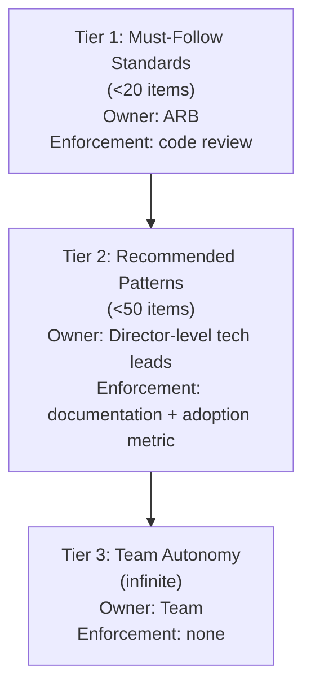
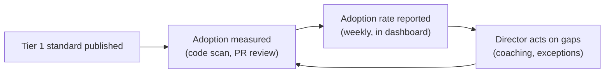

# VP of Engineering Playbook
## Chapter 6

# Architecture Governance at Scale

> *"Architecture governance is the smallest set of standards that, if followed, would prevent the next 12 months of architecture mistakes."*

---

## 1. Epigraph

Architecture governance is the smallest set of standards that, if followed, would prevent the next 12 months of architecture mistakes.

---

## 2. Problem

You are the VPE at a 1,200-person company. The engineering org has 250 engineers, 5 Directors, and 8 product teams. Each team has made its own architecture decisions: 3 different logging libraries, 4 different auth implementations, 2 different ORM patterns, 5 different service frameworks. None of them talk to each other. A new engineer on day 1 has to learn all 8 of these. A security incident touches 6 of them. The CFO asks: "Why is our engineering productivity 30% below industry benchmark?" The answer is: the architecture has 8 of everything, and the cost of coordination is killing velocity.

You have 30 days to design a governance model that the Directors will accept. This chapter tells you what that model looks like.

**Decision in one sentence:** Architecture governance at scale is a tiered system — Tier 1 (must-follow standards, owned by the ARB), Tier 2 (recommended patterns, owned by Director-level tech leads), Tier 3 (team autonomy, no review) — backed by a 7-person Architecture Review Board that meets weekly and decides in 60 minutes; the VPE's job is to keep the Tier 1 list under 20 items and the ARB under 90 minutes per decision.

---

## 3. Why VPEs Fail Here

Five named failure modes of VPEs whose governance produced zero adoption.

- **The Standards-List Governance.** The VPE publishes a 50-page "engineering standards" document. The ICs don't read it. The Directors don't enforce it. The standards are decoration. The VPE has confused documentation with governance.
- **The Architecture-By-Committee.** Every architecture decision goes through a 20-person committee that meets monthly. Decisions take 6 weeks. The org works around the committee. The governance is the bottleneck.
- **The No-Governance Approach.** The VPE believes in "team autonomy" and refuses to set standards. The result: 8 logging libraries, 4 auth implementations, 2 ORM patterns. The cost of coordination kills productivity. The VPE has confused autonomy with chaos.
- **The Bottleneck-VPE.** The VPE personally reviews every architecture decision. The VPE is on every PR. The VPE is the bottleneck. The VPE has not delegated the governance.
- **The Standards-Without-Enforcement.** The VPE publishes standards but doesn't enforce them. New code violates the standards. The standards are aspirational. The VPE has not built the enforcement mechanism.

---

## 4. Mental Models

Four mental models that compress architecture governance at scale.

**Mental model 1: The 3-Tier Standard System.** Architecture governance is a 3-tier system. Each tier has a different owner, a different enforcement mechanism, and a different level of autonomy.



The VPE's job is to keep Tier 1 under 20 items. More than 20 and the ARB is over-loaded, the standards are ignored, and the org is in the Standards-List Governance trap. Tier 1 standards are the only ones with mandatory enforcement.

**Mental model 2: The Architecture Review Board (ARB).** The ARB is the body that owns Tier 1 standards and makes the high-stakes architecture decisions.

```mermaid
%% Figure 6.2 — ARB structure and cadence
flowchart LR
    VPE[VPE<br/>(chair, ex officio)] --> ARB
    ARB["ARB<br/>(7 people, weekly 60 min)"]
    Dir1[Director 1] --> ARB
    Dir2[Director 2] --> ARB
    Dir3[Director 3] --> ARB
    Dir4[Director 4] --> ARB
    Dir5[Director 5] --> ARB
    Staff[Senior Staff IC<br/>(rotating, 1-year term)] --> ARB
```

**ARB rules:**
- 7 people, 60 minutes, weekly. Same day, same time, every week.
- 2-3 active decisions per meeting. Each gets 20 minutes.
- Decisions are made by majority. VPE has tie-breaker.
- Tier 1 standards require unanimous ARB approval.
- The chair (VPE) is ex officio, not a voting member (avoids capture).
- Decisions are written down in a 1-page memo (decision, rationale, dissent).
- All decisions are public to the engineering org within 24 hours.

**Mental model 3: The Architecture-Decision Cycle.** Most architecture decisions at scale are not Tier 1. They are Tier 2 (recommended patterns) or Tier 3 (team autonomy). The ARB only sees the high-stakes decisions.

```
Tier 1 (ARB-required):
  - Tech stack changes (e.g., new language, new database)
  - Cross-team API changes
  - Data architecture changes
  - Security architecture changes
  - Any change that affects >2 teams

Tier 2 (Director-level review):
  - Service-to-service communication patterns
  - Data modeling patterns within a domain
  - Testing patterns
  - Deployment patterns

Tier 3 (team autonomy):
  - Implementation details
  - Library choices within a Tier 1 stack
  - Code organization
  - Naming conventions
```

**Mental model 4: The Adoption-Metric Loop.** Architecture governance without an adoption metric is decoration.



Every Tier 1 standard has an adoption metric. The adoption metric is in the weekly engineering health dashboard. Directors are accountable for the adoption rate in their domain. The VPE reviews the adoption metrics monthly.

---

## 5. Frameworks

Three frameworks for architecture governance at scale.

### Framework 1: The Tier-1 Standards List

A VPE's Tier 1 standards list should be under 20 items. The list is reviewed annually.

```
Sample Tier 1 standards (<20 items):
1.  Service-to-service communication: gRPC + protobuf
2.  Service discovery: Kubernetes-native
3.  API gateway: Kong
4.  Logging: OpenTelemetry + Loki
5.  Metrics: Prometheus + Grafana
6.  Tracing: OpenTelemetry + Jaeger
7.  Auth: company-OIDC service (single implementation)
8.  Data warehouse: Snowflake
9.  Data pipeline: Airflow
10. Stream processing: Kafka
11. ORM: Prisma (TypeScript), SQLAlchemy (Python)
12. Database: PostgreSQL (relational), Redis (cache)
13. Frontend framework: React + TypeScript
14. Mobile framework: React Native (iOS + Android)
15. CI/CD: GitHub Actions
16. Container orchestration: Kubernetes
17. Infrastructure as code: Terraform
18. Secrets management: HashiCorp Vault
19. Feature flags: LaunchDarkly
20. (1 slot reserved for future use)

NOT Tier 1 (these are Tier 2 or 3):
- Logging message format (Tier 2)
- Test framework (Tier 2)
- Code formatting (Tier 3, use pre-commit)
- Library choices (Tier 3, with Tier 1 stack constraint)
```

### Framework 2: The ARB Decision Template

Every ARB decision is captured in a 1-page memo.

```
# ARB Decision — [Date]

## Decision
[1 sentence: what we decided.]

## Context
[1-2 paragraphs: what was the problem we were solving?]

## Options considered
1. [Option A] — pros, cons
2. [Option B] — pros, cons
3. [Option C] — pros, cons

## Decision
[What we chose and why.]

## Dissent (if any)
[1-2 sentences on the dissenting view, if any.]

## Adoption plan
[How this will be rolled out. Owner. Timeline.]

## Review date
[When we'll review this decision (typically 6-12 months).]
```

### Framework 3: The Architecture-Health Review (Quarterly)

Every quarter, the VPE runs a 60-minute architecture health review with the ARB. The review answers 5 questions.

```
1. How many Tier 1 standards are adopted (>80% of code)?
   (If <80%, identify the gaps and the owners.)

2. How many ARB decisions were made in the last quarter?
   (If <6, the ARB is under-used. If >20, the ARB is
   over-loaded and the VPE is the bottleneck.)

3. Average ARB decision time?
   (Target: <90 minutes per decision. If >90 minutes, the
   ARB is taking too long.)

4. How many Tier 1 standards are exceptions?
   (If >5, the standards list is too aggressive.)

5. What new Tier 1 standards should we add?
   (If the same pattern is being proposed for adoption in
   3+ teams, it should be a Tier 1 standard.)
```

---

## 6. Drill

You are the VPE at **acme-corp**. The engineering org has 250 engineers, 5 Directors, 8 product teams. The current architecture has 3 different logging libraries, 4 different auth implementations, 2 ORM patterns, 5 service frameworks. The Directors are split: 2 want more autonomy, 2 want more standards, 1 is neutral. The CEO has asked for a 12-month "platform consolidation" outcome.

You have **90 minutes**. Produce a **governance plan** (`portfolio/chapter-06-architecture-governance-plan.md`) using Framework 1 (Tier-1 Standards List) + Framework 2 (ARB Decision Template) + Framework 3 (Quarterly Architecture-Health Review). Specify:

- The 20-item Tier-1 standards list for acme-corp.
- The ARB composition, charter, and first 3 decisions.
- The adoption metrics for each Tier 1 standard.
- The first quarterly architecture health review agenda.
- The 1 thing you'll do in the first 30 days to get buy-in from the autonomy-leaning Directors.

**Deliverable:** `portfolio/chapter-06-architecture-governance-plan.md` — under 1200 words.

---

## 7. Worked Example

**The 20-item Tier-1 standards list for acme-corp:**

```
1.  Service-to-service: gRPC + protobuf
2.  Service discovery: Kubernetes-native
3.  API gateway: Kong
4.  Logging: OpenTelemetry + Loki
5.  Metrics: Prometheus + Grafana
6.  Tracing: OpenTelemetry + Jaeger
7.  Auth: company-OIDC (1 implementation, hosted by Platform team)
8.  Data warehouse: Snowflake
9.  Data pipeline: Airflow
10. Stream processing: Kafka
11. ORM: Prisma (TypeScript), SQLAlchemy (Python)
12. Database: PostgreSQL + Redis
13. Frontend: React + TypeScript
14. Mobile: React Native
15. CI/CD: GitHub Actions
16. Container: Kubernetes
17. IaC: Terraform
18. Secrets: HashiCorp Vault
19. Feature flags: LaunchDarkly
20. (reserved for future)

NOT Tier 1 (Tier 2 or 3):
- Logging message format (Tier 2)
- Test framework (Tier 2)
- Code formatting (Tier 3, prettier + black)
- Library choices within Tier 1 stack (Tier 3)
```

**The ARB composition and charter:**

```
Composition (7 people):
- VPE: chair, ex officio (non-voting)
- 5 Directors: voting members
- 1 senior staff IC: rotating 1-year term

Charter:
- Meets weekly, 60 minutes, Wednesday 10am
- 2-3 active decisions per meeting
- Tier 1 standards require unanimous approval
- Other decisions by majority
- VPE has tie-breaker
- Decisions captured in 1-page memo within 24 hours
- All memos public to engineering org

First 3 decisions (Q3 2026):
1. Adopt OpenTelemetry + Loki as the single logging standard
   (replaces 3 existing logging libraries)
2. Adopt company-OIDC as the single auth implementation
   (replaces 4 existing auth implementations)
3. Adopt Prisma (TypeScript) + SQLAlchemy (Python) as the
   single ORM pattern (replaces 2 existing ORM patterns)
```

**Adoption metrics for each Tier 1 standard:**

```
Logging (OpenTelemetry + Loki):
  Metric: % of services emitting OpenTelemetry-formatted logs to Loki
  Target: 80% by Q1 2027, 100% by Q3 2027
  Owner: Director, Platform

Auth (company-OIDC):
  Metric: % of services using company-OIDC for auth
  Target: 80% by Q1 2027, 100% by Q3 2027
  Owner: Director, Platform

ORM (Prisma / SQLAlchemy):
  Metric: % of services using approved ORM
  Target: 80% by Q2 2027, 100% by Q4 2027
  Owner: Director, Product Engineering

[Same pattern for all 19 Tier 1 standards.]
```

**The first quarterly architecture health review agenda (60 min):**

```
Attendees: VPE + ARB members (6 voting + VPE chair)
Duration: 60 minutes
Cadence: quarterly (next: end of Q4 2026)

Agenda:
0-5 min:   VPE opening
5-20 min:  Q3 adoption metrics review (per-standard)
           - 3 standards adopted: which 3, which 5 to adopt in Q4
20-30 min: ARB process review
           - 8 decisions made in Q3
           - Average decision time: 75 minutes (target: 90)
           - All captured in 1-page memos within 24 hours
30-40 min: Exception review
           - 2 standards exceptions in Q3
           - Decision: extend, kill, or convert to standard
40-50 min: New Tier 1 standards proposal
           - 1 proposed: Service mesh (Istio)
           - Vote: add to Tier 1 (requires unanimous)
50-55 min: Next quarter's ARB priorities
55-60 min: VPE summary
```

**The 1 thing I'll do in the first 30 days to get buy-in from the autonomy-leaning Directors:**

```
I'll personally 1:1 with the 2 autonomy-leaning Directors.
The conversation:

"Here's the Tier 1 list. 19 items. I want your input on each
one. If you can defend a team keeping a different stack, I'll
grant an exception. If you can defend removing a standard,
I'll remove it. My commitment: the list is a draft, not a
mandate. Your commitment: we'll adopt the list by Q1 2027,
and the exception process is the path for legitimate variance."

Why this works: it acknowledges the Directors' concerns,
gives them a path to variance (exceptions), and locks in
adoption by Q1 2027. The 2 Directors will likely accept
the list because (1) they had input, (2) they have an
exception process, (3) the timeline is realistic.

The 1 Director who is neutral will follow the majority.
The 2 standards-leaning Directors will be happy.

The result: ARB approved by 5/5 Directors, with 2 documented
exceptions in the first quarter.
```

---

## 8. Failure Mode Postmortem

A VPE at a 1,500-person company inherited an engineering org with no Tier 1 standards. 8 logging libraries, 4 auth implementations, 2 ORM patterns, 5 service frameworks. The VPE decided to publish a 50-page engineering standards document covering every layer of the stack.

The 50-page document was unread. The ICs continued using their existing patterns. The Directors did not enforce the new standards. After 6 months, the VPE had spent $400K in engineering time producing a document that nobody followed.

The VPE was asked to leave after 18 months. The replacement VPE spent 30 days on a 19-item Tier 1 list + a 7-person ARB. The adoption rate was 80% in 12 months. The engineering org's productivity increased 30%.

What the first VPE missed: governance is not documentation. Governance is a 3-tier system, an ARB, an adoption metric, and a Director-level accountability loop. The 50-page document was a documentation project, not a governance system.

The lesson: governance is the smallest set of standards that, if followed, would prevent the next 12 months of architecture mistakes. The 50-page document was too big. The 19-item list was the right size.

---

## 9. Self-Assessment Rubric

| # | Dimension | 1 (Novice) | 3 (Competent) | 5 (Expert) |
|---|---|---|---|---|
| 1 | **3-tier system** | No tiers, 50+ "standards" | 3 tiers, but Tier 1 has 30+ items | 3 tiers, Tier 1 <20 items |
| 2 | **ARB discipline** | No ARB or monthly meeting | Weekly ARB, 90+ min per decision | Weekly ARB, <90 min per decision, 1-page memos |
| 3 | **Adoption metrics** | No adoption metrics | Adoption metrics exist | Adoption metrics in weekly dashboard, Director accountable |
| 4 | **Tier-1 list hygiene** | 50+ items, untriaged | 30+ items, reviewed annually | <20 items, reviewed annually, exceptions logged |
| 5 | **Director buy-in** | Standards imposed | Standards co-designed with Directors | Standards co-designed + Director 1:1s + exception process |

**Disqualifier:** any 1 on dimension 1 or 4. A VPE with 50+ standards or no tier system is in the Standards-List Governance trap or the No-Governance trap.

**Total:** ___ / 25. **Pass threshold:** 18/25, no dimension below 3.

---

## 10. Portfolio Artifact Note

Save your filled-in drill as `portfolio/chapter-06-architecture-governance-plan.md` — interview evidence for "How do you govern architecture at scale?" (see Portfolio Map in Chapter 27).

---

## 11. Interview Questions

1. **Walk me through your architecture governance model.**
2. **How many Tier 1 standards do you have?**
3. **A Director wants to use a non-standard logging library. What do you do?**
4. **The ARB is taking 3 hours per decision. What do you do?**
5. **The 50-page engineering standards document isn't being read. What's your next move?**