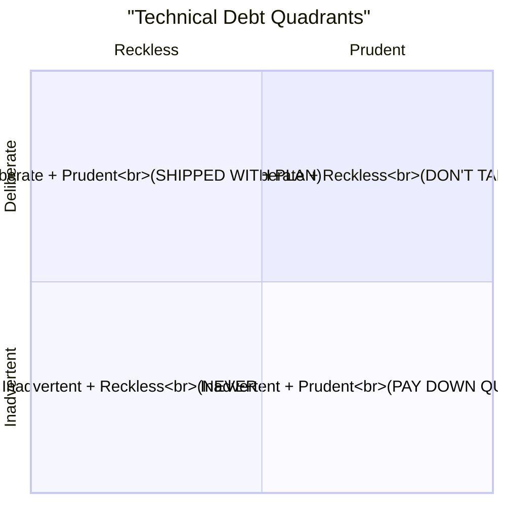
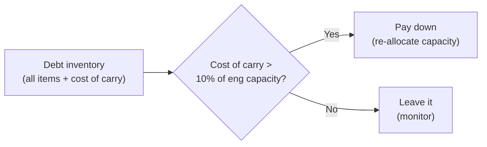
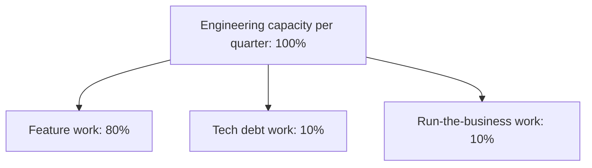

# VP of Engineering Playbook
## Chapter 7

# Technical Debt Management

> *"Technical debt is not a moral failing. It is a portfolio. The VPE's job is to own the portfolio — to know what's in it, what it costs, and when to pay it down."*

---

## 1. Epigraph

Technical debt is not a moral failing. It is a portfolio. The VPE's job is to own the portfolio — to know what's in it, what it costs, and when to pay it down.

---

## 2. Problem

You are the VPE at a 1,200-person company. The engineering org has 250 engineers. The CFO has just told you: "Engineering is 30% over budget. Cut headcount or cut scope." The CEO has said: "We need to ship 5 enterprise features by Q3. We can't slip the timeline." The Directors are split: 3 want to take a 6-month "tech debt sprint" to clean up the codebase, 2 want to keep shipping features and pay down debt opportunistically. The codebase has 18 months of accumulated shortcuts: 4 unmaintained services, 2 critical security vulnerabilities with no patches, 1 deprecated auth library, 8 missing test suites, 3 monolithic services that need decomposition.

You have 30 days to produce a technical debt plan that the CEO and CFO will accept. This chapter tells you what the plan looks like.

**Decision in one sentence:** Technical debt management is a portfolio discipline — the VPE maintains an inventory of debt items, classifies each by quadrant (deliberate vs inadvertent, prudent vs reckless), and pays them down according to a cost-of-carry threshold (10% of engineering capacity per quarter); the VPE's job is to know what's in the portfolio, what it costs, and to say "no" to feature work that requires a new debt item above the threshold.

---

## 3. Why VPEs Fail Here

Five named failure modes of VPEs whose technical debt management produced zero results.

- **The Tech-Debt-Sprint Failure.** The VPE declares a "tech debt sprint" — 1 quarter where the entire org pays down debt. The Directors grumble. The ICs grumble. The CEO complains about the feature freeze. The debt items get partially fixed. The next quarter, the debt is back. The VPE has produced a sprint, not a portfolio.
- **The Tech-Debt-List Failure.** The VPE maintains a "tech debt backlog" with 200 items. The backlog grows by 50 per quarter. The Directors prioritize the easy ones. The hard ones never get fixed. The backlog is decoration.
- **The Tech-Debt-Is-Cultural Failure.** The VPE says "tech debt is a culture problem" and asks the Directors to "encourage better engineering practices." Nothing changes. The VPE has confused culture with discipline. Culture is the output of disciplined process, not the input.
- **The No-Debt Failure.** The VPE refuses to take on any technical debt. Every feature ships with full tests, full docs, full observability. The org ships 30% of the feature backlog. The CEO replaces the VPE. The VPE has confused quality with throughput.
- **The Snowflake Failure.** The VPE personally tracks the tech debt for every team. The VPE is the bottleneck. The Directors don't own their debt. The VPE has not delegated the portfolio.

---

## 4. Mental Models

Four mental models that compress technical debt into a portfolio discipline.

**Mental model 1: The 4-Quadrant Debt Model.** Every technical debt item fits into one of 4 quadrants. The VPE's treatment depends on the quadrant.



```
Quadrant 1 (Deliberate + Reckless): "We don't have time for design"
  → DON'T TAKE THIS DEBT. No strategic value, all cost.

Quadrant 2 (Deliberate + Prudent): "We ship now, refactor in 6 months"
  → SHIP IT, with a written plan to pay down.
  → This is the most valuable debt. The ROI is clear.

Quadrant 3 (Inadvertent + Reckless): "What's a unit test?"
  → THIS IS A HIRING FAILURE. The VPE's job is to
    prevent this through better hiring, training, and process.

Quadrant 4 (Inadvertent + Prudent): "We learned the right pattern
  after we shipped"
  → PAY IT DOWN QUICKLY. The cost of carry is low now,
    but will compound.
```

The VPE's job is to maximize Quadrant 2 (deliberate + prudent) and minimize Quadrants 1 + 3. Quadrant 4 should be paid down before it compounds.

**Mental model 2: The Cost-of-Carry.** Every debt item has a cost of carry — the engineering capacity it consumes per quarter.



```
Example cost-of-carry calculation:

  Debt item: 1 unmaintained service (4-year-old Python 2 code)
    Cost to maintain: 0.2 engineer-quarters/quarter
                     (occasional patches, dependency updates,
                      incident response)
    Cost to replace: 4 engineer-quarters
    Cost of carry over 4 quarters: 0.8 engineer-quarters

  Decision: cost of carry is 0.8/4.0 (20% of one engineer's
  capacity). Below the 10% threshold. Leave it for now.

  If cost of carry were 4.0/quarter (1 FTE on incidents alone),
  we'd be above the 10% threshold. Pay it down.
```

**Mental model 3: The Tech-Debt Inventory.** The VPE maintains a tech-debt inventory. The inventory has 5 attributes per item.

```
Per debt item:
  - Name: [Short description]
  - Quadrant: [1, 2, 3, or 4]
  - Cost of carry: [engineer-quarters per quarter]
  - Cost to fix: [engineer-quarters to pay down]
  - Owner: [Director responsible]
  - Pay-down plan: [Date, owner, scope]
  - Status: [Open, In progress, Paid, Deferred]

The inventory is reviewed monthly by the VPE + Directors.
The VPE's job is to keep the inventory <50 items.
More than 50 means the VPE has lost control of the portfolio.
```

**Mental model 4: The Tech-Debt Quota.** Every team has a 10% tech-debt quota — 10% of engineering capacity per quarter is allocated to paying down debt, NOT shipping features.



The 10% quota is non-negotiable. The Directors allocate the 10% to specific debt items from the inventory. The VPE reviews the allocation quarterly.

The VPE who tries to "save" the 10% by shipping features is the VPE who lets debt compound until it costs more than 10%. The VPE who allocates more than 20% is the VPE who under-ships features.

---

## 5. Frameworks

Three frameworks for technical debt management at scale.

### Framework 1: The Tech-Debt Inventory Template

```
# Tech Debt Inventory — [Date]

## Summary
- Total items: ___
- Total cost of carry: ___ engineer-quarters/quarter
- Total cost to fix: ___ engineer-quarters
- Items in Quadrant 1 (DON'T TAKE): ___
- Items in Quadrant 2 (SHIPPED WITH PLAN): ___
- Items in Quadrant 3 (HIRING FAILURE): ___
- Items in Quadrant 4 (PAY DOWN QUICKLY): ___

## Items (sorted by cost-of-carry × quadrant priority)

| Name | Quadrant | Cost of carry (eq/q) | Cost to fix (eq) | Owner | Pay-down date | Status |
|------|----------|----------------------|-------------------|-------|---------------|--------|
| ...  | ...      | ...                  | ...               | ...   | ...           | ...    |
```

### Framework 2: The Quarterly Tech-Debt Review

Every quarter, the VPE runs a 60-minute tech-debt review with the Directors.

```
Agenda (60 min):
0-5 min:   VPE opening (the 3 numbers that matter)
5-20 min:  Inventory review (5 highest-cost items)
20-30 min: Pay-down progress (items in progress)
30-40 min: New debt items (this quarter's features)
40-50 min: Quota compliance (each team at 10%?)
50-60 min: VPE summary (next quarter's priorities)
```

The 3 numbers that matter:
1. Total cost of carry (engineer-quarters/quarter)
2. Total cost to fix (engineer-quarters)
3. Quota compliance (% of teams at 10%)

### Framework 3: The Tech-Debt Decision Template

For every new debt item, the team fills in a 1-page memo.

```
# New Tech Debt — [Item name]

## Why are we taking this debt?
[1-2 sentences on the strategic value.]

## What quadrant is this?
[1, 2, 3, or 4 — with justification.]

## What's the cost of carry?
[Engineer-quarters/quarter.]

## What's the cost to fix?
[Engineer-quarters total.]

## When will we pay it down?
[Date, scope, owner.]

## What's the trigger that says we MUST pay it down earlier?
[What would force us to prioritize this.]
```

---

## 6. Drill

You are the VPE at **acme-corp**. The engineering org has 250 engineers, 5 Directors. The codebase has accumulated 18 months of debt:
- 4 unmaintained services (Python 2, deprecated auth library, etc.)
- 2 critical security vulnerabilities (no patches in 6 months)
- 1 deprecated auth library (used by 8 services)
- 8 missing test suites (critical paths, no tests)
- 3 monolithic services that need decomposition

The CFO says: cut headcount or cut scope. The CEO says: ship 5 enterprise features by Q3. The Directors are split: 3 want a 6-month "tech debt sprint", 2 want to keep shipping.

You have **90 minutes**. Produce a **technical debt plan** (`portfolio/chapter-07-tech-debt-plan.md`) using Framework 1 (Tech-Debt Inventory) + Framework 2 (Quarterly Tech-Debt Review) + Framework 3 (Tech-Debt Decision Template). Specify:

- The tech-debt inventory (all 18 items with quadrant, cost-of-carry, cost-to-fix, owner).
- The 10% tech-debt quota allocation per team.
- The 3 things you'll pay down FIRST (with justification).
- The 3 things you'll defer (with trigger to revisit).
- The 1 thing you'll say "no" to the CEO on.
- The first quarterly tech-debt review agenda.

**Deliverable:** `portfolio/chapter-07-tech-debt-plan.md` — under 1500 words.

---

## 7. Worked Example

**The tech-debt inventory (18 items, classified by quadrant):**

```
# Tech Debt Inventory — Q3 2026

## Summary
- Total items: 18
- Total cost of carry: 6.2 engineer-quarters/quarter (~6% of eng)
- Total cost to fix: 38 engineer-quarters
- Quadrant 1 (DON'T TAKE): 0
- Quadrant 2 (SHIPPED WITH PLAN): 6
- Quadrant 3 (HIRING FAILURE): 4
- Quadrant 4 (PAY DOWN QUICKLY): 8

## Items (sorted by cost-of-carry)

| # | Name | Q | Carry (eq/q) | Fix (eq) | Owner | Pay-down | Status |
|---|------|---|--------------|----------|-------|----------|--------|
| 1 | Sec vulns: 2 critical unpatched | 3 | 1.5 | 2.0 | Sec Eng | Q4 2026 | Open |
| 2 | Python 2 service (legacy billing) | 2 | 0.8 | 4.0 | Platform | Q2 2027 | Deferred |
| 3 | Deprecated auth lib (8 services) | 2 | 0.6 | 6.0 | Platform | Q1 2027 | In progress |
| 4 | 3 monoliths (auth, billing, search) | 2 | 0.5 | 12.0 | Various | TBD | Deferred |
| 5 | Missing tests (8 critical paths) | 4 | 0.4 | 4.0 | All Directors | Q1 2027 | Open |
| 6 | Unmaintained services (3 others) | 4 | 0.4 | 6.0 | Platform | Q2 2027 | Open |
| 7 | Hardcoded secrets in 4 services | 3 | 0.3 | 1.0 | Sec Eng | Q4 2026 | Open |
| 8 | Missing observability (12 services) | 4 | 0.3 | 2.0 | Platform | Q1 2027 | Open |
| 9-18 | (10 more items, lower cost) | ... | 1.4 | 1.0 each | ... | ... | ... |
```

**The 10% tech-debt quota allocation per team:**

```
Team                  Engineers   10% Quota (eq/q)
Platform              30          3.0
Product Eng           100         10.0
Data                  25          2.5
AI                    25          2.5
Infra                 20          2.0
[New teams]           50          5.0
TOTAL                 250         25.0 eq/q

Total tech-debt capacity: 25 engineer-quarters/quarter.
Total cost of carry: 6.2 engineer-quarters/quarter.
Available for new debt: 18.8 engineer-quarters/quarter.
```

**The 3 things I'll pay down FIRST:**

```
1. Sec vulns: 2 critical unpatched (Item #1, Q3)
   Why first: 2 critical unpatched vulns is a Quadrant 3 hiring
   failure. The cost of a breach is 100x the cost to fix. Pay
   down within 30 days. Owner: Sec Eng (with help from
   Platform).

2. Hardcoded secrets in 4 services (Item #7, Q3)
   Why second: same Quadrant 3. Quick win (1 eq-qtr of work).
   Big risk reduction. Pay down in 30 days.

3. Deprecated auth lib (Item #3, Q1 2027)
   Why third: 8 services depend on this. The cost of carry is
   small now (0.6 eq/q) but compounds. Auth is on the critical
   path for the enterprise tier. Pay down in Q1 2027 (overlaps
   with the enterprise auth bet from Ch 5).
```

**The 3 things I'll defer:**

```
1. Python 2 service (Item #2, deferred to Q2 2027)
   Why: 0.8 eq/q is below the 10% threshold. Service is small,
   low traffic, not in the enterprise path. Pay down in Q2 2027
   when Platform has capacity from the IDP bet.

   Trigger to revisit: traffic grows >10x OR security issue.

2. 3 monoliths (Item #4, TBD)
   Why: 12 eq to fix is more than 1 quarter of work. Decomposition
   is a multi-quarter project. Each monolith gets a Director-level
   sponsor and a 6-month plan.

   Trigger to revisit: monolith blocks a Tier 1 standard adoption
   OR team growth makes the monolith a single point of failure.

3. Unmaintained services (Item #6, Q2 2027)
   Why: 6 eq to fix, but services are low-criticality. Bundle
   with the Python 2 migration in Q2 2027.

   Trigger to revisit: incident in any of these services.
```

**The 1 thing I'll say "no" to the CEO on:**

```
The CEO wants to ship 5 enterprise features by Q3. Two of the
5 features (SSO + audit log) require the deprecated auth lib
(Item #3) to be paid down first. I cannot ship these features
on the current auth lib — it's a security risk.

Counter-proposal:
- Ship SSO + audit log on the new auth lib (Item #3 paid down
  by Q1 2027). The 5 enterprise features ship by Q3 2027.
- The 2 features that don't depend on auth (custom roles,
  enterprise admin UI, billing) ship by Q2 2027.

Cost: 6-month slip on the 2 enterprise features that depend
on auth. Saved: 4 engineer-quarters of cost-of-carry on the
deprecated auth lib. Net: enterprise tier ships 1 quarter late,
but ships on a secure foundation.

This is the VPE's job: surface the trade-off. The CEO can
overrule (it's their call), but the VPE makes the trade-off
visible.
```

**The first quarterly tech-debt review agenda (60 min):**

```
Attendees: VPE + 5 Directors
Duration: 60 minutes
Cadence: quarterly (next: end of Q4 2026)

Agenda:
0-5 min:   VPE opening
           - 3 numbers: cost-of-carry (6.2 eq/q), cost-to-fix
             (38 eq), quota compliance (4/5 teams at 10%)
5-20 min:  Top-5 inventory items
           - Item #1: Sec vulns (status, pay-down plan)
           - Item #3: Deprecated auth lib (status, in progress)
           - Item #5: Missing tests (status)
           - Items #2, #4 (deferred, trigger check)
20-30 min: Pay-down progress
           - 2 items in progress (auth lib, hardcoded secrets)
           - Status against plan
30-40 min: New debt items
           - 4 new debt items from Q3 features
           - 1 in Quadrant 3 (hiring failure — pause, retrain)
40-50 min: Quota compliance
           - Platform: 12% (above quota, OK)
           - Product Eng: 8% (below quota, escalate)
           - Data: 10% (at quota, OK)
           - AI: 7% (below quota, new team, OK)
           - Infra: 11% (above quota, OK)
50-60 min: VPE summary (next quarter's priorities)
```

---

## 8. Failure Mode Postmortem

A VPE at an 1,800-person company inherited a tech-debt backlog with 200 items. The VPE decided to "tackle the backlog" by allocating 30% of engineering capacity to debt pay-down for one quarter.

The Directors delivered the work. The VPE checked off 60 items. The backlog went from 200 to 140. By the next quarter, the backlog was 180 (50 new items from new feature work). The VPE had made no progress.

Within 12 months, the VPE was replaced. The replacement VPE did a different thing: introduced a 10% tech-debt quota, made each Director own their portion of the inventory, and added a cost-of-carry threshold for pay-down decisions.

Within 6 months, the cost-of-carry was reduced 30%. Within 18 months, the inventory was at 35 items, all with pay-down plans.

What the first VPE missed: technical debt is a portfolio discipline, not a sprint. The 30%-for-one-quarter approach was a sprint. The 10%-every-quarter approach is a portfolio.

The lesson: a debt sprint fixes 60 items and creates 50. A 10% quota fixes 6 items per quarter and creates 0. The portfolio discipline wins.

---

## 9. Self-Assessment Rubric

| # | Dimension | 1 (Novice) | 3 (Competent) | 5 (Expert) |
|---|---|---|---|---|
| 1 | **4-quadrant model** | Treats all debt the same | Classifies by quadrant | Maximizes Q2, prevents Q1+Q3, pays down Q4 quickly |
| 2 | **Cost-of-carry threshold** | No cost-of-carry tracking | Tracks cost-of-carry per item | Pays down items above 10% threshold quarterly |
| 3 | **Inventory discipline** | 200+ items, untriaged | <50 items, reviewed monthly | <50 items, reviewed monthly, Director-owned |
| 4 | **10% quota** | No quota or 30% sprint | 10% quota, mostly followed | 10% quota, every team at 10%, Director accountable |
| 5 | **Trade-off visibility** | Says "yes" or "no" to CEO | Surfaces trade-offs | Surfaces trade-offs with cost-of-carry + cost-to-fix |

**Disqualifier:** any 1 on dimension 2 or 4. A VPE with no cost-of-carry tracking or who runs 30% sprints is in the Tech-Debt-List or Tech-Debt-Sprint failure modes.

**Total:** ___ / 25. **Pass threshold:** 18/25, no dimension below 3.

---

## 10. Portfolio Artifact Note

Save your filled-in drill as `portfolio/chapter-07-tech-debt-plan.md` — interview evidence for "How do you manage technical debt at scale?" (see Portfolio Map in Chapter 27).

---

## 11. Interview Questions

1. **Walk me through your technical debt management approach.**
2. **How do you decide what to pay down vs. defer?**
3. **The CFO says "cut headcount or cut scope." The CEO says "ship these 5 features." What do you do?**
4. **What's your 10% quota? What happens if a team is below quota?**
5. **Walk me through a tech-debt decision you've made.**