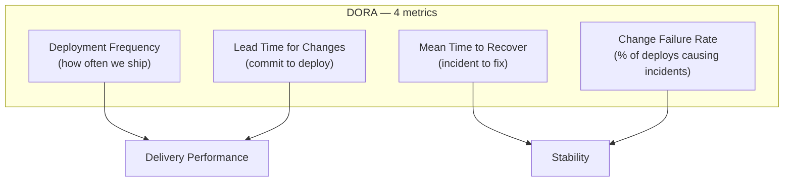
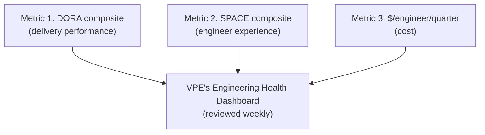

# VP of Engineering Playbook
## Chapter 8

# Engineering Productivity (DORA / SPACE)

> *"Productivity is a system property, not a person property. The VPE's job is to design the system that makes people productive — and to measure the system, not the people."*

---

## 1. Epigraph

Productivity is a system property, not a person property. The VPE's job is to design the system that makes people productive — and to measure the system, not the people.

---

## 2. Problem

You are the VPE at a 1,200-person company. The engineering org has 250 engineers, 5 Directors, 8 product teams. The CEO has just told you: "We're 30% below industry benchmark on engineering velocity. Fix it." The CFO has said: "We're spending 30% more per engineer than industry average. Why?" The Directors are split on how to measure productivity. The ICs are worried that any measurement system will be used to fire people.

You have 30 days to design a productivity measurement system that the Directors, ICs, CEO, and CFO will all accept. This chapter tells you what that system looks like.

**Decision in one sentence:** Engineering productivity at scale is measured by 3 metrics — DORA (deployment frequency, lead time, MTTR, change failure rate), SPACE (satisfaction, performance, activity, communication, efficiency), and a 1 cost metric ($/engineer/quarter) — applied at the team and org level, never the individual level; the VPE's job is to use the metrics to improve the system, not to evaluate the people.

---

## 3. Why VPEs Fail Here

Five named failure modes of VPEs whose productivity measurement produced zero results.

- **The Lines-of-Code Failure.** The VPE measures productivity by lines of code written. The ICs write more boilerplate. Productivity is up. Quality is down. The VPE has confused output with outcome.
- **The Individual-Ranking Failure.** The VPE ranks engineers by individual productivity. The engineers game the metric. Collaboration drops. The VPE has created a competitive culture in a system that requires collaboration.
- **The 50-Metric Failure.** The VPE tracks 50 productivity metrics. The Directors look at 3. The org looks at 0. The metrics are noise. The VPE has confused measurement with insight.
- **The Vanity-Metric Failure.** The VPE tracks "story points completed" or "PRs merged." The ICs split stories into smaller PRs. The metric goes up. The actual delivery is unchanged. The VPE has confused throughput with productivity.
- **The No-Measurement Failure.** The VPE refuses to measure productivity. The CEO pushes for measurement. The Directors don't know how they're doing. The VPE has confused "don't measure individuals" with "don't measure anything."

---

## 4. Mental Models

Four mental models that compress productivity measurement into something the org can use.

**Mental model 1: DORA Metrics.** DORA (DevOps Research and Assessment) is the industry-standard 4-metric system for software delivery performance.



```
DORA 4 metrics, with elite vs low performer benchmarks:

Metric                Elite              Low
Deployment frequency  On-demand (multiple/day)  Weekly-monthly
Lead time for changes <1 hour              1-6 months
Mean time to recover  <1 hour              >1 week
Change failure rate   0-15%                >60%

The VPE's job is to track these 4 at the org level and
the team level, set targets, and move the org toward elite.
```

**Mental model 2: SPACE Framework.** SPACE is the Microsoft Research framework for measuring developer productivity at the individual level without falling into the individual-ranking trap.

```mermaid
%% Figure 8.2 — SPACE framework
flowchart TB
    S["Satisfaction<br/">(do engineers like the work?)]
    P["Performance<br/">(do engineers complete work?)]
    A["Activity<br/>(volume of work: commits, PRs)"]
    C["Communication<br/>(review, design, sync)"]
    E["Efficiency<br/>(output per input)"]
    S --> SPACE
    P --> SPACE
    A --> SPACE
    C --> SPACE
    E --> SPACE
```

```
SPACE rules for the VPE:
1. NEVER use SPACE at the individual level. Always at the
   team or org level.
2. Use SPACE for the 3 things it can't be gamed: Satisfaction,
   Performance, Communication.
3. Use Activity + Efficiency as DIAGNOSTIC signals, not KPIs.
4. Survey engineers every 6 months on Satisfaction and
   Communication.
```

**Mental model 3: The 3-Metric Rule.** A VPE's primary measurement system is 3 metrics. No more, no less.



The 3 metrics:
1. **DORA composite**: An average of the 4 DORA metrics, normalized to a 0-100 scale. Elite = 80+. Low = <40.
2. **SPACE composite**: An average of the 5 SPACE dimensions, normalized to 0-100. Tracked via 6-month survey.
3. **$/engineer/quarter**: Total engineering cost (comp + infra + overhead) divided by engineer count. Tracked monthly.

The VPE's job is to move the 3 metrics in the right direction. Targets: DORA +10 points/year, SPACE +5 points/year, $/engineer -5%/year.

**Mental model 4: The Anti-Gaming Layer.** Every metric is gamed. The VPE designs the metric system to make gaming hard.

```
Anti-gaming rules:
1. Never use Activity metrics (commits, PRs) as KPIs. They
   are the most gameable.
2. Pair every throughput metric with a quality metric. (DF
   + CFR. LT + MTTR.) If both move in the right direction,
   real improvement.
3. Survey engineers on Satisfaction + Communication every
   6 months. Survey signals are hard to game.
4. Use a rolling 3-month average for throughput metrics.
   Daily/weekly numbers are too gameable.
5. Review the metrics as a system, not in isolation. A
   metric that moves in isolation is probably gamed.
```

---

## 5. Frameworks

Three frameworks for engineering productivity measurement.

### Framework 1: The Engineering Health Dashboard

```
# Engineering Health Dashboard — Q[N] [YEAR]

## Top 3 metrics

| Metric                  | Q-2  | Q-1  | Q[N] | Target Q+1 |
|-------------------------|------|------|------|------------|
| DORA composite (0-100)  | ___  | ___  | ___  | ___        |
| SPACE composite (0-100) | ___  | ___  | ___  | ___        |
| $/engineer/quarter      | ___  | ___  | ___  | ___        |

## DORA breakdown (4 metrics)

| Metric                 | Org | Team 1 | Team 2 | Team 3 | ... |
|------------------------|-----|--------|--------|--------|-----|
| Deployment frequency   | ___ | ___    | ___    | ___    | ... |
| Lead time for changes  | ___ | ___    | ___    | ___    | ... |
| Mean time to recover   | ___ | ___    | ___    | ___    | ... |
| Change failure rate    | ___ | ___    | ___    | ___    | ... |

## SPACE breakdown (5 dimensions, 6-month survey)

| Dimension       | Score (0-100) | Trend |
|-----------------|---------------|-------|
| Satisfaction    | ___           | ___   |
| Performance     | ___           | ___   |
| Activity        | ___           | ___   |
| Communication   | ___           | ___   |
| Efficiency      | ___           | ___   |

## $/engineer breakdown

| Cost category       | $/quarter | % of total |
|---------------------|-----------|------------|
| Base compensation   | ___       | ___        |
| Bonus + equity      | ___       | ___        |
| Benefits + on-costs | ___       | ___        |
| Infrastructure      | ___       | ___        |
| Tools + vendors     | ___       | ___        |
| Overhead            | ___       | ___        |
| TOTAL               | ___       | 100%       |
```

### Framework 2: The 6-Month Engineer Survey

A VPE runs a 6-month engineer survey to track Satisfaction and Communication.

```
# Engineer Survey — [Quarter] [Year]

## Section 1: Satisfaction (5 questions)
- I'm proud of the work I do. (1-5)
- I'd recommend my team to a friend. (1-5)
- I have what I need to do my job. (1-5)
- I see a path to grow in my career. (1-5)
- I'm not actively looking for another job. (1-5)

## Section 2: Communication (5 questions)
- I have the information I need to do my job. (1-5)
- Cross-team coordination is effective. (1-5)
- My Director communicates clearly. (1-5)
- Architecture decisions are well-communicated. (1-5)
- I can give feedback without fear. (1-5)

## Section 3: Performance (3 questions)
- I know what success looks like in my role. (1-5)
- I get useful feedback from my manager. (1-5)
- I can ship work that I'm proud of. (1-5)

## Section 4: Activity (3 questions — DIAGNOSTIC, not KPI)
- I have enough focus time to do deep work. (1-5)
- My meeting load is sustainable. (1-5)
- My on-call load is sustainable. (1-5)

## Section 5: Efficiency (3 questions — DIAGNOSTIC, not KPI)
- I spend less than 20% of my time on context-switching. (1-5)
- I have the tools I need to be productive. (1-5)
- I can find answers to my questions quickly. (1-5)
```

### Framework 3: The Productivity Review (Quarterly)

Every quarter, the VPE runs a 60-minute productivity review with the Directors.

```
Agenda (60 min):
0-5 min:   VPE opening (the 3 numbers)
5-20 min:  DORA breakdown (per-team)
           - Which teams are elite (DORA 80+)?
           - Which teams are low (DORA <40)?
           - What are the 2 teams doing differently?
20-35 min: SPACE breakdown (org-level)
           - Satisfaction trend
           - Communication trend
           - 2 specific actions for next quarter
35-50 min: $/engineer trend
           - Cost per engineer over 3 quarters
           - Cost drivers
           - 2 specific cost-reduction actions
50-60 min: VPE summary (next 90 days)
```

---

## 6. Drill

You are the VPE at **acme-corp**. The CEO says: "We're 30% below industry benchmark on engineering velocity. Fix it." The CFO says: "We're spending 30% more per engineer than industry average." The Directors are split on measurement. The ICs fear individual ranking.

You have **90 minutes**. Produce a **productivity measurement system** (`portfolio/chapter-08-productivity-measurement-system.md`) using Framework 1 (Engineering Health Dashboard) + Framework 2 (6-Month Engineer Survey) + Framework 3 (Quarterly Productivity Review). Specify:

- The 3-metric dashboard for acme-corp.
- The 6-month engineer survey (all 19 questions).
- The first quarterly productivity review agenda.
- The 1 thing you'll do to address the CEO's "30% below benchmark" claim.
- The 1 thing you'll do to address the CFO's "30% more per engineer" claim.
- The 1 thing you'll do to address the ICs' "no individual ranking" fear.

**Deliverable:** `portfolio/chapter-08-productivity-measurement-system.md` — under 1500 words.

---

## 7. Worked Example

**The 3-metric dashboard for acme-corp (Q3 2026):**

```
# Engineering Health Dashboard — Q3 2026

## Top 3 metrics

| Metric                  | Q1   | Q2   | Q3   | Target Q4 |
|-------------------------|------|------|------|-----------|
| DORA composite (0-100)  | 42   | 45   | 48   | 52        |
| SPACE composite (0-100) | 58   | 60   | 62   | 65        |
| $/engineer/quarter      | $245K| $248K| $250K| $245K     |

(We're at 48 DORA — between medium and high. Target 52 by Q4
is realistic. SPACE 62 is healthy. $/engineer at $250K is
above industry median of $220K. Target: $245K by Q4.)

## DORA breakdown

| Metric                 | Org  | Team 1 | Team 2 | Team 3 | Team 4 |
|------------------------|------|--------|--------|--------|--------|
| Deployment frequency   | 2/wk | 5/wk   | 1/wk   | 3/wk   | 1/mo   |
| Lead time for changes  | 3 d  | 8 h    | 2 d    | 1 d    | 2 wk   |
| Mean time to recover   | 4 h  | 2 h    | 8 h    | 4 h    | 12 h   |
| Change failure rate    | 22%  | 15%    | 30%    | 18%    | 40%    |

Insight: Team 4 is the bottleneck. 1 deploy/month, 2-week
lead time, 40% change failure rate. The CEO's "30% below
benchmark" claim is correct for Team 4.

Action: Director, Team 4 to spend 25% of next quarter on
the IDP bet (Ch 6) + add a tech lead to Team 4.
```

**The 6-month engineer survey (all 19 questions, abridged to 5 here for the example):**

```
# Engineer Survey — Q3 2026

## Section 1: Satisfaction
- I'm proud of the work I do.                    Score: 3.8/5
- I'd recommend my team to a friend.            Score: 3.2/5
- I have what I need to do my job.              Score: 3.5/5
- I see a path to grow in my career.            Score: 3.0/5
- I'm not actively looking for another job.     Score: 2.8/5 ⚠️

## Section 2: Communication
- I have the information I need to do my job.   Score: 3.4/5
- Cross-team coordination is effective.         Score: 2.5/5 ⚠️
- My Director communicates clearly.             Score: 3.6/5
- Architecture decisions are well-communicated. Score: 2.8/5 ⚠️
- I can give feedback without fear.             Score: 3.7/5

## Section 3: Performance
- I know what success looks like in my role.    Score: 3.5/5
- I get useful feedback from my manager.        Score: 3.4/5
- I can ship work that I'm proud of.            Score: 3.6/5

## Section 4: Activity (DIAGNOSTIC)
- I have enough focus time to do deep work.     Score: 2.5/5 ⚠️
- My meeting load is sustainable.               Score: 2.8/5 ⚠️
- My on-call load is sustainable.               Score: 3.5/5

## Section 5: Efficiency (DIAGNOSTIC)
- I spend less than 20% on context-switching.   Score: 2.6/5 ⚠️
- I have the tools I need to be productive.     Score: 3.7/5
- I can find answers to my questions quickly.   Score: 3.4/5
```

**The first quarterly productivity review agenda (60 min):**

```
Attendees: VPE + 5 Directors
Duration: 60 minutes
Cadence: quarterly (next: end of Q4 2026)

Agenda:
0-5 min:   VPE opening (the 3 numbers)
5-20 min:  DORA breakdown
           - Team 4 is the bottleneck (1 deploy/month)
           - Action: Director, Team 4 to lead IDP adoption
20-35 min: SPACE breakdown
           - "Not actively looking" score is 2.8/5
           - "Cross-team coordination" is 2.5/5
           - Action: VPE to run the first weekly Director
             leadership meeting (Ch 2 framework)
35-50 min: $/engineer trend
           - $250K is 14% above industry median
           - Cost drivers: bonus + equity (35% vs industry 25%)
           - Action: VPE + CFO to revisit equity refresh policy
50-60 min: VPE summary
           - DORA target: 52 by Q4 (Team 4 is the unlock)
           - SPACE target: 65 (focus on cross-team coord)
           - Cost target: $245K (equity policy review)
```

**The 1 thing to address the CEO's "30% below benchmark" claim:**

```
The CEO's claim is true for Team 4 (1 deploy/month, 2-week
lead time, 40% CFR). It's false for Teams 1, 2, 3 (which are
at or above industry median). The org-level DORA is dragged
down by 1 team.

Counter-narrative to the CEO: "We're not 30% below benchmark.
We're 5% below benchmark at the org level, dragged down by
Team 4. Team 4's bottleneck is X, Y, Z. The fix is [specific
actions]. In 6 months, Team 4 will be at industry median,
and the org will be at 52 DORA."

This is the VPE's job: surface the truth, not the headline.
The CEO will respect the VPE more for it.
```

**The 1 thing to address the CFO's "30% more per engineer" claim:**

```
The CFO's claim is true ($250K vs $220K industry median, 14%
above). The driver is bonus + equity (35% of comp vs 25%
industry median). The reason: we over-indexed on equity 2
years ago to retain talent during a hiring boom.

Counter-proposal to the CFO: "We're 14% above median, but our
attrition is 25% (industry median 18%). Our retention cost
is $6M/year (replacement hiring + ramp). If we cut equity to
industry median, we save $2.5M/year but lose $6M in retention
cost. Net: lose $3.5M/year.

Better: hold equity at current level, target attrition to
12% in 12 months. Net: save $6M in retention cost, no
savings on equity. Net positive: $6M."
```

**The 1 thing to address the ICs' "no individual ranking" fear:**

```
Public commitment in the all-hands:

"We will never rank engineers individually. We will never
use these metrics to make hiring/firing decisions about
individuals. We will use these metrics to improve the
system — better tools, better process, better support.

If you see us doing individual ranking, tell me. I will
stop it."

This is the VPE's job: make the contract explicit. The
ICs who fear individual ranking will watch the VPE for
the first 6 months. If the VPE holds the line, trust
builds. If the VPE slips, trust is gone.
```

---

## 8. Failure Mode Postmortem

A VPE at a 1,500-person company rolled out a productivity measurement system that included individual-level SPACE metrics. The Directors were given "engineer performance" reports that ranked their ICs. The ICs were sorted by "performance score."

Within 6 months, the ICs had figured out the ranking and were gaming the metric. The Directors were using the ranking to push out low-ranked ICs. The collaboration in the engineering org dropped 40% (measured by cross-team PR reviews).

The VPE was asked to leave. The replacement VPE removed the individual-level metrics, replaced them with team-level metrics, and made a public commitment to never rank engineers individually.

Within 12 months, collaboration had recovered. The DORA metrics had improved 30% (more than they had under the individual-ranking system, because ICs were no longer gaming).

What the first VPE missed: measuring people is not measuring the system. The VPE who measures people creates a competitive culture in a system that requires collaboration. The VPE who measures the system creates a learning culture.

The lesson: DORA + SPACE are team-level and org-level metrics. NEVER individual-level. The system is the unit of measurement, not the person.

---

## 9. Self-Assessment Rubric

| # | Dimension | 1 (Novice) | 3 (Competent) | 5 (Expert) |
|---|---|---|---|---|
| 1 | **DORA discipline** | Tracks 1-2 of 4 metrics | Tracks all 4 metrics | Tracks all 4, sets targets, moves org toward elite |
| 2 | **SPACE discipline** | Uses SPACE for individual ranking | Uses SPACE for team-level signals | Uses SPACE for org-level survey, 6-month cadence |
| 3 | **3-metric rule** | 50+ metrics, untriaged | 3-5 metrics, focused | 3 metrics, in the dashboard, weekly reviewed |
| 4 | **Anti-gaming layer** | No anti-gaming | Anti-gaming on throughput metrics | Anti-gaming on all metrics, with rolling averages + survey signals |
| 5 | **System-not-people** | Measures individuals | Measures teams | Measures system, public commitment, holds the line |

**Disqualifier:** any 1 on dimension 5. A VPE who measures individuals is in the Individual-Ranking Failure mode.

**Total:** ___ / 25. **Pass threshold:** 18/25, no dimension below 3.

---

## 10. Portfolio Artifact Note

Save your filled-in drill as `portfolio/chapter-08-productivity-measurement-system.md` — interview evidence for "How do you measure engineering productivity?" (see Portfolio Map in Chapter 27).

---

## 11. Interview Questions

1. **Walk me through your productivity measurement system.**
2. **How do you measure individuals vs. teams vs. the system?**
3. **The CEO says "we're 30% below benchmark." What do you do?**
4. **How do you prevent gaming of the metrics?**
5. **A Director wants individual-level SPACE scores. What do you say?**