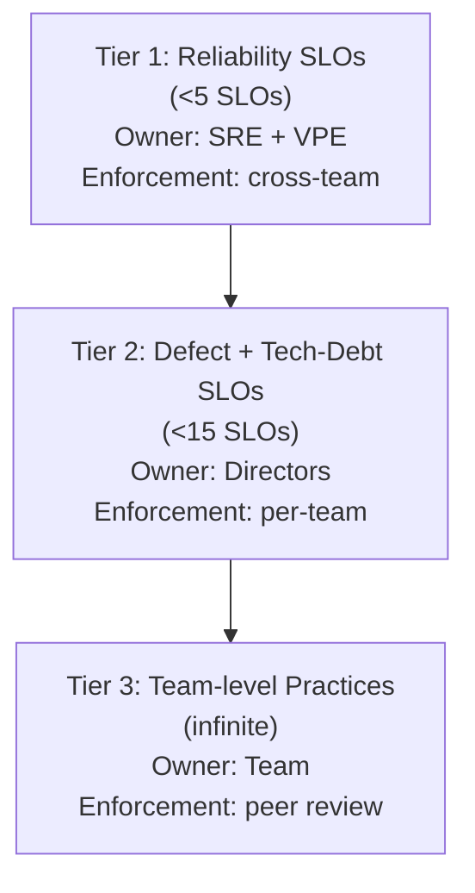
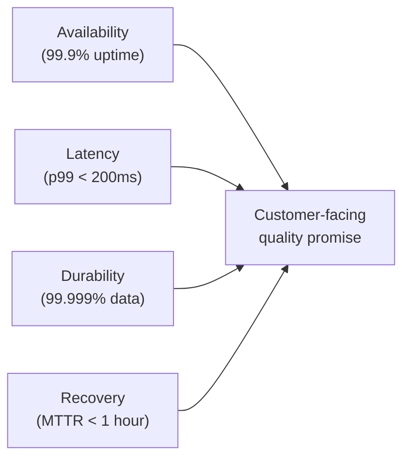

# VP of Engineering Playbook
## Chapter 9

# Engineering Quality at Scale

> *"Quality is not a feature you add at the end. Quality is the system that lets you ship faster tomorrow than you shipped today."*

---

## 1. Epigraph

Quality is not a feature you add at the end. Quality is the system that lets you ship faster tomorrow than you shipped today.

---

## 2. Problem

You are the VPE at a 1,200-person company. The engineering org has 250 engineers, 5 Directors. In the last quarter: 23 production incidents, MTTR is 4 hours, customer-reported bugs are up 30%, the security team has flagged 4 unpatched critical vulnerabilities, the support team is overwhelmed, and the CEO has just told you: "Our customers are complaining about quality. We can't ship enterprise tier on this foundation."

You have 30 days to design an engineering quality system that the Directors, ICs, and CEO will all accept. This chapter tells you what that system looks like.

**Decision in one sentence:** Engineering quality at scale is a 3-tier system — Tier 1 (reliability SLOs owned by SRE, with cross-team incident command), Tier 2 (defect and tech-debt SLOs owned by Directors, with quarterly review), Tier 3 (team-level quality practices, Director-owned) — backed by an Incident Review Board and a blameless-postmortem culture; the VPE's job is to keep Tier 1 under 5 SLOs, run IRBs that surface patterns (not blame), and own the customer-facing quality narrative.

---

## 3. Why VPEs Fail Here

Five named failure modes of VPEs whose quality system produced zero results.

- **The 50-Bug-Backlog Failure.** The VPE maintains a customer-reported bug backlog with 500 items. The backlog grows by 100/quarter. The Directors prioritize the loudest customers. The hard bugs never get fixed. The backlog is decoration.
- **The QA-Team-Only Failure.** The VPE has a separate QA team that catches bugs before they reach production. The QA team is the bottleneck. Engineering velocity drops. The QA team is laid off in the next reorg. The VPE has not built quality into the system.
- **The Blame-The-IC Failure.** When an incident happens, the VPE finds the IC who wrote the bug and "holds them accountable." The ICs hide bugs. The incidents compound. The VPE has created a culture of fear.
- **The No-SLO Failure.** The VPE refuses to set SLOs because "every team is different." The Directors don't know what "good" looks like. The incidents continue. The VPE has confused flexibility with chaos.
- **The Process-Overload Failure.** The VPE adds 5 quality processes (code review, security review, design review, perf review, release review) to fix the quality problem. The Directors slow down. The ICs slow down. The velocity drops 40%. The VPE has added process without removing process.

---

## 4. Mental Models

Four mental models that compress engineering quality at scale.

**Mental model 1: The 3-Tier Quality System.** Engineering quality is a 3-tier system. Each tier has a different owner, a different metric, and a different level of enforcement.



The VPE's job is to keep Tier 1 under 5 SLOs. More than 5 and the org is in the Process-Overload Failure mode. Tier 1 SLOs are the only ones with mandatory enforcement across teams.

**Mental model 2: The 4 Reliability SLOs.** Every VPE has 4-5 Tier 1 reliability SLOs. These are the org's customer-facing quality commitments.



```
Sample 4 Tier 1 SLOs:

1. Availability: 99.9% uptime for customer-facing services
   (max 8.7 hours downtime/year)
2. Latency: p99 < 200ms for top 10 customer-facing endpoints
3. Durability: 99.999% data durability (5 9s)
4. Recovery: MTTR < 1 hour for severity-1 incidents

The 4 SLOs are owned by the SRE team + VPE.
Directors are accountable for the SLOs in their domain.
The SLOs are reviewed monthly by the VPE + Directors.
The SLOs are reported to the CEO + customers quarterly.
```

**Mental model 3: The Incident Review Board (IRB).** The IRB is the body that owns Tier 1 quality through blameless postmortems.

```mermaid
%% Figure 9.3 — IRB structure
flowchart LR
    VPE[VPE<br/>(chair, ex officio)] --> IRB
    IRB["IRB<br/>(5 people, bi-weekly 60 min)"]
    SRE[SRE Lead] --> IRB
    Dir1[Director, Product] --> IRB
    Dir2[Director, Platform] --> IRB
    Sec[Sec Eng] --> IRB
```

**IRB rules:**
- 5 people, 60 minutes, bi-weekly.
- Reviews the last 2 weeks of sev-1 + sev-2 incidents.
- Each incident gets a blameless postmortem (10-15 min).
- Postmortems are 1-page: timeline, root cause, contributing factors, action items.
- Action items have owners and dates.
- Pattern detection: if 3+ incidents share a root cause, that's a systemic fix (Tier 1).
- All postmortems are public to the engineering org within 48 hours.

**Mental model 4: The Customer-Quality Narrative.** The VPE owns the customer-facing quality narrative — the story the CEO tells customers, the board, and the press.

```
The customer-quality narrative has 4 components:

1. The promise: "Our SLOs are X, Y, Z."
2. The delivery: "Last quarter we hit X, Y, Z. We missed W
   by N%. Here's the postmortem."
3. The investment: "We're investing $XM in reliability this
   year to hit elite SLOs."
4. The transparency: "All postmortems are public at
   [URL]. Anyone can read them."

The VPE who hides quality problems from the CEO and customers
is the VPE who loses customer trust. The VPE who tells the
truth — and shows the investment to fix it — is the VPE
who builds customer trust.
```

---

## 5. Frameworks

Three frameworks for engineering quality at scale.

### Framework 1: The Reliability SLO Template

```
# Reliability SLO — [Service name]

## SLO
[Metric, target, measurement window]

Example:
- Availability: 99.9% uptime, measured monthly
- Latency: p99 < 200ms, measured per request
- Durability: 99.999% data durability, measured per quarter
- Recovery: MTTR < 1 hour, measured per incident

## Error budget
[How much can we miss the SLO before we freeze feature work?]

Example:
- 99.9% availability = 0.1% error budget = 43.2 minutes/month
- If we exceed the error budget for 2 consecutive months,
  freeze non-critical feature work until we recover

## Owner
[Director accountable for the SLO]

## Reporting
[How often the SLO is reported, to whom]

Example:
- Reported monthly to the VPE + Directors
- Reported quarterly to the CEO + customers
```

### Framework 2: The Blameless Postmortem Template

```
# Incident Postmortem — [Date]

## Summary
[1 paragraph: what happened, customer impact, duration.]

## Timeline
[5-15 minute increments, what happened when.]

## Root cause
[Technical root cause, no blame on individuals.]

## Contributing factors
[What made the root cause possible. Systemic factors, not
 individual factors. Examples: missing observability, missing
 test coverage, missing SLO, missing runbook.]

## What went well
[What worked during the response. Examples: on-call response
 time, communication, escalation path.]

## What went poorly
[What didn't work. Examples: alerts didn't fire, runbook was
 out of date, escalation took too long.]

## Action items
| Action | Owner | Date |
|--------|-------|------|
| [action] | [name] | [date] |

## Lessons
[1-2 sentences on the systemic lesson. Example: "We need
observability on the X service to detect this class of
incident in the future."]
```

### Framework 3: The Quality Health Review (Quarterly)

Every quarter, the VPE runs a 60-minute quality health review with the Directors.

```
Agenda (60 min):
0-5 min:   VPE opening
           - 3 numbers: SLO compliance, incidents/quarter,
             customer-reported bugs
5-20 min:  Tier 1 SLO review
           - 4 SLOs: status, error budget consumption
           - If any SLO is red, action plan
20-30 min: Top 3 incidents (last quarter)
           - Postmortem review
           - Action items status
30-40 min: Tier 2 SLO review
           - 10-15 per-team SLOs
           - Which teams are red, which are green
40-50 min: Quality investment
           - $XM allocated to reliability
           - 2-3 active initiatives
50-60 min: VPE summary (next quarter's quality priorities)
```

---

## 6. Drill

You are the VPE at **acme-corp**. Last quarter: 23 production incidents, MTTR 4 hours, customer-reported bugs up 30%, 4 unpatched critical security vulnerabilities. The CEO says: "Customers are complaining about quality. We can't ship enterprise tier on this foundation."

You have **90 minutes**. Produce a **quality system plan** (`portfolio/chapter-09-quality-system-plan.md`) using Framework 1 (Reliability SLO Template) + Framework 2 (Blameless Postmortem Template) + Framework 3 (Quarterly Quality Health Review). Specify:

- The 4 Tier 1 reliability SLOs (with error budget rules).
- The IRB composition, charter, and first 3 postmortems to review.
- The 10 Tier 2 SLOs (per-Director).
- The first quarterly quality health review agenda.
- The 1 thing you'll say to the CEO about customer-facing quality.
- The 3 things you'll say "no" to (to avoid Process-Overload).

**Deliverable:** `portfolio/chapter-09-quality-system-plan.md` — under 1500 words.

---

## 7. Worked Example

**The 4 Tier 1 reliability SLOs (with error budget rules):**

```
# Tier 1 Reliability SLOs — Q4 2026

## SLO 1: Availability
- Target: 99.9% uptime for customer-facing services
- Error budget: 43.2 minutes/month
- If exceeded for 2 consecutive months: freeze non-critical
  feature work in the offending service until recovered
- Owner: SRE Lead (with VPE oversight)
- Reporting: monthly to VPE + Directors, quarterly to CEO

## SLO 2: Latency
- Target: p99 < 200ms for top 10 customer-facing endpoints
- Error budget: 1% of requests can exceed 200ms
- If exceeded: investigate root cause within 7 days
- Owner: SRE Lead (with VPE oversight)

## SLO 3: Durability
- Target: 99.999% data durability (no customer data loss)
- Error budget: 0 (zero tolerance)
- If exceeded: sev-1 incident, full IRB review
- Owner: Director, Data

## SLO 4: Recovery
- Target: MTTR < 1 hour for sev-1 incidents
- Error budget: 4 sev-1 incidents/quarter with MTTR > 1 hour
- If exceeded: incident review, systemic fix
- Owner: SRE Lead (with VPE oversight)
```

**The IRB composition and charter:**

```
Composition (5 people):
- VPE: chair, ex officio (non-voting)
- SRE Lead: voting member
- Director, Product Engineering: voting member
- Director, Platform: voting member
- Security Engineer: voting member

Charter:
- Bi-weekly, 60 minutes
- Reviews last 2 weeks of sev-1 + sev-2 incidents
- Each incident: 10-15 min blameless postmortem
- Action items have owners + dates
- Pattern detection: 3+ incidents sharing a root cause
  triggers a systemic Tier 1 fix
- All postmortems public to engineering org within 48 hours

First 3 postmortems to review (Q3 2026 incidents):
1. Sev-1: Customer data exposure (12K customers, 6 hours)
2. Sev-1: Database failover failed (4 hours, customer-facing
   downtime)
3. Sev-2: Auth service degraded (8 hours, intermittent 503s)
```

**The 10 Tier 2 SLOs (per-Director):**

```
Director, Product Engineering (4 SLOs):
1. Defect escape rate: <5% of merged PRs cause a sev-2+ incident
2. Code review turnaround: <24 hours for 95% of PRs
3. Test coverage: >70% line coverage on customer-facing services
4. Mean time to detect (MTTD): <15 min for sev-1+ incidents

Director, Platform (3 SLOs):
5. Infrastructure uptime: 99.95% for shared services
6. Deployment success rate: >95% of deploys complete without
   rollback
7. On-call burden: <2 pages/week per on-call engineer

Director, Data (2 SLOs):
8. Data pipeline SLA: 99% of pipelines complete on time
9. Data quality: <0.5% of records fail validation

Director, AI (1 SLO):
10. AI model availability: 99.5% (lower than core SLOs because
    AI is new and not customer-facing for most features)
```

**The first quarterly quality health review agenda (60 min):**

```
Attendees: VPE + 5 Directors + SRE Lead + Sec Eng
Duration: 60 minutes
Cadence: quarterly (next: end of Q4 2026)

Agenda:
0-5 min:   VPE opening
           - 3 numbers: SLO compliance, incidents/quarter,
             customer-reported bugs
5-20 min:  Tier 1 SLO review
           - Availability: 99.85% (under target, error budget
             used 1.5x monthly)
           - Latency: 99.2% (above target, OK)
           - Durability: 100% (no incidents, OK)
           - Recovery: MTTR 2.5 hours (over target, action needed)
20-30 min: Top 3 incidents
           - Sev-1 data exposure (postmortem review)
           - Sev-1 DB failover (postmortem review)
           - Sev-2 auth degradation (postmortem review)
30-40 min: Tier 2 SLO review
           - Defect escape rate: 8% (over target)
           - Test coverage: 65% (under target)
           - Deployment success: 92% (under target)
           - Data pipeline SLA: 97% (under target)
40-50 min: Quality investment
           - $2M allocated to reliability in 2026
           - 3 active initiatives: observability, SLO tooling,
             on-call rotation
50-60 min: VPE summary
           - Q4 priorities: hit SLO 1, fix MTTR, close top 3
             customer-reported bugs
```

**The 1 thing I'll say to the CEO about customer-facing quality:**

```
The truth:

"Last quarter we had 23 incidents, MTTR was 4 hours, and
customer-reported bugs were up 30%. We missed our reliability
SLOs.

We are not ready to ship enterprise tier on this foundation.

The fix is a 12-month quality investment plan: $2M in
reliability tooling + $1M in on-call rotation + $1.5M in
SLO adoption. After 12 months, we will hit elite SLOs
and be ready for enterprise tier.

Until then, I recommend we tell enterprise prospects that
we are Tier 2 reliability today and Tier 1 in 12 months.
The customers will respect the honesty.

The alternative — shipping enterprise tier on this foundation
— will produce a 10x worse outcome: customer churn, brand
damage, and a much longer fix later."

This is the VPE's job: surface the truth, recommend the
investment, and own the customer-facing narrative.
```

**The 3 things I'll say "no" to (to avoid Process-Overload):**

```
1. "We need a security review on every PR."
   No: Tier 1 SLO is "no critical vulns in production." The
   process to hit it: code-scanning on every PR (automated,
   no human review), plus a security review on Tier 1 changes
   only (manual). Not every PR.

2. "We need a design review on every feature."
   No: Tier 1 is "no design-level incidents." The process:
   design reviews on cross-team changes only. Within a team,
   the team makes the call.

3. "We need a performance review on every service."
   No: Tier 1 SLO is "p99 < 200ms on top 10 endpoints." The
   process: performance review on the top 10 endpoints only.
   Other services are Tier 2 (per-team).

The VPE's job: Tier 1 has <5 SLOs, all with clear enforcement.
The rest is Tier 2 or 3 (per-team or no review). Adding
process without removing process is the Process-Overload
Failure.
```

---

## 8. Failure Mode Postmortem

A VPE at a 2,000-person fintech inherited an engineering org with no SLOs, no incident review process, and 40 incidents in the last quarter. The VPE decided to add 5 quality processes (security review, design review, performance review, code review, release review) to fix the quality problem.

Engineering velocity dropped 40% in 3 months. The Directors complained. The ICs complained. The CEO asked: "Why are we shipping less?" The VPE said: "Because we're shipping better." The CEO said: "We need to ship more, not better." The VPE was asked to leave after 12 months.

The replacement VPE did a different thing: removed 4 of the 5 processes, kept the security review, and replaced it with automated code scanning. Set 4 Tier 1 SLOs. Stood up the IRB. Within 6 months, incidents were down 50%, velocity was up 20%.

What the first VPE missed: quality is a system property, not a process property. The 5 quality processes were added without removing any. The org was doing 5x the process work for no quality gain.

The lesson: the 3-tier system has 4-5 Tier 1 SLOs and 10-15 Tier 2 SLOs. The rest is Tier 3 (team-level). Adding process without removing process is the Process-Overload Failure.

---

## 9. Self-Assessment Rubric

| # | Dimension | 1 (Novice) | 3 (Competent) | 5 (Expert) |
|---|---|---|---|---|
| 1 | **3-tier system** | No tiers, 5+ quality processes for everything | 3 tiers, but Tier 1 has 10+ SLOs | 3 tiers, Tier 1 <5 SLOs, Tier 2 <15 |
| 2 | **Reliability SLOs** | No SLOs | 4 SLOs, no error budget | 4 SLOs with error budget rules, monthly reported |
| 3 | **IRB discipline** | No IRB or blame-based postmortems | Bi-weekly IRB, blameless postmortems | Bi-weekly IRB, blameless, pattern detection, public |
| 4 | **Customer narrative** | Hides quality problems | Reports to CEO privately | Owns customer-facing narrative, transparent |
| 5 | **Process discipline** | Adds process without removing | Tracks process inventory | Tier 1 has <5 SLOs, rest is Tier 2 or 3 |

**Disqualifier:** any 1 on dimension 1 or 5. A VPE with no tier system or who adds 5 quality processes is in the No-SLO Failure or Process-Overload Failure.

**Total:** ___ / 25. **Pass threshold:** 18/25, no dimension below 3.

---

## 10. Portfolio Artifact Note

Save your filled-in drill as `portfolio/chapter-09-quality-system-plan.md` — interview evidence for "How do you build an engineering quality system at scale?" (see Portfolio Map in Chapter 27).

---

## 11. Interview Questions

1. **Walk me through your engineering quality system.**
2. **How many Tier 1 SLOs do you have?**
3. **A sev-1 incident happens. Walk me through the first 24 hours.**
4. **The CEO says "ship enterprise tier." The system isn't ready. What do you say?**
5. **A Director wants to add a 5th quality process. What do you do?**