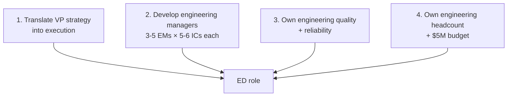
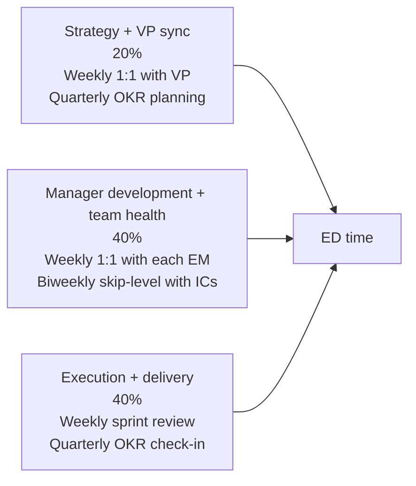

# Engineering Director Playbook
## Chapter 1

# What an Engineering Director Actually Does

> *"The ED runs the engineering org between the VP and the ICs. The ED's job is to translate VP strategy into execution, develop engineering managers, and own engineering quality and reliability."*

---

## 1. Epigraph

_The ED runs the engineering org between the VP and the ICs. The ED's job is to translate VP strategy into execution, develop engineering managers, and own engineering quality and reliability._

---

## 2. Problem

You are a new Engineering Director at acme-corp. The VP has just told you: "You have 3-5 engineering managers, 15-30 engineers, $5M engineering budget, and a 90-day runway. The FY26 commitments are 4 product launches + 1 platform rebuild. What do you do?"

This chapter tells you what the ED role is, the 4 ED-only responsibilities, the 5 ED-influenced outcomes, and the 30-day plan for the new ED.

**Decision in one sentence:** _The Engineering Director is a 4-responsibility system (1. translate VP strategy into execution, 2. develop engineering managers, 3. own engineering quality and reliability, 4. own engineering headcount and budget) with 5 outcomes (delivery, quality, reliability, hiring, retention); the ED's job is to design the engineering org, run the execution, and own the engineering culture._

---

## 3. Why EDs Fail Here

Five named failure modes of EDs whose first 90 days produced zero results.

- **The IC-Mentality Failure.** The ED acts as a senior IC, not as an ED. _Doesn't develop managers, doesn't own budget._
- **The VP-Mentality Failure.** The ED acts as a VP, not as an ED. _Doesn't run execution, doesn't own delivery._
- **The No-Org-Design Failure.** The ED doesn't design the org. _Teams are misaligned._
- **The No-Manager-Development Failure.** The ED doesn't develop EMs. _EMs plateau._
- **The No-Quality-Ownership Failure.** The ED doesn't own quality. _Bugs accumulate, reliability suffers._

---

## 4. Mental Models

Four mental models that compress the ED role.

**mental model 1: The 4 ED-Only Responsibilities.** 4 things only EDs do.



**The 4 responsibilities:**
- **Responsibility 1: Translate VP strategy into execution.** Quarterly OKRs, sprint-level plans.
- **Responsibility 2: Develop engineering managers.** 3-5 EMs × 5-6 ICs each.
- **Responsibility 3: Own engineering quality + reliability.** SLA, SLO, error budgets.
- **Responsibility 4: Own engineering headcount + $5M budget.** Hiring plan, comp, promotions.

**mental model 2: The 5 ED-Influenced Outcomes.** 5 outcomes the ED influences.

```
1. Delivery (N features shipped per quarter)
2. Quality (N bugs escaped, N outages, MTTR)
3. Reliability (uptime, latency, SLO compliance)
4. Hiring (N engineers hired per quarter)
5. Retention (% engineers staying)

The ED doesn't write code, but the ED's decisions
drive all 5 outcomes. The ED who optimizes 1 outcome
(e.g., delivery) at the expense of others has an
imbalanced org.
```

**mental model 3: The 3 ED Time Allocation.** 3 time buckets.



**The 3 time buckets:**
- **Bucket 1: Strategy + VP sync (20%).** Weekly 1:1 with VP. Quarterly OKR planning.
- **Bucket 2: Manager development + team health (40%).** Weekly 1:1 with each EM. Biweekly skip-level with ICs.
- **Bucket 3: Execution + delivery (40%).** Weekly sprint review. Quarterly OKR check-in.

**mental model 4: The 30-60-90 ED Plan.** 3 phases.

```
Days 1-30: Assess
- 5 stakeholder intros (VP, peers, EMs, key ICs)
- 1-page engineering portfolio memo
- 1-page ED charter signed with VP
- Top 3 risks identified
- EM 1:1s (all 3-5)

Days 31-60: Plan
- Q1 OKRs drafted
- Hiring plan drafted
- Engineering quality baseline established
- Stakeholder cadence established

Days 61-90: Execute
- 1 quarterly OKR commitment shipped
- 1 hiring cycle completed
- 1 quality improvement shipped
- 1 EM development milestone
```

---

## 5. Frameworks

Three frameworks for the ED role.

### Framework 1: The 1-Page ED Charter

```
# ED Charter — [Date]

## Scope
- 3-5 EMs reporting
- 15-30 ICs in total
- $5M engineering budget
- 4 product launches + 1 platform rebuild (FY26)

## The 4 responsibilities
1. Translate VP strategy into execution
2. Develop EMs (3-5 × 5-6 ICs)
3. Own quality + reliability
4. Own headcount + budget

## The 5 outcomes
1. Delivery: 4 launches + 1 rebuild
2. Quality: <5 bugs escaped per quarter
3. Reliability: 99.9% uptime, <100ms p99 latency
4. Hiring: 5-7 engineers per quarter
5. Retention: >90% annual retention

## Stakeholder cadence
- VP: Weekly 1:1 (Monday, 30 min)
- Peers (PM, Design, CS): Biweekly 1:1
- EMs: Weekly 1:1 (30 min each)
- ICs: Monthly skip-level (15 min each)

## The 1 thing I'll focus on first
[1 sentence.]
```

### Framework 2: The Engineering Org Health Scorecard

```
# Engineering Org Health — [Quarter]

| Outcome | Target | Current | Status |
|---------|--------|---------|--------|
| Delivery | 4 launches + 1 rebuild | 2/5 | YELLOW |
| Quality | <5 bugs escaped | 8 | RED |
| Reliability | 99.9% uptime | 99.7% | RED |
| Hiring | 5-7 engineers | 3 | YELLOW |
| Retention | >90% annual | 95% | GREEN |

## Top 3 risks
1. Reliability (RED): 99.7% vs 99.9% target
2. Quality (RED): 8 bugs vs <5 target
3. Hiring (YELLOW): 3 vs 5-7 target

## The 1 thing the ED will focus on next quarter
[1 sentence.]
```

### Framework 3: The 30-60-90 ED Plan

```
# ED 30/60/90 Plan — [Name] — [Start Date]

## Days 1-30: Assess
- [ ] 5 stakeholder intros (VP, peers, EMs, key ICs)
- [ ] 1-page engineering portfolio memo
- [ ] 1-page ED charter signed with VP
- [ ] Top 3 risks identified per outcome
- [ ] EM 1:1s (all 3-5)

## Days 31-60: Plan
- [ ] Q1 OKRs drafted
- [ ] Hiring plan drafted
- [ ] Engineering quality baseline established
- [ ] Stakeholder cadence established
- [ ] 1 EM development milestone

## Days 61-90: Execute
- [ ] 1 quarterly OKR commitment shipped
- [ ] 1 hiring cycle completed
- [ ] 1 quality improvement shipped
- [ ] 1 EM development milestone
- [ ] 1-page 90-day report

## The 1 thing the ED will NOT do
[1 sentence.]
```

---

## 6. Drill

You are a new ED at **acme-corp**. The VP has given you 90 days and 5 outcomes to influence.

```
Outcomes:
- Delivery: 4 launches + 1 rebuild (FY26)
- Quality: <5 bugs escaped per quarter
- Reliability: 99.9% uptime, <100ms p99 latency
- Hiring: 5-7 engineers per quarter
- Retention: >90% annual retention

You have 90 days.
```

You have **90 minutes**. Produce the **ED 30/60/90 plan** (`portfolio/chapter-01-ed-role.md`) using Framework 1 (Charter) + Framework 2 (Org Health) + Framework 3 (30/60/90 Plan). Specify:

- The 1-page ED charter (4 responsibilities, 5 outcomes, stakeholder cadence, the 1 focus).
- The engineering org health scorecard (5 outcomes, current state, top 3 risks).
- The 30/60/90 ED plan (3 phases, the 1 not do).
- The 1 thing you'll say to the VP in the first review.
- The 3 things you'll do to avoid the 5 failure modes.

**Deliverable:** `portfolio/chapter-01-ed-role.md` — under 1500 words.

---

## 7. Worked Example

**The 1-page ED charter:**

```
# ED Charter — FDE Name — 2026-09-01

## Scope
- 3-5 EMs reporting
- 15-30 ICs in total
- $5M engineering budget
- 4 product launches + 1 platform rebuild (FY26)

## The 4 responsibilities
1. Translate VP strategy into execution (Q1-Q4 OKRs)
2. Develop EMs (3-5 × 5-6 ICs each)
3. Own quality + reliability (SLA, SLO, error budget)
4. Own headcount + budget ($5M)

## The 5 outcomes
1. Delivery: 4 launches + 1 rebuild
2. Quality: <5 bugs escaped per quarter
3. Reliability: 99.9% uptime, <100ms p99
4. Hiring: 5-7 engineers per quarter
5. Retention: >90% annual

## Stakeholder cadence
- VP: Weekly 1:1 (Monday, 30 min)
- Peers (PM, Design, CS): Biweekly 1:1
- EMs: Weekly 1:1 (30 min each)
- ICs: Monthly skip-level (15 min each)

## The 1 thing I'll focus on first
Reliability. 99.7% uptime is RED. The platform
rebuild is dependent on reliability baseline.
```

**The engineering org health scorecard:**

```
# Engineering Org Health — Q3 2026 — 2026-09-30

| Outcome | Target | Current | Status |
|---------|--------|---------|--------|
| Delivery | 4 launches + 1 rebuild | 2/5 | YELLOW |
| Quality | <5 bugs escaped | 8 | RED |
| Reliability | 99.9% uptime | 99.7% | RED |
| Hiring | 5-7 engineers | 3 | YELLOW |
| Retention | >90% annual | 95% | GREEN |

## Top 3 risks
1. Reliability (RED): 99.7% vs 99.9% target
2. Quality (RED): 8 bugs vs <5 target
3. Hiring (YELLOW): 3 vs 5-7 target

## The 1 thing the ED will focus on next quarter
Reliability + Quality. Both RED. They're related:
quality bugs drive reliability incidents. The
platform rebuild is the long-term fix. The short-term
fix is a quality + SRE focus.
```

**The 30/60/90 ED plan:**

```
# ED 30/60/90 Plan — 2026-09-01

## Days 1-30: Assess
- [x] 5 stakeholder intros (VP, peers, EMs, key ICs)
- [x] 1-page engineering portfolio memo
- [x] 1-page ED charter signed with VP
- [x] Top 3 risks identified per outcome
- [x] EM 1:1s (all 3-5)

## Days 31-60: Plan
- [ ] Q1 OKRs drafted
- [ ] Hiring plan drafted (5-7/quarter)
- [ ] Engineering quality baseline established
- [ ] Stakeholder cadence established
- [ ] 1 EM development milestone (EM A → Senior EM)

## Days 61-90: Execute
- [ ] 1 quarterly OKR commitment shipped
- [ ] 1 hiring cycle completed
- [ ] 1 quality improvement shipped (bug escape rate -50%)
- [ ] 1 EM development milestone (EM A → Senior EM)
- [ ] 1-page 90-day report

## The 1 thing the ED will NOT do
Take on any IC work in the first 90 days. The ED's
job is to develop EMs, not to write code. The ED
who writes code in the first 90 days hasn't
transitioned.
```

**The 1 thing I'll say to the VP in the first review:**

```
"Here's my 30/60/90 ED plan:

  Days 1-30 (Assess): 5 stakeholder intros + portfolio memo
  Days 31-60 (Plan): Q1 OKRs + hiring plan + quality baseline
  Days 61-90 (Execute): 1 OKR + 1 hire + 1 quality + 1 EM

  Top 3 risks:
  1. Reliability (99.7% vs 99.9% target)
  2. Quality (8 bugs vs <5 target)
  3. Hiring (3 vs 5-7 target)

  The 1 thing I want to focus on: reliability + quality.
  Both are RED. They're related. The platform rebuild
  is the long-term fix. The short-term fix is a
  quality + SRE focus.

  The 1 thing I want from you: weekly Monday 30 min
  sync. I'll send a 1-pager the night before.

  The 1 thing I will NOT do: take on IC work in the
  first 90 days. My job is to develop EMs, not write
  code. The ED who writes code hasn't transitioned."
```

**The 3 things I'll do to avoid the 5 failure modes:**

```
1. Don't act as an IC (delegate to EMs).
   (Avoids the IC-Mentality Failure.)
   - 40% of time on EM development
   - 0% of time on IC work
   - 5 EM 1:1s per week

2. Don't act as a VP (run execution).
   (Avoids the VP-Mentality Failure.)
   - 40% of time on execution + delivery
   - Weekly sprint review
   - Quarterly OKR check-in

3. Design the org before running it.
   (Avoids the No-Org-Design Failure.)
   - Day 1-30: org design baseline
   - Day 31-60: org design improvements
   - Day 61-90: org design validation
```

---

## 8. Failure Mode Postmortem

An ED at a 200-person B2B AI company took the role but acted as a senior IC. Wrote code, attended standups, but didn't develop EMs. The EMs plateaued. The ED's promotion to VP was delayed by 18 months.

The replacement ED did 3 things:
1. Didn't write code in the first 90 days (delegate to EMs).
2. Designed the engineering org (4 product launches + 1 platform rebuild).
3. Developed all 3-5 EMs (1-on-1s, skip-levels, development plans).

Within 12 months: 2 EMs promoted to Senior EM. 1 promotion to VP within 18 months. The 4-responsibility ED role is the leverage.

What the first ED missed: the ED is not an IC. The first ED wrote code. The second ED developed EMs. The EM development is the leverage.

The lesson: the ED who has 4 responsibilities + 5 outcomes + 30/60/90 plan has a structured ED role. The ED who acts as an IC has an IC-with-ED-title.

---

## 9. Self-Assessment Rubric

| # | Dimension | 1 (Novice) | 3 (Competent) | 5 (Expert) |
|---|---|---|---|---|
| 1 | **4 ED responsibilities** | 1-2 responsibilities | 3 responsibilities | 4 responsibilities (strategy translation + EM dev + quality + budget) |
| 2 | **5 ED outcomes** | 1-2 outcomes | 3-4 outcomes | 5 outcomes (delivery + quality + reliability + hiring + retention) |
| 3 | **3 time allocation buckets** | 1 bucket | 2 buckets | 3 buckets (20% strategy + 40% EM dev + 40% execution) |
| 4 | **30/60/90 ED plan** | No plan | Plan exists | 3 phases (assess + plan + execute), 1 EM milestone, 1 OKR commitment |
| 5 | **Stakeholder cadence** | 1 stakeholder | 2-3 stakeholders | 4 stakeholders (VP + peers + EMs + ICs), weekly/biweekly/monthly |

**Disqualifier:** any 1 on dimension 1 or 2. An ED who has 1-2 responsibilities or 1-2 outcomes is in the IC-Mentality or VP-Mentality failure mode.

**Total:** ___ / 25. **Pass threshold:** 18/25, no dimension below 3.

---

## 10. Portfolio Artifact Note

Save your filled-in drill as `portfolio/chapter-01-ed-role.md` — interview evidence for "Walk me through your ED role" (see Portfolio Map in Chapter 27).

---

## 11. Interview Questions

1. **Walk me through your ED role.**
2. **You have 4 product launches + 1 platform rebuild. What do you do?**
3. **Your reliability is 99.7% vs 99.9% target. What do you do?**
4. **Your EMs are plateauing. What do you do?**
5. **Walk me through a 30/60/90 ED plan you've run.**
