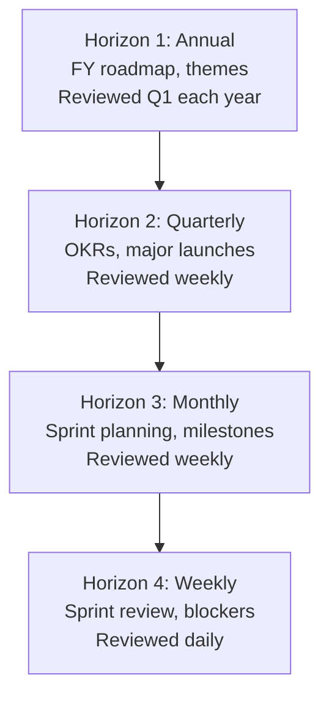
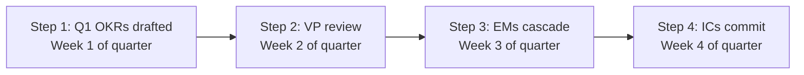

# Engineering Director Playbook
## Chapter 10

# Engineering Planning and Roadmaps

> *"The ED owns engineering planning. The 4 planning horizons, the 3 roadmap levels, and the 5-criterion roadmap quality bar are the ED's reference for engineering planning at the function level."*

---

## 1. Epigraph

_The ED owns engineering planning. The 4 planning horizons, the 3 roadmap levels, and the 5-criterion roadmap quality bar are the ED's reference for engineering planning at the function level._

---

## 2. Problem

You are an Engineering Director at acme-corp. The VP has just told you: "4 product launches + 1 platform rebuild in FY26. Q4 OKRs are due. The current roadmap is a 1-page doc with no detail. EMs and ICs are confused about priorities. Design the engineering planning system."

This chapter tells you the 4 planning horizons, the 3 roadmap levels, and the 5-criterion roadmap quality bar.

**Decision in one sentence:** _ED engineering planning is a 4-horizon system (annual + quarterly + monthly + weekly) with 3 roadmap levels (company + function + team) and 5-criterion roadmap quality bar; the ED's job is to design the planning cadence, write the function roadmap, and own the OKR process._

---

## 3. Why EDs Fail Here

Five named failure modes of EDs whose engineering planning produced zero results.

- **The 1-Horizon Failure.** The ED only plans quarterly. _No annual + monthly + weekly._
- **The No-Function-Roadmap Failure.** The ED has no function-level roadmap. _Team-level only._
- **The No-OKR-Process Failure.** The ED has no OKR process. _Quarterly OKRs are last-minute._
- **The No-Roadmap-Quality-Bar Failure.** Roadmap items have no quality criteria. _Confusion._
- **The No-Sprint-Cadence Failure.** The ED has no weekly sprint cadence. _No execution._

---

## 4. Mental Models

Four mental models that compress engineering planning.

**mental model 1: The 4 Planning Horizons.** 4 horizons.



**The 4 horizons:**
- **Horizon 1: Annual.** FY roadmap, themes. Reviewed Q1 each year.
- **Horizon 2: Quarterly.** OKRs, major launches. Reviewed weekly.
- **Horizon 3: Monthly.** Sprint planning, milestones. Reviewed weekly.
- **Horizon 4: Weekly.** Sprint review, blockers. Reviewed daily.

**mental model 2: The 3 Roadmap Levels.** 3 levels.

```
Level 1: Company roadmap (CEO owns)
- FY themes + OKRs
- Reviewed quarterly

Level 2: Function roadmap (ED owns)
- Engineering themes + deliverables
- Aligned with company roadmap
- Reviewed monthly

Level 3: Team roadmap (EM owns)
- Sprint-level deliverables
- Aligned with function roadmap
- Reviewed weekly
```

**mental model 3: The 5-Criterion Roadmap Quality Bar.** 5 criteria per item.

```
1. Aligned (with company/function roadmap)
2. Specific (deliverable, not theme)
3. Measured (success metric)
4. Owned (1 IC or EM accountable)
5. Timed (target date, not "soon")
```

**mental model 4: The Quarterly OKR Process.** 4 steps.



**The 4 steps:**
- **Step 1: Q1 OKRs drafted.** Week 1 of quarter.
- **Step 2: VP review.** Week 2 of quarter.
- **Step 3: EMs cascade.** Week 3 of quarter.
- **Step 4: ICs commit.** Week 4 of quarter.

---

## 5. Frameworks

Three frameworks for engineering planning.

### Framework 1: The 1-Page Function Roadmap

```
# Engineering Function Roadmap — FY[YYYY] — [Date]

## The 4 themes
1. [Theme 1] — Q1-Q4 — Owner: [EM/ED]
2. [Theme 2]
3. [Theme 3]
4. [Theme 4]

## The 4 quarterly OKRs
- Q1: [3 OKRs]
- Q2: [3 OKRs]
- Q3: [3 OKRs]
- Q4: [3 OKRs]

## The 5-criterion bar applied
- Aligned + Specific + Measured + Owned + Timed

## The 1 thing the ED will NOT compromise on
[1 sentence.]
```

### Framework 2: The Quarterly OKR Tracker

```
# Quarterly OKR Tracker — Q[N] [YYYY]

| OKR | Owner | Status | Confidence |
|-----|-------|--------|------------|
| OKR 1 | [Name] | [Status] | [0-100%] |
| OKR 2 | [Name] | [Status] | [0-100%] |
| OKR 3 | [Name] | [Status] | [0-100%] |

## Top 3 risks
1. [Risk 1]
2. [Risk 2]
3. [Risk 3]
```

### Framework 3: The 4-Horizon Cadence

```
# Engineering Planning Cadence — [Date]

## Annual (Q1 each year)
- [Date]: FY roadmap review with VP
- [Date]: Themes finalized
- [Date]: Quarterly OKRs cascaded

## Quarterly (Q1, Q2, Q3, Q4)
- Week 1: OKR drafting
- Week 2: VP review
- Week 3: EM cascade
- Week 4: IC commitment
- Weekly: OKR progress review

## Monthly (every month)
- Sprint planning (first Monday)
- Milestone review (last Friday)
- Cross-team sync (third Wednesday)

## Weekly (every week)
- Sprint review (Friday)
- Blocker review (Monday, Wednesday, Friday)
- 1:1s (each EM, each IC skip-level)
```

---

## 6. Drill

You are an ED at **acme-corp**. The VP has given you 30 days to design the engineering planning system.

```
Current state:
- 4 launches + 1 rebuild in FY26
- 30 engineers across 5 EMs
- No function roadmap (team-level only)
- No OKR process (last-minute quarterly)

Q4 OKRs due in 30 days.
```

You have **90 minutes**. Produce the **engineering planning system** (`portfolio/chapter-10-engineering-planning.md`) using Framework 1 (Function Roadmap) + Framework 2 (OKR Tracker) + Framework 3 (Planning Cadence). Specify:

- The 1-page function roadmap (4 themes, 4 quarterly OKRs, the 1 not compromise).
- The quarterly OKR tracker (3 OKRs for Q4, owners, confidence).
- The 4-horizon planning cadence (annual + quarterly + monthly + weekly).
- The 30-day timeline (Q4 OKR process).
- The 1 thing you'll say to the VP in the first review.
- The 3 things you'll do to avoid the 5 failure modes.

**Deliverable:** `portfolio/chapter-10-engineering-planning.md` — under 1500 words.

---

## 7. Worked Example

**The 1-page function roadmap:**

```
# Engineering Function Roadmap — FY26 — 2026-09-01

## The 4 themes
1. **Product velocity** — Q1-Q4 — Owner: EM 1 (Product Eng)
2. **Platform reliability** — Q1-Q4 — Owner: EM 2 (Platform)
3. **Data + ML foundation** — Q2-Q4 — Owner: EM 3 (Data + ML)
4. **Quality + SRE** — Q1-Q4 — Owner: EM 4 (Quality + SRE)

## The 4 quarterly OKRs

### Q1 (Jan-Mar)
- OKR 1: Ship 2 product launches (Product velocity)
- OKR 2: Achieve 99.9% uptime (Platform reliability)
- OKR 3: Reduce bug escape rate by 50% (Quality + SRE)

### Q2 (Apr-Jun)
- OKR 1: Ship 2 product launches
- OKR 2: Data pipeline v2 (Data + ML)
- OKR 3: 1 platform migration (Platform reliability)

### Q3 (Jul-Sep)
- OKR 1: Ship 4 launches (Q3 catch-up)
- OKR 2: ML serving foundation (Data + ML)
- OKR 3: SLO scorecard for top 5 services (Quality + SRE)

### Q4 (Oct-Dec)
- OKR 1: Ship 4 launches (Q4 catch-up)
- OKR 2: 1 platform rebuild (Platform reliability)
- OKR 3: 100% SLO compliance (Quality + SRE)

## The 5-criterion bar applied
- Aligned (with company FY26 themes)
- Specific (4 launches + 1 rebuild)
- Measured (N launches, % uptime, N bugs)
- Owned (EM 1-4 per theme)
- Timed (Q1-Q4)

## The 1 thing I will NOT compromise on
Specificity. A roadmap item must be specific
(deliverable + metric), not a theme ("improve quality").
```

**The quarterly OKR tracker (Q4):**

```
# Quarterly OKR Tracker — Q4 2026 — 2026-09-30

| OKR | Owner | Status | Confidence |
|-----|-------|--------|------------|
| Ship 4 launches | EM 1 (Product Eng) | ON TRACK | 75% |
| 1 platform rebuild | EM 2 (Platform) | ON TRACK | 60% |
| 100% SLO compliance | EM 4 (Quality + SRE) | AT RISK | 40% |

## Top 3 risks
1. SLO compliance (40% confidence) — need 2 more reliability fixes
2. Platform rebuild (60% confidence) — depends on infra capacity
3. Launch 4 (75% confidence) — need 2 more ICs hired
```

**The 4-horizon planning cadence:**

```
# Engineering Planning Cadence — 2026-09-01

## Annual (Q1 each year)
- Jan 15: FY roadmap review with VP
- Jan 30: Themes finalized
- Feb 15: Quarterly OKRs cascaded to EMs

## Quarterly (Q1, Q2, Q3, Q4)
- Week 1: OKR drafting (ED drafts, EMs review)
- Week 2: VP review (ED + VP sync)
- Week 3: EM cascade (EM drafts team OKRs)
- Week 4: IC commitment (ICs commit to OKRs)
- Weekly (Friday): OKR progress review

## Monthly (every month)
- First Monday: Sprint planning
- Last Friday: Milestone review
- Third Wednesday: Cross-team sync

## Weekly (every week)
- Friday: Sprint review (ED + EMs)
- Mon/Wed/Fri: Blocker review (EMs)
- Weekly: 1:1s (ED + EMs, ED skip-level with 1 IC)
```

**The 1 thing I'll say to the VP in the first review:**

```
"Here's the engineering planning system:

  4 horizons: annual + quarterly + monthly + weekly
  3 roadmap levels: company + function + team
  5-criterion bar: aligned + specific + measured + owned + timed
  4 quarterly OKRs cascading to EMs and ICs

  Q4 OKRs:
  1. Ship 4 launches (75% confidence, EM 1)
  2. 1 platform rebuild (60% confidence, EM 2)
  3. 100% SLO compliance (40% confidence, EM 4)

  Top 3 risks:
  1. SLO compliance (40% confidence)
  2. Platform rebuild (60% confidence)
  3. Launch 4 (75% confidence)

  The 1 thing I want to focus on: SLO compliance.
  40% confidence is RED. We need 2 reliability fixes
  in the next 4 weeks.

  The 1 thing I will NOT compromise on: specificity.
  A roadmap item must be specific (deliverable + metric),
  not a theme.

  Planning is the discipline. Execution is the outcome."
```

**The 3 things I'll do to avoid the 5 failure modes:**

```
1. Plan at all 4 horizons (not just quarterly).
   (Avoids the 1-Horizon Failure.)
   - Annual: FY themes + roadmap
   - Quarterly: OKRs
   - Monthly: Sprint planning + milestones
   - Weekly: Sprint review + 1:1s

2. Write the function roadmap (not just team-level).
   (Avoids the No-Function-Roadmap Failure.)
   - 4 themes per year
   - Aligned with company roadmap
   - Cascaded to team roadmaps

3. Apply the 5-criterion quality bar.
   (Avoids the No-Roadmap-Quality-Bar Failure.)
   - Aligned + Specific + Measured + Owned + Timed
   - Per roadmap item
   - Reviewed quarterly
```

---

## 8. Failure Mode Postmortem

An ED at a 200-person B2B AI company had only quarterly planning. No annual + monthly + weekly cadence. Roadmap was a 1-page doc with no detail. EMs and ICs were confused about priorities. The 4 launches slipped by 2 quarters.

The replacement ED did 3 things:
1. Planned at all 4 horizons (annual + quarterly + monthly + weekly).
2. Wrote the function roadmap (4 themes, 4 quarterly OKRs).
3. Applied the 5-criterion bar to every roadmap item.

Within 12 months: 4 launches shipped on time. Platform rebuild completed Q4. 100% SLO compliance. The 4-horizon + 3-level + 5-criterion system was the discipline.

What the first ED missed: planning is a system. The first ED had 1 horizon. The second ED had 4. The 4-horizon system is the leverage.

The lesson: the ED who has 4 horizons + 3 levels + 5-criterion bar has a planning system. The ED who has 1 horizon has a launch-slip problem.

---

## 9. Self-Assessment Rubric

| # | Dimension | 1 (Novice) | 3 (Competent) | 5 (Expert) |
|---|---|---|---|---|
| 1 | **4 planning horizons** | 1 horizon | 2 horizons | 4 horizons (annual + quarterly + monthly + weekly) |
| 2 | **3 roadmap levels** | 1 level | 2 levels | 3 levels (company + function + team) |
| 3 | **5-criterion bar** | 0-2 criteria | 3-4 criteria | 5 criteria (aligned + specific + measured + owned + timed) |
| 4 | **Quarterly OKR process** | No process | Process exists | 4-step process (draft + review + cascade + commit) |
| 5 | **4-horizon cadence** | Annual only | Annual + quarterly | All 4 horizons, with weekly sprint review |

**Disqualifier:** any 1 on dimension 1 or 3. An ED who has 1 horizon or 0-2 criteria is in the 1-Horizon or No-Roadmap-Quality-Bar failure mode.

**Total:** ___ / 25. **Pass threshold:** 18/25, no dimension below 3.

---

## 10. Portfolio Artifact Note

Save your filled-in drill as `portfolio/chapter-10-engineering-planning.md` — interview evidence for "How do you plan engineering work?" (see Portfolio Map in Chapter 27).

---

## 11. Interview Questions

1. **Walk me through your engineering planning system.**
2. **You have 4 launches + 1 rebuild in FY26. What do you plan first?**
3. **The OKR process is last-minute. What do you do?**
4. **A launch slipped by 2 quarters. What do you do?**
5. **Walk me through a roadmap you've written.**
