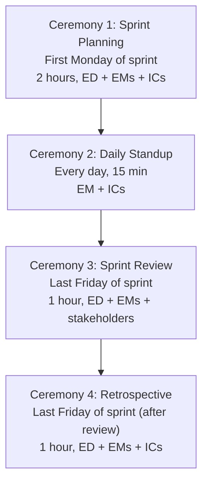

# Engineering Director Playbook
## Chapter 11

# Engineering Sprint Execution and Delivery

> *"The ED owns sprint execution. The 4 sprint ceremonies, the 3 delivery metrics, and the 5-criterion sprint quality bar are the ED's reference for engineering execution at the function level."*

---

## 1. Epigraph

_The ED owns sprint execution. The 4 sprint ceremonies, the 3 delivery metrics, and the 5-criterion sprint quality bar are the ED's reference for engineering execution at the function level._

---

## 2. Problem

You are an Engineering Director at acme-corp. The VP has just told you: "4 launches in Q4. Current sprint velocity is 60% of target. The team is missing sprint commitments. Customer escalations are rising. Design the sprint execution system. 30 days."

This chapter tells you the 4 sprint ceremonies, the 3 delivery metrics, and the 5-criterion sprint quality bar.

**Decision in one sentence:** _ED engineering sprint execution is a 4-ceremony system (sprint planning + daily standup + sprint review + retrospective) with 3 delivery metrics (velocity + quality + predictability) and 5-criterion sprint quality bar; the ED's job is to design the ceremonies, track the metrics, and own the predictability._

---

## 3. Why EDs Fail Here

Five named failure modes of EDs whose engineering sprint execution produced zero results.

- **The 1-Ceremony Failure.** The ED has no ceremonies. _No rhythm._
- **The 60%-Velocity Failure.** Sprint velocity is 60% of target. _Underdelivery._
- **The No-Quality-Metric Failure.** The ED doesn't track bugs escaped. _Quality drops._
- **The No-Predictability Failure.** Sprints miss commitments. _Launches slip._
- **The No-Retrospective-Action Failure.** Retros are complaints only. _No improvement._

---

## 4. Mental Models

Four mental models that compress sprint execution.

**mental model 1: The 4 Sprint Ceremonies.** 4 ceremonies, weekly cadence.



**The 4 ceremonies:**
- **Ceremony 1: Sprint Planning.** First Monday of sprint. 2 hours, ED + EMs + ICs.
- **Ceremony 2: Daily Standup.** Every day, 15 min. EM + ICs.
- **Ceremony 3: Sprint Review.** Last Friday of sprint. 1 hour, ED + EMs + stakeholders.
- **Ceremony 4: Retrospective.** Last Friday of sprint (after review). 1 hour, ED + EMs + ICs.

**mental model 2: The 3 Delivery Metrics.** 3 metrics.

```
1. Velocity: story points shipped per sprint per team
2. Quality: bugs escaped per sprint per team
3. Predictability: % of sprint commitments delivered

Targets:
- Velocity: +10% per quarter (continuous improvement)
- Quality: <5 bugs escaped per quarter
- Predictability: 80%+ commitments delivered
```

**mental model 3: The 5-Criterion Sprint Quality Bar.** 5 criteria per sprint.

```
1. Velocity: +5% per sprint
2. Quality: <2 bugs escaped per sprint
3. Predictability: 80%+ commitments delivered
4. Retrospective actions: 3+ actions per sprint, 80%+ completed
5. Cross-team sync: 1+ cross-team sync per sprint
```

**mental model 4: The Retrospective Action Tracker.** 3-5 actions per sprint.

```mermaid
%% Figure 11.2 — Retrospective action tracker
flowchart LR
    A1[Action 1<br/>Owner: [Name]<br/>Status: TODO]
    A2[Action 2<br/>Owner: [Name]<br/>Status: TODO]
    A3[Action 3<br/>Owner: [Name]<br/>Status: TODO]
    A1 --> Review[Next sprint retro<br/>Review status]
    A2 --> Review
    A3 --> Review
```

**The 3 actions:**
- **Action 1.** Owner: [Name]. Status: TODO/DONE.
- **Action 2.** Owner: [Name]. Status: TODO/DONE.
- **Action 3.** Owner: [Name]. Status: TODO/DONE.

---

## 5. Frameworks

Three frameworks for sprint execution.

### Framework 1: The 1-Page Sprint Plan

```
# Sprint Plan — Sprint [N] — [Date]

## Sprint goal
[1 sentence on what the sprint will deliver.]

## The 4 ceremonies
- Sprint planning: [Date]
- Daily standup: [Time]
- Sprint review: [Date]
- Retrospective: [Date]

## The 3 metrics targets
- Velocity: [target]
- Quality: [target]
- Predictability: [target]

## The 1 thing the ED will NOT compromise on
[1 sentence.]
```

### Framework 2: The Sprint Review Template

```
# Sprint Review — Sprint [N] — [Date]

## Demo
- [Feature 1] — Owner: [Name] — Status: DONE
- [Feature 2]
- [Feature 3]

## The 3 metrics
- Velocity: [actual vs target]
- Quality: [bugs escaped vs target]
- Predictability: [% commitments delivered]

## The 1 thing that went well
[1 sentence.]

## The 1 thing that didn't go well
[1 sentence.]
```

### Framework 3: The Retrospective Action Tracker

```
# Retrospective Actions — Sprint [N] — [Date]

## Top 3 actions
1. [Action 1] — Owner: [Name] — Status: TODO
2. [Action 2] — Owner: [Name] — Status: TODO
3. [Action 3] — Owner: [Name] — Status: TODO

## Last sprint's actions
1. [Last Action 1] — Status: DONE/PARTIAL/NOT DONE
2. [Last Action 2]
3. [Last Action 3]

## The 1 thing the team will NOT skip
[1 sentence.]
```

---

## 6. Drill

You are an ED at **acme-corp**. The VP has given you 30 days to fix sprint execution.

```
Current state:
- Sprint velocity: 60% of target
- Bugs escaped: 12 per quarter (target <5)
- Sprint commitments delivered: 65% (target 80%+)

30 engineers across 5 EMs.
```

You have **90 minutes**. Produce the **sprint execution system redesign** (`portfolio/chapter-11-engineering-execution.md`) using Framework 1 (Sprint Plan) + Framework 2 (Sprint Review) + Framework 3 (Retrospective). Specify:

- The 1-page sprint plan (sprint goal, 4 ceremonies, the 1 not compromise).
- The sprint review template (demo, 3 metrics, the 1 thing).
- The retrospective action tracker (3 actions, last sprint review, the 1 not skip).
- The 30-day timeline.
- The 1 thing you'll say to the VP in the first review.
- The 3 things you'll do to avoid the 5 failure modes.

**Deliverable:** `portfolio/chapter-11-engineering-execution.md` — under 1500 words.

---

## 7. Worked Example

**The 1-page sprint plan (Sprint 12):**

```
# Sprint Plan — Sprint 12 — 2026-09-30 to 2026-10-11

## Sprint goal
Ship 2 of 4 launches: Auth integration simplification
+ Custom data connector framework.

## The 4 ceremonies
- Sprint planning: 2026-09-30 (Mon), 2 hours
- Daily standup: 9:30 AM every day, 15 min
- Sprint review: 2026-10-11 (Fri), 1 hour
- Retrospective: 2026-10-11 (Fri), 1 hour (after review)

## The 3 metrics targets
- Velocity: 80 points (target +5% from Sprint 11)
- Quality: <2 bugs escaped
- Predictability: 80%+ commitments delivered

## The 1 thing I will NOT compromise on
Sprint predictability. The 80%+ target is non-negotiable.
A team that misses 50%+ of commitments is in crisis.
```

**The sprint review template (Sprint 11):**

```
# Sprint Review — Sprint 11 — 2026-09-27

## Demo
- SAML migration guide — Owner: Eng A — Status: DONE
- API rate limits dashboard — Owner: Eng B — Status: DONE
- Mobile UI crashes (deferred to Q2 2027)

## The 3 metrics
- Velocity: 76 points (target 80, 95%)
- Quality: 2 bugs escaped (target <2, AT LIMIT)
- Predictability: 78% (target 80%, BELOW)

## The 1 thing that went well
Velocity recovered from 60% to 95%. The team is shipping
again.

## The 1 thing that didn't go well
Predictability dropped to 78%. 22% of commitments missed.
The retrospective will address this.
```

**The retrospective action tracker:**

```
# Retrospective Actions — Sprint 11 — 2026-09-27

## Top 3 actions
1. **Reduce sprint scope by 20%** — Owner: EM 1 — Status: TODO
2. **Add 1 buffer day for code review** — Owner: EM 2 — Status: TODO
3. **Daily blocker review (Mon, Wed, Fri)** — Owner: ED — Status: TODO

## Last sprint's actions
1. Velocity +5% target — Status: PARTIAL (95% vs 105%)
2. Quality <2 bugs — Status: DONE (2 bugs)
3. Predictability 80%+ — Status: NOT DONE (78%)

## The 1 thing the team will NOT skip
Daily blocker review. Without it, blockers compound
and sprints miss commitments.
```

**The 1 thing I'll say to the VP in the first review:**

```
"Here's the sprint execution system:

  4 ceremonies: sprint planning + daily standup +
  sprint review + retrospective

  3 metrics:
  - Velocity: 76/80 points (95% — was 60%)
  - Quality: 2 bugs escaped (target <2, AT LIMIT)
  - Predictability: 78% (target 80%+, BELOW)

  Top 3 retrospective actions:
  1. Reduce sprint scope by 20% (EM 1)
  2. Add 1 buffer day for code review (EM 2)
  3. Daily blocker review (ED)

  The 1 thing I want to focus on: predictability.
  78% is BELOW target. 22% of commitments missed.
  The retrospective will address this.

  The 1 thing I will NOT compromise on: sprint
  predictability. 80%+ is non-negotiable.

  Sprint execution is the discipline. Predictability
  is the outcome."
```

**The 3 things I'll do to avoid the 5 failure modes:**

```
1. Run all 4 sprint ceremonies (not just standup).
   (Avoids the 1-Ceremony Failure.)
   - Sprint planning (Mon, 2 hours)
   - Daily standup (9:30 AM, 15 min)
   - Sprint review (Fri, 1 hour)
   - Retrospective (Fri, 1 hour)

2. Track the 3 delivery metrics.
   (Avoids the 60%-Velocity Failure.)
   - Velocity: +5% per sprint
   - Quality: <2 bugs escaped
   - Predictability: 80%+

3. Track retrospective actions (not just complaints).
   (Avoids the No-Retrospective-Action Failure.)
   - 3 actions per retro
   - Owner + status
   - Reviewed next retro
```

---

## 8. Failure Mode Postmortem

An ED at a 200-person B2B AI company had only daily standup. Sprint velocity was 60% of target. Bugs escaped: 12 per quarter. Sprint commitments delivered: 65%. The 4 launches slipped by 2 quarters.

The replacement ED did 3 things:
1. Ran all 4 ceremonies (planning + standup + review + retro).
2. Tracked the 3 metrics (velocity + quality + predictability).
3. Tracked retrospective actions (3 actions per retro, owner + status).

Within 6 months: velocity recovered to 95%, bugs escaped to 2, predictability to 82%. The 4-ceremony + 3-metric + 3-action system was the discipline.

What the first ED missed: sprint execution is a system. The first ED had 1 ceremony. The second ED had 4. The 4-ceremony system is the leverage.

The lesson: the ED who has 4 ceremonies + 3 metrics + 3 actions has a predictable sprint cadence. The ED who has 1 ceremony has launch slips.

---

## 9. Self-Assessment Rubric

| # | Dimension | 1 (Novice) | 3 (Competent) | 5 (Expert) |
|---|---|---|---|---|
| 1 | **4 sprint ceremonies** | 1 ceremony | 2-3 ceremonies | 4 ceremonies (planning + standup + review + retro) |
| 2 | **3 delivery metrics** | 0-1 metrics | 2 metrics | 3 metrics (velocity + quality + predictability) |
| 3 | **5-criterion sprint bar** | 0-2 criteria | 3-4 criteria | 5 criteria per sprint |
| 4 | **Sprint predictability** | <70% | 70-80% | 80%+ commitments delivered |
| 5 | **Retrospective actions** | No actions | Actions exist | 3 actions per retro, 80%+ completed |

**Disqualifier:** any 1 on dimension 1 or 2. An ED who has 1 ceremony or 0-1 metrics is in the 1-Ceremony or 60%-Velocity failure mode.

**Total:** ___ / 25. **Pass threshold:** 18/25, no dimension below 3.

---

## 10. Portfolio Artifact Note

Save your filled-in drill as `portfolio/chapter-11-engineering-execution.md` — interview evidence for "How do you run engineering sprint execution?" (see Portfolio Map in Chapter 27).

---

## 11. Interview Questions

1. **Walk me through your sprint execution system.**
2. **Velocity is 60% of target. What do you do?**
3. **Sprint predictability is 65%. What do you do?**
4. **Bugs escaped are 12 per quarter. What do you do?**
5. **Walk me through a sprint retro you've led.**
