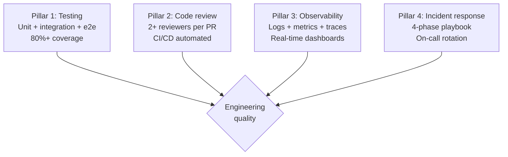
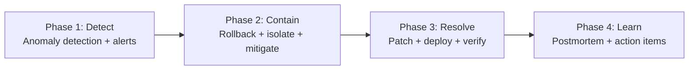

# Engineering Director Playbook
## Chapter 12

# Engineering Quality and Reliability

> *"The ED owns engineering quality. The 4 quality pillars, the 3 reliability metrics, and the 5-criterion quality bar are the ED's reference for engineering quality at the function level."*

---

## 1. Epigraph

_The ED owns engineering quality. The 4 quality pillars, the 3 reliability metrics, and the 5-criterion quality bar are the ED's reference for engineering quality at the function level._

---

## 2. Problem

You are an Engineering Director at acme-corp. The VP has just told you: "99.7% uptime vs 99.9% target. 8 bugs escaped last quarter. Customer escalations: 12 per quarter. Design the quality + reliability system. 90 days."

This chapter tells you the 4 quality pillars, the 3 reliability metrics, and the 5-criterion quality bar.

**Decision in one sentence:** _ED engineering quality is a 4-pillar system (testing + code review + observability + incident response) with 3 reliability metrics (uptime + MTTR + error rate) and 5-criterion quality bar; the ED's job is to design the quality system, track the reliability metrics, and own the customer escalations._

---

## 3. Why EDs Fail Here

Five named failure modes of EDs whose engineering quality produced zero results.

- **The No-Quality-System Failure.** The ED has no quality system. _Bugs accumulate._
- **The 99.7%-Uptime Failure.** Uptime is below target. _Customer trust lost._
- **The 8-Bugs-Escaped Failure.** 8 bugs escaped last quarter. _Customer escalations._
- **The No-Observability Failure.** The ED has no observability stack. _Issues detected late._
- **The No-Incident-Process Failure.** The ED has no incident playbook. _Crisis response ad-hoc._

---

## 4. Mental Models

Four mental models that compress engineering quality.

**mental model 1: The 4 Quality Pillars.** 4 pillars.



**The 4 pillars:**
- **Pillar 1: Testing.** Unit + integration + e2e. 80%+ coverage.
- **Pillar 2: Code review.** 2+ reviewers per PR. CI/CD automated.
- **Pillar 3: Observability.** Logs + metrics + traces. Real-time dashboards.
- **Pillar 4: Incident response.** 4-phase playbook. On-call rotation.

**mental model 2: The 3 Reliability Metrics.** 3 metrics.

```
1. Uptime: % availability (target 99.9%)
2. MTTR: Mean Time To Recover (target <30 min)
3. Error rate: errors per million requests (target <100)

The 3 metrics are tracked in real-time via
Datadog / CloudWatch / Grafana.
```

**mental model 3: The 5-Criterion Quality Bar.** 5 criteria.

```
1. Test coverage: 80%+
2. Code review: 2+ reviewers per PR
3. PR cycle time: <2 days
4. Bug escape rate: <5 per quarter
5. Incident MTTR: <30 min
```

**mental model 4: The 4-Phase Incident Playbook.** 4 phases.



**The 4 phases:**
- **Phase 1: Detect.** Anomaly detection + alerts.
- **Phase 2: Contain.** Rollback + isolate + mitigate.
- **Phase 3: Resolve.** Patch + deploy + verify.
- **Phase 4: Learn.** Postmortem + action items.

---

## 5. Frameworks

Three frameworks for engineering quality.

### Framework 1: The 1-Page Quality Plan

```
# Engineering Quality Plan — [Year] — [Date]

## The 4 pillars
1. Testing: 80%+ coverage
2. Code review: 2+ reviewers per PR
3. Observability: logs + metrics + traces
4. Incident response: 4-phase playbook

## The 3 reliability metrics
- Uptime: 99.9% (target)
- MTTR: <30 min (target)
- Error rate: <100/million (target)

## The 1 thing the ED will NOT compromise on
[1 sentence.]
```

### Framework 2: The Reliability Scorecard

```
# Reliability Scorecard — [Quarter]

| Service | Uptime | MTTR | Error rate | Status |
|---------|--------|------|------------|--------|
| [Service 1] | [%] | [min] | [/M] | [Status] |
| [Service 2] | ... | | | |

## Top 3 risks
1. [Risk 1]
2. [Risk 2]
3. [Risk 3]
```

### Framework 3: The Incident Postmortem Template

```
# Incident Postmortem — [Date] — [Service]

## The 5-fact postmortem
1. What happened: [1 sentence]
2. When it happened: [Date, time, duration]
3. Customer impact: [N customers, $XM revenue]
4. Root cause: [1 sentence]
5. Action items: [3-5 items]

## The 4-phase review
- Detect: [time to detect]
- Contain: [time to contain]
- Resolve: [time to resolve]
- Learn: [postmortem completed]

## The 1 thing the ED will NOT skip
[1 sentence.]
```

---

## 6. Drill

You are an ED at **acme-corp**. The VP has given you 90 days to fix quality + reliability.

```
Current state:
- 99.7% uptime (target 99.9%)
- 8 bugs escaped last quarter (target <5)
- 12 customer escalations per quarter
- No observability stack

30 engineers across 5 EMs.
```

You have **90 minutes**. Produce the **quality + reliability system** (`portfolio/chapter-12-engineering-quality.md`) using Framework 1 (Quality Plan) + Framework 2 (Reliability Scorecard) + Framework 3 (Postmortem). Specify:

- The 1-page quality plan (4 pillars, 3 metrics, the 1 not compromise).
- The reliability scorecard (top 5 services, current state, top 3 risks).
- The incident postmortem template (5 facts, 4-phase review, the 1 not skip).
- The 90-day timeline.
- The 1 thing you'll say to the VP in the first review.
- The 3 things you'll do to avoid the 5 failure modes.

**Deliverable:** `portfolio/chapter-12-engineering-quality.md` — under 1500 words.

---

## 7. Worked Example

**The 1-page quality plan:**

```
# Engineering Quality Plan — 2026 — 2026-09-01

## The 4 pillars
1. Testing: 80%+ coverage (current: 65%)
2. Code review: 2+ reviewers per PR (current: 1.2 avg)
3. Observability: Datadog (logs + metrics + traces)
4. Incident response: 4-phase playbook

## The 3 reliability metrics
- Uptime: 99.9% (current: 99.7%)
- MTTR: <30 min (current: 4 hours)
- Error rate: <100/M (current: 350/M)

## The 1 thing I will NOT compromise on
Incident MTTR. <30 min is non-negotiable. The 4-hour
MTTR is a customer trust crisis.
```

**The reliability scorecard:**

```
# Reliability Scorecard — Q3 2026

| Service | Uptime | MTTR | Error rate | Status |
|---------|--------|------|------------|--------|
| Auth | 99.95% | 15 min | 50/M | GREEN |
| API Gateway | 99.7% | 4 hours | 350/M | RED |
| Data Pipeline | 99.85% | 30 min | 80/M | YELLOW |
| ML Serving | 99.5% | 6 hours | 500/M | RED |
| Web App | 99.95% | 10 min | 30/M | GREEN |

## Top 3 risks
1. API Gateway (RED): 99.7% uptime, 4-hour MTTR
2. ML Serving (RED): 99.5% uptime, 6-hour MTTR
3. Data Pipeline (YELLOW): close to RED
```

**The incident postmortem template:**

```
# Incident Postmortem — 2026-09-15 — API Gateway

## The 5-fact postmortem
1. What happened: API Gateway returned 500 errors for 4 hours
2. When it happened: 2026-09-15, 2pm-6pm (4 hours)
3. Customer impact: 50 customers, $200K revenue
4. Root cause: DB connection pool exhausted due to slow query
5. Action items:
   - Add connection pool monitoring
   - Set query timeout
   - Add load shedding
   - Update runbook

## The 4-phase review
- Detect: 5 min (anomaly detection)
- Contain: 30 min (rollback to previous version)
- Resolve: 4 hours (patch deployed)
- Learn: 1 day (postmortem completed)

## The 1 thing I will NOT skip
Root cause analysis. Without it, the same incident
will recur.
```

**The 1 thing I'll say to the VP in the first review:**

```
"Here's the engineering quality + reliability system:

  4 pillars: testing + code review + observability +
  incident response

  3 metrics:
  - Uptime: 99.7% → 99.9% (target)
  - MTTR: 4 hours → <30 min (target)
  - Error rate: 350/M → <100/M (target)

  Top 3 risks (current state):
  1. API Gateway (RED): 99.7%, 4-hour MTTR
  2. ML Serving (RED): 99.5%, 6-hour MTTR
  3. Data Pipeline (YELLOW): close to RED

  The 1 thing I want to focus on: API Gateway reliability.
  99.7% uptime + 4-hour MTTR is a customer trust crisis.

  The 1 thing I will NOT compromise on: incident MTTR.
  <30 min is non-negotiable.

  Quality is the discipline. Reliability is the outcome."
```

**The 3 things I'll do to avoid the 5 failure modes:**

```
1. Build the 4-pillar quality system.
   (Avoids the No-Quality-System Failure.)
   - Testing (80%+ coverage)
   - Code review (2+ reviewers)
   - Observability (Datadog)
   - Incident response (4-phase playbook)

2. Track the 3 reliability metrics in real-time.
   (Avoids the 99.7%-Uptime Failure.)
   - Uptime (target 99.9%)
   - MTTR (target <30 min)
   - Error rate (target <100/M)

3. Use the 4-phase incident playbook.
   (Avoids the No-Incident-Process Failure.)
   - Detect (anomaly detection)
   - Contain (rollback)
   - Resolve (patch + deploy)
   - Learn (postmortem)
```

---

## 8. Failure Mode Postmortem

An ED at a 200-person B2B AI company had no quality system. 99.7% uptime, 8 bugs escaped per quarter, 12 customer escalations. The team was reactive, not proactive. The customer trust was eroding.

The replacement ED did 3 things:
1. Built the 4-pillar quality system (testing + code review + observability + incident response).
2. Tracked the 3 reliability metrics in real-time (uptime + MTTR + error rate).
3. Used the 4-phase incident playbook (detect + contain + resolve + learn).

Within 6 months: 99.9% uptime, 2 bugs escaped, 4 customer escalations. The 4-pillar + 3-metric + 4-phase system was the discipline.

What the first ED missed: quality is a system. The first ED had no quality system. The second ED had 4 pillars. The 4-pillar system is the leverage.

The lesson: the ED who has 4 pillars + 3 metrics + 4-phase playbook has a quality system. The ED who has no quality system has customer escalations.

---

## 9. Self-Assessment Rubric

| # | Dimension | 1 (Novice) | 3 (Competent) | 5 (Expert) |
|---|---|---|---|---|
| 1 | **4 quality pillars** | 0-1 pillars | 2-3 pillars | 4 pillars (testing + code review + observability + incident response) |
| 2 | **3 reliability metrics** | 0-1 metrics | 2 metrics | 3 metrics (uptime + MTTR + error rate), tracked real-time |
| 3 | **5-criterion quality bar** | 0-2 criteria | 3-4 criteria | 5 criteria (coverage + reviewers + cycle + bugs + MTTR) |
| 4 | **4-phase incident playbook** | No playbook | Playbook exists | 4 phases (detect + contain + resolve + learn) |
| 5 | **Uptime** | <99.5% | 99.5-99.9% | 99.9%+ |

**Disqualifier:** any 1 on dimension 1 or 2. An ED who has 0-1 pillars or 0-1 metrics is in the No-Quality-System or 99.7%-Uptime failure mode.

**Total:** ___ / 25. **Pass threshold:** 18/25, no dimension below 3.

---

## 10. Portfolio Artifact Note

Save your filled-in drill as `portfolio/chapter-12-engineering-quality.md` — interview evidence for "How do you run engineering quality + reliability?" (see Portfolio Map in Chapter 27).

---

## 11. Interview Questions

1. **Walk me through your engineering quality system.**
2. **Uptime is 99.7% vs 99.9% target. What do you do?**
3. **8 bugs escaped last quarter. What do you do?**
4. **A major outage happens. What do you do?**
5. **Walk me through an incident postmortem you've led.**
