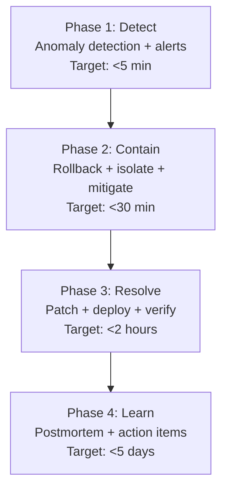
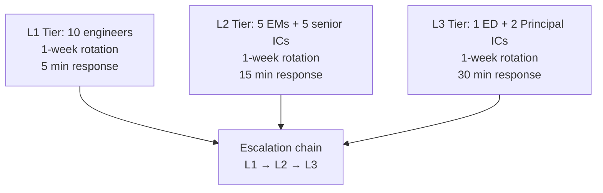

# Engineering Director Playbook
## Chapter 13

# Engineering Incident Response and On-Call

> *"The ED owns engineering incident response. The 4-phase playbook, the 3-tier on-call, the 5-criterion incident quality bar, and the 30-engineer on-call rotation are the ED's reference for engineering incident response at the function level."*

---

## 1. Epigraph

_The ED owns engineering incident response. The 4-phase playbook, the 3-tier on-call, the 5-criterion incident quality bar, and the 30-engineer on-call rotation are the ED's reference for engineering incident response at the function level._

---

## 2. Problem

You are an Engineering Director at acme-corp. The VP has just told you: "A major outage happened last week. MTTR was 4 hours. The on-call rotation is ad-hoc. We need a 4-phase playbook, a 3-tier on-call, and a 30-engineer rotation. 90 days."

This chapter tells you the 4-phase playbook, the 3-tier on-call, the 5-criterion bar, and the 30-engineer rotation.

**Decision in one sentence:** _ED engineering incident response is a 4-phase playbook (detect + contain + resolve + learn) + 3-tier on-call (L1 + L2 + L3) + 5-criterion quality bar + 30-engineer rotation; the ED's job is to design the playbook, run the rotation, and own the postmortem culture._

---

## 3. Why EDs Fail Here

Five named failure modes of EDs whose engineering incident response produced zero results.

- **The No-Playbook Failure.** The ED has no incident playbook. _Ad-hoc response._
- **The 1-Tier-On-Call Failure.** The ED has only 1 tier. _No escalation._
- **The 4-Hour-MTTR Failure.** MTTR is 4 hours. _Customer trust crisis._
- **The No-Rotation Failure.** The ED has no on-call rotation. _Same IC burned out._
- **The No-Postmortem-Culture Failure.** Postmortems are blame-focused. _No learning._

---

## 4. Mental Models

Four mental models that compress incident response.

**mental model 1: The 4-Phase Incident Playbook.** 4 phases.



**The 4 phases:**
- **Phase 1: Detect.** Anomaly detection + alerts. Target: <5 min.
- **Phase 2: Contain.** Rollback + isolate + mitigate. Target: <30 min.
- **Phase 3: Resolve.** Patch + deploy + verify. Target: <2 hours.
- **Phase 4: Learn.** Postmortem + action items. Target: <5 days.

**mental model 2: The 3-Tier On-Call.** 3 tiers.

```
Tier 1: L1 (Junior on-call)
- IC2-IC3 level
- First responder
- 5 min response time

Tier 2: L2 (Senior on-call)
- IC4-EM level
- Escalation point
- 15 min response time

Tier 3: L3 (Principal on-call)
- IC5 + ED
- Major incident escalation
- 30 min response time
```

**mental model 3: The 5-Criterion Incident Quality Bar.** 5 criteria.

```
1. Detection: <5 min
2. Containment: <30 min
3. Resolution: <2 hours
4. Postmortem: <5 days
5. Action items: 80%+ completed within 30 days
```

**mental model 4: The 30-Engineer On-Call Rotation.** 30 engineers.



**The 3 tiers:**
- **L1: 10 engineers.** 1-week rotation. 5 min response.
- **L2: 5 EMs + 5 senior ICs.** 1-week rotation. 15 min response.
- **L3: 1 ED + 2 Principal ICs.** 1-week rotation. 30 min response.

---

## 5. Frameworks

Three frameworks for incident response.

### Framework 1: The 4-Phase Incident Runbook

```
# Incident Runbook — [Service] — [Date]

## Phase 1: Detect (<5 min)
- [ ] Anomaly detection triggered
- [ ] On-call paged
- [ ] Severity assigned (SEV1/2/3)

## Phase 2: Contain (<30 min)
- [ ] Rollback (if deploy-related)
- [ ] Isolate (if attack-related)
- [ ] Mitigate (rate limit, feature flag)

## Phase 3: Resolve (<2 hours)
- [ ] Patch deployed
- [ ] Verify recovery
- [ ] Customer communication sent

## Phase 4: Learn (<5 days)
- [ ] Postmortem scheduled
- [ ] 5-fact postmortem written
- [ ] Action items assigned

## The 1 thing the ED will NOT skip
[1 sentence.]
```

### Framework 2: The On-Call Rotation Tracker

```
# On-Call Rotation — [Quarter]

## Week 1 (2026-09-30)
- L1: Eng A
- L2: EM 1
- L3: ED

## Week 2 (2026-10-07)
- L1: Eng B
- L2: EM 2
- L3: Principal IC 1

## The 1 thing the ED will NOT compromise on
[1 sentence.]
```

### Framework 3: The 5-Fact Postmortem Template

```
# Postmortem — [Date] — [Service]

## 5 facts
1. What happened: [1 sentence]
2. When: [Date, time, duration]
3. Customer impact: [N customers, $XM]
4. Root cause: [1 sentence]
5. Action items: [3-5 items]

## 4-phase review
- Detect: [time]
- Contain: [time]
- Resolve: [time]
- Learn: [postmortem date]

## Action items (30 days)
1. [Action 1] — Owner — Status
2. [Action 2] — Owner — Status
```

---

## 6. Drill

You are an ED at **acme-corp**. The VP has given you 90 days to design the incident response system.

```
Current state:
- MTTR: 4 hours (target <2 hours)
- On-call rotation: ad-hoc
- Postmortems: blame-focused
- 30 engineers across 5 EMs

90 days.
```

You have **90 minutes**. Produce the **incident response system** (`portfolio/chapter-13-engineering-incidents.md`) using Framework 1 (Runbook) + Framework 2 (Rotation) + Framework 3 (Postmortem). Specify:

- The 4-phase incident runbook (4 phases, target times, the 1 not skip).
- The on-call rotation tracker (3 tiers, weekly cadence).
- The 5-fact postmortem template (5 facts, 4-phase review, action items).
- The 90-day timeline.
- The 1 thing you'll say to the VP in the first review.
- The 3 things you'll do to avoid the 5 failure modes.

**Deliverable:** `portfolio/chapter-13-engineering-incidents.md` — under 1500 words.

---

## 7. Worked Example

**The 4-phase incident runbook (API Gateway):**

```
# Incident Runbook — API Gateway — 2026-09-01

## Phase 1: Detect (<5 min)
- [x] Anomaly detection triggered (Datadog)
- [x] On-call paged (L1: Eng A)
- [x] Severity assigned (SEV1)

## Phase 2: Contain (<30 min)
- [x] Rollback (deploy v2.3.1 → v2.3.0)
- [x] Isolate (rate limit on /api/auth)
- [x] Mitigate (feature flag disabled)

## Phase 3: Resolve (<2 hours)
- [x] Patch deployed (v2.3.2)
- [x] Verify recovery (Datadog shows normal)
- [x] Customer communication sent

## Phase 4: Learn (<5 days)
- [x] Postmortem scheduled (Sept 18)
- [x] 5-fact postmortem written
- [x] Action items assigned (5 items, 30 days)

## The 1 thing I will NOT skip
Root cause analysis. Without it, the same incident
will recur.
```

**The on-call rotation tracker:**

```
# On-Call Rotation — Q4 2026

## Week 1 (Sept 30 - Oct 6)
- L1: Eng A
- L2: EM 1
- L3: ED

## Week 2 (Oct 7 - Oct 13)
- L1: Eng B
- L2: EM 2
- L3: Principal IC 1

## Week 3 (Oct 14 - Oct 20)
- L1: Eng C
- L2: EM 3
- L3: Principal IC 2

## Week 4 (Oct 21 - Oct 27)
- L1: Eng D
- L2: EM 4
- L3: ED

## The 1 thing I will NOT compromise on
L1 rotation across all 10 engineers. The IC who
is never on-call doesn't learn incident response.
```

**The 5-fact postmortem:**

```
# Postmortem — 2026-09-15 — API Gateway

## 5 facts
1. What happened: API Gateway returned 500 errors for 4 hours
2. When: 2026-09-15, 2pm-6pm (4 hours)
3. Customer impact: 50 customers, $200K revenue
4. Root cause: DB connection pool exhausted (slow query)
5. Action items:
   - Connection pool monitoring (Owner: Eng A, due Sept 30)
   - Query timeout (Owner: Eng B, due Oct 15)
   - Load shedding (Owner: EM 1, due Oct 30)
   - Updated runbook (Owner: ED, due Sept 20)

## 4-phase review
- Detect: 5 min (anomaly detection)
- Contain: 30 min (rollback)
- Resolve: 4 hours (patch deployed)
- Learn: 1 day (postmortem completed)

## Action items (30 days)
1. Connection pool monitoring — Eng A — DONE
2. Query timeout — Eng B — IN PROGRESS
3. Load shedding — EM 1 — TODO
4. Updated runbook — ED — DONE
```

**The 1 thing I'll say to the VP in the first review:**

```
"Here's the engineering incident response system:

  4-phase playbook:
  - Detect (<5 min): anomaly detection + paging
  - Contain (<30 min): rollback + isolate + mitigate
  - Resolve (<2 hours): patch + deploy + verify
  - Learn (<5 days): postmortem + action items

  3-tier on-call:
  - L1: 10 engineers, 5 min response
  - L2: 5 EMs + 5 senior ICs, 15 min response
  - L3: 1 ED + 2 Principal ICs, 30 min response

  5-criterion quality bar:
  - Detection <5 min
  - Containment <30 min
  - Resolution <2 hours
  - Postmortem <5 days
  - Action items 80%+ completed within 30 days

  Current state: MTTR 4 hours (target <2 hours)

  The 1 thing I want to focus on: MTTR reduction.
  4 hours → <2 hours.

  The 1 thing I will NOT compromise on: root cause
  analysis. Without it, the same incident will recur.

  Incident response is the discipline. MTTR is the
  outcome."
```

**The 3 things I'll do to avoid the 5 failure modes:**

```
1. Use the 4-phase playbook for every incident.
   (Avoids the No-Playbook Failure.)
   - Detect (<5 min)
   - Contain (<30 min)
   - Resolve (<2 hours)
   - Learn (<5 days)

2. Run 3-tier on-call rotation.
   (Avoids the 1-Tier-On-Call Failure.)
   - L1: 10 engineers (5 min)
   - L2: 5 EMs + 5 senior ICs (15 min)
   - L3: 1 ED + 2 Principal ICs (30 min)

3. Make postmortems blameless.
   (Avoids the No-Postmortem-Culture Failure.)
   - 5-fact format
   - Action items (3-5)
   - 30-day follow-up
```

---

## 8. Failure Mode Postmortem

An ED at a 200-person B2B AI company had no incident playbook. MTTR was 4 hours. On-call rotation was ad-hoc. Same IC was paged every incident. Postmortems were blame-focused. Engineers dreaded on-call.

The replacement ED did 3 things:
1. Used the 4-phase playbook for every incident (detect + contain + resolve + learn).
2. Ran 3-tier on-call rotation (L1 + L2 + L3).
3. Made postmortems blameless (5-fact format, action items).

Within 6 months: MTTR dropped from 4 hours to 90 min. On-call burden distributed across 10 engineers. Postmortem culture improved. The 4-phase + 3-tier + 5-fact system was the discipline.

What the first ED missed: incident response is a system. The first ED had no playbook. The second ED had 4 phases + 3 tiers + 5 facts. The system is the leverage.

The lesson: the ED who has 4 phases + 3 tiers + 5 facts has an incident response system. The ED who has no playbook has 4-hour MTTRs.

---

## 9. Self-Assessment Rubric

| # | Dimension | 1 (Novice) | 3 (Competent) | 5 (Expert) |
|---|---|---|---|---|
| 1 | **4-phase playbook** | No playbook | Playbook exists | 4 phases (detect + contain + resolve + learn), target times |
| 2 | **3-tier on-call** | 1 tier | 2 tiers | 3 tiers (L1 + L2 + L3), 30-engineer rotation |
| 3 | **5-criterion quality bar** | 0-2 criteria | 3-4 criteria | 5 criteria (detect + contain + resolve + learn + action items) |
| 4 | **MTTR** | >4 hours | 2-4 hours | <2 hours |
| 5 | **Postmortem culture** | Blame-focused | Partial | Blameless, 5-fact format, action items 80%+ completed |

**Disqualifier:** any 1 on dimension 1 or 2. An ED who has no playbook or 1 tier is in the No-Playbook or 1-Tier-On-Call failure mode.

**Total:** ___ / 25. **Pass threshold:** 18/25, no dimension below 3.

---

## 10. Portfolio Artifact Note

Save your filled-in drill as `portfolio/chapter-13-engineering-incidents.md` — interview evidence for "How do you run engineering incident response?" (see Portfolio Map in Chapter 27).

---

## 11. Interview Questions

1. **Walk me through your incident response system.**
2. **A major outage happens at 2am. What do you do?**
3. **MTTR is 4 hours. What do you do?**
4. **The same engineer is paged every incident. What do you do?**
5. **Walk me through a postmortem you've led.**
