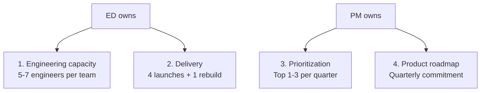
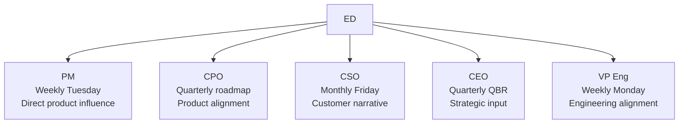

# Engineering Director Playbook
## Chapter 14

# Engineering and Product Partnership

> *"The ED partners with PM. The 4 ownership boundaries, the 3 cadence patterns, and the 5-stakeholder influence map are the ED's reference for engineering-product partnership at the function level."*

---

## 1. Epigraph

_The ED partners with PM. The 4 ownership boundaries, the 3 cadence patterns, and the 5-stakeholder influence map are the ED's reference for engineering-product partnership at the function level._

---

## 2. Problem

You are an Engineering Director at acme-corp. The PM has just told you: "5 themes from customer interviews. No PRFAs in review. The roadmap is locked for Q4. Customer is asking for auth integration. The CEO wants it in Q1 2027. You have 30 days to drive the ED-PM partnership."

This chapter tells you the 4 ownership boundaries, the 3 cadences, and the 5-stakeholder influence map.

**Decision in one sentence:** _ED engineering-product partnership is a 4-boundary ownership model (ED owns engineering capacity + delivery + technical roadmap; PM owns prioritization + product roadmap + customer narrative) with 3 cadences (weekly + biweekly + quarterly) and 5-stakeholder influence map; the ED's job is to provide high-quality engineering input, accept the PM's prioritization, and own the technical roadmap._

---

## 3. Why EDs Fail Here

Five named failure modes of EDs whose ED-PM partnership produced zero results.

- **The Slack-Channel Failure.** The ED drops engineering input in Slack. _The PM gets overwhelmed._
- **The No-1-Page-PRFA Failure.** The ED gives verbal input only. _The PM can't prioritize._
- **The PM-Tells-Me-What-To-Build Failure.** The ED defers to PM on engineering priorities. _Engineering needs are lost._
- **The ED-Tells-PM-What-To-Build Failure.** The ED demands the PM build specific features. _PM loses ownership._
- **The No-Cadence Failure.** ED and PM only talk in crisis. _Partnership is reactive._

---

## 4. Mental Models

Four mental models that compress the ED-PM partnership.

**mental model 1: The 4 Ownership Boundaries.** 4 things, 2 owners.



**The 4 boundaries:**
- **ED owns: 1. Engineering capacity.** 5-7 engineers per team.
- **ED owns: 2. Delivery.** 4 launches + 1 rebuild.
- **PM owns: 3. Prioritization.** Top 1-3 per quarter.
- **PM owns: 4. Product roadmap.** Quarterly commitment.

**mental model 2: The 3 Cadence Patterns.** 3 ways to sync.

```
1. Weekly sync (30 min, Tuesday)
   - Engineering capacity review
   - Top 3 PRFAs in progress/review
   - 1-3 decisions needed

2. Biweekly retrospective (60 min)
   - Customer highlights (wins + risks)
   - Engineering delivery trends
   - Roadmap impact

3. Quarterly roadmap review (90 min)
   - Engineering capacity + delivery outcomes
   - Next quarter engineering commitments
   - Roadmap changes
```

**mental model 3: The 1-Page PRFA Land-or-Die Test.** A 1-page PRFA either lands or dies.

```
A 1-page PRFA lands if:
- Customer impact is quantified ($XM or N customers)
- Workaround is documented
- Proposed solution is 1 paragraph
- Alternatives are 2-3
- Recommendation is clear
- Effort is estimated
- Engineering capacity is identified

A 1-page PRFA dies if:
- Customer impact is vague
- Workaround is undocumented
- Proposed solution is multi-page
- Alternatives are missing
- Recommendation is unclear
- Effort is unestimated
- Engineering capacity is unidentified
```

**mental model 4: The 5-Stakeholder Influence Map.** 5 stakeholders.



**The 5 stakeholders:**
- **PM (Weekly Tuesday).** Direct product influence.
- **CPO (Quarterly roadmap).** Product alignment.
- **CSO (Monthly Friday).** Customer narrative.
- **CEO (Quarterly QBR).** Strategic input.
- **VP Eng (Weekly Monday).** Engineering alignment.

---

## 5. Frameworks

Three frameworks for the ED-PM partnership.

### Framework 1: The 1-Page ED-PM Charter

```
# ED-PM Charter — [Date]

## Ownership boundaries
- ED owns: Engineering capacity + delivery + technical roadmap
- PM owns: Prioritization + product roadmap + customer narrative

## Cadence
- Weekly sync: Tuesday 10am, 30 min
- Biweekly retro: every other Wed 2pm, 60 min
- Quarterly roadmap review: Q[N], 90 min

## Top 3 engineering commitments
1. [Commitment 1] — Status: in progress
2. [Commitment 2]
3. [Commitment 3]

## Top 3 deferred engineering
1. [Deferred 1] — Why deferred
2. [Deferred 2]

## The 1 thing the ED will push back on
[1 sentence.]
```

### Framework 2: The Weekly Sync Agenda

```
# Weekly ED-PM Sync — [Date]

## 5 min: Engineering highlights
- Win: [Engineering win this week]
- Risk: [Engineering at risk this week]

## 15 min: Engineering capacity
- New themes: [N]
- Updated themes: [priority changes]
- Top 3 PRFAs (status)

## 10 min: Delivery progress
- In review: [Feature name]
- In progress: [Feature name]
- Merged: [Feature name]
- Deferred: [Feature name]

## 5 min: Open questions
- Q1: [Question 1]
- Q2: [Question 2]

## 5 min: Decisions needed
- D1: [Decision 1]
- D2: [Decision 2]
```

### Framework 3: The Engineering PRFA Decision Tracker

```
# Engineering PRFA Decision Tracker — [Quarter] — [Date]

| PRFA | Status | Decision | Date | Owner |
|------|--------|----------|------|-------|
| [PRFA 1] | Merged | [Quarter + sprint] | [Date] | [ED] |
| [PRFA 2] | Split | [PRFA 2a, PRFA 2b] | [Date] | [ED] |
| [PRFA 3] | Deferred | [Q[N+1]] | [Date] | [ED] |

## This quarter's PRFA outcomes
- Merged: [N]
- Split: [N]
- Deferred: [N]
- Killed: [N]
```

---

## 6. Drill

You are an ED at **acme-corp**. The PM has given you 30 days to drive the ED-PM partnership.

```
5 themes from customer interviews. No PRFAs in review.
Roadmap locked for Q4. CEO wants auth integration in Q1 2027.
30 engineers across 5 EMs. 4 launches + 1 rebuild in FY26.
```

You have **90 minutes**. Produce the **ED-PM partnership plan** (`portfolio/chapter-14-ed-pm-partnership.md`) using Framework 1 (Charter) + Framework 2 (Weekly Sync) + Framework 3 (PRFA Decision Tracker). Specify:

- The 1-page ED-PM charter (ownership, cadence, top 3 commitments, the 1 pushback).
- The weekly sync agenda (5 sections, 30 min).
- The PRFA decision tracker (5 PRFAs, status, decision, date).
- The 30-day plan.
- The 1 thing you'll say to the PM in the first sync.
- The 3 things you'll do to avoid the 5 failure modes.

**Deliverable:** `portfolio/chapter-14-ed-pm-partnership.md` — under 1500 words.

---

## 7. Worked Example

**The 1-page ED-PM charter:**

```
# ED-PM Charter — 2026-09-01

## Ownership boundaries
- ED owns: Engineering capacity (5 EMs × 5-7 ICs) +
  delivery (4 launches + 1 rebuild) + technical
  roadmap
- PM owns: Prioritization (top 1-3 per quarter) +
  product roadmap + customer narrative

## Cadence
- Weekly sync: Tuesday 10am, 30 min
- Biweekly retro: every other Wed 2pm, 60 min
- Quarterly roadmap review: Q[N], 90 min

## Top 3 engineering commitments
1. Auth integration simplification — in review
2. Custom data connector framework — in progress
3. SAML migration guide — merged

## Top 3 deferred engineering
1. Customer-facing observability — Q1 2027
2. API rate limits — Q1 2027 (need infra capacity)
3. Mobile UI crashes — Q2 2027

## The 1 thing I will push back on
Splitting the auth integration PRFA. The PM wants
to split into 2 PRFAs. I want it as one PRFA =
one roadmap item.
```

**The weekly sync agenda:**

```
# Weekly ED-PM Sync — 2026-09-08

## 5 min: Engineering highlights
- Win: Customer B's data connector framework is 80% done
- Risk: Customer A's auth integration still blocked

## 15 min: Engineering capacity
- New themes: 1 (mobile UI crashes, 2 customers)
- Updated themes: auth integration (5/5 customers)
- Top 3 PRFAs:
  - Auth integration: in review
  - Custom data connectors: in progress
  - SAML migration guide: merged

## 10 min: Delivery progress
- In review: Auth integration simplification (PM reviewing)
- In progress: Custom data connector framework
- Merged: SAML migration guide (shipped last week)
- Deferred: Customer-facing observability (Q1 2027)

## 5 min: Open questions
- Q1: Does the auth integration PRFA need security review?
- Q2: Can we share the SAML migration guide publicly?

## 5 min: Decisions needed
- D1: Auth integration → schedule security review this week
- D2: SAML migration guide → share publicly vs customer-only
```

**The PRFA decision tracker:**

```
# Engineering PRFA Decision Tracker — Q3 2026

| PRFA | Status | Decision | Date | Owner |
|------|--------|----------|------|-------|
| Auth integration simplification | In review | Q1 2027 (security review) | Sept 8 | ED |
| Custom data connectors | In progress | Q1 2027 | Sept 15 | ED |
| SAML migration guide | Merged | Q3 2026 | Aug 30 | ED |
| API rate limits | Deferred | Q1 2027 | Sept 10 | ED |
| Mobile UI crashes | Killed | [Not strategic] | Sept 8 | ED |

## This quarter's PRFA outcomes
- Merged: 1
- Split: 0
- Deferred: 3
- Killed: 1
```

**The 1 thing I'll say to the PM in the first sync:**

```
"Sarah, here's the ED-PM partnership plan:

  Ownership: ED owns engineering capacity + delivery +
  technical roadmap. PM owns prioritization + product
  roadmap + customer narrative.

  Cadence: Weekly Tuesday 30 min + biweekly retro +
  quarterly roadmap review.

  Top 3 engineering commitments:
  1. Auth integration simplification — in review
  2. Custom data connector framework — in progress
  3. SAML migration guide — merged

  Top 3 deferred: customer-facing observability, API
  rate limits, mobile UI crashes.

  The 1 thing I want to push back on: splitting the
  auth integration PRFA. I want it as one PRFA = one
  roadmap item.

  The partnership works when I provide high-quality
  engineering input + 1-page PRFAs + capacity estimates,
  and you prioritize. Let's see if we can land 2
  engineering PRFAs in the Q1 2027 roadmap."
```

**The 3 things I'll do to avoid the 5 failure modes:**

```
1. Write 1-page engineering PRFAs (not Slack messages).
   (Avoids the Slack-Channel Failure.)
   - Every prioritized engineering item gets a 1-page PRFA
   - 8 sections: problem, impact, workaround, solution,
     alternatives, recommendation, effort, capacity

2. Use the weekly sync (not crisis conversations).
   (Avoids the No-Cadence Failure.)
   - Tuesday 10am, 30 min, every week
   - 5 sections: highlights, capacity, delivery, questions, decisions

3. Respect ownership boundaries (ED = engineering, PM = product).
   (Avoids the ED-Tells-PM-What-To-Build Failure.)
   - ED provides engineering capacity + delivery
   - PM decides merge / split / defer / kill
   - ED accepts the PM's decision
```

---

## 8. Failure Mode Postmortem

An ED at a 200-person B2B AI company dropped engineering input in Slack. The PM was overwhelmed. 8 themes dumped in 1 week, 0 engineering PRFAs. The roadmap drifted. The customer churned because the auth integration didn't ship.

The replacement ED did 3 things:
1. Wrote 1-page engineering PRFAs (not Slack messages).
2. Established a weekly sync (Tuesday 30 min) with the PM.
3. Respected ownership boundaries (ED = engineering, PM = product).

Within 6 months: 5 engineering PRFAs in review with PM, 2 merged into Q1 2027 roadmap. 0 customer churn due to missing engineering features.

What the first ED missed: the ED-PM partnership is a system. The first ED used Slack. The second ED used 1-page PRFAs + weekly sync. The system is the leverage.

The lesson: the ED who has 1-page PRFAs + weekly sync has a partnership. The ED who uses Slack has a feedback dump.

---

## 9. Self-Assessment Rubric

| # | Dimension | 1 (Novice) | 3 (Competent) | 5 (Expert) |
|---|---|---|---|---|
| 1 | **4 ownership boundaries** | 0-1 boundaries | 2-3 boundaries | 4 boundaries, ED = engineering + delivery, PM = prioritization + roadmap |
| 2 | **3 cadences** | 1 cadence | 2 cadences | 3 cadences (weekly + biweekly + quarterly) |
| 3 | **1-page engineering PRFA quality** | No PRFAs | PRFAs exist | 1-page PRFAs, 8 sections, 80%+ landing rate |
| 4 | **Weekly sync** | No sync | Weekly sync | Weekly sync, 30 min, 5 sections |
| 5 | **Engineering PRFA decision tracking** | No tracking | Tracker exists | Tracker with status + decision + date |

**Disqualifier:** any 1 on dimension 1 or 3. An ED who has 0-1 boundaries or no PRFAs is in the Slack-Channel or No-1-Page-PRFA failure mode.

**Total:** ___ / 25. **Pass threshold:** 18/25, no dimension below 3.

---

## 10. Portfolio Artifact Note

Save your filled-in drill as `portfolio/chapter-14-ed-pm-partnership.md` — interview evidence for "How do you partner with the PM?" (see Portfolio Map in Chapter 27).

---

## 11. Interview Questions

1. **Walk me through your ED-PM partnership.**
2. **The PM ignores your engineering input. What do you do?**
3. **You have 5 themes and only 3 engineering commitments per quarter. How do you prioritize?**
4. **The PM splits your engineering PRFA into 2. What do you do?**
5. **Walk me through an engineering PRFA you've written.**
