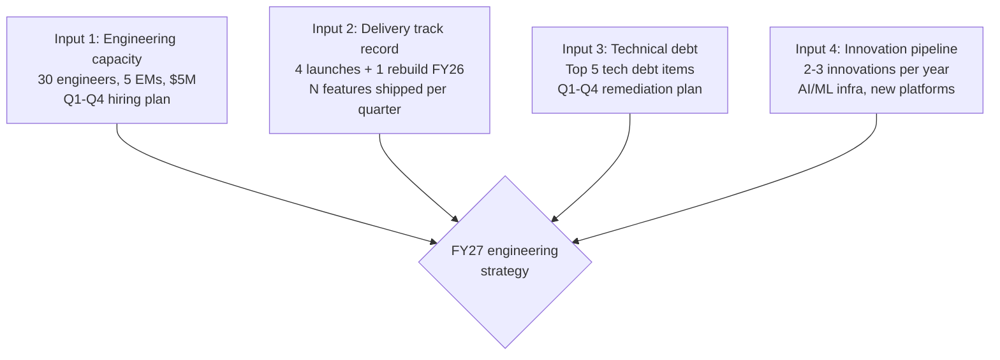
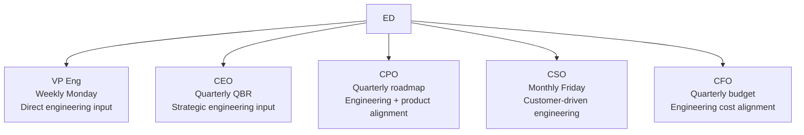

# Engineering Director Playbook
## Chapter 15

# Engineering Strategy at Company Scale

> *"The ED contributes to engineering strategy. The 4 strategy inputs, the 3 horizon levels, and the 5-stakeholder strategy map are the ED's reference for engineering strategy at the function level."*

---

## 1. Epigraph

_The ED contributes to engineering strategy. The 4 strategy inputs, the 3 horizon levels, and the 5-stakeholder strategy map are the ED's reference for engineering strategy at the function level._

---

## 2. Problem

You are an Engineering Director at acme-corp. The VP has just told you: "Contribute to FY27 engineering strategy. 30-day timeline. The CEO wants your input. The current strategy doc is product-focused, engineering-light. You have 4 launches + 1 rebuild, 30 engineers, $5M budget."

This chapter tells you the 4 strategy inputs, the 3 horizon levels, and the 5-stakeholder strategy map.

**Decision in one sentence:** _ED engineering strategy contribution is a 4-input system (capacity + delivery + technical debt + innovation) with 3 horizon levels (now + next + beyond) and 5-stakeholder influence map; the ED's job is to provide high-quality engineering input, accept the VP's strategy, and own the engineering roadmap._

---

## 3. Why EDs Fail Here

Five named failure modes of EDs whose engineering strategy contribution produced zero results.

- **The No-Engineering-Input Failure.** The ED provides no engineering input. _Strategy is product-only._
- **The 1-Horizon Failure.** The ED only plans now. _No next + beyond._
- **The No-Capacity-Input Failure.** The ED doesn't provide capacity numbers. _Strategy is unrealistic._
- **The No-Technical-Debt-Input Failure.** The ED doesn't address tech debt. _Strategy hides problems._
- **The No-Stakeholder-Influence Failure.** The ED only talks to VP. _CEO + CPO + CSO don't hear ED._

---

## 4. Mental Models

Four mental models that compress engineering strategy contribution.

**mental model 1: The 4 Strategy Inputs.** 4 inputs the ED provides.



**The 4 inputs:**
- **Input 1: Engineering capacity.** 30 engineers, 5 EMs, $5M.
- **Input 2: Delivery track record.** 4 launches + 1 rebuild FY26.
- **Input 3: Technical debt.** Top 5 tech debt items + remediation plan.
- **Input 4: Innovation pipeline.** 2-3 innovations per year.

**mental model 2: The 3 Horizon Levels.** 3 levels.

```
Level 1: NOW (Q1-Q2 FY27)
- Capacity: 30 engineers
- 4 launches + 1 rebuild completion
- Top 3 tech debt items

Level 2: NEXT (Q3-Q4 FY27)
- Capacity: 35 engineers (5 hired)
- 4-6 launches
- Top 2 tech debt items
- 1 innovation (e.g., AI/ML infra)

Level 3: BEYOND (FY28)
- Capacity: 50 engineers
- 6-8 launches
- 2 innovations (new platform)
```

**mental model 3: The 5-Stakeholder Strategy Map.** 5 stakeholders.



**The 5 stakeholders:**
- **VP Eng (Weekly Monday).** Direct engineering input.
- **CEO (Quarterly QBR).** Strategic engineering input.
- **CPO (Quarterly roadmap).** Engineering + product alignment.
- **CSO (Monthly Friday).** Customer-driven engineering.
- **CFO (Quarterly budget).** Engineering cost alignment.

**mental model 4: The 5-Criterion Strategy Quality Bar.** 5 criteria per input.

```
1. Specific (N engineers, N launches, $X budget)
2. Measured (success metrics per input)
3. Owned (1 ED accountable per input)
4. Timed (Q1-Q4 timeline)
5. Aligned (with company strategy)
```

---

## 5. Frameworks

Three frameworks for engineering strategy contribution.

### Framework 1: The 1-Page Engineering Strategy Memo

```
# Engineering Strategy Memo — FY27 — [Date]

## Top 4 strategic inputs
1. Capacity: 30 → 50 engineers, $5M → $8M budget
2. Delivery: 6-8 launches + 1 platform rebuild
3. Tech debt: Top 5 items remediated
4. Innovation: 2-3 new platforms (AI infra)

## The 3 horizons
- NOW: 30 engineers, 4 launches + 1 rebuild
- NEXT: 35 engineers, 4-6 launches + 1 innovation
- BEYOND: 50 engineers, 6-8 launches + 2 platforms

## The 5-criterion bar applied
- Specific + Measured + Owned + Timed + Aligned

## The 1 thing the ED will push back on
[1 sentence.]
```

### Framework 2: The Capacity Planning Calculator

```
# Capacity Planning — FY27

| Quarter | Headcount | Hires | Departs | Net | Launches |
|---------|-----------|-------|---------|-----|----------|
| Q1 FY27 | 30 | 5 | 2 | 33 | 1 |
| Q2 FY27 | 33 | 5 | 2 | 36 | 1 |
| Q3 FY27 | 36 | 5 | 2 | 39 | 2 |
| Q4 FY27 | 39 | 5 | 2 | 42 | 2 |

## Total
- Headcount: 30 → 42 (+12 net hires)
- Launches: 6 total
- Budget: $5M → $7M

## The 1 thing the ED will NOT compromise on
[1 sentence.]
```

### Framework 3: The Tech Debt Remediation Tracker

```
# Tech Debt Remediation — FY27

## Top 5 tech debt items
1. [Item 1] — Q1 — Owner: [EM]
2. [Item 2] — Q2 — Owner: [EM]
3. [Item 3] — Q3 — Owner: [EM]
4. [Item 4] — Q4 — Owner: [EM]
5. [Item 5] — Q4 — Owner: [EM]

## The 1 thing the ED will NOT defer
[1 sentence.]
```

---

## 6. Drill

You are an ED at **acme-corp**. The VP has given you 30 days to contribute to FY27 engineering strategy.

```
Current: 30 engineers, 5 EMs, $5M, 4 launches + 1 rebuild FY26
Target: FY27 engineering strategy, 30-day timeline
CEO wants input. CPO has product roadmap. CSO has customer roadmap.
```

You have **90 minutes**. Produce the **FY27 engineering strategy memo** (`portfolio/chapter-15-engineering-strategy.md`) using Framework 1 (Strategy Memo) + Framework 2 (Capacity Planning) + Framework 3 (Tech Debt). Specify:

- The 1-page strategy memo (4 inputs, 3 horizons, the 1 pushback).
- The capacity planning calculator (4 quarters, hires, departures, launches).
- The tech debt remediation tracker (top 5 items, the 1 not defer).
- The 30-day plan.
- The 1 thing you'll say to the VP in the first review.
- The 3 things you'll do to avoid the 5 failure modes.

**Deliverable:** `portfolio/chapter-15-engineering-strategy.md` — under 1500 words.

---

## 7. Worked Example

**The 1-page strategy memo:**

```
# Engineering Strategy Memo — FY27 — 2026-09-01

## Top 4 strategic inputs
1. Capacity: 30 → 50 engineers, $5M → $8M budget
2. Delivery: 6-8 launches + 1 platform rebuild
3. Tech debt: Top 5 items remediated
4. Innovation: 2-3 new platforms (AI infra, ML serving)

## The 3 horizons
- NOW (Q1-Q2): 30-36 engineers, 2 launches + 1 rebuild
- NEXT (Q3-Q4): 36-42 engineers, 4 launches + 1 innovation
- BEYOND (FY28): 42-50 engineers, 6-8 launches + 2 platforms

## The 5-criterion bar applied
- Specific (N engineers, N launches, $X budget)
- Measured (uptime, NPS, velocity)
- Owned (ED per input)
- Timed (Q1-Q4)
- Aligned (with company FY27 themes)

## The 1 thing I will push back on
AI infra investment. The CEO wants $2M in AI infra
in FY27. I want $1M in FY27 + $2M in FY28. Faster
AI infra investment without capacity will dilute
delivery.
```

**The capacity planning calculator:**

```
# Capacity Planning — FY27

| Quarter | HC | Hires | Departs | Net | Launches |
|---------|----|-------|---------|-----|----------|
| Q1 | 30 | 5 | 2 | 33 | 1 + 1 rebuild |
| Q2 | 33 | 5 | 2 | 36 | 1 |
| Q3 | 36 | 5 | 2 | 39 | 2 |
| Q4 | 39 | 5 | 2 | 42 | 2 |

## Total
- HC: 30 → 42 (+12 net)
- Launches: 6 + 1 rebuild
- Budget: $5M → $7M

## The 1 thing I will NOT compromise on
Net hires +12. Without 12 new hires, the 6 launches
+ 1 rebuild won't ship. Capacity is the constraint.
```

**The tech debt remediation tracker:**

```
# Tech Debt Remediation — FY27

## Top 5 tech debt items
1. Auth service rewrite — Q1 — Owner: EM 2 (Platform)
2. Data pipeline v2 — Q2 — Owner: EM 3 (Data + ML)
3. Test coverage 65% → 85% — Q3 — Owner: EM 4 (Quality + SRE)
4. Frontend monorepo migration — Q4 — Owner: EM 1 (Product Eng)
5. ML serving v2 — Q4 — Owner: EM 3 (Data + ML)

## The 1 thing I will NOT defer
Auth service rewrite. Without it, the auth integration
PRFA (Q1 2027) won't ship on time.
```

**The 1 thing I'll say to the VP in the first review:**

```
"Here's the FY27 engineering strategy contribution:

  4 inputs:
  1. Capacity: 30 → 50 engineers, $5M → $8M
  2. Delivery: 6-8 launches + 1 rebuild
  3. Tech debt: Top 5 items remediated
  4. Innovation: 2-3 new platforms (AI infra, ML serving)

  3 horizons:
  - NOW: 30-36 engineers, 2 launches + 1 rebuild
  - NEXT: 36-42 engineers, 4 launches + 1 innovation
  - BEYOND: 42-50 engineers, 6-8 launches + 2 platforms

  Top 3 risks:
  1. Hiring pace (12 net hires in 12 months)
  2. Tech debt remediation (5 items in 4 quarters)
  3. Innovation capacity (2-3 platforms while delivering)

  The 1 thing I want to focus on: capacity planning.
  Without 12 net hires, the launches slip.

  The 1 thing I will NOT compromise on: net hires +12.
  Capacity is the constraint.

  Strategy is the discipline. Execution is the outcome."
```

**The 3 things I'll do to avoid the 5 failure modes:**

```
1. Provide all 4 strategy inputs (not just capacity).
   (Avoids the No-Engineering-Input Failure.)
   - Capacity + delivery + tech debt + innovation
   - 1-page memo per input
   - Quarterly review

2. Use the 3 horizon levels (not just now).
   (Avoids the 1-Horizon Failure.)
   - NOW (Q1-Q2): 30-36 engineers
   - NEXT (Q3-Q4): 36-42 engineers
   - BEYOND (FY28): 42-50 engineers

3. Influence all 5 stakeholders (not just VP).
   (Avoids the No-Stakeholder-Influence Failure.)
   - VP Eng (weekly)
   - CEO (quarterly QBR)
   - CPO (quarterly roadmap)
   - CSO (monthly)
   - CFO (quarterly budget)
```

---

## 8. Failure Mode Postmortem

An ED at a 200-person B2B AI company provided no engineering input to FY27 strategy. The strategy was product-only. Engineering capacity (30 engineers) couldn't deliver the 8-launch plan. The strategy slipped by 2 quarters.

The replacement ED did 3 things:
1. Provided all 4 engineering inputs (capacity + delivery + tech debt + innovation).
2. Used the 3 horizon levels (NOW + NEXT + BEYOND).
3. Influenced all 5 stakeholders (VP Eng + CEO + CPO + CSO + CFO).

Within 12 months: FY27 strategy on track. 6 launches + 1 rebuild shipped. Tech debt remediated. The 4-input + 3-horizon + 5-stakeholder system was the discipline.

What the first ED missed: engineering strategy is a system. The first ED had no engineering input. The second ED had 4 inputs + 3 horizons + 5 stakeholders. The system is the leverage.

The lesson: the ED who has 4 inputs + 3 horizons + 5 stakeholders has engineering strategy influence. The ED who has no input has no influence.

---

## 9. Self-Assessment Rubric

| # | Dimension | 1 (Novice) | 3 (Competent) | 5 (Expert) |
|---|---|---|---|---|
| 1 | **4 strategy inputs** | 0-1 inputs | 2-3 inputs | 4 inputs (capacity + delivery + tech debt + innovation) |
| 2 | **3 horizon levels** | 1 horizon | 2 horizons | 3 horizons (NOW + NEXT + BEYOND) |
| 3 | **5-criterion bar** | 0-2 criteria | 3-4 criteria | 5 criteria (specific + measured + owned + timed + aligned) |
| 4 | **5-stakeholder influence** | 1-2 stakeholders | 3-4 stakeholders | 5 stakeholders (VP + CEO + CPO + CSO + CFO) |
| 5 | **Capacity planning** | No plan | Plan exists | Quarter-by-quarter plan with hires + departures |

**Disqualifier:** any 1 on dimension 1 or 4. An ED who has 0-1 inputs or 1-2 stakeholders is in the No-Engineering-Input or No-Stakeholder-Influence failure mode.

**Total:** ___ / 25. **Pass threshold:** 18/25, no dimension below 3.

---

## 10. Portfolio Artifact Note

Save your filled-in drill as `portfolio/chapter-15-engineering-strategy.md` — interview evidence for "How do you contribute to engineering strategy?" (see Portfolio Map in Chapter 27).

---

## 11. Interview Questions

1. **Walk me through your engineering strategy contribution.**
2. **The VP ignores your engineering input. What do you do?**
3. **You have 1 quarter to influence the strategy. What do you do?**
4. **The CEO wants your input. What do you say?**
5. **Walk me through a strategy input you've shipped.**
