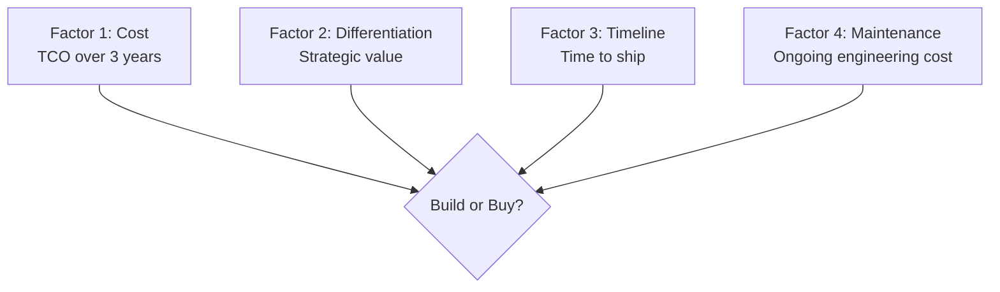
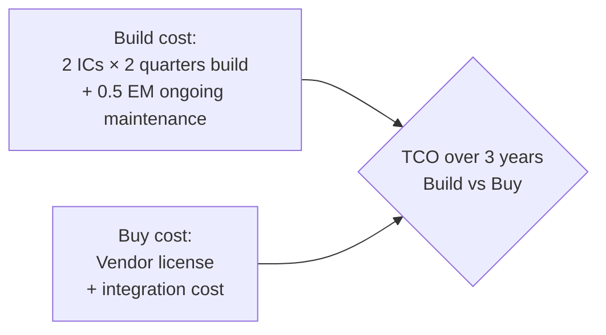

# Engineering Director Playbook
## Chapter 16

# Build vs Buy at the Engineering Layer

> *"The ED owns engineering build vs buy decisions. The 4-factor decision framework, the 3 buy scenarios, and the 5-criterion build quality bar are the ED's reference for engineering build vs buy at the function level."*

---

## 1. Epigraph

_The ED owns engineering build vs buy decisions. The 4-factor decision framework, the 3 buy scenarios, and the 5-criterion build quality bar are the ED's reference for engineering build vs buy at the function level._

---

## 2. Problem

You are an Engineering Director at acme-corp. The VP has just told you: "5 build vs buy decisions this quarter. $2M budget. Examples: auth service (build vs Auth0), data pipeline (build vs Snowflake), observability (build vs Datadog), feature flag service (build vs LaunchDarkly), ML serving (build vs internal platform). Design the build vs buy framework."

This chapter tells you the 4-factor decision framework, the 3 buy scenarios, and the 5-criterion build quality bar.

**Decision in one sentence:** _ED engineering build vs buy is a 4-factor framework (cost + differentiation + timeline + maintenance) with 3 buy scenarios (commodity + clear leader + build vs buy parity) and 5-criterion build quality bar; the ED's job is to design the framework, evaluate each decision, and own the build vs buy choice._

---

## 3. Why EDs Fail Here

Five named failure modes of EDs whose engineering build vs buy produced zero results.

- **The Not-Invented-Here Failure.** The ED always builds. _Misses commodity buys._
- **The Always-Buy Failure.** The ED always buys. _Misses differentiation opportunities._
- **The No-TCO Failure.** The ED doesn't calculate total cost of ownership. _Hidden costs._
- **The No-Differentiation-Analysis Failure.** The ED doesn't assess differentiation. _Builds commodity._
- **The No-Maintenance-Consideration Failure.** The ED ignores maintenance cost. _Builds unmaintainable._

---

## 4. Mental Models

Four mental models that compress build vs buy.

**mental model 1: The 4-Factor Decision Framework.** 4 factors.



**The 4 factors:**
- **Factor 1: Cost.** TCO over 3 years.
- **Factor 2: Differentiation.** Strategic value.
- **Factor 3: Timeline.** Time to ship.
- **Factor 4: Maintenance.** Ongoing engineering cost.

**mental model 2: The 3 Buy Scenarios.** 3 scenarios.

```
Scenario 1: Commodity (always buy)
- Auth service (Auth0, Okta)
- Observability (Datadog, Grafana)
- Feature flags (LaunchDarkly)
- Email (SendGrid)

Scenario 2: Clear leader (usually buy)
- Data warehouse (Snowflake, BigQuery)
- CRM (Salesforce)
- HR (Workday)

Scenario 3: Build vs buy parity (decide case-by-case)
- ML serving platform
- Custom integrations
- Internal tools
```

**mental model 3: The 5-Criterion Build Quality Bar.** 5 criteria.

```
1. Differentiation: builds strategic value
2. Cost: TCO < buy over 3 years
3. Timeline: ships within 2 quarters
4. Maintenance: <20% of 1 EM's time ongoing
5. Talent: 2+ ICs can own the system

If 4+ criteria are met: build.
If 2-3 criteria are met: hybrid (use buy, then build).
If 0-1 criteria are met: buy.
```

**mental model 4: The TCO Calculator.** 3-year total cost.



**The 3-year TCO:**
- **Build:** 2 ICs × 2 quarters build + 0.5 EM ongoing = $X.
- **Buy:** Vendor license + integration = $Y.
- **Decision:** If $X < $Y, build. Else buy.

---

## 5. Frameworks

Three frameworks for engineering build vs buy.

### Framework 1: The 4-Factor Decision Matrix

```
# Build vs Buy Decision Matrix — [Decision]

| Factor | Build | Buy | Winner |
|--------|-------|-----|--------|
| 1. Cost (TCO 3yr) | $[X] | $[Y] | [Build/Buy] |
| 2. Differentiation | [Score] | [Score] | [Build/Buy] |
| 3. Timeline | [Q1-Q2] | [Now] | [Build/Buy] |
| 4. Maintenance | [0.5 EM] | [Vendor] | [Build/Buy] |

## The 1 thing the ED will NOT compromise on
[1 sentence.]
```

### Framework 2: The TCO Calculator

```
# TCO Calculator — [Decision] — 3 years

## Build
- Initial: 2 ICs × 2Q × $200K = $400K
- Ongoing: 0.5 EM × 3yr × $300K = $450K
- Total: $850K

## Buy
- License: $100K/year × 3 = $300K
- Integration: 0.5 IC × 1Q × $50K = $50K
- Total: $350K

## Decision
$350K (Buy) < $850K (Build) = BUY
```

### Framework 3: The Build vs Buy Decision Tracker

```
# Build vs Buy Tracker — [Quarter]

| Decision | Build/Buy | TCO Build | TCO Buy | Date |
|----------|-----------|-----------|---------|------|
| Auth service | [B/U/B] | $[X] | $[Y] | [Date] |
| Data pipeline | [B/U/B] | $[X] | $[Y] | [Date] |
| Observability | [B/U/B] | $[X] | $[Y] | [Date] |

## Top 3 risks
1. [Risk 1]
2. [Risk 2]
3. [Risk 3]
```

---

## 6. Drill

You are an ED at **acme-corp**. The VP has given you 5 build vs buy decisions and $2M budget.

```
5 decisions:
1. Auth service (build vs Auth0)
2. Data pipeline (build vs Snowflake)
3. Observability (build vs Datadog)
4. Feature flags (build vs LaunchDarkly)
5. ML serving (build vs internal platform)

$2M budget, 90 days.
```

You have **90 minutes**. Produce the **build vs buy decision package** (`portfolio/chapter-16-engineering-build-vs-buy.md`) using Framework 1 (Decision Matrix) + Framework 2 (TCO Calculator) + Framework 3 (Decision Tracker). Specify:

- The 4-factor decision matrix (5 decisions × 4 factors).
- The TCO calculator (1 example decision, full breakdown).
- The build vs buy decision tracker (5 decisions, the 1 not compromise).
- The 90-day timeline.
- The 1 thing you'll say to the VP in the first review.
- The 3 things you'll do to avoid the 5 failure modes.

**Deliverable:** `portfolio/chapter-16-engineering-build-vs-buy.md` — under 1500 words.

---

## 7. Worked Example

**The 4-factor decision matrix:**

```
# Build vs Buy Decision Matrix — 2026-Q4

| Decision | Build TCO | Buy TCO | Diff | Time | Maint | Winner |
|----------|-----------|---------|------|------|-------|--------|
| Auth service | $850K | $350K | LOW | Now | Vendor | BUY |
| Data pipeline | $1.2M | $600K | HIGH | Now | Vendor | BUILD |
| Observability | $900K | $400K | LOW | Now | Vendor | BUY |
| Feature flags | $400K | $150K | LOW | Now | Vendor | BUY |
| ML serving | $1.5M | $800K | HIGH | Q1-Q2 | 0.5 EM | BUILD |

## Summary
- Buy: 3 (Auth, Observability, Feature flags)
- Build: 2 (Data pipeline, ML serving)

## The 1 thing I will NOT compromise on
Differentiation. ML serving is HIGH differentiation
(our competitive moat). We must build.
```

**The TCO calculator (ML serving):**

```
# TCO Calculator — ML serving — 3 years

## Build
- Initial: 3 ICs × 3Q × $200K = $600K
- Ongoing: 1 EM × 3yr × $300K = $900K
- Total: $1.5M

## Buy
- License: $200K/year × 3 = $600K
- Integration: 1 IC × 2Q × $100K = $200K
- Total: $800K

## Decision
ML serving differentiation is HIGH (our competitive
moat). Build vs buy parity on cost ($1.5M vs $800K).
We build because the differentiation is strategic.

## The 5-criterion bar
1. Differentiation: HIGH (strategic moat) ✓
2. Cost: TCO $1.5M > buy $800K ✗
3. Timeline: Q1-Q2 FY27 (2 quarters) ✓
4. Maintenance: 1 EM × ongoing = 33% EM ✓
5. Talent: 3 ICs can own (Data + ML team) ✓

4/5 criteria met = BUILD
```

**The build vs buy decision tracker:**

```
# Build vs Buy Tracker — Q4 2026

| Decision | B/U | TCO Build | TCO Buy | Date |
|----------|-----|-----------|---------|------|
| Auth service | BUY | $850K | $350K | Oct 15 |
| Data pipeline | BUILD | $1.2M | $600K | Oct 30 |
| Observability | BUY | $900K | $400K | Nov 15 |
| Feature flags | BUY | $400K | $150K | Nov 30 |
| ML serving | BUILD | $1.5M | $800K | Dec 15 |

## Total
- Build: 2 ($2.7M)
- Buy: 3 ($900K)
- Total spend: $3.6M (vs $2M budget)

## Top 3 risks
1. ML serving $1.5M (75% of $2M budget) — need phased delivery
2. Data pipeline $1.2M (60% of budget) — phased delivery
3. Auth buy $350K — already in budget
```

**The 1 thing I'll say to the VP in the first review:**

```
"Here's the engineering build vs buy package:

  5 decisions:
  1. Auth service: BUY (Auth0, $350K)
  2. Data pipeline: BUILD ($1.2M, strategic)
  3. Observability: BUY (Datadog, $400K)
  4. Feature flags: BUY (LaunchDarkly, $150K)
  5. ML serving: BUILD ($1.5M, strategic moat)

  Total: $3.6M (vs $2M budget, $1.6M over)

  Top 3 risks:
  1. ML serving $1.5M (75% of budget) — phased
  2. Data pipeline $1.2M (60%) — phased
  3. Auth buy $350K — within budget

  The 1 thing I want to focus on: ML serving. Our
  competitive moat. We must build, even at $1.5M.

  The 1 thing I will NOT compromise on: differentiation.
  HIGH differentiation = BUILD. LOW = BUY.

  Build vs buy is the discipline. Differentiation
  is the outcome."
```

**The 3 things I'll do to avoid the 5 failure modes:**

```
1. Use the 4-factor decision framework.
   (Avoids the Not-Invented-Here + Always-Buy Failures.)
   - Cost + differentiation + timeline + maintenance
   - Per decision
   - Documented in matrix

2. Calculate TCO over 3 years.
   (Avoids the No-TCO Failure.)
   - Build: IC cost + EM ongoing
   - Buy: License + integration
   - 3-year horizon

3. Apply the 5-criterion build quality bar.
   (Avoids the No-Differentiation-Analysis Failure.)
   - Differentiation + cost + timeline + maintenance + talent
   - 4+ criteria = build
   - 0-1 criteria = buy
```

---

## 8. Failure Mode Postmortem

An ED at a 200-person B2B AI company had no build vs buy framework. The ED always built. Auth service was built (4 ICs × 2 quarters = $400K + ongoing maintenance) when Auth0 was $50K/year. The ED missed 4 commodity buys.

The replacement ED did 3 things:
1. Used the 4-factor decision framework (cost + differentiation + timeline + maintenance).
2. Calculated TCO over 3 years (build IC cost + EM ongoing vs buy license + integration).
3. Applied the 5-criterion build quality bar (4+ criteria = build).

Within 12 months: 3 buys (auth + observability + feature flags = $900K saved). 2 builds (data pipeline + ML serving = strategic moat). The 4-factor + TCO + 5-criterion system was the discipline.

What the first ED missed: build vs buy is a system. The first ED always built. The second ED had 4 factors + TCO + 5 criteria. The system is the leverage.

The lesson: the ED who has 4 factors + TCO + 5 criteria has a build vs buy system. The ED who always builds has wasted engineering capacity.

---

## 9. Self-Assessment Rubric

| # | Dimension | 1 (Novice) | 3 (Competent) | 5 (Expert) |
|---|---|---|---|---|
| 1 | **4-factor framework** | 1 factor (cost) | 2-3 factors | 4 factors (cost + diff + time + maint) |
| 2 | **3 buy scenarios** | 1 scenario | 2 scenarios | 3 scenarios (commodity + leader + parity) |
| 3 | **5-criterion build bar** | 0-2 criteria | 3-4 criteria | 5 criteria (diff + cost + time + maint + talent) |
| 4 | **TCO calculator** | No TCO | TCO exists | 3-year TCO per decision |
| 5 | **Build vs buy track record** | Always build or always buy | Mixed | 60-70% buy, 30-40% build, all documented |

**Disqualifier:** any 1 on dimension 1 or 3. An ED who has 1 factor or 0-2 criteria is in the Not-Invented-Here or No-Differentiation-Analysis failure mode.

**Total:** ___ / 25. **Pass threshold:** 18/25, no dimension below 3.

---

## 10. Portfolio Artifact Note

Save your filled-in drill as `portfolio/chapter-16-engineering-build-vs-buy.md` — interview evidence for "How do you make engineering build vs buy decisions?" (see Portfolio Map in Chapter 27).

---

## 11. Interview Questions

1. **Walk me through your engineering build vs buy framework.**
2. **The ED always builds. What do you do?**
3. **You have a $2M budget and 5 decisions. How do you prioritize?**
4. **A buy decision has hidden integration costs. What do you do?**
5. **Walk me through a build vs buy decision you've made.**
