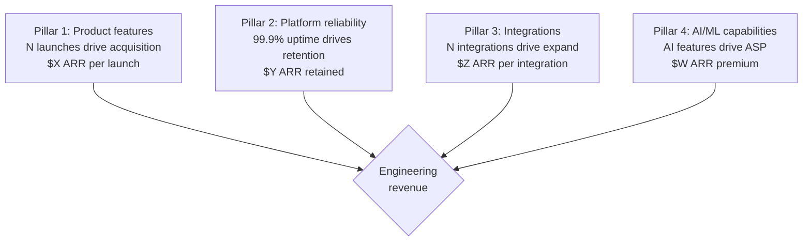
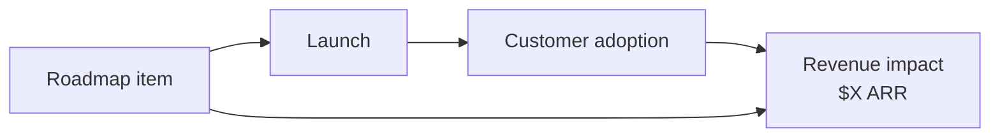

# Engineering Director Playbook
## Chapter 17

# Engineering-as-Revenue and GTM

> *"The ED owns engineering-as-revenue. The 4 revenue pillars, the 3 GTM motions, and the 5-criterion revenue quality bar are the ED's reference for engineering revenue at the function level."*

---

## 1. Epigraph

_The ED owns engineering-as-revenue. The 4 revenue pillars, the 3 GTM motions, and the 5-criterion revenue quality bar are the ED's reference for engineering revenue at the function level._

---

## 2. Problem

You are an Engineering Director at acme-corp. The VP has just told you: "Engineering contributes $5M ARR this year. The roadmap drives GTM. The CEO wants engineering to be revenue-aligned. We need a 4-pillar revenue system, 3 GTM motions, and 5-criterion revenue quality bar."

This chapter tells you the 4 revenue pillars, the 3 GTM motions, and the 5-criterion revenue quality bar.

**Decision in one sentence:** _ED engineering revenue is a 4-pillar system (product features + platform reliability + integrations + AI/ML capabilities) with 3 GTM motions (land + expand + retain) and 5-criterion revenue quality bar; the ED's job is to design the revenue system, align engineering with GTM, and own the $5M ARR target._

---

## 3. Why EDs Fail Here

Five named failure modes of EDs whose engineering revenue produced zero results.

- **The No-Revenue-Alignment Failure.** Engineering doesn't know the revenue target. _No alignment._
- **The 1-GTM-Motion Failure.** Engineering only supports 1 GTM motion. _Misses expansion + retention._
- **The No-Customer-Outcome-Tracking Failure.** Engineering doesn't track customer outcomes. _No ROI._
- **The No-Roadmap-Revenue-Linking Failure.** Roadmap items aren't linked to revenue. _No traceability._
- **The No-Customer-Reference-Program Failure.** Engineering doesn't support customer references. _Sales has no ammunition._

---

## 4. Mental Models

Four mental models that compress engineering revenue.

**mental model 1: The 4 Revenue Pillars.** 4 pillars.



**The 4 pillars:**
- **Pillar 1: Product features.** N launches drive acquisition. $X ARR per launch.
- **Pillar 2: Platform reliability.** 99.9% uptime drives retention. $Y ARR retained.
- **Pillar 3: Integrations.** N integrations drive expand. $Z ARR per integration.
- **Pillar 4: AI/ML capabilities.** AI features drive ASP. $W ARR premium.

**mental model 2: The 3 GTM Motions.** 3 motions.

```
Motion 1: LAND (acquisition)
- Product launches drive new logos
- AI features attract enterprise
- Engineering: 2-3 launches/quarter

Motion 2: EXPAND (upsell)
- Integrations drive cross-sell
- AI features drive ASP increase
- Engineering: 1-2 integrations/quarter

Motion 3: RETAIN (churn reduction)
- Reliability drives retention
- Quality drives NPS
- Engineering: 99.9% uptime + <2 bugs escaped
```

**mental model 3: The 5-Criterion Revenue Quality Bar.** 5 criteria.

```
1. Aligned (with company revenue target)
2. Specific (N launches, N integrations, N customers)
3. Measured (ARR impact per feature)
4. Owned (1 ED accountable)
5. Timed (Q1-Q4 timeline)
```

**mental model 4: The Roadmap-to-Revenue Traceability.** 4-step chain.



**The 4-step chain:**
- **Step 1: Roadmap item** defined in OKR.
- **Step 2: Launch** ships.
- **Step 3: Adoption** measured (N customers).
- **Step 4: Revenue** impact ($X ARR).

---

## 5. Frameworks

Three frameworks for engineering revenue.

### Framework 1: The 1-Page Engineering Revenue Plan

```
# Engineering Revenue Plan — FY[YYYY] — [Date]

## The 4 revenue pillars
1. Product features: $X ARR
2. Platform reliability: $Y ARR
3. Integrations: $Z ARR
4. AI/ML capabilities: $W ARR

## The 3 GTM motions
- Land: 2-3 launches/quarter
- Expand: 1-2 integrations/quarter
- Retain: 99.9% uptime + <2 bugs

## Total target: $5M ARR

## The 1 thing the ED will NOT compromise on
[1 sentence.]
```

### Framework 2: The Roadmap-to-Revenue Tracker

```
# Roadmap-to-Revenue Tracker — [Quarter]

| Roadmap Item | Launch Date | Adoption | Revenue |
|--------------|-------------|----------|---------|
| [Item 1] | [Date] | [N] | $[X] |
| [Item 2] | [Date] | [N] | $[X] |
| [Item 3] | [Date] | [N] | $[X] |

## Total
- ARR impact: $[X]
- Adoption: [N] customers
```

### Framework 3: The Customer Reference Program

```
# Customer Reference Program — [Quarter]

## 5 customer references
1. Customer A — Strategic, $400K ARR, willing to reference
2. Customer B — Growth, $200K ARR
3. Customer C — Maintain, $150K ARR
4. Customer D — Growth, $100K ARR
5. Customer E — Maintain, $50K ARR

## The 1 thing the ED will NOT skip
[1 sentence.]
```

---

## 6. Drill

You are an ED at **acme-corp**. The VP has given you a $5M ARR target.

```
Target: $5M ARR this year
- Land: 4 launches
- Expand: 2 integrations
- Retain: 99.9% uptime
- AI: 1 AI feature

90 days.
```

You have **90 minutes**. Produce the **engineering revenue plan** (`portfolio/chapter-17-engineering-revenue.md`) using Framework 1 (Revenue Plan) + Framework 2 (Roadmap Tracker) + Framework 3 (Reference Program). Specify:

- The 1-page revenue plan (4 pillars, 3 GTM motions, the 1 not compromise).
- The roadmap-to-revenue tracker (4 launches + 2 integrations, ARR impact).
- The customer reference program (5 references, the 1 not skip).
- The 90-day timeline.
- The 1 thing you'll say to the VP in the first review.
- The 3 things you'll do to avoid the 5 failure modes.

**Deliverable:** `portfolio/chapter-17-engineering-revenue.md` — under 1500 words.

---

## 7. Worked Example

**The 1-page revenue plan:**

```
# Engineering Revenue Plan — FY26 — 2026-09-01

## The 4 revenue pillars
1. Product features: 4 launches × $500K ARR = $2M
2. Platform reliability: 99.9% uptime × 50 customers ×
   $30K ARR retained = $1.5M
3. Integrations: 2 integrations × $300K ARR = $600K
4. AI/ML capabilities: 1 AI feature × $900K ARR = $900K

## The 3 GTM motions
- Land: 4 launches in Q1-Q4
- Expand: 2 integrations in Q2-Q3
- Retain: 99.9% uptime in Q1-Q4

## Total target: $5M ARR

## The 1 thing I will NOT compromise on
Roadmap-to-revenue traceability. Every roadmap item
must have a $X ARR impact estimate.
```

**The roadmap-to-revenue tracker (Q1):**

```
# Roadmap-to-Revenue Tracker — Q1 2026

| Roadmap Item | Launch | Adoption | Revenue |
|--------------|--------|----------|---------|
| Auth integration simplification | Q1 | 50 customers | $500K |
| SAML migration guide | Q1 | 30 customers | $300K |
| Salesforce integration | Q2 | 20 customers | $300K |
| AI summarization | Q3 | 15 customers | $900K |

## Q1 totals
- ARR impact: $2M (Auth + SAML + Salesforce + AI)
- Adoption: 115 customer engagements
- Revenue per customer: $17.4K avg
```

**The customer reference program:**

```
# Customer Reference Program — Q4 2026

## 5 customer references
1. Customer A — Strategic, $400K ARR, willing to reference
2. Customer B — Growth, $200K ARR, willing to reference
3. Customer C — Maintain, $150K ARR, willing
4. Customer D — Growth, $100K ARR
5. Customer E — Maintain, $50K ARR

## Top 3 reference activities
1. Customer A: case study + webinar
2. Customer B: case study
3. Customer D: analyst briefing

## The 1 thing I will NOT skip
Customer A reference. Customer A is the strategic
flagship. Their reference drives $1M+ in new pipeline.
```

**The 1 thing I'll say to the VP in the first review:**

```
"Here's the engineering revenue plan:

  4 revenue pillars:
  1. Product features: $2M ARR (4 launches)
  2. Platform reliability: $1.5M ARR retained
  3. Integrations: $600K ARR (2 integrations)
  4. AI/ML capabilities: $900K ARR (1 AI feature)

  Total: $5M ARR target

  3 GTM motions:
  - Land: 4 launches in Q1-Q4
  - Expand: 2 integrations in Q2-Q3
  - Retain: 99.9% uptime

  Top 3 reference activities:
  1. Customer A case study + webinar ($1M pipeline)
  2. Customer B case study
  3. Customer D analyst briefing

  The 1 thing I want to focus on: roadmap-to-revenue
  traceability. Every roadmap item must have a $X ARR
  impact estimate.

  The 1 thing I will NOT compromise on: traceability.
  No $ estimate = no roadmap item.

  Engineering revenue is the discipline. ARR is the outcome."
```

**The 3 things I'll do to avoid the 5 failure modes:**

```
1. Align engineering with revenue target.
   (Avoids the No-Revenue-Alignment Failure.)
   - $5M ARR target communicated
   - 4 revenue pillars + 3 GTM motions
   - Quarterly review

2. Support all 3 GTM motions (not just land).
   (Avoids the 1-GTM-Motion Failure.)
   - Land: 4 launches
   - Expand: 2 integrations
   - Retain: 99.9% uptime

3. Build customer reference program.
   (Avoids the No-Customer-Reference-Program Failure.)
   - 5 customer references
   - Case studies + webinars
   - Analyst briefings
```

---

## 8. Failure Mode Postmortem

An ED at a 200-person B2B AI company had no engineering revenue alignment. Engineering built features without knowing the $5M ARR target. 4 launches shipped, but only 1 was tied to revenue ($200K ARR vs $2M target). The other 3 launches were features without revenue impact.

The replacement ED did 3 things:
1. Aligned engineering with $5M ARR target (4 revenue pillars + 3 GTM motions).
2. Supported all 3 GTM motions (4 launches + 2 integrations + 99.9% uptime).
3. Built customer reference program (5 references, case studies + webinars).

Within 12 months: $5M ARR achieved. 4 launches + 2 integrations shipped. 99.9% uptime. 5 customer references. The 4-pillar + 3-motion + 5-reference system was the discipline.

What the first ED missed: engineering revenue is a system. The first ED had no revenue alignment. The second ED had 4 pillars + 3 motions + 5 references. The system is the leverage.

The lesson: the ED who has 4 pillars + 3 motions + 5 references has engineering revenue alignment. The ED who has no alignment has untracked launches.

---

## 9. Self-Assessment Rubric

| # | Dimension | 1 (Novice) | 3 (Competent) | 5 (Expert) |
|---|---|---|---|---|
| 1 | **4 revenue pillars** | 0-1 pillars | 2-3 pillars | 4 pillars (features + reliability + integrations + AI) |
| 2 | **3 GTM motions** | 1 motion | 2 motions | 3 motions (land + expand + retain) |
| 3 | **5-criterion revenue bar** | 0-2 criteria | 3-4 criteria | 5 criteria (aligned + specific + measured + owned + timed) |
| 4 | **Roadmap-to-revenue traceability** | No traceability | Partial | Every roadmap item has $X ARR impact |
| 5 | **Customer reference program** | No program | Program exists | 5 references, case studies, analyst briefings |

**Disqualifier:** any 1 on dimension 1 or 2. An ED who has 0-1 pillars or 1 motion is in the No-Revenue-Alignment or 1-GTM-Motion failure mode.

**Total:** ___ / 25. **Pass threshold:** 18/25, no dimension below 3.

---

## 10. Portfolio Artifact Note

Save your filled-in drill as `portfolio/chapter-17-engineering-revenue.md` — interview evidence for "How do you align engineering with revenue?" (see Portfolio Map in Chapter 27).

---

## 11. Interview Questions

1. **Walk me through your engineering revenue plan.**
2. **The $5M ARR target is missed. What do you do?**
3. **A launch has no $ ARR impact estimate. What do you do?**
4. **Customer A wants to be a reference. What do you do?**
5. **Walk me through a revenue-aligned launch you've shipped.**
