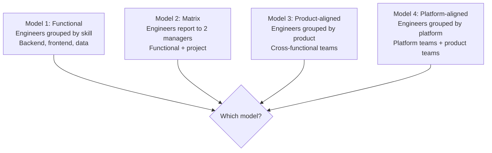
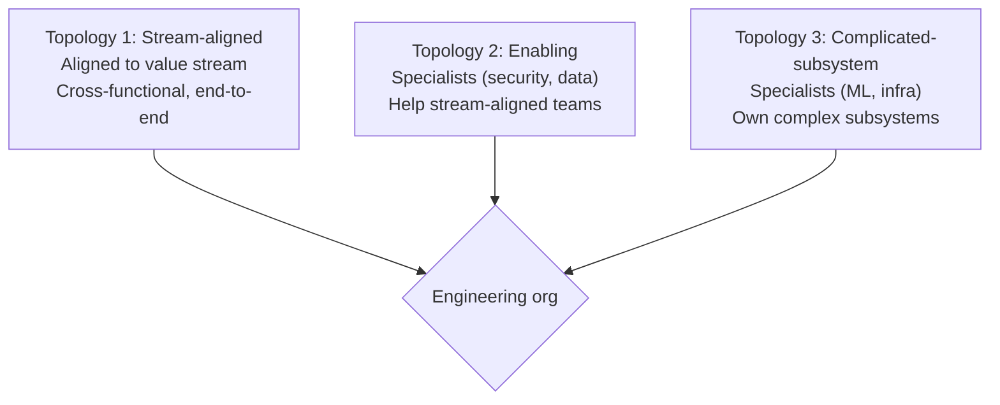
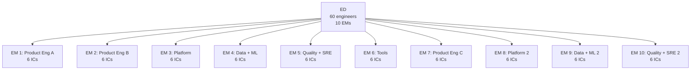

# Engineering Director Playbook
## Chapter 18

# Engineering Org Design at Scale

> *"The ED designs engineering orgs. The 4 org models, the 3 team topologies, and the 5-criterion org quality bar are the ED's reference for engineering org design at the function level."*

---

## 1. Epigraph

_The ED designs engineering orgs. The 4 org models, the 3 team topologies, and the 5-criterion org quality bar are the ED's reference for engineering org design at the function level._

---

## 2. Problem

You are an Engineering Director at acme-corp. The VP has just told you: "30 engineers across 5 EMs. Q1 2027 we double to 60 engineers across 10 EMs. The current org is 5 silos (Product, Platform, Data, Quality, Tools). Design the org at scale."

This chapter tells you the 4 org models, the 3 team topologies, and the 5-criterion org quality bar.

**Decision in one sentence:** _ED engineering org design is a 4-model system (functional + matrix + product-aligned + platform-aligned) with 3 team topologies (stream-aligned + enabling + complicated-subsystem) and 5-criterion org quality bar; the ED's job is to design the org, hire the EMs, and own the engineering capacity._

---

## 3. Why EDs Fail Here

Five named failure modes of EDs whose engineering org design produced zero results.

- **The 1-Model Failure.** The ED uses 1 org model. _Doesn't scale._
- **The Silo Failure.** 5 silos, no cross-team work. _Launches slip._
- **The No-EM-Failure.** The ED has no EMs. _Engineers are unmanaged._
- **The No-Cross-Functional-Team Failure.** Only functional teams. _No product velocity._
- **The No-Platform-Team Failure.** No platform team. _Product teams rebuild infrastructure._

---

## 4. Mental Models

Four mental models that compress engineering org design.

**mental model 1: The 4 Org Models.** 4 models.



**The 4 models:**
- **Model 1: Functional.** Engineers grouped by skill. Backend, frontend, data.
- **Model 2: Matrix.** Engineers report to 2 managers. Functional + project.
- **Model 3: Product-aligned.** Engineers grouped by product. Cross-functional teams.
- **Model 4: Platform-aligned.** Engineers grouped by platform. Platform teams + product teams.

**mental model 2: The 3 Team Topologies.** 3 topologies.



**The 3 topologies:**
- **Topology 1: Stream-aligned.** Aligned to value stream. Cross-functional, end-to-end.
- **Topology 2: Enabling.** Specialists (security, data). Help stream-aligned teams.
- **Topology 3: Complicated-subsystem.** Specialists (ML, infra). Own complex subsystems.

**mental model 3: The 5-Criterion Org Quality Bar.** 5 criteria.

```
1. Stream-aligned: 70%+ of teams (cross-functional)
2. Enabling: 1-2 teams (security, data)
3. Complicated-subsystem: 1-2 teams (ML, infra)
4. Team size: 5-7 engineers per team
5. EM ratio: 1 EM per 5-7 ICs
```

**mental model 4: The 60-Engineer Org Chart.** 60 engineers.



**The 60-engineer org:**
- **10 EMs.** Each EM owns 6 ICs.
- **Stream-aligned:** 6 teams (Product Eng A/B/C + Platform 2 + Data + ML 2).
- **Enabling:** 2 teams (Quality + SRE, Tools).
- **Complicated-subsystem:** 2 teams (Platform 1, Data + ML 1).

---

## 5. Frameworks

Three frameworks for engineering org design.

### Framework 1: The 1-Page Org Chart

```
# Engineering Org Chart — FY[YYYY] — [Date]

## The 4 models in use
1. Functional: 0 (we use product-aligned + platform-aligned)
2. Matrix: 0 (we use direct reporting)
3. Product-aligned: 6 stream-aligned teams
4. Platform-aligned: 2 platform + 2 enabling teams

## The 3 team topologies
- Stream-aligned: 6 teams × 6 ICs = 36 ICs
- Enabling: 2 teams × 6 ICs = 12 ICs
- Complicated-subsystem: 2 teams × 6 ICs = 12 ICs

## Total: 10 teams × 6 ICs = 60 ICs + 10 EMs

## The 1 thing the ED will NOT compromise on
[1 sentence.]
```

### Framework 2: The Team Topology Tracker

```
# Team Topology Tracker — [Date]

| Team | Topology | Headcount | EM | Status |
|------|----------|-----------|-----|--------|
| Product Eng A | Stream-aligned | 6 | EM 1 | GREEN |
| Platform | Complicated-subsystem | 6 | EM 3 | GREEN |
| Quality + SRE | Enabling | 6 | EM 5 | GREEN |

## Top 3 risks
1. [Risk 1]
2. [Risk 2]
3. [Risk 3]
```

### Framework 3: The EM-to-IC Ratio Tracker

```
# EM-to-IC Ratio — [Date]

| EM | Team | ICs | Ratio |
|----|------|-----|-------|
| EM 1 | Product Eng A | 6 | 1:6 |
| EM 2 | Product Eng B | 6 | 1:6 |
...

## Average ratio: 1:6 (target 1:5-1:7)
```

---

## 6. Drill

You are an ED at **acme-corp**. The VP has given you 90 days to design the 60-engineer org (doubling from 30).

```
Current: 30 engineers, 5 EMs, 5 silos
Target: 60 engineers, 10 EMs, 60% stream-aligned + 20% enabling + 20% complicated-subsystem
Q1 2027 target.
```

You have **90 minutes**. Produce the **60-engineer org design** (`portfolio/chapter-18-engineering-org-design.md`) using Framework 1 (Org Chart) + Framework 2 (Team Topology) + Framework 3 (EM-to-IC Ratio). Specify:

- The 1-page org chart (4 models in use, 3 topologies, the 1 not compromise).
- The team topology tracker (10 teams × 3 topologies).
- The EM-to-IC ratio tracker (10 EMs, target ratio).
- The 90-day timeline.
- The 1 thing you'll say to the VP in the first review.
- The 3 things you'll do to avoid the 5 failure modes.

**Deliverable:** `portfolio/chapter-18-engineering-org-design.md` — under 1500 words.

---

## 7. Worked Example

**The 1-page org chart:**

```
# Engineering Org Chart — Q1 2027 — 2026-09-01

## The 4 models in use
1. Functional: 0 (we use product-aligned + platform-aligned)
2. Matrix: 0 (we use direct reporting)
3. Product-aligned: 6 stream-aligned teams
4. Platform-aligned: 2 platform + 2 enabling teams

## The 3 team topologies
- Stream-aligned: 6 teams × 6 ICs = 36 ICs (60%)
- Enabling: 2 teams × 6 ICs = 12 ICs (20%)
- Complicated-subsystem: 2 teams × 6 ICs = 12 ICs (20%)

## Total: 10 teams × 6 ICs = 60 ICs + 10 EMs

## The 1 thing I will NOT compromise on
Stream-aligned as 60%. Without 60% stream-aligned,
launches slip due to cross-team coordination.
```

**The team topology tracker:**

```
# Team Topology Tracker — Q1 2027

| Team | Topology | HC | EM | Status |
|------|----------|-----|-----|--------|
| Product Eng A | Stream-aligned | 6 | EM 1 | GREEN |
| Product Eng B | Stream-aligned | 6 | EM 2 | GREEN |
| Product Eng C | Stream-aligned | 6 | EM 7 | NEW |
| Platform 1 | Complicated-subsystem | 6 | EM 3 | GREEN |
| Platform 2 | Complicated-subsystem | 6 | EM 8 | NEW |
| Data + ML 1 | Complicated-subsystem | 6 | EM 4 | GREEN |
| Data + ML 2 | Complicated-subsystem | 6 | EM 9 | NEW |
| Quality + SRE | Enabling | 6 | EM 5 | GREEN |
| Quality + SRE 2 | Enabling | 6 | EM 10 | NEW |
| Tools | Enabling | 6 | EM 6 | GREEN |

## Top 3 risks
1. 5 new EMs hired in 90 days (high hiring bar)
2. 4 new teams need full ramp-up (3 months)
3. Cross-team coordination at 60 engineers (vs 30)
```

**The EM-to-IC ratio tracker:**

```
# EM-to-IC Ratio — Q1 2027

| EM | Team | ICs | Ratio |
|----|------|-----|-------|
| EM 1 | Product Eng A | 6 | 1:6 |
| EM 2 | Product Eng B | 6 | 1:6 |
| EM 3 | Platform 1 | 6 | 1:6 |
| EM 4 | Data + ML 1 | 6 | 1:6 |
| EM 5 | Quality + SRE | 6 | 1:6 |
| EM 6 | Tools | 6 | 1:6 |
| EM 7 (NEW) | Product Eng C | 6 | 1:6 |
| EM 8 (NEW) | Platform 2 | 6 | 1:6 |
| EM 9 (NEW) | Data + ML 2 | 6 | 1:6 |
| EM 10 (NEW) | Quality + SRE 2 | 6 | 1:6 |

## Average: 1:6 (target 1:5-1:7)
```

**The 1 thing I'll say to the VP in the first review:**

```
"Here's the 60-engineer org design:

  4 models in use: product-aligned + platform-aligned
  3 topologies: 60% stream-aligned + 20% enabling +
  20% complicated-subsystem

  Total: 10 teams × 6 ICs = 60 ICs + 10 EMs

  5 new EMs to hire (high bar): Product Eng C, Platform 2,
  Data + ML 2, Quality + SRE 2 (4 new teams)

  Top 3 risks:
  1. 5 new EMs in 90 days
  2. 4 new teams need ramp-up
  3. Cross-team coordination at 60 engineers

  The 1 thing I want to focus on: stream-aligned teams.
  60% stream-aligned is the target.

  The 1 thing I will NOT compromise on: stream-aligned
  as 60%. Without 60%, launches slip due to cross-team
  coordination.

  Org design is the discipline. Launch velocity is
  the outcome."
```

**The 3 things I'll do to avoid the 5 failure modes:**

```
1. Use 60% stream-aligned teams.
   (Avoids the No-Cross-Functional-Team Failure.)
   - 6 stream-aligned teams × 6 ICs = 36 ICs (60%)
   - Cross-functional: backend + frontend + data + design
   - End-to-end product ownership

2. Build 20% enabling teams.
   (Avoids the No-Platform-Team Failure.)
   - 2 enabling teams × 6 ICs = 12 ICs (20%)
   - Quality + SRE + Tools
   - Specialist help for stream-aligned teams

3. Build 20% complicated-subsystem teams.
   (Avoids the Silo Failure.)
   - 2 complicated-subsystem teams × 6 ICs = 12 ICs (20%)
   - Platform + Data + ML
   - Own complex subsystems
```

---

## 8. Failure Mode Postmortem

An ED at a 200-person B2B AI company doubled from 30 to 60 engineers but kept the same 5-silo functional org. Backend, frontend, data, quality, tools — each had 12 engineers. Cross-team launches slipped by 2 quarters. The 4 launches in FY26 became 2 launches.

The replacement ED did 3 things:
1. Used 60% stream-aligned teams (6 cross-functional teams × 6 ICs = 36 ICs).
2. Built 20% enabling teams (Quality + SRE + Tools = 12 ICs).
3. Built 20% complicated-subsystem teams (Platform + Data + ML = 12 ICs).

Within 6 months: launches shipped on time. Cross-team coordination improved. 4 launches in Q1-Q2 + 4 in Q3-Q4. The 60-20-20 topology system was the discipline.

What the first ED missed: org design is a system. The first ED had 5 silos. The second ED had 60-20-20 topology. The topology is the leverage.

The lesson: the ED who has 60-20-20 topology has an org that scales. The ED who has 5 silos has an org that breaks at 60 engineers.

---

## 9. Self-Assessment Rubric

| # | Dimension | 1 (Novice) | 3 (Competent) | 5 (Expert) |
|---|---|---|---|---|
| 1 | **4 org models** | 1 model | 2 models | 4 models (functional + matrix + product + platform) |
| 2 | **3 team topologies** | 1 topology | 2 topologies | 3 topologies (stream-aligned + enabling + complicated-subsystem) |
| 3 | **60-20-20 split** | No split | 50-25-25 | 60% stream-aligned + 20% enabling + 20% complicated-subsystem |
| 4 | **EM-to-IC ratio** | No EMs or 1:10+ | 1:8-1:10 | 1:5-1:7 (5-7 ICs per EM) |
| 5 | **Cross-team coordination** | Silos only | Partial | Stream-aligned teams own cross-functional launches |

**Disqualifier:** any 1 on dimension 2 or 3. An ED who has 1 topology or no split is in the Silo or No-Cross-Functional-Team failure mode.

**Total:** ___ / 25. **Pass threshold:** 18/25, no dimension below 3.

---

## 10. Portfolio Artifact Note

Save your filled-in drill as `portfolio/chapter-18-engineering-org-design.md` — interview evidence for "How do you design engineering orgs at scale?" (see Portfolio Map in Chapter 27).

---

## 11. Interview Questions

1. **Walk me through your engineering org design.**
2. **You have 30 engineers. How do you grow to 60?**
3. **Cross-team coordination is broken. What do you do?**
4. **You need to hire 5 new EMs. How do you prioritize?**
5. **Walk me through an org redesign you've led.**
