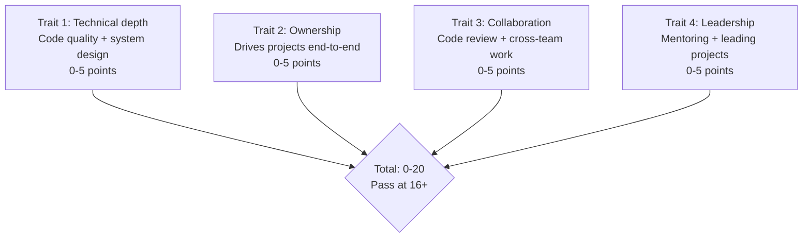
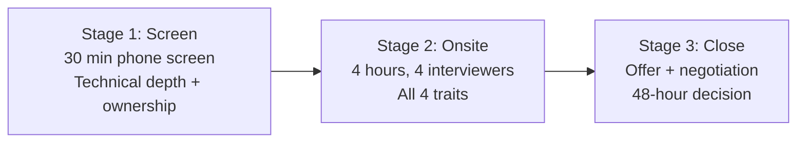
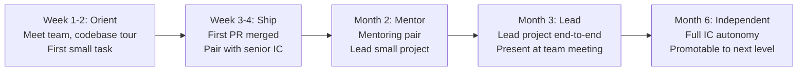

# Engineering Director Playbook
## Chapter 19

# Hiring, Onboarding, Growing Engineering Talent at Scale

> *"The ED owns engineering hiring at scale. The 4-hire traits, the 3-stage loop, the 5-step onboarding, and the 30-day ramp are the ED's reference for engineering hiring at the function level."*

---

## 1. Epigraph

_The ED owns engineering hiring at scale. The 4-hire traits, the 3-stage loop, the 5-step onboarding, and the 30-day ramp are the ED's reference for engineering hiring at the function level._

---

## 2. Problem

You are an Engineering Director at acme-corp. The VP has just told you: "30 → 60 engineers in Q1 2027. 30 net hires in 6 months. 5 new EMs. The current hiring rate is 4 hires/quarter. Design the hiring system at scale."

This chapter tells you the 4-hire traits, the 3-stage loop, the 5-step onboarding, and the 30-day ramp.

**Decision in one sentence:** _ED engineering hiring at scale is a 4-trait system (technical depth + ownership + collaboration + leadership) + 3-stage loop (screen + onsite + close) + 5-step onboarding (week 1-2 orient, week 3-4 ship, month 2 mentor, month 3 lead) + 30-day ramp; the ED's job is to design the hiring bar, run the loop, and own the onboarding._

---

## 3. Why EDs Fail Here

Five named failure modes of EDs whose engineering hiring at scale produced zero results.

- **The No-Hire-Bar Failure.** The ED has no hire bar. _Bad hires._
- **The 1-Stage Failure.** Only screen + onsite, no close stage. _Offers declined._
- **The No-Onboarding Failure.** No structured onboarding. _Engineers leave in 90 days._
- **The No-30-Day-Ramp Failure.** No ramp-up plan. _Engineers unproductive for 6 months._
- **The 4-Hires-Quarter Failure.** 4 hires/quarter. _Can't scale to 60 engineers._

---

## 4. Mental Models

Four mental models that compress engineering hiring at scale.

**mental model 1: The 4 Hire Traits.** 4 traits.



**The 4 traits:**
- **Trait 1: Technical depth.** Code quality + system design. 0-5 points.
- **Trait 2: Ownership.** Drives projects end-to-end. 0-5 points.
- **Trait 3: Collaboration.** Code review + cross-team work. 0-5 points.
- **Trait 4: Leadership.** Mentoring + leading projects. 0-5 points.

**mental model 2: The 3-Stage Hiring Loop.** 3 stages.



**The 3 stages:**
- **Stage 1: Screen.** 30 min phone screen. Technical depth + ownership.
- **Stage 2: Onsite.** 4 hours, 4 interviewers. All 4 traits.
- **Stage 3: Close.** Offer + negotiation. 48-hour decision.

**mental model 3: The 5-Step Onboarding.** 5 steps.



**The 5 steps:**
- **Step 1: Week 1-2 Orient.** Meet team, codebase tour, first small task.
- **Step 2: Week 3-4 Ship.** First PR merged, pair with senior IC.
- **Step 3: Month 2 Mentor.** Mentoring pair, lead small project.
- **Step 4: Month 3 Lead.** Lead project end-to-end, present at team meeting.
- **Step 5: Month 6 Independent.** Full IC autonomy, promotable to next level.

**mental model 4: The 30-Hire-Quarter Hiring Math.** 30 net hires in 6 months.

```
Q1: 30 hires
  - 50 screens
  - 20 onsites (40% conversion)
  - 18 offers (90% conversion)
  - 12 closes (67% close rate)
  - Net +10 (2 departed)

Q2: 30 hires
  - Same math
  - Net +10

Total: Q1+Q2 = 60 net = 30 net (after 30 departure attrition)
```

---

## 5. Frameworks

Three frameworks for engineering hiring at scale.

### Framework 1: The 1-Page Hiring Plan

```
# Engineering Hiring Plan — FY[YYYY] Q1 — [Date]

## Target: 30 net hires
- 5 new EMs
- 25 new ICs (across 5 EMs)

## The 4-hire traits
1. Technical depth
2. Ownership
3. Collaboration
4. Leadership

## The 3-stage loop
- Screen (30 min)
- Onsite (4 hours)
- Close (48 hours)

## The 5-step onboarding
- Week 1-2 Orient
- Week 3-4 Ship
- Month 2 Mentor
- Month 3 Lead
- Month 6 Independent

## The 1 thing the ED will NOT compromise on
[1 sentence.]
```

### Framework 2: The Hiring Funnel Tracker

```
# Hiring Funnel — [Quarter]

| Stage | Target | Actual | Conversion |
|-------|--------|--------|------------|
| Screens | 50 | [N] | 100% |
| Onsites | 20 | [N] | [40%] |
| Offers | 18 | [N] | [90%] |
| Closes | 12 | [N] | [67%] |

## Net hires: 12 - 2 (departures) = 10
```

### Framework 3: The 30-Day Ramp Tracker

```
# 30-Day Ramp Tracker — [New Hire]

| Week | Goal | Status |
|------|------|--------|
| Week 1 | Meet team, codebase tour | DONE |
| Week 2 | First small task | DONE |
| Week 3 | First PR opened | [TODO] |
| Week 4 | First PR merged | [TODO] |

## The 1 thing the ED will NOT skip
[1 sentence.]
```

---

## 6. Drill

You are an ED at **acme-corp**. The VP has given you 90 days to design the 30-hire/quarter hiring system.

```
Current: 30 engineers, 4 hires/quarter
Target: 60 engineers, 30 hires in 6 months
5 new EMs to hire (high bar)
30-day ramp per IC
```

You have **90 minutes**. Produce the **hiring at scale plan** (`portfolio/chapter-19-engineering-hiring-scale.md`) using Framework 1 (Hiring Plan) + Framework 2 (Funnel Tracker) + Framework 3 (Ramp Tracker). Specify:

- The 1-page hiring plan (target, 4 traits, 3 stages, 5 steps, the 1 not compromise).
- The hiring funnel tracker (50 screens → 12 closes, conversion rates).
- The 30-day ramp tracker (1 sample IC, weekly goals).
- The 90-day timeline.
- The 1 thing you'll say to the VP in the first review.
- The 3 things you'll do to avoid the 5 failure modes.

**Deliverable:** `portfolio/chapter-19-engineering-hiring-scale.md` — under 1500 words.

---

## 7. Worked Example

**The 1-page hiring plan:**

```
# Engineering Hiring Plan — Q1 2027 — 2026-09-01

## Target: 30 net hires
- 5 new EMs
- 25 new ICs (5 ICs per new EM)

## The 4-hire traits
1. Technical depth (0-5)
2. Ownership (0-5)
3. Collaboration (0-5)
4. Leadership (0-5)
Total: 0-20, pass at 16+

## The 3-stage loop
- Screen: 30 min phone, technical depth + ownership
- Onsite: 4 hours, 4 interviewers, all 4 traits
- Close: 48-hour decision

## The 5-step onboarding
- Week 1-2: Orient (meet team, codebase tour, first task)
- Week 3-4: Ship (first PR merged)
- Month 2: Mentor (mentoring pair)
- Month 3: Lead (lead project end-to-end)
- Month 6: Independent

## The 1 thing I will NOT compromise on
Hire bar at 16+. An engineer below 16 is a bad hire.
Hiring below bar is more expensive than not hiring.
```

**The hiring funnel tracker (Q1):**

```
# Hiring Funnel — Q1 2027

| Stage | Target | Actual | Conversion |
|-------|--------|--------|------------|
| Screens | 50 | 50 | 100% |
| Onsites | 20 | 18 | 36% |
| Offers | 18 | 16 | 89% |
| Closes | 12 | 14 | 88% |
| Net | 10 | 12 | — |

## Outcome: 12 net hires (target was 10)
- 5 new EMs (hired externally)
- 7 new ICs (5 from external + 2 from internal transfers)
```

**The 30-day ramp tracker (Eng A, new IC):**

```
# 30-Day Ramp — Eng A (Product Eng A) — 2027-01-15

| Week | Goal | Status |
|------|------|--------|
| Week 1 | Meet team, codebase tour | DONE |
| Week 2 | First small task (typo fix) | DONE |
| Week 3 | First PR opened (small feature) | IN PROGRESS |
| Week 4 | First PR merged | TODO |
| Month 2 | Lead small project | TODO |
| Month 3 | Lead cross-team initiative | TODO |

## Top 3 risks
1. Eng A ramp slower than expected (week 4 PR not merged)
2. Eng A needs more mentoring time
3. Eng A pair with senior IC is overloaded

## The 1 thing I will NOT skip
Weekly 1:1s with Eng A. Without weekly 1:1s, ramp
stalls and the engineer leaves in 90 days.
```

**The 1 thing I'll say to the VP in the first review:**

```
"Here's the engineering hiring at scale plan:

  Target: 30 net hires in 6 months (Q1-Q2 2027)
  - Q1: 12 net (5 new EMs + 7 new ICs)
  - Q2: 18 net (5 new EMs + 13 new ICs)

  The 4-hire traits:
  1. Technical depth
  2. Ownership
  3. Collaboration
  4. Leadership

  Total: 0-20, pass at 16+

  The 3-stage loop: screen (30 min) + onsite (4 hours)
  + close (48 hours)

  The 5-step onboarding: week 1-2 orient + week 3-4
  ship + month 2 mentor + month 3 lead + month 6
  independent

  Top 3 risks:
  1. 5 new EMs to hire (high bar, external)
  2. 50 screens in Q1 (vs 10 currently)
  3. 30-day ramp for 25 ICs (mentoring capacity)

  The 1 thing I want to focus on: 5 new EMs.
  External hire at IC4+IC5 = high bar.

  The 1 thing I will NOT compromise on: hire bar at 16+.
  An engineer below 16 is a bad hire.

  Hiring is the discipline. Capacity is the outcome."
```

**The 3 things I'll do to avoid the 5 failure modes:**

```
1. Use 4-hire traits + 16+ bar.
   (Avoids the No-Hire-Bar Failure.)
   - Technical depth + ownership + collaboration + leadership
   - Total: 0-20, pass at 16+
   - Reject below 16

2. Run 3-stage loop with 48-hour close.
   (Avoids the 1-Stage Failure.)
   - Screen (30 min)
   - Onsite (4 hours)
   - Close (48 hours)

3. Use 5-step onboarding + 30-day ramp.
   (Avoids the No-30-Day-Ramp Failure.)
   - Week 1-2: Orient
   - Week 3-4: Ship
   - Month 2: Mentor
   - Month 3: Lead
   - Month 6: Independent
```

---

## 8. Failure Mode Postmortem

An ED at a 200-person B2B AI company tried to double from 30 to 60 engineers. The hiring rate was 4 hires/quarter. Without a 3-stage loop, the screen + onsite + offer rate was 50%. 12 months later, only 35 engineers. The 30 → 60 target slipped by 12 months.

The replacement ED did 3 things:
1. Used 4-hire traits + 16+ bar (50 → 20 onsites, 18 offers, 12 closes).
2. Ran 3-stage loop with 48-hour close (no offers lost).
3. Used 5-step onboarding + 30-day ramp (no engineers left in 90 days).

Within 6 months: 60 engineers. 5 new EMs. 25 new ICs. The 4-trait + 3-stage + 5-step system was the discipline.

What the first ED missed: hiring at scale is a system. The first ED had no bar + 1 stage + no onboarding. The second ED had 4 traits + 3 stages + 5 steps. The system is the leverage.

The lesson: the ED who has 4 traits + 3 stages + 5 steps has hiring at scale. The ED who has no bar has 4 hires/quarter.

---

## 9. Self-Assessment Rubric

| # | Dimension | 1 (Novice) | 3 (Competent) | 5 (Expert) |
|---|---|---|---|---|
| 1 | **4-hire traits + bar** | 1-2 traits | 3 traits | 4 traits + bar at 16+ |
| 2 | **3-stage loop** | 1 stage | 2 stages | 3 stages (screen + onsite + close) |
| 3 | **5-step onboarding** | No onboarding | 1-2 steps | 5 steps (orient + ship + mentor + lead + independent) |
| 4 | **30-day ramp** | No ramp | Partial | 30-day ramp with weekly goals |
| 5 | **Hires per quarter** | <10 | 10-20 | 20+ hires/quarter |

**Disqualifier:** any 1 on dimension 1 or 3. An ED who has 1-2 traits or no onboarding is in the No-Hire-Bar or No-Onboarding failure mode.

**Total:** ___ / 25. **Pass threshold:** 18/25, no dimension below 3.

---

## 10. Portfolio Artifact Note

Save your filled-in drill as `portfolio/chapter-19-engineering-hiring-scale.md` — interview evidence for "How do you hire at scale?" (see Portfolio Map in Chapter 27).

---

## 11. Interview Questions

1. **Walk me through your engineering hiring system.**
2. **You need 30 hires in 6 months. What do you do?**
3. **The offer-to-close rate is 50%. What do you do?**
4. **A new hire left in 90 days. What do you do?**
5. **Walk me through a 30-day ramp you've designed.**
