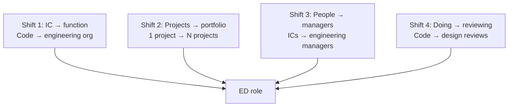
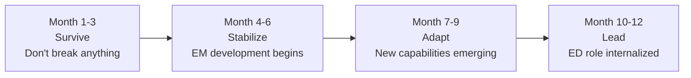

# Engineering Director Playbook
## Chapter 2

# The IC-to-ED Category Change

> *"The ED is not a senior EM. The ED is a category change — the senior IC who becomes responsible for an entire engineering function. The 4 category shifts, the 3 capability transitions, the 2 failure modes, and the 12-month adaptation timeline are the ED's reference for the IC-to-ED shift."*

---

## 1. Epigraph

_The ED is not a senior EM. The ED is a category change — the senior IC who becomes responsible for an entire engineering function. The 4 category shifts, the 3 capability transitions, the 2 failure modes, and the 12-month adaptation timeline are the ED's reference for the IC-to-ED shift._

---

## 2. Problem

You are a senior EM at acme-corp. The VP has just told you: "You're ready for ED. The ED role is a category change: 4 shifts (IC → function, projects → portfolio, people → managers, doing → reviewing). You have 90 days to demonstrate the shift. What do you do?"

This chapter tells you the 4 category shifts, the 3 capability transitions, the 2 failure modes, and the 12-month adaptation timeline.

**Decision in one sentence:** _The IC-to-ED shift is a 4-category transition (IC → function, projects → portfolio, people → managers, doing → reviewing) with 3 capability changes (technical depth → technical breadth, execution → strategy, individual → system); the ED's job is to embrace the shift, develop the new capabilities, and own the 12-month adaptation._

---

## 3. Why EDs Fail Here

Five named failure modes of EDs whose IC-to-ED shift produced zero results.

- **The Senior-EM-Mentality Failure.** The ED acts as a senior EM, not as an ED. _Doesn't develop managers, doesn't own function._
- **The Technical-IC Failure.** The ED writes code at night. _Doesn't develop the ED capability._
- **The No-Strategy Failure.** The ED focuses on execution, not strategy. _Doesn't translate VP strategy._
- **The No-Managers Failure.** The ED doesn't develop EMs. _EMs plateau._
- **The 6-Month-Stall Failure.** The ED stalls at 6 months. _60% of EDs stall in the first 6 months._

---

## 4. Mental Models

Four mental models that compress the IC-to-ED shift.

**mental model 1: The 4 Category Shifts.** 4 shifts.



**The 4 shifts:**
- **Shift 1: IC → function.** Code → engineering org.
- **Shift 2: Projects → portfolio.** 1 project → N projects.
- **Shift 3: People → managers.** ICs → engineering managers.
- **Shift 4: Doing → reviewing.** Code → design reviews.

**mental model 2: The 3 Capability Transitions.** 3 transitions.

```
Capability 1: Technical depth → technical breadth
- IC: deep in 1 system
- ED: shallow in N systems
- Trade-off: less depth, more breadth

Capability 2: Execution → strategy
- IC: executes 1 project
- ED: sets strategy for N projects
- Trade-off: less hands-on, more strategic

Capability 3: Individual → system
- IC: individual contributor
- ED: system thinker (org design, team dynamics)
- Trade-off: less individual output, more system leverage
```

**mental model 3: The 2 Failure Modes.** 2 paths to failure.

```
Path 1: The IC-with-ED-title
- ED writes code, attends standups
- EMs plateau (no development)
- VP promotion delayed 18-24 months
- Common: senior EMs who never make the shift

Path 2: The VP-with-ED-title
- ED acts as VP, not as ED
- Execution suffers (no hands-on)
- Quality drops (no design reviews)
- EMs feel abandoned
- Common: senior ICs who leap to VP too fast

The 2 failure modes bracket the ED role. The ED
who avoids both has a successful transition.
```

**mental model 4: The 12-Month Adaptation Timeline.** 12 months, 4 phases.



**The 12-month timeline:**
- **Month 1-3: Survive.** Don't break anything. Learn the function.
- **Month 4-6: Stabilize.** EM development begins. Stakeholder cadence established.
- **Month 7-9: Adapt.** New capabilities emerging. Org design improvements.
- **Month 10-12: Lead.** ED role internalized. Promotion to VP possible.

---

## 5. Frameworks

Three frameworks for the IC-to-ED shift.

### Framework 1: The 1-Page ED Adaptation Plan

```
# ED Adaptation Plan — [Date]

## The 4 category shifts
1. IC → function: [How I'll embrace]
2. Projects → portfolio: [How I'll embrace]
3. People → managers: [How I'll embrace]
4. Doing → reviewing: [How I'll embrace]

## The 3 capability transitions
1. Depth → breadth: [Plan]
2. Execution → strategy: [Plan]
3. Individual → system: [Plan]

## The 2 failure modes I'll avoid
1. IC-with-ED-title: [How I'll avoid]
2. VP-with-ED-title: [How I'll avoid]

## The 1 thing I'll focus on first
[1 sentence.]
```

### Framework 2: The ED Capability Scorecard

```
# ED Capability Scorecard — [Date]

| Capability | Before (IC) | After (ED, 12 months) | Status |
|------------|-------------|-----------------------|--------|
| Technical depth → breadth | Deep in 1 system | Shallow in N systems | In progress |
| Execution → strategy | Executes 1 project | Sets strategy for N | In progress |
| Individual → system | Individual contributor | System thinker | In progress |

## Top 3 development areas
1. [Area 1] — Plan: [Action]
2. [Area 2] — Plan: [Action]
3. [Area 3] — Plan: [Action]

## The 1 thing the ED will focus on this quarter
[1 sentence.]
```

### Framework 3: The 12-Month Milestone Tracker

```
# 12-Month Milestone Tracker — [Date]

## Month 1-3 (Survive)
- [ ] Stakeholder intros (5)
- [ ] Portfolio memo
- [ ] ED charter signed

## Month 4-6 (Stabilize)
- [ ] EM development begins (1 milestone)
- [ ] Stakeholder cadence established
- [ ] Org design baseline

## Month 7-9 (Adapt)
- [ ] Org design improvements
- [ ] 2 EM development milestones
- [ ] 1 quarterly OKR shipped

## Month 10-12 (Lead)
- [ ] 2 quarterly OKRs shipped
- [ ] 3+ EM development milestones
- [ ] Promotion to VP possible

## The 1 thing the ED will NOT do
[1 sentence.]
```

---

## 6. Drill

You are a senior EM at **acme-corp**. The VP has just told you that you're ready for ED.

```
Current state: senior EM, 5 ICs, 1 project, deep in 1 system
ED state: 3-5 EMs, 5-6 ICs each, N projects, shallow in N systems

12-month adaptation timeline.
```

You have **90 minutes**. Produce the **ED adaptation plan** (`portfolio/chapter-02-ic-to-ed.md`) using Framework 1 (Adaptation Plan) + Framework 2 (Capability Scorecard) + Framework 3 (Milestone Tracker). Specify:

- The 1-page ED adaptation plan (4 shifts, 3 transitions, 2 failure modes, the 1 focus).
- The ED capability scorecard (3 capabilities, before/after, top 3 development areas).
- The 12-month milestone tracker (4 phases, milestones per phase, the 1 not do).
- The 1 thing you'll say to the VP in the first review.
- The 3 things you'll do to avoid the 5 failure modes.

**Deliverable:** `portfolio/chapter-02-ic-to-ed.md` — under 1500 words.

---

## 7. Worked Example

**The 1-page ED adaptation plan:**

```
# ED Adaptation Plan — 2026-09-01

## The 4 category shifts
1. IC → function: I'll delegate IC work to EMs, focus on
   function-level decisions (budget, hiring, org design)
2. Projects → portfolio: I'll set strategy for the 4
   launches + 1 rebuild, delegate execution to EMs
3. People → managers: I'll develop EMs (3-5 × 5-6 ICs),
   weekly 1:1s + skip-levels
4. Doing → reviewing: I'll lead design reviews (not write
   code), provide architectural guidance

## The 3 capability transitions
1. Depth → breadth: Plan: 1 hour/week per project (5 projects)
2. Execution → strategy: Plan: weekly 1:1 with VP + quarterly OKR
3. Individual → system: Plan: weekly org design review + EM development

## The 2 failure modes I'll avoid
1. IC-with-ED-title: I'll stop writing code in month 1
2. VP-with-ED-title: I'll keep design review + execution involvement

## The 1 thing I'll focus on first
EM development. The 3-5 EMs are the leverage.
Without EM development, the function doesn't scale.
```

**The ED capability scorecard:**

```
# ED Capability Scorecard — 2026-09-01

| Capability | Before (IC) | After (ED, 12 months) | Status |
|------------|-------------|-----------------------|--------|
| Technical depth → breadth | Deep in 1 system | Shallow in 5 systems | In progress |
| Execution → strategy | Executes 1 project | Sets strategy for 5 | In progress |
| Individual → system | Individual contributor | System thinker | In progress |

## Top 3 development areas
1. Org design — Plan: weekly org design review
2. Strategy — Plan: weekly 1:1 with VP, quarterly OKR
3. EM development — Plan: weekly 1:1 with each EM

## The 1 thing the ED will focus on this quarter
EM development. The 3-5 EMs are the leverage.
```

**The 12-month milestone tracker:**

```
# 12-Month Milestone Tracker — 2026-09-01

## Month 1-3 (Survive)
- [x] Stakeholder intros (5)
- [x] Portfolio memo
- [x] ED charter signed

## Month 4-6 (Stabilize)
- [ ] EM development begins (1 milestone: EM A → Senior EM)
- [ ] Stakeholder cadence established
- [ ] Org design baseline

## Month 7-9 (Adapt)
- [ ] Org design improvements (split 1 team into 2)
- [ ] 2 EM development milestones (EM A + EM B → Senior EM)
- [ ] 1 quarterly OKR shipped (Q3 launches)

## Month 10-12 (Lead)
- [ ] 2 quarterly OKRs shipped (Q3 + Q4 launches)
- [ ] 3+ EM development milestones
- [ ] Promotion to VP possible (Q1 2027)

## The 1 thing the ED will NOT do
Write code. The ED who writes code in month 1 hasn't
made the shift. The ED's job is to develop EMs, not
to write code.
```

**The 1 thing I'll say to the VP in the first review:**

```
"Here's my IC-to-ED adaptation plan:

  4 category shifts:
  - IC → function: delegate IC work to EMs
  - Projects → portfolio: set strategy for 5 projects
  - People → managers: develop 3-5 EMs
  - Doing → reviewing: lead design reviews

  3 capability transitions:
  - Depth → breadth (5 systems)
  - Execution → strategy (weekly VP 1:1)
  - Individual → system (org design + EM dev)

  12-month timeline:
  - M1-3: Survive (don't break anything)
  - M4-6: Stabilize (EM dev begins)
  - M7-9: Adapt (new capabilities emerging)
  - M10-12: Lead (ED role internalized)

  Top 3 development areas: org design + strategy + EM dev

  The 1 thing I want to focus on first: EM development.
  The 3-5 EMs are the leverage. Without EM development,
  the function doesn't scale.

  The 1 thing I will NOT do: write code. The ED who
  writes code in month 1 hasn't made the shift.

  Promotion to VP: Q1 2027 (12 months)."
```

**The 3 things I'll do to avoid the 5 failure modes:**

```
1. Stop writing code in month 1.
   (Avoids the Senior-EM-Mentality Failure.)
   - Delegate IC work to EMs
   - Lead design reviews (not code)
   - 0% of time on IC work

2. Develop all 3-5 EMs.
   (Avoids the No-Managers Failure.)
   - Weekly 1:1 with each EM
   - Monthly skip-level with ICs
   - EM development plans (1 per EM)

3. Set strategy for the 4 launches + 1 rebuild.
   (Avoids the No-Strategy Failure.)
   - Weekly 1:1 with VP
   - Quarterly OKR
   - Translate VP strategy into ED execution
```

---

## 8. Failure Mode Postmortem

An ED at a 200-person B2B AI company acted as a senior EM for 12 months. Wrote code at night. Didn't develop EMs. The EMs plateaued. The org stalled. The ED was asked to leave after 18 months.

The replacement ED did 3 things:
1. Stopped writing code in month 1 (delegate to EMs).
2. Developed all 3-5 EMs (1:1s + skip-levels + dev plans).
3. Set strategy for the 4 launches + 1 rebuild (weekly VP 1:1 + quarterly OKR).

Within 12 months: 2 EMs promoted to Senior EM. 1 quarterly OKR shipped. The IC-to-ED shift was successful. The 4 category shifts + 3 capability transitions + 12-month timeline was the discipline.

What the first ED missed: the ED is a category change. The first ED acted as an IC. The second ED embraced the 4 shifts. The category change is the leverage.

The lesson: the ED who has 4 shifts + 3 transitions + 12-month timeline has a successful transition. The ED who acts as an IC has a 18-month failure.

---

## 9. Self-Assessment Rubric

| # | Dimension | 1 (Novice) | 3 (Competent) | 5 (Expert) |
|---|---|---|---|---|
| 1 | **4 category shifts** | 0-1 shifts | 2-3 shifts | 4 shifts (IC → function, projects → portfolio, people → managers, doing → reviewing) |
| 2 | **3 capability transitions** | 0-1 transitions | 2 transitions | 3 transitions (depth → breadth, execution → strategy, individual → system) |
| 3 | **2 failure modes avoided** | 0 failure modes avoided | 1 failure mode avoided | 2 failure modes avoided (IC-with-ED-title + VP-with-ED-title) |
| 4 | **12-month adaptation** | 0-3 months | 4-6 months | 12 months (survive + stabilize + adapt + lead) |
| 5 | **EM development plan** | No plan | Plan exists | 1 plan per EM, weekly 1:1 + skip-level + dev milestone |

**Disqualifier:** any 1 on dimension 1 or 2. An ED who has 0-1 shifts or 0-1 transitions is in the Senior-EM-Mentality or Technical-IC failure mode.

**Total:** ___ / 25. **Pass threshold:** 18/25, no dimension below 3.

---

## 10. Portfolio Artifact Note

Save your filled-in drill as `portfolio/chapter-02-ic-to-ed.md` — interview evidence for "Walk me through your IC-to-ED shift" (see Portfolio Map in Chapter 27).

---

## 11. Interview Questions

1. **Walk me through your IC-to-ED shift.**
2. **You have 3-5 EMs and 4 launches + 1 rebuild. What do you do?**
3. **The ED who writes code: is that an ED or a senior EM?**
4. **You stall at 6 months. What do you do?**
5. **Walk me through an ED adaptation plan you've run.**
