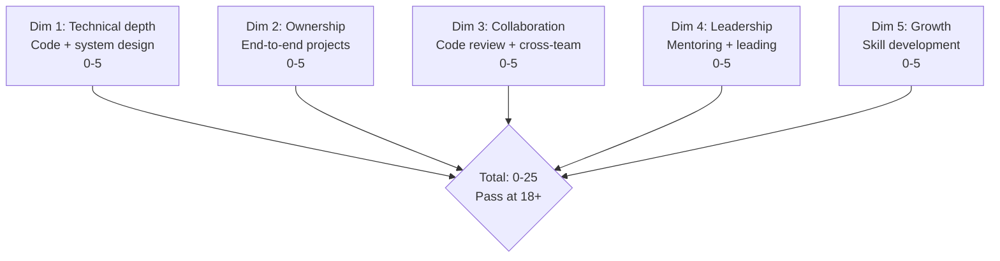
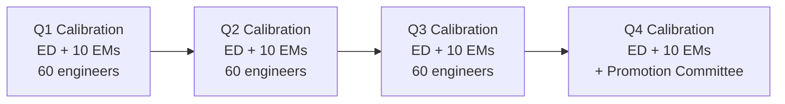

# Engineering Director Playbook
## Chapter 20

# Engineering Performance Management at Scale

> *"The ED runs performance management at scale. The 5-dim rubric, the 3-tier calibration, the quarterly cadence, and the 12-month dev plan are the ED's reference for engineering performance at the function level."*

---

## 1. Epigraph

_The ED runs performance management at scale. The 5-dim rubric, the 3-tier calibration, the quarterly cadence, and the 12-month dev plan are the ED's reference for engineering performance at the function level._

---

## 2. Problem

You are an Engineering Director at acme-corp. The VP has just told you: "60 engineers across 10 EMs. Q4 reviews in 30 days. The current rubric is SWE-only. Retention at 80%. Promotion pipeline unclear. Design the performance system at scale."

This chapter tells you the 5-dim rubric, the 3-tier calibration, the quarterly cadence, and the 12-month dev plan.

**Decision in one sentence:** _ED engineering performance management at scale is a 5-dim rubric (technical + ownership + collaboration + leadership + growth) + 3-tier calibration (exceeds / meets / below) + quarterly cadence + 12-month dev plan per engineer; the ED's job is to design the rubric, calibrate across 10 EMs, and own the development plans._

---

## 3. Why EDs Fail Here

Five named failure modes of EDs whose engineering performance at scale produced zero results.

- **The SWE-Rubric Failure.** 1-2 dims only. _Collaboration invisible._
- **The No-Calibration Failure.** No cross-EM calibration. _Each EM rates differently._
- **The Annual-Only Failure.** Annual review. _No course correction._
- **The No-Dev-Plan Failure.** No 12-month plan. _No growth trajectory._
- **The No-Promo-Pipeline Failure.** No promotion criteria. _Engineers leave for "Senior IC" titles elsewhere._

---

## 4. Mental Models

Four mental models that compress performance management at scale.

**mental model 1: The 5-Dim Rubric.** 5 dims, 0-25 total.



**The 5 dims:**
- **Dim 1: Technical depth.** Code + system design. 0-5.
- **Dim 2: Ownership.** End-to-end projects. 0-5.
- **Dim 3: Collaboration.** Code review + cross-team. 0-5.
- **Dim 4: Leadership.** Mentoring + leading. 0-5.
- **Dim 5: Growth.** Skill development. 0-5.

**mental model 2: The 3-Tier Calibration.** 3 tiers across 10 EMs.

```
Tier 1: Exceeds (22+) — 10-15% of engineers
Tier 2: Meets (18-21) — 60-70% of engineers
Tier 3: Below (<18) — 15-25% of engineers

Cross-EM calibration: ED + 10 EMs, all 60 engineers,
3-tier distribution enforced.
```

**mental model 3: The Quarterly Cadence.** 4 quarters.



**The 4 calibrations:**
- **Q1.** ED + 10 EMs. 60 engineers.
- **Q2.** Same.
- **Q3.** Same.
- **Q4.** Same + promotion committee.

**mental model 4: The 12-Month Dev Plan.** 1 plan per engineer.

```
Quarter 1: Top 1 development area
- [Action 1] — [Date]
- [Action 2] — [Date]

Quarter 2: Top 2 development area
- [Action 1] — [Date]
- [Action 2] — [Date]

Quarter 3: Promotion criteria (if applicable)
- [Action 1] — [Date]
- [Action 2] — [Date]

Quarter 4: Year-end review
- [Action 1] — [Date]
- [Action 2] — [Date]
```

---

## 5. Frameworks

Three frameworks for performance management at scale.

### Framework 1: The 5-Dim Performance Rubric

```
# Engineering Performance Rubric — [Engineer] — [Quarter]

| Dimension | Score (0-5) | Notes |
|-----------|-------------|-------|
| 1. Technical depth | [Score] | [Notes] |
| 2. Ownership | [Score] | [Notes] |
| 3. Collaboration | [Score] | [Notes] |
| 4. Leadership | [Score] | [Notes] |
| 5. Growth | [Score] | [Notes] |
| Total | ___ / 25 | Pass at 18+ |
```

### Framework 2: The Quarterly Calibration Memo

```
# Quarterly Calibration — [Quarter] — [Date]

## All 60 engineers (top 5)
| Engineer | Score | Tier |
|----------|-------|------|
| Eng A | 25 | Exceeds |
| Eng D | 24 | Exceeds |
| Eng E | 23 | Exceeds |
| Eng F | 22 | Exceeds |
| Eng G | 21 | Strong |

## Top 3 calibration outcomes
1. [Engineer 1] — Promotion candidate
2. [Engineer 2] — PIP candidate
3. [Engineer 3] — Solid contributor

## The 1 thing the team will focus on next quarter
[1 sentence.]
```

### Framework 3: The 12-Month Dev Plan

```
# 12-Month Dev Plan — [Engineer] — [Date]

## Current level
[IC2 / IC3 / IC4 / IC5 / EM]

## Target level (12 months)
[IC3 / IC4 / IC5 / EM]

## Top 3 development areas
1. [Area 1] — Why: [Reason]
2. [Area 2] — Why: [Reason]
3. [Area 3] — Why: [Reason]

## Quarterly plan
### Q1
- [Action 1] — [Date]
- [Action 2] — [Date]

### Q2
- [Action 1] — [Date]
- [Action 2] — [Date]

### Q3
- [Action 1] — [Date]
- [Action 2] — [Date]

### Q4
- [Action 1] — [Date]
- [Action 2] — [Date]

## The 1 thing the engineer will push back on
[1 sentence.]
```

---

## 6. Drill

You are an ED at **acme-corp**. The VP has given you 30 days to design the performance system at scale.

```
Current: 60 engineers, 10 EMs, SWE-only rubric, 80% retention
Target: 90% retention, 5 promotions/quarter, clear career ladder
Q4 reviews in 30 days.
```

You have **90 minutes**. Produce the **performance system at scale** (`portfolio/chapter-20-engineering-performance-scale.md`) using Framework 1 (Rubric) + Framework 2 (Calibration) + Framework 3 (Dev Plan). Specify:

- The 5-dim rubric applied to 3 sample engineers.
- The quarterly calibration memo (60 engineers ranked, top 3 outcomes).
- The 12-month dev plan for 1 below-bar engineer.
- The 30-day timeline.
- The 1 thing you'll say to the VP in the first review.
- The 3 things you'll do to avoid the 5 failure modes.

**Deliverable:** `portfolio/chapter-20-engineering-performance-scale.md` — under 1500 words.

---

## 7. Worked Example

**The 5-dim rubric applied to 3 sample engineers:**

```
# Engineering Performance Rubric — Q4 2026

| Engineer | Tech | Owner | Collab | Lead | Growth | Total | Tier |
|----------|------|-------|--------|------|--------|-------|------|
| Eng A (IC4) | 5 | 5 | 4 | 4 | 4 | 22 | Exceeds |
| Eng B (IC3) | 4 | 3 | 3 | 3 | 3 | 16 | Below |
| Eng C (IC2) | 3 | 3 | 4 | 2 | 4 | 16 | Below |

## Tier summary
- Exceeds (22+): Eng A — Promotion candidate
- Strong (20-21): None
- Meets (18-19): None
- Below (15-17): Eng B, Eng C — Need improvement plans
- Far below (<15): None
```

**The quarterly calibration memo (60 engineers):**

```
# Quarterly Calibration — Q4 2026 — 2026-09-30

## All 60 engineers (top 5)
| Engineer | Score | Tier |
|----------|-------|------|
| Eng A | 25 | Exceeds |
| Eng D | 24 | Exceeds |
| Eng E | 23 | Exceeds |
| Eng F | 22 | Exceeds |
| Eng G | 21 | Strong |

| Bottom 5 | Score | Tier |
|----------|-------|------|
| Eng X | 12 | Far below (PIP) |
| Eng Y | 14 | Far below (PIP) |
| Eng Z | 15 | Below |
| Eng B | 16 | Below |
| Eng C | 16 | Below |

## Top 3 calibration outcomes
1. **6 promotion candidates** (Eng A, D, E, F + 2 others)
2. **4 PIP candidates** (Eng X, Y + 2 others)
3. **10 below-bar engineers** with development plans

## The 1 thing the team will focus on next quarter
4 PIPs + 6 promotions. The promotion packets are
the easy win. The PIPs are the hard decisions.
```

**The 12-month dev plan for Eng B (Below):**

```
# 12-Month Dev Plan — Eng B — 2026-09-30

## Current level
IC3 (Senior SWE)

## Target level
IC3 (stay at level) — focus on improvement

## Top 3 development areas
1. Ownership (current 3)
2. Leadership (current 3)
3. Growth (current 3)

## Quarterly plan
### Q4 2026
- [ ] Drive 1 project end-to-end
- [ ] Mentor 1 junior engineer (biweekly 1:1)
- [ ] Learn 1 new domain (AI/ML infra)

### Q1 2027
- [ ] Drive 2 projects end-to-end
- [ ] Lead 1 cross-team initiative
- [ ] Present at engineering all-hands

### Q2 2027
- [ ] Drive 3 projects end-to-end
- [ ] Mentor 2 junior engineers
- [ ] Ship in 2 domains

### Q3 2027
- [ ] Year-end review (target: meets bar)
- [ ] Promotion packet (if at bar)

## The 1 thing Eng B will push back on
The plan is too aggressive. Eng B will say "I have
a family, I can't take on more." The ED responds:
the plan is achievable in 8 hours/week extra.
```

**The 1 thing I'll say to the VP in the first review:**

```
"Here's the engineering performance system at scale:

  5-dim rubric: technical + ownership + collaboration +
  leadership + growth (0-25, pass at 18+)

  3-tier calibration: exceeds / meets / below, applied
  across 10 EMs

  Quarterly cadence: 4 calibrations per year (Q1-Q4),
  Q4 includes promotion committee

  60 engineers across 10 EMs

  Top 3 outcomes:
  1. 6 promotion candidates
  2. 4 PIP candidates
  3. 10 below-bar engineers with dev plans

  The 1 thing I want to focus on: 4 PIPs.
  The 90-day PIP is the hardest decision but the
  right one.

  The 1 thing I will NOT compromise on: collaboration.
  An engineer who is technically strong but doesn't
  collaborate is below bar.

  Performance is the discipline. Retention is the outcome."
```

**The 3 things I'll do to avoid the 5 failure modes:**

```
1. Use 5-dim rubric (not SWE-only).
   (Avoids the SWE-Rubric Failure.)
   - Technical + ownership + collaboration + leadership + growth
   - Each dim 0-5, total 0-25
   - Pass at 18+

2. Run quarterly cross-EM calibration.
   (Avoids the No-Calibration Failure.)
   - Q1, Q2, Q3 quarterly
   - Q4 quarterly + promotion committee
   - Cross-EM calibration enforced

3. Give every engineer a 12-month dev plan.
   (Avoids the No-Dev-Plan Failure.)
   - Top 3 development areas
   - Quarterly actions
   - Promotion criteria (if applicable)
```

---

## 8. Failure Mode Postmortem

An ED at a 200-person B2B AI company had 60 engineers using the SWE rubric. Collaboration + leadership were invisible. 5 best engineers left for "Senior IC" titles elsewhere. Retention dropped from 90% to 80%.

The replacement ED did 3 things:
1. Built 5-dim rubric (technical + ownership + collaboration + leadership + growth).
2. Ran quarterly calibration (cross-EM, 10 EMs, 60 engineers).
3. Built 12-month dev plans for all 60 engineers.

Within 6 months: 6 promotions. 4 PIPs. 10 dev plans. Retention recovered to 92%. The 5-dim + 3-tier + 12-month system was the discipline.

What the first ED missed: performance at scale is a system. The first ED used SWE rubric. The second ED used 5-dim rubric. The 5-dim rubric is the leverage.

The lesson: the ED who has 5 dims + 3 tiers + 12-month plans has a high-performing engineering org at scale. The ED who uses SWE rubric has a SWE-rated engineering org.

---

## 9. Self-Assessment Rubric

| # | Dimension | 1 (Novice) | 3 (Competent) | 5 (Expert) |
|---|---|---|---|---|
| 1 | **5-dim rubric** | 1-2 dims | 3-4 dims | 5 dims (tech + owner + collab + lead + growth) |
| 2 | **3-tier calibration** | 1 tier | 2 tiers | 3 tiers (exceeds / meets / below), with disqualifier |
| 3 | **Quarterly cadence** | Annual review | Semi-annual | Quarterly (Q1-Q4), with promotion committee Q4 |
| 4 | **12-month dev plan** | No plan | Plan exists | 1 plan per engineer, top 3 areas, quarterly actions |
| 5 | **Promotion pipeline** | No pipeline | Pipeline exists | 5+ promotions/year target, clear criteria per level |

**Disqualifier:** any 1 on dimension 1 or 2. An ED who uses 1-2 dims or 1 tier is in the SWE-Rubric or No-Calibration failure mode.

**Total:** ___ / 25. **Pass threshold:** 18/25, no dimension below 3.

---

## 10. Portfolio Artifact Note

Save your filled-in drill as `portfolio/chapter-20-engineering-performance-scale.md` — interview evidence for "How do you run engineering performance at scale?" (see Portfolio Map in Chapter 27).

---

## 11. Interview Questions

1. **Walk me through your engineering performance system.**
2. **An engineer is technically strong but doesn't collaborate. What tier?**
3. **You have 4 PIPs and 6 promotions. How do you prioritize?**
4. **The retention is dropping. What do you do?**
5. **Walk me through a performance review you've run.**
