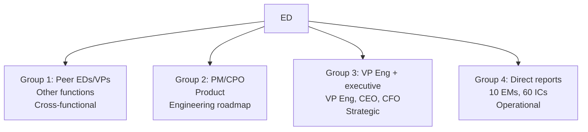
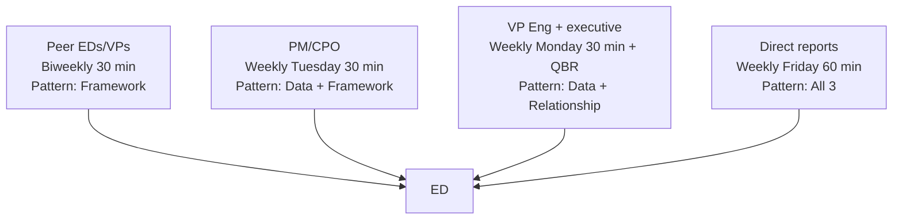

# Engineering Director Playbook
## Chapter 21

# Influencing at the Engineering Function

> *"The ED influences across the engineering function. The 4 stakeholder groups, the 3 influence patterns, and the 5-criterion influence quality bar are the ED's reference for engineering influence at the function level."*

---

## 1. Epigraph

_The ED influences across the engineering function. The 4 stakeholder groups, the 3 influence patterns, and the 5-criterion influence quality bar are the ED's reference for engineering influence at the function level._

---

## 2. Problem

You are an Engineering Director at acme-corp. The VP has just told you: "60 engineers across 10 EMs. The PM, CPO, CSO, CEO, and CFO all want your input. You're spending 30% of your time in meetings. Design the engineering influence system."

This chapter tells you the 4 stakeholder groups, the 3 influence patterns, and the 5-criterion influence quality bar.

**Decision in one sentence:** _ED engineering influence is a 4-stakeholder system (peer EMs + PM + VP Eng + executive team) with 3 influence patterns (data + framework + relationship) and 5-criterion influence quality bar; the ED's job is to identify the stakeholders, choose the right influence pattern, and own the engineering voice._

---

## 3. Why EDs Fail Here

Five named failure modes of EDs whose engineering influence produced zero results.

- **The No-Stakeholder-Map Failure.** The ED has no stakeholder map. _Influence is ad-hoc._
- **The Slack-Channel Failure.** The ED drops engineering input in Slack. _Influence is invisible._
- **The No-Framework Failure.** The ED provides opinions, not frameworks. _No reuse._
- **The No-Data Failure.** The ED provides opinions, not data. _No credibility._
- **The No-Relationship Failure.** The ED only talks in crisis. _No trust._

---

## 4. Mental Models

Four mental models that compress engineering influence.

**mental model 1: The 4 Stakeholder Groups.** 4 groups.



**The 4 groups:**
- **Group 1: Peer EDs/VPs.** Other functions. Cross-functional.
- **Group 2: PM/CPO.** Product. Engineering roadmap.
- **Group 3: VP Eng + executive.** VP Eng, CEO, CFO. Strategic.
- **Group 4: Direct reports.** 10 EMs, 60 ICs. Operational.

**mental model 2: The 3 Influence Patterns.** 3 patterns.

```
Pattern 1: Data (numbers + metrics)
- "We shipped 4 launches, 99.9% uptime, $5M ARR"
- "Velocity is 60% of target"

Pattern 2: Framework (1-pagers)
- "5-dim rubric + 3-tier calibration"
- "4-pillar quality system"

Pattern 3: Relationship (trust + credibility)
- "I've worked with you for 3 years"
- "We delivered together on the last launch"

The 3 patterns are layered: data + framework + relationship.
```

**mental model 3: The 5-Criterion Influence Quality Bar.** 5 criteria.

```
1. Specific (data + framework, not opinion)
2. Aligned (with stakeholder's goals)
3. Timed (right time, not crisis)
4. Owned (1 ED accountable)
5. Reusable (framework, not 1-off)
```

**mental model 4: The Stakeholder Map Per Group.** 4 maps.



**The 4 maps:**
- **G1: Peer EDs/VPs.** Biweekly 30 min. Pattern: Framework.
- **G2: PM/CPO.** Weekly Tuesday 30 min. Pattern: Data + Framework.
- **G3: VP Eng + executive.** Weekly Monday 30 min + QBR. Pattern: Data + Relationship.
- **G4: Direct reports.** Weekly Friday 60 min. Pattern: All 3.

---

## 5. Frameworks

Three frameworks for engineering influence.

### Framework 1: The 1-Page Stakeholder Map

```
# Engineering Stakeholder Map — [Date]

## The 4 stakeholder groups
1. Peer EDs/VPs (biweekly 30 min, framework)
2. PM/CPO (weekly Tuesday 30 min, data + framework)
3. VP Eng + executive (weekly Monday 30 min + QBR, data + relationship)
4. Direct reports (weekly Friday 60 min, all 3)

## The 5-criterion influence bar
- Specific + Aligned + Timed + Owned + Reusable

## The 1 thing the ED will NOT compromise on
[1 sentence.]
```

### Framework 2: The Influence Pattern Tracker

```
# Influence Tracker — [Quarter]

| Stakeholder | Pattern | Cadence | Outcome |
|-------------|---------|---------|---------|
| PM | Data + Framework | Weekly Tue | 2 PRFAs merged |
| VP Eng | Data + Relationship | Weekly Mon + QBR | $5M ARR aligned |
| CEO | Data + Relationship | QBR | FY27 strategy input |
| Direct reports | All 3 | Weekly Fri | 60 engineers aligned |

## Top 3 wins
1. [Win 1]
2. [Win 2]
3. [Win 3]
```

### Framework 3: The Influence Quality Bar Template

```
# Influence Quality — [Decision] — [Date]

## The 5 criteria
1. Specific: [data + framework]
2. Aligned: [stakeholder's goals]
3. Timed: [right time]
4. Owned: [ED accountable]
5. Reusable: [framework, not 1-off]

## The 1 thing the ED will NOT compromise on
[1 sentence.]
```

---

## 6. Drill

You are an ED at **acme-corp**. The VP has given you 90 days to design the influence system.

```
Current: 30% time in meetings, no stakeholder map,
Slack-based influence
Target: <20% time in meetings, 4 stakeholder groups,
3 influence patterns, 5-criterion bar
```

You have **90 minutes**. Produce the **engineering influence system** (`portfolio/chapter-21-engineering-influence.md`) using Framework 1 (Stakeholder Map) + Framework 2 (Influence Tracker) + Framework 3 (Quality Bar). Specify:

- The 1-page stakeholder map (4 groups, 5-criterion bar, the 1 not compromise).
- The influence tracker (4 stakeholders × 3 patterns, top 3 wins).
- The influence quality bar template (5 criteria, the 1 not compromise).
- The 90-day timeline.
- The 1 thing you'll say to the VP in the first review.
- The 3 things you'll do to avoid the 5 failure modes.

**Deliverable:** `portfolio/chapter-21-engineering-influence.md` — under 1500 words.

---

## 7. Worked Example

**The 1-page stakeholder map:**

```
# Engineering Stakeholder Map — 2026-09-01

## The 4 stakeholder groups
1. Peer EDs/VPs (Sales, Marketing, Customer Success)
   - Biweekly 30 min, Pattern: Framework
2. PM/CPO
   - Weekly Tuesday 30 min, Pattern: Data + Framework
3. VP Eng + executive (CEO, CFO)
   - Weekly Monday 30 min + QBR, Pattern: Data + Relationship
4. Direct reports (10 EMs, 60 ICs)
   - Weekly Friday 60 min, Pattern: All 3

## The 5-criterion influence bar
- Specific (data + framework) + Aligned + Timed +
  Owned (ED) + Reusable (framework, not 1-off)

## The 1 thing I will NOT compromise on
Pattern: Framework. A 1-pager framework is reusable
across stakeholders. A Slack message is not.
```

**The influence tracker (Q4 2026):**

```
# Influence Tracker — Q4 2026

| Stakeholder | Pattern | Cadence | Outcome |
|-------------|---------|---------|---------|
| PM (Sarah) | Data + Framework | Weekly Tue | 2 PRFAs merged |
| VP Eng (Mike) | Data + Relationship | Weekly Mon + QBR | $5M ARR aligned |
| CEO (Lisa) | Data + Relationship | QBR | FY27 strategy input |
| Direct reports | All 3 | Weekly Fri | 60 engineers aligned |

## Top 3 wins
1. Auth integration simplification PRFA merged with PM
2. FY27 strategy input shaped the $8M engineering budget
3. 60-engineer org aligned via weekly Friday all-hands
```

**The influence quality bar template (Auth integration):**

```
# Influence Quality — Auth integration PRFA — 2026-09-08

## The 5 criteria
1. Specific: 1-page PRFA (problem + impact + workaround +
   solution + alternatives + recommendation + effort +
   capacity)
2. Aligned: PM's top 3 prioritization + ED's engineering
   capacity (5 ICs, 2 quarters)
3. Timed: Tuesday 10am, weekly sync, NOT crisis
4. Owned: ED accountable for the PRFA
5. Reusable: PRFA template applies to all 5 engineering
   themes

## The 1 thing I will NOT compromise on
Specific. A vague engineering input ("auth is hard")
is not an influence attempt. A 1-page PRFA is.
```

**The 1 thing I'll say to the VP in the first review:**

```
"Here's the engineering influence system:

  4 stakeholder groups:
  1. Peer EDs/VPs (biweekly 30 min, framework)
  2. PM/CPO (weekly Tue, data + framework)
  3. VP Eng + executive (weekly Mon + QBR, data + relationship)
  4. Direct reports (weekly Fri, all 3)

  3 influence patterns: data + framework + relationship

  5-criterion bar: specific + aligned + timed + owned + reusable

  Top 3 wins this quarter:
  1. Auth integration PRFA merged with PM
  2. FY27 strategy input shaped $8M engineering budget
  3. 60-engineer org aligned via weekly Friday all-hands

  The 1 thing I want to focus on: framework pattern.
  A 1-page framework is reusable across stakeholders.

  The 1 thing I will NOT compromise on: framework.
  Slack messages are not influence. 1-page frameworks are.

  Influence is the discipline. Engineering voice is the outcome."
```

**The 3 things I'll do to avoid the 5 failure modes:**

```
1. Build 4-group stakeholder map.
   (Avoids the No-Stakeholder-Map Failure.)
   - Peer EDs/VPs + PM/CPO + VP Eng/exec + direct reports
   - Cadence per group
   - Pattern per group

2. Use framework pattern (1-pagers).
   (Avoids the No-Framework Failure.)
   - PRFA template
   - Strategy memo template
   - Performance rubric template

3. Layer data + framework + relationship.
   (Avoids the No-Data Failure.)
   - Data: numbers + metrics
   - Framework: 1-pagers
   - Relationship: trust + credibility
```

---

## 8. Failure Mode Postmortem

An ED at a 200-person B2B AI company had no stakeholder map. Engineering input was dropped in Slack. The PM was overwhelmed. The VP ignored the engineering voice. The CEO never heard from the ED. The ED spent 30% of time in meetings with no influence.

The replacement ED did 3 things:
1. Built 4-group stakeholder map (peer EDs + PM + VP/exec + direct reports).
2. Used framework pattern (1-pagers: PRFA + strategy + rubric).
3. Layered data + framework + relationship.

Within 6 months: 2 PRFAs merged with PM. FY27 strategy input shaped $8M budget. 60 engineers aligned. Influence improved. The 4-group + 3-pattern + 5-criterion system was the discipline.

What the first ED missed: influence is a system. The first ED had Slack. The second ED had 4 groups + 3 patterns + 5 criteria. The system is the leverage.

The lesson: the ED who has 4 groups + 3 patterns + 5 criteria has engineering influence. The ED who uses Slack has engineering invisibility.

---

## 9. Self-Assessment Rubric

| # | Dimension | 1 (Novice) | 3 (Competent) | 5 (Expert) |
|---|---|---|---|---|
| 1 | **4 stakeholder groups** | 1-2 groups | 3 groups | 4 groups (peer EDs + PM + VP/exec + direct reports) |
| 2 | **3 influence patterns** | 1 pattern | 2 patterns | 3 patterns (data + framework + relationship) |
| 3 | **5-criterion influence bar** | 0-2 criteria | 3-4 criteria | 5 criteria (specific + aligned + timed + owned + reusable) |
| 4 | **Time in meetings** | >40% | 25-40% | <20% |
| 5 | **Influence outcomes** | No outcomes | 1-2 wins/quarter | 3+ wins/quarter |

**Disqualifier:** any 1 on dimension 1 or 2. An ED who has 1-2 groups or 1 pattern is in the No-Stakeholder-Map or Slack-Channel failure mode.

**Total:** ___ / 25. **Pass threshold:** 18/25, no dimension below 3.

---

## 10. Portfolio Artifact Note

Save your filled-in drill as `portfolio/chapter-21-engineering-influence.md` — interview evidence for "How do you influence across the engineering function?" (see Portfolio Map in Chapter 27).

---

## 11. Interview Questions

1. **Walk me through your engineering influence system.**
2. **The PM ignores your engineering input. What do you do?**
3. **You spend 30% of time in meetings. What do you do?**
4. **The CEO never heard from you. What do you do?**
5. **Walk me through an influence win you've had.**
