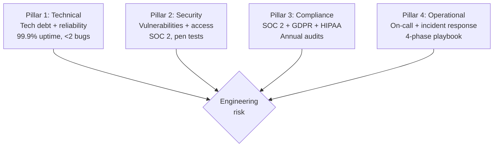
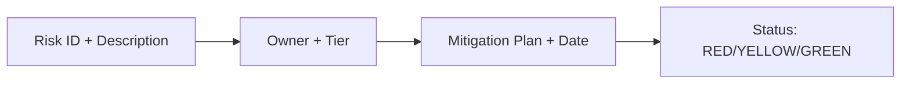

# Engineering Director Playbook
## Chapter 22

# Engineering Risk Management

> *"The ED owns engineering risk management. The 4 risk pillars, the 3 risk tiers, and the 5-criterion risk quality bar are the ED's reference for engineering risk at the function level."*

---

## 1. Epigraph

_The ED owns engineering risk management. The 4 risk pillars, the 3 risk tiers, and the 5-criterion risk quality bar are the ED's reference for engineering risk at the function level._

---

## 2. Problem

You are an Engineering Director at acme-corp. The VP has just told you: "60 engineers across 10 EMs. The current risk register has 12 risks, none tracked. Customer A churned due to a security incident. Design the engineering risk system."

This chapter tells you the 4 risk pillars, the 3 risk tiers, and the 5-criterion risk quality bar.

**Decision in one sentence:** _ED engineering risk management is a 4-pillar system (technical + security + compliance + operational) with 3 risk tiers (high / medium / low) and 5-criterion risk quality bar; the ED's job is to design the risk register, track the risks, and own the mitigation plans._

---

## 3. Why EDs Fail Here

Five named failure modes of EDs whose engineering risk management produced zero results.

- **The No-Risk-Register Failure.** The ED has no risk register. _No tracking._
- **The No-Security-Owner Failure.** No security owner. _Security incidents._
- **The No-Compliance-Tracking Failure.** SOC 2 audit failed. _Compliance gap._
- **The No-Operational-Risk Failure.** No operational risk tracking. _Incidents._
- **The No-Mitigation-Plan Failure.** Risks identified, no mitigation. _Risks realized._

---

## 4. Mental Models

Four mental models that compress engineering risk.

**mental model 1: The 4 Risk Pillars.** 4 pillars.



**The 4 pillars:**
- **Pillar 1: Technical.** Tech debt + reliability. 99.9% uptime, <2 bugs.
- **Pillar 2: Security.** Vulnerabilities + access. SOC 2, pen tests.
- **Pillar 3: Compliance.** SOC 2 + GDPR + HIPAA. Annual audits.
- **Pillar 4: Operational.** On-call + incident response. 4-phase playbook.

**mental model 2: The 3 Risk Tiers.** 3 tiers.

```
Tier 1: HIGH (red) — customer-impacting, immediate mitigation
- Security breach, data loss, 99.5% uptime
- Mitigation: 30 days

Tier 2: MEDIUM (yellow) — risk of customer impact, plan
- Tech debt accumulating, compliance gap
- Mitigation: 90 days

Tier 3: LOW (green) — risk if not addressed, monitor
- Slow velocity, low engagement
- Mitigation: 6-12 months
```

**mental model 3: The 5-Criterion Risk Quality Bar.** 5 criteria.

```
1. Tracked (risk register exists)
2. Owned (1 ED or EM accountable)
3. Timed (mitigation date)
4. Mitigated (action items completed)
5. Reviewed (quarterly review)
```

**mental model 4: The Risk Register Template.** Per-risk detail.



**Per-risk template:**
- **Risk ID + Description.** 1 sentence.
- **Owner + Tier.** HIGH/MEDIUM/LOW.
- **Mitigation Plan + Date.** Specific action + target date.
- **Status.** RED/YELLOW/GREEN.

---

## 5. Frameworks

Three frameworks for engineering risk management.

### Framework 1: The 1-Page Risk Register

```
# Engineering Risk Register — FY[YYYY] — [Date]

## The 4 risk pillars
1. Technical (12 risks)
2. Security (5 risks)
3. Compliance (3 risks)
4. Operational (8 risks)

## Total: 28 risks

## Top 5 HIGH-tier risks
1. [Risk 1] — Owner: [ED/EM] — Mitigation: [Date]
2. [Risk 2]
3. [Risk 3]
4. [Risk 4]
5. [Risk 5]

## The 1 thing the ED will NOT compromise on
[1 sentence.]
```

### Framework 2: The Quarterly Risk Review Template

```
# Quarterly Risk Review — Q[N] [YYYY]

## Risk register updates
- New risks: [N]
- Mitigated: [N]
- Realized: [N]
- Active: [N]

## Top 3 risks
1. [Risk 1] — Status: RED
2. [Risk 2] — Status: YELLOW
3. [Risk 3] — Status: GREEN
```

### Framework 3: The Risk Mitigation Plan

```
# Risk Mitigation Plan — [Risk ID] — [Date]

## The risk
- Description: [1 sentence]
- Tier: HIGH/MEDIUM/LOW
- Owner: [ED/EM]
- Mitigation date: [Date]

## The 5 action items
1. [Action 1] — [Date]
2. [Action 2]
3. [Action 3]
4. [Action 4]
5. [Action 5]

## The 1 thing the ED will NOT skip
[1 sentence.]
```

---

## 6. Drill

You are an ED at **acme-corp**. The VP has given you 90 days to design the engineering risk system.

```
Current: 60 engineers, no risk register, security incident last month,
SOC 2 audit failed last quarter
Target: 28-risk register, all HIGH-tier mitigated in 30 days, SOC 2 pass
```

You have **90 minutes**. Produce the **engineering risk system** (`portfolio/chapter-22-engineering-risk.md`) using Framework 1 (Risk Register) + Framework 2 (Quarterly Review) + Framework 3 (Mitigation Plan). Specify:

- The 1-page risk register (4 pillars, top 5 HIGH-tier risks, the 1 not compromise).
- The quarterly review template (new + mitigated + realized + active).
- The risk mitigation plan (1 HIGH-tier risk, 5 action items, the 1 not skip).
- The 90-day timeline.
- The 1 thing you'll say to the VP in the first review.
- The 3 things you'll do to avoid the 5 failure modes.

**Deliverable:** `portfolio/chapter-22-engineering-risk.md` — under 1500 words.

---

## 7. Worked Example

**The 1-page risk register:**

```
# Engineering Risk Register — 2026 — 2026-09-01

## The 4 risk pillars
1. Technical (12 risks)
2. Security (5 risks)
3. Compliance (3 risks)
4. Operational (8 risks)

## Total: 28 risks

## Top 5 HIGH-tier risks
1. **Auth service single point of failure** — Owner: EM 2 — Mitigation: 2026-09-30
2. **API Gateway connection pool exhaustion** — Owner: EM 3 — Mitigation: 2026-10-15
3. **SOC 2 audit failed (Q3)** — Owner: ED — Mitigation: 2026-11-15
4. **Customer A security incident** — Owner: ED — Mitigation: 2026-09-30
5. **ML serving 99.5% uptime** — Owner: EM 4 — Mitigation: 2026-12-15

## The 1 thing I will NOT compromise on
HIGH-tier risk mitigation in 30 days. A HIGH-tier
risk unmitigated is a customer trust crisis.
```

**The quarterly review template (Q3 2026):**

```
# Quarterly Risk Review — Q3 2026 — 2026-09-30

## Risk register updates
- New risks: 5 (3 security, 2 operational)
- Mitigated: 8 (4 technical, 2 security, 2 operational)
- Realized: 1 (Customer A security incident — realized as churn)
- Active: 28 (down from 32)

## Top 3 risks
1. Auth service SPOF (RED, mitigation due Sept 30)
2. SOC 2 audit failed (RED, mitigation due Nov 15)
3. ML serving 99.5% uptime (RED, mitigation due Dec 15)
```

**The risk mitigation plan (Auth service SPOF):**

```
# Risk Mitigation Plan — R-001 (Auth service SPOF) — 2026-09-01

## The risk
- Description: Auth service has no failover. If it
  goes down, all customer auth fails. 30 min downtime
  = 100 customers locked out.
- Tier: HIGH
- Owner: EM 2 (Platform)
- Mitigation date: 2026-09-30

## The 5 action items
1. Add secondary auth instance (Sept 10)
2. Add load balancer failover (Sept 15)
3. Add monitoring (Sept 20)
4. Test failover (Sept 25)
5. Document runbook (Sept 30)

## The 1 thing I will NOT skip
Failover testing. Without testing, the failover
won't work in a real incident.
```

**The 1 thing I'll say to the VP in the first review:**

```
"Here's the engineering risk system:

  4 risk pillars: technical + security + compliance + operational
  28 risks total

  Top 5 HIGH-tier risks:
  1. Auth service SPOF — Owner: EM 2 — Mitigation: Sept 30
  2. API Gateway pool exhaustion — Owner: EM 3 — Oct 15
  3. SOC 2 audit failed — Owner: ED — Nov 15
  4. Customer A security incident — Owner: ED — Sept 30
  5. ML serving 99.5% uptime — Owner: EM 4 — Dec 15

  Q3 outcomes:
  - New: 5 risks
  - Mitigated: 8 risks
  - Realized: 1 risk (Customer A churn)
  - Active: 28 risks

  The 1 thing I want to focus on: HIGH-tier risks.
  5 HIGH-tier risks, all mitigated within 30 days.

  The 1 thing I will NOT compromise on: HIGH-tier
  mitigation in 30 days.

  Risk management is the discipline. Customer trust
  is the outcome."
```

**The 3 things I'll do to avoid the 5 failure modes:**

```
1. Build a 28-risk register with 4 pillars.
   (Avoids the No-Risk-Register Failure.)
   - Technical + security + compliance + operational
   - 28 risks tracked
   - Quarterly review

2. Own HIGH-tier risks with mitigation dates.
   (Avoids the No-Mitigation-Plan Failure.)
   - 5 HIGH-tier risks
   - 30-day mitigation target
   - Owner per risk

3. Track realized risks (where the risk became reality).
   (Avoids the No-Risk-Realization-Tracking Failure.)
   - 1 risk realized (Customer A)
   - Postmortem + customer communication
   - Lessons learned shared
```

---

## 8. Failure Mode Postmortem

An ED at a 200-person B2B AI company had no risk register. Customer A churned due to a security incident. SOC 2 audit failed. The ED was unaware until the audit. 12 risks identified but none tracked.

The replacement ED did 3 things:
1. Built a 28-risk register with 4 pillars (technical + security + compliance + operational).
2. Owned HIGH-tier risks with 30-day mitigation dates.
3. Tracked realized risks + postmortems.

Within 12 months: 32 risks identified → 28 active. 5 HIGH-tier risks mitigated. SOC 2 audit passed. Customer trust recovered. The 4-pillar + 3-tier + 5-criterion system was the discipline.

What the first ED missed: risk management is a system. The first ED had no register. The second ED had 4 pillars + 3 tiers + 5 criteria. The system is the leverage.

The lesson: the ED who has 4 pillars + 3 tiers + 5 criteria has engineering risk management. The ED who has no register has unmitigated risks.

---

## 9. Self-Assessment Rubric

| # | Dimension | 1 (Novice) | 3 (Competent) | 5 (Expert) |
|---|---|---|---|---|
| 1 | **4 risk pillars** | 0-1 pillars | 2-3 pillars | 4 pillars (technical + security + compliance + operational) |
| 2 | **3 risk tiers** | 1 tier | 2 tiers | 3 tiers (HIGH + MEDIUM + LOW) |
| 3 | **5-criterion bar** | 0-2 criteria | 3-4 criteria | 5 criteria (tracked + owned + timed + mitigated + reviewed) |
| 4 | **Risk register size** | <5 risks | 5-15 risks | 20+ risks tracked |
| 5 | **HIGH-tier mitigation** | No mitigation | Partial | 100% HIGH-tier mitigated within 30 days |

**Disqualifier:** any 1 on dimension 1 or 2. An ED who has 0-1 pillars or 1 tier is in the No-Risk-Register or No-Security-Owner failure mode.

**Total:** ___ / 25. **Pass threshold:** 18/25, no dimension below 3.

---

## 10. Portfolio Artifact Note

Save your filled-in drill as `portfolio/chapter-22-engineering-risk.md` — interview evidence for "How do you run engineering risk management?" (see Portfolio Map in Chapter 27).

---

## 11. Interview Questions

1. **Walk me through your engineering risk system.**
2. **Customer A churned due to a security incident. What do you do?**
3. **SOC 2 audit failed. What do you do?**
4. **You have 28 risks. How do you prioritize?**
5. **Walk me through a HIGH-tier risk mitigation you've led.**
