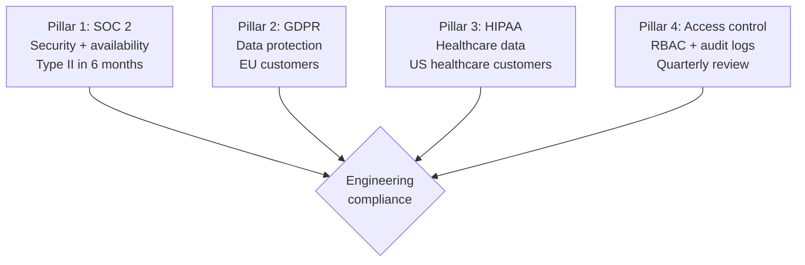
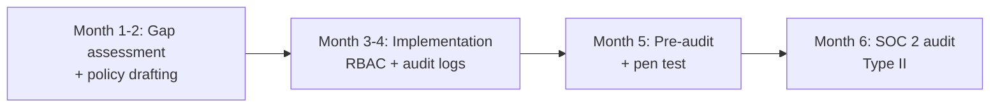

# Engineering Director Playbook
## Chapter 23

# Engineering Regulatory and Compliance

> *"The ED owns engineering compliance. The 4 compliance pillars, the 3 audit cycles, and the 5-criterion compliance quality bar are the ED's reference for engineering compliance at the function level."*

---

## 1. Epigraph

_The ED owns engineering compliance. The 4 compliance pillars, the 3 audit cycles, and the 5-criterion compliance quality bar are the ED's reference for engineering compliance at the function level._

---

## 2. Problem

You are an Engineering Director at acme-corp. The VP has just told you: "60 engineers across 10 EMs. SOC 2 Type II in 6 months. GDPR + HIPAA pending. The current compliance program is ad-hoc. Design the engineering compliance system."

This chapter tells you the 4 compliance pillars, the 3 audit cycles, and the 5-criterion compliance quality bar.

**Decision in one sentence:** _ED engineering compliance is a 4-pillar system (SOC 2 + GDPR + HIPAA + access control) with 3 audit cycles (annual + quarterly + continuous) and 5-criterion compliance quality bar; the ED's job is to design the compliance program, run the audits, and own the certification._

---

## 3. Why EDs Fail Here

Five named failure modes of EDs whose engineering compliance produced zero results.

- **The No-Compliance-Program Failure.** The ED has no compliance program. _Audit failures._
- **The Annual-Only Failure.** Audits are annual. _No continuous monitoring._
- **The No-Access-Control Failure.** No access control. _Security incidents._
- **The No-Documentation Failure.** No documentation. _Audit failures._
- **The No-Owner Failure.** No compliance owner. _No accountability._

---

## 4. Mental Models

Four mental models that compress engineering compliance.

**mental model 1: The 4 Compliance Pillars.** 4 pillars.



**The 4 pillars:**
- **Pillar 1: SOC 2.** Security + availability. Type II in 6 months.
- **Pillar 2: GDPR.** Data protection. EU customers.
- **Pillar 3: HIPAA.** Healthcare data. US healthcare customers.
- **Pillar 4: Access control.** RBAC + audit logs. Quarterly review.

**mental model 2: The 3 Audit Cycles.** 3 cycles.

```
Cycle 1: Annual (SOC 2 Type II)
- 12-month audit window
- Auditor: Big 4
- Outcome: Pass / Fail / Qualified

Cycle 2: Quarterly (internal)
- Access reviews, vulnerability scans
- Owner: ED + EM
- Outcome: Compliance scorecard

Cycle 3: Continuous (monitoring)
- Real-time logs + alerts
- Owner: Security engineer
- Outcome: Daily compliance check
```

**mental model 3: The 5-Criterion Compliance Quality Bar.** 5 criteria.

```
1. Documented (policies + procedures)
2. Owned (ED or EM accountable)
3. Tested (audit + penetration test)
4. Reviewed (quarterly access review)
5. Certified (SOC 2 Type II passed)
```

**mental model 4: The Compliance Roadmap.** 6-month timeline.



**The 4 milestones:**
- **Month 1-2: Gap assessment + policy drafting.**
- **Month 3-4: Implementation (RBAC + audit logs).**
- **Month 5: Pre-audit + pen test.**
- **Month 6: SOC 2 audit Type II.**

---

## 5. Frameworks

Three frameworks for engineering compliance.

### Framework 1: The 1-Page Compliance Roadmap

```
# Engineering Compliance Roadmap — FY[YYYY] — [Date]

## The 4 compliance pillars
1. SOC 2 (Type II, 6 months)
2. GDPR (data protection)
3. HIPAA (healthcare)
4. Access control (RBAC + audit logs)

## The 3 audit cycles
- Annual: SOC 2 Type II
- Quarterly: Internal access review
- Continuous: Real-time monitoring

## Top 3 milestones
1. Month 2: Gap assessment done
2. Month 4: RBAC + audit logs implemented
3. Month 6: SOC 2 Type II passed

## The 1 thing the ED will NOT compromise on
[1 sentence.]
```

### Framework 2: The Access Control Tracker

```
# Access Control Tracker — [Quarter]

| System | Owner | RBAC | Audit logs | Status |
|--------|-------|------|------------|--------|
| Auth | EM 2 | YES | YES | GREEN |
| API Gateway | EM 3 | YES | YES | GREEN |
| Database | EM 3 | YES | YES | GREEN |
| ML serving | EM 4 | PARTIAL | NO | RED |

## Top 3 risks
1. ML serving missing audit logs
2. Database access review overdue
3. RBAC incomplete for new services
```

### Framework 3: The SOC 2 Audit Tracker

```
# SOC 2 Audit Tracker — [Date]

## Audit phases
1. Gap assessment (month 1-2): [Status]
2. Implementation (month 3-4): [Status]
3. Pre-audit (month 5): [Status]
4. Audit (month 6): [Status]

## Top 3 audit risks
1. [Risk 1]
2. [Risk 2]
3. [Risk 3]

## The 1 thing the ED will NOT skip
[1 sentence.]
```

---

## 6. Drill

You are an ED at **acme-corp**. The VP has given you 6 months to achieve SOC 2 Type II.

```
Current: 60 engineers, no compliance program, SOC 2 failed last year
Target: SOC 2 Type II passed in 6 months
GDPR + HIPAA pending
90-day timeline for design.
```

You have **90 minutes**. Produce the **engineering compliance system** (`portfolio/chapter-23-engineering-compliance.md`) using Framework 1 (Compliance Roadmap) + Framework 2 (Access Control) + Framework 3 (SOC 2 Tracker). Specify:

- The 1-page compliance roadmap (4 pillars, 3 cycles, top 3 milestones, the 1 not compromise).
- The access control tracker (top 4 systems, status).
- The SOC 2 audit tracker (4 phases, top 3 risks, the 1 not skip).
- The 90-day timeline.
- The 1 thing you'll say to the VP in the first review.
- The 3 things you'll do to avoid the 5 failure modes.

**Deliverable:** `portfolio/chapter-23-engineering-compliance.md` — under 1500 words.

---

## 7. Worked Example

**The 1-page compliance roadmap:**

```
# Engineering Compliance Roadmap — FY26 — 2026-09-01

## The 4 compliance pillars
1. SOC 2 (Type II, target Q1 2027)
2. GDPR (data protection)
3. HIPAA (healthcare, target Q2 2027)
4. Access control (RBAC + audit logs)

## The 3 audit cycles
- Annual: SOC 2 Type II
- Quarterly: Internal access review
- Continuous: Real-time monitoring

## Top 3 milestones
1. Nov 2026: Gap assessment done
2. Jan 2027: RBAC + audit logs implemented
3. Mar 2027: SOC 2 Type II passed

## The 1 thing I will NOT compromise on
Access control RBAC + audit logs. Without RBAC,
SOC 2 Type II will fail.
```

**The access control tracker:**

```
# Access Control Tracker — Q3 2026

| System | Owner | RBAC | Audit logs | Status |
|--------|-------|------|------------|--------|
| Auth | EM 2 | YES | YES | GREEN |
| API Gateway | EM 3 | YES | YES | GREEN |
| Database | EM 3 | YES | YES | GREEN |
| ML serving | EM 4 | PARTIAL | NO | RED |

## Top 3 risks
1. ML serving missing audit logs (HIGH)
2. Database access review overdue (MEDIUM)
3. RBAC incomplete for new services (MEDIUM)
```

**The SOC 2 audit tracker:**

```
# SOC 2 Audit Tracker — 2026-09-01

## Audit phases
1. Gap assessment (Sept-Oct): IN PROGRESS
2. Implementation (Nov-Dec): TODO
3. Pre-audit (Jan 2027): TODO
4. Audit (Feb-Mar 2027): TODO

## Top 3 audit risks
1. ML serving audit logs missing
2. Database access review overdue
3. New services (2) not in RBAC yet

## The 1 thing I will NOT skip
Quarterly access reviews. Without quarterly reviews,
SOC 2 Type II will fail.
```

**The 1 thing I'll say to the VP in the first review:**

```
"Here's the engineering compliance system:

  4 compliance pillars:
  1. SOC 2 (Type II, target Mar 2027)
  2. GDPR (data protection)
  3. HIPAA (healthcare, target Q2 2027)
  4. Access control (RBAC + audit logs)

  3 audit cycles:
  - Annual: SOC 2 Type II
  - Quarterly: Internal access review
  - Continuous: Real-time monitoring

  Top 3 milestones:
  1. Nov 2026: Gap assessment done
  2. Jan 2027: RBAC + audit logs implemented
  3. Mar 2027: SOC 2 Type II passed

  Top 3 audit risks:
  1. ML serving audit logs missing
  2. Database access review overdue
  3. New services not in RBAC yet

  The 1 thing I want to focus on: RBAC + audit logs.
  Without RBAC, SOC 2 Type II will fail.

  The 1 thing I will NOT compromise on: access control.

  Compliance is the discipline. SOC 2 Type II is the outcome."
```

**The 3 things I'll do to avoid the 5 failure modes:**

```
1. Build 4-pillar compliance program.
   (Avoids the No-Compliance-Program Failure.)
   - SOC 2 + GDPR + HIPAA + access control
   - Documented policies + procedures
   - Quarterly review

2. Run 3 audit cycles.
   (Avoids the Annual-Only Failure.)
   - Annual: SOC 2 Type II
   - Quarterly: Internal access review
   - Continuous: Real-time monitoring

3. Own every system with RBAC + audit logs.
   (Avoids the No-Access-Control Failure.)
   - RBAC for every service
   - Audit logs for every service
   - Quarterly access review
```

---

## 8. Failure Mode Postmortem

An ED at a 200-person B2B AI company had no compliance program. SOC 2 Type II failed last year. The audit found: no RBAC, no audit logs, no documentation. The customer churned because they couldn't pass their own audit.

The replacement ED did 3 things:
1. Built 4-pillar compliance program (SOC 2 + GDPR + HIPAA + access control).
2. Ran 3 audit cycles (annual + quarterly + continuous).
3. Owned every system with RBAC + audit logs.

Within 6 months: SOC 2 Type II passed. GDPR + HIPAA on track. RBAC + audit logs implemented across all systems. The 4-pillar + 3-cycle + 5-criterion system was the discipline.

What the first ED missed: compliance is a system. The first ED had no program. The second ED had 4 pillars + 3 cycles + 5 criteria. The system is the leverage.

The lesson: the ED who has 4 pillars + 3 cycles + 5 criteria has engineering compliance. The ED who has no program has audit failures.

---

## 9. Self-Assessment Rubric

| # | Dimension | 1 (Novice) | 3 (Competent) | 5 (Expert) |
|---|---|---|---|---|
| 1 | **4 compliance pillars** | 0-1 pillars | 2-3 pillars | 4 pillars (SOC 2 + GDPR + HIPAA + access control) |
| 2 | **3 audit cycles** | 1 cycle (annual) | 2 cycles | 3 cycles (annual + quarterly + continuous) |
| 3 | **5-criterion bar** | 0-2 criteria | 3-4 criteria | 5 criteria (documented + owned + tested + reviewed + certified) |
| 4 | **Access control** | No RBAC | Partial RBAC | 100% RBAC + audit logs across all systems |
| 5 | **SOC 2 status** | Not certified | Type I passed | Type II passed |

**Disqualifier:** any 1 on dimension 1 or 2. An ED who has 0-1 pillars or 1 cycle is in the No-Compliance-Program or Annual-Only failure mode.

**Total:** ___ / 25. **Pass threshold:** 18/25, no dimension below 3.

---

## 10. Portfolio Artifact Note

Save your filled-in drill as `portfolio/chapter-23-engineering-compliance.md` — interview evidence for "How do you run engineering compliance?" (see Portfolio Map in Chapter 27).

---

## 11. Interview Questions

1. **Walk me through your engineering compliance system.**
2. **SOC 2 Type II failed. What do you do?**
3. **GDPR customer complaint. What do you do?**
4. **The audit logs are missing. What do you do?**
5. **Walk me through a SOC 2 audit you've led.**
