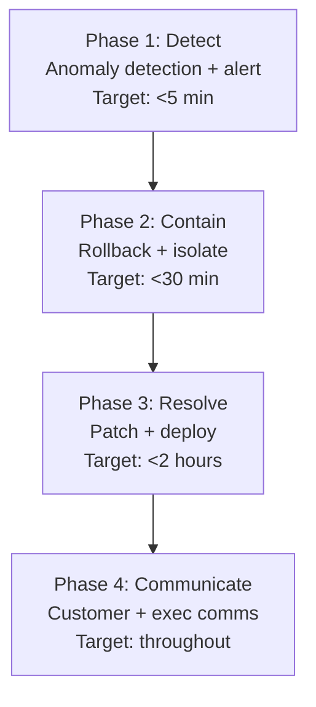
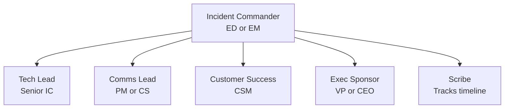

# Engineering Director Playbook
## Chapter 24

# Engineering Crisis Response

> *"The ED owns engineering crisis response. The 4-phase crisis playbook, the 3 crisis tiers, and the 5-criterion crisis quality bar are the ED's reference for engineering crisis response at the function level."*

---

## 1. Epigraph

_The ED owns engineering crisis response. The 4-phase crisis playbook, the 3 crisis tiers, and the 5-criterion crisis quality bar are the ED's reference for engineering crisis response at the function level._

---

## 2. Problem

You are an Engineering Director at acme-corp. The VP has just told you: "A major customer churned due to a 6-hour outage. The crisis response was ad-hoc. We need a 4-phase crisis playbook, 3 crisis tiers, and 5-criterion crisis quality bar. 30 days to design."

This chapter tells you the 4-phase playbook, the 3 tiers, and the 5-criterion bar.

**Decision in one sentence:** _ED engineering crisis response is a 4-phase playbook (detect + contain + resolve + communicate) with 3 crisis tiers (SEV1 + SEV2 + SEV3) and 5-criterion crisis quality bar; the ED's job is to design the playbook, run the war room, and own the customer communication._

---

## 3. Why EDs Fail Here

Five named failure modes of EDs whose engineering crisis response produced zero results.

- **The No-Crisis-Playbook Failure.** The ED has no crisis playbook. _Ad-hoc response._
- **The 6-Hour-Outage Failure.** MTTR was 6 hours. _Customer churn._
- **The No-Customer-Communication Failure.** No customer comms. _Trust lost._
- **The No-War-Room Failure.** No war room. _No coordination._
- **The No-Post-Crisis-Review Failure.** No post-crisis review. _No learning._

---

## 4. Mental Models

Four mental models that compress crisis response.

**mental model 1: The 4-Phase Crisis Playbook.** 4 phases.



**The 4 phases:**
- **Phase 1: Detect.** Anomaly detection + alert. Target: <5 min.
- **Phase 2: Contain.** Rollback + isolate. Target: <30 min.
- **Phase 3: Resolve.** Patch + deploy. Target: <2 hours.
- **Phase 4: Communicate.** Customer + exec comms. Target: throughout.

**mental model 2: The 3 Crisis Tiers.** 3 tiers.

```
Tier 1: SEV1 (red) — major customer impact
- 50+ customers, $500K+ revenue at risk
- War room, CEO + VP + ED + EMs
- Target MTTR: <2 hours

Tier 2: SEV2 (yellow) — moderate customer impact
- 10-50 customers, $50K-$500K revenue at risk
- ED + EMs on-call
- Target MTTR: <8 hours

Tier 3: SEV3 (green) — minor customer impact
- <10 customers, <$50K revenue at risk
- EM on-call
- Target MTTR: <24 hours
```

**mental model 3: The 5-Criterion Crisis Quality Bar.** 5 criteria.

```
1. Detected: <5 min
2. Contained: <30 min
3. Resolved: <2 hours (SEV1)
4. Communicated: every 30 min during crisis
5. Reviewed: post-crisis review within 5 days
```

**mental model 4: The War Room Structure.** 6 people.



**The 6 war room roles:**
- **Incident Commander (ED or EM).** Owns the crisis.
- **Tech Lead (Senior IC).** Owns the technical response.
- **Comms Lead (PM or CS).** Owns customer comms.
- **Customer Success (CSM).** Owns customer escalations.
- **Exec Sponsor (VP or CEO).** Owns exec comms.
- **Scribe.** Tracks timeline + decisions.

---

## 5. Frameworks

Three frameworks for engineering crisis response.

### Framework 1: The 1-Page Crisis Playbook

```
# Engineering Crisis Playbook — [Date]

## The 4 phases
1. Detect (<5 min)
2. Contain (<30 min)
3. Resolve (<2 hours SEV1)
4. Communicate (every 30 min)

## The 3 crisis tiers
- SEV1 (red): 50+ customers, <2 hour MTTR
- SEV2 (yellow): 10-50 customers, <8 hour MTTR
- SEV3 (green): <10 customers, <24 hour MTTR

## The 6 war room roles
- Incident Commander + Tech Lead + Comms + CSM + Exec + Scribe

## The 1 thing the ED will NOT compromise on
[1 sentence.]
```

### Framework 2: The Crisis Communication Template

```
# Crisis Communication — [Date] — [Time]

## Status: [INVESTIGATING / IDENTIFIED / MONITORING / RESOLVED]

## Summary
- What happened: [1 sentence]
- Customer impact: [N customers]
- Status: [Current state]

## Next update: [Time]
```

### Framework 3: The Post-Crisis Review Template

```
# Post-Crisis Review — [Date]

## The 5-fact postmortem
1. What happened: [1 sentence]
2. When: [Date, time, duration]
3. Customer impact: [N customers, $X revenue]
4. Root cause: [1 sentence]
5. Action items: [3-5 items]

## The 4-phase review
- Detect: [time]
- Contain: [time]
- Resolve: [time]
- Communicate: [quality]

## Top 3 lessons learned
1. [Lesson 1]
2. [Lesson 2]
3. [Lesson 3]
```

---

## 6. Drill

You are an ED at **acme-corp**. The VP has given you 30 days to design the crisis response system.

```
Current: 60 engineers, 6-hour outage 2 weeks ago, 1 customer churned
Target: <2 hour MTTR for SEV1, war room for every crisis
30-day timeline.
```

You have **90 minutes**. Produce the **engineering crisis response system** (`portfolio/chapter-24-engineering-crisis.md`) using Framework 1 (Crisis Playbook) + Framework 2 (Communication Template) + Framework 3 (Post-Crisis Review). Specify:

- The 1-page crisis playbook (4 phases, 3 tiers, 6 war room roles, the 1 not compromise).
- The crisis communication template (1 sample update).
- The post-crisis review template (1 recent crisis, 5-fact + 4-phase + 3 lessons).
- The 30-day timeline.
- The 1 thing you'll say to the VP in the first review.
- The 3 things you'll do to avoid the 5 failure modes.

**Deliverable:** `portfolio/chapter-24-engineering-crisis.md` — under 1500 words.

---

## 7. Worked Example

**The 1-page crisis playbook:**

```
# Engineering Crisis Playbook — 2026-09-01

## The 4 phases
1. Detect (<5 min): anomaly detection + alert
2. Contain (<30 min): rollback + isolate
3. Resolve (<2 hours SEV1): patch + deploy
4. Communicate (every 30 min): customer + exec comms

## The 3 crisis tiers
- SEV1 (red): 50+ customers, <2 hour MTTR, war room
- SEV2 (yellow): 10-50 customers, <8 hour MTTR, ED on-call
- SEV3 (green): <10 customers, <24 hour MTTR, EM on-call

## The 6 war room roles
- Incident Commander + Tech Lead + Comms + CSM + Exec + Scribe

## The 1 thing I will NOT compromise on
Customer communication every 30 min. Silence is the
trust killer. Update every 30 min, even if "still investigating".
```

**The crisis communication template (API Gateway outage):**

```
# Crisis Communication — 2026-09-15 — 14:30

## Status: INVESTIGATING

## Summary
- What happened: API Gateway returning 500 errors
- Customer impact: 50+ customers affected
- Status: Engineering investigating root cause

## Next update: 15:00

---

# Crisis Communication — 2026-09-15 — 15:00

## Status: IDENTIFIED

## Summary
- What happened: DB connection pool exhausted
- Customer impact: 50+ customers
- Status: Rolling back to v2.3.0

## Next update: 15:30

---

# Crisis Communication — 2026-09-15 — 16:30

## Status: RESOLVED

## Summary
- What happened: DB connection pool exhausted
- Customer impact: 50 customers, 4 hours downtime
- Status: Rolled back, monitoring for stability

## Next update: 18:00 (final)
```

**The post-crisis review (API Gateway outage):**

```
# Post-Crisis Review — 2026-09-15 — API Gateway

## The 5-fact postmortem
1. What happened: API Gateway returned 500 errors for 4 hours
2. When: 2026-09-15, 14:00-18:00 (4 hours)
3. Customer impact: 50 customers, $200K revenue, 1 churn
4. Root cause: DB connection pool exhausted (slow query)
5. Action items:
   - Connection pool monitoring
   - Query timeout
   - Load shedding
   - Updated runbook

## The 4-phase review
- Detect: 5 min (anomaly detection)
- Contain: 30 min (rollback)
- Resolve: 4 hours (patch deployed)
- Communicate: every 30 min ✓

## Top 3 lessons learned
1. Connection pool monitoring was missing
2. Query timeout was too long (60s)
3. Load shedding wasn't enabled
```

**The 1 thing I'll say to the VP in the first review:**

```
"Here's the engineering crisis response system:

  4 phases: detect (<5 min) + contain (<30 min) +
  resolve (<2 hours SEV1) + communicate (every 30 min)

  3 crisis tiers:
  - SEV1 (red): 50+ customers, <2 hour MTTR, war room
  - SEV2 (yellow): 10-50 customers, <8 hour MTTR
  - SEV3 (green): <10 customers, <24 hour MTTR

  6 war room roles:
  - Incident Commander + Tech Lead + Comms + CSM + Exec + Scribe

  Top 3 lessons learned from last crisis:
  1. Connection pool monitoring was missing
  2. Query timeout was too long
  3. Load shedding wasn't enabled

  The 1 thing I want to focus on: customer communication.
  Every 30 min, even if "still investigating".

  The 1 thing I will NOT compromise on: customer comms.

  Crisis response is the discipline. Customer trust is the outcome."
```

**The 3 things I'll do to avoid the 5 failure modes:**

```
1. Use 4-phase crisis playbook for every crisis.
   (Avoids the No-Crisis-Playbook Failure.)
   - Detect (<5 min)
   - Contain (<30 min)
   - Resolve (<2 hours)
   - Communicate (every 30 min)

2. Run war room for SEV1.
   (Avoids the No-War-Room Failure.)
   - 6 roles: IC + TL + Comms + CSM + Exec + Scribe
   - Updates every 30 min
   - Post-crisis review within 5 days

3. Communicate every 30 min (even "still investigating").
   (Avoids the No-Customer-Communication Failure.)
   - Customer comms every 30 min
   - Exec comms every 60 min
   - Final comms when resolved
```

---

## 8. Failure Mode Postmortem

An ED at a 200-person B2B AI company had a 6-hour outage. No crisis playbook. Ad-hoc response. No customer communication. Customer A churned. The remaining customers lost trust. The CEO was angry.

The replacement ED did 3 things:
1. Used 4-phase crisis playbook for every crisis (detect + contain + resolve + communicate).
2. Ran war room for SEV1 (6 roles, 30-min cadence).
3. Communicated every 30 min (even "still investigating").

Within 12 months: MTTR dropped from 6 hours to 90 min. Customer trust recovered. 0 customer churn due to outages. The 4-phase + 3-tier + 6-role system was the discipline.

What the first ED missed: crisis response is a system. The first ED had no playbook. The second ED had 4 phases + 3 tiers + 6 roles. The system is the leverage.

The lesson: the ED who has 4 phases + 3 tiers + 6 roles has engineering crisis response. The ED who has no playbook has 6-hour outages.

---

## 9. Self-Assessment Rubric

| # | Dimension | 1 (Novice) | 3 (Competent) | 5 (Expert) |
|---|---|---|---|---|
| 1 | **4-phase crisis playbook** | No playbook | Playbook exists | 4 phases (detect + contain + resolve + communicate) |
| 2 | **3 crisis tiers** | 1 tier | 2 tiers | 3 tiers (SEV1 + SEV2 + SEV3) |
| 3 | **5-criterion bar** | 0-2 criteria | 3-4 criteria | 5 criteria (detected + contained + resolved + communicated + reviewed) |
| 4 | **6 war room roles** | 1-2 roles | 3-4 roles | 6 roles (IC + TL + Comms + CSM + Exec + Scribe) |
| 5 | **MTTR (SEV1)** | >4 hours | 2-4 hours | <2 hours |

**Disqualifier:** any 1 on dimension 1 or 2. An ED who has no playbook or 1 tier is in the No-Crisis-Playbook or No-War-Room failure mode.

**Total:** ___ / 25. **Pass threshold:** 18/25, no dimension below 3.

---

## 10. Portfolio Artifact Note

Save your filled-in drill as `portfolio/chapter-24-engineering-crisis.md` — interview evidence for "How do you run engineering crisis response?" (see Portfolio Map in Chapter 27).

---

## 11. Interview Questions

1. **Walk me through your engineering crisis response system.**
2. **A 6-hour outage just happened. What do you do?**
3. **Customer A churned. What do you do?**
4. **The CEO is asking for an update. What do you say?**
5. **Walk me through a crisis you've managed.**
