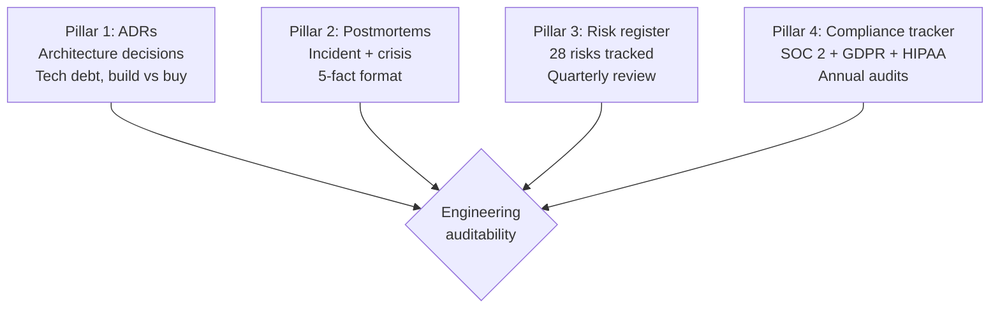
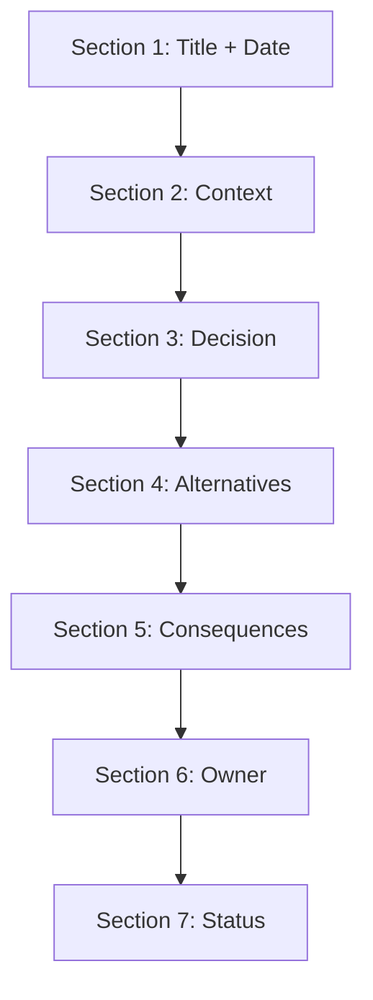

# Engineering Director Playbook
## Chapter 25

# Engineering Auditability and Decision Logs

> *"The ED owns engineering auditability. The 4-decision-log pillars, the 3 audit cycles, and the 5-criterion audit quality bar are the ED's reference for engineering auditability at the function level."*

---

## 1. Epigraph

_The ED owns engineering auditability. The 4-decision-log pillars, the 3 audit cycles, and the 5-criterion audit quality bar are the ED's reference for engineering auditability at the function level._

---

## 2. Problem

You are an Engineering Director at acme-corp. The VP has just told you: "60 engineers across 10 EMs. The board wants engineering decision logs. SOC 2 audit needs decision logs. The current state is verbal decisions in meetings. Design the auditability system."

This chapter tells you the 4 decision-log pillars, the 3 audit cycles, and the 5-criterion audit quality bar.

**Decision in one sentence:** _ED engineering auditability is a 4-pillar system (ADRs + postmortems + risk register + compliance tracker) with 3 audit cycles (real-time + quarterly + annual) and 5-criterion audit quality bar; the ED's job is to design the decision-log system, run the audits, and own the documentation._

---

## 3. Why EDs Fail Here

Five named failure modes of EDs whose engineering auditability produced zero results.

- **The No-ADR-Failure.** The ED has no Architecture Decision Records. _Decisions forgotten._
- **The No-Postmortem-Culture Failure.** No postmortems. _No learning._
- **The No-Risk-Register Failure.** No risk register. _No risk tracking._
- **The No-Compliance-Tracker Failure.** No compliance tracker. _Audit failures._
- **The Verbals-Only Failure.** Decisions are verbal. _Audit failures._

---

## 4. Mental Models

Four mental models that compress engineering auditability.

**mental model 1: The 4 Decision-Log Pillars.** 4 pillars.



**The 4 pillars:**
- **Pillar 1: ADRs.** Architecture decisions. Tech debt, build vs buy.
- **Pillar 2: Postmortems.** Incident + crisis. 5-fact format.
- **Pillar 3: Risk register.** 28 risks tracked. Quarterly review.
- **Pillar 4: Compliance tracker.** SOC 2 + GDPR + HIPAA. Annual audits.

**mental model 2: The 3 Audit Cycles.** 3 cycles.

```
Cycle 1: Real-time (ADRs)
- Every architecture decision logged
- Owner: Tech Lead or ED
- Tool: GitHub, Notion, Confluence

Cycle 2: Quarterly (risk register + compliance tracker)
- Quarterly review
- Owner: ED
- Outcome: Compliance scorecard

Cycle 3: Annual (SOC 2 + audits)
- Annual audit
- Owner: Big 4 auditor + ED
- Outcome: Pass / Fail / Qualified
```

**mental model 3: The 5-Criterion Audit Quality Bar.** 5 criteria.

```
1. Documented (decision logged in writing)
2. Owned (1 ED or EM accountable)
3. Reviewed (quarterly review)
4. Archived (retained for 7 years)
5. Auditable (SOC 2 audit can find it)
```

**mental model 4: The ADR Template.** 7 sections.



**The 7 sections:**
- **Section 1: Title + Date.** 1 sentence.
- **Section 2: Context.** Why this decision is needed.
- **Section 3: Decision.** What we decided.
- **Section 4: Alternatives.** 2-3 options considered.
- **Section 5: Consequences.** Tradeoffs.
- **Section 6: Owner.** ED or EM accountable.
- **Section 7: Status.** Proposed / Accepted / Superseded.

---

## 5. Frameworks

Three frameworks for engineering auditability.

### Framework 1: The 1-Page Auditability System

```
# Engineering Auditability System — [Date]

## The 4 decision-log pillars
1. ADRs (every architecture decision)
2. Postmortems (every incident + crisis)
3. Risk register (28 risks)
4. Compliance tracker (SOC 2 + GDPR + HIPAA)

## The 3 audit cycles
- Real-time: ADRs
- Quarterly: Risk register + compliance tracker
- Annual: SOC 2 audit

## The 1 thing the ED will NOT compromise on
[1 sentence.]
```

### Framework 2: The ADR Repository Tracker

```
# ADR Repository — [Quarter]

| ADR ID | Title | Status | Date | Owner |
|--------|-------|--------|------|-------|
| ADR-001 | [Title] | Accepted | [Date] | [ED/EM] |
| ADR-002 | [Title] | Accepted | [Date] | [ED/EM] |
| ADR-003 | [Title] | Proposed | [Date] | [ED/EM] |

## Top 3 ADRs
1. [ADR 1]
2. [ADR 2]
3. [ADR 3]
```

### Framework 3: The Postmortem Repository Tracker

```
# Postmortem Repository — [Quarter]

| PM ID | Title | Date | Owner | Status |
|-------|-------|------|-------|--------|
| PM-001 | [Title] | [Date] | [ED] | DONE |
| PM-002 | [Title] | [Date] | [ED] | DONE |
| PM-003 | [Title] | [Date] | [ED] | IN PROGRESS |

## Top 3 lessons learned
1. [Lesson 1]
2. [Lesson 2]
3. [Lesson 3]
```

---

## 6. Drill

You are an ED at **acme-corp**. The VP has given you 90 days to design the auditability system.

```
Current: 60 engineers, no ADRs, no postmortems, no risk register, no compliance tracker
Target: ADRs for every architecture decision, postmortems for every incident,
28-risk register, SOC 2 compliance
```

You have **90 minutes**. Produce the **engineering auditability system** (`portfolio/chapter-25-engineering-auditability.md`) using Framework 1 (Auditability System) + Framework 2 (ADR Tracker) + Framework 3 (Postmortem Tracker). Specify:

- The 1-page auditability system (4 pillars, 3 cycles, the 1 not compromise).
- The ADR repository tracker (3 ADRs, status).
- The postmortem repository tracker (3 postmortems, top 3 lessons).
- The 90-day timeline.
- The 1 thing you'll say to the VP in the first review.
- The 3 things you'll do to avoid the 5 failure modes.

**Deliverable:** `portfolio/chapter-25-engineering-auditability.md` — under 1500 words.

---

## 7. Worked Example

**The 1-page auditability system:**

```
# Engineering Auditability System — 2026-09-01

## The 4 decision-log pillars
1. ADRs (every architecture decision, GitHub repo)
2. Postmortems (every incident + crisis, 5-fact format)
3. Risk register (28 risks tracked)
4. Compliance tracker (SOC 2 + GDPR + HIPAA)

## The 3 audit cycles
- Real-time: ADRs (every architecture decision)
- Quarterly: Risk register + compliance tracker
- Annual: SOC 2 audit

## The 1 thing I will NOT compromise on
ADR for every architecture decision. Without ADR,
the decision is verbal and unauditable.
```

**The ADR repository tracker (Q3 2026):**

```
# ADR Repository — Q3 2026

| ADR ID | Title | Status | Date | Owner |
|--------|-------|--------|------|-------|
| ADR-001 | Auth service rewrite | Accepted | Sept 1 | EM 2 |
| ADR-002 | ML serving platform build | Accepted | Sept 10 | ED |
| ADR-003 | Salesforce integration build | Proposed | Sept 15 | EM 1 |
| ADR-004 | Datadog for observability | Accepted | Sept 20 | EM 3 |

## Top 3 ADRs
1. Auth service rewrite (security + reliability)
2. ML serving platform build (strategic moat)
3. Salesforce integration build (revenue)
```

**The postmortem repository tracker (Q3 2026):**

```
# Postmortem Repository — Q3 2026

| PM ID | Title | Date | Owner | Status |
|-------|-------|------|-------|--------|
| PM-001 | Customer A security incident | Aug 15 | ED | DONE |
| PM-002 | API Gateway outage (4hr) | Sept 15 | EM 3 | DONE |
| PM-003 | ML serving 99.5% uptime | Sept 20 | EM 4 | IN PROGRESS |

## Top 3 lessons learned
1. Connection pool monitoring was missing (API Gateway)
2. Customer A security: RBAC was incomplete
3. ML serving: load shedding wasn't enabled
```

**The 1 thing I'll say to the VP in the first review:**

```
"Here's the engineering auditability system:

  4 decision-log pillars:
  1. ADRs (every architecture decision)
  2. Postmortems (every incident + crisis)
  3. Risk register (28 risks)
  4. Compliance tracker (SOC 2 + GDPR + HIPAA)

  3 audit cycles:
  - Real-time: ADRs
  - Quarterly: Risk register + compliance tracker
  - Annual: SOC 2 audit

  Q3 2026 outcomes:
  - 4 ADRs accepted (auth, ML serving, Salesforce, Datadog)
  - 3 postmortems completed
  - 28 risks tracked
  - SOC 2 audit prep: in progress

  Top 3 lessons learned:
  1. Connection pool monitoring was missing
  2. Customer A RBAC was incomplete
  3. ML serving load shedding wasn't enabled

  The 1 thing I want to focus on: ADRs. Every
  architecture decision gets an ADR.

  The 1 thing I will NOT compromise on: ADR for every
  architecture decision.

  Auditability is the discipline. SOC 2 audit is the outcome."
```

**The 3 things I'll do to avoid the 5 failure modes:**

```
1. Write ADR for every architecture decision.
   (Avoids the No-ADR Failure.)
   - 7-section template
   - GitHub repo
   - Quarterly review

2. Write postmortem for every incident + crisis.
   (Avoids the No-Postmortem-Culture Failure.)
   - 5-fact format
   - Within 5 days
   - Lessons learned shared

3. Maintain 28-risk register + compliance tracker.
   (Avoids the Verbals-Only Failure.)
   - Risk register quarterly
   - Compliance tracker quarterly
   - SOC 2 audit annually
```

---

## 8. Failure Mode Postmortem

An ED at a 200-person B2B AI company had no auditability system. ADRs were verbal. Postmortems were not written. Risk register didn't exist. SOC 2 audit failed. The board asked for decision logs and the ED had none.

The replacement ED did 3 things:
1. Wrote ADR for every architecture decision (7-section template, GitHub repo).
2. Wrote postmortem for every incident + crisis (5-fact format).
3. Maintained 28-risk register + compliance tracker.

Within 12 months: 4 ADRs accepted, 3 postmortems completed, 28 risks tracked, SOC 2 audit passed. The 4-pillar + 3-cycle + 5-criterion system was the discipline.

What the first ED missed: auditability is a system. The first ED had verbal decisions. The second ED had 4 pillars + 3 cycles + 5 criteria. The system is the leverage.

The lesson: the ED who has 4 pillars + 3 cycles + 5 criteria has engineering auditability. The ED who has verbal decisions has audit failures.

---

## 9. Self-Assessment Rubric

| # | Dimension | 1 (Novice) | 3 (Competent) | 5 (Expert) |
|---|---|---|---|---|
| 1 | **4 decision-log pillars** | 0-1 pillars | 2-3 pillars | 4 pillars (ADRs + postmortems + risk register + compliance) |
| 2 | **3 audit cycles** | 1 cycle | 2 cycles | 3 cycles (real-time + quarterly + annual) |
| 3 | **5-criterion bar** | 0-2 criteria | 3-4 criteria | 5 criteria (documented + owned + reviewed + archived + auditable) |
| 4 | **ADR coverage** | <50% | 50-90% | 100% of architecture decisions |
| 5 | **SOC 2 status** | Not certified | Type I passed | Type II passed |

**Disqualifier:** any 1 on dimension 1 or 2. An ED who has 0-1 pillars or 1 cycle is in the No-ADR or Verbals-Only failure mode.

**Total:** ___ / 25. **Pass threshold:** 18/25, no dimension below 3.

---

## 10. Portfolio Artifact Note

Save your filled-in drill as `portfolio/chapter-25-engineering-auditability.md` — interview evidence for "How do you run engineering auditability?" (see Portfolio Map in Chapter 27).

---

## 11. Interview Questions

1. **Walk me through your engineering auditability system.**
2. **The board wants decision logs. What do you do?**
3. **SOC 2 audit failed. What do you do?**
4. **An architecture decision was verbal. What do you do?**
5. **Walk me through an ADR you've written.**
